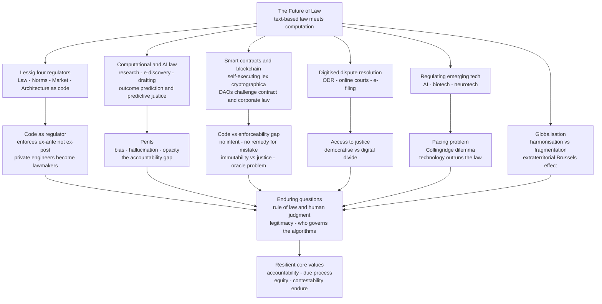

# 🔮 The Future of Law

> [!abstract] TL;DR
> **Law is itself a technology** — an ancient, text-based operating system for social ordering — and it is now being reshaped by *newer* technologies faster than at any point since the printing press. The organising idea is Lawrence Lessig's **"code is law"**: software architecture regulates behaviour *alongside* law, social norms, and markets, and increasingly *encodes* legal rules directly (a **smart contract** does not *threaten* a penalty for breach — it makes breach *impossible* by construction). Four forces are converging: **computational and AI-driven practice** (legaltech for research, e-discovery, contract review and drafting, and outcome prediction / "predictive justice" — with real perils of **bias, hallucination, and opacity**); **the automation of legal work** and the transformation of the profession (Susskind's *end of lawyers?* thesis — routine tasks automate, but *judgment, empathy, advocacy, and accountability* remain human); **blockchain and "lex cryptographica"** (self-executing agreements and **DAOs** that strain contract and corporate law, exposing the gap between *code that executes* and *promises that are legally enforceable*); and **the digitisation of dispute resolution and courts** (ODR), which could either *democratise* access to justice or entrench the **digital divide**. Over all of it hangs the **pacing problem** — technology perennially outruns the law meant to govern it — and the enduring question of **the rule of law and human judgment in an automated world**: *who governs the algorithms, and can legitimacy survive when decisions become computations?*

---

## Intuition

**Analogy:** Think of society as running on an operating system. For millennia the OS was **law** — human-readable rules, interpreted by human judges, enforced *after the fact* by human officials. It is slow, ambiguous, and appealable, and those "bugs" are actually features: they leave room for mercy, context, and correction. Now imagine bolting on a second OS written in **software** — rules that execute *automatically*, the same way every time, *before* you can break them. A speed bump does not issue you a ticket for speeding; it makes speeding physically unpleasant right now. A paywall does not *sue* you for reading without paying; it simply will not render the page. A **smart contract** does not *warn* you that non-payment is a breach; it refuses to release the asset until the coins arrive. In each case, *architecture* has quietly become a **regulator** — and the question of the future of law is how the old, humane, arguable OS coexists with the new, rigid, automatic one.

Lawrence Lessig compressed this into three words: **"code is law."** He meant it descriptively, not as a slogan — that in the digital world, *how software is built* constrains what people can do just as surely as any statute, and the people who write the code are therefore writing rules of conduct whether they intend to or not. The future of law is the story of these two operating systems — text and code, judgment and computation — competing, colliding, and increasingly *merging*.

---

## How It Works

### The synthesis: what this vault has been building toward

This is the **capstone** of the Law vault, so start by seeing the whole. The vault mapped law as a layered system: its **foundations** — where law comes from and how it is read ([[Sources_of_Law]], [[Legal_Reasoning_and_Interpretation]]) and what it is *for* ([[Philosophy_of_Law_Jurisprudence]]); its **public-law skeleton** — the constraints that keep power accountable ([[Rule_of_Law_and_Due_Process]], [[Administrative_Law_and_Regulation]]); its **private-law machinery** — how strangers coordinate and exchange ([[Contract_Law]], [[Commercial_and_Corporate_Law]]); the **criminal law** and its digital frontier ([[Cybercrime_and_Digital_Law]]); and the **transnational order** that stitches jurisdictions together ([[Public_International_Law]]). The future of law is not a new subject *bolted onto* these — it is a **stress test** applied to *all* of them at once. Every force below asks the same question of a different layer: *what happens to this legal institution when computation can partly replace, and partly encode, what humans used to do?*

### Force 1 — "Code is law": architecture as a fourth regulator

Lessig's foundational move was to identify **four modalities of regulation** that constrain behaviour: **law** (rules backed by state sanction), **social norms** (informal community enforcement), **markets** (price as a constraint), and **architecture** — the physical or *code* environment that makes some actions easy and others impossible. His insight was that in cyberspace, **architecture is the dominant regulator**, and architecture is *code*. This matters because code regulates *differently* from law:

- **Ex-ante vs ex-post.** Law mostly punishes *after* the fact and relies on the threat of sanction; code enforces *before* the fact by making the forbidden action impossible. There is no trial, no appeal, no jury nullification, no prosecutorial discretion.
- **Perfect and invisible.** A statute can be broken; well-written code often *cannot* be. And the "law" embedded in code is opaque — users experience it as "the way the system works," not as a rule someone chose and could have chosen differently.
- **Private legislators.** When architecture regulates, the *engineers and platforms* who build it become de facto lawmakers, without the legitimacy, transparency, or accountability of the public process. This is the deep worry: rule-by-code can route *around* the rule of law.

### Force 2 — Computational and AI-driven law (legaltech)

Legal work is unusually exposed to AI because so much of it is **language in, language out**: reading documents, finding precedent, drafting text, predicting outcomes. Concretely:

1. **Legal research** — retrieval-augmented systems surface relevant statutes and cases in seconds instead of hours.
2. **E-discovery** — machine classification of millions of documents for relevance and privilege, the earliest and most mature legaltech (technology-assisted review is now judicially *blessed*).
3. **Contract review and drafting** — large language models flag risky clauses, compare against playbooks, and generate first drafts.
4. **Outcome prediction / "predictive justice"** — models trained on past decisions estimate the probability a motion succeeds, a case settles, or (controversially) a defendant reoffends.

The **perils** are structural and map exactly onto this vault's AI notes: **bias** (a model trained on historically biased decisions *launders* that bias into a veneer of objectivity — see [[AI_Bias_and_Fairness]]); **hallucination** (an LLM will fabricate plausible-sounding case citations, a failure that has already produced *sanctioned lawyers* who filed fake precedents); and **opacity** (a black-box prediction offends the **due-process** requirement that decisions be *reasoned and contestable* — see [[Explainable_AI]], [[Responsible_AI]]). France went so far as to *ban* the statistical analysis of individual judges' rulings — a signal of how threatening "predictive justice" feels to judicial legitimacy.

### Force 3 — The automation of legal work and the reshaping of the profession

Richard Susskind's provocation — *The End of Lawyers?* — is best read not as prophecy but as a **task-decomposition** claim. A "lawyer" is a *bundle* of tasks with very different automation exposure. **Routine, high-volume, structured tasks** (document review, standard research, first-draft drafting, due diligence) are highly automatable. **Bespoke, high-judgment, relational tasks** (courtroom advocacy, strategic counsel, negotiation under uncertainty, and *bearing accountability* for a decision) are not — because they require empathy, persuasion, legitimacy, and someone a court and a client can *hold responsible*. The likely future is therefore **not** the disappearance of lawyers but a **reshaping**: fewer hours billed for grunt work, new roles (legal knowledge engineer, legal-project manager, legal-AI auditor), and a widening premium on the irreducibly human. The Python demo makes this task-based model quantitative.

### Force 4 — Smart contracts, blockchain, and "lex cryptographica"

A **smart contract** is code deployed on a blockchain that executes automatically when conditions are met — "if payment received, transfer the deed." Its promise is **self-enforcement** without courts or intermediaries; its ideology (Primavera De Filippi's **"lex cryptographica"**) is that *code can replace legal enforceability altogether*. **DAOs** (decentralised autonomous organisations) push this furthest: an "organisation" that is *just* smart-contract governance, with no board, no registered office, and no clear jurisdiction — a direct challenge to [[Commercial_and_Corporate_Law]]. But the **gap between code and law** is stubborn:

- **Code executes; it does not *mean*.** A contract in law is a *meeting of minds* a court can interpret in light of intent, good faith, and changed circumstances. Code has no intent and cannot be *reformed* for mistake, fraud, duress, or unconscionability — the doctrines [[Contract_Law]] uses to do justice.
- **Immutability vs remedy.** "The code is the contract" sounds clean until the code has a bug. The 2016 **DAO hack** drained tens of millions because the code did *exactly* what it said — and the community's response (a hard fork to reverse it) proved that when enough value is at stake, *humans override the code*, which quietly concedes that code is **not** the final law.
- **The oracle problem.** Smart contracts are blind to the real world; they need trusted **oracles** ([[Oracles_and_Data_Feeds]]) to tell them whether a flight was late or a shipment arrived — reintroducing exactly the trusted intermediary the technology promised to remove.

The realistic future is **hybrid**: code handles automatic *performance* (escrow, settlement), while traditional law supplies *interpretation, remedy, and legitimacy* — often via a "**Ricardian contract**" that pairs human-readable legal prose with machine-executable code. (See [[Solidity_Programming]], [[Distributed_Ledgers_and_Trilemma]], [[Upgradeable_Contracts]], [[Smart_Contract_Security_Tools]] for the technical substrate.)

### Force 5 — ODR, digital courts, and access to justice

**Online dispute resolution (ODR)** moves negotiation, mediation, and even adjudication onto software. eBay's ODR system resolves *tens of millions* of disputes a year without a single judge; the UK's Civil Money Claims and Canada's Civil Resolution Tribunal digitise low-value civil justice. The stakes are the vault's oldest theme — the **rule of law is worthless if people cannot actually reach it**. Technology's promise is **democratisation**: cheaper, faster, self-service justice for the "latent legal need" that never reaches a lawyer. Its peril is the **digital divide**: online-only courts can *exclude* the poor, the elderly, and the digitally illiterate, converting a technology of access into a new barrier. The same tool cuts both ways.

### Force 6 — The pacing problem, globalisation, and the enduring questions

The **pacing problem** — technology moves at the speed of software, law at the speed of legislatures — means regulation of AI, biotech, and neurotech is *permanently* behind. The **Collingridge dilemma** sharpens it: *early* on, we can regulate cheaply but do not yet understand the technology; *later*, we understand it but it is entrenched and expensive to change. **Globalisation** adds fragmentation — a borderless internet meets territorial law (the theme of [[Cybercrime_and_Digital_Law]]) — driving both **harmonisation** (GDPR-style extraterritorial "Brussels effect") and **fragmentation** (splinternets, data-localisation). Underneath everything sits the capstone question: **can the rule of law survive the delegation of judgment to machines?** Legitimacy in law comes not only from *correct outcomes* but from *reasoned, accountable, contestable* human decision-making. An algorithm can be accurate and still illegitimate if no one can explain it, challenge it, or be held responsible for it. *Who governs the algorithms* becomes the constitutional question of the century.

### Flow / Architecture — the forces reshaping law and where they converge



---

## Key Concepts

**Secondary / High-school level.** Law is a very old technology for keeping order — written rules, judges, and police. Now *newer* technologies are changing it fast. Computers and **AI** can already do a lot of a lawyer's work: read piles of documents, look up past cases, and write first drafts of contracts. This makes law cheaper and faster, but the AI can be *biased* (it copies unfair patterns from the past) or just *make things up* (invent fake cases). A big new idea is the **"smart contract"** — an agreement written as computer code that runs *by itself*: "if you pay, you automatically get the thing." That is powerful, but code cannot understand *fairness* or fix a mistake the way a human judge can. Courts are also moving **online**, which could help millions of people who cannot afford a lawyer — unless they have no internet, in which case it leaves them out. The big worry for the future is simple: if machines start making legal decisions, **who is responsible when they get it wrong, and how do we argue back?**

**Undergraduate level.** Anchor everything on **Lessig's "code is law"**: behaviour is regulated by *four* modalities — **law, norms, markets, and architecture (code)** — and in digital life, architecture dominates, so *how software is built is a form of regulation*. Distinguish **ex-ante enforcement by code** (the forbidden act is made impossible) from **ex-post enforcement by law** (the act is punished afterward and can be appealed) — the difference is why rule-by-code can bypass the rule of law. Learn the **legaltech stack** (research, e-discovery / technology-assisted review, contract analytics, predictive justice) and its **three named perils** — **bias**, **hallucination**, **opacity** — and why each collides with **due process**. Understand **Susskind's task-decomposition** argument: a lawyer is a *bundle of tasks* with different automation exposure; routine/structured tasks automate, judgment/relational tasks resist, so the profession *reshapes* rather than disappears. Grasp **smart contracts** and **"lex cryptographica"**, why **DAOs** challenge corporate and contract law, and the **code-vs-enforceability gap** (no intent, no remedy for fraud/mistake, immutability vs equitable relief, the **oracle problem**). Finally, connect **ODR** to **access to justice** (democratisation vs the digital divide) and name the **pacing problem** (law lags technology).

**Graduate / professional level.** Interrogate the field's deep tensions. **(1) The legitimacy of rule-by-code.** If architecture regulates *perfectly, invisibly, and privately*, it evades the three things that make law *law* under [[Rule_of_Law_and_Due_Process]]: **generality, publicity, and contestability**. A smart contract is *transparent as code* yet *opaque as governance* — auditable by engineers, unaccountable to the governed. The normative question is whether ex-ante code enforcement can ever satisfy the value pluralism (mercy, proportionality, changed circumstances) that ex-post human adjudication is *designed* to preserve. **(2) The accountability gap in algorithmic decision-making.** Predictive justice and administrative-automation systems (see [[Administrative_Law_and_Regulation]]) create a *responsibility vacuum*: the model is not a legal person, the vendor disclaims via contract, and the official "rubber-stamps" an output they cannot interrogate — so *no one* is meaningfully accountable, defeating the due-process demand for a *reasoned, reviewable* decision. **(3) The code-vs-law incompleteness result.** Contract theory's *incomplete contracts* insight — no agreement can specify every contingency, which is *why* we need courts to fill gaps ex-post via doctrines of good faith and interpretation — is a near-formal proof that **pure lex cryptographica is impossible**: any sufficiently complete real-world agreement must eventually appeal to human judgment (an oracle, a fork, a court), so "code is law" collapses into "code plus law." **(4) The pacing problem as a permanent condition, not a bug.** Because the **Collingridge dilemma** makes *early* regulation ignorant and *late* regulation impotent, the frontier is *adaptive* governance — regulatory sandboxes, principles-based and outcomes-based rules, sunset clauses, co-regulation — rather than the fantasy of a comprehensive statute. **(5) The distributional stakes.** Legaltech can *close* the access-to-justice gap (self-service tools for the 80% of civil legal needs that go unmet) or *widen* it (a two-tier system where the rich get bespoke human lawyers and the poor get chatbots and algorithmic tribunals). Which outcome obtains is a *policy choice*, not a technological destiny. **(6) The resilient core.** The recurring lesson — the DAO fork, sanctioned hallucinating lawyers, the France ban, the human override every time stakes are high — is that when computation and legal values collide, societies keep re-inserting **human judgment and accountability**. The durable prediction is not "the end of law" but the **persistence of law's core values** in new institutional clothing.

---

## Python Demo

```python
# A task-based model of how AI automation reshapes legal work.
#
# IDEA (Susskind / Autor task-decomposition): a "lawyer" is a BUNDLE of tasks
# with very different automation exposure. Routine, structured, language-in/
# language-out tasks (doc review, research, drafting, due diligence) are highly
# automatable; judgment/relational tasks (negotiation, advocacy, counsel) are
# not. As adoption grows (a logistic S-curve), machine hours displace routine
# human hours -- while cheaper legal services INDUCE new demand, and the human
# work that remains shifts toward the high-judgment end.
#
# LEFT  : automation-exposure of each legal task (which work is most exposed).
# RIGHT : projection 2025..2045 of the human-hour MIX -- routine human work
#         shrinks, human-centric work grows, and the share of remaining human
#         work that is high-judgment rises. Estimates are synthetic but reasoned.
import numpy as np
import matplotlib.pyplot as plt

# --- Task model -----------------------------------------------------------
tasks = ["Document review /\ne-discovery", "Legal research", "Drafting\n(standard docs)",
         "Due diligence", "Negotiation", "Courtroom advocacy", "Judgment / counsel"]
weight   = np.array([0.20, 0.15, 0.20, 0.10, 0.15, 0.10, 0.10])  # share of total legal hours
exposure = np.array([0.85, 0.65, 0.55, 0.70, 0.30, 0.15, 0.10])  # automatable fraction
# "human-centric" tasks = negotiation, advocacy, judgment (indices 4,5,6)
is_human_centric = np.array([0, 0, 0, 0, 1, 1, 1], dtype=bool)

aggregate_exposure = np.sum(weight * exposure)   # weighted-avg automatable share today
print("TASK-BASED AUTOMATION MODEL")
print("=" * 52)
print(f"Aggregate automatable share of legal task-hours : {aggregate_exposure:.0%}")
print("-> about half of legal WORK is technically exposed, but it is")
print("   concentrated in routine tasks, not in judgment/advocacy.")

# --- Time projection ------------------------------------------------------
years = np.arange(2025, 2046)
# Logistic adoption of automation across the exposed portion of each task.
k, t0 = 0.35, 2033.0                      # steepness and inflection year
adoption = 1.0 / (1.0 + np.exp(-k * (years - t0)))   # a(t) in [0,1]

# Total legal need served grows as cheaper service unlocks latent demand
# (access-to-justice induced demand): ~2%/yr.
market = 1.0 + 0.02 * (years - 2025)

# Human hours per task over time: weight*(1 - exposure*a(t)), scaled by market.
# shape: (n_tasks, n_years)
human_frac = weight[:, None] * (1.0 - exposure[:, None] * adoption[None, :])
human_hours = human_frac * market[None, :]

machine_hours   = (weight[:, None] * exposure[:, None] * adoption[None, :] * market[None, :]).sum(axis=0)
routine_human   = human_hours[~is_human_centric, :].sum(axis=0)
centric_human   = human_hours[is_human_centric,  :].sum(axis=0)
total_human     = routine_human + centric_human
centric_share   = centric_human / total_human      # mix shift toward judgment work

print(f"\nHuman-centric share of remaining human work 2025 : {centric_share[0]:.0%}")
print(f"Human-centric share of remaining human work 2045 : {centric_share[-1]:.0%}")
print(f"Routine human hours  2025 -> 2045                : "
      f"{routine_human[0]:.2f} -> {routine_human[-1]:.2f}")
print(f"Human-centric hours  2025 -> 2045                : "
      f"{centric_human[0]:.2f} -> {centric_human[-1]:.2f}")
print("-> routine human work falls; judgment/relational work grows in share,")
print("   so the profession RESHAPES rather than disappears.")

# --- Plot -----------------------------------------------------------------
fig, (axL, axR) = plt.subplots(1, 2, figsize=(14, 6))

# LEFT: exposure bars, colored by whether task resists automation
order = np.argsort(exposure)
colors = ["#c0392b" if hc else "#2c7fb8" for hc in is_human_centric[order]]
axL.barh(np.array(tasks)[order], exposure[order], color=colors)
axL.axvline(0.5, color="gray", ls="--", lw=1)
axL.set_xlabel("Automatable fraction of the task")
axL.set_title("Which legal work is most exposed to AI")
axL.set_xlim(0, 1)
for y, (e, w) in enumerate(zip(exposure[order], weight[order])):
    axL.text(e + 0.02, y, f"{e:.0%}", va="center", fontsize=8)
axL.text(0.02, 0.3, "blue = routine (exposed)\nred = human-centric (resists)",
         transform=axL.transAxes, fontsize=8,
         bbox=dict(boxstyle="round", fc="white", ec="gray", alpha=0.8))
axL.grid(True, axis="x", alpha=0.3)

# RIGHT: projected human-hour mix over time
axR.stackplot(years, routine_human, centric_human,
              labels=["Routine human work", "Judgment / relational work"],
              colors=["#a6cee3", "#c0392b"], alpha=0.85)
axR.plot(years, machine_hours, "k--", lw=2, label="Work done by machines")
axR2 = axR.twinx()
axR2.plot(years, centric_share, color="darkgreen", lw=2.4,
          label="Human-centric share of human work")
axR2.set_ylabel("Human-centric share of remaining human work", color="darkgreen")
axR2.set_ylim(0, 1)
axR2.tick_params(axis="y", labelcolor="darkgreen")
axR.set_xlabel("Year")
axR.set_ylabel("Legal work hours (indexed, 2025 total = 1.0)")
axR.set_title("Projected reshaping of legal work, 2025-2045")
axR.legend(loc="upper left", fontsize=8)
axR2.legend(loc="lower right", fontsize=8)
axR.grid(True, alpha=0.3)

plt.tight_layout()
plt.savefig("future_of_law_automation.png", dpi=120)
print("\nSaved figure -> future_of_law_automation.png")
```

Running it prints the headline that roughly **half of legal task-hours are technically automatable**, but the exposure is **concentrated in routine tasks** (document review ~85%, due diligence ~70%, research ~65%) and **collapses toward the human-centric end** (negotiation ~30%, advocacy ~15%, judgment ~10%). The projection then shows the profession's **reshaping, not its end**: machine hours rise along an S-curve, *routine* human hours shrink, but *judgment and relational* work grows in absolute terms (induced by cheaper, more accessible legal services) and rises sharply as a **share** of what humans still do — the green line climbs across the horizon. The left panel visually separates the "exposed" blue tasks from the "resistant" red ones; the right panel shows the human-work stack tilting from routine toward judgment as the automation frontier advances.

---

## Real-World Applications

- **The hallucinating-lawyer sanctions (Mata v. Avianca, 2023).** New York lawyers filed a brief citing six cases that *ChatGPT invented*; the court sanctioned them. It is the canonical warning that generative AI's **hallucination** is not a quirk but a liability — and that professional **accountability** (a human must verify) does not transfer to the model.
- **eBay / Civil Resolution Tribunal ODR.** eBay's online dispute resolution settles on the order of **60 million disputes a year** with no judges; British Columbia's **Civil Resolution Tribunal** is a fully online public court for small claims and strata disputes — the largest live proof that **ODR** can deliver mass, low-cost civil justice.
- **The 2016 DAO hack and Ethereum hard fork.** A DAO holding ~US$150M was drained by code doing *exactly what it said*; the community reversed it by **hard-forking** the chain — the clearest demonstration that when stakes are high, **humans override "code is law,"** and that immutability yields to justice ([[Solidity_Programming]], [[Distributed_Ledgers_and_Trilemma]]).
- **Technology-assisted review (TAR) in e-discovery.** Courts (from *Da Silva Moore* onward) have *approved* machine-classified document review as more accurate and far cheaper than manual review — the most mature, judicially blessed legaltech, and a template for how courts come to trust automation.
- **France's ban on judge-analytics (2019).** France criminalised the statistical profiling of *named judges' rulings* — a striking regulatory reaction to **"predictive justice"** and a data point on how legitimacy fears shape AI-in-law policy ([[Responsible_AI]], [[AI_Bias_and_Fairness]]).
- **COMPAS recidivism scoring (State v. Loomis).** A proprietary, **opaque** risk-assessment algorithm used at sentencing was challenged as violating due process; the court allowed it *with warnings* — a live illustration of the **accountability and explainability** gap in algorithmic justice ([[Explainable_AI]], [[Rule_of_Law_and_Due_Process]]).

---

## Common Pitfalls

- **Techno-utopianism ("code will replace law").** Treating smart contracts and DAOs as a *complete* substitute for legal institutions ignores the **incompleteness** of any contract, the need for **remedy** (fraud, mistake, changed circumstances), and the reality that every high-stakes conflict re-summons human judgment. Code plus law, not code instead of law.
- **Techno-pessimism ("the robots are taking the lawyers").** The mirror error. The task-based model shows automation hits *routine* work while *judgment, advocacy, empathy, and accountability* resist — the profession **reshapes** (new roles, higher judgment premium) rather than vanishes. Susskind's title has a *question mark*.
- **Mistaking transparency-as-code for accountability.** A smart contract or an AI model can be fully *inspectable by engineers* yet completely *unaccountable as governance* — no one the governed can challenge, appeal to, or hold responsible. Auditable is not the same as legitimate.
- **Ignoring bias laundering.** An AI trained on historically biased decisions does not remove bias — it **launders** it into a false appearance of objectivity, and *harder to challenge* precisely because it looks neutral and quantitative. "The algorithm decided" can entrench discrimination that a human decision would have to justify.
- **Assuming digital access equals access to justice.** Online-only courts and self-service tools can *exclude* the poor, elderly, disabled, and low-literacy users — converting a democratising technology into a new **digital-divide** barrier. Access is a design and policy choice, not an automatic byproduct.
- **Believing law can "catch up" to technology.** The **pacing problem** and **Collingridge dilemma** mean the lag is *structural and permanent*; the goal is *adaptive* governance (sandboxes, principles-based rules, sunset clauses), not the fantasy of a definitive statute that finally pins the technology down.
- **Confusing prediction with justice.** A model that predicts what courts *have done* is not the same as what they *ought* to do; optimising to historical outputs bakes in the past and can quietly freeze the law's capacity to evolve.

---

## Related Concepts

- [[Rule_of_Law_and_Due_Process]] — the yardstick against which all of this is measured: rule-by-code, algorithmic decisions, and predictive justice each strain the demands of generality, publicity, reasoned decision, and contestability.
- [[Contract_Law]] — smart contracts collide with it directly; the doctrines of intent, good faith, mistake, and remedy are exactly what "lex cryptographica" cannot replicate, and *incomplete contracts* explain why code alone never suffices.
- [[Commercial_and_Corporate_Law]] — **DAOs** are a frontal challenge to it: an "organisation" with no board, office, or clear jurisdiction forces the question of legal personality and liability onto code.
- [[Administrative_Law_and_Regulation]] — the front line of *automated government decision-making* and of the **pacing problem**: how regulators govern AI, biotech, and platforms they cannot keep up with.
- [[Cybercrime_and_Digital_Law]] — the criminal-law face of the same borderless, code-mediated world; jurisdiction, attribution, and enforcement gaps recur here as globalisation and fragmentation.
- [[Sources_of_Law]] — the future adds a contested new "source": *code* as a de facto regulator, and the interplay of statute, treaty, and self-executing software.
- [[Philosophy_of_Law_Jurisprudence]] — "code is law" is a jurisprudential claim about what law *is*; the capstone's enduring questions are legal-philosophy questions about legitimacy and authority.
- [[Legal_Reasoning_and_Interpretation]] — the human skill AI most imperfectly imitates; hallucination and opacity are failures of *reasoning and justification*, not just accuracy.
- [[Public_International_Law]] — the arena where harmonisation vs fragmentation plays out and where extraterritorial "Brussels effect" regulation of technology lives.
- [[Solidity_Programming]] — the language in which smart contracts are actually written; the technical substrate of "lex cryptographica."
- [[Distributed_Ledgers_and_Trilemma]] — how blockchains achieve the immutability that both empowers smart contracts and creates the "no remedy" problem.
- [[Oracles_and_Data_Feeds]] — the "oracle problem" made concrete: how off-chain reality reaches on-chain code, reintroducing trusted intermediaries.
- [[Upgradeable_Contracts]] — the engineering response to immutability-vs-remedy: patterns that let code be changed, quietly conceding that pure immutability is impractical.
- [[Smart_Contract_Security_Tools]] — the auditing ecosystem that exists *because* "the code is the contract" makes every bug a legal and financial event.
- [[Responsible_AI]] — the governance frame (accountability, transparency, human oversight) that legaltech must satisfy to be legitimate.
- [[AI_Bias_and_Fairness]] — the mechanism of bias laundering in predictive justice and risk assessment.
- [[Explainable_AI]] — the technical answer to the opacity/due-process problem: making algorithmic legal decisions reasoned and contestable.
- [[Constitutional_AI]] — an approach to *encoding norms into AI systems*, a striking echo of "code is law" inside the models themselves.
- [[LLM_Architecture_Deep_Dive]] — how the language models behind legal research, drafting, and prediction actually work, including why they hallucinate.

---

## Review Questions

1. **(Recall / conceptual)** Explain Lessig's claim that **"code is law"** using his four modalities of regulation. Why does enforcement *by code* (ex-ante) differ so fundamentally from enforcement *by law* (ex-post), and what does that difference imply for the rule of law? Give one everyday example of architecture regulating behaviour more effectively than a statute could.
2. **(Applied / scenario)** A startup offers a smart contract that automatically transfers a house's digital deed the instant the buyer's cryptocurrency arrives — "no lawyers, no courts, no breach." Using the **code-vs-enforceability gap** (intent, mistake/fraud, immutability vs remedy, the oracle problem) and the lesson of the **2016 DAO hard fork**, identify *three* concrete situations in which this system would still require traditional [[Contract_Law]] and human judgment. What would a **hybrid** ("Ricardian") design look like?
3. **(Trade-off / critical)** A jurisdiction proposes replacing its small-claims court with a fully automated **online dispute-resolution** system that uses an ML model trained on past rulings to *predict and impose* outcomes. Using the task-based automation model and the perils of **bias, hallucination, and opacity**, argue both sides: how could this *expand* access to justice, and how could it *undermine* the rule of law and the due-process rights in [[Rule_of_Law_and_Due_Process]]? Given the **pacing problem**, what adaptive safeguards (human-in-the-loop, explainability, appeal to a human court, sunset review) would you require before deployment — and who should be **accountable** when the model is wrong?

---

## Sources

- Lawrence Lessig, *Code and Other Laws of Cyberspace, Version 2.0* (Basic Books, 2006) — the foundational statement of "code is law" and the four modalities of regulation.
- Richard Susskind, *Tomorrow's Lawyers: An Introduction to Your Future*, 3rd ed. (Oxford University Press, 2023), and *The End of Lawyers? Rethinking the Nature of Legal Services* (OUP, 2010) — the task-decomposition thesis on the transformation of the profession.
- Primavera De Filippi and Aaron Wright, *Blockchain and the Law: The Rule of Code* (Harvard University Press, 2018) — "lex cryptographica," smart contracts, DAOs, and the code-vs-law gap.
- David Collingridge, *The Social Control of Technology* (St. Martin's Press, 1980) — the Collingridge dilemma underlying the pacing problem.
- *Mata v. Avianca, Inc.*, 678 F. Supp. 3d 443 (S.D.N.Y. 2023) — sanctions for AI-hallucinated case citations; the accountability limit of generative legaltech.
- *State v. Loomis*, 881 N.W.2d 749 (Wis. 2016) — due-process challenge to opaque algorithmic risk assessment (COMPAS) at sentencing.

---

#law #future-of-law #legaltech #smart-contracts #code-is-law
