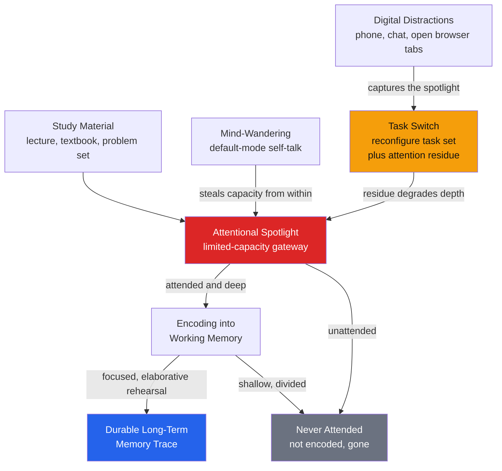

# 🎯 Attention and Focus in Learning

> [!abstract] TL;DR
> **Attention is the gateway to memory: information that is never attended is never encoded, so nothing else about "how to learn" matters if the spotlight is not on the material.** The brain cannot genuinely parallel-process two demanding tasks — what feels like multitasking is rapid **task-switching**, and every switch costs reorientation time plus a lingering **attention residue** that degrades the next task. Because divided attention damages **encoding far more than retrieval**, a distracted study session builds weak or absent memory traces even when the "hours" logged look identical. The practical levers are protecting long **focused blocks** (deep work), engineering the environment so distractions cannot capture the spotlight, and steering **interest, curiosity, and challenge-skill balance** (flow) so attention stays willingly on the task.

---

## Intuition

**Analogy: learning is like a camera taking a long exposure in low light.** To capture a sharp image, the shutter must stay open on one scene and the camera must stay perfectly still. Attention is the shutter: only the light that lands on the sensor while it is open becomes part of the photograph. If you keep swinging the camera between two subjects — a little here, a little there — neither exposure accumulates enough light, and *both* photos come out dark and blurred. Every time you swing the lens, there is also a fraction of a second of motion blur while it settles. The final album is not "two decent photos," it is a stack of smeared, underexposed frames.

That is exactly what happens when you study with a phone buzzing beside you. The material only gets "exposed" into memory during the seconds your attention is actually on it. Each glance at the phone is a camera swing: you lose the seconds spent looking away *and* the seconds of "motion blur" while your mind re-settles on the textbook. Two hours of divided study can encode less than thirty minutes of undivided focus — not because you were lazy, but because the shutter was rarely open on the same scene long enough to build a clear trace.

---

## How It Works

### Core mechanics

1. **Attention gates encoding.** The senses deliver far more than working memory can hold, so a limited-capacity **spotlight** selects a small subset for deeper processing (see [[Attention_and_Selection]]). Only the attended subset is elaborated, bound, and consolidated into a durable trace. Unattended material may be sensed but is **not encoded** — it leaves no retrievable memory. This is why "I read the whole chapter" and "I learned the chapter" are unrelated statements if attention wandered.

2. **There is no true multitasking for demanding work.** A single **central bottleneck** can select only one stimulus-to-response mapping at a time. When you "multitask" two effortful tasks, you are **serially switching** between them. Each switch requires the executive system to **reconfigure the task set** — load the goals, rules, and relevant memory for the new task and suppress the old one — which takes measurable time (**switch cost**; Monsell, 2003).

3. **Attention residue makes switching worse than the clock says.** After you switch away from Task A, part of your attention stays stuck on it. Leroy (2009) showed that unfinished prior tasks leave **residue** that degrades performance on the next task for minutes afterward. So a "quick" 30-second phone check does not cost 30 seconds — it costs the reorientation plus the residue tail before you are back at full depth.

4. **Divided attention harms encoding more than retrieval.** Craik et al. (1996) had people encode or retrieve while performing a secondary task. A distraction *during encoding* sharply reduced later memory; the same distraction *during retrieval* barely hurt. Encoding needs attention to run the deep, elaborative processing that builds associations; retrieval can partly run on autopilot. **Lesson: never let the distraction land during first learning** — that is the irreplaceable moment.

5. **Focus has warm-up dynamics.** Deep focus is not instant. It ramps up the longer you stay on one task and reaches its peak — sometimes **flow** — only after uninterrupted minutes. Chronic switching resets the ramp before it climbs, so a heavy switcher spends the whole session in the shallow, warming-up regime and never reaches the productive plateau.

6. **Mind-wandering competes from the inside.** Even with no external distraction, attention drifts to the **default-mode** stream of self-generated thought (Smallwood & Schooler, 2006). Skilled learners use **metacognitive monitoring** — periodically checking "am I still on task?" — to catch drift early and re-anchor, since mind-wandering during reading predicts poorer comprehension.

### Attention as the gateway to memory



*Everything the learner wants to remember has to pass through one narrow gateway. External distractions and internal mind-wandering both attack that gateway: distractions trigger costly switches, mind-wandering drains capacity from within, and anything the spotlight misses is lost before it is ever encoded.*

---

## Key Concepts

### Secondary Level

**Only what you attend gets learned.** Memory is not a recording of everything in front of you; it is a record of what your attention selected. Reading with the TV on means the TV is competing for the same spotlight the words need.

**Multitasking is a myth for hard tasks.** You feel like you are doing two things at once, but your brain is really flipping back and forth. Flipping is slow and error-prone, so "multitasking" study is slower *and* worse than doing one thing at a time.

**The phone-in-class effect.** Students who use a laptop or phone for off-task browsing during a lecture learn less — and so do the students *sitting near them* who can see the screen (Sana et al., 2013). The distraction is contagious.

### Undergraduate Level

**Task-switching and switch costs (Monsell, 2003).** When you alternate between two tasks, reaction time and error rate are worse on switch trials than on repeat trials. The extra time is the **task-set reconfiguration cost**: loading new rules and inhibiting the old ones. Part of the cost is **residual** — it does not disappear even with plenty of warning, revealing a hard structural limit, not mere unpreparedness.

**Continuous partial attention (Linda Stone).** Distinct from deliberate multitasking: a chronic low-grade state of scanning everything (feeds, chats, notifications) so as never to miss anything, at the price of never fully engaging with anything. It keeps the alerting system permanently primed and the executive permanently taxed.

**Media multitasking impairs learning.** Correlational and experimental work links habitual media multitasking to worse comprehension, worse note quality, and lower grades. Ophir, Nass & Wagner (2009) found a paradox: **heavy media multitaskers are *worse* at filtering irrelevant information and at task-switching** — the people who do it most are the least equipped for it.

**Divided attention hits encoding, not retrieval (Craik et al., 1996).** The encoding/retrieval asymmetry is the mechanistic heart of why distracted study fails. Protect the *first* exposure to new material above all else — attention there is non-negotiable.

**Metacognitive monitoring of attention.** Good learners run a background "focus check." Catching mind-wandering (Smallwood & Schooler, 2006) and re-orienting is itself a trainable metacognitive skill; the sooner drift is noticed, the less material is missed.

**The Pomodoro technique and attention restoration.** Working in fixed focused intervals (classically 25 minutes) followed by a short break exploits two ideas: a bounded, single-task commitment that discourages switching, and **Attention Restoration Theory** (Kaplan, 1995) — directed attention is a depletable resource that recovers during restful, low-demand breaks (ideally away from screens, in nature).

### Graduate Level

**Attention residue (Leroy, 2009).** Switching between tasks — especially away from an *unfinished* one — leaves cognitive residue that measurably lowers performance on the subsequent task. This reframes the cost of interruption: it is not just the interruption duration but a tail of degraded cognition afterward. It is the empirical backbone of **Deep Work** (Newport, 2016): batching cognitively demanding work into long, uninterrupted blocks minimizes the number of residue-inducing transitions per unit of output.

**Deep work and focused blocks (Newport, 2016).** The claim is that the ability to focus without distraction on a cognitively demanding task is both increasingly *rare* and increasingly *valuable*. The prescription follows from the mechanics above: long protected blocks let the focus ramp reach its plateau, minimize switch and residue costs, and create the conditions where flow becomes possible.

**Flow states (Csikszentmihalyi, 1990).** Flow is the state of complete, effortless absorption in an activity. Its central precondition is **challenge-skill balance**: the task must be hard enough to demand full attention but not so hard it triggers anxiety, and not so easy it invites boredom and mind-wandering. In flow, self-consciousness recedes and attention is fully committed to the task — an ideal encoding state. The **transient hypofrontality** hypothesis (Dietrich) proposes that certain prefrontal self-monitoring circuits down-regulate during flow, which is speculative but captures the phenomenology of losing the inner critic.

**Interest and curiosity as attention magnets.** Attention is cheap to sustain when the material is intrinsically interesting. Curiosity — the drive to close an information gap — recruits reward circuitry and enhances memory not only for the curiosity-inducing item but for incidental information encountered while curious. This is the motivational route into focus and ties directly to intrinsic motivation and self-determination (see [[Theories_of_Motivation]]).

**Individual differences and the "brain drain."** Ward et al. (2017) showed that the **mere presence** of your own switched-off phone on the desk reduces available working-memory capacity — the brain spends resources *not* attending to it. This reframes distraction management: it is not enough to resist checking the phone; the phone's presence alone taxes the executive. Environmental design (phone in another room) beats willpower.

---

## Python Demo

```python
# Quantifying the cost of task-switching on learning.
# We model "effective learning rate" as a function of how long you have been
# CONTINUOUSLY focused on one task. Focus warms up toward a "deep focus" plateau.
# Every task switch (a) costs R minutes of reorientation with almost no encoding
# (attention residue) and (b) RESETS the warm-up ramp to zero -- so a chronic
# switcher never reaches deep focus. We compare three study conditions over the
# same wall-clock time and plot cumulative learning.
# numpy + matplotlib only.

import numpy as np
import matplotlib.pyplot as plt

dt        = 0.25     # simulation step, minutes
T         = 120.0    # total study session, minutes (identical for all conditions)
t         = np.arange(0.0, T, dt)

f_max     = 1.0      # peak deep-focus learning rate (arbitrary units per minute)
ramp_tau  = 12.0     # minutes to warm up to ~63 percent of deep focus
R         = 3.0      # reorientation cost after each switch, minutes
residue   = 0.15     # fraction of focus available during reorientation

def focus_rate(time_on_task):
    """Warm-up curve: encoding rate rises toward f_max the longer you stay put."""
    return f_max * (1.0 - np.exp(-time_on_task / ramp_tau))

def simulate(block_len):
    """block_len = minutes between forced task switches. np.inf = never switch."""
    rate = np.zeros_like(t)
    time_since_switch = 0.0     # minutes since the last switch
    time_in_block     = 0.0     # minutes spent in the current block
    for i in range(len(t)):
        if time_in_block >= block_len:          # time to switch tasks
            time_in_block = 0.0
            time_since_switch = 0.0
        if time_since_switch < R:               # still paying the reorientation cost
            rate[i] = residue * focus_rate(time_since_switch)
        else:                                   # productive ramp begins after reorientation
            rate[i] = focus_rate(time_since_switch - R)
        time_since_switch += dt
        time_in_block     += dt
    cumulative = np.cumsum(rate) * dt
    return rate, cumulative

# Three conditions, same total time:
rate_focus,  cum_focus  = simulate(block_len=np.inf)   # deep work: one unbroken block
rate_pomo,   cum_pomo   = simulate(block_len=25.0)     # Pomodoro-style 25-min blocks
rate_switch, cum_switch = simulate(block_len=5.0)      # media-multitasking: switch every 5 min

# Report cumulative learning and "effective focused minutes" (learning / f_max)
final = {"Deep focus (no switching)": cum_focus[-1],
         "Pomodoro (25-min blocks)":  cum_pomo[-1],
         "Frequent switching (5-min)": cum_switch[-1]}
print(f"Same wall-clock time for every condition: {T:.0f} minutes\n")
for name, learned in final.items():
    eff_min = learned / f_max
    pct     = 100.0 * learned / cum_focus[-1]
    print(f"  {name:28s}: learning={learned:6.1f}  "
          f"effective minutes={eff_min:5.1f}  ({pct:5.1f}% of deep focus)")

lost = 100.0 * (1.0 - cum_switch[-1] / cum_focus[-1])
print(f"\nFrequent switching wasted {lost:.0f}% of the learning that deep focus achieved\n"
      f"in the EXACT SAME two hours -- divided attention silently deletes study time.")

# ---------------------------------------------------------------- plots
fig, ax = plt.subplots(1, 2, figsize=(14, 5.5))

ax[0].plot(t, rate_focus,  color="#2563eb", lw=2,  label="Deep focus (no switching)")
ax[0].plot(t, rate_pomo,   color="#059669", lw=1.5, label="Pomodoro (25-min blocks)")
ax[0].plot(t, rate_switch, color="#dc2626", lw=1.2, label="Switching every 5 min")
ax[0].set_xlabel("Time into study session (minutes)")
ax[0].set_ylabel("Instantaneous learning rate")
ax[0].set_title("Focus warms up; every switch resets it to zero")
ax[0].legend(loc="lower right")
ax[0].grid(alpha=0.3)

ax[1].plot(t, cum_focus,  color="#2563eb", lw=2.5, label="Deep focus (no switching)")
ax[1].plot(t, cum_pomo,   color="#059669", lw=2,   label="Pomodoro (25-min blocks)")
ax[1].plot(t, cum_switch, color="#dc2626", lw=2,   label="Switching every 5 min")
ax[1].fill_between(t, cum_switch, cum_focus, color="#dc2626", alpha=0.08)
ax[1].set_xlabel("Time into study session (minutes)")
ax[1].set_ylabel("Cumulative learning (encoded)")
ax[1].set_title("Same two hours, drastically different learning")
ax[1].legend(loc="upper left")
ax[1].grid(alpha=0.3)

plt.tight_layout()
plt.savefig("attention_focus_switching_cost.png", dpi=150)
print("Figure saved: attention_focus_switching_cost.png")
```

The two-hour clock is identical in every condition — only the switching frequency changes. Because each switch both burns reorientation time and resets the warm-up ramp, the frequent-switcher spends the whole session in the shallow, low-rate regime and encodes a small fraction of what the deep-focus block achieves. The shaded gap between the red and blue cumulative curves is the learning that divided attention silently deleted from time that *felt* fully spent studying. Pomodoro-style blocks land between the two: infrequent enough that focus reaches its plateau, so most of the deep-work benefit is retained.

---

## Real-World Applications

> **Classroom device policy.** Sana et al. (2013) is the evidence base for laptop and phone restrictions during lectures: multitaskers scored roughly 11 percentage points lower, and *peers with a view of the screen* scored about 17 points lower. The finding motivates device-free lectures, tech-free zones, and "laptops down during first exposure to new concepts," protecting the fragile encoding moment.

> **Knowledge-worker scheduling (deep work).** Engineering and research teams protect long uninterrupted blocks — no-meeting mornings, notification-off focus time, batched Slack triage — precisely to minimize switch counts and attention residue (Leroy, 2009; Newport, 2016). The goal is fewer, longer blocks rather than more total hours.

> **Notification batching and interface design.** Well-designed tools batch non-urgent alerts, use "focus modes," and suppress badge counts, recognizing that each interruption imposes a residue tail far longer than the interruption itself. The most effective personal fix is structural: phone in another room, since its mere presence drains capacity (Ward et al., 2017).

> **Flow-based learning and game design.** Adaptive learning platforms and well-designed games tune difficulty to keep the learner in the **challenge-skill balance** channel — never bored, never overwhelmed — because that is where attention stays willingly engaged and encoding is deepest (Csikszentmihalyi, 1990).

---

## Common Pitfalls

- **Believing you are the exception multitasker.** Self-rated multitasking ability is *inversely* related to actual performance: the people most confident they can study with divided attention tend to be the worst at it (echoing Ophir, Nass & Wagner, 2009). Confidence is not competence here.
- **Counting hours instead of attended minutes.** "I studied for four hours" is meaningless if half of it was spent switching to a phone. Log *undivided* focus time, not wall-clock time — the demo shows the two can differ by a factor of four.
- **Letting distraction land during first learning.** Because divided attention wrecks encoding but spares retrieval (Craik et al., 1996), a distraction during initial study is far costlier than one during review. Protect the first exposure most fiercely.
- **Underrating the "quick check."** A 30-second glance at a notification is not a 30-second cost; attention residue degrades the next several minutes and the focus ramp restarts. Frequent tiny interruptions are more corrosive than a single long break.
- **Studying with background media as "company."** Lyrical music, TV, or a live feed competes for the same limited capacity as the material. It feels pleasant precisely because it lowers effort — which means less encoding.
- **Chasing flow on the wrong task.** Flow needs challenge-skill balance. Too-easy drill invites boredom and mind-wandering; too-hard material triggers anxiety and disengagement. If you cannot focus, first check whether the difficulty is mismatched.
- **Relying on willpower instead of environment.** Resisting a visible phone all session itself consumes executive resources (Ward et al., 2017). Remove the temptation from the environment rather than fighting it in real time.

---

## Related Concepts

- [[Attention_and_Selection]] — the cognitive-science account of the limited-capacity spotlight and the early-vs-late selection debate that explains *why* only attended information is encoded.
- [[Attention_and_Cognitive_Load]] — the psychology companion: dual-task costs, inattentional blindness, and Cognitive Load Theory, framing distraction as a working-memory limit.
- [[Attention_and_Executive_Function]] — the neuroscience of the executive and orienting networks that perform task-set reconfiguration and pay the switch cost.
- [[Working_Memory_and_Cognitive_Load]] — working memory is the encoding buffer the spotlight feeds; its capacity limit is the bottleneck that makes divided attention so costly.
- [[Theories_of_Motivation]] — intrinsic motivation, curiosity, and self-determination are the forces that capture and hold attention, and the motivational ground of flow.

---

## Review Questions

**Tier 1 — Conceptual (explain to a peer).**
1. Using the long-exposure camera analogy, explain why "I read the whole chapter" and "I learned the chapter" can be completely unrelated, and name the single stage of memory that divided attention damages most.

**Tier 2 — Applied / scenario.**
2. A student insists they study effectively for three hours each night "with the phone right there, just checking it now and then." Using switch costs and attention residue, estimate qualitatively how their *effective* study time compares to their logged time, and prescribe two concrete environmental changes (not willpower-based) that would help most.

**Tier 3 — Trade-off / synthesis.**
3. Deep work argues for long uninterrupted blocks, while Pomodoro deliberately inserts breaks every 25 minutes. Reconcile these using the concepts of the focus warm-up ramp, attention residue, and Attention Restoration Theory. Under what task and learner conditions would you favor one over the other?

---

## Sources

- Monsell, S. (2003). "Task switching." *Trends in Cognitive Sciences*, 7(3), 134–140. — Switch costs and task-set reconfiguration.
- Ophir, E., Nass, C., & Wagner, A. D. (2009). "Cognitive control in media multitaskers." *Proceedings of the National Academy of Sciences*, 106(37), 15583–15587. — Heavy media multitaskers are worse at filtering and switching.
- Sana, F., Weston, T., & Cepeda, N. J. (2013). "Laptop multitasking hinders classroom learning for both users and nearby peers." *Computers & Education*, 62, 24–31. — The laptop/phone-in-class effect.
- Craik, F. I. M., Govoni, R., Naveh-Benjamin, M., & Anderson, N. D. (1996). "The effects of divided attention on encoding and retrieval processes in human memory." *Journal of Experimental Psychology: General*, 125(2), 159–180. — Divided attention impairs encoding more than retrieval.
- Csikszentmihalyi, M. (1990). *Flow: The Psychology of Optimal Experience.* Harper & Row. — Flow and challenge-skill balance.

---

#learning-science #attention #focus #multitasking #deep-work
