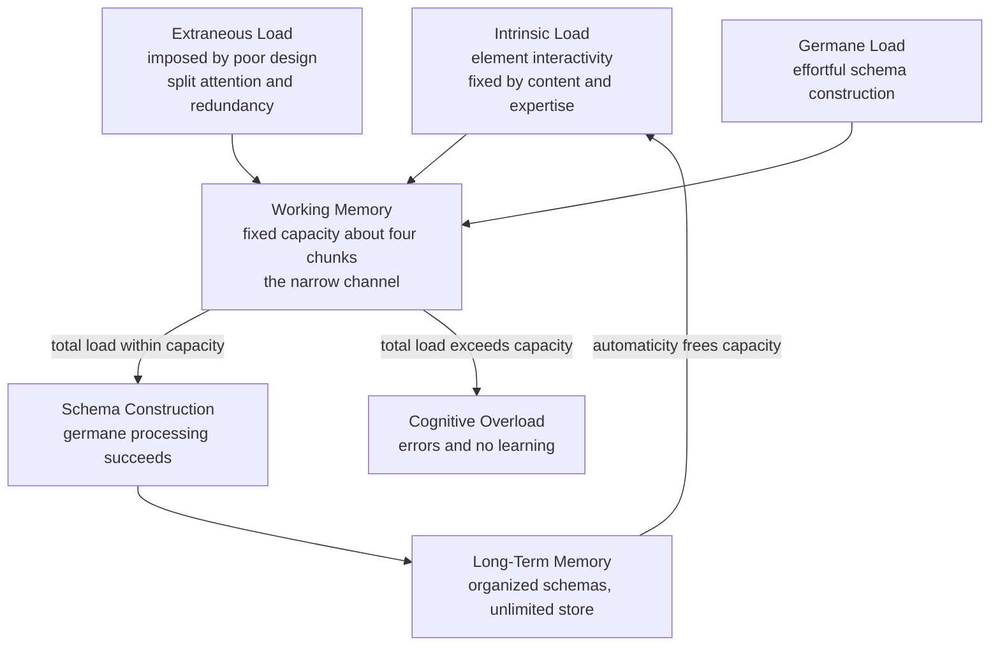

# 🧩 Cognitive Load and Learning

> [!abstract] TL;DR
> **Cognitive Load Theory (Sweller, 1988)** starts from one brutal fact: working memory can juggle only a handful of new elements at once, while long-term memory is effectively unlimited. Learning *is* the transfer of organized knowledge — **schemas** — into long-term memory, but every schema must first be assembled inside the tiny working-memory workspace. Three kinds of load compete for that space: **intrinsic** (the material's inherent complexity), **extraneous** (waste created by poor presentation), and **germane** (the productive effort that actually builds schemas). Good instruction ruthlessly cuts extraneous load so the fixed budget can be spent on germane processing. Because load is relative to the learner's existing schemas, the same technique that rescues a novice can *hurt* an expert — the **expertise-reversal effect**.

## Intuition

**Analogy: cooking in a cramped kitchen with a huge pantry.**

Picture a chef whose pantry (long-term memory) is enormous but whose countertop (working memory) fits only about four bowls at a time. To cook a new dish, they must pull ingredients onto the counter, combine them, and clear the counter before the next step. Once bowls are combined into a single prepped mise-en-place, that one bowl now carries a whole sub-recipe — the counter effectively holds more.

Three things fight for counter space. The **intrinsic** demand is how many ingredients a recipe forces you to handle at the same time — a five-component sauce that must all go in together is unavoidably crowded; toast is not. The **extraneous** demand is clutter that has nothing to do with the dish: a recipe card printed in tiny scattered fragments so you keep looking back and forth, or a second card repeating what you already read. The **germane** demand is the good kind of busy — the deliberate work of noticing "this technique is just like the one from last week," which turns today's dish into a reusable pattern.

If intrinsic plus extraneous demand fills the counter, there is no room left for that pattern-building, and nothing is learned. The entire craft of teaching is keeping the counter clear for the work that matters.

---

## How It Works

### The architecture: a narrow channel and an unlimited store

Human cognition runs on a deliberate mismatch. **Working memory** is a tiny, fast, conscious workspace that can hold only about **four chunks** of novel information (Cowan) and loses them within seconds unless they are rehearsed. **Long-term memory** is a vast, durable store of **schemas** — organized knowledge structures that group many low-level elements into a single meaningful unit.

The bottleneck applies only to *new, unorganized* material. A retrieved schema enters working memory as **one chunk** no matter how much internal detail it contains, so it barely taxes capacity. This is the escape hatch: expertise does not enlarge the workspace, it packs more into each slot. A chess master perceives a mid-game board as a few familiar formations, not 25 separate pieces.

### The three loads

1. **Intrinsic load** — the inherent difficulty of the material, set by **element interactivity**: how many elements must be processed *simultaneously* because they depend on one another. Learning vocabulary is low interactivity (each word stands alone); balancing a chemical equation is high interactivity (change one coefficient and everything else shifts). Intrinsic load is fixed by the content *and* the learner's expertise — what is many interacting elements to a novice is one schema to an expert.
2. **Extraneous load** — load created purely by *how* material is presented: fragmented layouts, redundant text, decorative noise, needless search. It contributes nothing to learning and should be minimized.
3. **Germane load** — the effortful processing devoted to constructing and automating schemas. This is the load you *want* to occur, but it can only happen if intrinsic plus extraneous load leave headroom.

The loads are additive against one fixed budget: `intrinsic + extraneous + germane <= capacity`. Overshoot the capacity and you get **cognitive overload** — errors, dropped goals, and no schema formation.

### The classic instructional effects

Each effect is a direct prediction of the bottleneck:

- **Worked-example effect** — novices learn more from studying fully worked solutions than from solving equivalent problems themselves. Conventional problem-solving forces means-ends search that consumes working memory without building schemas; a worked example spends that capacity on studying the solution structure.
- **Goal-free effect** — replacing a specific goal ("find angle X") with a non-specific one ("find any values you can") removes means-ends search, freeing capacity for the germane work of noticing how the problem elements relate.
- **Split-attention effect** — when two sources that must be integrated (a diagram and its explanatory text) are physically or temporally separated, the learner wastes capacity holding one while searching for the other. Integrating the text into the diagram removes the waste.
- **Redundancy effect** — presenting the same information twice (on-screen text plus a narrator reading it verbatim) forces needless cross-checking. Redundant material *raises* extraneous load; more is not better.
- **Modality effect** — splitting information across the visual and auditory channels (a diagram narrated by speech, rather than a diagram plus on-screen text) uses two working-memory subsystems in parallel, effectively widening the channel.
- **Expertise-reversal effect** — the crucial caveat. Guidance that reduces load for a novice becomes redundant *extra* load for an expert, who must suppress scaffolding they no longer need. Worked examples, integrated hints, and heavy explanation help beginners but slow experts, who learn better by solving problems. What helps novices hinders experts.

### Automaticity closes the loop

As a schema is practiced, its execution becomes **automatic** — it runs with little or no working-memory demand, the way a fluent reader decodes words without conscious effort. Automaticity converts former intrinsic load into a single free-running chunk, which is why the same task feels crushing to a beginner and effortless to a veteran. Learning literally lowers the future cost of the material.



---

## Key Concepts

### Secondary (intuitive level)

- Your mind has a small "thinking counter" that holds only a few new things at once, and a huge "memory pantry" that holds everything you have already learned.
- Hard material is hard because it makes you juggle many pieces at the same time.
- Messy explanations waste counter space; clean ones leave room to actually learn.
- Practice turns a pile of pieces into a single ready-made pattern, so the same task gets easier.

### Undergraduate (mechanistic level)

- **The three loads:** intrinsic (element interactivity, fixed by content and expertise), extraneous (presentation waste, minimize), germane (schema-building effort, protect). They sum against one fixed working-memory budget.
- **Element interactivity** is the operational definition of intrinsic difficulty — the number of elements that must be held together because they interact.
- **Named effects and their fixes:** worked examples and goal-free problems cut search load; integrating text into diagrams cures split attention; deleting duplicate narration cures redundancy; pairing visuals with *spoken* words exploits the modality effect.
- **Capacity link:** the bottleneck is Miller's "7 plus or minus 2" as reinterpreted by Cowan to roughly 4 chunks of genuinely novel information. Chunking via schemas is the only way past it.

### Graduate (theoretical and design level)

- **Expertise-reversal effect (Kalyuga et al., 2003):** load is a function of the *interaction* between material and the learner's schemas, so instructional prescriptions are not universal — they must fade guidance as expertise grows. Formally, extra guidance shifts from germane to extraneous as the learner internalizes the schema.
- **Instructional design as load engineering:** techniques such as segmenting, pre-training, faded worked examples, and the completion-problem strategy dynamically rebalance the three loads across a learning trajectory. Van Merrienboer's 4C/ID model operationalizes this.
- **Theoretical status and critiques:** germane load is hard to measure independently of intrinsic load, which led to a reformulation treating germane processing as the *allocation* of working-memory resources to intrinsic load rather than a separate additive source. Measurement relies on subjective effort ratings, dual-task secondary measures, and physiological proxies, none fully clean.
- **Evolutionary framing:** Sweller's later "biologically primary vs secondary knowledge" distinction argues that culturally transmitted (secondary) knowledge is exactly what overloads working memory, whereas primary skills like speech are acquired effortlessly — explaining why schools, not conversation, need explicit load management.

---

## Python Demo

```python
# Model WORKING-MEMORY OVERLOAD during learning (Cognitive Load Theory).
#
# Working memory has a FIXED capacity C (a handful of chunks). Every task imposes:
#   * intrinsic load  I -> inherent complexity / element interactivity
#   * extraneous load E -> waste imposed by poor instructional design
#   * germane load    G -> productive effort that BUILDS schemas
#
# The elements that must be juggled SIMULTANEOUSLY are I + E. Whatever capacity
# is left over -- that is, C - (I + E) -- is the HEADROOM available for germane
# schema construction. Once I + E meets or exceeds C there is no headroom, and
# performance (and learning) collapses.
#
# We sweep intrinsic load and compare two instructional designs:
#   * POOR design: high extraneous load (clutter, split attention, redundancy)
#   * GOOD design: low  extraneous load (integrated, streamlined presentation)

import numpy as np
import matplotlib.pyplot as plt

C = 7.0                              # fixed working-memory capacity (load units)
I = np.linspace(0.0, 10.0, 200)      # intrinsic load sweep (element interactivity)

E_poor = 4.0                         # extraneous load from a cluttered design
E_good = 1.0                         # extraneous load from a clean design
k = 1.4                              # steepness of the overload collapse

def performance(intrinsic, extraneous, capacity, steep):
    # Soft threshold: high while I + E < C, collapses once I + E exceeds C.
    overload = intrinsic + extraneous - capacity
    return 1.0 / (1.0 + np.exp(steep * overload))

def germane_headroom(intrinsic, extraneous, capacity):
    # Capacity left for schema construction after obligatory load is paid.
    return np.clip(capacity - (intrinsic + extraneous), 0.0, None)

perf_poor = performance(I, E_poor, C, k)
perf_good = performance(I, E_good, C, k)
head_poor = germane_headroom(I, E_poor, C)
head_good = germane_headroom(I, E_good, C)

fig, (ax1, ax2) = plt.subplots(1, 2, figsize=(12, 5))

# Panel 1: performance vs intrinsic load
ax1.plot(I, perf_poor, color="#dc2626", lw=2, label=f"Poor design  E={E_poor:.0f}")
ax1.plot(I, perf_good, color="#2563eb", lw=2, label=f"Good design  E={E_good:.0f}")
ax1.axvline(C - E_poor, color="#dc2626", ls=":", alpha=0.6)   # collapse point, poor
ax1.axvline(C - E_good, color="#2563eb", ls=":", alpha=0.6)   # collapse point, good
ax1.set_xlabel("Intrinsic load  [element interactivity]")
ax1.set_ylabel("Task performance / learning")
ax1.set_title(f"Performance collapses once I + E exceeds capacity C={C:.0f}")
ax1.legend()
ax1.grid(alpha=0.3)

# Panel 2: germane headroom vs intrinsic load
ax2.plot(I, head_poor, color="#dc2626", lw=2, label=f"Poor design  E={E_poor:.0f}")
ax2.plot(I, head_good, color="#2563eb", lw=2, label=f"Good design  E={E_good:.0f}")
ax2.fill_between(I, head_good, head_poor, where=(head_good > head_poor),
                 color="#2563eb", alpha=0.12, label="headroom recovered by good design")
ax2.set_xlabel("Intrinsic load  [element interactivity]")
ax2.set_ylabel("Germane headroom  [capacity for schemas]")
ax2.set_title("Cutting extraneous load restores room to learn")
ax2.legend()
ax2.grid(alpha=0.3)

plt.tight_layout()
plt.show()

# Console summary at a moderately complex task, I ~ 4
idx = int(np.argmin(np.abs(I - 4.0)))
print(f"At intrinsic load I = {I[idx]:.1f}  (capacity C = {C:.0f}):")
print(f"  Poor design (E={E_poor:.0f}): total held = {I[idx] + E_poor:.1f}, "
      f"headroom = {head_poor[idx]:.1f}, performance = {perf_poor[idx]:.2f}")
print(f"  Good design (E={E_good:.0f}): total held = {I[idx] + E_good:.1f}, "
      f"headroom = {head_good[idx]:.1f}, performance = {perf_good[idx]:.2f}")
```

Running it reproduces the core CLT prediction. At a moderately complex task (`I = 4`), the **poor design** pushes total simultaneous load to 8 units against a capacity of 7 — over the edge — so performance collapses to about **0.20** with **zero** germane headroom left. The **good design** holds only 5 units, keeping performance near **0.94** and preserving **2 units** of headroom for schema construction. The intrinsic difficulty of the material is identical in both cases; the only thing that changed was the presentation. That is the entire thesis of instructional design as load management.

---

## Real-World Applications

- **Instructional and e-learning design:** worked examples and faded guidance for beginners, labels placed directly on diagrams to kill split attention, narration instead of duplicated on-screen text to exploit the modality effect, and removal of decorative "seductive details" that add extraneous load. Multimedia design principles (Mayer) are CLT applied to screens.
- **Curriculum sequencing:** teach prerequisite sub-schemas before high-interactivity tasks (pre-training), and segment complex procedures so intrinsic load is metered rather than dumped all at once.
- **User interface and documentation design:** forms, dashboards, and onboarding that surface more than a few simultaneously relevant elements overload novices. Progressive disclosure, chunked controls, and reliance on familiar conventions lean on users' existing schemas.
- **Safety-critical work (aviation, medicine, control rooms):** checklists and standardized handoffs externalize working memory so critical items are not lost under peak load during emergencies.
- **Assessment and adaptive systems:** expertise-reversal implies adaptive tutors must *detect* growing expertise and withdraw scaffolding, or the very support that helped will start to hinder.

---

## Common Pitfalls

- **Treating "engaging" as "effective."** Decorative images, background music, and lively but irrelevant anecdotes add extraneous load. They can feel richer while measurably *reducing* learning, especially for novices.
- **Applying novice-optimal designs to experts.** Heavy worked examples and step-by-step guidance help beginners but trigger the expertise-reversal effect in advanced learners, who must suppress redundant scaffolding. Guidance must fade.
- **Confusing high intrinsic load with bad teaching.** You cannot design away inherent element interactivity; you can only manage it (sequencing, pre-training). Blaming the learner or the instructor for genuinely complex material misreads the source of the load.
- **Believing "7 plus or minus 2" is the working budget.** For genuinely novel, interacting elements the usable capacity is closer to Cowan's ~4 chunks. Designing around seven independent new items overloads most people.
- **Adding a second identical channel and calling it reinforcement.** On-screen text read aloud verbatim triggers the redundancy effect and raises load rather than lowering it.
- **Ignoring that load is relative to the learner.** The same lesson can be perfectly pitched for one student and overwhelming or boring for another because their schemas differ. There is no learner-independent "correct" load.

---

## Related Concepts

- [[Working_Memory_and_Cognitive_Load]] — the capacity bottleneck (Baddeley's components, Miller vs Cowan) that CLT is built on; this note extends it into instructional design.
- [[Attention_and_Cognitive_Load]] — the attentional selection mechanisms and the full instructional-effects catalogue viewed from a cognitive-psychology angle.
- [[Schemas_and_Mental_Models]] — schemas are the units that chunk many elements into one, providing the escape hatch from working-memory limits.
- [[Long_Term_Memory_Systems]] — the unlimited store where schema construction and automaticity ultimately live.
- [[Attention_and_Selection]] — how the pre-attentive filter and executive control decide what even reaches the working-memory workspace.
- [[Problem_Solving_and_Insight]] — means-ends search is the load-heavy strategy that worked examples and goal-free problems are designed to avoid.

---

## Review Questions

**Tier 1 — Recall / Comprehension**
1. Define intrinsic, extraneous, and germane load, and state what a designer should do with each. Which one is set by element interactivity?
2. Explain the escape hatch: how does a long-term-memory schema let an expert hold far more than four elements in working memory at once?

**Tier 2 — Application**
3. A beginner e-learning module places a circuit diagram on one screen and its explanatory text on the next, with a narrator reading that same text aloud. Name every cognitive-load effect being violated and give a concrete redesign for each, stating which load type it targets.
4. Using the demo's model, a task has intrinsic load 5 against a capacity of 7. One design adds extraneous load 3, another adds 1. Predict which design overloads working memory and estimate the qualitative difference in germane headroom.

**Tier 3 — Analysis / Synthesis**
5. The expertise-reversal effect says worked examples help novices but hinder experts. Design a single adaptive lesson that stays load-optimal as a learner progresses from novice to expert, and specify the *signal* you would use to decide when to withdraw guidance. Then explain the measurement problem that makes germane load hard to verify empirically.

---

## Sources

- Sweller, J. (1988). "Cognitive load during problem solving: Effects on learning." *Cognitive Science*, 12(2), 257–285.
- Sweller, J., van Merrienboer, J. J. G., & Paas, F. (1998). "Cognitive architecture and instructional design." *Educational Psychology Review*, 10(3), 251–296.
- Kalyuga, S., Ayres, P., Chandler, P., & Sweller, J. (2003). "The expertise reversal effect." *Educational Psychologist*, 38(1), 23–31.
- Mayer, R. E., & Moreno, R. (2003). "Nine ways to reduce cognitive load in multimedia learning." *Educational Psychologist*, 38(1), 43–52.
- Cowan, N. (2001). "The magical number 4 in short-term memory: A reconsideration of mental storage capacity." *Behavioral and Brain Sciences*, 24(1), 87–114.

---

#learning-science #cognitive-load #sweller #working-memory #instructional-design
