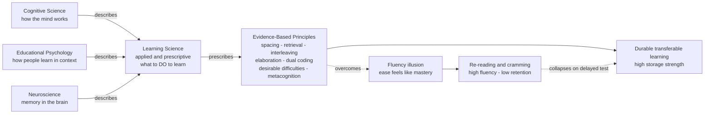

# 🎓 Learning Science Overview

> [!abstract] TL;DR
> **Learning science** is the interdisciplinary, evidence-based study of how people learn and how to make learning more durable, transferable, and efficient. It is the **applied, prescriptive** counterpart to the *descriptive* sciences of the mind — cognitive science, educational psychology, and neuroscience tell us *how memory works*, and learning science turns that into *what to actually do*: space your practice, test yourself, interleave, elaborate, and use desirable difficulties. Its central and most counter-intuitive lesson is that **the feeling of fluency is not learning** — the strategies that feel easiest (re-reading, highlighting, cramming) are among the least effective, which is why learners, left to their own judgment, systematically choose worse methods.

---

## Intuition

**Analogy: getting physically fit versus feeling warmed up.**

Imagine two people preparing for a marathon. The first spends every session in a hot sauna: they *feel* the burn, they leave sweating and glowing, and it is comfortable and pleasant. The second runs hill repeats until their legs shake: it is unpleasant, they feel slow and clumsy, and they often feel like they are failing. Which one is actually getting fitter? Obviously the second — even though the first *feels* more like exercise in the moment.

Learning is exactly the same. **Re-reading a chapter for the fifth time is the sauna**: the material flows smoothly, you feel a warm sense of mastery, and it is effortless. **Closing the book and trying to recall it from memory is the hill repeat**: it is halting, effortful, and you feel like you barely know it. But the effortful struggle is precisely what builds a durable memory, and the smooth fluency is a mirage. Learning science is the discipline that measures which "workouts" actually build the muscle — and it consistently finds that the ones that *feel* worst in the moment produce the strongest long-term results.

---

## How It Works

Learning science sits on top of a stack of **descriptive** sciences and adds a layer of **prescription**. Cognitive psychology describes the architecture of memory (encoding, consolidation, retrieval); neuroscience describes its biological substrate (synaptic plasticity, hippocampal indexing, sleep replay); educational psychology describes how these play out in real classrooms with real motivation and context. Learning science asks the next question: *given all that, what concrete practices should a learner or teacher adopt?* It answers that question the way medicine answers "what treatment works?" — with controlled experiments, effect sizes, replication, and meta-analysis, not intuition or tradition.

### The core mechanism: durable learning versus performance

The single deepest idea in the field is **Bjork & Bjork's distinction between storage strength and retrieval strength** (the "new theory of disuse"). *Retrieval strength* is how accessible a memory is right now — it rises fast during study and decays fast afterward. *Storage strength* is how deeply the memory is entrenched — it rises slowly and never really decays. The trap is that we can only *observe* retrieval strength, so during easy study our high current performance fools us into thinking we have built storage strength when we have not. Conditions that **depress current performance but boost long-term storage** are called **desirable difficulties**, and nearly every evidence-based technique is a desirable difficulty in disguise.

### The evidence-based principles (previewed)

1. **Spacing** — distribute practice over time instead of massing it; each review at the point of near-forgetting delivers a larger boost.
2. **Retrieval practice (the testing effect)** — actively recalling information strengthens it more than re-reading it (Roediger & Karpicke, 2006).
3. **Interleaving** — mix different problem types rather than blocking one type, forcing you to discriminate which method applies.
4. **Elaboration** — explain *why* and *how*, connecting new material to what you already know.
5. **Dual coding** — combine verbal and visual representations to build two complementary memory routes.
6. **Desirable difficulties** — deliberately make study harder in ways that pay off later (Bjork).
7. **Metacognition** — monitor and regulate your own learning, and calibrate against the fluency illusion.

### The fluency illusion and the research–practice gap

Learners judge their own progress using **processing fluency** — how smoothly material is processed — as a proxy for how well it is learned. But fluency is driven by *retrieval strength*, familiarity, and legibility, not by durable storage. This produces the **illusion of competence**: re-reading feels productive, and cramming produces high exam-eve confidence, both of which collapse on a delayed test. Because the illusion is so strong, there is a large **research–practice gap**: the techniques best supported by decades of evidence (spacing, retrieval practice) remain rare in classrooms and study habits, while the least effective techniques (highlighting, re-reading) dominate — the topic of the landmark Dunlosky et al. (2013) review.



---

## Key Concepts

### Secondary Level

**What learning science is.** It is the study of *how to learn well*, tested with experiments instead of opinions. It borrows facts about memory from psychology and brain science and turns them into practical study advice.

**The seven power tools.** *Space* your studying across days; *test yourself* instead of just re-reading; *mix up* the kinds of problems you practice; *explain things in your own words*; *pair pictures with words*; make practice *a bit harder on purpose*; and *check honestly* whether you really know it.

**The fluency trap.** Re-reading and highlighting *feel* effective because the words become familiar and easy to read, but familiarity is not the same as being able to recall or use the information later. Feeling like you know it is not proof that you do.

**The forgetting curve (Ebbinghaus, 1885).** Hermann Ebbinghaus memorized nonsense syllables and tested himself over time, discovering that memory drops sharply at first and then levels off. About half of freshly learned material can be lost within a day. This curve is the baseline that every study strategy is trying to flatten.

### Undergraduate Level

**Descriptive versus prescriptive — the defining distinction.** Cognitive science and educational psychology are largely *descriptive*: they explain the mechanisms of attention, working memory, and long-term memory (see [[Working_Memory_and_Cognitive_Load]], [[Long_Term_Memory_Systems]]). Learning science is *prescriptive*: it uses those mechanisms to recommend actions. The relationship is like physiology to medicine, or physics to engineering — learning science is the design discipline built on the basic science. It does not replace cognitive science; it *applies* it, which is why this note cross-links the descriptive notes rather than restating them.

**The testing effect (Roediger & Karpicke, 2006).** In their canonical experiment, students who read a passage and then *took a recall test* dramatically outperformed students who *re-read the passage* on a delayed test one week later — even though the re-readers performed better on an immediate test and predicted they would do better. Retrieval is not merely a *measurement* of learning; the act of retrieval *is* learning. This is the empirical heart of the fluency illusion.

**Desirable difficulties (Bjork).** Robert Bjork coined the term for manipulations that impair performance during acquisition but enhance long-term retention and transfer: spacing, interleaving, retrieval practice, varying conditions of practice, and reducing feedback frequency. The word *desirable* is load-bearing — a difficulty is only desirable if the learner has the prior knowledge to overcome it; otherwise it is just an *undesirable* difficulty that produces failure without learning.

**What works — the Dunlosky et al. (2013) audit.** A team led by John Dunlosky rated ten common study techniques by the strength of their evidence. **High utility:** practice testing and distributed practice. **Moderate:** elaborative interrogation, self-explanation, interleaving. **Low utility despite huge popularity:** highlighting/underlining, re-reading, summarization, keyword mnemonics, and imagery for text. The mismatch between what is *popular* and what is *effective* is the operational definition of the research–practice gap.

**Metacognition and judgments of learning (JOLs).** Metacognition is "thinking about thinking" — specifically, *monitoring* what you know and *controlling* what you study next. Learners make **judgments of learning** that are systematically miscalibrated: they are biased by fluency, by the presence of the answer in front of them (the "foresight bias"), and by recent massed exposure. Good learners are not necessarily those with better memory but those who *calibrate* their monitoring and act on it — e.g., by delaying self-quizzing so their JOL reflects retrieval strength rather than fresh working-memory contents.

### Graduate Level

**Storage strength versus retrieval strength (Bjork & Bjork, 1992).** The "new theory of disuse" formalizes memory as a two-parameter system. Retrieval strength governs current accessibility and is what tests, JOLs, and the sense of fluency all tap. Storage strength governs how *learnable and durable* an item is. Critically, the *gain* in storage strength from a study event is a *decreasing* function of current retrieval strength — you learn most by retrieving something you have almost forgotten. This single asymmetry derives spacing, the testing effect, and the fluency illusion from one principle, and it explains why "current performance is a highly unreliable index of learning."

**Deliberate practice and its boundary conditions (Ericsson).** Anders Ericsson's studies of experts (musicians, chess players, athletes) argued that expert performance is built not by mere experience but by **deliberate practice**: effortful, goal-directed practice at the edge of current ability, with immediate feedback and repeated refinement of weaknesses. This is a desirable-difficulty framework applied to skill acquisition. Later meta-analyses (Macnamara et al., 2014) showed deliberate practice explains a substantial but *bounded* share of expertise — large in games, smaller in education and professions — sparking an ongoing debate about the roles of talent, starting age, and task predictability. The popularized "10,000-hour rule" is a distortion Ericsson himself disowned.

**Transfer — the hard problem.** The ultimate goal of learning is **transfer**: applying knowledge to novel problems and contexts, not just reproducing it. Transfer is notoriously difficult (near transfer is common, far transfer is rare), and many techniques that boost retention on similar tests do less for transfer. **Interleaving** and **variability of practice** specifically target transfer by training the learner to *select* the right procedure and to abstract the underlying structure rather than memorizing surface features — see [[Problem_Solving_and_Insight]] and [[Schemas_and_Mental_Models]].

**Cognitive load as the constraint.** Sweller's **cognitive load theory** grounds learning science in the bottleneck of working memory (see [[Working_Memory_and_Cognitive_Load]]). Instruction must manage *intrinsic* load (inherent difficulty), minimize *extraneous* load (poor design), and free capacity for *germane* processing (schema construction). Dual coding, worked examples, and the elimination of redundant material are all load-management prescriptions — and they explain why some "desirable difficulties" backfire for novices who have no spare capacity to absorb them (the *expertise-reversal effect*).

**Myths, replication, and boundary conditions.** Learning science also functions as a *debunking* discipline. The **"learning styles" myth** — that matching instruction to a supposed visual/auditory/kinesthetic style improves learning — has no credible supporting evidence despite near-universal belief. Meanwhile, the field grapples with its own replication and boundary-condition questions: effects like interleaving and desirable difficulties depend on prior knowledge, material type, and retention interval, so mature learning science increasingly specifies *when and for whom* a technique works, not just *whether* it works on average.

---

## Python Demo

```python
# numpy + matplotlib only.
# Core message of learning science: FLUENCY IS NOT LEARNING.
# We contrast two study strategies that use the SAME number of sessions:
#   (A) Massed re-reading  -> passive, done while the trace is still fresh.
#       Feels fluent and easy, but a fresh memory gains little extra durability.
#   (B) Spaced retrieval practice -> effortful recall done when the trace has
#       partly decayed. It feels hard, but harder retrieval builds more stability
#       (a "desirable difficulty", Bjork).
# We model retention with R(t) = exp(-t / S), where S is memory "stability"
# in days, and plot how the two strategies diverge on a delayed exam.
import numpy as np
import matplotlib.pyplot as plt

HORIZON  = 40.0    # days we track retention
S0       = 1.0     # stability (days) right after the first exposure
TEST_DAY = 30.0    # a delayed exam three-plus weeks out

def simulate(sessions, passive_boost, retrieval_gain, S0=S0):
    """Piecewise retention for a schedule of study-day timestamps.

    passive_boost   : fixed small multiplier gain per RE-READ (fluent, weak).
    retrieval_gain  : gain scaled by how much was forgotten, per RETRIEVAL
                      (effortful; bigger when the trace has decayed more).
    """
    sessions = sorted(sessions)
    seg_stability, S = [], S0
    for k, day in enumerate(sessions):
        if k == 0:
            S = S0
        else:
            gap   = day - sessions[k - 1]
            r_now = np.exp(-gap / S)                       # fraction still retained
            if retrieval_gain > 0:                          # active retrieval
                S *= 1.0 + retrieval_gain * (1.0 - r_now)   # more forgotten -> bigger gain
            else:                                           # passive re-reading
                S *= 1.0 + passive_boost                    # small fixed gain
        seg_stability.append(S)

    t = np.linspace(0.0, HORIZON, 2000)
    R = np.zeros_like(t)
    for i, ti in enumerate(t):
        idx  = np.searchsorted(sessions, ti, side="right") - 1
        R[i] = 0.0 if idx < 0 else np.exp(-(ti - sessions[idx]) / seg_stability[idx])
    return t, R, seg_stability

# Same NUMBER of sessions (5) for both -- only the SCHEDULE and STRATEGY differ.
massed = [0.0, 0.2, 0.4, 0.6, 0.8]        # crammed into a single day (re-reading)
spaced = [0.0, 1.0, 3.0, 8.0, 20.0]       # expanding intervals (retrieval practice)

t_m, R_m, S_m = simulate(massed, passive_boost=0.25, retrieval_gain=0.0)
t_s, R_s, S_s = simulate(spaced, passive_boost=0.0,  retrieval_gain=6.0)

ret_m = np.exp(-(TEST_DAY - massed[-1]) / S_m[-1])
ret_s = np.exp(-(TEST_DAY - spaced[-1]) / S_s[-1])
print(f"Massed re-reading -> retention at day 30 = {ret_m:6.1%}  (felt EASY while studying)")
print(f"Spaced retrieval  -> retention at day 30 = {ret_s:6.1%}  (felt HARD while studying)")
print("The strategy that felt worse produced far more durable learning.")

fig, ax = plt.subplots(figsize=(11, 5.5))
ax.plot(t_m, R_m, color="tomato",    lw=2, label="Massed re-reading (high fluency)")
ax.plot(t_s, R_s, color="steelblue", lw=2, label="Spaced retrieval practice")
for d in massed:
    ax.axvline(d, color="tomato",    alpha=0.15, lw=0.8)
for d in spaced:
    ax.axvline(d, color="steelblue", alpha=0.20, lw=0.8)
ax.axvline(TEST_DAY, color="gray", ls="--", lw=1.2, label="Delayed exam (day 30)")
ax.scatter([TEST_DAY, TEST_DAY], [ret_m, ret_s],
           color=["tomato", "steelblue"], s=70, zorder=5)
ax.annotate("felt mastered here...", xy=(0.9, 0.98), xytext=(6, 0.9),
            fontsize=9, color="tomato",
            arrowprops=dict(arrowstyle="->", color="tomato"))
ax.annotate("...but gone by the exam", xy=(TEST_DAY, ret_m + 0.02), xytext=(21, 0.25),
            fontsize=9, color="tomato",
            arrowprops=dict(arrowstyle="->", color="tomato"))
ax.set_xlabel("Days since first study session")
ax.set_ylabel("Retention  R = exp(-t / S)")
ax.set_title("Fluency is not learning: massed re-reading vs spaced retrieval")
ax.set_ylim(0, 1.05)
ax.legend(fontsize=9, loc="center right")
plt.tight_layout()
plt.savefig("fluency_vs_learning.png", dpi=150)
print("Saved fluency_vs_learning.png")
```

**What the demo shows.** The massed re-reader hits near-perfect retention *while studying* on day 1 — the curve touches 1.0 and it genuinely *feels* mastered — then decays to essentially zero by the day-30 exam, because passive re-reading of a still-fresh trace barely raises its stability. The spaced retriever's curve dips and recovers repeatedly (each dip is a moment of near-forgetting that feels like failure), but every effortful recall multiplies stability far more, so it arrives at the exam near 90 percent. The two curves **cross and diverge**: the strategy that felt harder and less rewarding in the moment wins decisively on the delayed test. That divergence — high in-the-moment fluency masking poor durable learning — is the empirical signature of the fluency illusion and the reason learning science exists.

---

## Real-World Applications

- **Spaced-repetition software (Anki, SuperMemo, Duolingo).** These tools are learning science compiled into an algorithm: they track each item's stability and schedule the next review right as you are about to forget, operationalizing spacing plus the testing effect. Medical students, language learners, and MCAT/USMLE candidates rely on them precisely because they force the effortful retrieval that feels worse but works better.
- **Medical and professional education reform.** Curricula increasingly replace passive lectures with retrieval-heavy formats — frequent low-stakes quizzing, interleaved case libraries, and simulation with immediate feedback (deliberate practice) — because retention of clinical knowledge over years, not weeks, is what matters for patient safety.
- **Classroom "retrieval practice" movements.** Programs such as Pooja Agarwal's *Retrieval Practice* and the *Learning Scientists* outreach translate Dunlosky-style findings into teacher-ready routines (brain dumps, exit tickets, cumulative low-stakes quizzes), directly attacking the research–practice gap.
- **Corporate and pilot/military training.** High-stakes skill domains adopt deliberate practice and *spaced refresher* schedules because a one-time training event decays predictably; recurrent simulator checks are scheduled to counter the forgetting curve rather than to satisfy tradition.
- **Personal study strategy.** The highest-leverage change most self-learners can make is to convert re-reading time into self-testing (flashcards, closed-book recall) and to spread sessions across days — a change that *feels* less productive hour-by-hour but multiplies retention, exactly as the demo above shows.

---

## Common Pitfalls

- **Mistaking fluency for mastery.** The foundational error: because re-reading and highlighting make material feel familiar and easy, learners conclude they have learned it. Fluency tracks retrieval strength and legibility, not durable storage. The fix is to test yourself *closed-book* — recall, not recognition, reveals the truth.
- **Cramming (massing) before a deadline.** Massed study maximizes performance on an *immediate* test and near-total forgetting weeks later; it optimizes the wrong horizon. Space the same total effort across days.
- **Treating "harder" as automatically better.** Difficulties are only *desirable* when the learner has enough prior knowledge to overcome them. For a true novice, or under crushing cognitive load, the same manipulation becomes an *undesirable* difficulty that produces frustration without learning (the expertise-reversal effect).
- **Believing in learning styles.** Tailoring instruction to visual/auditory/kinesthetic "styles" is one of the most widely held and least supported ideas in education. Match the method to the *material* (dual coding, worked examples) and the *evidence*, not to a self-reported style.
- **Confusing recognition with recall.** Recognizing the right answer in a multiple-choice list is far easier than generating it unaided; study that only builds recognition collapses when free recall or transfer is required.
- **Assuming the descriptive science already gives the prescription.** Knowing *that* the hippocampus consolidates memories during sleep does not by itself tell a student what to do on Tuesday night. Learning science requires its own controlled studies of *interventions*; neuroscience findings are necessary but not sufficient (the "neuromyth" problem).

---

## Related Concepts

- [[Cognitive_Science_Overview]] — the parent *descriptive* discipline; learning science is its applied, prescriptive layer, using the mind's mechanisms to recommend actions.
- [[Long_Term_Memory_Systems]] — the cognitive-science account of encoding, consolidation, the forgetting curve, and the spacing/testing effects that learning science operationalizes into study practice.
- [[Learning_and_Memory_Systems]] — the neuroscience substrate (synaptic plasticity, hippocampal indexing, sleep replay) that *implements* the phenomena learning science exploits.
- [[Working_Memory_and_Cognitive_Load]] — cognitive load theory is the capacity constraint every learning-science prescription must respect; explains dual coding, worked examples, and expertise reversal.
- [[Memory_Systems]] — the Psychology vault's broad multi-store overview of sensory, working, and long-term memory that underlies durable-learning claims.
- [[Attention_and_Cognitive_Load]] — attention is the gatekeeper of encoding; no strategy helps material that was never attended to in the first place.
- [[Dual_Process_Theory]] — the fast, automatic System 1 is the source of the fluency heuristic; metacognitive monitoring is effortful System 2 work that must override it.
- [[Cognitive_Biases]] — the fluency illusion and overconfidence in one's own learning are metacognitive biases in the same family as availability and hindsight bias.
- [[Schemas_and_Mental_Models]] — elaboration and transfer work by connecting new material to existing schemas; schema construction is the germane load that instruction should promote.
- [[Problem_Solving_and_Insight]] — transfer, the ultimate goal of learning, is measured by novel problem-solving; interleaving and variability of practice target it directly.
- [[Sleep_and_Circadian_Rhythms]] — systems consolidation during slow-wave and REM sleep is why spaced schedules that cross nights outperform equal massed study.

---

## Review Questions

### Secondary Tier

1. In your own words, what is the difference between learning science and simply "studying hard"? Give one everyday example of a study habit that *feels* effective but is actually weak, and say what you would do instead.
2. Explain the fluency illusion to a classmate using the marathon-versus-sauna analogy. Why does something that feels easy often mean you are learning less?

### Undergraduate Tier

3. Learning science is described as *prescriptive* while cognitive science and educational psychology are *descriptive*. Explain this distinction with a concrete example, and argue why a purely descriptive fact about memory (e.g., "memory decays on a forgetting curve") does not by itself tell a student what to do.
4. Roediger & Karpicke (2006) found that students who re-read a passage predicted they would outperform students who took a practice test — but the opposite happened on a delayed test. Identify every place in this result where a *metacognitive* judgment diverged from *actual* learning, and name the underlying mechanism.
5. A tutor introduces heavy interleaving and self-testing for a group of complete beginners, and their performance and confidence both crash. Using the concept of *desirable difficulties*, explain why the intervention may have backfired and what precondition was missing.

### Graduate Tier

6. Using the Bjork & Bjork storage-strength/retrieval-strength framework, derive *both* the spacing effect and the fluency illusion from the single assumption that the storage-strength gain from a study event decreases with current retrieval strength. Then explain why "current performance is an unreliable index of learning" follows directly.
7. Deliberate practice (Ericsson) explains a large share of expertise in chess and music but a smaller share in education and professions. Design an argument for what task properties (predictability, feedback quality, structure) make deliberate practice more or less decisive, and explain how this reframes the "10,000-hour rule."
8. Transfer is the goal of learning yet is rarely achieved. Propose an instructional design that maximizes *far* transfer for a STEM problem-solving skill, specifying how you would use interleaving, variability of practice, and schema-focused elaboration — and identify the cognitive-load risk your design must manage for novices.

---

## Sources

- Ebbinghaus, H. (1885/1913). *Memory: A Contribution to Experimental Psychology.* The original forgetting-curve and spacing experiments.
- Bjork, R. A. (1994). "Memory and metamemory considerations in the training of human beings." In J. Metcalfe & A. Shimamura (Eds.), *Metacognition: Knowing about Knowing.* MIT Press. The desirable-difficulties framework.
- Bjork, R. A. & Bjork, E. L. (1992). "A new theory of disuse and an old theory of stimulus fluctuation." In *From Learning Processes to Cognitive Processes.* Erlbaum. Storage strength vs retrieval strength.
- Roediger, H. L. & Karpicke, J. D. (2006). "Test-enhanced learning: Taking memory tests improves long-term retention." *Psychological Science*, 17(3), 249–255.
- Dunlosky, J., Rawson, K. A., Marsh, E. J., Nathan, M. J. & Willingham, D. T. (2013). "Improving students' learning with effective learning techniques." *Psychological Science in the Public Interest*, 14(1), 4–58.
- Ericsson, K. A., Krampe, R. T. & Tesch-Römer, C. (1993). "The role of deliberate practice in the acquisition of expert performance." *Psychological Review*, 100(3), 363–406.
- Brown, P. C., Roediger, H. L. & McDaniel, M. A. (2014). *Make It Stick: The Science of Successful Learning.* Harvard University Press.

---

#learning-science #metacognition #education #evidence-based-learning
