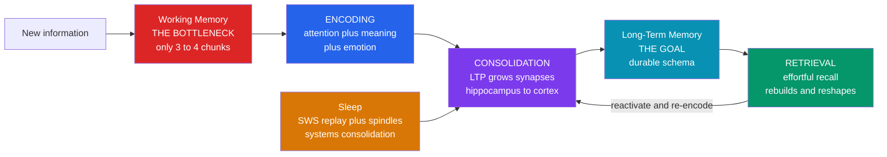

# 🧠 Memory and the Learning Brain

> [!abstract] TL;DR
> Learning *is* memory formation, so a learner's leverage lies in the three stages they can actually influence: **encoding** (get material past the narrow working-memory bottleneck by making it meaningful, attended, and emotionally salient), **consolidation** (let the brain stabilise the trace — mostly during **sleep**, via hippocampal replay that grows synaptic strength through **LTP**), and **retrieval** (recall is not playback but reconstruction, and every effortful recall physically *strengthens and rewrites* the trace). The actionable core: space your study, sleep between sessions, test yourself instead of re-reading, and make new facts *mean* something. This note frames the memory science for action — the biological and cognitive mechanics live in the linked descriptive notes.

---

## Intuition

**Analogy: a footpath worn across a field, deepened only at night.**

Picture every new thing you learn as a faint track pressed into tall grass the first time you walk it. Three facts about that track map onto the three things a learner controls:

- **Encoding — how you walk it the first time.** Only a few people can squeeze through the gate at once (that gate is *working memory* — it holds barely three or four things). If you stride through with purpose and connect the route to a landmark you already know, you flatten a clear line. If you wander through distracted, you leave almost nothing.
- **Consolidation — the track hardens overnight, not while you walk.** Counter-intuitively, the path does not set while you are walking it. It sets *between* walks, mostly **during sleep**, as the field quietly "re-walks" the day's routes for you. Skip the night and the grass springs back up.
- **Retrieval — every re-walk deepens *and reshapes* the path.** Finding the track again when it has partly faded takes effort, and that very effort is what carves it deeper. But you never re-trace it perfectly: each walk shifts the line slightly, and a misleading signpost planted afterward can reroute it. The path is a living groove, not a photograph of your first walk.

The whole discipline of studying well is just: walk with intent, space your walks, sleep between them, and re-walk from memory rather than tracing a fresh copy.

---

## How It Works

Learning turns a fleeting experience into a durable, retrievable change in the brain. It runs on one universal pipeline — **encoding → consolidation → retrieval** — gated at the front by a tiny buffer and, crucially, *reshaped every time you use it*. A learner cannot rewrite their biology, but they can steer all three stages.

### 1. Working memory is the bottleneck; long-term memory is the goal

Everything you learn must first pass through **working memory**, which holds only about **4 chunks** and drops them within seconds if not rehearsed (see [[Working_Memory_and_Cognitive_Load]]). Overload it — too many novel elements at once — and nothing reaches long-term storage. The learner's job at encoding is to *reduce load*: chunk material, lean on existing schemas, and remove distraction so the narrow gate is spent on the essentials. **Long-term memory**, by contrast, is effectively unlimited and is the destination (see [[Long_Term_Memory_Systems]]).

### 2. The three processes a learner can actually influence

1. **Encoding** — quality beats quantity of exposure. Durability tracks *depth of processing*: asking "what does this **mean**, and how does it connect to what I know?" builds a far stronger trace than re-reading. **Meaning** and **emotion** both amplify encoding — the amygdala tags salient material so the hippocampus prioritises it. Attention is the on-switch; unattended input is never encoded.
2. **Consolidation** — the fresh, fragile trace stabilises over hours to years. *Synaptic* consolidation (minutes-hours) locks in individual synapses; *systems* consolidation (weeks-years) migrates the memory from hippocampus into neocortex, driven heavily by **sleep** (see [[Sleep_and_Circadian_Rhythms]]). Spacing study across days hands the brain multiple consolidation windows.
3. **Retrieval** — practising recall is not just a test of learning, it is one of the most powerful *causes* of it. Each successful effortful retrieval strengthens the trace more than the original study did, and reopens it for updating (**reconsolidation**).

### 3. The neural basis: LTP and Hebbian plasticity

At the synapse, learning is **long-term potentiation (LTP)**: when a presynaptic neuron reliably helps fire a postsynaptic one, NMDA-receptor coincidence detection triggers AMPA-receptor insertion and structural growth, so the connection strengthens (see [[Synaptic_Plasticity_and_LTP]]). This is **Hebb's rule** — *"cells that fire together wire together."* Repeated, well-timed activation of the same pattern is literally what physically encodes a memory. Consolidation and spacing work because they schedule that co-firing for maximum, durable potentiation.

### 4. Sleep and replay finish the job

During **slow-wave sleep**, the hippocampus **replays** the day's activity as compressed sharp-wave ripples, coupled to cortical slow oscillations and spindles. This offline replay is what transfers memories into cortex and grows their stability — which is why a night of sleep after study beats an equal stretch of waking, and why sleep deprivation directly degrades retention (see [[Learning_and_Memory_Systems]]).

### 5. Memory is reconstructive, not a recording

Retrieval rebuilds the trace from fragments plus inference — it never replays a fixed file. This is why **retrieval changes memory**: recalling reshapes it, and post-event misinformation can distort it. For learners this is a feature: because recall re-encodes, self-testing is a study method, not merely an assessment. The **encoding-retrieval match** (transfer-appropriate processing) means you remember best when the *mode* of practice matches the mode of the eventual test — practise the way you will need to perform.



---

## Key Concepts

### Secondary Level

**Working memory is the gate; long-term memory is the store.** You can only think about a few things at once. Learning fails when you try to force too much through that gate at once — break material into chunks and connect it to what you already know so each chunk costs less.

**Three stages you control: encode, consolidate, retrieve.** *Encoding* is getting it in (pay attention, make it meaningful). *Consolidation* is making it stick (space your study, sleep). *Retrieval* is getting it back out (practise recalling, not just re-reading).

**Deeper meaning beats more repetition.** Answering "what does this mean and how does it link to what I know?" produces a far more durable memory than reading the same page five times. Meaning and emotion both make things stick.

**Sleep is study time.** A memory hardens mostly *after* the session, and mostly during sleep. Pulling an all-nighter trades away the very process that would have locked the material in.

### Undergraduate Level

**Levels of processing and the generation effect.** Craik & Lockhart (1972): retention depends on depth of encoding, not raw rehearsal time. The **generation effect** (Slamecka & Graf, 1978) sharpens this — information you *produce yourself* (filling a blank, deriving an answer) is remembered better than the same information read passively, because generation forces deeper, self-referential processing.

**The testing effect (retrieval practice).** Roediger & Karpicke (2006): a delayed recall test produces more durable learning than re-studying for the same time. Retrieval is not neutral measurement; the act of reconstructing a memory *strengthens* it — a phenomenon sometimes called test-enhanced learning. This is the single most transferable finding in the science of studying.

**Encoding specificity and transfer-appropriate processing.** Tulving & Thomson (1973): recall succeeds when retrieval cues overlap with the cues present at encoding. **Transfer-appropriate processing** (Morris, Bransford & Franks, 1977) generalises this to *process*: you perform best when the cognitive operations at test match those at study. Practising recognition prepares you poorly for a free-recall exam, and vice versa — practise in the mode you will be tested in.

**Desirable difficulties (Bjork).** Conditions that feel harder during study — spacing, interleaving, effortful retrieval — slow apparent progress but *improve* long-term retention. The discomfort is the mechanism, not a bug. This directly opposes the **fluency illusion**, where easy, smooth re-reading feels like mastery while building little durable memory.

**Systems consolidation and sleep-dependent replay.** The standard model (Squire): the hippocampus temporarily binds a memory and, over weeks, trains the neocortex to hold it independently. Slow-wave sleep drives this via **hippocampal replay** — compressed re-activation of waking sequences — coupled to slow oscillations and spindles. Targeted memory reactivation studies (cueing a learned item with an odour or sound during sleep) causally boost recall of the cued material.

### Graduate Level

**Reconsolidation as a learning window.** Nader, Schafe & LeDoux (2000): reactivating a consolidated memory returns it to a labile, protein-synthesis-dependent state for a few hours before it re-stabilises. For education this reframes every act of retrieval as an *update opportunity* — recall in a richer context, correct an error at that moment, and the corrected version is what re-consolidates. It also explains why retrieving a *wrong* answer and then getting feedback outperforms passively re-reading the right one.

**Complementary Learning Systems (McClelland, McNaughton & O'Reilly, 1995).** Two learning rates by design: a fast hippocampus that encodes single episodes with sparse, non-overlapping codes, and a slow neocortex that extracts statistical regularities into schemas over many interleaved experiences. The slow cortical rate is not a flaw — it prevents new learning from catastrophically overwriting old (the same catastrophic-forgetting problem that plagues artificial neural networks). Interleaving and spacing are, in effect, feeding the cortical system the interleaved replay it needs.

**Schema-accelerated consolidation (Tse et al., 2007).** When new information slots into a well-formed prior schema, it can become hippocampus-independent within ~48 hours rather than weeks, via medial-PFC-hippocampal interaction. Practical implication: building strong organising frameworks *first* makes all subsequent related facts consolidate faster — expertise compounds.

**Metamemory and the monitoring problem.** Learners systematically mis-judge their own learning: they mistake *processing fluency* for durable knowledge, so they abandon effective-but-effortful strategies (self-testing, spacing) in favour of comfortable-but-weak ones (re-reading, highlighting). Effective self-regulated learning requires deliberately trusting delayed-test performance over the in-the-moment feeling of ease — a metacognitive correction, not just a study tactic.

---

## Python Demo

```python
# numpy + matplotlib only.
# Model: memory consolidation and the role of SLEEP.
# Retrieval strength follows R = exp(-(days since last activity) / S), where S is
# the trace's STABILITY in days. Stability grows only on NIGHTS OF SLEEP that
# follow an active (study or review) day -- this is sleep-dependent systems
# consolidation. Spacing controls how many high-value consolidation nights the
# trace receives, and effortful (partly forgotten) retrieval earns a larger boost
# (the "desirable difficulty" bonus).
#
# We compare:
#   CRAMMER -- many repetitions massed into one day  -> only ONE consolidation night.
#   SPACED  -- one study + reviews spread over weeks  -> FIVE consolidation nights.
import numpy as np
import matplotlib.pyplot as plt

DAYS            = 40
BASE_S          = 1.0    # stability of a fresh, unconsolidated trace (~1 day)
DIFFICULTY_GAIN = 5.0    # extra overnight consolidation when recall was effortful

def simulate(active_days, per_session_gain):
    """active_days: day indices on which the learner studies/reviews.
    Each such day is followed by a night of sleep that consolidates the trace
    (stability S multiplies). Returns end-of-day retrieval strength for every day."""
    S = BASE_S
    first = active_days[0]
    t_last = first
    active = set(active_days)
    strength = np.zeros(DAYS)
    for day in range(DAYS):
        # retrieval strength as the day begins (before any study)
        R_now = np.exp(-(day - t_last) / S) if day >= t_last else 0.0
        if day in active:
            # effortful recall of a partly-forgotten trace earns a bigger reward
            effort = 0.0 if day == first else max(1.0 - R_now, 0.0)
            S = S * (1.0 + per_session_gain + DIFFICULTY_GAIN * effort)  # sleep consolidates
            t_last = day
        strength[day] = np.exp(-(day - t_last) / S)
    return strength, S

# CRAMMER: 4 reps massed on day 0. Extra same-day reps CANNOT buy extra sleep
# nights, so we model one strong consolidation night (larger single gain).
cram_strength, S_cram = simulate(active_days=[0], per_session_gain=1.2)

# SPACED: study on day 0, review on days 2, 6, 13, 24 (expanding schedule) ->
# five sleep-backed consolidation nights across the month.
spaced_days = [0, 2, 6, 13, 24]
spaced_strength, S_spaced = simulate(active_days=spaced_days, per_session_gain=0.6)

print(f"Crammer: final stability = {S_cram:6.1f} d | strength on day 40 = {cram_strength[-1]:.1%}")
print(f"Spaced : final stability = {S_spaced:6.1f} d | strength on day 40 = {spaced_strength[-1]:.1%}")

# --- Track stability after each consolidation night (spaced schedule) ----------
S_track, S = [], BASE_S
for i, d in enumerate(spaced_days):
    prev = np.exp(-(d - spaced_days[i-1]) / S) if i > 0 else 0.0
    effort = 0.0 if i == 0 else max(1.0 - prev, 0.0)
    S = S * (1.0 + 0.6 + DIFFICULTY_GAIN * effort)
    S_track.append(S)

# --- Plot ----------------------------------------------------------------------
fig, (ax1, ax2) = plt.subplots(1, 2, figsize=(13, 5))
d_axis = np.arange(DAYS)

ax1.plot(d_axis, spaced_strength, color="steelblue", lw=2, label="Spaced + sleep")
ax1.plot(d_axis, cram_strength,   color="tomato",    lw=2, label="Crammed (one night)")
for d in spaced_days:
    ax1.axvline(d, color="steelblue", alpha=0.25, lw=0.8)
    ax1.scatter(d, 1.0, color="steelblue", s=35, zorder=5)
ax1.axvline(0, color="tomato", alpha=0.25, lw=0.8)
ax1.set_xlabel("Days since first study")
ax1.set_ylabel("Retrieval strength  R = exp(-t / S)")
ax1.set_title("Consolidation over days: spacing + sleep vs cramming")
ax1.set_ylim(0, 1.05)
ax1.legend(fontsize=9)

ax2.plot(range(1, len(S_track) + 1), S_track, marker="o", color="purple", lw=2)
ax2.set_xlabel("Consolidation cycle (review + night of sleep)")
ax2.set_ylabel("Trace stability S [days]")
ax2.set_title("Each spaced review + sleep multiplies stability")
ax2.set_xticks(range(1, len(S_track) + 1))
ax2.grid(alpha=0.3)

plt.tight_layout()
plt.savefig("memory_consolidation.png", dpi=150)
print("Saved memory_consolidation.png")
```

**What the demo shows.** Right after cramming, retrieval strength is high — but the crammer gets only **one** consolidation night, so stability tops out near ~2 days and the trace has essentially decayed by week two. The spaced learner starts weaker on day 0 yet gains a **fresh consolidation night after every review**, and because each review catches the trace partly forgotten, the "desirable difficulty" bonus makes stability climb multiplicatively (right panel) to ~150+ days. By day 40 the spaced trace is still near-fully retrievable while the crammed one is gone. The lesson is mechanistic, not motivational: consolidation is sleep-gated, so extra same-day repetitions cannot substitute for extra nights spread across time.

---

## Real-World Applications

- **Spaced-repetition tools (Anki, SuperMemo).** Directly operationalise this note: they estimate each item's stability and schedule the next review just as it is about to be forgotten, harvesting one consolidation cycle per review. Medical and language learners report multi-fold efficiency gains over massed re-reading.
- **Retrieval-practice classroom design.** Low-stakes quizzing, "brain dumps," and flashcards convert testing from assessment into a primary learning event. Interleaving problem types and spacing units across the term compound the effect. Highlighting and re-reading — the most *common* student habits — are among the least effective because they manufacture fluency without durable encoding.
- **Sleep-aware study scheduling.** Because systems consolidation is sleep-driven, "study, then sleep" beats "study, then cram more." Reviewing material shortly before sleep, and never trading sleep for extra hours the night before an exam, follows directly from replay-based consolidation.
- **Worked-example fading for novices.** Since working memory is the bottleneck, instruction for beginners should minimise extraneous load (worked examples, chunking) and only *then* shift to effortful generation as schemas form — matching the encoding stage to the learner's current capacity.
- **Making material meaningful and emotional.** Narrative, analogy, and personal relevance recruit deeper semantic and affective encoding, so well-designed teaching connects new facts to existing schemas and to something the learner cares about rather than presenting isolated facts.

---

## Common Pitfalls

- **"Memory is a recording."** The most damaging myth. Retrieval reconstructs and reconsolidates — it never replays a fixed file. Believing memory is playback leads learners to treat re-reading as sufficient and to trust confident-but-false recollections.
- **The fluency illusion.** Smooth, easy re-reading *feels* like learning but predicts poor delayed recall. Mistaking processing fluency for durable knowledge is why students abandon effective, effortful methods. Judge learning by a delayed test, not by how easy the material feels.
- **Cramming (massing).** Produces high immediate performance and near-total loss weeks later, because it collapses many repetitions into a single consolidation window. It optimises the wrong timescale.
- **Trading away sleep.** Since consolidation is largely sleep-dependent, sacrificing sleep to study more removes the very process that would have made the studying stick.
- **Recognition ≠ recall.** Recognising an answer in a list is far easier than generating it. Study that only builds recognition (skimming, multiple-choice review) fails on free-recall exams — an encoding-retrieval-match failure.
- **Passive over generative study.** Copying notes and highlighting feel productive but skip the generation and retrieval effort that actually drive consolidation. Turn every input into a question you must answer from memory.

---

## Related Concepts

- [[Working_Memory_and_Cognitive_Load]] — the front-end bottleneck: why encoding fails under overload and how chunking and schemas protect the narrow gate; the "cause" side of encoding difficulty this note frames for action.
- [[Long_Term_Memory_Systems]] — the cognitive descriptive account of the declarative/non-declarative taxonomy, the forgetting curve, and false memory; this note reuses its pipeline but foregrounds *learner-controllable* levers rather than the taxonomy.
- [[Learning_and_Memory_Systems]] — the neuroscience substrate: hippocampal indexing, engram cells, replay, and the molecular consolidation cascade that biologically *implement* the processes described here.
- [[Synaptic_Plasticity_and_LTP]] — the synaptic mechanism of Hebbian learning ("fire together, wire together") that physically encodes and strengthens each trace, and that spacing/consolidation exploit.
- [[Sleep_and_Circadian_Rhythms]] — slow-wave replay, spindles, and slow oscillations that drive the systems consolidation the Python demo models; why sleep loss directly degrades retention.

---

## Review Questions

**Tier 1 — Conceptual (can you explain it to a peer?)**
1. Name the three memory processes a learner can influence, and for each give one concrete study action that improves it. Why is working memory described as the "bottleneck" while long-term memory is the "goal"?
2. State Hebb's rule in your own words and explain how long-term potentiation makes it a physical, synaptic event rather than a metaphor.

**Tier 2 — Applied / scenario**
3. Two students prepare for an exam three weeks away with equal total study time. One does four intense sessions the night before; the other studies once and reviews on days 2, 6, 13, and 24, sleeping between each. Predict who scores higher, who *feels* more prepared beforehand, and explain the mismatch using consolidation, sleep-dependent replay, and the fluency illusion.
4. A student re-reads a chapter until it feels effortless and easy. Using transfer-appropriate processing and the testing effect, explain why they may still fail a free-recall exam, and prescribe a study change that fixes the encoding-retrieval mismatch.

**Tier 3 — Analytical / trade-off**
5. Reconsolidation means every retrieval briefly destabilises a memory. Argue how this is simultaneously a risk (misinformation, distortion) and an opportunity (error correction, strengthening) for a learner, and design a study routine that exploits the opportunity while minimising the risk.
6. Complementary Learning Systems theory pairs a fast hippocampus with a slow neocortex to avoid catastrophic forgetting. Explain how spacing and interleaving effectively supply the neocortex with the interleaved replay it needs, and why this predicts that building a strong prior schema first should accelerate consolidation of all later related material.

---

## Sources

- Craik, F. I. M. & Lockhart, R. S. (1972). "Levels of processing: A framework for memory research." *Journal of Verbal Learning and Verbal Behavior*, 11(6), 671–684.
- Roediger, H. L. & Karpicke, J. D. (2006). "Test-enhanced learning: Taking memory tests improves long-term retention." *Psychological Science*, 17(3), 249–255.
- Bjork, R. A. & Bjork, E. L. (2011). "Making things hard on yourself, but in a good way: Creating desirable difficulties to enhance learning." In *Psychology and the Real World.* Worth Publishers.
- Rasch, B. & Born, J. (2013). "About sleep's role in memory." *Physiological Reviews*, 93(2), 681–766.
- McClelland, J. L., McNaughton, B. L. & O'Reilly, R. C. (1995). "Why there are complementary learning systems in the hippocampus and neocortex." *Psychological Review*, 102(3), 419–457.
- Dunlosky, J. et al. (2013). "Improving students' learning with effective learning techniques." *Psychological Science in the Public Interest*, 14(1), 4–58.

---

#learning-science #memory #consolidation #neuroplasticity #sleep
