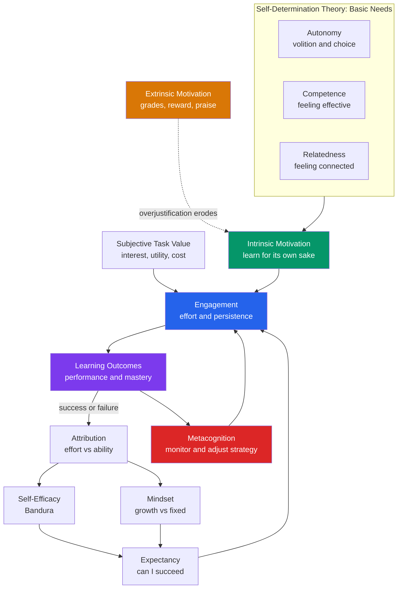

# 🚀 Motivation and Learning

> [!abstract] TL;DR
> Motivation is the engine that decides *whether* a learner engages, *how hard* they try, and *how long* they persist — and it is the single best behavioral predictor of learning that instruction cannot supply on its own. The most robust findings are that **intrinsic motivation** (learning for interest and mastery) is deeper and more durable than **extrinsic motivation** (learning for grades or rewards); that motivation multiplies as **expectancy of success × subjective value**, so it collapses if *either* factor is near zero; and that the psychological levers teachers actually control are **autonomy, competence, and relatedness** (Self-Determination Theory), the **framing of success and failure** (attribution, mindset, self-efficacy), and the **cultivation of interest and value**. Rewards, mindset slogans, and grit are all real but easily oversold — the replication literature demands nuance.

---

## Intuition

**Analogy — the campfire.** Think of a learner's motivation as a campfire. **Intrinsic motivation** is dry wood that has caught: it burns on its own, radiates outward, and keeps going after you walk away. **Extrinsic rewards** are lighter fluid: they produce an impressive flare instantly, which is genuinely useful for *starting* a cold, damp fire (a boring or aversive task nobody would touch otherwise). But if you keep dousing an already-burning fire with lighter fluid, you scorch the wood — and the day you run out of fluid, the fire is *weaker* than if you had just let the wood burn. That scorching is the **overjustification effect**: pay a child to do something they already loved, and their love cools once the pay stops.

Two more knobs control the blaze. **Expectancy** ("can I actually get this to light?") and **value** ("do I even want a fire?") are not additive — they *multiply*. All the desire in the world won't help if you're certain you'll fail, and perfect confidence is worthless if you don't care. And whether a gust of wind (a failure, a bad grade) *smothers* the fire or *feeds oxygen* to it depends entirely on how the learner explains the gust to themselves — the story of "I'm just not a fire person" versus "the wood wasn't stacked right, let me re-stack."

---

## How It Works

### Core Mechanics

Motivation for learning is best understood as a **loop**, not a fixed quantity a learner "has":

1. **Basic psychological needs set the fuel type.** Self-Determination Theory (Deci & Ryan) holds that humans have three innate needs — **autonomy** (acting from one's own values and choices), **competence** (feeling effective), and **relatedness** (feeling connected to people who care). When a learning environment *supports* these needs, motivation is **autonomous** (intrinsic and self-endorsed); when it *thwarts* them, motivation becomes **controlled** (compliance, anxiety) or vanishes into **amotivation**.

2. **Expectancy and value gate engagement.** Before investing effort, a learner implicitly computes two things: *how likely am I to succeed* (expectancy) and *how much is this worth to me* (subjective task value: interest, usefulness, importance, minus cost). Because these **multiply**, motivation is fragile at the edges — near-zero on either factor zeroes out effort.

3. **Effort and persistence produce outcomes.** Engagement converts into performance and, over time, mastery.

4. **Outcomes are interpreted, not just recorded.** The learner explains success and failure (**attribution**: was it effort, ability, luck, task difficulty?). Those explanations update **self-efficacy** (task-specific confidence) and **mindset** (belief that ability is fixed or growable), which feed straight back into the *next* expectancy judgment — closing the loop.

5. **Metacognition rides on top.** Motivation supplies the *will* to deploy effortful strategies; metacognition supplies the *skill* to monitor and adjust them. Neither works alone: an unmotivated expert strategist won't bother, and a motivated novice with no monitoring burns effort inefficiently.

### Flow / Architecture



---

## Key Concepts

### Secondary Level

**Intrinsic vs. extrinsic motivation.** Intrinsic motivation means doing a learning activity for its inherent satisfaction — curiosity, challenge, enjoyment, the pull of an interesting problem. Extrinsic motivation means doing it for a separable outcome — a grade, a sticker, parental approval, avoiding punishment. Both drive behavior, but intrinsically motivated learning is associated with deeper processing, better conceptual understanding, more creativity, and greater persistence, whereas purely extrinsic motivation tends to produce surface strategies aimed at the reward (memorize-and-dump for the test).

**The overjustification effect.** Offering a salient, controlling, performance-contingent reward for an activity a learner *already* finds interesting can *reduce* their later interest once the reward is withdrawn. In the classic study (Lepper, Greene & Nisbett, 1973), preschoolers who loved drawing were promised a "Good Player" certificate for drawing; afterward, in free time, they drew *less* than children who got no reward or an unexpected one. The reward reframes play as work ("I must only be doing this for the prize"). Rewards do *not* backfire this way when the task was boring to begin with, when the reward is unexpected, or when it carries *informational* rather than *controlling* meaning ("this recognizes your skill" versus "do this to get paid").

**Self-efficacy (Bandura).** Self-efficacy is a learner's belief in their capacity to succeed *at a specific task* — distinct from global self-esteem. It is arguably the strongest cognitive predictor of effort and persistence. Its four sources, from strongest to weakest: **mastery experiences** (actually succeeding), **vicarious experience** (seeing a similar peer succeed), **verbal persuasion** (credible encouragement), and **interpretation of physiological/emotional states** (reading a racing heart as "excited and ready" rather than "terrified").

**Growth vs. fixed mindset (Dweck).** A **fixed mindset** treats intelligence and talent as unchangeable, so failure feels like a verdict on the self and challenge is threatening. A **growth mindset** treats ability as developable through effort and strategy, so failure is information and challenge is an opportunity. The *appeal* is obvious; the *nuance* (see Graduate) is essential.

### Undergraduate Level

**Self-Determination Theory in full (Deci & Ryan, 1985; 2000).** SDT places motivation on a continuum of internalization rather than a simple intrinsic/extrinsic binary:

| Regulation type | Locus | Example in a classroom |
|---|---|---|
| **Amotivation** | none | "Why am I even here" |
| **External** | fully extrinsic | studying only to avoid punishment |
| **Introjected** | partly internal, still controlled | studying to avoid guilt or to feel worthy |
| **Identified** | mostly autonomous | studying because "this matters for my goals" |
| **Integrated** | autonomous | studying because it fits who I am |
| **Intrinsic** | fully autonomous | studying because it's fascinating |

The practical fulcrum is the **autonomy-supportive vs. controlling** distinction in how authorities behave. *Autonomy-supportive* teachers offer meaningful choices, provide rationales for requests, acknowledge students' feelings and perspectives, minimize pressure, and use informational feedback. *Controlling* teachers use deadlines-as-threats, pressuring language ("you *should*", "you *must*"), contingent rewards and punishments, and comparison. Meta-analyses link autonomy support to higher intrinsic motivation, engagement, conceptual learning, and wellbeing.

**Expectancy-Value Theory (Eccles, Wigfield).** Modern EVT (Eccles et al., 1983; Wigfield & Eccles, 2000) models achievement choices and effort as a function of two families of beliefs:

- **Expectancy of success** — closely tied to self-efficacy and to *ability beliefs*: "How well will I do on this task?"
- **Subjective task value**, decomposed into four parts:
  - **Attainment value** — importance to identity ("being good at math matters to who I am")
  - **Intrinsic/interest value** — enjoyment of the activity
  - **Utility value** — usefulness for goals ("I need this for medicine")
  - **Cost** — effort, lost alternatives, and anxiety (the *subtractive* term teachers most often forget)

Because expectancy and value combine roughly *multiplicatively*, low-cost interventions that raise perceived **utility value** (e.g., having students write about how course material connects to their lives) produce measurable gains, especially for students with low initial confidence.

**Achievement Goal Theory.** Learners pursue tasks under different *reasons for competence*:

- **Mastery goals** — aim to *learn and improve* against one's own past ("I want to understand this"). Linked to deep strategies, persistence after failure, and interest.
- **Performance goals** — aim to *demonstrate ability relative to others*. Split into **performance-approach** (look smart, sometimes helpful for grades) and **performance-avoidance** (avoid looking dumb — consistently the most maladaptive: anxiety, self-handicapping, shallow strategies).

The **2×2 framework** (Elliot & McGregor) crosses mastery/performance with approach/avoidance. Classrooms have a *goal structure* (competitive grading pushes performance goals; portfolios and revision push mastery goals) that shapes which goals students adopt.

**Attribution Theory (Weiner).** After an outcome, learners explain *why*, and the explanation — not the outcome itself — drives future motivation. Weiner classifies causes along three dimensions:

| Dimension | Poles | Consequence |
|---|---|---|
| **Locus** | internal vs. external | affects pride/self-esteem |
| **Stability** | stable vs. unstable | affects *expectancy* of future success |
| **Controllability** | controllable vs. uncontrollable | affects shame, guilt, and help-seeking |

The adaptive attribution for failure is **internal, unstable, controllable** — *effort* ("I didn't study the right way") — because it preserves the expectancy that next time can differ. The corrosive attribution is **internal, stable, uncontrollable** — *ability* ("I'm just bad at this") — which predicts **learned helplessness**. Attribution *retraining* is a core mechanism behind mindset and self-efficacy interventions.

**Interest development (Hidi & Renninger four-phase model).** Interest is not a fixed trait but something that can be *grown* through phases: (1) **triggered situational interest** (a surprising demo grabs attention), (2) **maintained situational interest** (meaningful tasks keep it alive), (3) **emerging individual interest** (the learner starts seeking it out voluntarily), (4) **well-developed individual interest** (self-sustaining, stored value and knowledge). The instructional implication: you can't demand interest, but you can *trigger* and *scaffold* it — and early situational interest depends on the environment while later individual interest depends on the learner's accumulating knowledge.

### Graduate Level

**The mindset replication debate.** Dweck's mindset theory became one of the most influential ideas in education — and one of the most contested. Two large meta-analyses by Sisk et al. (2018) found that the *correlation* between mindset and academic achievement is weak on average (r ≈ 0.10), and that mindset *interventions* have small average effects (d ≈ 0.08), with many pre-registered replications finding null results. However, the picture is not "mindset is a myth": effects are **conditional and targeted**. The **National Study of Learning Mindsets** (Yeager et al., 2019), a pre-registered RCT across a nationally representative sample of US 9th-graders, found that a short online growth-mindset intervention produced small but real gains *concentrated in lower-achieving students* and *only where the school's peer norms and classroom climate afforded taking on challenge*. The mature reading: mindset is a **moderator that requires a supportive context** to matter, not a universal lever, and heterogeneity of effects is the finding, not noise. This is a live case study in why education science needs pre-registration, effect-size realism, and attention to *for whom and under what conditions*.

**Grit and its critiques (Duckworth).** Grit — "perseverance and passion for long-term goals" (Duckworth et al., 2007) — captured public imagination. Critiques are substantial: (1) **Construct redundancy** — meta-analytically, grit correlates very highly with the Big Five trait *conscientiousness* (r ≈ 0.84 for the perseverance facet), raising the question of whether it is a genuinely new construct. (2) **Weak incremental validity** — grit predicts performance only modestly and adds little beyond conscientiousness and prior achievement. (3) **The passion facet under-performs** the perseverance facet, undermining the two-factor structure. (4) **Survivorship and equity concerns** — exhorting disadvantaged students to be "grittier" can pathologize structural barriers as personal deficiencies. Grit is best treated as a repackaging of conscientiousness with useful applied framing, not a distinct engine of achievement.

**Motivation × metacognition (self-regulated learning).** In models of **self-regulated learning** (Zimmerman; Winne & Hadwin; Pintrich), motivation and metacognition are interdependent across three phases: **forethought** (goal-setting, efficacy, value appraisal, strategic planning), **performance** (strategy use, self-monitoring, attention control), and **self-reflection** (self-judgment, attribution, satisfaction — which loops back into the next forethought). Key interactions: self-efficacy predicts *whether* a learner will invest in effortful metacognitive strategies at all; value predicts *strategy depth*; and metacognitive success (or failure) feeds attributions that update efficacy. Crucially, effortful strategies (retrieval practice, elaboration) often *feel* harder and slower than passive rereading, producing a **metacognitive illusion** — learners misread desirable difficulty as poor learning and disengage. Sustaining evidence-based strategies therefore requires *motivational* support (reframing the difficulty as the mechanism of learning), not just knowing the technique.

**Costs, and the multiplicative structure.** EVT's often-ignored **cost** component (effort cost, opportunity cost, emotional cost) is where much real-world demotivation lives, and it interacts with expectancy: for a low-efficacy learner, the *same* task carries higher perceived cost. This is why interventions frequently work by *lowering perceived cost or raising expectancy* rather than by cheerleading value. The multiplicative expectancy × value structure (modeled below) formalizes why single-factor interventions ("just make it relevant!" / "just build confidence!") underperform: they address one term while the other stays near zero.

---

## Python Demo

```python
# Expectancy-Value Theory (Eccles & Wigfield) + the Overjustification Effect
#
# Part A: Model motivated effort as  M = Expectancy x Value.
#         Both factors sit in [0, 1]. Because they MULTIPLY, motivation
#         collapses toward zero whenever EITHER expectancy OR value is low --
#         "I can't do it" kills motivation as surely as "I don't care".
#         We visualise the full interaction surface as a heatmap.
#
# Part B: Simulate the overjustification effect. A learner starts with high
#         intrinsic motivation for an inherently interesting task. A contingent
#         extrinsic reward is introduced (trials 20-40) then withdrawn. Intrinsic
#         motivation erodes while the reward is present (the activity gets
#         re-attributed to the reward) and only partially recovers, so total
#         motivation ends BELOW its unrewarded baseline. A control learner who
#         is never rewarded stays flat.

import numpy as np
import matplotlib.pyplot as plt

# ----- Part A: Expectancy x Value interaction surface -----
grid = np.linspace(0, 1, 101)
E, V = np.meshgrid(grid, grid)      # expectancy, value
M = E * V                           # multiplicative motivation

# ----- Part B: Overjustification dynamics -----
N = 60
intrinsic = np.zeros(N)             # rewarded learner's intrinsic motivation
intrinsic_ctrl = np.zeros(N)        # control learner, never rewarded
extrinsic = np.zeros(N)             # extrinsic motivation while reward is on
intrinsic[0] = 1.0
intrinsic_ctrl[0] = 1.0

reward_on = np.zeros(N, dtype=bool)
reward_on[20:40] = True             # reward introduced then withdrawn

erode = 0.12      # rate intrinsic motivation is undermined while rewarded
recover = 0.03    # slow, incomplete recovery once the reward is gone
rew_value = 0.6   # size of the extrinsic incentive while active

for t in range(1, N):
    extrinsic[t] = rew_value if reward_on[t] else 0.0
    if reward_on[t]:
        # activity is re-attributed to the reward -> intrinsic interest decays
        intrinsic[t] = intrinsic[t-1] - erode * intrinsic[t-1]
    else:
        # partial, incomplete recovery toward the ceiling of 1.0
        intrinsic[t] = intrinsic[t-1] + recover * (1.0 - intrinsic[t-1])
    intrinsic_ctrl[t] = intrinsic_ctrl[t-1]   # never rewarded -> stable

total = intrinsic + extrinsic

# ----- Plot -----
fig, axes = plt.subplots(1, 2, figsize=(14, 5.5))

im = axes[0].imshow(M, origin="lower", extent=[0, 1, 0, 1],
                    aspect="auto", cmap="viridis", vmin=0, vmax=1)
axes[0].contour(E, V, M, levels=[0.1, 0.25, 0.5, 0.75],
                colors="white", linewidths=0.8)
axes[0].set_xlabel("Expectancy of Success  E")
axes[0].set_ylabel("Subjective Task Value  V")
axes[0].set_title("Expectancy-Value Interaction\n"
                  "Motivation = E x V collapses if either is near 0")
plt.colorbar(im, ax=axes[0], label="Motivated Effort  M")

trials = np.arange(N)
axes[1].axvspan(20, 40, color="#FFE0B2", label="extrinsic reward active")
axes[1].plot(trials, intrinsic, lw=2.2, color="#059669",
             label="intrinsic (rewarded learner)")
axes[1].plot(trials, total, lw=2.2, color="#2563eb",
             label="total = intrinsic + extrinsic")
axes[1].plot(trials, intrinsic_ctrl, lw=2.0, ls="--", color="#9E9E9E",
             label="intrinsic (control, never rewarded)")
axes[1].axhline(1.0, color="grey", lw=0.8, ls=":")
axes[1].set_xlabel("Trial")
axes[1].set_ylabel("Motivation")
axes[1].set_ylim(0, 1.7)
axes[1].set_title("Overjustification Effect\n"
                  "reward undermines intrinsic motivation; total ends below baseline")
axes[1].legend(fontsize=8, loc="upper right")

plt.tight_layout()
plt.savefig("motivation_and_learning.png", dpi=150)
plt.show()

print(f"Baseline intrinsic motivation:            {intrinsic[0]:.2f}")
print(f"Intrinsic after reward withdrawn (t=59):  {intrinsic[-1]:.2f}")
print(f"Control intrinsic (never rewarded, t=59): {intrinsic_ctrl[-1]:.2f}")
# The rewarded learner's intrinsic motivation ends well below the control's,
# reproducing Deci (1971) and Lepper et al. (1973): a controlling reward
# converts play into work, and the "work" fades when the pay stops.
```

The left heatmap makes the **multiplicative** structure visceral: the bright high-motivation corner requires *both* high expectancy and high value, and the entire bottom edge and left edge are dark — proof that a single-factor fix ("just make it relevant" or "just build confidence") cannot rescue motivation while the other term sits near zero. The right panel reproduces the overjustification signature: during the shaded reward window total motivation spikes (extrinsic fuel), but intrinsic interest quietly erodes, and once the reward is withdrawn the rewarded learner ends up *below* the never-rewarded control.

---

## Real-World Applications

**Duolingo and streak mechanics.** Gamified learning apps lean on extrinsic drivers — XP, streaks, leaderboards, gems. Done well, these *trigger situational interest* and lower the activation energy for a boring-to-start habit (exactly where extrinsic motivation shines). Done poorly, they risk overjustification and streak-anxiety: learners practice to protect the streak, not to learn, and abandon the app the moment the streak breaks. Mature designs pair extrinsic hooks with **competence support** (visible skill growth, adaptive difficulty) so that intrinsic interest can take over — the app tries to become the campfire, not just the lighter fluid.

**Autonomy-supportive classrooms and medicine.** SDT is the evidence base for interventions well beyond school. In medical adherence and behavior-change (smoking cessation, exercise, diabetes management), programs that provide *rationale*, *choice*, and *competence-building* rather than instructions-and-fear produce more durable change — because the behavior gets internalized (identified/integrated regulation) rather than externally imposed.

**Utility-value writing interventions.** A striking translational result from EVT: brief, low-cost writing assignments in which students articulate *how course content connects to their own lives* raise interest and grades, with the largest effects for students who began with low performance expectations (Hulleman & Harackiewicz). This is EVT operationalized — nudging the *value* term for learners whose *expectancy* term is fragile.

**"Wise feedback" and attribution retraining.** Effective feedback often works by shaping *attributions*: pairing high standards with the assurance that the learner can meet them ("I'm giving you this critique because I have high expectations and I know you can reach them") shifts failure attributions from stable-ability to unstable-effort/strategy. This mechanism underlies both mindset and self-efficacy interventions in the field.

**Corporate learning and knowledge work.** Daniel Pink's popularization of SDT ("Autonomy, Mastery, Purpose") reflects the finding that pay-for-performance boosts routine, algorithmic output but *undermines* creative, complex work — precisely the overjustification territory. Effective L&D programs emphasize relevance (utility value), stretch-but-achievable challenge (expectancy/competence), and choice (autonomy) over completion-badge extrinsics.

---

## Common Pitfalls

- **Treating all rewards as poison.** The overjustification effect is *conditional*: it hits salient, controlling, performance-contingent rewards applied to *already-interesting* tasks. For genuinely tedious or aversive tasks nobody would start voluntarily, extrinsic rewards are appropriate and often necessary. The design goal is to fade extrinsic scaffolding as competence and interest build, and to keep rewards *informational* (recognizing skill) rather than *controlling* (buying compliance).

- **Confusing self-efficacy with self-esteem.** Efficacy is task-specific ("can I do *this*?") and predicts effort and persistence; esteem is global self-worth and is a much weaker predictor of learning. Praising a child as "smart" inflates a fragile, ability-based self-image (fixed mindset) rather than building the task-specific, strategy-based confidence that actually helps.

- **Selling mindset and grit as magic bullets.** The replication literature is clear that both have small, heterogeneous, context-dependent effects. Presenting them as guaranteed levers over-promises, invites backlash, and — worse — can shift blame onto individual learners for structural problems ("you just needed more grit"). Use them as *targeted* tools within supportive environments, and report effect sizes honestly.

- **Optimizing one motivational term and ignoring the other.** Because expectancy and value multiply, "make it relevant" fails for a learner convinced they will fail, and "you can do it!" fails for a learner who sees no point. Diagnose *which* term is near zero before intervening — and don't forget the subtractive **cost** term, where a lot of quiet demotivation actually lives.

- **Ignoring the desirable-difficulty illusion.** Effortful, effective strategies feel *worse* than passive ones in the moment, so learners misattribute the difficulty to "I'm not learning" and quit. Sustaining good strategies is a *motivational* problem as much as a metacognitive one — learners must be helped to reframe struggle as the mechanism, not the failure, of learning.

---

## Related Concepts

- [[Theories_of_Motivation]] — the broader Psychology-vault survey (drive, arousal, incentive, and SDT); this note is the learning-focused deep dive into intrinsic/extrinsic dynamics and achievement motivation
- [[Social_Cognitive_Personality]] — Bandura's self-efficacy and reciprocal determinism, and Rotter's locus of control, which supply the "expectancy" machinery used here
- [[Maslows_Hierarchy]] — a competing needs-based account of motivation; SDT's three needs are a more empirically grounded alternative to Maslow's ladder
- [[Decision_Making_and_Reward_Circuits]] — the neural substrate: dopaminergic reward-prediction-error learning and the wanting/liking dissociation that mechanistically underpin extrinsic reward and the overjustification effect
- [[Learning_and_Memory_Systems]] — where motivation cashes out: dopaminergic and emotional salience modulate memory consolidation, so motivated engagement literally changes what is encoded
- [[Operant_Conditioning]] — the reinforcement framework that extrinsic motivation extends; overjustification is a boundary condition on naive "reward the behavior you want" logic

---

## Review Questions

1. **(Conceptual)** A teacher notices that offering weekly "reading points" made her most avid readers read *less* over the semester, while it slightly increased reading among students who previously never read. Using the overjustification effect and the conditions under which rewards undermine versus help, explain both outcomes and propose a revised incentive design.

2. **(Scenario)** A student says, "I'd love to learn statistics — it's clearly useful for my career — but there's no way I'll pass this course." Diagnose which term of expectancy-value theory is failing, predict this student's likely engagement, and name two evidence-based interventions that target the *correct* term rather than the intact one.

3. **(Trade-off / evaluation)** A school district wants to adopt a district-wide growth-mindset program and a "grit curriculum," citing their popularity. Drawing on the Sisk et al. (2018) meta-analyses, the National Study of Learning Mindsets, and the grit-versus-conscientiousness critique, argue for or against, being explicit about effect sizes, moderators, for-whom conditions, and the risk of shifting blame onto learners.

---

## Sources

- [Deci, E.L. & Ryan, R.M. (2000). "The 'What' and 'Why' of Goal Pursuits: Human Needs and the Self-Determination of Behavior." *Psychological Inquiry*, 11(4), 227–268.](https://doi.org/10.1207/S15327965PLI1104_01)
- [Wigfield, A. & Eccles, J.S. (2000). "Expectancy–Value Theory of Achievement Motivation." *Contemporary Educational Psychology*, 25(1), 68–81.](https://doi.org/10.1006/ceps.1999.1015)
- [Sisk, V.F., Burgoyne, A.P., Sun, J., Butler, J.L. & Macnamara, B.N. (2018). "To What Extent and Under Which Circumstances Are Growth Mind-Sets Important to Academic Achievement? Two Meta-Analyses." *Psychological Science*, 29(4), 549–571.](https://doi.org/10.1177/0956797617739704)
- [Yeager, D.S. et al. (2019). "A national experiment reveals where a growth mindset improves achievement." *Nature*, 573, 364–369.](https://doi.org/10.1038/s41586-019-1466-y)
- [Weiner, B. (1985). "An attributional theory of achievement motivation and emotion." *Psychological Review*, 92(4), 548–573.](https://doi.org/10.1037/0033-295X.92.4.548)
- [Hidi, S. & Renninger, K.A. (2006). "The Four-Phase Model of Interest Development." *Educational Psychologist*, 41(2), 111–127.](https://doi.org/10.1207/s15326985ep4102_4)

---

#learning-science #motivation #self-determination #growth-mindset #intrinsic-motivation
