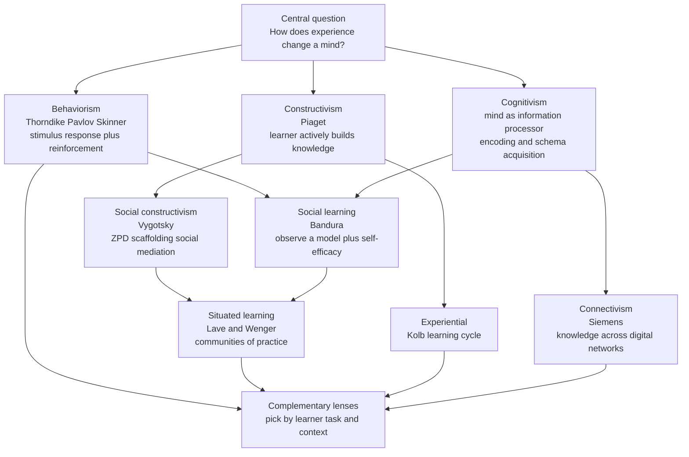

# 🎓 Theories of Learning

> [!abstract] TL;DR
> "Learning theory" is not one idea but a family of competing-yet-complementary answers to a single question: *how does experience change what a mind can do?* **Behaviorism** says learning is a conditioned link between stimulus and response, shaped by reinforcement. **Cognitivism** says learning is information processing — encoding, storing, and retrieving structured knowledge (schemas). **Constructivism** says the learner actively *builds* understanding, individually (Piaget) or socially (Vygotsky). Later frameworks — Bandura's social learning, Kolb's experiential cycle, Lave & Wenger's situated learning, and Siemens' connectivism — extend these roots into observation, reflection, community, and networks. The mature view is that these paradigms are **lenses, not rivals**: each best explains a different slice of the learning that real humans do.

## Intuition — analogy FIRST

Imagine three coaches training the same soccer player.

The **behaviorist coach** never asks what the player is thinking. He runs drills and blows a whistle: good pass, praise; sloppy pass, extra laps. Over hundreds of repetitions the *reward* wires the right movements in. Learning is what you can *observe* the body doing.

The **cognitivist coach** hands the player a tactics tablet. She explains formations, shows video, drills the player on *reading* the field so the right pattern is already in memory before the ball arrives. Learning is what you have *encoded and can retrieve*.

The **constructivist coach** throws the player into small-sided games and lets him discover for himself why a through-ball beats a square pass — sometimes pairing him with a more experienced teammate who nudges him just past what he could figure out alone. Learning is what you *build* by acting on the world and bumping into its resistance.

None of the three coaches is wrong. The player who improves fastest has all three: conditioned reflexes, an organized mental playbook, and hard-won understanding forged in real games. That is the whole point of studying learning theories — not to crown a winner, but to know which lens to pick up when.

---

## How It Works

Every learning theory is a bet about **what changes inside the learner** and **what force drives that change**. Read the major paradigms as answers to those two questions:

1. **Behaviorism (early 1900s–1950s).** The learner is a black box; only observable behavior counts. Thorndike's **law of effect** (1911): responses followed by satisfaction are stamped in, those followed by discomfort are stamped out. Pavlov's **classical conditioning**: a neutral stimulus (bell) paired with a meaningful one (food) comes to trigger the response (salivation). Skinner's **operant conditioning**: behavior is shaped by its consequences — reinforcement raises a behavior's frequency, punishment lowers it. Change = a strengthened stimulus-response association. Driver = reinforcement.

2. **Cognitivism (1950s–, the "cognitive revolution").** Reopen the black box. The mind is an **information-processing system** — a computer that encodes input, manipulates symbols in working memory, and stores structured knowledge (**schemas**) in long-term memory. Learning is acquiring, organizing, and automating these internal representations. Change = new or reorganized mental structures. Driver = attention, rehearsal, meaningful encoding.

3. **Constructivism (Piaget).** Knowledge is not transmitted; it is **constructed** by the learner. New experience is handled by **assimilation** (fitting it into an existing schema) or, when it will not fit, **accommodation** (revising the schema). The engine is **equilibration** — the drive to resolve the discomfort of things that do not add up. Change = self-built cognitive structures. Driver = disequilibrium and active exploration.

4. **Social constructivism (Vygotsky).** Construction is fundamentally **social**. The **Zone of Proximal Development (ZPD)** is the gap between what a learner can do alone and what they can do with help. A more knowledgeable other provides **scaffolding** — temporary support withdrawn as competence grows. Higher cognition is internalized *from* social interaction, not invented in isolation. Driver = mediated, guided participation.

5. **Social learning theory (Bandura).** Learning happens by **observing models**, without direct reinforcement of the learner. Four processes gate it: **attention, retention, reproduction, motivation**. Bandura inserts cognition — expectations and **self-efficacy** (belief in one's capability) — between stimulus and response, bridging behaviorism and cognitivism. Reciprocal determinism: person, behavior, and environment shape each other.

6. **Experiential learning (Kolb).** Learning is a **cycle**: concrete experience → reflective observation → abstract conceptualization → active experimentation → back to new experience. You learn by *grasping* experience (feeling vs thinking) and *transforming* it (watching vs doing).

7. **Situated learning (Lave & Wenger).** Learning is inseparable from the **community of practice** in which it occurs. Newcomers begin at the edge through **legitimate peripheral participation** and move toward full membership as they take on real, consequential work. Knowledge is situated in activity, culture, and context — not a portable substance in one head.

8. **Connectivism (Siemens).** In the digital age, knowledge lives in **networks** — of people, databases, and tools. Learning is the capacity to **form and traverse connections**, to know *where* to find knowledge as much as to hold it. Controversial as a stand-alone theory, but a sharp description of learning under information abundance.



The arrows show *inheritance*, not replacement: Bandura keeps behaviorism's concern with observable action but adds cognition; Vygotsky keeps Piaget's constructed knowledge but socializes it; Lave & Wenger push the social turn all the way into real communities. The bottom node is the mature synthesis — no paradigm wins outright.

---

## Key Concepts

### Secondary (intuitive level)

- **Behaviorism** = rewards and punishments shape what you do. Practice with feedback builds habits.
- **Cognitivism** = your brain is like a computer that takes in, files, and pulls up information. Learning is filling and organizing that filing cabinet.
- **Constructivism** = you understand things by *doing* them and connecting new ideas to what you already know, not by being told.
- The big lesson: good teaching usually **combines** all three — practice, clear explanation, and hands-on discovery.

### Undergraduate

- **Law of effect** (Thorndike), **classical conditioning** (Pavlov), **operant conditioning** (Skinner: reinforcement, punishment, shaping, extinction).
- **Information-processing model**: sensory register → working memory → long-term memory; **schema theory** for how knowledge is chunked and retrieved.
- **Piaget's mechanisms**: schema, assimilation, accommodation, equilibration, disequilibrium.
- **Vygotsky**: Zone of Proximal Development, scaffolding, more knowledgeable other, internalization of social speech.
- **Bandura**: four processes (attention, retention, reproduction, motivation), vicarious reinforcement, self-efficacy, reciprocal determinism.
- **Kolb's cycle**: concrete experience, reflective observation, abstract conceptualization, active experimentation; the four learning styles it generates.
- **Andragogy vs pedagogy** (Knowles): adults are self-directed, draw on life experience, are problem-centered and internally motivated — so adult learning is negotiated, not dictated.

### Graduate

- **Rescorla-Wagner model** (1972) formalized conditioning as **prediction error**: associative strength updates in proportion to how *surprising* an outcome is. This same delta rule underlies **temporal-difference reinforcement learning** in machine learning — a direct bridge from behaviorist psychology to modern AI.
- **The individual-vs-social debate**: Piaget's "lone scientist" child vs Vygotsky's socially mediated mind. Modern developmental science integrates both rather than choosing.
- **Situated cognition's challenge to transfer**: if knowledge is bound to context, why does classroom learning so often fail to transfer to the workplace? Lave & Wenger's answer reframes learning as *changing participation in a community*, not acquiring context-free facts.
- **Is connectivism a theory or a pedagogy?** Critics argue it describes a *learning environment* and epistemology (knowledge as network topology) more than a mechanism; defenders say networked cognition genuinely differs from individual information processing.
- **Levels of analysis, not competition**: much apparent conflict dissolves when theories are mapped to different questions — behaviorism explains *acquisition dynamics*, cognitivism the *representation*, constructivism the *knowledge-building process*, situated theory the *social embedding*. They can coexist like Marr's levels.
- **Nativism vs empiricism** runs underneath all of it: how much of learning is building on innate structure (Chomsky, core knowledge) vs blank-slate shaping (radical behaviorism)?

---

## Python Demo

Three theories make three *qualitatively different* predictions about how performance rises with practice. Plotting them side by side shows why you cannot infer a mechanism from a single data point — you need the *shape* of the whole curve.

```python
# Compare the learning curves predicted by three theories of learning.
# numpy + matplotlib only.
import numpy as np
import matplotlib.pyplot as plt

trials = np.arange(1, 101)

# 1) BEHAVIORIST -- Rescorla-Wagner incremental conditioning.
#    V_{n+1} = V_n + lr * (lambda - V_n)
#    Each reinforced trial closes a fixed fraction of the remaining gap,
#    producing a smooth, negatively accelerated approach to asymptote.
lam = 1.0     # maximum associative strength (the asymptote)
lr = 0.06     # salience * learning-rate product
V = np.zeros(len(trials))
for i in range(1, len(trials)):
    V[i] = V[i - 1] + lr * (lam - V[i - 1])
behaviorist = V

# 2) INSIGHT / CONSTRUCTIVIST -- schema accommodation as a step change.
#    Long plateau of failed assimilation, then a sudden "aha" when the
#    schema reorganizes. Modeled as a steep logistic transition.
insight_trial = 55
steepness = 0.8
insight = 1.0 / (1.0 + np.exp(-steepness * (trials - insight_trial)))

# 3) POWER LAW OF PRACTICE -- skill automation.
#    Fast early gains then an extremely long, slow tail.
#    performance = 1 - trials^(-b)  (rises toward 1, never abruptly)
b = 0.5
power_law = 1.0 - trials.astype(float) ** (-b)

plt.figure(figsize=(9, 5))
plt.plot(trials, behaviorist, lw=2, label="Behaviorist  (Rescorla-Wagner)")
plt.plot(trials, insight, lw=2, label="Insight / Constructivist  (step change)")
plt.plot(trials, power_law, lw=2, label="Power law of practice  (skill)")
plt.axvline(insight_trial, color="gray", ls="--", alpha=0.5)
plt.xlabel("Practice trials")
plt.ylabel("Learned strength / performance  (0 to 1)")
plt.title("One question, three predicted trajectories")
plt.ylim(-0.05, 1.05)
plt.legend()
plt.grid(alpha=0.3)
plt.tight_layout()
plt.show()

# Print where each curve crosses 90% mastery -- the theories disagree sharply.
for name, curve in [("behaviorist", behaviorist),
                    ("insight", insight),
                    ("power_law", power_law)]:
    reached = np.where(curve >= 0.9)[0]
    trial = int(trials[reached[0]]) if reached.size else None
    print(f"{name:>12s}: reaches 90% at trial {trial}")
```

The three curves share start and end points but travel completely different paths: the behaviorist curve is a smooth diminishing-returns exponential, the constructivist curve stays flat then *jumps* at the moment of accommodation, and the power law grabs most of its gain early then crawls. If you only measured trial 30, all three theories would "fit" — the mechanism only reveals itself in the trajectory.

---

## Real-World Applications

- **Instructional design (corporate and K-12).** Modern courses layer paradigms: spaced drills and quizzes (behaviorist reinforcement), worked examples and concept maps (cognitivist schema-building), and project-based tasks (constructivist). Bloom's mastery learning is essentially behaviorism plus feedback loops.
- **Educational technology.** Duolingo's streaks, XP, and spaced repetition are pure operant conditioning; its "explain the grammar" screens are cognitivist; its immersion exercises lean constructivist. Adaptive tutors (e.g., ALEKS, Khan Academy) explicitly target each learner's ZPD.
- **Apprenticeship and onboarding.** Software teams onboard juniors through legitimate peripheral participation — first bug fixes and code reviews at the edge of the community of practice, expanding to core work. This is Lave & Wenger in a standup meeting.
- **Reinforcement learning in AI.** The Rescorla-Wagner prediction-error rule is mathematically the ancestor of temporal-difference learning behind AlphaGo and RLHF — behaviorist psychology quietly powering modern machine learning.
- **Professional and adult education.** Knowles' andragogy reshapes corporate training toward self-directed, problem-centered formats (case studies, on-the-job projects) rather than lecture, because adults reject being taught like children.
- **Networked / self-directed learning.** MOOCs, developer communities (Stack Overflow, GitHub), and "learning in public" embody connectivism: competence is partly the ability to find, filter, and connect distributed knowledge.

---

## Common Pitfalls

- **Treating the theories as rival winners.** The most common student error is "behaviorism was proven wrong by cognitivism." Behaviorism remains the best account of habit formation, conditioning, and skill drilling; it was *supplemented*, not refuted. Ask *which* learning, not *which theory is correct*.
- **Confusing learning with performance.** Behaviorism defines learning as observable behavior, but a learner can *know* something they do not currently *do* (Bandura's Bobo doll: kids learned the aggression by watching but only performed it under the right incentives). Latent learning breaks the strict stimulus-response equation.
- **Over-applying pure discovery learning.** Naive constructivism ("let them figure it all out") ignores cognitive load: novices lack the schemas to guide unstructured exploration and flounder. Guided discovery within the ZPD, with scaffolding, outperforms both pure lecture and pure discovery.
- **Mistaking connectivism for a mechanism.** Connectivism describes an *environment and epistemology* well but is thin on *how* an individual brain forms a connection — it does not replace cognitivist accounts of encoding.
- **Ignoring the learner's stage and age.** Applying formal-operational, abstract instruction to concrete-operational children (Piaget) or teaching adults like children (violating andragogy) both fail for the same reason: the method is mismatched to the learner.
- **Assuming transfer is automatic.** Situated learning warns that knowledge learned in one context often does not port to another. Designing for transfer requires varied practice and explicit bridging, not a single well-taught lesson.

---

## Related Concepts

- [[Piagets_Cognitive_Development]] — the canonical individual constructivist account (assimilation, accommodation, equilibration) plus Vygotsky's ZPD counterpoint.
- [[Observational_Learning]] — Bandura's social learning theory in depth: the four processes, vicarious reinforcement, and self-efficacy.
- [[Operant_Conditioning]] — Skinner's mechanics of reinforcement and punishment, the behaviorist engine referenced here.
- [[Classical_Conditioning]] — Pavlov's stimulus pairing, the other pillar of behaviorism.
- [[Reinforcement_Schedules]] — how the *timing* of reinforcement shapes behaviorist learning curves.
- [[The_Cognitive_Revolution]] — the historical shift from behaviorism to the mind-as-information-processor view that grounds cognitivism.
- [[Schemas_and_Mental_Models]] — the knowledge structures that cognitivism and constructivism both center on.
- [[Working_Memory_and_Cognitive_Load]] — why unguided discovery overwhelms novices; the cognitive limits that constrain any instructional method.
- [[Cognitive_Development]] — the cognitive-science treatment of how learning capacities change over the lifespan.
- [[Problem_Solving_and_Insight]] — the Gestalt "aha" moment modeled as the step-change curve in the demo.
- [[Language_Socialization_and_Acquisition]] — an anthropological view of learning as guided participation in a community, echoing situated learning.

---

## Review Questions

1. **(Recall / comprehension)** For each of behaviorism, cognitivism, and constructivism, state (a) what is claimed to *change* inside the learner and (b) what *force* drives that change. Then explain why Bandura's social learning theory is often described as a bridge between the first two.
2. **(Application / scenario)** You are designing onboarding for new engineers. One mentor insists on "throw them in and let them figure it out"; another insists on a two-week lecture course; a third wants a checklist of drills with feedback. Using the ZPD, cognitive load, and situated learning, propose a blended program and justify *which theory motivates each element*.
3. **(Analysis / trade-off)** The Python demo shows three learning curves that share endpoints but differ in shape. Suppose you observe a learner who is flat for 40 trials and then jumps. Which theory does this favor, and what confound (hint: consider *latent learning* and measurement) could make a genuinely gradual, behaviorist process *look* like a sudden insight?

---

## Sources

- Thorndike, E. L. (1911). *Animal Intelligence: Experimental Studies*. Macmillan. (Law of effect.)
- Skinner, B. F. (1953). *Science and Human Behavior*. Macmillan. (Operant conditioning.)
- Piaget, J. (1952). *The Origins of Intelligence in Children*. International Universities Press.
- Vygotsky, L. S. (1978). *Mind in Society: The Development of Higher Psychological Processes*. Harvard University Press. (ZPD, scaffolding.)
- Bandura, A. (1977). *Social Learning Theory*. Prentice-Hall. (Observational learning, self-efficacy.)
- Lave, J. & Wenger, E. (1991). *Situated Learning: Legitimate Peripheral Participation*. Cambridge University Press.
- Siemens, G. (2005). "Connectivism: A Learning Theory for the Digital Age." *International Journal of Instructional Technology and Distance Learning*. [https://www.itdl.org/Journal/Jan_05/article01.htm](https://www.itdl.org/Journal/Jan_05/article01.htm)
- Rescorla, R. A. & Wagner, A. R. (1972). "A theory of Pavlovian conditioning: Variations in the effectiveness of reinforcement and nonreinforcement." In *Classical Conditioning II*, Appleton-Century-Crofts.

---

#learning-science #learning-theory #constructivism #behaviorism #cognitivism
