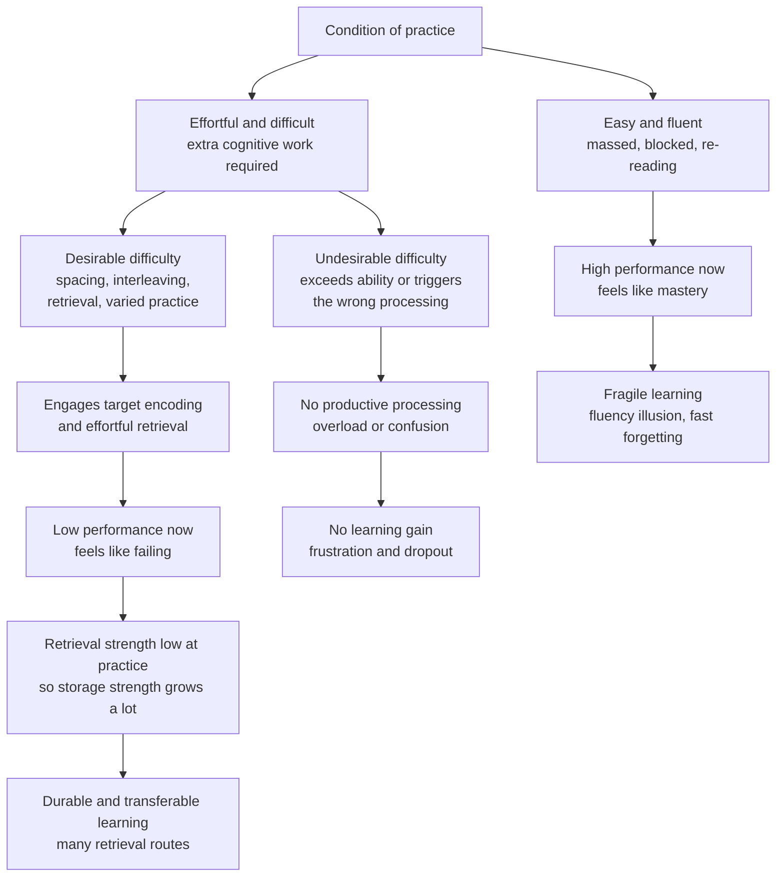

# 🏋️ Desirable Difficulties

> [!abstract] TL;DR
> **Desirable difficulties** (Robert A. Bjork, 1994) are conditions of practice that *slow apparent learning* and *feel harder in the moment* yet produce **more durable and more transferable** long-term learning. The four canonical ones are **spacing**, **interleaving**, **retrieval practice / testing**, and **varying the conditions of practice**. They work because effortful processing builds a stronger, more richly cued memory — formalised by the **New Theory of Disuse** as growth in **storage strength** rather than fleeting **retrieval strength**. The catch is a razor's edge: a difficulty is *desirable* only when it triggers the right processing *and* the learner can overcome it. Otherwise it is merely **undesirable** — harmful. And the whole framework fights a deep metacognitive bug: we mistake **fluency** — the ease of the moment — for learning, which is why the techniques that feel most productive are usually the least effective.

---

## Intuition

**Analogy: strength training, not a warm bath.**

Muscle grows from *load* — the last few reps that burn, the sets that leave you shaking. If you only ever lift a weight that feels easy, you finish the session feeling great and gain almost nothing. The soreness and the struggle are not side effects of the training; they *are* the training. A workout optimised to feel effortless is a workout optimised to be useless.

Learning is the same. When you re-read a chapter and every sentence glides by, that fluent, effortless feeling is the equivalent of curling a two-pound dumbbell — pleasant, confidence-building, and inert. When you *close the book and try to reconstruct the argument from memory* — struggling, half-forgetting, straining to retrieve — that is the burn. It feels like failing. It is actually the only rep that counts. Bjork's term for that productive strain is a **desirable difficulty**: the effort *is* the mechanism, not an obstacle to it.

But the analogy also carries the crucial warning. Load a beginner with 400 pounds and you do not build muscle — you cause injury. Difficulty helps only up to the edge of what the learner can actually lift. Beyond that edge it is not desirable at all.

---

## How It Works

### The core claim

Bjork's insight inverts a natural assumption. We assume that whatever makes performance *better right now* is helping us learn — smoother recall, fewer errors, faster responses. The desirable-difficulties research shows that **current performance is a treacherous index of learning**. Manipulations that *depress* performance during acquisition (spacing study out, mixing problem types, self-testing instead of re-reading, changing the room or the format) reliably *improve* performance on a delayed test and on transfer to new problems — while manipulations that *inflate* performance during acquisition (massing, blocking, re-reading) reliably *impair* it later.

### Why difficulty is desirable

Effortful processing pays off through two mechanisms:

1. **Stronger encoding.** A retrieval or a study event that requires real cognitive work lays down a more elaborate, more consolidated trace than one that slides by passively. Generating an answer beats reading it; reconstructing beats reviewing.
2. **More retrieval routes.** Effortful, *varied* practice ties the memory to a wider set of cues and contexts. Studying the same fact in different settings, interleaved with other material, and retrieved under different conditions builds *multiple independent paths* back to it — so it can be found later even when the original context is gone. This is why desirable difficulties improve **transfer**, not just retention.

### Storage strength vs retrieval strength

The formal engine is the **New Theory of Disuse** (Bjork & Bjork, 1992), which splits "how well you know something" into two independent dimensions:

- **Retrieval strength (RS):** how *accessible* a memory is *right now* — how easily it comes to mind given the current cues. This is what current performance measures. It rises fast, falls fast, and is highly context-dependent.
- **Storage strength (SS):** how *deeply learned and interconnected* a memory is — how well established it is in the long term. Storage strength, on this theory, **only ever grows; it never decreases**. What we call "forgetting" is a *loss of retrieval strength*, not a loss of storage.

The counter-intuitive theorems follow directly:

- **A study/retrieval event adds *more* storage strength when *retrieval* strength is *low*.** Retrieving (or restudying) something you have partly forgotten strengthens it far more than drilling something already fresh in mind. Fluent, high-RS items have little room to gain.
- **High retrieval strength gives *high current performance but small learning gains*.** Low retrieval strength gives *poor current performance but large learning gains*. Hence the dissociation.
- **Higher storage strength slows the future loss of retrieval strength** and speeds relearning — well-learned things are forgotten more slowly and recovered faster.

So the design recipe for durable learning is: *arrange for retrieval strength to drop before you practise again*, forcing effortful retrieval that maximises the storage-strength gain. Spacing lets RS decay; retrieval practice exercises RS drop-and-recover directly; interleaving and varied conditions lower RS by removing the local context crutch. All four canonical desirable difficulties are, at bottom, ways of keeping retrieval strength *low at the moment of practice*.

### Desirable vs undesirable

A difficulty is **not** magic in itself. Making study harder helps only when the extra effort is spent on processing that actually supports the target memory or skill, **and** the learner has the prior knowledge to succeed at that effort. Two ways it fails:

- **Wrong processing.** Difficulty that diverts effort into something irrelevant — a cluttered slide, terrible handwriting, a confusing interface — raises effort *without* strengthening the target trace. That is just **extraneous cognitive load** (see [[Working_Memory_and_Cognitive_Load]]).
- **Exceeds ability.** Difficulty beyond the learner's reach produces failure, frustration, and disengagement rather than retrieval. Interleaving helps only once the pieces are learnable; retrieval practice helps only if there is something retrievable. What is desirable for an expert can be *undesirable* for a novice — difficulty must sit in the learner's *region of proximal learning*.

### The fluency illusion — the central metacognitive failure

Here is why, despite decades of evidence, almost nobody studies this way by default: **fluency feels like learning**. When material is processed easily — because it was just re-read, or massed, or presented in a clean blocked sequence — learners (and teachers) read that ease as mastery. They give high **judgments of learning**, stop studying too early, and are then blindsided by the delayed test. Retrieval practice and spacing feel *worse* in the moment precisely because they are working, so they are systematically *under*-chosen. This mismatch between subjective ease and actual retention is a failure of **metacognitive calibration**, and it is the reason desirable difficulties have to be *designed in* against our intuitions rather than discovered by learners on their own.

### Performance vs learning

Soderstrom & Bjork (2015) sharpen the distinction that underwrites all of this:

- **Performance** = what you can observe *during* acquisition — current speed and accuracy.
- **Learning** = the relatively permanent change in knowledge or skill, which can only be *inferred* from a **delayed test** or a **transfer** task.

The two can be *dissociated* and even *negatively related*. Conditions that boost performance often impair learning and vice versa. This is the whole reason instruction is so easy to get wrong: teachers and trainers can only see performance, so they optimise the thing they can see and unknowingly sabotage the thing they cannot.



---

## Key Concepts

### Secondary Level

- **Harder-feeling study usually works better.** If a study method feels smooth and easy, it is probably building confidence, not memory.
- **The four moves that feel hard but help:** spread study out over time (**spacing**); mix up topics instead of doing one at a time (**interleaving**); test yourself from memory instead of re-reading (**retrieval practice**); and practise in changing conditions rather than always the same setup (**varied practice**).
- **The trap:** the ease of re-reading is a *feeling*, not a measurement. It fools you into thinking you have learned something you will not remember next week.
- **Not all hard is good.** Struggling because the material is genuinely too advanced, or because the slides are a mess, does not help. The difficulty has to be the *right kind* and *within reach*.

### Undergraduate Level

- **The four canonical desirable difficulties (Bjork).**
  - **Spacing** — distributing practice across time beats massing the same amount together; see [[Spaced_Repetition_and_the_Spacing_Effect]].
  - **Interleaving** — mixing problem types or categories within a session beats blocking them; forces discrimination and choosing the right approach; see [[Interleaving_and_Varied_Practice]].
  - **Retrieval practice / the testing effect** — actively recalling strengthens memory far more than restudying; see [[Retrieval_Practice_and_the_Testing_Effect]].
  - **Varying the conditions of practice** — changing the environment, format, or cues broadens the set of retrieval routes and improves transfer, at the cost of slower initial acquisition (the *contextual interference effect* in motor learning: Shea & Morgan, 1979).
- **Performance vs learning (Soderstrom & Bjork, 2015).** Performance is observable during training; learning is inferred from delayed/transfer tests. They routinely dissociate — the foundational reason "what looks like it's working" often isn't.
- **The fluency illusion.** Processing fluency during study is mistaken for durable learning, inflating judgments of learning and causing premature stopping. Learners left to their own devices *prefer* the least effective strategies (re-reading, highlighting) because they feel best.
- **Desirable vs undesirable.** Difficulty is only desirable when it (a) invokes processing that supports the target task and (b) is surmountable by the learner. Otherwise it is extraneous load or plain failure.

### Graduate Level

- **The New Theory of Disuse (Bjork & Bjork, 1992).** Memory has two strengths. **Storage strength** indexes how well-learned an item is and is assumed to be *monotonically increasing* — it never decreases. **Retrieval strength** indexes current accessibility and both rises and falls. Forgetting = loss of retrieval strength, not of storage. The theory's power is in the *interactions*: the increment to storage strength from a learning event is a *decreasing* function of current retrieval strength (harder retrievals teach more), while the increment to retrieval strength is an *increasing* function of storage strength (well-stored items rebound faster). This single set of assumptions predicts the spacing effect, the testing effect, and the retention advantage of desirable difficulties from one mechanism.
- **Why current performance is invalid as a learning index.** Because retrieval strength is high and cheap right after fluent study, in-the-moment performance can be near ceiling while storage strength — the durable quantity — has barely moved. The delayed test is the only place the two strengths cleanly separate, which is why any evaluation of instruction that measures only immediate performance is systematically misleading.
- **Transfer-appropriate processing.** Whether a difficulty is desirable is not a property of the difficulty alone but of the *match* between the processing it induces and the processing the final test demands. A difficulty that trains the wrong retrieval operation does not transfer, however effortful.
- **Boundary conditions and individual differences.** Meta-analyses show desirable-difficulty benefits shrink or reverse for very low-knowledge learners, for material with low element interactivity, and when difficulty overwhelms working-memory capacity. The framework therefore *interacts* with Cognitive Load Theory: desirable difficulty raises *germane* processing; undesirable difficulty raises *extraneous* load. The design goal is to maximise the former without exceeding the learner's capacity for the latter.
- **The metacognitive intervention problem.** Because the fluency illusion is robust and experiential, simply *telling* learners that harder methods work rarely changes behaviour; they must be given *delayed* feedback that lets them experience the dissociation between how they felt and how they scored. Designing instruction that reveals learning rather than performance is itself the applied research frontier.

---

## Python Demo

```python
# numpy + matplotlib only.
# Illustrate the DEFINING signature of desirable difficulties:
# the NEGATIVE correlation between how EASY a study condition feels in the
# moment and how much is RETAINED on a delayed test weeks later.
#
#   "Ease during learning" = subjective fluency / current performance (0..1)
#   "Long-term retention"  = proportion correct on a delayed test    (0..1)
#
# Fluent conditions (massed, blocked, re-reading) cluster top-left:
# high ease now, low retention later. Desirable difficulties (spaced,
# interleaved, retrieval, varied) cluster bottom-right: low ease now,
# high retention later. The downward trend line IS the phenomenon.
import numpy as np
import matplotlib.pyplot as plt

# (label, ease_during_learning, long_term_retention, family)
#   family 0 = fluent / easy conditions  (feel great, retain poorly)
#   family 1 = desirable difficulties    (feel hard,  retain strongly)
conditions = [
    ("Re-reading",         0.95, 0.30, 0),
    ("Massed practice",    0.90, 0.34, 0),
    ("Cramming",           0.88, 0.31, 0),
    ("Blocked practice",   0.84, 0.42, 0),
    ("Highlighting",       0.92, 0.28, 0),
    ("Spaced practice",    0.47, 0.74, 1),
    ("Interleaving",       0.40, 0.71, 1),
    ("Retrieval practice", 0.34, 0.81, 1),
    ("Varied conditions",  0.50, 0.67, 1),
    ("Generation effect",  0.44, 0.70, 1),
]

ease   = np.array([c[1] for c in conditions])
reten  = np.array([c[2] for c in conditions])
family = np.array([c[3] for c in conditions])

# Pearson correlation + least-squares line: retention ~ a * ease + b
r    = np.corrcoef(ease, reten)[0, 1]
a, b = np.polyfit(ease, reten, 1)
xs   = np.linspace(0.25, 1.0, 100)

print(f"Pearson r(ease, retention) = {r:+.2f}")
print(f"Regression slope = {a:+.2f}  (negative => harder-feeling study retains more)")

plt.figure(figsize=(9, 6))
colors = np.where(family == 0, "#dc2626", "#2563eb")
plt.scatter(ease, reten, c=colors, s=95, zorder=5, edgecolor="black")
plt.plot(xs, a * xs + b, color="gray", ls="--", lw=1.5, label=f"trend, r = {r:+.2f}")

for lab, x, y, f in conditions:
    dy = 0.028 if f == 1 else -0.05
    plt.annotate(lab, (x, y), fontsize=8, xytext=(x, y + dy), ha="center")

# proxy handles for a readable legend
plt.scatter([], [], c="#dc2626", s=95, edgecolor="black", label="Fluent conditions, feel easy")
plt.scatter([], [], c="#2563eb", s=95, edgecolor="black", label="Desirable difficulties, feel hard")

plt.xlabel("Ease during learning  [subjective fluency / current performance]")
plt.ylabel("Long-term retention  [delayed test, weeks later]")
plt.title("Desirable Difficulties: ease now is inversely related to durable learning")
plt.xlim(0.25, 1.0)
plt.ylim(0.20, 0.90)
plt.legend(loc="upper right", fontsize=9)
plt.grid(alpha=0.3)
plt.tight_layout()
plt.savefig("desirable_difficulties.png", dpi=150)
print("Saved desirable_difficulties.png")
```

**What the demo shows.** The scatter splits cleanly into two clouds sitting on a **strongly negative trend line** (r near -0.95): the red *fluent* conditions pile up top-left (ease near 0.9, retention near 0.3), the blue *desirable difficulties* sit bottom-right (ease near 0.4, retention near 0.75). That inverse relationship *is* the definition of a desirable difficulty — the very ease that makes a method feel effective is the signal that it is not. The point is not that difficulty is good in itself, but that *within these evidence-based conditions*, the felt ease and the durable outcome point in opposite directions, which is exactly why intuition mis-ranks study strategies.

---

## Real-World Applications

- **Medical and nursing education.** Programs have replaced blocked, cram-before-the-exam review with **spaced, cumulative retrieval quizzing** and **interleaved case types**, improving retention of clinical knowledge months out and on board exams.
- **Language learning and flashcard apps.** Anki, SuperMemo, and Duolingo operationalise two desirable difficulties directly — expanding-interval **spacing** plus active **retrieval** — scheduling each item for review just as it is about to be forgotten (retrieval strength low, storage-strength gain high).
- **Motor skill and sports training.** The **contextual interference effect** (Shea & Morgan, 1979): randomised, interleaved practice of skills produces worse practice-session performance but markedly better retention and transfer to game conditions than blocked drilling — a textbook desirable difficulty in the motor domain.
- **Aviation and military training.** Varying the **conditions of practice** (different simulators, weather, failure scenarios) builds transferable competence that survives the novel real emergency, at the cost of slower, messier early training.
- **Higher-education course design.** Low-stakes frequent quizzing, cumulative (not unit-final) exams, and spaced homework beat re-lecturing — even though student course evaluations often *reward* the smooth, fluent lecture that produces worse learning.
- **Corporate training's blind spot.** End-of-session "smile sheets" and immediate skill checks measure *performance and fluency*, not *learning*, so they systematically reward the training designs that feel best and retain least.

---

## Common Pitfalls

- **Confusing undesirable with desirable difficulty** — adding hardship for its own sake (dense slides, bad UX, ambiguous instructions) raises effort without strengthening the target trace. Difficulty helps only when it drives *task-relevant* processing.
- **Ignoring the learner's level** — interleaving and retrieval practice backfire for near-novices who have nothing yet to discriminate or retrieve. Keep difficulty inside the region of proximal learning; scaffold first.
- **Trusting in-the-moment performance** — high accuracy during a fluent study session is retrieval strength, not learning. The delayed test is the only valid verdict. Never evaluate instruction on immediate performance alone.
- **Believing your own judgments of learning** — the fluency illusion makes re-reading *feel* like the most productive method. Calibrate against actual delayed recall, not against how confident you feel.
- **Optimising the teachable moment instead of the durable outcome** — teachers and trainers see performance, so they smooth every difficulty away. Deliberately preserve productive struggle even though it makes the room look less "successful."
- **Making it hard but not the *right* hard** — a difficulty that trains the wrong retrieval operation will not transfer. Match the processing induced during practice to the processing the real test demands.

---

## Related Concepts

- [[Spaced_Repetition_and_the_Spacing_Effect]] — the first canonical desirable difficulty; distributing practice lets retrieval strength decay so restudy yields larger storage-strength gains.
- [[Retrieval_Practice_and_the_Testing_Effect]] — the most potent desirable difficulty; effortful recall is the mechanism the whole framework is built on.
- [[Interleaving_and_Varied_Practice]] — mixing problem types and varying conditions; builds discrimination and multiple retrieval routes for transfer.
- [[Forgetting_and_the_Forgetting_Curve]] — desirable difficulties exploit forgetting: a little decay before practice is what makes the next retrieval so productive.
- [[Long_Term_Memory_Systems]] — the encoding/consolidation/retrieval pipeline and the storage-vs-retrieval distinction that this note operationalises for study design.
- [[Working_Memory_and_Cognitive_Load]] — the boundary that separates *desirable* (germane) from *undesirable* (extraneous) difficulty; too much load turns a desirable difficulty harmful.

---

## Review Questions

**Tier 1 — Conceptual (can you explain it to a peer?)**
1. Define a "desirable difficulty" and explain why the word *desirable* is doing essential work — what makes some difficulties desirable and others merely harmful?
2. Using storage strength and retrieval strength, explain why re-reading a chapter can produce near-perfect performance during study yet poor recall a week later.

**Tier 2 — Applied / scenario**
3. A student re-reads her notes five times the night before an exam and reports feeling "totally on top of it." Her friend does four short self-tests spread across two weeks and reports feeling "shaky and behind." Predict who scores higher on a cumulative final a month later, who *feels* more prepared beforehand, and name the specific mechanisms (fluency illusion, spacing, retrieval practice, storage vs retrieval strength) behind any mismatch.
4. A coding bootcamp blocks its curriculum so students spend a full week on loops, then a full week on functions, then a full week on recursion, and evaluates each week with an immediate quiz. Identify which desirable difficulties are missing, redesign the schedule to include them, and explain why the immediate quizzes are a misleading measure of whether the redesign is working.

**Tier 3 — Analytical / trade-off**
5. The New Theory of Disuse assumes storage strength never decreases and that a learning event adds *more* storage strength when *retrieval* strength is *low*. Derive, from just these assumptions, why the spacing effect and the testing effect should both occur — and why cramming maximises exactly the wrong quantity.
6. Desirable difficulties improve learning while Cognitive Load Theory warns against adding difficulty. Reconcile the two frameworks: specify the condition under which added difficulty becomes germane rather than extraneous, and describe a learner or a task for whom a "desirable" difficulty would in fact be undesirable.

---

## Sources

- Bjork, R. A. (1994). "Memory and metamemory considerations in the training of human beings." In J. Metcalfe & A. Shimamura (Eds.), *Metacognition: Knowing about Knowing* (pp. 185–205). MIT Press. The paper that coined "desirable difficulties."
- Bjork, R. A., & Bjork, E. L. (1992). "A new theory of disuse and an old theory of stimulus fluctuation." In A. Healy, S. Kosslyn, & R. Shiffrin (Eds.), *From Learning Processes to Cognitive Processes*, Vol. 2 (pp. 35–67). Erlbaum. Storage-strength vs retrieval-strength framework.
- Bjork, E. L., & Bjork, R. A. (2011). "Making things hard on yourself, but in a good way: Creating desirable difficulties to enhance learning." In M. A. Gernsbacher et al. (Eds.), *Psychology and the Real World* (pp. 56–64). Worth. The accessible summary of the four difficulties.
- Soderstrom, N. C., & Bjork, R. A. (2015). "Learning versus performance: An integrative review." *Perspectives on Psychological Science*, 10(2), 176–199. The performance/learning dissociation.
- Kornell, N., & Bjork, R. A. (2008). "Learning concepts and categories: Is spacing the enemy of induction?" *Psychological Science*, 19(6), 585–592. Interleaving as a desirable difficulty and the fluency illusion.

---

#learning-science #desirable-difficulties #bjork #fluency-illusion #retention
