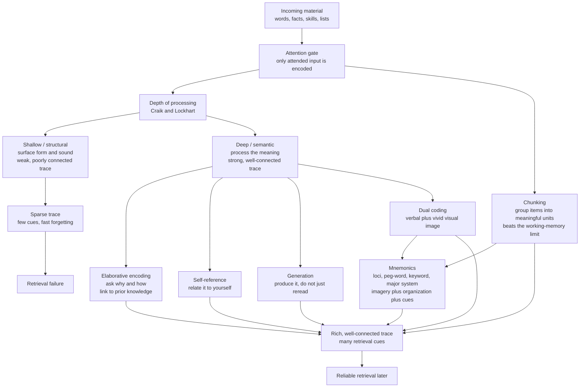

# 🧠 Encoding Strategies and Mnemonics

> [!abstract] TL;DR
> **Encoding is the front-end of memory**: what you retain is decided less by how long you study than by *how you process the material while studying it*. Craik and Lockhart's **levels-of-processing** framework shows that **deep, meaning-based encoding beats shallow surface processing**; **elaboration** (asking why and how, linking to prior knowledge), the **self-reference effect**, the **generation effect**, and **dual coding** (verbal plus visual) all deepen the trace and multiply retrieval cues. **Chunking** sidesteps the tiny working-memory limit by regrouping items into meaningful units — the engine of expertise. Classic **mnemonics** (method of loci, peg-word, keyword, acronyms, the major system) work by combining **vivid imagery, imposed organization, and built-in retrieval cues** — spectacular for arbitrary, rote material, but no substitute for genuine understanding.

---

## Intuition

**Analogy: filing a document versus dropping it on the floor.** Imagine two ways of putting a report into an office. In the first, you glance at the cover, then toss it onto a random pile — later you have almost no way to find it. In the second, you read it, decide *what it is about*, cross-reference it against three projects you already know, staple a bright photo to the front, and file it under a labelled tab. Same document, same shelf, but the second one comes back the instant you need it because you left yourself many *paths* to reach it.

Encoding is that filing decision, made in the split second you meet new information. Shallow processing (noticing the font, the sound of a word) tosses it on the pile. Deep, elaborative, dual-coded processing files it with meaning, connections, imagery, and cues. The memory trace is not just *stronger* — it is *more richly connected*, and connections are what retrieval walks along later.

---

## How It Works

### Core Mechanics

1. **Attention is the gate.** Nothing is encoded that was not attended to. Divided attention at study wrecks later recall even when total exposure time is held constant.
2. **Depth of processing decides trace quality (Craik and Lockhart, 1972).** Processing runs on a continuum from **shallow / structural** (What does the word look like?) through **phonemic** (Does it rhyme?) to **deep / semantic** (What does it mean? Does it fit this sentence?). Deeper analysis produces a more durable, better-connected trace — even when learning is *incidental* and people never intended to remember.
3. **Elaboration multiplies connections.** **Elaborative encoding** ties the new item to what you already know; **elaborative interrogation** and **self-explanation** do this deliberately by asking *why is this true?* and *how does this fit?*. Every connection is a future retrieval path.
4. **The self-reference effect.** Relating material to yourself ("Does this word describe me?") produces recall superior to even ordinary semantic processing, because the self is the richest, most elaborated schema you own.
5. **The generation effect.** Producing an answer, even a partial one, beats reading it. Effortful retrieval-at-encoding forces deeper processing and leaves a stronger trace than passive review.
6. **Dual coding.** Verbal and visual codes are partly independent channels (Paivio). Encoding material *both* as words and as a mental image gives you two routes to it; concrete, imageable material is remembered better than abstract material (the concreteness effect).
7. **Chunking beats the working-memory bottleneck.** Working memory holds only about **four chunks** (Cowan), not four *items*. Regrouping items into meaningful chunks (a random string of digits into a phone number, scattered pieces into a familiar chess pattern) lets a fixed capacity carry far more information. **Expertise is largely chunking**: experts see big, meaningful units where novices see many small ones.
8. **Mnemonics combine all three levers.** Classic techniques do not add magic — they *force* imagery, organization, and retrieval cues onto material that lacks them. That is why they excel at arbitrary, rote content and are wasted effort on material you could instead understand.

### Flow of Encoding



---

## Key Concepts

### Secondary (explain to a curious beginner)
- **How you study decides what you keep.** Staring at notes longer barely helps; *thinking about the meaning* helps a lot. Ask yourself what each fact means and how it connects to something you already know.
- **Make a picture and a story.** To remember a list, turn each item into a vivid image and walk them through a familiar place (your house). Silly, exaggerated images stick best.
- **Chunk it.** A phone number is easier as `555-8210` than `5558210` because you hold three chunks, not seven digits. Group things into meaningful bundles.
- **Do, do not just read.** Cover the answer and try to *generate* it. Struggling to recall something makes it stick better than seeing it handed to you.

### Undergraduate (needs some cognitive-science background)
- **Levels of processing (Craik and Lockhart, 1972).** Memory is a by-product of the *depth* of analysis, not a separate storage act. Semantic > phonemic > structural, demonstrated with **incidental learning** tasks where subjects do not expect a memory test.
- **Elaboration and self-explanation.** Elaborative interrogation ("why would this be true?") and self-explanation improve retention and comprehension by integrating new facts into existing knowledge networks.
- **Self-reference effect (Rogers, Kuiper and Kirker, 1977).** Judging whether trait words describe *you* yields recall superior to semantic judgments — self as a deeply elaborated organizing schema.
- **Generation effect (Slamecka and Graf, 1978).** Words generated from a rule or cue are recalled better than words merely read — an instance of **desirable difficulty**.
- **Dual coding (Paivio).** Verbal (logogen) and imaginal (imagen) systems; picture-superiority and concreteness effects follow from having two retrieval routes. Ties directly to imagery format in [[Mental_Representation]].
- **Chunking and capacity (Miller, 1956; Cowan, 2001).** "Seven plus or minus two" is really closer to four chunks. **Chase and Simon's** chess studies: masters recall real board positions far better than novices, but *not* random ones — the advantage is knowledge-based chunking, not raw memory.
- **Classic mnemonics.**
  - **Method of loci (memory palace):** place vivid images at ordered locations along a familiar route; retrieve by mentally walking it. Provides imagery *and* order.
  - **Peg-word system:** pre-memorized rhyming pegs ("one is a bun, two is a shoe") give fixed hooks for ordered lists.
  - **Keyword method:** for vocabulary, link a foreign word to a sound-alike keyword plus an image (Spanish *pato*, "duck", imagine a duck on a *pot*).
  - **Acronyms / acrostics:** ROY G BIV, "Every Good Boy Does Fine" — organization and a compact cue.
  - **Major system:** encode digits as consonant sounds, then build words and images — turns arbitrary numbers into imageable material.
  - **Why they all work:** imagery (dual coding) + imposed organization + guaranteed retrieval cues.

### Graduate (system-level thinking)
- **Transfer-appropriate processing (Morris, Bransford and Franks, 1977).** "Depth" is not absolute. Rhyme-based (shallow) encoding *beats* semantic encoding when the later test is itself rhyme-based. What matters is the **match between encoding operations and retrieval demands** — a serious qualification of pure levels-of-processing, and a rebuttal to the circular charge that "deep" just means "well-remembered."
- **Encoding specificity (Tulving and Thomson, 1973).** A cue aids retrieval only to the extent it was encoded *with* the target. Elaboration works by installing more, and more distinctive, cues at study time.
- **Desirable difficulties (Bjork).** Generation, effortful retrieval, and varied conditions slow acquisition but improve retention and transfer — encoding fluency is a misleading signal of learning.
- **Skilled memory and long-term working memory (Ericsson and Kintsch).** Experts encode rapidly into LTM via **retrieval structures**, effectively expanding usable working memory within a domain. The **SF study** (Ericsson, Chase and Faloon, 1980) took a normal undergraduate from a 7-digit to an **~79-digit** span over two years by chunking digits into running times — but his span for *letters* stayed normal. Skill was structure-specific, not a general memory upgrade.
- **The memory-athlete evidence.** Competitive mnemonists (Joshua Foer's *Moonwalking with Einstein*; the SF case) have ordinary brains and rely almost entirely on the method of loci and elaborate imagery — direct proof that encoding *strategy*, not innate capacity, drives extraordinary recall.
- **When mnemonics help versus when understanding wins.** Mnemonics excel for **arbitrary, low-meaning, rote** material (vocabulary, anatomy lists, digit strings, cranial nerves) where no conceptual structure exists to exploit. For **conceptual, interrelated** material, elaboration and building an accurate schema (see [[Schemas_and_Mental_Models]]) yield transferable understanding; a mnemonic there can even be a crutch that grants *access* without *comprehension*. **Concrete** material is easier to encode via imagery than **abstract** material, which is one reason abstract concepts benefit most from analogies and worked examples rather than pure mnemonics.

---

## Python Demo

```python
# Two classic encoding phenomena, simulated with numpy and plotted with matplotlib:
#   (1) Levels-of-processing / elaboration effect: deeper and more elaborate
#       encoding yields higher recall.
#   (2) Chunking: for a FIXED number of items, grouping them into fewer,
#       larger, meaningful chunks lets you recall more, because working
#       memory holds only about 4 CHUNKS (Cowan), not 4 items.
import numpy as np
import matplotlib.pyplot as plt

rng = np.random.default_rng(7)

# ---------------------------------------------------------------------------
# (1) LEVELS OF PROCESSING / ELABORATION
# Each encoding strategy gets a subjective "processing depth" score. A logistic
# function maps depth -> underlying probability of recalling an item. We then
# simulate a study-then-recall experiment to get means with error bars.
# ---------------------------------------------------------------------------
labels_plain = ["Structural", "Phonemic", "Semantic", "Elaborative"]
strategies = ["Structural\n(surface form)",
              "Phonemic\n(sound / rhyme)",
              "Semantic\n(meaning)",
              "Elaborative\n(meaning + why/how\n+ self-reference)"]
depth = np.array([1.0, 2.0, 3.2, 4.4])          # deeper = higher

def recall_prob(d, midpoint=2.5, slope=1.25):
    return 1.0 / (1.0 + np.exp(-slope * (d - midpoint)))

p_item = recall_prob(depth)                      # true recall prob per strategy

n_items, n_subjects = 30, 60
recalled = rng.binomial(n_items, p_item[:, None],
                        size=(len(depth), n_subjects)) / n_items
mean_recall = recalled.mean(axis=1)
sem = recalled.std(axis=1) / np.sqrt(n_subjects)

# ---------------------------------------------------------------------------
# (2) CHUNKING
# N items are grouped into k chunks (chunk size = N / k). Working memory holds
# about C = 4 chunks. If k <= C, every chunk (hence every item) is retained;
# if k > C, only about C chunks survive, so items recalled = C * (N / k).
# ---------------------------------------------------------------------------
N, C = 24, 4                                     # 24 items, Cowan ~4-chunk limit
k_values = np.array([1, 2, 3, 4, 6, 8, 12, 24]) # ways to group 24 items
chunk_size = N / k_values

p_chunk = np.minimum(1.0, C / k_values)          # prob a given chunk is retained
n_trials = 400
retained = rng.binomial(k_values[:, None], p_chunk[:, None],
                        size=(len(k_values), n_trials))
items_recalled = retained * chunk_size[:, None]  # items = chunks kept * chunk size
mean_items = items_recalled.mean(axis=1)

# ---------------------------------------------------------------------------
# Plot both panels side by side
# ---------------------------------------------------------------------------
fig, (ax1, ax2) = plt.subplots(1, 2, figsize=(12, 4.8))

ax1.bar(range(len(strategies)), mean_recall, yerr=sem, capsize=5,
        color=["#9ca3af", "#60a5fa", "#2563eb", "#7c3aed"])
ax1.set_xticks(range(len(strategies)))
ax1.set_xticklabels(strategies, fontsize=8)
ax1.set_ylabel("Fraction of items recalled")
ax1.set_ylim(0, 1)
ax1.set_title("Levels of processing: deeper + elaborative encoding wins")

ax2.plot(k_values, mean_items, "o-", color="#059669", lw=2)
ax2.axvline(C, color="#dc2626", ls="--", lw=1.5)
ax2.text(C + 0.4, 7, "WM capacity\nabout 4 chunks", color="#dc2626", fontsize=8)
ax2.set_xlabel("Number of chunks the 24 items are grouped into")
ax2.set_ylabel("Items recalled out of 24")
ax2.set_ylim(0, 26)
ax2.set_title("Chunking: fewer, larger chunks -> more items recalled")

fig.tight_layout()
plt.show()

# ---------------------------------------------------------------------------
# Numeric summary
# ---------------------------------------------------------------------------
print("Levels of processing (mean fraction recalled):")
for name, m in zip(labels_plain, mean_recall):
    print("  %-12s %.2f" % (name, m))

print("\nChunking (items recalled vs number of chunks, 24 items):")
for k, m in zip(k_values, mean_items):
    print("  %2d chunks of size %4.1f -> %.1f items" % (k, N / k, m))
```

Running it produces two panels. The left bars climb monotonically — roughly 0.13, 0.35, 0.71, 0.92 — as encoding moves from structural to elaborative, the levels-of-processing effect. The right curve stays flat at the full 24 items while the number of chunks is at or below the ~4-chunk capacity, then falls off (16, 12, 8, and finally ~4 items when every item is its own chunk). That last point is the punchline: with no chunking you recall about four items, exactly Cowan's limit; chunk the same 24 items into four meaningful groups and you recall all of them.

---

## Real-World Applications

> **Medical and anatomy education.** Students memorize cranial nerves ("On Old Olympus' Towering Tops...") and biochemical pathways with acronyms and the method of loci because the material is genuinely arbitrary — there is no deeper logic to the *order* of the twelve cranial nerves, so imposed cues are the right tool.

> **Language learning.** The keyword method (linking a new word to an imageable sound-alike) accelerates vocabulary acquisition, a textbook case of dual coding applied to arbitrary sound-meaning pairings.

> **Expert perception in chess, radiology, and sports.** Chase and Simon's chunking account explains why a chess master reconstructs a real position at a glance and a radiologist spots a tumor in seconds: years of practice build a vast library of meaningful chunks, expanding effective working memory within the domain (see [[Working_Memory_and_Cognitive_Load]]).

> **Memory championships.** Competitors memorize shuffled decks and hundreds of digits using the method of loci and the major system. Joshua Foer trained from journalist to US champion in a year, and Ericsson's SF grew a 79-digit span — living proof that encoding technique, not talent, drives the feat.

> **Instructional design and UI.** Presenting information verbally *and* visually (dual coding), grouping options into a few labelled categories (chunking), and prompting learners to self-explain all raise retention and lower cognitive load.

---

## Common Pitfalls

- **Mistaking fluency for learning.** Rereading feels smooth and produces a strong sense of knowing, but that fluency is shallow processing. Effortful generation and self-testing feel harder yet encode far better — a **desirable difficulty**.
- **Maintenance rehearsal.** Repeating a fact over and over without elaboration keeps it in working memory but barely improves long-term retention. Depth, not repetition count, drives durability.
- **Treating "depth" as absolute.** Transfer-appropriate processing shows the winning strategy depends on the *test*. Encode the way you will need to retrieve.
- **Using mnemonics as a substitute for understanding.** A memory palace can hand you the Krebs cycle intermediates in order while leaving you unable to reason about the chemistry. For conceptual material, build an accurate schema first; reserve mnemonics for the genuinely arbitrary residue.
- **Bland, non-distinctive imagery.** Mnemonics fail when images are dull or interchangeable. Vivid, exaggerated, spatially distinct, self-involving images are what make loci and peg-word systems work.
- **Ignoring retrieval cues at encoding.** Encoding specificity means a cue helps only if it was present at study. Deep encoding that installs no reusable cue still leaves you cue-dependent at test time.
- **Chunking without meaning.** Arbitrary grouping does little; the benefit comes from mapping items onto *meaningful, already-known* units. Novices cannot chunk in a domain they do not yet understand.

---

## Related Concepts

- [[Long_Term_Memory_Systems]] — encoding is the first stage of the encoding → consolidation → storage → retrieval pipeline; this note zooms in on that front end.
- [[Working_Memory_and_Cognitive_Load]] — chunking is the primary defense against the tiny ~4-chunk working-memory bottleneck, and expertise is knowledge-based chunking.
- [[Schemas_and_Mental_Models]] — elaborative encoding works by attaching new material to existing schemas; a good schema is what deep processing hooks into.
- [[Mental_Representation]] — dual coding and the imagery-versus-propositional format debate; the representational basis for why concrete, imageable material encodes better.
- [[Memory_Systems]] — the broader multi-store picture (sensory, working, long-term; explicit versus implicit) that these encoding strategies feed into.

---

## Review Questions

1. **(Conceptual)** In an incidental-learning experiment, subjects who judge whether words *rhyme* recall fewer than those who judge whether words *fit a sentence*, even though no one was told to memorize. What does this show about the relationship between encoding depth and memory, and why is the incidental design important?
2. **(Scenario)** A medical student must memorize the twelve cranial nerves in order and, separately, must understand how a nephron regulates blood pressure. Which task should get a mnemonic and which should get elaborative self-explanation, and why does matching the technique to the material matter?
3. **(Trade-off)** The SF study grew a normal undergraduate's digit span to about 79 digits, yet his letter span stayed at roughly seven. Using chunking and skilled-memory theory, explain why the skill did not transfer — and what this implies about the claim that mnemonists have "superhuman memory."

---

## Sources

- Craik, F. I. M., & Lockhart, R. S. (1972). "Levels of Processing: A Framework for Memory Research." *Journal of Verbal Learning and Verbal Behavior*, 11(6), 671–684. [https://doi.org/10.1016/S0022-5371(72)80001-X](https://doi.org/10.1016/S0022-5371(72)80001-X)
- Rogers, T. B., Kuiper, N. A., & Kirker, W. S. (1977). "Self-Reference and the Encoding of Personal Information." *Journal of Personality and Social Psychology*, 35(9), 677–688. [https://doi.org/10.1037/0022-3514.35.9.677](https://doi.org/10.1037/0022-3514.35.9.677)
- Slamecka, N. J., & Graf, P. (1978). "The Generation Effect: Delineation of a Phenomenon." *Journal of Experimental Psychology: Human Learning and Memory*, 4(6), 592–604. [https://doi.org/10.1037/0278-7393.4.6.592](https://doi.org/10.1037/0278-7393.4.6.592)
- Ericsson, K. A., Chase, W. G., & Faloon, S. (1980). "Acquisition of a Memory Skill." *Science*, 208(4448), 1181–1182. [https://doi.org/10.1126/science.7375930](https://doi.org/10.1126/science.7375930)
- Foer, J. (2011). *Moonwalking with Einstein: The Art and Science of Remembering Everything.* Penguin Press.

---

#learning-science #encoding #mnemonics #elaboration #memory-palace
