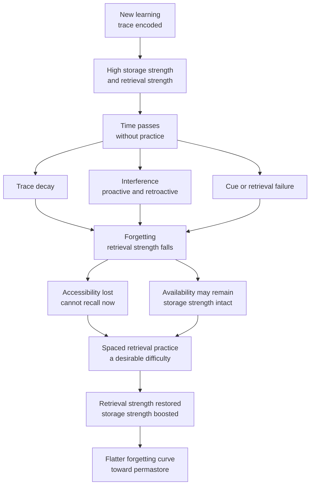

# 🕳️ Forgetting and the Forgetting Curve

> [!abstract] TL;DR
> Newly learned material is lost **rapidly at first and then more slowly** — a decelerating curve first measured by **Hermann Ebbinghaus (1885)** using nonsense syllables and the *savings method*. Forgetting is not one process but several (**decay, interference, cue-dependent retrieval failure, motivated suppression**), and it is not simply a defect: Bjork's **New Theory of Disuse** reframes it as an adaptive feature that keeps memory current and generalizable. The practical payoff is that **spacing** and **retrieval practice** bend the curve flatter, and sufficiently over-learned knowledge enters a near-permanent **permastore**.

---

## Intuition

**Analogy: a path worn through tall grass.**

The first time you walk a route across a meadow you flatten a faint trail. Leave it alone and the grass springs back **fast in the first days, then slowly** — a week later the path is nearly gone, a month later almost invisible, but never *quite* to zero. That decelerating regrowth *is* the forgetting curve.

Two things follow directly. First, the path is not really "deleted" — the soil is still compacted, so re-walking it later takes far less effort than clearing virgin grass. That gap between "the trail exists" and "I can find and follow it right now" is the difference between a memory being **available** and being **accessible**. Second, the cure is not to walk the path once for an hour; it is to **re-walk it briefly on spaced days**, each pass hardening the ground so the grass regrows more slowly the next time.

---

## How It Works

Ebbinghaus did something radical for 1885: he made himself both experimenter and subject, and he invented **nonsense syllables** (consonant–vowel–consonant strings like *WID*, *ZOF*) precisely so that pre-existing meaning could not help him — a clean baseline for measuring pure association. He memorized lists to a criterion of perfect recitation, waited a fixed delay, then **relearned** the same list and recorded how many fewer trials it took. That reduction is the **savings method**: if relearning takes 40 percent fewer repetitions, 40 percent was "saved," even when conscious recall reads zero. Savings is a sensitive measure that reveals memory surviving *below* the threshold of recall.

His central finding: **retention drops steeply within the first hour and day, then the loss decelerates and levels off.** The shape, not the exact numbers, is the durable contribution.

### The mathematical form (a live debate)

Ebbinghaus fit a logarithmic function, but the modern argument is between two families:

- **Exponential decay:** retention `R = a * exp(-t / S)`, a constant *proportional* loss per unit time (memory stability `S` sets the half-life).
- **Power-law decay:** retention `R = a * (1 + t)^(-b)`, which falls faster early and flatter late.

Averaged group data usually fit a **power law** better, but Wixted and others argue this is partly an **averaging artifact** — averaging many individual exponential curves with different rates *produces* a power-law shape. At the individual-item level the true form is still contested; what everyone agrees on is the **deceleration**.

### Why we forget — four mechanisms

1. **Trace decay** — memories fade with disuse over time, independent of what else happens. Hard to prove cleanly because time never passes "empty."
2. **Interference** — other memories compete. **Proactive** interference: old learning blocks new (last year's locker combination intrudes). **Retroactive** interference: new learning overwrites old (a new phone number erases the old). Interference, not raw time, explains much of ordinary forgetting.
3. **Cue-dependent / retrieval failure** — the trace is intact but the **retrieval cue** is missing or mismatched (Tulving's *encoding specificity*). The tip-of-the-tongue state is the pure case.
4. **Motivated forgetting** — active suppression or inhibition of unwanted memories (retrieval-induced forgetting, directed forgetting).

### Forgetting as a feature, not a bug

**Bjork's New Theory of Disuse** separates two independent strengths of a memory:

- **Storage strength** — how deeply learned it is. It only ever *grows* and is essentially permanent.
- **Retrieval strength** — how accessible it is *right now*. It rises with recent use and **decays with disuse**.

Forgetting is a drop in **retrieval strength**, not loss of storage. This distinction maps onto **availability vs accessibility** (Tulving & Pearlstone, 1966): a word you cannot recall (low accessibility) still leaps out when cued (proof it was available all along). Crucially, a **partly forgotten** memory is one where a successful retrieval produces the *biggest* gain in storage strength — forgetting creates the "desirable difficulty" that makes practice stick. Losing moment-to-moment access also lets memory **update** (drop the obsolete locker combo) and **generalize** (keep the gist, shed the specifics). **Jost's law** captures a related asymmetry: of two memories of equal current strength, the *older* one decays more slowly and gains more from further study.



---

## Key Concepts

### Secondary (foundations)
- **Forgetting curve** — retention falls steeply at first, then levels off; the loss decelerates.
- **Nonsense syllables** — meaningless CVC strings Ebbinghaus used to strip out prior knowledge.
- **Savings method** — measuring memory by how much *faster* you relearn, even when recall reads zero.
- **Review beats cramming** — brief, repeated exposures spread over days retain far more than one long session.

### Undergraduate (mechanisms)
- **Exponential vs power-law decay** — competing equations for the curve; power law fits group data, possibly as an averaging artifact.
- **Decay vs interference** — is forgetting caused by time itself, or by competing memories? Interference explains most everyday cases.
- **Proactive vs retroactive interference** — old blocks new vs new overwrites old.
- **Cue-dependent forgetting & encoding specificity** — recall succeeds when retrieval cues match the encoding context.
- **Availability vs accessibility** (Tulving & Pearlstone) — the memory exists (available) but cannot be reached without the right cue (accessible).

### Graduate (theory and frontier)
- **New Theory of Disuse** (R. Bjork & E. Bjork) — orthogonal **storage strength** (permanent, monotonic) and **retrieval strength** (transient, disuse-sensitive); forgetting is loss of retrieval strength.
- **Desirable difficulties** — conditions that slow acquisition (spacing, interleaving, testing) but strengthen long-term retention *because* they induce forgetting between practices.
- **Jost's law** — for two memories of equal current strength, the older decays more slowly and benefits more from renewed study.
- **Adaptive forgetting** — Anderson's rational analysis: forgetting rates mirror the statistical need-odds of information in the environment; forgetting is optimal, not lossy.
- **Permastore** (Bahrick, 1984) — very-well-learned material (e.g., Spanish learned decades earlier) enters a stable plateau resistant to decay for 25+ years.

---

## Python Demo

```python
# Ebbinghaus forgetting curve: fit exponential vs power-law decay to his 1885
# savings data, then show how spaced retrieval reviews produce a "sawtooth"
# that resets retention to ~100% and flattens each subsequent decay.
import numpy as np
import matplotlib.pyplot as plt

# --- Ebbinghaus (1885) savings data: retention vs delay (hours) ---
t_data = np.array([0.33, 1, 9, 24, 48, 144, 744])            # hours
R_data = np.array([0.582, 0.442, 0.358, 0.337, 0.278,
                   0.254, 0.211])                            # fraction saved

# Exponential fit  R = A*exp(-t/S)   ->  ln R = ln A - t/S   (linear in t)
be, ae = np.polyfit(t_data, np.log(R_data), 1)
S_fit, A_exp = -1.0 / be, np.exp(ae)

# Power-law fit    R = A*(1+t)^(-b)  ->  ln R = ln A - b*ln(1+t)
bp, ap = np.polyfit(np.log(1 + t_data), np.log(R_data), 1)
A_pow, b_pow = np.exp(ap), -bp

t_curve   = np.logspace(np.log10(0.2), np.log10(800), 500)
exp_curve = A_exp * np.exp(-t_curve / S_fit)
pow_curve = A_pow * (1 + t_curve) ** (-b_pow)

# --- Spaced-review model over 12 weeks: R = exp(-t/S), S grows per review ---
def retention(t, S):
    return np.exp(-t / S)

weeks       = np.linspace(0, 12, 2000)
S0          = 1.0                    # initial stability ~ 1 week
R_single    = retention(weeks, S0)   # study once, never review

review_wks  = [0, 1, 3, 7]           # expanding-interval schedule
gain        = 2.3                    # each review multiplies stability
R_spaced    = np.zeros_like(weeks)
S, last, k  = S0, review_wks[0], 0
for i, t in enumerate(weeks):
    while k + 1 < len(review_wks) and t >= review_wks[k + 1]:
        k += 1
        last, S = review_wks[k], S * gain   # spacing strengthens the trace
    R_spaced[i] = retention(t - last, S)

# --- plot ---
fig, (axA, axB) = plt.subplots(1, 2, figsize=(13, 5))

axA.scatter(t_data, R_data, c="black", zorder=5, label="Ebbinghaus data")
axA.plot(t_curve, exp_curve, "r--", lw=2,
         label=f"Exponential (S={S_fit:.1f}h)")
axA.plot(t_curve, pow_curve, "b-", lw=2, label=f"Power law (b={b_pow:.2f})")
axA.set_xscale("log")
axA.set_title("The decay-law debate")
axA.set_xlabel("Delay since learning (hours, log scale)")
axA.set_ylabel("Retention (savings fraction)")
axA.legend(); axA.grid(alpha=0.3)

axB.plot(weeks, R_single, "r--", lw=2, label="Study once, no review")
axB.plot(weeks, R_spaced, "b-", lw=2, label="Spaced retrieval reviews")
axB.axhline(0.90, color="gray", ls=":", label="90% retention target")
axB.scatter(review_wks, [1.0] * len(review_wks), c="green", zorder=5,
            label="Review resets to ~100%")
axB.set_title("Spacing bends the curve flatter")
axB.set_xlabel("Weeks since first study")
axB.set_ylabel("Retention (fraction recalled)")
axB.set_ylim(0, 1.05); axB.legend(); axB.grid(alpha=0.3)

plt.tight_layout()
plt.show()
# Left panel: the power law hugs the long-tail data the exponential misses.
# Right panel: each review is a sawtooth spike back to ~100%, and the later
# decays are visibly flatter because stability S has grown -> the permastore idea.
```

---

## Real-World Applications

- **Spaced-repetition software** — Anki, SuperMemo (SM-2/SM-18), and Duolingo schedule each card's next review just before predicted forgetting, riding the flattening curve from the demo's right panel.
- **Medical and aviation licensing** — high-stakes certification bodies replace one-off cramming with distributed re-testing because permastore-level retention is required years later.
- **Corporate onboarding & compliance training** — "microlearning" drips short reinforced modules over weeks instead of a single day-one firehose that is gone by Friday.
- **Advertising frequency** — the "rule of 7" and spaced ad exposures exploit the same curve to keep a brand accessible without wasteful massed repetition.
- **Curriculum design** — spiral curricula deliberately revisit core topics across terms so retrieval strength is renewed before it collapses.

---

## Common Pitfalls

- **Mistaking the fluency of massed study for durable learning** — rereading and cramming feel productive because retrieval strength is temporarily high, but storage strength barely moves and the curve collapses within days.
- **Treating "I can't recall it" as "it's gone"** — savings and cued recall show the memory is usually still *available*; the fix is a better cue or a retrieval attempt, not full re-study.
- **Reviewing too early** — restudying while retention is still ~100% adds almost nothing to storage strength; the gain comes from retrieving material you have *partly forgotten* (a desirable difficulty).
- **Reviewing too late** — waiting until retention hits zero forfeits savings and forces expensive relearning; the sweet spot is an expanding interval that catches the item near, not past, the forgetting threshold.
- **Assuming everyone's curve is identical** — decay rate depends on prior knowledge, sleep, interference, and encoding depth; a fixed one-size schedule under- or over-drills different learners and items.
- **Over-trusting the "20 minutes = 58%" numbers** — the *shape* of Ebbinghaus's curve replicates; the exact percentages are from one person memorizing meaningless syllables and do not transfer to meaningful material.

---

## Related Concepts

- [[Long_Term_Memory_Systems]] — the encode → consolidate → store → retrieve pipeline whose retrieval stage is exactly what the forgetting curve measures decaying.
- [[Memory_Systems]] — situates forgetting within sensory / working / long-term memory and the explicit–implicit split.
- [[Working_Memory_and_Cognitive_Load]] — forgetting from working memory (seconds, capacity-limited) is a distinct process from the long-term decay curve discussed here.

---

## Review Questions

1. **(Foundations)** Why did Ebbinghaus invent nonsense syllables, and what does the *savings method* reveal that a simple recall test would miss?
2. **(Mechanisms)** Group forgetting data often fit a power law better than an exponential. Explain the "averaging artifact" argument for why this might not mean individual memories decay by a power law.
3. **(Application/Trade-off)** Using the storage-strength vs retrieval-strength distinction, explain why scheduling a review *too early* wastes effort while *too late* forfeits savings — and describe how an expanding-interval schedule targets the optimum. Given a learner who consistently forgets a fact after 4 days, what interval would you set next and why?

---

## Sources

- Ebbinghaus, H. (1885/1913). *Memory: A Contribution to Experimental Psychology.* Teachers College, Columbia University. [English translation](https://psychclassics.yorku.ca/Ebbinghaus/index.htm)
- Bjork, R. A., & Bjork, E. L. (1992). A new theory of disuse and an old theory of stimulus fluctuation. In *From Learning Processes to Cognitive Processes* (Vol. 2). [PDF](https://bjorklab.psych.ucla.edu/wp-content/uploads/sites/13/2016/07/RBjork_EBjork_1992.pdf)
- Wixted, J. T. (2004). The psychology and neuroscience of forgetting. *Annual Review of Psychology*, 55, 235–269. [DOI](https://doi.org/10.1146/annurev.psych.55.090902.141555)
- Bahrick, H. P. (1984). Semantic memory content in permastore: Fifty years of memory for Spanish learned in school. *Journal of Experimental Psychology: General*, 113(1), 1–29. [DOI](https://doi.org/10.1037/0096-3445.113.1.1)
- Murre, J. M. J., & Dros, J. (2015). Replication and analysis of Ebbinghaus' forgetting curve. *PLOS ONE*, 10(7), e0120644. [DOI](https://doi.org/10.1371/journal.pone.0120644)

---

#learning-science #forgetting #ebbinghaus #forgetting-curve #retention
