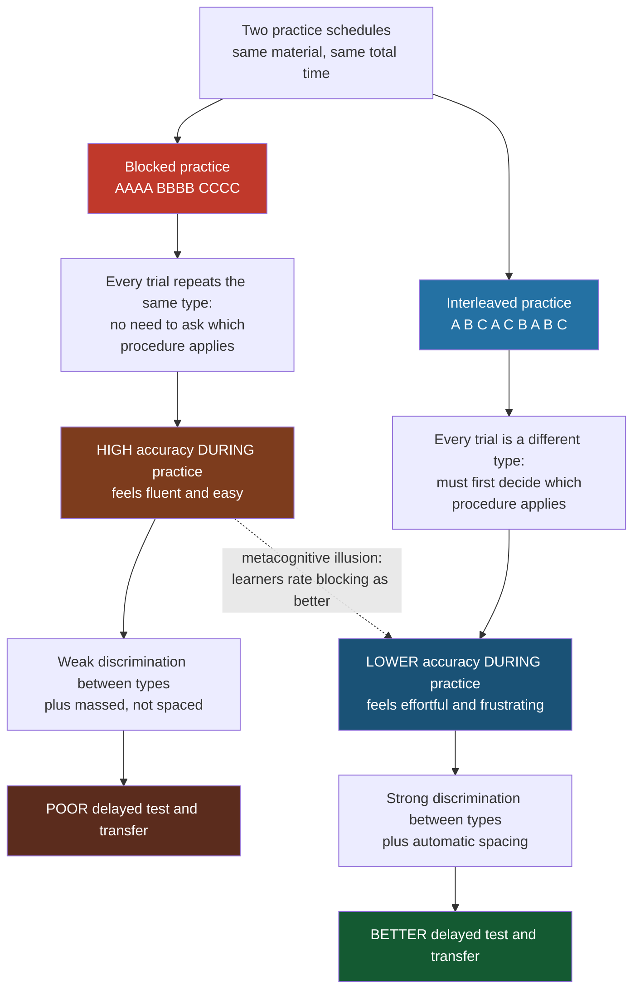

# 🔀 Interleaving and Varied Practice

> [!abstract] TL;DR
> **Interleaving** — mixing different problem types or categories within a single study session instead of practicing one type to mastery before moving on (**blocking**) — reliably *hurts* performance during practice but *improves* performance on delayed tests and transfer, especially for discrimination, categorization, and math problem-solving. It works because a mixed schedule forces you to retrieve *which* procedure applies (not just how to run it), sharpens the boundaries between confusable categories, and spaces practice as a side effect. The catch is a metacognitive illusion: because blocking feels smoother, learners consistently judge it more effective even as it produces worse learning.

---

## Intuition

**Analogy:** A boxer who spends a whole round throwing nothing but jabs will land beautiful jabs by the end of that round — the timing, the reach, the snap all click. But a real fight never announces "jab now." The skill that wins bouts is not executing a jab; it is *reading the opening and selecting the right punch* under uncertainty. A coach who has the boxer cycle unpredictably through jab, hook, cross, and slip makes every rep feel worse and clumsier than the pure-jab drill — yet it is the only drill that trains the choice the fight will actually demand.

Studying works the same way. Doing twenty of the *same* kind of algebra problem in a row (blocking) lets you groove one procedure and feel fluent, but the exam mixes problem types and never tells you which is which. Interleaving your practice — problem type A, then C, then B, then A again — feels harder and messier, but it is the only schedule that rehearses the exam's real demand: figuring out *which tool the problem calls for* before you can apply it.

---

## How It Works

### Core Mechanics

The interleaving effect is a **dissociation between practice performance and learning**. Two schedules use identical material and identical time:

1. **Blocked practice** groups all trials of one type together: `AAAA BBBB CCCC`. Within a block, the "which type is this?" question is answered for free — every problem is the same kind you just solved. You rehearse *execution* under low uncertainty, performance climbs quickly, and it *feels* like mastery.
2. **Interleaved practice** shuffles types together: `A B C A C B A B C`. Every trial reintroduces the question "which type is this, and therefore which procedure do I run?" You must first *discriminate*, then execute. Performance during practice is lower, noisier, and effortful.

Three mechanisms make interleaving pay off on a *delayed, mixed* test — the condition that matches real assessment and real life:

- **Retrieval of the right procedure (discriminative-contrast).** Blocking only ever practices step two (apply the method). Interleaving practices step one (select the method) on every trial. Since a test never labels its problems, the selection skill is exactly what generalizes. This is why interleaving helps most when problem *types look similar but require different solutions* (the classic trap: knowing how to find the volume of each solid is useless if you cannot tell the solids apart).
- **Discrimination between confusable categories.** Juxtaposing different categories back-to-back highlights the *differences* between them, where blocking (long runs of one category) highlights only within-category *similarities*. Inductive learning of category boundaries improves when exemplars of different categories are interleaved.
- **Spacing as a byproduct.** Because returns to type A are separated by B and C, each type is automatically distributed over time, recruiting the same retrieval-strengthening mechanism that makes spaced practice beat massed practice. Interleaving is partly spacing wearing a different hat — but its discrimination benefit is *additional* to spacing.

The umbrella idea is **contextual interference** (from the motor-learning literature): introducing interference *during* acquisition — by varying the task from trial to trial — depresses practice performance but deepens retention and transfer. Interleaving is high-contextual-interference practice for cognitive skills.

### Flow / Architecture



---

## Key Concepts

### Secondary Level

**Blocking vs. interleaving.** Blocking means finishing all of one kind of practice before starting the next; interleaving means mixing the kinds together. Blocking usually *feels* better and produces higher scores while you practice. Interleaving feels harder but produces higher scores on a later test — a pattern robust enough that it is a canonical example of a **desirable difficulty**: a condition that slows learning down in the moment yet strengthens it in the long run.

**The metacognitive illusion.** Learners systematically get this backwards. In study after study, participants learn *better* from interleaving but *rate blocking as more effective* and prefer it. The reason is that we mistake **fluency** (how smooth practice feels) for learning. Blocking manufactures fluency without manufacturing durable skill — which is why you cannot trust the feeling of ease to tell you whether you are learning.

**Where it shows up.** The effect is strongest for tasks that demand telling similar things apart: classifying rocks, birds, skin lesions, or painters' styles; choosing the right formula for a math word problem; diagnosing which bug caused a failure. It is weaker or absent for pure memorization of unrelated facts.

### Undergraduate Level

**Rohrer & Taylor — the math result.** Doug Rohrer and Kelli Taylor (2007) had students learn to compute the volumes of four obscure solids. Blocked learners crushed the practice worksheet; interleaved learners struggled. On a test a week later the pattern flipped hard — interleaved learners roughly *doubled or tripled* the blocked learners' accuracy. The diagnostic insight: most blocked errors on the delayed test were **discrimination errors** — students knew all four formulas but picked the wrong one, precisely the skill blocking never trains. Later classroom studies (Rohrer, Dedrick & Stershic, 2015) replicated the benefit with real middle-school mathematics.

**Kornell & Bjork — the art/artist study.** Nate Kornell and Robert Bjork (2008) taught participants to recognize the styles of twelve landscape painters by showing example paintings either blocked (six paintings by one artist in a row) or interleaved (paintings by different artists mixed together). Interleaving produced substantially better ability to identify the artist of *novel, never-seen* paintings — an **inductive/transfer** gain. Tellingly, most participants believed *blocking* had helped them more even after their own interleaved condition demonstrably worked better. The provocative title asked whether spacing is "the enemy of induction"; the answer was no — interleaving *helps* induction.

**Schmidt's schema theory and variability of practice.** In motor learning, Richard Schmidt's **schema theory** (1975) proposed that we do not store a separate motor program for every movement; we abstract a **generalized motor program** plus a *schema* — a rule relating movement parameters to outcomes. Practicing a *variety* of movement parameters (throwing to many distances rather than one) builds a richer schema and produces better performance on *novel* variants, even ones never practiced. This **variability-of-practice** prediction is the motor-skill sibling of cognitive interleaving: variety during acquisition trades short-term performance for long-term generalization.

**The contextual interference effect.** Shea & Morgan (1979) had participants learn three rapid movement sequences in either a blocked or a random (interleaved) order. Random practice yielded *worse* acquisition but *better* retention and transfer. The counterintuitive lesson — that adding interference during practice improves learning — is the empirical backbone linking motor and cognitive interleaving under one principle.

### Graduate Level

**Why interleaving works: competing accounts.** Two mechanisms are debated and are probably both real:
- **The distributed-practice (spacing) account** — interleaving simply spaces each type out, so its benefit reduces to spacing. This account struggles to fully explain category-learning results where interleaving beats spaced-but-blocked schedules.
- **The discriminative-contrast (attention-to-difference) account** — the temporal juxtaposition of different categories lets the learner detect the features that *distinguish* them, which blocking (long same-category runs) cannot. Studies that equate spacing while varying only juxtaposition find that contrast, not spacing alone, drives the categorization benefit. In problem-solving, the parallel mechanism is that mixed practice trains the **pairing of a problem's surface cues with the correct procedure** rather than the procedure in isolation.

**Boundary conditions — interleaving is not universally superior.** The effect reverses or vanishes under identifiable conditions:
- **Early skill acquisition.** When a learner does not yet have a minimally functional version of each procedure, some initial blocking to establish the basics can be necessary before interleaving pays off. You cannot discriminate between tools you cannot yet wield at all.
- **When categories are highly dissimilar.** Interleaving's advantage depends on categories being *confusable*. If types are obviously different, there is little discrimination to train and little benefit — sometimes blocking then wins.
- **High element-interactivity or heavy working-memory load.** From a cognitive-load standpoint, interleaving imposes extra load (holding and switching among procedures). For very complex material or low-prior-knowledge novices, that load can swamp the benefit.
- **Very short retention intervals.** If the "test" is immediate, blocking's practice advantage may still be present; interleaving's edge grows as the delay lengthens.

**Combining desirable difficulties.** Interleaving, **spacing**, and **retrieval practice** are complementary rather than redundant. The strongest evidence-based study design layers them: space sessions over time, within each session *interleave* problem types, and drive each trial by *active retrieval* (attempt-then-feedback) rather than re-reading. Interleaving supplies spacing and discrimination; retrieval supplies the encoding-strengthening effect of successful recall; spacing supplies consolidation between sessions. A good practical rule: block just long enough to establish a procedure, then interleave to build the discrimination and transfer the test will demand.

**Transfer.** The ultimate justification for interleaving is *transfer* — performance on problems and contexts not identical to those practiced. Because interleaving trains the mapping from cue to procedure rather than a rehearsed motor loop, it produces representations that generalize to novel exemplars (Kornell & Bjork's unseen paintings; Schmidt's un-practiced throwing distances). Blocking optimizes the training distribution; interleaving optimizes the deployment distribution.

---

## Python Demo

```python
"""
Blocked vs. Interleaved Practice on a Category-Discrimination Task
-----------------------------------------------------------------
Four problem "types" (categories) must be told apart from noisy features.
A learner is modelled as an online multiclass softmax classifier trained trial
by trial -- predict, then update -- the way a student answers, then sees feedback.

Two SCHEDULES use identical data and identical numbers of trials:
  * BLOCKED      -- all Type-A trials, then all Type-B, ... (mass one type)
  * INTERLEAVED  -- the four types shuffled together every session

Two things are measured:
  * PRACTICE accuracy -- how well the learner does DURING practice
  * TEST accuracy     -- a final mixed test (all types interleaved, fresh items)

The interleaving effect emerges from catastrophic interference in the blocked
schedule: massing one type lets the learner succeed WITHOUT discriminating,
so it wins during practice but fails the mixed test. Interleaving forces
discrimination on every trial -- worse during practice, better on the test.
Requires only numpy and matplotlib.
"""
import numpy as np
import matplotlib.pyplot as plt

rng = np.random.default_rng(0)

# --- 1. A category-discrimination dataset: 4 confusable problem types ---------
K, D = 4, 6                               # 4 categories in a 6-D feature space
N_PER = 90                                # training items per category
protos = rng.normal(size=(K, D))          # each type's characteristic pattern
protos /= np.linalg.norm(protos, axis=1, keepdims=True)
NOISE = 0.60                              # overlap -> discrimination is nontrivial

def make_set(n_per):
    X, y = [], []
    for c in range(K):
        X.append(protos[c] + NOISE * rng.normal(size=(n_per, D)))
        y.append(np.full(n_per, c))
    return np.vstack(X), np.concatenate(y)

X_train, y_train = make_set(N_PER)
X_test,  y_test  = make_set(40)          # fresh, always-interleaved test items

# --- 2. Online multiclass softmax learner ------------------------------------
def softmax(z):
    z = z - z.max(axis=-1, keepdims=True)
    e = np.exp(z)
    return e / e.sum(axis=-1, keepdims=True)

def accuracy(W, b, X, y):
    return np.mean((X @ W.T + b).argmax(axis=1) == y)

def train(order_fn, epochs=6, lr=0.15):
    """order_fn(epoch) -> the order in which training trials are presented."""
    W = np.zeros((K, D)); b = np.zeros(K)
    running_correct = []                  # per-trial correctness during practice
    test_curve = []                       # test accuracy after each epoch
    for ep in range(epochs):
        for i in order_fn(ep):
            x, y = X_train[i], y_train[i]
            p = softmax(W @ x + b)
            running_correct.append(int(p.argmax() == y))   # PREDICT before update
            p[y] -= 1.0                                     # gradient of CE loss
            W -= lr * np.outer(p, x)
            b -= lr * p
        test_curve.append(accuracy(W, b, X_test, y_test))
    practice_acc = np.mean(running_correct)
    return np.array(running_correct), np.array(test_curve), practice_acc

# --- 3. Two schedules over identical data ------------------------------------
N = len(y_train)
sorted_idx = np.argsort(y_train, kind="stable")   # groups each type together
def blocked_order(ep):                            # A A A ... B B B ... per epoch
    return sorted_idx
def interleaved_order(ep):                        # reshuffle all types together
    return rng.permutation(N)

blk_run, blk_test, blk_practice = train(blocked_order)
int_run, int_test, int_practice = train(interleaved_order)

print(f"BLOCKED     : practice acc = {blk_practice:.2f}   final test acc = {blk_test[-1]:.2f}")
print(f"INTERLEAVED : practice acc = {int_practice:.2f}   final test acc = {int_test[-1]:.2f}")

# --- 4. Plot: dynamics (left) and the dissociation (right) -------------------
def smooth(v, w=40):
    return np.convolve(v, np.ones(w) / w, mode="valid")

fig, (ax1, ax2) = plt.subplots(1, 2, figsize=(13, 5))

ax1.plot(smooth(blk_run), color="#c0392b", label="Blocked (during practice)")
ax1.plot(smooth(int_run), color="#2471a3", label="Interleaved (during practice)")
ax1.set_title("During practice: blocking looks better")
ax1.set_xlabel("Practice trial"); ax1.set_ylabel("Running accuracy")
ax1.set_ylim(0, 1.02); ax1.legend(loc="lower right"); ax1.grid(alpha=0.3)

labels = ["Blocked", "Interleaved"]
train_scores = [blk_practice, int_practice]
test_scores  = [blk_test[-1], int_test[-1]]
xpos = np.arange(2); w = 0.35
ax2.bar(xpos - w/2, train_scores, w, color="#e59866", label="Practice accuracy")
ax2.bar(xpos + w/2, test_scores,  w, color="#5499c7", label="Final TEST accuracy")
for x, v in zip(xpos - w/2, train_scores): ax2.text(x, v + 0.02, f"{v:.2f}", ha="center")
for x, v in zip(xpos + w/2, test_scores):  ax2.text(x, v + 0.02, f"{v:.2f}", ha="center")
ax2.set_xticks(xpos); ax2.set_xticklabels(labels)
ax2.set_title("The dissociation: the test tells the opposite story")
ax2.set_ylabel("Accuracy"); ax2.set_ylim(0, 1.15)
ax2.legend(loc="upper left"); ax2.grid(axis="y", alpha=0.3)

fig.suptitle("Interleaving effect: blocked wins during practice, interleaved wins on the test",
             fontsize=13)
plt.tight_layout()
plt.savefig("blocked_vs_interleaved.png", dpi=150, bbox_inches="tight")
plt.show()
```

**What the figure shows.** During practice (left panel), the blocked curve sits high with a small sawtooth: within each block the learner can succeed by simply repeating the current type, so accuracy hovers near ceiling and only dips briefly at each block boundary. The interleaved curve climbs more slowly and settles lower — every trial re-poses the discrimination problem. The right panel reveals the reversal: blocked practice accuracy is the tallest bar, but blocked *test* accuracy collapses (the model, biased toward whichever type it practiced last, cannot discriminate the mixed test), while interleaved practice accuracy is modest but its *test* accuracy is the highest bar of all. The mechanism in the simulation — catastrophic interference from massing one label — is a computational caricature of the real cognitive point: **a schedule that lets you succeed without discriminating trains you not to discriminate**, and the test always demands discrimination.

---

## Real-World Applications

> **Mathematics education.** The best-supported application. Rather than a textbook section of twenty identical problems, mixed-review worksheets that interleave problem types across chapters improve delayed test scores and, critically, reduce the "wrong-formula" errors that dominate blocked learners. Rohrer's classroom trials turned this into deployable worksheet designs now used in curricula.

> **Perceptual and diagnostic expertise.** Training radiologists, dermatologists, and pathologists to distinguish confusable cases (benign vs. malignant lesions, subtle fractures) benefits from interleaving exemplars of different categories, because diagnosis is fundamentally a discrimination task. Interleaved case libraries build the boundary-detection that blocked "all-normal-then-all-abnormal" review does not.

> **Sports and motor-skill coaching.** Randomized (interleaved) drills — mixing pitch types, shot selections, or defensive scenarios — depress practice-session performance but improve in-game transfer, exactly the contextual-interference prediction from Shea & Morgan and Schmidt's variability-of-practice theory. Coaches who optimize the scrimmage rather than the drill are applying this.

> **Spaced-repetition and adaptive learning software.** Systems like Anki and adaptive tutors shuffle cards and item types rather than drilling one deck to exhaustion, blending interleaving with spacing so that each review both distributes practice and forces retrieval of the correct response among competitors.

> **Machine-learning training pipelines.** Shuffling the training set so mini-batches mix classes is standard precisely because *blocked* (class-sorted) batches cause catastrophic interference and biased gradients — the same failure the Python demo dramatizes. Curriculum-learning and interleaved-replay methods in continual learning are the ML analog of the human interleaving debate.

---

## Common Pitfalls

- **Trusting the feeling of fluency.** The single biggest trap. Blocking feels productive because it is smooth; interleaving feels like failure because it is effortful. Learners abandon interleaving right when it is working. Judge a strategy by *delayed* test performance, never by how practice feels.
- **Interleaving before the basics exist.** Interleaving trains *choosing among* procedures you can already run. If a learner cannot yet execute any version of a procedure, jumping straight to a fully mixed schedule overloads working memory and teaches nothing. Establish a minimal working version of each skill (a short blocked phase) *then* interleave.
- **Interleaving unrelated, non-confusable material.** The benefit comes from contrast between *similar* categories that are easy to confuse. Mixing wildly different topics (French vocabulary with calculus) provides no discrimination to train and mostly just adds switching cost.
- **Confusing interleaving with mere variety-for-its-own-sake.** Random busywork is not interleaving. The types being mixed must be the same types that must be discriminated on the target task, and each trial should still demand genuine retrieval, not passive review.
- **Ignoring cognitive load with novices or complex material.** For high-element-interactivity content or low-prior-knowledge learners, interleaving's added load can overwhelm the benefit. Scale the degree of interleaving to the learner's expertise.
- **Measuring too soon.** Interleaving's advantage grows with the retention interval. An immediate quiz can make blocking look better and can lead an instructor to wrongly abandon interleaving; the payoff shows up on delayed and transfer tests.

---

## Related Concepts

- [[Concepts_and_Categorization]] — Interleaving's core mechanism is sharpening the boundaries between *confusable categories*; the prototype/exemplar debate explains *why* juxtaposing contrasting exemplars aids inductive category learning.
- [[Memory_Systems]] — Interleaving sits in the encoding-strategies toolkit alongside spacing and the testing effect; this note details the memory stores that interleaving's spacing byproduct strengthens.
- [[Long_Term_Memory_Systems]] — The consolidation and cue-dependent retrieval processes that make *delayed* tests, where interleaving wins, diverge from immediate practice performance.
- [[Schemas_and_Mental_Models]] — Schmidt's variability-of-practice theory holds that varied practice builds a richer *schema*; the motor-learning sibling of cognitive interleaving.
- [[Problem_Solving_and_Insight]] — In math and problem-solving, the skill interleaving trains is *selecting the correct solution procedure* from a problem's cues, not merely executing it.
- [[Learning_and_Memory_Systems]] — The neural systems (hippocampal and procedural) underlying the acquisition-versus-retention dissociation that defines desirable difficulties.

> Companion notes planned for this section — *Spaced Repetition*, *Retrieval Practice*, *Desirable Difficulties*, and *Transfer* — should link back here once created; interleaving is a special case of desirable difficulty that supplies spacing and discrimination simultaneously.

---

## Review Questions

### Secondary

1. In one sentence each, define *blocked* and *interleaved* practice, then state which one usually produces higher scores *during practice* and which produces higher scores *on a delayed test*.
2. What is the "metacognitive illusion" associated with interleaving, and what feeling causes learners to fall for it?
3. Give one everyday example of a skill where telling *which* type of problem you face is harder than solving it once you know the type.

### Undergraduate

1. In Rohrer & Taylor's volume-of-solids study, blocked learners knew all four formulas yet failed the delayed test. What *specific kind* of error dominated, and how does that error pinpoint the exact skill blocking fails to train?
2. Explain how interleaving delivers a spacing benefit "for free," then explain why researchers argue interleaving's advantage for *categorization* cannot be reduced to spacing alone. What does the discriminative-contrast account add?
3. Connect Schmidt's variability-of-practice prediction and Shea & Morgan's contextual-interference result: what single principle unites motor-skill variability with cognitive interleaving, and what is the shared trade-off?

### Graduate

1. Design a within-subjects experiment that would distinguish the *spacing* account of interleaving from the *discriminative-contrast* account. Specify how you would equate spacing across conditions while varying only juxtaposition, and state the result pattern that would favor each account.
2. Interleaving is not universally superior. Identify three boundary conditions under which blocking matches or beats interleaving, and for each explain the mechanism (in terms of prior knowledge, category similarity, or cognitive load) that causes the reversal.
3. You are designing a study schedule that must combine interleaving, spacing, and retrieval practice for a novice learning a complex, multi-step skill. Propose a concrete sequencing (including any initial blocked phase) and justify each choice against the desirable-difficulties framework, being explicit about what you sacrifice in practice-phase performance and why it is worth it.

---

## Sources

- [Rohrer, D., & Taylor, K. (2007). "The shuffling of mathematics problems improves learning." *Instructional Science*, 35, 481–498.](https://doi.org/10.1007/s11251-007-9015-8)
- [Kornell, N., & Bjork, R. A. (2008). "Learning concepts and categories: Is spacing the 'enemy of induction'?" *Psychological Science*, 19(6), 585–592.](https://doi.org/10.1111/j.1467-9280.2008.02127.x)
- [Rohrer, D., Dedrick, R. F., & Stershic, S. (2015). "Interleaved practice improves mathematics learning." *Journal of Educational Psychology*, 107(3), 900–908.](https://doi.org/10.1037/edu0000001)
- [Schmidt, R. A. (1975). "A schema theory of discrete motor skill learning." *Psychological Review*, 82(4), 225–260.](https://doi.org/10.1037/h0076770)
- [Shea, J. B., & Morgan, R. L. (1979). "Contextual interference effects on the acquisition, retention, and transfer of a motor skill." *Journal of Experimental Psychology: Human Learning and Memory*, 5(2), 179–187.](https://doi.org/10.1037/0278-7393.5.2.179)
- [Bjork, R. A., & Bjork, E. L. (1992). "A new theory of disuse and an old theory of stimulus fluctuation." In *From Learning Processes to Cognitive Processes*, Vol. 2, 35–67.](https://bjorklab.psych.ucla.edu/research/)

---

#learning-science #interleaving #varied-practice #discrimination #desirable-difficulty
