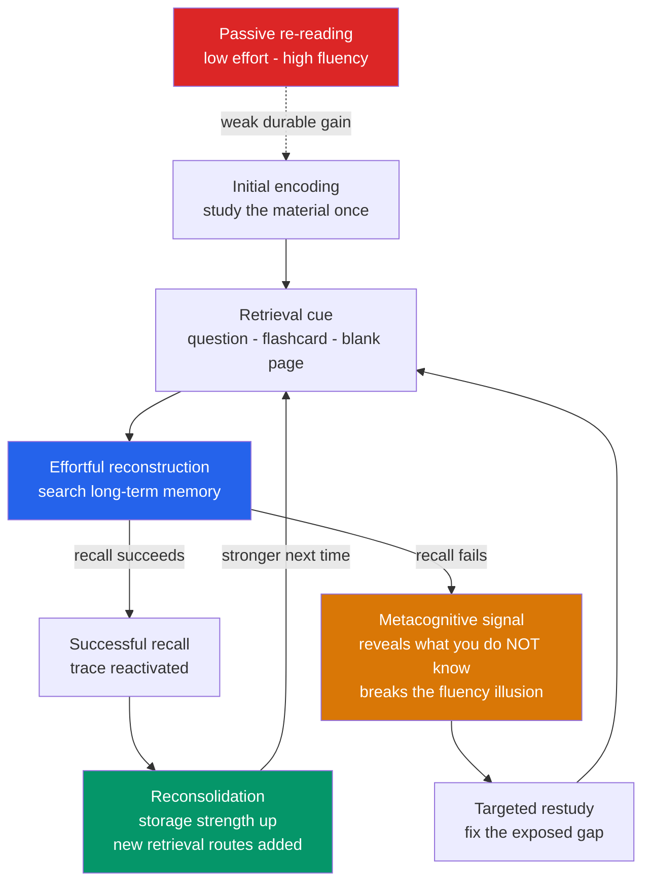

# 🧠 Retrieval Practice and the Testing Effect

> [!abstract] TL;DR
> **Actively recalling** information strengthens memory far more than passively re-reading it. A test is not just a *measurement* of learning — the act of retrieval **is** a learning event. This is the **testing effect** (or **retrieval practice effect**), one of the most replicated findings in the science of learning. Restudying looks better on an immediate test, but retrieval practice wins dramatically at a delay, because effortful reconstruction reconsolidates the trace, carves multiple retrieval routes, and honestly reveals what you do *not* yet know. Combined with **spacing**, it is the single most efficient study technique known.

---

## Intuition

**Analogy: worn footpaths across a field versus reading a map of the field.**

Suppose you need to reach a cottage on the far side of a field, over and over, for the rest of your life.

- **Re-reading your notes is studying the map.** Each time you look at the map the route feels obvious and familiar — the ease is seductive. But looking at a map never actually wears a path into the grass. The moment you put the map down, the ground is untouched.
- **Retrieval practice is walking the route without the map.** The first crossing is slow and effortful; you hesitate, backtrack, second-guess. But *that effort is exactly what flattens the grass into a trail.* Walk it a few times, from a few different starting points, and a durable path emerges that you can follow in the dark.

The paradox that trips up nearly every student: **the map feels more effective in the moment, but the walking is what actually builds the road.** Testing yourself feels harder and less pleasant than re-reading precisely *because* it is doing more work. The discomfort is the mechanism, not a bug — a "desirable difficulty."

---

## How It Works

Retrieval practice works because pulling a memory *out* is a fundamentally different, more constructive operation than putting the same information *back in* again.

### Core mechanics

1. **Effortful reconstruction, not playback.** Memory retrieval is not a recording that plays back intact; it is an active reconstruction from partial cues. When you force that reconstruction, you exercise and strengthen the very pathway you will need on the exam — you are practising the *actual skill* being tested, whereas re-reading practises a skill (reading) you will not perform under exam conditions.
2. **The retrieval-effort hypothesis.** The harder (but still successful) the retrieval, the larger the memory benefit. A struggle that ends in recall reconsolidates the trace more strongly than an easy hit. This is why *free recall* beats *cued recall*, which beats *recognition* — more effort, more benefit.
3. **Multiple retrieval routes.** Each successful retrieval from a new context or a new cue lays down an additional access path to the same memory. A fact you have retrieved five different ways is reachable through five doors; a fact you have only re-read is reachable through one.
4. **Reconsolidation.** Every act of retrieval briefly returns the memory to a labile state and then re-stores it in strengthened form. Restudying updates the trace far less because it never destabilises and rebuilds it.
5. **The metacognitive dividend.** A failed or effortful retrieval is *diagnostic*: it exposes exactly what you do not know, puncturing the **fluency illusion** (the false confidence that comes from material feeling familiar). Re-reading hides your gaps; testing reveals them, so you can direct restudy where it is actually needed.

### The storage-vs-retrieval-strength view

Bjork's **New Theory of Disuse** frames it cleanly. A memory has two independent strengths: **retrieval strength** (how accessible it is right now) and **storage strength** (how deeply learned it is). Restudying inflates *retrieval strength* fast — which is why cramming produces high immediate scores — but adds little *storage strength*. Retrieval practice, being effortful, grows *storage strength* the most, especially when current retrieval strength is low. Storage strength is what survives to the delayed test. The Python demo below simulates exactly this split.



---

## Key Concepts

### Secondary Level

**Testing is a learning event, not just assessment.** The central, counter-intuitive claim: the act of taking a test *changes* memory, making the tested material more durable. A quiz is not a thermometer that passively reads your knowledge; it is exercise that builds it.

**Roediger & Karpicke (2006), the modern classic.** Students read prose passages, then either **restudied** the passage or took a free-recall **test** on it. On a test given five minutes later, the restudy group did slightly better. But on a test given **one week later, the retrieval-practice group recalled far more** (roughly 61% versus 40% in their Experiment 2, comparing STTT to SSSS). The crossover — restudy wins short-term, retrieval wins long-term — is the signature of the effect.

**Retrieval beats re-reading — and re-reading is what most students do.** Surveys show re-reading and highlighting are the most *common* study techniques and among the *least* effective for durable learning. Self-testing is uncommon and highly effective. The mismatch is driven by the fluency illusion.

**Effort scales the benefit.** Ranked from most to least effortful (and most to least beneficial):
- **Free recall** — reproduce everything from a blank page ("brain dump").
- **Cued recall** — answer a specific prompt ("What is the capital of France?").
- **Recognition** — pick the right answer from options (multiple choice).
More effortful, successful retrieval yields more durable memory.

### Undergraduate Level

**The retrieval-effort hypothesis (Pyc & Rawson, 2009).** Among *successful* retrievals, harder ones produce more learning. Manipulations that increase retrieval difficulty while keeping success high — longer lag, fewer cues — amplify the testing benefit. This is a special case of Bjork's broader **desirable difficulties** principle: conditions that slow acquisition and feel harder often improve long-term retention and transfer.

**The backward testing effect.** The "standard" effect: testing on *already-learned* material improves retention of *that* material. This is what Roediger & Karpicke demonstrated.

**The forward testing effect (test-potentiated learning).** Testing on earlier material improves *subsequent* learning of *new* material. Interpolating quizzes between segments of a lecture improves memory for the later, not-yet-tested segments, reduces mind-wandering, and lowers test anxiety by making testing routine. Retrieval does not just consolidate the past — it primes future encoding.

**Low-stakes and no-stakes quizzing.** The benefits do not require high-pressure exams. Ungraded or lightly-graded "retrieval events" — clicker questions, exit tickets, self-quizzes — capture the memory benefit while removing the anxiety that high-stakes testing can add. Frequent low-stakes quizzing is a cornerstone of evidence-based classroom design.

**Feedback multiplies the effect.** Retrieval practice works even without feedback, but corrective feedback after retrieval boosts it further, especially by correcting confident errors and rescuing failed retrievals. Delayed feedback can outperform immediate feedback (itself a spacing benefit).

### Graduate Level

**Mechanistic accounts.** Competing but complementary theories: the **elaborative-retrieval hypothesis** (Carpenter) — retrieval activates and strengthens semantically related routes, adding cues; the **episodic-context account** (Karpicke, Lehman & Aue) — retrieval updates and reinstates the temporal-contextual representation, making the item easier to find later; and the **two-component storage/retrieval-strength** view (Bjork). All predict the crossover interaction, differing on the locus of the change.

**Retrieval-induced forgetting (RIF) — the caveat.** Retrieving *some* items from a category can *suppress* recall of related, non-retrieved items (Anderson, Bjork & Bjork, 1994). Practising "orange" and "banana" under the cue *fruit* can depress later recall of "apple." The mechanism is thought to be inhibitory: competitors are suppressed to resolve retrieval competition. Practical implication: retrieval practice is overwhelmingly net-positive, but selectively drilling a subset can transiently disadvantage its neighbours — so retrieve *comprehensively*, not just the easy items. (RIF is typically small and often recovers with time or fresh cues.)

**The metamemory failure it corrects.** Learners are poor judges of their own learning; **judgments of learning (JOLs)** track processing *fluency* rather than durable storage, so re-reading inflates confidence without inflating retention. Retrieval practice improves the *calibration* of these judgments: attempting recall gives a far more accurate readout of true knowledge than re-reading does, aligning subjective confidence with objective performance.

**The powerful combination with spacing.** Retrieval practice and spacing are multiplicative, not merely additive. **Spaced retrieval** — recalling material at expanding intervals, just as you are about to forget — maximises retrieval effort on each attempt (desirable difficulty) while exploiting the spacing effect. This is precisely the algorithm behind spaced-repetition software (Anki, SuperMemo): every review is a *retrieval* event, scheduled at the spacing that keeps effort high but success likely.

---

## Python Demo

```python
# numpy + matplotlib only.
# Reproduce Roediger & Karpicke (2006), Experiment 2, in a two-component
# memory model (Bjork's storage vs retrieval strength):
#
#   R(t) = fast * exp(-t / TAU_FAST) + slow * exp(-t / TAU_SLOW)
#     fast = fragile, recently-activated trace  -> built mainly by re-STUDYING
#     slow = durable, consolidated trace        -> built mainly by RETRIEVING
#
# Every learning event adds to BOTH pools, but a TEST adds far more to the
# durable pool than a STUDY does. That asymmetry IS the testing effect.
#
# Two groups, matched on number of learning sessions:
#   SSSS -> study the passage four times          (massed restudy)
#   STTT -> study once, then self-test three times (retrieval practice)
import numpy as np
import matplotlib.pyplot as plt

TAU_FAST = 1.0     # days -- fragile component decays within hours/a day
TAU_SLOW = 60.0    # days -- durable, consolidated component

# per-event increments  (fast pool, slow pool)
STUDY = (0.10, 0.11)   # restudy: big fast boost, modest durable boost
TEST  = (0.01, 0.19)   # retrieval: tiny fast boost, LARGE durable boost

def learn(schedule):
    """schedule e.g. 'SSSS' or 'STTT' -> (fast, slow) trace strengths."""
    fast = slow = 0.0
    for ev in schedule:
        df, ds = STUDY if ev == "S" else TEST
        fast += df
        slow += ds
    return fast, slow

def retention(t, trace):
    fast, slow = trace
    return fast * np.exp(-t / TAU_FAST) + slow * np.exp(-t / TAU_SLOW)

restudy   = learn("SSSS")   # study four times
retrieval = learn("STTT")   # study once, then test three times

FIVE_MIN = 5.0 / (24 * 60)  # immediate test, in days
ONE_WEEK = 7.0              # delayed test

print(f"{'group':16s}  5-min test   1-week test")
for name, tr in [("SSSS restudy", restudy), ("STTT retrieval", retrieval)]:
    print(f"{name:16s}    {retention(FIVE_MIN, tr):.2f}         {retention(ONE_WEEK, tr):.2f}")
# SSSS restudy       0.84         0.39   -> restudy WINS the immediate test
# STTT retrieval     0.81         0.61   -> retrieval WINS the delayed test

# ---------------- Plot ----------------
t = np.linspace(0, 7, 400)
fig, (ax1, ax2) = plt.subplots(1, 2, figsize=(13, 5))

# Left: full retention curves -- watch the lines cross over.
ax1.plot(t, retention(t, restudy),   color="tomato",    lw=2, label="SSSS  restudy 4x")
ax1.plot(t, retention(t, retrieval), color="steelblue", lw=2, label="STTT  study + test 3x")
ax1.axvline(FIVE_MIN, color="gray", ls=":",  lw=1)
ax1.axvline(ONE_WEEK, color="gray", ls="--", lw=1, label="1-week delayed test")
ax1.set_xlabel("Delay since learning phase  [days]")
ax1.set_ylabel("Proportion recalled  R(t)")
ax1.set_title("Retention over time: the crossover")
ax1.set_ylim(0, 1)
ax1.legend(fontsize=9)

# Right: bar chart at the two test delays -- the classic result.
labels = ["5-min\n(immediate)", "1-week\n(delayed)"]
x = np.arange(2); w = 0.35
rs = [retention(FIVE_MIN, restudy),   retention(ONE_WEEK, restudy)]
rt = [retention(FIVE_MIN, retrieval), retention(ONE_WEEK, retrieval)]
ax2.bar(x - w/2, rs, w, color="tomato",    label="SSSS restudy")
ax2.bar(x + w/2, rt, w, color="steelblue", label="STTT retrieval")
for xi, (a, b) in enumerate(zip(rs, rt)):
    ax2.text(xi - w/2, a + 0.02, f"{a:.2f}", ha="center", fontsize=9)
    ax2.text(xi + w/2, b + 0.02, f"{b:.2f}", ha="center", fontsize=9)
ax2.set_xticks(x); ax2.set_xticklabels(labels)
ax2.set_ylabel("Proportion recalled")
ax2.set_title("Testing effect (Roediger & Karpicke, 2006)")
ax2.set_ylim(0, 1)
ax2.legend(fontsize=9)

plt.tight_layout()
plt.savefig("testing_effect.png", dpi=150)
print("Saved testing_effect.png")
```

**What the demo shows.** The restudy group (SSSS) pours everything into the *fast, fragile* pool, so it wins the 5-minute test (0.84 vs 0.81) — cramming looks great when you measure immediately. But that fast component decays within a day. The retrieval group (STTT) built a much larger *durable* pool, so a week later it dominates (0.61 vs 0.39). The two curves **cross over** between the immediate and delayed tests — the exact interaction Roediger & Karpicke reported, and the reason an immediate self-quiz badly *underestimates* the long-term payoff of retrieval practice.

---

## Real-World Applications

- **Spaced-repetition software (Anki, SuperMemo, Quizlet).** Every card review is a *retrieval event*, scheduled at expanding intervals. The tools fuse the testing effect with the spacing effect — the two most robust findings in learning science — which is why medical students and language learners rely on them.
- **The "brain dump" / blank-page recall.** After a lecture or chapter, close everything and write down everything you can remember, then check against the source. Maximally effortful free recall; the gaps you find are exactly what to restudy.
- **Practice questions and past papers.** Working problems before you feel "ready" is retrieval practice; doing them is far more predictive of exam performance than re-reading the solutions. Practising under exam-like conditions also reinstates the retrieval context.
- **The Feynman technique.** Explaining a concept from memory in plain language, as if teaching a novice, is structured free recall plus gap-detection: the points where your explanation stalls reveal precisely where understanding is thin.
- **Classroom "retrieval warm-ups" and low-stakes quizzing.** Starting class with a two-minute ungraded quiz on prior material (see the *forward testing effect*) improves retention of both old and new content, reduces mind-wandering, and normalises testing so high-stakes exams feel less threatening.
- **Onboarding and professional training.** Interleaving short recall checks into technical training (security drills, medical protocols, aviation checklists) produces far more durable procedural memory than re-reading manuals.

---

## Common Pitfalls

- **The fluency illusion.** Mistaking the *ease* of re-reading for actual learning. Fluent, familiar material *feels* mastered, but familiarity is not retrievability. The fix is to test yourself: recall failure is uncomfortable but honest. See [[Cognitive_Biases]].
- **Judging retrieval practice by the immediate test.** Right after studying, retrieval practice can look *worse* than restudy (the demo shows this). Learners who quiz themselves once and score lower than a re-reader wrongly conclude testing "doesn't work." The payoff only appears at a delay.
- **Recognition masquerading as recall.** Flipping a flashcard and thinking "yes, I knew that" is recognition, not recall — far easier and far less beneficial. Force yourself to *produce* the answer before flipping.
- **Retrieval without comprehensive coverage (RIF).** Repeatedly drilling only the easy or favourite items can transiently suppress related, un-practised items. Retrieve across the whole set, not just the parts you already know.
- **Skipping feedback on confident errors.** Retrieving a *wrong* answer with high confidence and never correcting it can entrench the error. Always check against a source; corrective feedback is where confident misconceptions get fixed.
- **Massing your retrieval.** Testing yourself five times back-to-back captures far less than the same five tests spaced out. Retrieval practice and spacing are multiplicative — do not collapse them into a single cram session.

---

## Related Concepts

- [[Long_Term_Memory_Systems]] — the encoding-consolidation-retrieval pipeline that retrieval practice exploits; also covers the spacing effect and reconsolidation, the mechanisms this note builds on.
- [[Memory_Systems]] — the broad sensory / working / long-term framework; lists the testing effect and generation effect among the most effective encoding strategies.
- [[Working_Memory_and_Cognitive_Load]] — retrieval loads working memory; well-designed retrieval practice keeps difficulty *desirable* rather than overwhelming.
- [[Cognitive_Biases]] — the fluency illusion and overconfidence are the metacognitive errors that retrieval practice diagnoses and corrects.

> Note: sibling notes **Spaced_Repetition_and_the_Spacing_Effect**, **Desirable_Difficulties**, and metacognitive **Calibration** are planned for this vault section; wikilinks should be added once those files exist.

---

## Review Questions

**Tier 1 — Conceptual (explain it to a peer)**
1. State the testing effect in one sentence, then explain why a test is described as a "learning event" rather than merely an assessment. What single word captures why retrieval practice *feels* worse than re-reading yet works better?
2. Rank free recall, cued recall, and recognition by how much each strengthens memory, and justify the ranking using the retrieval-effort hypothesis.

**Tier 2 — Applied / scenario**
3. Two students prepare for an exam two weeks away. One re-reads the chapter four times (SSSS); the other reads it once and then self-tests three times (STTT). Who will feel more confident the night after studying, who will score higher on the exam, and what mechanism explains any mismatch between confidence and performance?
4. A teacher wants to use retrieval practice but worries about test anxiety. Design a classroom routine that captures both the *backward* and *forward* testing effects while keeping stakes low, and explain what each part buys.

**Tier 3 — Analytical / trade-off**
5. Retrieval-induced forgetting shows that retrieving some items can suppress related un-retrieved ones. Does this undermine the case for retrieval practice? Explain the inhibitory mechanism, quantify (qualitatively) how the net effect compares, and give a concrete rule for structuring flashcard decks to avoid the pitfall.
6. Using the storage-vs-retrieval-strength distinction, explain why an *immediate* self-quiz systematically *underestimates* the long-term value of retrieval practice, and connect this to why spaced-repetition schedulers deliberately wait until you are about to forget before prompting the next retrieval.

---

## Sources

- Roediger, H. L. & Karpicke, J. D. (2006). "Test-enhanced learning: Taking memory tests improves long-term retention." *Psychological Science*, 17(3), 249–255.
- Karpicke, J. D. & Roediger, H. L. (2008). "The critical importance of retrieval for learning." *Science*, 319(5865), 966–968.
- Pyc, M. A. & Rawson, K. A. (2009). "Testing the retrieval effort hypothesis: Does greater difficulty correctly recalling information lead to higher levels of memory?" *Journal of Memory and Language*, 60(4), 437–447.
- Anderson, M. C., Bjork, R. A. & Bjork, E. L. (1994). "Remembering can cause forgetting: Retrieval dynamics in long-term memory." *Journal of Experimental Psychology: LMC*, 20(5), 1063–1087.
- Roediger, H. L. & Butler, A. C. (2011). "The critical role of retrieval practice in long-term retention." *Trends in Cognitive Sciences*, 15(1), 20–27.
- Adesope, O. O., Trevisan, D. A. & Sundararajan, N. (2017). "Rethinking the use of tests: A meta-analysis of practice testing." *Review of Educational Research*, 87(3), 659–701.

---

#learning-science #retrieval-practice #testing-effect #active-recall #roediger
