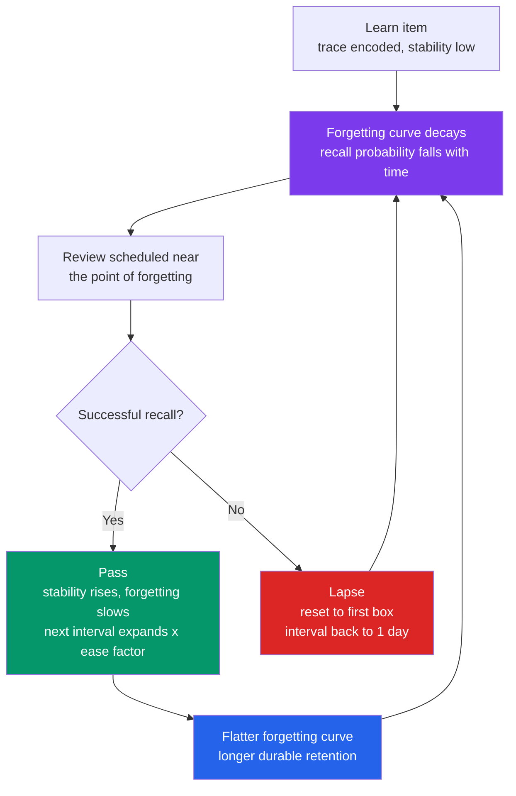

# 🔁 Spaced Repetition and the Spacing Effect

> [!abstract] TL;DR
> The **spacing effect** is one of the most robust findings in psychology: for a *fixed amount* of study, spreading it across time (**distributed practice**) produces far more durable long-term retention than packing it into one block (**massed practice / cramming**). **Spaced repetition systems (SRS)** — Leitner boxes, SuperMemo's SM-2, Anki, FSRS — turn this into an algorithm: schedule each item's next review at the moment you are *about to forget it*, so that every effortful recall re-stabilises the trace and flattens the forgetting curve, with intervals expanding geometrically after each success. The catch is metacognitive: spacing feels harder and less effective *in the moment*, which is exactly why it works — and why most learners abandon it for the comforting fluency of re-reading.

---

## Intuition

**Analogy: watering a plant vs drowning it.**

Imagine you have one litre of water to keep a seedling alive for a month. Pour the whole litre on today and the soil floods, the roots rot, and by next week the plant is dead — the water ran straight through with nowhere to soak in. Instead, give it a small drink every few days, *just as the soil is drying out*, and each watering soaks deep and the plant thrives on the same total litre.

Memory works the same way. **Massing** all your study into one session is the flood: the material feels wet and fresh in the moment, but there is no time for it to "soak in," and most of it drains away within days. **Spacing** the same study across sessions — each one landing just as the trace has begun to fade — lets consolidation harden the memory between sessions, so the same effort buys weeks of retention instead of hours. The struggle of half-forgetting and then recovering the memory is the water soaking down to the roots.

---

## How It Works

The spacing effect rests on four cooperating mechanisms. None of them is present when you cram, and all of them appear when reviews are separated by time.

### Core mechanics

1. **Retrieval effort (study-phase retrieval).** When you review an item that has *partly decayed*, recalling it is hard — and that effortful, successful retrieval acts like a testing event that strongly re-encodes the trace. Restudy a *still-fresh* item (massing) and there is nothing to retrieve, so almost no learning happens. Difficulty, here, is the mechanism, not the obstacle.
2. **Encoding variability.** Sessions separated in time occur in different contexts — mood, location, time of day, surrounding thoughts. Each spaced encounter binds the item to a *different* set of retrieval cues, so the memory becomes reachable from more directions. Massed repetitions all share one context and add no new cues.
3. **Consolidation between sessions.** Newly formed traces are fragile and stabilise over hours to days, heavily during sleep (**systems consolidation**). Gaps between reviews give consolidation time to run *before* the next reinforcement lands on an already-strengthened trace. Cramming reinforces a trace that has not yet had time to set.
4. **Defeating the fluency illusion.** Massing produces high *momentary* fluency, which learners misread as durable learning. Spacing forces you to confront how much you have actually forgotten, giving accurate feedback and preventing premature "I know this" judgements.

### The forgetting curve and the sawtooth

Ebbinghaus's **forgetting curve** shows recall probability decaying after each encounter. A single review resets recall to near-certainty, but the trace then decays again. Each *successful, well-spaced* review does two things: it lifts recall back to the top **and** lowers the *rate* of the next decay (it raises the trace's **stability**). Plotted over time this is a rising **sawtooth** whose teeth grow wider and flatter — the curve is being progressively flattened. This is why intervals can safely expand: a more stable memory forgets more slowly, so the next review can wait longer.

### The lag effect and interval scheduling

The **lag effect** refines the story: the *optimal* gap between reviews is not fixed but grows with how long you need to remember. As a rough empirical rule, the best inter-review gap is roughly **10–20% of the target retention interval** (Cepeda et al., 2008) — to remember something for a year, review it every month or two, not every day. SRS algorithms operationalise this by **expanding intervals** after each success (1 day → 6 days → 2 weeks → 1 month → …), each interval scaled by an *ease factor* that adapts to how hard the item is for you.



---

## Key Concepts

### Secondary Level

**Spacing beats cramming.** Given the same total study time, splitting it across days produces much better retention weeks later than doing it all at once. Cramming the night before an exam gives high performance *tomorrow* and near-total loss a month later — it optimises the wrong deadline.

**The forgetting curve is the baseline.** Ebbinghaus (1885) showed memory drops steeply at first and then levels off; roughly half of freshly learned material can be gone within a day. Every study strategy is measured against how well it slows this decay.

**Leitner boxes: spacing you can do with paper.** Sebastian Leitner's 1970s system uses a row of boxes. A card you get *right* moves up to a box reviewed less often; a card you get *wrong* drops back to box 1 (reviewed daily). Boxes further along are reviewed at longer intervals, so easy cards space out automatically and hard cards get hammered until they stick. It is spaced repetition without any math.

### Undergraduate Level

**Why spacing works (four mechanisms).** *Retrieval effort* — recalling a partly-forgotten item is a mini-test that strongly re-encodes it. *Encoding variability* — separate sessions attach the item to different contextual cues, making it retrievable from more angles. *Consolidation* — gaps let fragile traces stabilise (especially over sleep) before the next reinforcement. *Reduced fluency illusion* — spacing exposes real forgetting instead of the false confidence massing creates. These map directly onto the **desirable difficulties** framework: the harder-feeling schedule produces the more durable memory.

**The lag effect and the ratio rule.** Optimal spacing is *not* constant — it grows with the retention interval you care about. Cepeda et al. (2008) found the best gap is roughly a fixed fraction (~10–20%) of the delay to the test. Too short and you are nearly massing; too long and the trace decays past recovery before review. The function is non-monotonic: there is a sweet spot.

**Expanding vs fixed intervals.** Landauer & Bjork (1978) argued for **expanding retrieval** (1, 2, 4, 8 days…): review while the memory is still just barely retrievable, then stretch. Later work (e.g., Karpicke & Roediger) showed that **equal/fixed** spacing can match or beat expanding schedules when the retention interval is long, because uniformly spaced reviews each carry more retrieval effort. Practical SRS use expanding intervals mainly because they minimise total review count for a target retention — an *efficiency* argument as much as a memory one.

**SRS algorithms.** *Leitner* — discrete boxes, integer intervals. *SM-2* (SuperMemo, Wozniak 1987, the basis for Anki) — tracks an **ease factor** (starts ~2.5) and an **interval**; on a pass, interval scales by ease (geometric expansion) and ease adjusts to the graded difficulty; on a lapse, the card resets to box 1. *FSRS* (Free Spaced Repetition Scheduler) — a modern model fitting each item's **difficulty, stability, retrievability (DSR)** to your own review history, scheduling the next review when predicted recall drops to a target (e.g., 90%).

### Graduate Level

**The New Theory of Disuse: storage strength vs retrieval strength (Bjork & Bjork, 1992).** Every memory has two strengths. *Storage strength* — how well-learned it is — only ever grows and is what durability tracks. *Retrieval strength* — how accessible it is right now — is what performance tracks, and it decays with time and is boosted by cueing. The counter-intuitive core: **gains in storage strength are largest when retrieval strength is low.** Spacing lowers retrieval strength (you partly forget) before each review, so each review deposits maximum storage strength. Massing keeps retrieval strength pegged high, so reviews add almost nothing durable. This single framework explains the spacing effect, the testing effect, and why fluency misleads.

**The learning-vs-performance dissociation.** Conditions that maximise *performance during training* (massing, blocking, cueing) often *minimise long-term learning*, and vice versa (Soderstrom & Bjork, 2015). Spacing is the archetype: it depresses in-session performance while elevating delayed retention. Any measurement taken at the end of a study session systematically misranks study strategies — a deep methodological trap for both learners and instructors.

**Meta-analytic robustness.** Cepeda et al. (2006) meta-analysed 317 experiments spanning over a century: spaced practice beat massed in the overwhelming majority, with a large average effect that grew with the retention interval. The effect holds across ages, materials (nonsense syllables to complex concepts), and modalities — one of the few laws in cognition that replicates this cleanly.

**Optimising the workload–retention frontier.** SRS scheduling is a control problem: pick review times to keep predicted recall at a target while minimising reviews. FSRS fits a stability-growth and forgetting model per user and solves for the interval where retrievability hits the desired threshold. Lower the target retention and you review less but forget more; raise it and you drown in reviews ("ease hell"). The right operating point is an economic choice, not a memory fact.

---

## Python Demo

```python
# numpy + matplotlib only.
# Implements a simplified SM-2 spaced-repetition scheduler, simulates ONE
# flashcard, and plots (1) the memory-strength "sawtooth" of a SPACED
# schedule, (2) spaced vs a MASSED cram control with the SAME number of
# reviews, and (3) the expanding SM-2 intervals.
import numpy as np
import matplotlib.pyplot as plt

# ------------------------------------------------------------------
# 1. Simplified SM-2 update (SuperMemo-2 -- the rule Anki is built on).
#    grade q in 0..5 ; q >= 3 is a pass, q < 3 is a lapse that resets.
# ------------------------------------------------------------------
def sm2(rep, interval, ef, q):
    if q < 3:                                    # lapse -> back to the first box
        return 0, 1.0, max(1.3, ef - 0.20)
    if rep == 0:
        interval = 1.0
    elif rep == 1:
        interval = 6.0
    else:
        interval = interval * ef                 # geometric expansion
    ef = max(1.3, ef + (0.1 - (5 - q) * (0.08 + (5 - q) * 0.02)))
    return rep + 1, interval, ef

# ------------------------------------------------------------------
# 2. Turn a schedule of review days into a memory-strength trace.
#    R(t) = exp(-(t - t_last) / S). Stability S is re-stabilised at each
#    review; the boost is LARGER when more of the trace had decayed
#    (retrieval effort / desirable difficulty -- the spacing mechanism).
# ------------------------------------------------------------------
def trace(review_days, horizon, S0=2.0, boost=2.5, n=4000):
    review_days = np.asarray(review_days, dtype=float)
    S, stab = S0, []
    for i in range(len(review_days)):
        if i > 0:
            gap = review_days[i] - review_days[i - 1]
            recalled = np.exp(-gap / S)          # fraction still retrievable
            S = S + boost * (1.0 - recalled) * S # forgot more -> bigger boost
        stab.append(S)
    stab = np.array(stab)
    t = np.linspace(0.0, horizon, n)
    idx = np.clip(np.searchsorted(review_days, t, side="right") - 1, 0, None)
    R = np.exp(-(t - review_days[idx]) / stab[idx])
    return t, R, stab

# ------------------------------------------------------------------
# 3. Build a SPACED schedule from SM-2 (learner passes each time),
#    and a MASSED control with the SAME review count crammed into 2 days.
# ------------------------------------------------------------------
horizon = 120.0
rep, interval, ef, day = 0, 0.0, 2.5, 0.0
spaced_days, intervals = [0.0], []
while True:
    rep, interval, ef = sm2(rep, interval, ef, q=5)
    day += interval
    if day > horizon:
        break
    spaced_days.append(day)
    intervals.append(interval)

n_reviews   = len(spaced_days)
massed_days = list(np.linspace(0.0, 2.0, n_reviews))   # same count, all crammed

t_s, R_s, stab_s = trace(spaced_days, horizon)
t_m, R_m, stab_m = trace(massed_days, horizon)

test_day = 90.0
ret_s = np.exp(-(test_day - spaced_days[-1]) / stab_s[-1])
ret_m = np.exp(-(test_day - massed_days[-1]) / stab_m[-1])
print(f"Reviews per card : {n_reviews}")
print(f"SM-2 intervals   : {[round(x, 1) for x in intervals]} days")
print(f"Retention @ day {test_day:.0f}:  spaced = {ret_s:.1%}   massed = {ret_m:.1%}")

# ------------------------------------------------------------------
# 4. Plots
# ------------------------------------------------------------------
fig, ax = plt.subplots(1, 3, figsize=(16, 4.5))

ax[0].plot(t_s, R_s, color="steelblue", lw=1.8)
for d in spaced_days:
    ax[0].axvline(d, color="steelblue", alpha=0.20, lw=0.8)
ax[0].set_title("Spaced repetition: the memory 'sawtooth'")
ax[0].set_xlabel("Days"); ax[0].set_ylabel("Recall probability R"); ax[0].set_ylim(0, 1.05)

ax[1].plot(t_s, R_s, color="steelblue", lw=1.8, label="Spaced (SM-2)")
ax[1].plot(t_m, R_m, color="tomato",    lw=1.8, label="Massed (cram)")
ax[1].axvline(test_day, color="gray", ls="--", lw=1.2, label=f"Test day {test_day:.0f}")
ax[1].set_title("Spaced vs massed: same number of reviews")
ax[1].set_xlabel("Days"); ax[1].set_ylabel("Recall probability R")
ax[1].set_ylim(0, 1.05); ax[1].legend(fontsize=8)

ax[2].bar(range(1, len(intervals) + 1), intervals, color="seagreen")
ax[2].set_title("SM-2 intervals expand after each success")
ax[2].set_xlabel("Successful review #"); ax[2].set_ylabel("Next interval (days)")

plt.tight_layout()
plt.savefig("spaced_repetition.png", dpi=150)
print("Saved spaced_repetition.png")
```

**What the demo shows.** The **left panel** is the memory *sawtooth*: each review snaps recall back to ~1.0, but the teeth grow *wider and flatter* because every successful review raises the trace's stability, so it forgets more slowly next time — the forgetting curve is being flattened. The **middle panel** overlays the massed control: cramming keeps recall high for the first two days, then the trace (never re-stabilised, because nothing was forgotten between the packed reviews) decays fast and is essentially gone by the delayed test on day 90, while the spaced card is still around 80%. The **right panel** shows the SM-2 intervals (1, 6, ~16, ~45 days) expanding geometrically — the scheduler waiting longer and longer as the memory strengthens.

---

## Real-World Applications

- **Medical education.** Anki decks (famously "AnKing" for USMLE Step 1/2) are near-standard among medical students for mastering the vast volume of facts; spaced retrieval is one of the few strategies that scales to tens of thousands of items without exponential daily workload.
- **Language vocabulary.** SuperMemo, Anki, Memrise, and the vocabulary engines inside Duolingo all schedule word reviews by predicted forgetting. Pimsleur's audio courses hard-code *graduated interval recall* — reintroducing each phrase at expanding delays across lessons.
- **Any factual mastery.** Legal bar-exam prep, aviation and certification exams, anatomy, chemistry, and professional flashcard workflows use SRS to convert cramming into durable, low-daily-cost retention.
- **FSRS in modern tools.** Anki 23.10+ ships FSRS, which fits your personal review history to a difficulty-stability-retrievability model and schedules to a target retention you choose (e.g., 90%), typically cutting review load versus legacy SM-2 for the same retention.
- **Corporate and clinical training.** Platforms like Osmosis and enterprise "microlearning" tools push short spaced refreshers to fight the forgetting curve on compliance, product, and safety knowledge, where a single onboarding session decays to near-zero within weeks.

---

## Common Pitfalls

- **The metacognitive trap: spacing *feels* worse.** Because spaced review is effortful and exposes forgetting, learners judge it as less effective *in the moment* and revert to fluent re-reading — which feels great and teaches little. This subjective-vs-actual mismatch is the single biggest reason the most effective technique is the least used.
- **Optimising for the wrong deadline.** Cramming maximises tomorrow's quiz and destroys next month's retention. If the goal is durable knowledge, in-session performance is a misleading proxy — measure delayed recall.
- **Spacing without retrieval.** Spaced *re-reading* is far weaker than spaced *testing*. The power comes from effortful recall at each spaced encounter; passively rereading on a schedule wastes most of the benefit. Combine spacing with [[Retrieval_Practice]].
- **Ignoring the lag effect.** Gaps that are too short are barely-disguised massing; gaps too long let the trace decay past recovery, forcing a costly relearn. Scale the gap to the retention interval you actually need.
- **"Ease hell" in SRS.** Repeated lapses drive an item's ease factor down and its intervals collapse, flooding daily reviews with a few stubborn cards. The fix is usually to *reformulate* the card (make it atomic and unambiguous), not to grind it harder.
- **Assuming expanding intervals are always optimal.** Expanding schedules minimise review *count*, but for long retention intervals, equal spacing can retain as well or better. Match the schedule to the goal rather than assuming "expanding is best."

---

## Related Concepts

- [[Forgetting_Curve]] — the Ebbinghaus decay baseline that spacing is designed to flatten; each spaced review resets recall and slows the next decay.
- [[Retrieval_Practice]] — the *testing effect*; spacing supplies *when* to review, retrieval practice supplies *how* (effortful recall). They are strongest combined.
- [[Desirable_Difficulties]] — Bjork's framing that conditions which slow learning in the moment (spacing, interleaving, testing) enhance long-term retention; spacing is the flagship example.
- [[Long_Term_Memory_Systems]] — the encoding/consolidation/retrieval pipeline and the storage-vs-retrieval-strength theory that mechanistically explain why spacing works.
- [[Memory_Systems]] — the broader psychology overview of sensory, working, and long-term memory in which the spacing and testing effects sit.
- [[Learning_and_Memory_Systems]] — the neuroscience substrate: hippocampal consolidation and LTP that give spaced sessions time to physically stabilise a trace between reviews.
- [[Working_Memory_and_Cognitive_Load]] — massed practice overloads a single session; spacing distributes load and lets consolidation offload traces to long-term storage.

---

## Review Questions

**Tier 1 — Conceptual (can you explain it to a peer?)**
1. State the spacing effect in one sentence, then explain why it holds *total study time constant* — why is that constraint essential to the claim?
2. Using the Leitner box system, describe what happens to a card you answer correctly and a card you answer incorrectly, and how this produces spacing "for free" without any calculation.

**Tier 2 — Applied / scenario**
3. Two students have three weeks until an exam. One re-reads the chapter five times the night before; the other does five short self-tests spaced across the three weeks. Predict who scores higher, who *feels* more confident beforehand, and name the mechanisms behind any mismatch between confidence and performance.
4. You must remember a set of clinical facts for a licensing exam **one year** away. Using the lag effect / ratio rule, roughly how far apart should your reviews be, and why would reviewing every single day be both wasteful and suboptimal?

**Tier 3 — Analytical / trade-off**
5. Bjork & Bjork's New Theory of Disuse claims storage-strength gains are largest when retrieval strength is *low*. Use this to explain, in one argument, both (a) why spacing beats massing and (b) why re-reading feels effective but is not.
6. SRS schedulers can target any retention level (say 80% vs 95%). Frame the choice as a workload-vs-retention trade-off: what happens to daily review count and to forgetting as you raise the target, and how would you pick an operating point for a medical student with 20,000 cards?

---

## Sources

- Ebbinghaus, H. (1885/1913). *Memory: A Contribution to Experimental Psychology.* The original forgetting-curve and distributed-practice experiments.
- Cepeda, N. J., Pashler, H., Vul, E., Wixted, J. T., & Rohrer, D. (2006). "Distributed practice in verbal recall tasks: A review and quantitative synthesis." *Psychological Bulletin*, 132(3), 354–380. Meta-analysis of 317 experiments.
- Cepeda, N. J., Vul, E., Rohrer, D., Wixted, J. T., & Pashler, H. (2008). "Spacing effects in learning: A temporal ridgeline of optimal retention." *Psychological Science*, 19(11), 1095–1102. The lag/ratio rule.
- Bjork, R. A., & Bjork, E. L. (1992). "A new theory of disuse and an old theory of stimulus fluctuation." In *From Learning Processes to Cognitive Processes.* Storage vs retrieval strength.
- Landauer, T. K., & Bjork, R. A. (1978). "Optimum rehearsal patterns and name learning." In *Practical Aspects of Memory.* Expanding retrieval.
- Wozniak, P. A., & Gorzelanczyk, E. J. (1994). "Optimization of repetition spacing in the practice of learning." *Acta Neurobiologiae Experimentalis*, 54, 59–62. The SuperMemo / SM-2 lineage.

---

#learning-science #spaced-repetition #spacing-effect #anki #sm2
