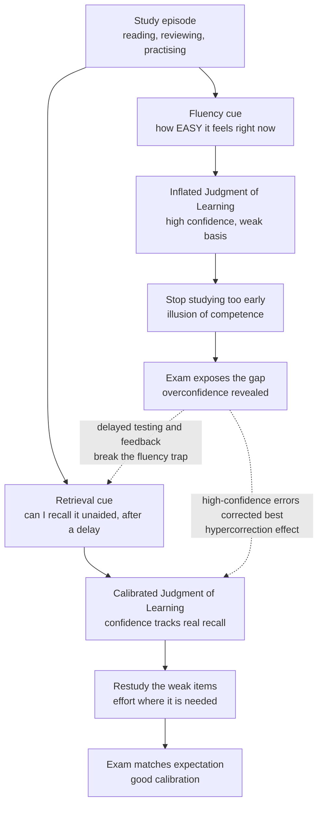

# 🪞 Calibration and Illusions of Competence

> [!abstract] TL;DR
> **Calibration** is the match between how well you *think* you know something and how well you *actually* know it. Learners are chronically **overconfident**, and the reason is diagnostic: the brain reads the wrong signal. It mistakes **fluency** — how smooth and easy a piece of material feels right now — for durable learning, so re-reading, highlighting, and massed cramming *feel* productive while building almost nothing. The most spectacular case is the **Dunning-Kruger effect**: the very incompetence that makes you perform badly also robs you of the metacognitive skill needed to notice you performed badly — though part of that famous curve is a statistical artifact of regression to the mean, not pure psychology. Calibration is not fixed. It improves when you swap "does this feel familiar?" for a harder, truer question — **"can I retrieve it right now, unaided?"** — which is why delayed self-testing, spacing, and feedback repair overconfidence, and why your highest-confidence *errors* are the ones you correct best once corrected (the **hypercorrection effect**).

## Intuition

**Analogy: mistaking a well-lit room for a memorized one.**

Imagine you are asked to redraw the floor plan of a room you have walked through a hundred times — your office, a friend's kitchen. It feels utterly familiar; you could not be *more* certain you know it. Then you pick up the pencil and discover you have no idea where the light switch is, which way the door swings, or how many windows there are. The room *felt* known because you had processed it fluently a hundred times. Fluency is not the same as an internal map.

Now imagine two students the night before an exam. The first re-reads the chapter; every sentence glides by, nothing snags, and she closes the book feeling ready — the material is *fluent*. The second closes the book and tries to reconstruct the argument from a blank page; it is halting, effortful, full of gaps she did not know she had. She feels *worse* prepared. The next morning the second student outscores the first, because the difficulty she felt was the sound of learning actually happening. The first student had confused the brightly-lit, familiar-feeling room for a memorized one. **Calibration is the discipline of not trusting the light — of measuring what you can actually draw.**

---

## How It Works

### What calibration actually is

Metacognition — thinking about your own thinking — has two measurable components, and it is vital not to confuse them:

1. **Bias (calibration in the narrow sense)** — the *average* gap between confidence and accuracy. If you are 90% confident across a set of questions but get 65% right, your bias is +25 points of **overconfidence**. Perfect bias means your average confidence equals your average accuracy.
2. **Resolution (also called discrimination)** — whether your confidence *tracks* item-by-item correctness: are you more confident on the items you actually get right than on the ones you get wrong? A learner can be perfectly unbiased on average yet have terrible resolution (equally confident about everything), or well-resolved yet globally overconfident.

The everyday judgments that carry this confidence are **Judgments of Learning (JOLs)** — "how likely am I to recall this later?" — and **Feelings of Knowing (FOKs)** — "even if I can't recall it now, would I recognize it?" These self-predictions are the steering wheel of self-regulated study: they decide what you restudy, what you drop, and when you stop. If they are miscalibrated, you allocate effort to the wrong places and stop too early.

### Why the steering wheel is broken: the fluency illusion

JOLs are not read off a truth meter in the brain. They are **inferences** built from cues, and the most seductive cue is **processing fluency** — the subjective ease with which information is perceived, read, or brought to mind. The brain treats "this was easy to process" as evidence for "this is well learned." Usually that heuristic is harmless. In study, it is a trap, because the activities that maximize *present* fluency are often the ones that minimize *future* memory:

- **Re-reading** makes text ever more fluent on each pass (perceptual and conceptual priming) while adding almost nothing to durable retention. The rising fluency is misread as rising mastery — the classic **familiarity trap**.
- **Highlighting** creates an even more pernicious version: the act of marking a passage tags it as "handled," and the highlighted page later *looks* known at a glance, producing recognition-driven confidence with no retrieval ability behind it.
- **Massed practice (cramming)** keeps material in an active, fluent state, so performance and confidence stay high *during* the session — then collapse days later. Because the feeling of competence peaks exactly when you are studying, massed study feels maximally effective while being among the least effective methods.

This is the core paradox of learning science: **the conditions that make performance feel best in the moment are frequently the ones that make learning worst in the long run** — the flip side of *desirable difficulties*.

### The illusion of explanatory depth

Fluency's cousin is the **illusion of explanatory depth (IOED)**: people believe they understand complex systems — a zipper, a flush toilet, a bicycle, a market — in far more mechanistic detail than they can actually produce. The illusion survives because we rarely try to generate a full causal account. Asked to *explain step by step how it works*, confidence drops sharply, because the attempt exposes the missing gears. IOED is the adult, conceptual version of the floor-plan failure: recognition and gist feel like mechanism until retrieval demands the mechanism.

### The Dunning-Kruger effect — and its statistical asterisk

The most cited illusion of competence is the **Dunning-Kruger effect (1999)**: across grammar, logic, and humor tests, the worst-performing participants (bottom quartile) massively *overestimated* their rank, while the best performers slightly *underestimated* theirs. Dunning and Kruger's psychological explanation is the **double curse**: the same knowledge you lack to answer a question correctly is the knowledge you would need to *evaluate* your answer. Incompetence is thus partly self-cloaking — you cannot see the errors you do not have the competence to detect. Crucially, when poor performers were *trained* to competence, their self-assessments improved, suggesting the metacognitive deficit is real and skill-linked.

But the famous crossing chart has a heavy **statistical critique** you must know to discuss it honestly:

- **Regression to the mean plus the better-than-average effect.** If self-assessments are noisy and everyone drifts toward "a bit above average," then binning people by their *actual* score guarantees the bottom group looks over-optimistic and the top group looks over-modest — even with *zero* real metacognitive difference. Krueger and Mueller (2004) argued much of the effect is this artifact.
- **The graph is partly mechanical.** Plotting perceived percentile against actual quartile will always produce the classic scissor shape whenever self-estimates are imperfectly correlated with performance, because measurement error alone bends the lines toward the mean.

The honest position: there is a genuine, replicable *metacognitive* component — poor performers really do have weaker error-detection — **layered on top of** a statistical inevitability. Do not present the pop-culture cartoon (a lone "peak of Mount Stupid," which is not even in the original paper) as the finding.

### Two biases baked into JOLs

Even careful learners carry systematic distortions:

- **Foresight bias (Koriat and Bjork, 2005)** — making a JOL *while the answer is in front of you* inflates your predicted future recall, because the answer makes the pairing feel obvious. You judge "capital of Australia — Canberra" as easy to recall later while looking at "Canberra," forgetting that at test time the answer will be *absent*. The cure is to make the judgment under conditions that resemble the test.
- **Stability bias (Kornell and Bjork, 2009)** — people predict that their future memory will be roughly what it is now, systematically *underweighting* both the forgetting that will erode it and the gains that further study or spacing would add. We treat the current state of memory as more stable than it is.

### How to repair calibration

Calibration improves when you replace the fluency cue with a cue that actually correlates with future memory — namely, **the difficulty of genuine retrieval**:

1. **Delayed JOLs (Nelson and Dunlosky, 1991).** Judging learning *immediately* after study rides on short-term fluency and is poorly calibrated. Inserting a delay before the judgment forces you to attempt retrieval from long-term memory, dramatically improving **resolution** — the "delayed-JOL effect," one of the most robust findings in metamemory.
2. **Testing / retrieval practice as a diagnostic.** A self-test does not just strengthen memory; it is a *truth serum* for calibration. A failed retrieval is unambiguous, unfakeable feedback that fluency cannot paper over. Testing simultaneously builds the memory and measures it honestly.
3. **Feedback.** Confidence recalibrates fastest when errors are surfaced and corrected, closing the loop between predicted and actual performance.

### The confidence–competence relationship is double-edged

More confidence is not simply good or bad. High confidence with high competence is expertise; high confidence with low competence is dangerous overreach; low confidence with high competence (the **impostor** pattern, common in top performers) wastes capacity on needless restudy and anxiety. The goal is not *maximal* confidence but *accurate* confidence.

One elegant demonstration of confidence's upside is the **hypercorrection effect (Butterfield and Metcalfe, 2001)**: errors that you committed with *high* confidence are the ones you are *most* likely to correct after feedback — the opposite of the intuitive fear that strong wrong beliefs are stickiest. The surprise of being confidently wrong grabs attention and drives deep encoding of the correction. Confidence, when paired with feedback, becomes an engine of repair rather than an obstacle to it.



---

## Key Concepts

### Secondary (intuitive level)

- Feeling like you know something is **not** the same as actually knowing it.
- Re-reading and highlighting make pages feel easy and familiar, but "easy to read" does not mean "stuck in your head." That good feeling is a trick called the **fluency illusion**.
- The best way to find out if you really know something is to close the book and try to say it from memory. If it is hard, that hard feeling is learning happening.
- The people who know the *least* about a topic are often the *most* sure they know a lot — because you need some skill just to notice your own mistakes.

### Undergraduate (mechanistic level)

- **Calibration = bias + resolution.** Bias is the average confidence-minus-accuracy gap; resolution is whether confidence discriminates correct from incorrect items. They are independent and both matter.
- **JOLs and FOKs are cue-based inferences,** not direct memory read-outs. The dominant cue, **processing fluency**, is a valid signal in general life but a systematically misleading one in study.
- **Overconfidence is the default** because the activities that raise present fluency (rereading, highlighting, massing) diverge from those that raise future retention (retrieval, spacing, interleaving) — the *desirable difficulties* logic.
- **Dunning-Kruger** describes a bottom-quartile overestimation / top-quartile underestimation pattern; its *psychological* engine is the double curse (lacking the skill to evaluate the skill), and its *statistical* confound is regression to the mean crossed with the better-than-average effect.
- **Repair tools:** delayed JOLs (force long-term retrieval, boost resolution), retrieval practice as a diagnostic (unfakeable feedback), and explicit corrective feedback.

### Graduate (theoretical and design level)

- **The cue-utilization framework (Koriat, 1997)** partitions JOL cues into *intrinsic* (item difficulty), *extrinsic* (study conditions), and *mnemonic* (subjective fluency of processing or retrieval). Miscalibration is a mismatch between which cues a learner weights and which cues actually predict criterion performance; the delayed-JOL effect works by shifting weight from short-term to retrieval-based mnemonic cues.
- **Foresight bias (Koriat and Bjork, 2005)** and **stability bias (Kornell and Bjork, 2009)** are structured, predictable JOL distortions arising from an information asymmetry between the judgment context and the test context; both are corrected by aligning the judgment conditions with the eventual retrieval conditions.
- **The Dunning-Kruger debate is a live methodological case study.** Krueger and Mueller (2004), Nuhfer et al., and Gignac and Zajenkowski (2020) show that (a) regression to the mean plus measurement error mechanically generate the scissor plot, and (b) alternative analyses (e.g., the Glass-ceiling and nonlinear-relationship models) find the residual metacognitive effect is smaller than the original claim yet non-zero. A defensible account separates the artifactual component from the genuine skill-linked deficit rather than endorsing or dismissing the effect wholesale.
- **Hypercorrection (Butterfield and Metcalfe, 2001)** implicates *surprise* and attentional orienting: the prediction error between high confidence and disconfirming feedback drives enhanced encoding of the correction, with hippocampal and error-related neural signatures. It reframes confidence not as an obstacle to correction but, given feedback, as a lever for it — a bridge to the **region of proximal learning** account of study-time allocation (Metcalfe).
- **Design implication:** self-regulated learning systems should *engineer* honest metacognitive cues — by defaulting to spaced, delayed self-testing rather than restudy, by withholding the answer during the confidence judgment, and by making retrieval failures salient — because left to intrinsic fluency cues, learners reliably self-select the worst methods.

---

## Python Demo

```python
# Two views of miscalibration, using numpy + matplotlib only.
#
# PANEL 1  Reliability diagram (calibration curve)
#   x-axis: the learner's STATED confidence that an answer is correct
#   y-axis: the ACTUAL fraction correct at that confidence level
#   The diagonal y = x is PERFECT calibration. An overconfident learner's
#   curve sits BELOW the diagonal (says 90%, gets ~68%).
#
# PANEL 2  Dunning-Kruger pattern
#   Bin people by their ACTUAL test performance and compare their
#   PERCEIVED performance. Low performers overestimate the most; the
#   self-assessment line is far flatter than the reality line, and the
#   two cross near the top -- the classic scissor shape.

import numpy as np
import matplotlib.pyplot as plt

rng = np.random.default_rng(0)

# ---------------------------------------------------------------
# PANEL 1: reliability diagram
# ---------------------------------------------------------------
n = 8000
bins = np.linspace(0.5, 1.0, 11)          # confidence buckets 50%..100%
centers = 0.5 * (bins[:-1] + bins[1:])

def reliability(conf, correct, bins):
    idx = np.clip(np.digitize(conf, bins) - 1, 0, len(bins) - 2)
    return np.array([correct[idx == b].mean() if np.any(idx == b) else np.nan
                     for b in range(len(bins) - 1)])

# Well-calibrated learner: true accuracy equals stated confidence.
conf_cal = rng.uniform(0.5, 1.0, n)
correct_cal = rng.random(n) < conf_cal

# Overconfident learner: fluency inflates confidence ~22 points above truth.
conf_over = rng.uniform(0.5, 1.0, n)
true_acc_over = np.clip(conf_over - 0.22, 0.0, 1.0)
correct_over = rng.random(n) < true_acc_over

acc_cal = reliability(conf_cal, correct_cal, bins)
acc_over = reliability(conf_over, correct_over, bins)

# ---------------------------------------------------------------
# PANEL 2: Dunning-Kruger pattern
# ---------------------------------------------------------------
m = 6000
true_skill = rng.uniform(0, 100, m)                        # actual percentile
# Self-estimates gravitate toward "above average" and only weakly track skill,
# so poor metacognition compresses judgments toward a high, flat band.
perceived = np.clip(62 + 0.30 * (true_skill - 50) + rng.normal(0, 11, m), 0, 100)

q = np.quantile(true_skill, [0, .25, .50, .75, 1.0])
labels = ["Bottom\n25%", "2nd\nquartile", "3rd\nquartile", "Top\n25%"]
actual_means, perceived_means = [], []
for i in range(4):
    sel = (true_skill >= q[i]) & (true_skill <= q[i + 1])
    actual_means.append(true_skill[sel].mean())
    perceived_means.append(perceived[sel].mean())
actual_means = np.array(actual_means)
perceived_means = np.array(perceived_means)

# ---------------------------------------------------------------
# Plot
# ---------------------------------------------------------------
fig, (ax1, ax2) = plt.subplots(1, 2, figsize=(13, 5.5))

ax1.plot([0.5, 1.0], [0.5, 1.0], color="#6b7280", ls="--",
         label="perfect calibration  y = x")
ax1.plot(centers, acc_cal, "o-", color="#2563eb", lw=2,
         label="well-calibrated learner")
ax1.plot(centers, acc_over, "s-", color="#dc2626", lw=2,
         label="overconfident learner")
ax1.fill_between(centers, acc_over, centers, color="#dc2626", alpha=0.12,
                 label="overconfidence gap")
ax1.set_xlabel("Stated confidence")
ax1.set_ylabel("Actual accuracy")
ax1.set_title("Reliability diagram: below the diagonal = overconfident")
ax1.set_xlim(0.5, 1.0)
ax1.set_ylim(0.4, 1.0)
ax1.legend(loc="upper left", fontsize=8)
ax1.grid(alpha=0.3)

x = np.arange(4)
ax2.plot(x, actual_means, "o-", color="#2563eb", lw=2, label="actual performance")
ax2.plot(x, perceived_means, "s-", color="#dc2626", lw=2, label="perceived performance")
ax2.fill_between(x, actual_means, perceived_means,
                 where=(perceived_means > actual_means),
                 color="#dc2626", alpha=0.12, label="overestimation")
ax2.set_xticks(x)
ax2.set_xticklabels(labels)
ax2.set_xlabel("Actual skill quartile")
ax2.set_ylabel("Percentile")
ax2.set_title("Dunning-Kruger: worst performers overestimate the most")
ax2.set_ylim(0, 100)
ax2.legend(loc="upper left", fontsize=8)
ax2.grid(alpha=0.3)

plt.tight_layout()
plt.show()

# Console summary
print("PANEL 1 -- overconfident learner")
print(f"  at stated confidence ~0.90, actual accuracy = {acc_over[-2]:.2f} "
      f"(gap ~{0.90 - acc_over[-2]:+.2f})")
print("\nPANEL 2 -- Dunning-Kruger gaps by quartile")
for lab, a, p in zip(["bottom", "2nd", "3rd", "top"], actual_means, perceived_means):
    print(f"  {lab:>6}: actual {a:5.1f}  perceived {p:5.1f}  gap {p - a:+6.1f}")
```

Running it reproduces both signatures. In **Panel 1** the blue curve hugs the diagonal (accuracy equals confidence), while the red overconfident curve sits well below it — at a stated confidence near 0.90 the learner is actually right only about 0.68 of the time, a ~22-point overconfidence gap. In **Panel 2** the reality line climbs steeply from the bottom quartile to the top, but the self-assessment line stays high and nearly flat; the bottom quartile overestimates its rank by roughly **+35 percentile points**, the top quartile *under*estimates by a little, and the two lines cross near the upper end — the canonical Dunning-Kruger scissor. Notice the second panel emerges partly from *pure regression*: the self-estimate is only weakly correlated with skill, and that alone bends the lines toward the mean, which is exactly the statistical critique the note describes.

---

## Real-World Applications

- **Study strategy and exam prep.** The single highest-leverage intervention is replacing rereading/highlighting with **retrieval practice and spacing**: it both builds memory and gives honest calibration feedback, so students stop studying at the right time rather than the fluent-feeling time.
- **Professional and medical training.** Overconfidence in low performers is a patient-safety issue; simulation, mandatory testing, and structured feedback (rather than self-rated readiness) are used precisely because self-assessment is unreliable, especially at the bottom of the skill distribution.
- **Software engineering estimation.** The planning fallacy and IOED show up as confident time estimates for systems no one can fully explain; retrospectives and reference-class forecasting act as external calibration checks against the fluency of a familiar codebase.
- **Machine-learning model calibration.** The reliability diagram in the demo is the *same tool* used to audit classifiers: a model that outputs 0.9 confidence should be right 90% of the time. Techniques like temperature scaling and Platt scaling exist because deep networks, like people, are systematically overconfident.
- **Forecasting and intelligence analysis.** Superforecasting programs train analysts by scoring calibration explicitly (Brier scores) and forcing probabilistic self-assessment against outcomes — institutionalized feedback to defeat overconfidence.
- **Public understanding of complex systems.** IOED research is used to *reduce* political and scientific overconfidence: asking people to mechanistically explain a policy before rating their support measurably tempers extreme, poorly-grounded positions.

---

## Common Pitfalls

- **Trusting the feeling of fluency.** The most common study error: "I read it and it made sense, so I know it." Making sense on input is recognition, not retrieval. Always convert "does this feel familiar?" into "can I produce it from blank?"
- **Judging learning immediately after study.** Immediate JOLs ride short-term fluency and are poorly calibrated. Insert a delay so the judgment is based on genuine long-term retrieval (the delayed-JOL effect).
- **Making confidence judgments with the answer visible.** Foresight bias inflates predicted recall when the answer is in front of you; judge under test-like, answer-absent conditions.
- **Assuming your memory now is your memory later.** Stability bias makes learners ignore both future forgetting (overconfidence) and the gains from further spaced study (under-preparation). Plan for the memory you will have at test time, not the one you have tonight.
- **Reciting the pop version of Dunning-Kruger.** The "Mount Stupid" cartoon and the claim that "dumb people think they're geniuses" overstate and distort the finding. Real answer: bottom performers overestimate partly from a genuine metacognitive deficit and partly from regression to the mean; competent people are often *under*confident.
- **Fearing that correcting confident beliefs is hopeless.** The opposite is true with feedback — the hypercorrection effect means high-confidence errors are corrected *best*, because the surprise drives deep encoding of the fix. Withholding feedback, not the confidence itself, is the real danger.
- **Optimizing for confidence instead of calibration.** Cheerleading "believe in yourself" can inflate bias without touching competence. The target is *accurate* self-assessment — including the discipline to lower confidence where warranted.

---

## Related Concepts

- [[Learning_Science_Overview]] — states the headline lesson this note dissects in depth: "the feeling of fluency is not learning," and why learners left to their own judgment pick worse methods.
- [[Memory_and_the_Learning_Brain]] — supplies the retrieval-is-reconstruction mechanics that make self-testing both a memory builder and the honest calibration signal recommended here.
- [[Cognitive_Load_and_Learning]] — the fluency that inflates JOLs is partly the felt ease of a low-load presentation; this note explains why low felt load can co-occur with poor learning.
- [[Cognitive_Biases]] — situates overconfidence, hindsight, and the better-than-average effect within the broader catalogue of systematic judgment errors (Kahneman and Tversky).
- [[Cognitive_Biases_and_Heuristics]] — the dual-process and heuristics-and-biases framework whose "System 1 fluency read as truth" mechanism underlies the fluency illusion and IOED.

---

## Review Questions

**Tier 1 — Recall / Comprehension**
1. Distinguish the two components of calibration, *bias* and *resolution*, and give an example of a learner who is well-calibrated on one but not the other.
2. Explain the fluency illusion: what cue does the brain read, why is it usually valid, and why does it mislead specifically during study with rereading and highlighting?

**Tier 2 — Application**
3. A student re-reads a chapter three times, feels completely ready, and scores poorly. Using JOLs, fluency, and stability/foresight bias, diagnose exactly where the self-assessment went wrong, and prescribe three concrete changes (naming the mechanism each fixes).
4. You build a reliability diagram for a student and find their curve sits ~20 points below the diagonal across all confidence levels, but higher-confidence items are still more likely correct than lower-confidence ones. What does this say about their *bias* versus *resolution*, and what intervention targets each?

**Tier 3 — Analysis / Synthesis**
5. A colleague cites the Dunning-Kruger "Mount Stupid" chart to argue that incompetent people are delusionally overconfident. Give a rigorous critique: identify the genuine metacognitive claim, separate it from the regression-to-the-mean-plus-better-than-average artifact, and describe an analysis or experiment that would isolate the real psychological effect from the statistical one.
6. The hypercorrection effect says high-confidence errors are corrected best, yet overconfidence is portrayed as the villain of learning. Reconcile these: under what conditions is high confidence an asset versus a liability, and design a study routine that harnesses hypercorrection while defeating the fluency illusion.

---

## Sources

- Dunning, D., & Kruger, J. (1999). "Unskilled and unaware of it: How difficulties in recognizing one's own incompetence lead to inflated self-assessments." *Journal of Personality and Social Psychology*, 77(6), 1121–1134.
- Krueger, J., & Mueller, R. A. (2004). "Unskilled, unaware, or both? The better-than-average heuristic and statistical regression predict errors in estimates of own performance." *Journal of Personality and Social Psychology*, 82(2), 180–188.
- Koriat, A., & Bjork, R. A. (2005). "Illusions of competence in monitoring one's knowledge during study." *Journal of Experimental Psychology: Learning, Memory, and Cognition*, 31(2), 187–194.
- Nelson, T. O., & Dunlosky, J. (1991). "When people's judgments of learning (JOLs) are extremely accurate at predicting subsequent recall: The 'delayed-JOL effect.'" *Psychological Science*, 2(4), 267–270.
- Rozenblit, L., & Keil, F. (2002). "The misunderstood limits of folk science: An illusion of explanatory depth." *Cognitive Science*, 26(5), 521–562.
- Butterfield, B., & Metcalfe, J. (2001). "Errors committed with high confidence are hypercorrected." *Journal of Experimental Psychology: Learning, Memory, and Cognition*, 27(6), 1491–1494.

---

#learning-science #calibration #metacognition #dunning-kruger #fluency-illusion
