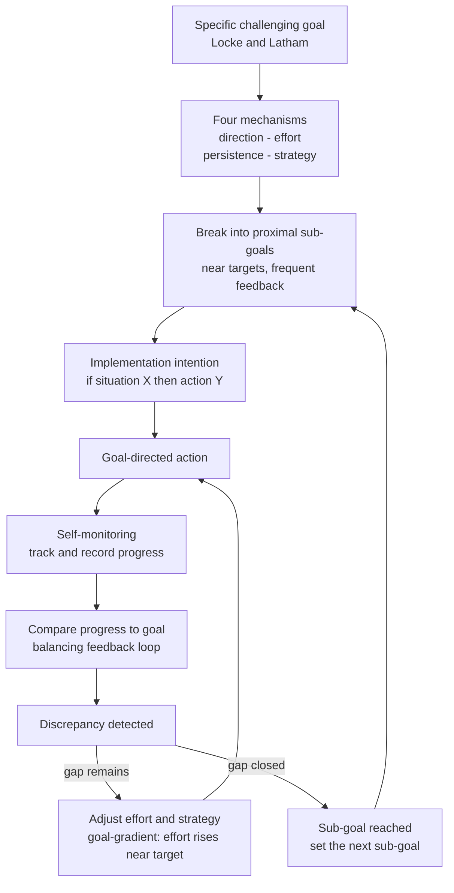

# 🎯 Goal Setting and Self-Monitoring

> [!abstract] TL;DR
> **Goal setting** is the deliberate act of committing to a *specific, challenging* target, and **self-monitoring** is the act of tracking your progress toward it — and the two form a **feedback loop** that is one of the most robust levers in all of behavioral science. Locke & Latham's meta-analytic finding is blunt: specific hard goals beat vague "do your best" goals almost every time, because a good goal steers four mechanisms — **direction, effort, persistence, and strategy**. But the raw target is not enough. **Proximal sub-goals** keep motivation alive across a long journey by supplying frequent feedback; **implementation intentions** ("if situation X, then I do Y") convert good intentions into near-automatic action; and **self-monitoring itself changes behavior** — the mere act of measuring a habit nudges it in the desired direction (the reactivity effect). The dark side is real too: goals pushed too hard narrow attention, invite cheating, and crush intrinsic motivation ("goals gone wild"), and human beings chronically under-plan how long anything will take (the planning fallacy).

---

## Intuition

**Analogy: the marathon with mile markers versus the marathon with no signs.**

Imagine two runners doing the same 26.2-mile course. The first runs a route with a mile marker every mile and a big digital clock at each one. She always knows exactly where she is, how far is left, and whether she is on pace — and, curiously, she finds a surge of energy in the last half-mile as the finish line comes into view. The second runs an identical course with **no markers at all**: no signs, no clock, no idea whether she is at mile 4 or mile 18. Same fitness, same distance — but the second runner drifts, slows through the featureless middle, and is far more likely to quit.

That is the whole idea. A **goal** is the finish line; **sub-goals** are the mile markers; **self-monitoring** is the clock. The finish line alone gives you a *direction*, but the markers and the clock are what actually keep you *moving* — and the near-the-finish surge is the **goal-gradient effect**, the observation that effort intensifies as a target comes within reach. A distant goal with no intermediate feedback is a marathon with the signs taken down.

---

## How It Works

### Core mechanism: why specific, hard goals work

Edwin Locke and Gary Latham built **goal-setting theory** on hundreds of studies converging on one result: a goal that is both **specific** and **difficult** produces higher performance than a vague goal, an easy goal, or the ubiquitous exhortation to "do your best." "Do your best" fails precisely because it has *no external referent* — any level of effort can be rationalized as one's best, so it imposes no real standard. A specific hard goal channels behavior through four mechanisms:

1. **Direction** — it focuses attention and action on goal-relevant activities and away from irrelevant ones.
2. **Effort** — a harder goal mobilizes more energy; effort scales to the demand of the target.
3. **Persistence** — a clear goal sustains effort over time and resists the temptation to quit or coast.
4. **Strategy (task knowledge)** — a goal prompts the search for and use of task-relevant strategies, especially on complex tasks.

Goal-setting is **moderated**, not universal. It works best when the person has high **goal commitment** (they accept and own the goal), receives **feedback** on progress, possesses the **ability** to reach it, and — critically — when the task is **not so novel or complex** that the person still lacks the strategy to perform it. On genuinely complex, unfamiliar tasks, a hard *performance* goal can backfire; a **learning goal** ("discover three effective strategies") outperforms it, because it directs attention to acquiring the missing knowledge rather than to a score the person does not yet know how to hit.

### Proximal vs distal goals and the goal gradient

A **distal goal** ("finish the dissertation") is motivationally thin in the middle: it is so far away that day-to-day progress barely moves the needle, and feedback is sparse. **Proximal goals** — near-term sub-goals ("write 500 words today") — solve this by chopping the distance into segments that each deliver a completion signal. Bandura and Schunk showed that proximal sub-goals raise **self-efficacy** and intrinsic interest more than a single distal goal, because success is frequent and visible. This dovetails with the **goal-gradient hypothesis** (Hull, 1932; revived by Kivetz et al., 2006): effort accelerates as one nears a goal. Sub-goals exploit this repeatedly — every marker resets a *new* nearby finish line, so the motivating "almost there" surge recurs many times instead of once.

### Implementation intentions: closing the intention–action gap

Wanting a goal and *acting* on it are different problems. Peter Gollwitzer's **implementation intentions** are pre-committed **if-then plans**: "*If* it is 7am *then* I will put on my running shoes." By specifying the *situational cue* and the *response* in advance, the plan delegates action initiation to the environment — the cue triggers the behavior semi-automatically, without a fresh act of willpower. Meta-analyses find medium-to-large effects on follow-through, especially for goals people already want but keep failing to enact. Implementation intentions are the bridge between a *goal intention* (the "what") and reliable execution (the "when, where, and how").

### Self-monitoring and the reactivity effect

**Self-monitoring** — observing and recording your own behavior — is not a passive measurement. The act of tracking a behavior **changes** it: this is **reactivity** (or the *measurement effect*). Simply logging every cigarette, every dollar spent, or every glass of water tends to move the behavior in the socially/personally desired direction, because monitoring makes the gap between current state and goal salient and unavoidable. Self-monitoring supplies the **feedback** that goal-setting theory requires; without it the goal has direction but no error signal.

### The feedback loop that ties it together

Goal + monitoring form a **balancing (negative) feedback loop** in the control-theory sense (Carver & Scheier): the system continuously compares *current progress* to the *goal standard*, detects the **discrepancy**, and acts to reduce it — then re-measures. This is a discrepancy-reducing loop identical in structure to a thermostat (see [[Feedback_Loops_and_Causality]]). Two subtleties matter. First, affect tracks the **rate** of discrepancy reduction, not just its size — moving *faster than expected* feels good even far from the goal, which is why visible progress is motivating. Second, the loop only works if the person **acts on** the feedback; measurement that is never compared to a standard or converted into an adjustment is inert.



---

## Key Concepts

### Secondary Level

- **A goal is a target you commit to.** "Read 20 pages tonight" beats "do some reading" because it is specific and you can tell whether you hit it.
- **Hard goals beat easy ones** — as long as you believe you can reach them. A target that stretches you pulls out more effort than one you could hit half-asleep.
- **SMART goals.** A popular checklist for writing a good goal: **S**pecific, **M**easurable, **A**chievable, **R**elevant, **T**ime-bound. It is a memory aid for "make the goal concrete," not a scientific law.
- **Cut a big goal into small ones.** "Save $6,000 this year" feels hopeless; "save $500 this month" feels doable — and you get a win every month.
- **If-then plans.** Decide *in advance* exactly when and where you will act: "*If* I finish lunch, *then* I do 10 minutes of flashcards." The situation itself reminds you, so you rely less on willpower.
- **Track it and it changes.** Keeping a simple log — a streak, a checklist, a step counter — nudges the behavior on its own, because you can no longer pretend about how you are doing.
- **The final-stretch surge.** People push hardest when the finish is in sight (the goal-gradient effect) — which is exactly why frequent mini-finishes help.

### Undergraduate Level

- **The four mechanisms (Locke & Latham).** Specific hard goals raise performance through *direction* (focus), *effort* (intensity), *persistence* (duration), and *strategy* (they cue task-relevant knowledge). Memorize these as the causal engine, not just the empirical result.
- **Moderators of goal effectiveness.** Goal commitment, feedback, task complexity, ability, and self-efficacy. High commitment plus feedback are near-necessary; on high-complexity tasks the performance boost weakens or reverses.
- **Proximal vs distal (Bandura & Schunk, 1981).** Proximal sub-goals build self-efficacy and intrinsic interest through frequent success and feedback; a lone distal goal leaves a demotivating middle where progress is invisible.
- **Learning goals vs performance goals.** *Performance goals* target an outcome ("score 90"); *learning/mastery goals* target skill acquisition ("master three solution methods"). On novel or complex tasks, learning goals win because they direct attention to strategy discovery rather than to a score the learner cannot yet reliably produce. (Related to Dweck's achievement-goal and mindset work.)
- **Implementation intentions (Gollwitzer, 1999).** If-then plans link an anticipated *cue* to a *response*, automating initiation. Effect sizes are medium-to-large and largest where a strong goal intention already exists but keeps failing at the point of action (forgetting, distraction, temptation).
- **Reactivity / the measurement effect.** Self-monitoring is an *intervention*, not just a gauge: tracking a behavior shifts it, and the effect strengthens when the tracked dimension is goal-relevant and the feedback is immediate.
- **SMART's limits.** SMART is a *drafting heuristic*, not a theory. It says nothing about difficulty (the strongest lever), about learning vs performance framing, about commitment, or about the dangers of over-specification. A goal can be perfectly SMART and still be the *wrong* goal.

### Graduate Level

- **Control theory of self-regulation (Carver & Scheier).** Behavior is governed by nested **negative feedback loops** (a hierarchy of TOTE units) that reduce the discrepancy between a perceived state and a reference value. A second, higher-order loop monitors the *velocity* of discrepancy reduction — affect is the output of this rate comparison, explaining why unexpectedly fast progress feels rewarding even when the goal is still distant, and why stalled progress on a valued goal produces distress.
- **The goal-gradient hypothesis and endowed progress (Kivetz, Urminsky & Zheng, 2006).** Purchase-frequency and running-speed data confirm effort rises with proximity to a reward. The related **endowed-progress effect** shows that *artificially advancing* someone toward a goal (a 12-stamp card with 2 stamps pre-given beats a 10-stamp card) accelerates completion — proximity is partly a *perception* that can be engineered.
- **Goals gone wild (Ordóñez, Schweitzer, Galinsky & Bazerman, 2009).** A corrective to naive goal enthusiasm. Aggressive, narrow goals can *narrow focus too far* (ignoring non-goal dimensions), *induce unethical behavior* (Sears auto-repair overcharging, Ford Pinto, Wells Fargo accounts), *promote excessive risk-taking*, *harm learning* on complex tasks, and *erode intrinsic motivation* by turning activities into instruments. Their prescription: treat goal-setting as a *prescription-strength medication*, not a candy, and prefer learning goals under complexity and uncertainty.
- **Feedback intervention theory (Kluger & DeNisi, 1996).** Roughly a third of feedback interventions *reduce* performance. Feedback helps when it directs attention to the *task* and to *strategy*; it hurts when it directs attention to the *self* (praise, threat to ego), moving cognition away from the task. This qualifies the "just add feedback" reading of goal-setting theory.
- **The planning fallacy (Kahneman & Tversky, 1979).** People systematically underestimate task completion times because they take an **inside view** (imagining this specific plan going smoothly) instead of an **outside view** (the distribution of how similar past projects actually went). Countermeasures: **reference-class forecasting**, **segmentation/unpacking** of the task, and building in explicit buffers (see [[Cognitive_Biases_and_Heuristics]]).
- **Process vs outcome goals and keystone habits.** *Outcome goals* ("lose 10 kg") specify a result you do not fully control; *process goals* ("walk 8,000 steps daily") specify controllable actions and are more robustly linked to follow-through. Chaining process goals into **keystone habits** (Duhigg) — small routines that cascade into broader change — turns effortful self-regulation into low-cost automaticity, which is the long-run goal of any self-regulation system.

---

## Python Demo

```python
# numpy + matplotlib only.
# Two ideas from goal-setting research, in one simulation:
#
#  (1) GOAL-GRADIENT HYPOTHESIS: effort rises as you approach a goal.
#      We model per-step effort as a function of PROXIMITY to the next target:
#          effort(p) = e_min + (e_max - e_min) * p**gamma,   p in [0, 1]
#      p = 0 far from the target (low effort), p -> 1 at the target (peak effort).
#
#  (2) PROXIMAL SUB-GOALS vs ONE DISTANT GOAL.
#      * One distant goal: proximity = total_progress / W. It climbs so slowly
#        that the runner is stuck in the low-effort "motivational trough" for a
#        long time and only surges at the very end.
#      * Ten tracked sub-goals: proximity RESETS every segment, so the near-the-
#        target surge recurs ten times. Tracking adds a small reactivity boost.
#
# We give both strategies the SAME time budget and plot cumulative progress.

import numpy as np
import matplotlib.pyplot as plt

W            = 100.0      # total work to complete (arbitrary units)
T            = 200        # time steps available (e.g. study days)
e_min, e_max = 0.20, 1.20 # effort floor (far from goal) and ceiling (at goal)
gamma        = 2.0        # curvature: effort stays low until the goal is near

def effort(proximity):
    # Goal-gradient: effort accelerates as proximity -> 1 (target in sight).
    return e_min + (e_max - e_min) * proximity**gamma

def simulate(n_subgoals, track_boost=0.0):
    seg_len  = W / n_subgoals
    progress = 0.0
    traj     = [0.0]
    for _ in range(T):
        if progress >= W:                     # already finished -> hold at the top
            traj.append(W)
            continue
        within    = progress % seg_len        # distance into the current segment
        proximity = within / seg_len          # 0 at segment start, ->1 at next (sub)goal
        step      = effort(proximity) * (1.0 + track_boost)   # reactivity lifts effort
        progress  = min(progress + step, W)
        traj.append(progress)
    return np.array(traj)

# One distant goal vs ten tracked sub-goals, same total work, same time budget.
distal   = simulate(n_subgoals=1,  track_boost=0.00)
proximal = simulate(n_subgoals=10, track_boost=0.15)
steps    = np.arange(T + 1)

def finish_step(traj):
    done = np.where(traj >= W)[0]
    return int(done[0]) if done.size else None

d_done, p_done = finish_step(distal), finish_step(proximal)
print(f"One distant goal    : progress after {T} steps = {distal[-1]:5.1f} / {W:.0f}"
      + (f", finished on step {d_done}" if d_done else ", NOT finished (stuck in the trough)"))
print(f"10 tracked sub-goals: progress after {T} steps = {proximal[-1]:5.1f} / {W:.0f}"
      + (f", finished on step {p_done}" if p_done else ", NOT finished"))

fig, (axL, axR) = plt.subplots(1, 2, figsize=(12.5, 5))

# Left: the goal gradient itself -- effort as a function of proximity to target.
p = np.linspace(0.0, 1.0, 200)
axL.plot(p, effort(p), color="darkgreen", lw=2)
axL.fill_between(p, e_min, effort(p), color="darkgreen", alpha=0.10)
axL.set_xlabel("Proximity to the next (sub)goal   [0 = far, 1 = at target]")
axL.set_ylabel("Effort per step")
axL.set_title("Goal-gradient hypothesis: effort surges near a target")
axL.grid(alpha=0.3)

# Right: cumulative progress under the two strategies.
axR.plot(steps, distal,   color="tomato",    lw=2, label="One distant goal")
axR.plot(steps, proximal, color="steelblue", lw=2, label="Ten tracked sub-goals")
for k in range(1, 10):                                  # sub-goal marker lines
    axR.axhline(k * W / 10, color="steelblue", alpha=0.12, lw=0.8)
axR.axhline(W, color="gray", ls="--", lw=1.0, label="Task complete")
axR.set_xlabel("Time step")
axR.set_ylabel("Cumulative progress")
axR.set_title("Sub-goals sustain effort; a lone distant goal stalls")
axR.set_ylim(0, W * 1.05)
axR.legend(loc="lower right")
axR.grid(alpha=0.3)

plt.tight_layout()
plt.savefig("goal_gradient_and_subgoals.png", dpi=150)
print("Saved goal_gradient_and_subgoals.png")
```

**What the demo shows.** The left panel is the goal-gradient assumption made visible: effort barely lifts off the floor while the target is far away and then climbs steeply as proximity approaches 1. The right panel is the consequence. The **single distant goal** (red) computes its proximity from *total* progress, which crawls upward — so it lingers in the low-effort "motivational trough" for almost the entire time budget and never reaches the finish line within the allotted steps. The **ten tracked sub-goals** (blue) reset proximity at every marker, so the near-the-target effort surge recurs again and again; combined with a small self-monitoring reactivity boost, the trajectory pulls decisively ahead and completes the whole task with time to spare. The intrinsic difficulty of the work is *identical* in both runs — the only thing that changed was how the goal was structured and tracked. That gap between the two curves is the entire practical case for proximal sub-goals plus self-monitoring.

---

## Real-World Applications

- **Loyalty programs and the endowed-progress effect.** The "buy 10 coffees, get one free" punch card is the goal-gradient hypothesis monetized: purchase rates accelerate as customers near the reward, and pre-stamping a 12-slot card with 2 free stamps (versus a bare 10-slot card) measurably speeds completion — proximity engineered directly into the design.
- **Fitness, habit, and finance trackers.** Fitbit step counts, Duolingo streaks, Anki review queues, budgeting apps, and calorie logs all weaponize **self-monitoring reactivity**: the tracked number becomes a live discrepancy signal, and the very act of logging shifts behavior. Streaks add a "don't break the chain" loss-aversion twist on top.
- **OKRs and agile sprints.** Objectives-and-Key-Results and two-week sprints operationalize proximal sub-goals: a distant annual objective is decomposed into near, measurable, feedback-rich increments, keeping teams out of the motivational trough and surfacing discrepancies early.
- **Health-behavior change via implementation intentions.** Classic interventions — "if it is 8am then I take my medication," "if I am offered a cigarette then I say 'I don't smoke'" — reliably raise adherence, exercise, screening attendance, and diet follow-through, often doubling completion rates in controlled trials at essentially zero cost.
- **Weight-loss and self-monitoring evidence base.** Across behavioral-weight-loss research, *frequency of self-monitoring* (food and weight logging) is one of the strongest single predictors of success — a textbook demonstration that measurement is itself an intervention.
- **Project management and the planning fallacy.** Reference-class forecasting (used in large infrastructure and software estimation) counters chronic under-budgeting by anchoring estimates on how similar past projects actually finished rather than on an optimistic inside-view plan.

---

## Common Pitfalls

- **Setting vague or "do your best" goals.** Without a specific standard, effort has no referent and drifts. Fix: make the target specific and measurable, and pitch its *difficulty* high enough to stretch commitment.
- **Only a distant goal, no sub-goals.** A lone far target leaves a long feedback desert in the middle where progress is invisible and quitting is easy — exactly the red curve in the demo. Fix: install proximal sub-goals so wins and feedback arrive frequently.
- **Performance goals on novel, complex tasks.** Demanding a *score* before the learner has the *strategy* raises anxiety and can lower performance. Fix: on unfamiliar tasks set **learning goals** ("find and master N strategies") until competence is built.
- **Goals gone wild.** Aggressive, narrow, high-stakes goals induce tunnel vision, gaming of metrics, unethical shortcuts, and reckless risk-taking (Wells Fargo's account quotas, Sears' repair targets). Fix: monitor non-goal dimensions, cap incentives, and prefer learning goals under uncertainty.
- **The planning fallacy.** Estimating from an optimistic inside view chronically underbudgets time and resources, so goals become impossible on contact. Fix: take the outside view — reference-class forecasting, unpack the task, add buffers.
- **Outcome-only goals you can't control.** "Win the deal" or "lose 10 kg" depends on factors outside your hands, so effort and result decouple. Fix: pair each outcome goal with **process goals** over controllable actions.
- **Measuring without acting.** Self-monitoring only helps if the feedback is compared to the standard and converted into an adjustment; a dashboard nobody responds to is inert. Fix: close the loop — decide the corrective action *before* you look at the number.
- **Over-specifying and over-goal-setting.** Too many simultaneous goals, or a metric so precise it becomes the target itself (Goodhart's law), fragments attention and distorts behavior. Fix: prioritize a few keystone goals and watch for metric-gaming.

---

## Related Concepts

- [[Theories_of_Motivation]] — the parent motivational frame; goal-setting theory (Locke & Latham) sits alongside drive, expectancy, and self-determination accounts and supplies goal-setting's "why it energizes behavior" foundation.
- [[Feedback_Loops_and_Causality]] — the goal-plus-monitoring cycle *is* a balancing (negative) feedback loop; this note's discrepancy-reduction mechanism is the control-theory structure formalized there (delays cause overshoot and oscillation).
- [[Cognitive_Biases_and_Heuristics]] — home of the planning fallacy, the inside-vs-outside view, pre-mortems, and reference-class forecasting that goal-setters must guard against when estimating.
- [[Learning_Science_Overview]] — situates goal-setting and self-monitoring within the broader evidence-based toolkit; metacognitive monitoring and calibration are the same regulatory machinery applied to studying.
- [[Cognitive_Load_and_Learning]] — implementation intentions and automatized process goals reduce the working-memory cost of self-regulation, freeing capacity for the task itself.
- [[Theories_of_Learning]] — behaviorist reinforcement and social-cognitive (Bandura) accounts underpin the goal-gradient and self-efficacy mechanisms that make proximal sub-goals work.

---

## Review Questions

### Secondary Tier

1. Your friend says their goal is to "get better at guitar." Rewrite it as a specific, challenging, trackable goal, break it into two proximal sub-goals, and write one if-then plan that would help them actually practice.
2. Explain the marathon-with-mile-markers analogy in your own words. Why does the runner with no signs slow down and quit more easily even though she is just as fit?

### Undergraduate Tier

3. Locke & Latham list four mechanisms through which specific hard goals raise performance. Name them and give a concrete example of each for a student preparing for a certification exam. Then name one *moderator* that could make the same hard goal backfire.
4. A manager sets an aggressive, specific *performance* goal for a team tackling a brand-new, poorly understood problem, and performance *drops*. Using the learning-goal vs performance-goal distinction, explain why, and state what goal you would set instead and why.
5. Explain the reactivity (measurement) effect and why self-monitoring is described as an *intervention* rather than a gauge. Design a minimal tracking scheme for a habit and identify the point in the feedback loop where most people fail to act.

### Graduate Tier

6. Using Carver & Scheier's control-theory model, explain why *unexpectedly fast* progress can feel rewarding even when the goal is still far away, and connect this to why proximal sub-goals and the goal-gradient effect are motivating. What does the higher-order "velocity" loop add beyond a simple discrepancy-reducing loop?
7. Ordóñez et al. (2009) argue goals should be treated as a "prescription-strength medication." Lay out their five side effects of aggressive goal-setting, then design a goal system for a sales organization that captures the benefits of specific hard goals while structurally defending against metric-gaming and unethical behavior.
8. Derive the practical case for reference-class forecasting from the inside-view/outside-view account of the planning fallacy. Then explain how segmentation (unpacking a project into sub-tasks) can *both* improve estimates (via proximal feedback) and *worsen* them (via the subadditivity of unpacked estimates), and how you would resolve the tension.

---

## Sources

- Locke, E. A. & Latham, G. P. (2002). "Building a practically useful theory of goal setting and task motivation: A 35-year odyssey." *American Psychologist*, 57(9), 705–717.
- Gollwitzer, P. M. (1999). "Implementation intentions: Strong effects of simple plans." *American Psychologist*, 54(7), 493–503.
- Bandura, A. & Schunk, D. H. (1981). "Cultivating competence, self-efficacy, and intrinsic interest through proximal self-motivation." *Journal of Personality and Social Psychology*, 41(3), 586–598.
- Kivetz, R., Urminsky, O. & Zheng, Y. (2006). "The goal-gradient hypothesis resurrected: Purchase acceleration, illusionary goal progress, and customer retention." *Journal of Marketing Research*, 43(1), 39–58.
- Ordóñez, L. D., Schweitzer, M. E., Galinsky, A. D. & Bazerman, M. H. (2009). "Goals gone wild: The systematic side effects of overprescribing goal setting." *Academy of Management Perspectives*, 23(1), 6–16.
- Carver, C. S. & Scheier, M. F. (1998). *On the Self-Regulation of Behavior.* Cambridge University Press.

---

#learning-science #goal-setting #self-monitoring #locke-latham #implementation-intentions
