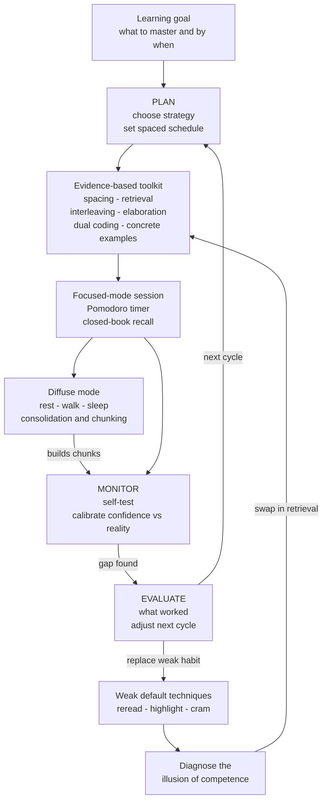

# 🧠 Learning How to Learn

> [!abstract] TL;DR
> **Learning how to learn** is the meta-skill of deliberately managing your own learning — choosing evidence-based strategies, monitoring whether they are working, and adjusting. It is arguably the **highest-leverage skill for any knowledge worker or polymath**, because every other skill is acquired through it: a small edge in learning efficiency, applied to thousands of study sessions across a career, compounds into an enormous knowledge gap. The research-backed toolkit is now well established — **spacing, retrieval practice, interleaving, elaboration, dual coding, concrete examples, and desirable difficulties** — yet most learners default to the *least* effective methods (re-reading, highlighting, cramming) precisely because those methods *feel* more productive. The core discipline is therefore metacognitive: learn to distrust the feeling of fluency, adopt strategies that feel worse but work better, and run a **plan → monitor → evaluate** loop over your own mind.

---

## Intuition

**Analogy: sharpening the axe before chopping the tree.**

An old story has a woodcutter frantically sawing at a tree with a dull blade. A passerby suggests he stop and sharpen the axe. "No time," he pants, "I'm too busy cutting." He is confusing *effort* with *progress*. Learning how to learn is sharpening the axe: it is the small up-front investment in *how* you study that makes every subsequent hour of study cut deeper.

Now push the analogy one step further into compounding. Suppose two woodcutters each work the same hours for thirty years, but one keeps a sharper blade — every swing removes a little more wood. On any single day the difference is almost invisible; you could not tell them apart at 5 p.m. But wood removed is *cumulative*, and a permanent per-swing advantage, multiplied by a lifetime of swings, ends with one woodcutter having cleared a forest while the other cleared a grove. That is exactly what happens to a person's knowledge. The meta-skill is not glamorous and its daily payoff is small — which is why most people never sharpen the axe — but over a career it is the single largest determinant of how much you come to know and how well you can use it.

---

## How It Works

Learning how to learn is not one technique; it is a **system** with three layers stacked on top of each other. The bottom layer is a **toolkit** of evidence-based study strategies. The middle layer is a **metacognitive control loop** that selects, monitors, and adjusts those strategies. The top layer is a **stance** — a set of beliefs about your own mind (growth mindset, respect for desirable difficulty) that keeps the loop running when the strategies feel unpleasant.

### Layer 1: the evidence-based toolkit (Dunlosky's "what works")

The landmark audit by **Dunlosky, Rawson, Marsh, Nathan & Willingham (2013)** rated ten common study techniques by the strength of their evidence. The synthesis every self-learner should internalize:

1. **Spacing (distributed practice)** — *high utility.* Spread the same total study time across days rather than massing it. Each review at the point of near-forgetting delivers a larger, more durable boost.
2. **Retrieval practice (the testing effect)** — *high utility.* Actively recalling information from memory strengthens it far more than reviewing it. Closing the book and reconstructing the idea *is* the learning event, not just a measurement of it.
3. **Interleaving** — *moderate utility.* Mix related problem types instead of blocking one type. It forces you to *discriminate* which method applies, which is what real problems demand and what builds transfer.
4. **Elaborative interrogation and self-explanation** — *moderate.* Ask *why* and *how*; explain the material in your own words and connect it to what you already know. Elaboration builds the retrieval routes that make knowledge accessible.
5. **Dual coding** — combine verbal and visual representations so a concept has two complementary memory traces rather than one.
6. **Concrete examples** — anchor abstractions in multiple worked examples so the underlying structure can be abstracted from surface features.
7. **Highlighting, re-reading, summarization, keyword mnemonics** — *low utility despite enormous popularity.* These dominate real study habits and are largely what learning how to learn exists to *replace*.

### Layer 2: the metacognitive control loop (plan → monitor → evaluate)

The toolkit is inert without a controller. **Self-regulated learning** runs a three-phase cycle: **plan** (set a specific goal, choose a strategy, schedule the work), **monitor** (during and after study, test whether you actually know it — closed-book, not by re-reading), and **evaluate** (judge what worked and adjust the next cycle). The engine of this loop is honest **calibration**: comparing your *confidence* against your *actual* performance and correcting the gap. Poor learners are not always those with weaker memory — often they are those whose monitoring is miscalibrated, so they stop studying while still in the grip of the **illusion of competence**.

### Layer 3: Oakley & Sejnowski's mental-modes framework

Barbara Oakley and Terrence Sejnowski's massively popular course *Learning How to Learn* adds an operating model for the *brain* running the loop:

- **Focused vs diffuse modes.** The **focused mode** is tight, effortful, deliberate attention on material you already partly understand. The **diffuse mode** is a relaxed, background state — during rest, a walk, a shower, or sleep — in which the brain makes broad, novel connections. Hard problems often need both: focus to load the pieces, then diffuse rest to let them settle. This is why *stepping away* and *sleeping on it* genuinely work, and why marathon cramming, which never allows diffuse consolidation, is doubly wasteful.
- **Chunking.** Learning compresses scattered facts into a single retrievable **chunk** — a unit that behaves as one item in working memory. Expertise is a large library of chunks; building them is the point of practice.
- **Procrastination and the Pomodoro technique.** Procrastination is driven by anticipated *discomfort*, not by the task itself; the brain avoids the pain of starting. A **Pomodoro** (a short, timed focus block, classically 25 minutes) reframes the goal from "finish this" to "put in the time," removing the discomfort trigger and reliably getting you started.
- **The illusion of competence.** Re-reading and highlighting create *fluency* — smooth, familiar processing — which the mind misreads as mastery. Recognizing a highlighted sentence is not the same as being able to recall or use it. This illusion is the central enemy the whole system is built to defeat.

### Why the good strategies feel worse: desirable difficulties

Nearly every high-utility technique is a **desirable difficulty** (Bjork): a manipulation that *depresses performance during study* but *enhances long-term retention and transfer*. Spacing means you have forgotten a little, so recall is harder. Retrieval means struggling instead of re-reading. Interleaving means never getting comfortable with one problem type. Because the mind uses in-the-moment ease as its progress signal, these strategies **feel like failing while you are actually learning** — and the easy strategies feel like succeeding while you learn almost nothing. The single most important belief to install is: *when a study method feels uncomfortable and slow, that is often evidence it is working.*



---

## Key Concepts

### Secondary Level

**Learning how to learn is a skill you can get better at.** It is not fixed talent. There are specific, tested methods that make studying work better, and specific popular methods that mostly waste time.

**The four swaps.** Replace *re-reading* with *quizzing yourself*. Replace *cramming the night before* with *short sessions across many days*. Replace *practicing one kind of problem in a row* with *mixing kinds*. Replace *highlighting* with *explaining the idea out loud in your own words*.

**Sharpen the axe, then chop.** Spending a little time deciding *how* to study makes every hour of studying count for more. The payoff each day is small, but it adds up hugely over months.

**"Feeling like you know it" is a trap.** If the book is open in front of you, everything looks familiar and easy. Close the book and try to say it from memory — that is when you find out what you actually know.

### Undergraduate Level

**The meta-skill argument.** Every domain-specific skill — coding, calculus, a language, a musical instrument — is *acquired through learning*. So an improvement in learning ability is an improvement in the rate of acquiring *all other skills*. This is why learning how to learn is called the highest-leverage skill: its returns are not additive but *multiplicative* across everything else you ever study, which is exactly what makes it so valuable to a polymath maintaining many domains at once.

**Compounding of learning efficiency.** A modest per-session efficiency edge (say, retrieval + spacing giving roughly 1.3x the durable gain of passive re-reading's roughly 0.8x) is trivial on any single day. But knowledge builds on knowledge — prior chunks make new material easier to encode — so the advantage *compounds*. Over thousands of sessions in a career the two trajectories diverge by an order of magnitude. The Python demo below makes this concrete.

**Self-regulated learning (Zimmerman).** The metacognitive control loop has a name and a research tradition. Zimmerman's model formalizes **forethought** (goal setting, strategic planning, self-efficacy), **performance** (self-control and self-observation during study), and **self-reflection** (self-judgment and adaptive inference afterward). Expert learners cycle through these deliberately; novices skip planning and reflection and simply "put in hours."

**Calibration and the illusion of competence.** Learners make **judgments of learning** that are biased by fluency, by the answer sitting visible in front of them (the *foresight bias*), and by recent massed exposure. The cure is structural: *delay* your self-quiz so the judgment reflects durable memory rather than fresh working-memory contents, and test with *free recall* rather than recognition. Good calibration — not raw memory — is what separates efficient learners.

**Diagnosing and replacing popular-but-weak techniques.** Highlighting, re-reading, and summarizing feel productive because they are fluent and low-effort, and they *are* better than nothing — but their evidence base is weak. The practical algorithm: notice a technique that feels easy and comfortable, suspect it, and *convert* it into an active-retrieval version (turn a re-read into a closed-book recall; turn a highlight into a self-generated question).

### Graduate Level

**Building a personal learning system.** The mature practice externalizes the control loop into tools. A durable system typically combines: (1) a **spaced-repetition engine** (Anki / SuperMemo-style scheduling) that operationalizes spacing and retrieval automatically; (2) a **retrieval-oriented note system** — atomic, self-authored notes that you must reconstruct rather than copy, cross-linked so elaboration is forced by design (a linked vault such as this one is exactly such a system); and (3) an **interleaved problem set** or project pipeline that mixes contexts. The design principle is to make the *effortful* strategies the *default path of least resistance*, because willpower is unreliable but a well-built system is not.

**Growth mindset toward one's own learning.** Dweck's distinction between fixed and growth mindsets is most consequential when applied *reflexively* — to your beliefs about your own learnability. A learner who reads struggle and error as *evidence of low ability* will flee desirable difficulties; one who reads the same struggle as *the mechanism of growth* will lean into them. Since every effective technique feels like failing, the growth stance is not motivational fluff here — it is the enabling condition that lets a person tolerate the discomfort the evidence demands. (Caveat: the mindset literature has meaningful replication debates; the useful, robust core is the *behavioral* claim that treating errors as informative sustains effortful practice.)

**Transfer of learning strategies across domains.** A subtle question: does learning how to learn *itself* transfer? Domain knowledge transfers poorly (far transfer is rare), but *metacognitive and self-regulatory strategies* are among the more transferable things a learner can acquire, because they are content-independent control policies rather than facts. The polymath's advantage is not a general "smartness" but a portable **learning operating system** — a stable set of habits (space it, test it, interleave it, calibrate honestly, rest to consolidate) that can be pointed at any new field, dramatically lowering the start-up cost of each domain.

**Desirable difficulties and the metacognitive paradox.** The deep reason the field is counter-intuitive: our metacognitive monitoring evolved to use *fluency* as its signal, but fluency tracks **retrieval strength** (current accessibility), whereas durable learning is governed by **storage strength** (Bjork & Bjork's new theory of disuse). Because storage-strength gains are *largest* when retrieval strength is *low*, the study events that produce the most learning are precisely those that feel the hardest and register as poor performance. Learning how to learn is, at root, training your metacognition to override its own most trusted signal — to act on a model of memory rather than on the feeling of knowing.

**Boundary conditions — not a free lunch.** Desirable difficulties are only desirable given sufficient prior knowledge and spare cognitive capacity; for a true novice under heavy **cognitive load**, the same manipulation becomes an *undesirable* difficulty (the expertise-reversal effect). A mature learning system therefore *sequences* difficulty: scaffold and worked examples first to build initial schemas, then progressively withdraw support and inject spacing, interleaving, and retrieval as competence grows.

---

## Python Demo

```python
# numpy + matplotlib only.
# THESIS: learning how to learn is the highest-leverage skill because a modest
# per-session efficiency edge COMPOUNDS. Knowledge builds on knowledge (prior
# chunks make new material easier to encode), so a small, permanent advantage
# in study efficiency multiplies across thousands of sessions into a large gap.
#
# We model two learners studying the SAME schedule for 3 years.
#   - "Effective"  uses spacing + retrieval + interleaving  -> efficiency 1.3x
#   - "Ineffective" uses re-reading + highlighting + cramming -> efficiency 0.8x
# Knowledge compounds like capital: each session's durable gain is a small
# base return scaled by the learner's efficiency, applied to accumulated skill.
import numpy as np
import matplotlib.pyplot as plt

YEARS             = 3
SESSIONS_PER_WEEK = 4
WEEKS_PER_YEAR    = 52
N = YEARS * WEEKS_PER_YEAR * SESSIONS_PER_WEEK          # total study sessions
sessions_per_month = SESSIONS_PER_WEEK * WEEKS_PER_YEAR / 12.0
months = np.arange(N) / sessions_per_month             # x-axis in months

BASE_RETURN = 0.008     # durable learning added per session, as a fraction of skill
EFF_GOOD    = 1.30      # evidence-based strategies: spacing + retrieval + interleave
EFF_BAD     = 0.80      # ineffective strategies: re-reading + highlighting + cram
K0          = 1.0       # both learners start with equal baseline knowledge

def compound_knowledge(efficiency, base=BASE_RETURN, n=N, k0=K0):
    """Knowledge compounds: K_{t+1} = K_t * (1 + base * efficiency).
    A permanent per-session efficiency edge compounds over every session."""
    growth = 1.0 + base * efficiency
    return k0 * growth ** np.arange(n)

K_good = compound_knowledge(EFF_GOOD)
K_bad  = compound_knowledge(EFF_BAD)

final_ratio   = K_good[-1] / K_bad[-1]
per_session   = (1 + BASE_RETURN * EFF_GOOD) / (1 + BASE_RETURN * EFF_BAD) - 1
print(f"Per-session efficiency edge : {per_session:6.3%}  (tiny, invisible day-to-day)")
print(f"Knowledge after {YEARS} years  : effective = {K_good[-1]:8.1f} units")
print(f"                              ineffective = {K_bad[-1]:8.1f} units")
print(f"Final knowledge gap         : {final_ratio:5.1f}x  (a modest edge, compounded)")

fig, ax = plt.subplots(figsize=(11, 5.5))
ax.plot(months, K_good, color="steelblue", lw=2.2,
        label="Effective strategies  (spacing + retrieval + interleaving)")
ax.plot(months, K_bad,  color="tomato",    lw=2.2,
        label="Ineffective strategies (re-reading + highlighting + cramming)")
ax.fill_between(months, K_bad, K_good, color="steelblue", alpha=0.10)

# Show that early on the two are nearly indistinguishable.
ax.annotate("nearly identical\nfor the first months",
            xy=(3, K_good[int(3 * sessions_per_month)]), xytext=(6, K_good[-1] * 0.45),
            fontsize=9, color="gray",
            arrowprops=dict(arrowstyle="->", color="gray"))
ax.annotate(f"{final_ratio:.1f}x gap\nafter {YEARS} years",
            xy=(months[-1], K_good[-1]), xytext=(months[-1] * 0.62, K_good[-1] * 0.80),
            fontsize=10, color="steelblue",
            arrowprops=dict(arrowstyle="->", color="steelblue"))

ax.set_xlabel("Months of study")
ax.set_ylabel("Cumulative knowledge (arbitrary units)")
ax.set_title("Why learning-to-learn is the highest-leverage skill: a small edge compounds")
ax.legend(fontsize=9, loc="upper left")
ax.margins(x=0.01)
plt.tight_layout()
plt.savefig("compounding_learning.png", dpi=150)
print("Saved compounding_learning.png")
```

**What the demo shows.** The two learners differ by only a few tenths of a percent per session — a difference no one could perceive on any given afternoon, and exactly the reason people neglect the meta-skill. But because knowledge compounds (today's chunks accelerate tomorrow's encoding), that invisible edge is applied to hundreds of sessions and the curves diverge exponentially: after three years the effective learner holds many times the knowledge of the ineffective one, from the *same hours in the chair*. The plot's shape is the whole argument — indistinguishable at the start, dramatically separated at the end. Learning how to learn is not about working harder in the moment; it is about installing a permanent multiplier on every hour you will ever study.

---

## Real-World Applications

- **The personal knowledge system (Anki + a linked vault).** The most direct application is building the system described above: a spaced-repetition deck for atomic facts and a cross-linked note vault (like this one) for elaboration and connection. Medical students, language learners, and self-taught engineers who adopt this combination consistently out-retain peers using re-reading, because the system *forces* the effortful strategies rather than relying on willpower.
- **Bootcamps and self-taught developers.** The fastest self-learners in software explicitly interleave problem types, build projects (retrieval and transfer under real conditions), and space their review of fundamentals — rather than re-watching tutorials, which is high-fluency, low-retention "tutorial hell."
- **Oakley & Sejnowski's course reach.** *Learning How to Learn* on Coursera became one of the most-enrolled online courses in the world, translating focused/diffuse modes, chunking, and the Pomodoro technique into habits for millions of learners across every field.
- **Professional and continuous education.** Knowledge workers facing constant reskilling (new frameworks, new domains) benefit most from the *transferable* learning operating system: the same plan-monitor-evaluate loop and the same toolkit can be pointed at each new technology, lowering the start-up cost of every future learning project.
- **Polymathic practice.** Maintaining competence across many domains at once is only feasible with efficient spaced review and strong metacognitive calibration; the meta-skill is what makes breadth sustainable rather than a treadmill of forgetting.

---

## Common Pitfalls

- **Never sharpening the axe.** The most common failure is skipping the meta-skill entirely — grinding hours with weak methods because "there's no time to think about how to study." The daily cost of inefficiency is small and invisible, which is exactly why it is neglected and why it compounds into a huge deficit.
- **Mistaking fluency for mastery.** Re-reading and highlighting make material *feel* known because it becomes familiar and easy to read. Familiarity is recognition, not recall. Always verify with closed-book retrieval.
- **Adopting the tools without the loop.** Owning Anki or a beautiful note vault does nothing if you passively review cards or copy notes verbatim. The strategies only work when driven by genuine effortful retrieval and honest monitoring — the system is the *behavior*, not the software.
- **Quitting when the good strategies feel bad.** Because desirable difficulties feel like failing, learners abandon them for the comfortable methods just as they start working. This is where the growth-mindset stance is load-bearing: interpret the discomfort as the signal of learning, not of inability.
- **Applying difficulty to novices with no scaffolding.** Interleaving and retrieval can backfire under crushing cognitive load. Beginners need worked examples and structure first; withdraw support only as schemas form (expertise-reversal effect).
- **Believing in learning styles.** Tailoring study to a supposed visual/auditory/kinesthetic "style" is one of the most popular and least supported ideas in education. Match the method to the *material* and the *evidence*, not to a self-labeled style.
- **Cramming and optimizing the wrong horizon.** Massed study maximizes performance on an *immediate* test and near-total forgetting weeks later. If the goal is durable knowledge for a career, space the identical total effort across days and nights (sleep drives consolidation).

---

## Related Concepts

- [[Learning_Science_Overview]] — the descriptive-to-prescriptive foundation; this note is its practice-oriented synthesis, turning the principles into a personal system.
- [[Cognitive_Load_and_Learning]] — the working-memory capacity constraint that determines *when* a desirable difficulty helps versus overwhelms; the reason difficulty must be sequenced for novices.
- [[Memory_and_the_Learning_Brain]] — the encoding, consolidation, and forgetting-curve mechanisms that spacing and retrieval exploit; why sleep-crossing schedules beat cramming.
- [[Theories_of_Learning]] — the behaviorist, cognitivist, and constructivist traditions that frame *what learning is*, contextualizing the strategies as cognitivist/constructivist tools.
- [[Working_Memory_and_Cognitive_Load]] — chunking compresses items so they occupy one working-memory slot; the capacity bottleneck every strategy must respect.
- [[Long_Term_Memory_Systems]] — storage vs retrieval strength, the spacing and testing effects, and consolidation all live here; the substrate the toolkit operates on.
- [[Schemas_and_Mental_Models]] — elaboration and chunking work by connecting new material to existing schemas; schema construction is the germane processing good study promotes.
- [[Problem_Solving_and_Insight]] — the diffuse mode and incubation produce insight; transfer, the ultimate goal, is measured by novel problem-solving that interleaving targets.
- [[Dual_Process_Theory]] — fast, automatic System 1 generates the fluency heuristic and the pull to procrastinate; metacognitive monitoring is effortful System 2 work that must override it.
- [[Judgment_and_Decision_Making]] — calibration of confidence against reality is the same metacognitive skill; judgments of learning are systematically biased like other judgments under uncertainty.
- [[Cognitive_Biases]] — the illusion of competence and overconfidence in one's own learning belong to the same family of metacognitive biases as hindsight and availability.

---

## Review Questions

### Secondary Tier

1. Explain the "sharpen the axe" analogy in your own words. Give one study habit you currently use that is like sawing with a dull blade, and describe the sharper habit you would replace it with.
2. Name the four swaps (re-reading → ?, cramming → ?, one problem type → ?, highlighting → ?) and explain why the replacement in each pair feels harder but works better.

### Undergraduate Tier

3. It is claimed that learning how to learn is the "highest-leverage" skill. Reconstruct that argument, and explain specifically why the leverage is *multiplicative* across other skills rather than just additive. Use the compounding demo to support your answer.
4. Describe the plan-monitor-evaluate loop of self-regulated learning, and explain the role of *calibration* within it. Why does delaying a self-quiz and using free recall (rather than recognition) improve the quality of a judgment of learning?
5. A learner owns a spaced-repetition app and a large note vault but is not improving. Using the "tools without the loop" pitfall and the definition of retrieval practice, diagnose the most likely reason and prescribe a fix.

### Graduate Tier

6. Using Bjork & Bjork's storage-strength vs retrieval-strength framework, explain the "metacognitive paradox": why the study events that produce the *most* durable learning are precisely those that feel the *worst* and register as poor performance. What single assumption about storage-strength gains drives this result?
7. Domain knowledge transfers poorly (far transfer is rare), yet the note argues that *learning strategies* transfer relatively well across domains. Justify this asymmetry in terms of the difference between content and control policies, and explain why it is the true source of a polymath's advantage.
8. Design a 12-week self-teaching plan for an unfamiliar technical domain (e.g., learning Rust) that sequences difficulty correctly for a novice, integrates spacing, retrieval, and interleaving, uses focused/diffuse alternation, and specifies the metacognitive checks you would run. Identify the cognitive-load risk your early weeks must manage and how scaffolding mitigates it.

---

## Sources

- Dunlosky, J., Rawson, K. A., Marsh, E. J., Nathan, M. J. & Willingham, D. T. (2013). "Improving students' learning with effective learning techniques." *Psychological Science in the Public Interest*, 14(1), 4–58.
- Oakley, B. & Sejnowski, T. (2018). *Learning How to Learn: How to Succeed in School Without Spending All Your Time Studying.* TarcherPerigee. (And the Coursera course of the same name.)
- Brown, P. C., Roediger, H. L. & McDaniel, M. A. (2014). *Make It Stick: The Science of Successful Learning.* Harvard University Press.
- Bjork, R. A. & Bjork, E. L. (1992). "A new theory of disuse and an old theory of stimulus fluctuation." In *From Learning Processes to Cognitive Processes.* Erlbaum.
- Zimmerman, B. J. (2002). "Becoming a self-regulated learner: An overview." *Theory Into Practice*, 41(2), 64–70.
- Roediger, H. L. & Karpicke, J. D. (2006). "Test-enhanced learning: Taking memory tests improves long-term retention." *Psychological Science*, 17(3), 249–255.

---

#learning-science #learning-to-learn #metacognition #study-strategies #synthesis
