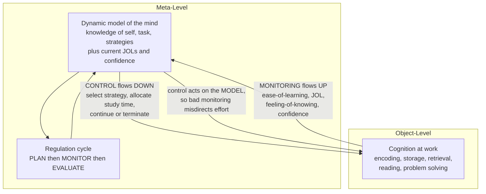

# 🪞 Metacognition and Thinking About Thinking

> [!abstract] TL;DR
> **Metacognition** is *cognition about cognition* — the mind observing and steering itself. John Flavell coined the term in the 1970s to name our capacity to think about our own thinking. It has two halves: **metacognitive knowledge** (what you know about yourself as a learner, about tasks, and about strategies) and **metacognitive regulation** (planning, monitoring, and evaluating your own cognition in real time). Nelson and Narens formalized this as a **meta-level** holding a model of an **object-level** that does the actual work, connected by **monitoring** (information flowing up) and **control** (commands flowing down). The single most consequential fact about metacognition: **monitoring accuracy governs learning**. If your judgments of learning are wrong, every downstream study decision inherits the error — which is why calibration, not raw effort, so strongly predicts who learns.

---

## Intuition

**Analogy: the pit crew watching its own race.**

A race car (the **object-level**) is doing the driving — accelerating, braking, taking corners. But it is blind to itself. Sitting above it is a **pit crew with a dashboard** (the **meta-level**): tire temperature, fuel, lap times. The crew never touches the road directly. All it does is (1) **read gauges** — that is *monitoring* — and (2) **radio instructions** back down: pit now, ease off, push harder — that is *control*. A great crew wins races not by driving better but by **reading the gauges accurately** and acting on them. A crew whose fuel gauge is broken makes confident, disciplined, and completely wrong decisions.

Metacognition is your internal pit crew. When you read a chapter, one part of you does the reading; another part watches and asks *"do I actually get this, or does it just feel familiar?"* and then decides whether to move on or re-read. Learning well is mostly a matter of whether that second part's gauges are calibrated — because a confident learner with a broken "I-know-this" gauge will close the book on exactly the material they have not learned.

---

## How It Works

### Core mechanics

Flavell (1979) split metacognition into **metacognitive knowledge** and **metacognitive experiences/regulation**. The modern working breakdown:

1. **Metacognitive knowledge** — your relatively stable beliefs about cognition, in three flavors:
   - **Person knowledge:** what you know about *yourself* as a learner ("I retain diagrams better than prose," "I fade after 40 minutes").
   - **Task knowledge:** what a given task *demands* ("recognition is easier than free recall," "this proof needs a fresh derivation, not memorized steps").
   - **Strategy knowledge:** which techniques work, and *when* to deploy them ("self-testing beats re-reading," "spacing beats cramming"). Knowing a strategy exists (declarative), how to run it (procedural), and when to use it (conditional) are distinct — the conditional part is where most learners fail.

2. **Metacognitive regulation** — the real-time executive that acts on that knowledge, in three phases:
   - **Planning:** setting goals, choosing strategies, and budgeting time *before* starting.
   - **Monitoring:** tracking comprehension and progress *during* the task ("am I following this?").
   - **Evaluating:** judging the outcome *after* ("did the strategy work? adjust next time?").

3. **Nelson and Narens' framework (1990)** gives the architecture. Cognition is split into two levels:
   - The **object-level** performs the task (encoding, retrieving, reading, solving).
   - The **meta-level** holds a **dynamic model** of the object-level.
   - **Monitoring** is the upward flow: the object-level informs the meta-level's model.
   - **Control** is the downward flow: the meta-level changes object-level behavior (start, continue, terminate, switch strategy).
   - Crucially, **control acts on the model, not on reality** — so if monitoring is inaccurate, control is confidently misdirected.

4. **The monitoring signals** are the specific judgments the meta-level reads off:
   - **Ease-of-Learning (EOL) judgments:** before study — "how hard will this be to learn?"
   - **Judgments of Learning (JOLs):** during/after study — "how well have I learned this? will I recall it later?"
   - **Feeling-of-Knowing (FOK):** during retrieval failure — "I can't recall it now, but would I recognize it?"
   - **Confidence judgments:** after answering — "how sure am I this is right?"

5. **Why monitoring accuracy is the linchpin.** The dominant model of study-time control is **discrepancy reduction**: learners spend time where they *perceive* a gap between current and desired mastery, i.e., time is allocated in proportion to `1 - JOL`. This policy is only as good as the JOLs feeding it. Accurate JOLs steer effort onto genuinely weak material; JOLs corrupted by **fluency** (material that was easy to *read* feels like material you have *learned*) steer effort away from exactly the items that need it. Same effort, same policy — opposite outcome. This is why metacognition is the executive of all **self-regulated learning**: every strategy choice and every "I'm done" decision routes through a monitoring judgment.

### Development and problem solving

Metacognition **develops with age** — young children systematically overestimate their memory and comprehension and only gradually learn to monitor and doubt themselves — but it is **domain-sensitive and trainable** at any age, not a fixed trait. In **problem solving**, metacognition shows up as the ability to detect an **impasse** — *knowing when you are stuck* — and to decide whether to persist, switch approach, or seek help. Weak problem-solvers often fail not on the math but on the monitoring: they never notice that their current approach has stalled.



---

## Key Concepts

**Secondary (explain it to a curious teenager):**
- **Metacognition = thinking about your own thinking.** One part of you does the task; another part watches and decides what to do next.
- It splits into **knowing** (what you know about how *you* learn) and **doing** (planning, checking yourself, and reviewing).
- The killer skill is honest self-checking: *"Do I really understand this, or does it just feel familiar because I read it twice?"* Feeling familiar is not the same as knowing.

**Undergraduate (needs some psychology background):**
- **Flavell (1979)** framed metacognition as *cognition about cognition*, spanning metacognitive knowledge (person, task, strategy) and metacognitive experiences.
- **Nelson and Narens (1990)** gave the **meta-level / object-level** architecture, with **monitoring** (bottom-up) and **control** (top-down) as the two directional flows.
- The monitoring family — **EOL, JOL, FOK, confidence** — are distinct judgments made at different points in the learning cycle, each with its own accuracy profile.
- **Discrepancy-reduction** and **region-of-proximal-learning** models describe how monitoring judgments are turned into study-time allocation.

**Graduate (system-level and measurement):**
- **Calibration vs resolution.** *Calibration* (absolute accuracy: does 80% confidence mean 80% correct?) and *resolution* (relative discrimination: are your higher JOLs assigned to items you actually know better?) are separable; resolution, often measured by the **gamma correlation** between JOLs and recall, is what drives good study allocation.
- **The delayed-JOL effect (Nelson and Dunlosky, 1991):** JOLs made after a delay are far more accurate than immediate JOLs, because delay removes the misleading short-term fluency cue and forces a genuine retrieval attempt.
- **Cue-utilization (Koriat, 1997):** JOLs are inferences from cues — *intrinsic* (item difficulty), *extrinsic* (study conditions), and *mnemonic* (fluency, familiarity). Illusions arise when a cue is diagnostic of the *feeling* of knowing but not of actual retrievability.
- **Causality:** Metcalfe and Finn (2008) showed JOLs are *causally* upstream of study choice, not just correlated with it — closing the monitoring-to-control loop empirically.

---

## Python Demo

```python
# The metacognitive loop = MONITORING (judge what you know) + CONTROL (decide
# what to study). We give two learners the SAME control policy -- discrepancy
# reduction: spend study time in proportion to the perceived gap to mastery,
# (1 - JOL). The ONLY thing that differs is MONITORING ACCURACY: whether their
# judgments of learning (JOLs) actually track reality.
import numpy as np
import matplotlib.pyplot as plt

rng = np.random.default_rng(7)
n_items = 40
budget = 60.0      # total units of study time to distribute across items
alpha = 1.0        # learning rate: how fast study closes the gap to mastery

# True current knowledge per item: 0 = not learned, 1 = mastered.
# A realistic spread -- some items are weak, some are already strong.
k0 = rng.uniform(0.05, 0.90, size=n_items)

def study(k_start, t):
    # Diminishing returns: study moves knowledge toward 1. A near-mastered item
    # gains almost nothing; a weak item gains a lot for the same time -> the
    # payoff lives in the weak items.
    return 1.0 - (1.0 - k_start) * np.exp(-alpha * t)

def allocate(jol, total):
    # CONTROL policy = discrepancy reduction: time proportional to perceived gap.
    gap = np.clip(1.0 - jol, 1e-9, None)
    return total * gap / gap.sum()

noise = rng.normal(0, 0.03, size=n_items)

# MONITORING -- well-calibrated learner: JOL tracks true knowledge.
jol_calibrated = np.clip(k0 + noise, 0, 1)

# MONITORING -- poorly-calibrated learner: the FLUENCY ILLUSION. Weak items that
# were easy to re-read FEEL mastered, so they receive the HIGHEST JOLs and get
# dropped, while genuinely-known items are second-guessed. The JOL ends up
# anti-correlated with reality, so effort pours into already-known items.
jol_fooled = np.clip((1.0 - k0) + noise, 0, 1)

t_cal = allocate(jol_calibrated, budget)
t_fool = allocate(jol_fooled, budget)

k_cal = study(k0, t_cal)
k_fool = study(k0, t_fool)

print(f"JOL-vs-truth correlation, calibrated : {np.corrcoef(jol_calibrated, k0)[0,1]:+.2f}")
print(f"JOL-vs-truth correlation, fooled     : {np.corrcoef(jol_fooled, k0)[0,1]:+.2f}")
print(f"Mean mastery before study            : {k0.mean():.3f}")
print(f"Mean mastery, well-calibrated learner: {k_cal.mean():.3f}  (gain {k_cal.mean()-k0.mean():+.3f})")
print(f"Mean mastery, poorly-calibrated      : {k_fool.mean():.3f}  (gain {k_fool.mean()-k0.mean():+.3f})")

# --- Plot ---
order = np.argsort(k0)          # sort items weakest -> strongest for clarity
x = np.arange(n_items)
fig, (ax1, ax2) = plt.subplots(1, 2, figsize=(13, 5))

ax1.bar(x - 0.2, t_cal[order], width=0.4, label="Well-calibrated", color="#2a9d8f")
ax1.bar(x + 0.2, t_fool[order], width=0.4, label="Poorly-calibrated", color="#e76f51")
ax1.set_title("Where each learner spends study time\nitems sorted weakest to strongest")
ax1.set_xlabel("item   weak  ->  already known")
ax1.set_ylabel("study time allocated")
ax1.legend()

labels = ["before", "well-\ncalibrated", "poorly-\ncalibrated"]
means = [k0.mean(), k_cal.mean(), k_fool.mean()]
bars = ax2.bar(labels, means, color=["#adb5bd", "#2a9d8f", "#e76f51"])
ax2.set_ylim(0, 1)
ax2.set_title("Final mean mastery from the SAME study budget")
ax2.set_ylabel("mean knowledge, 0 to 1")
for b, m in zip(bars, means):
    ax2.text(b.get_x() + b.get_width() / 2, m + 0.02, f"{m:.2f}", ha="center")

plt.tight_layout()
plt.savefig("metacognition_study_allocation.png", dpi=110)
plt.show()
```

**What it shows:** both learners obey the *same* rational rule (study where you feel weakest) and spend the *same* total time. The well-calibrated learner's JOLs correlate near `+1` with true knowledge, so effort lands on the genuinely weak items — the high-payoff region — and mean mastery climbs sharply. The poorly-calibrated learner's fluency-driven JOLs correlate near `-1` with reality, so effort is poured into already-known items that have almost no room to improve, while the weak items languish. The gap in final mastery is produced entirely by monitoring accuracy, not by effort or discipline. That is the whole thesis of metacognition in one plot.

---

## Real-World Applications

- **Study skills and the "illusion of competence."** Re-reading and highlighting feel productive because they raise fluency, inflating JOLs without building durable memory. Metacognition research is the basis for teaching **retrieval practice** and **spacing**, which feel harder (lower fluency) but produce accurate JOLs and better learning.
- **Intelligent tutoring systems.** Systems like Cognitive Tutor and modern spaced-repetition apps (Anki, Duolingo) exist precisely because human JOLs are unreliable; the software externalizes monitoring, scheduling review of items the learner *would have* wrongly judged as known.
- **Medical and aviation training.** Calibration training — comparing predicted vs actual performance — is used to fix dangerous overconfidence, where a clinician or pilot *feels* certain about a decision their track record does not support.
- **Reading comprehension instruction.** Strategies like self-questioning, summarizing, and "click and clunk" (flagging when comprehension breaks) are explicit **comprehension-monitoring** training for children who otherwise read on obliviously past the point of understanding.
- **AI systems.** Model **confidence calibration** and **selective prediction / abstention** are the machine analog of metacognitive monitoring: a model that knows when it does not know can defer to a human, exactly as a well-calibrated learner knows when to keep studying.

---

## Common Pitfalls

- **Confusing fluency with learning.** The most pervasive metacognitive error: smooth, familiar processing feels like mastery. Delayed self-testing, not re-reading, is the corrective — it replaces the fluency cue with a genuine retrieval attempt.
- **Treating metacognition as a fixed trait.** It is domain-specific and trainable. Being metacognitively sharp in chess says little about your monitoring in calculus; skill must be built where it is needed.
- **Optimizing effort while ignoring calibration.** More study time cannot rescue a broken monitor — it just pours resources into the wrong items. Fix the gauge before adding fuel.
- **Confusing calibration with resolution.** A learner can be perfectly calibrated on average (right about their overall accuracy) yet have zero resolution (unable to tell which specific items they know) — and resolution is what study allocation actually needs.
- **Immediate JOLs.** Judging learning right after studying an item is systematically overconfident; the delayed-JOL effect shows waiting a few minutes before self-assessing dramatically improves accuracy.
- **Assuming monitoring implies control.** Detecting that you are stuck or under-prepared is necessary but not sufficient; many learners register the problem yet fail to change strategy — a control failure, not a monitoring one.

---

## Related Concepts

- [[Dual_Process_Theory]] — Type 2 reflective processing is the machinery the meta-level runs on; conflict monitoring is a metacognitive signal in the dual-process account.
- [[Judgment_and_Decision_Making]] — confidence and calibration are studied in both fields; overconfidence is a shared failure mode of self-monitoring.
- [[Problem_Solving_and_Insight]] — detecting an impasse (knowing you are stuck) is metacognitive monitoring applied to problem solving.
- [[Working_Memory_and_Cognitive_Load]] — metacognitive regulation is capacity-limited; monitoring competes for the same working-memory resources as the task itself.
- [[Cognitive_Development]] — metacognitive accuracy improves across childhood as children learn to doubt their own memory and comprehension.
- [[Critical_Thinking_Frameworks]] — deliberately questioning your own reasoning is applied metacognition at the level of arguments and beliefs.
- [[Cognitive_Biases_and_Heuristics]] — many biases are monitoring failures (e.g., overconfidence, the illusion of explanatory depth) where the meta-level trusts a misleading cue.
- [[Problem_Solving_and_Decision_Making]] — the psychology treatment of heuristics and the System 1/System 2 split that metacognition sits atop.
- [[Memory_Systems]] — metamemory is metacognition applied to memory; JOLs and feeling-of-knowing are judgments about the memory systems described there.

---

## Review Questions

1. **(Conceptual)** In Nelson and Narens' framework, control is said to act "on the model, not on reality." Explain why this single fact makes *monitoring accuracy*, rather than effort or motivation, the primary determinant of learning outcomes.
2. **(Applied / scenario)** A student re-reads their notes three times, feels confident, and does poorly on the exam. Using the concepts of fluency, JOLs, and the delayed-JOL effect, diagnose exactly where their metacognitive loop broke and prescribe one change that fixes the monitoring rather than adding study time.
3. **(Trade-off / evaluative)** Distinguish *calibration* from *resolution*. Construct a case of a learner who is perfectly calibrated on average yet learns inefficiently, and argue which of the two properties an intelligent tutoring system should optimize for and why.

---

## Sources

- Flavell, J. H. (1979). "Metacognition and cognitive monitoring: A new area of cognitive-developmental inquiry." *American Psychologist, 34*(10), 906-911. [DOI](https://doi.org/10.1037/0003-066X.34.10.906)
- Nelson, T. O., & Narens, L. (1990). "Metamemory: A theoretical framework and new findings." *The Psychology of Learning and Motivation, 26*, 125-173. [DOI](https://doi.org/10.1016/S0079-7421(08)60053-5)
- Schraw, G., & Moshman, D. (1995). "Metacognitive theories." *Educational Psychology Review, 7*(4), 351-371. [DOI](https://doi.org/10.1007/BF02212307)
- Metcalfe, J., & Finn, B. (2008). "Evidence that judgments of learning are causally related to study choice." *Psychonomic Bulletin & Review, 15*(1), 174-179. [DOI](https://doi.org/10.3758/PBR.15.1.174)
- Kornell, N., & Bjork, R. A. (2007). "The promise and perils of self-regulated study." *Psychonomic Bulletin & Review, 14*(2), 219-224. [DOI](https://doi.org/10.3758/BF03194055)

---

#learning-science #metacognition #flavell #monitoring #self-awareness
