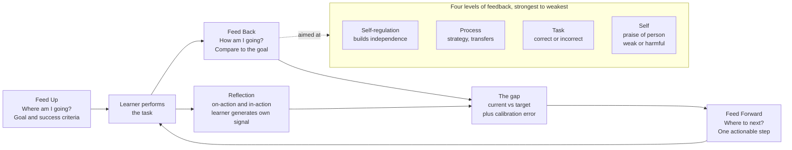

# 🪞 Reflection and Feedback

> [!abstract] TL;DR
> **Feedback** is information that tells a learner how their current performance compares to a goal, and it is one of the single most powerful influences on achievement — but *only when it is done well*. Hattie & Timperley frame effective feedback as answering three questions: **Feed Up** (where am I going?), **Feed Back** (how am I going?), and **Feed Forward** (where to next?), delivered at the level of the **task**, the **process**, or **self-regulation** — never as empty praise of the **self**. Kluger & DeNisi's Feedback Intervention Theory warns that feedback which points attention at the *person* rather than the *work* can actually *hurt* performance. **Reflection** — Schön's reflection-in/on-action, Kolb's reflective observation, after-action reviews, learning journals — is how a learner closes the gap themselves, turning errors into information and shrinking the metacognitive calibration gap between what they *think* they know and what they *actually* know.

---

## Intuition

**Analogy — learning to throw darts with the lights on versus off.** Imagine practising darts in a pitch-black room. You throw a hundred times and never see where a single dart lands. No matter how motivated you are, you cannot improve, because you have no *error signal* — no information about the gap between where the dart went and the bullseye. Now turn the lights on: that is **feedback**. But the *kind* of light matters. A vague coach who only shouts "nice throw!" is a dim, flickering bulb — you know something happened but not what to change. A good coach says "you're pulling two inches left; keep your elbow fixed and follow through toward the target" — that is a bright, focused spotlight aimed at the *task and the process*, and it tells you exactly what to do next.

And here is the twist that separates feedback from mere *scoring*: **reflection** is you, after the session, sitting down and asking *why* the darts drifted left and what you will try tomorrow. Feedback is the light in the room; reflection is you learning to see in the dark so that eventually you barely need the coach at all. A learner who can generate their own error signal has internalised the loop — that is the whole goal.

---

## How It Works

### Feedback as a closed loop: feed up, feed back, feed forward

Feedback only makes sense relative to a **goal**. Hattie & Timperley (2007) argue that any effective feedback episode must answer three questions in sequence:

1. **Feed Up — "Where am I going?"** The learner must know the goal and the *success criteria*. Without a clear target, feedback is a comment on nothing. This is why sharing rubrics and worked exemplars *before* practice matters.
2. **Feed Back — "How am I going?"** Compare current performance to the goal and surface the **gap**. This is the diagnostic core — it names the discrepancy.
3. **Feed Forward — "Where to next?"** The most neglected and most valuable part: a concrete, actionable next step. Feedback without a next action is just a grade.

### The four levels — and why "self" feedback is weak

The *same* comment can be pitched at four very different levels, and the level determines its power:

- **Task level (FT):** how well the task was done — correct or incorrect, meets criteria or not. Useful but doesn't transfer beyond this task.
- **Process level (FP):** the *strategy* used to do the task, e.g. "you could check this by working backwards." Generalises across tasks — often the sweet spot.
- **Self-regulation level (FR):** feedback that builds the learner's capacity to monitor and direct their own learning, e.g. "what could you check before submitting next time?" The most durable, because it builds independence.
- **Self level (FS):** praise directed at the *person* — "you're so smart," "good job you." This is the **weakest** and can be actively harmful: it carries no task information, and (per Dweck's work) it ties performance to fixed identity, so failure becomes a threat to the self rather than a data point.

The general finding: feedback at the **process** and **self-regulation** levels beats **task** feedback, which beats **self/praise** feedback.

### Formative vs summative: assessment *for* learning

- **Summative assessment** measures learning *after* the fact — the final exam, the grade. It is assessment *of* learning.
- **Formative assessment** happens *during* learning and feeds directly back into it — the low-stakes quiz, the draft with margin comments, the check-for-understanding. It is assessment **for** learning (Black & Wiliam). Its entire purpose is to generate feedback that changes what happens next.

A system that is all summative (grade-only, end-of-unit) starves the learner of the mid-course corrections that actually drive improvement.

### The timing tradeoff: immediate vs delayed

When feedback arrives matters, and the answer is *not* "always immediately":

- **Immediate feedback** excels at **error correction** during acquisition — it stops a wrong procedure from being rehearsed, and it is essential for motor skills and for genuine misconceptions.
- **Delayed feedback** can improve **retention and transfer**. A short delay forces the learner to *reconstruct* their answer from memory and to sit with uncertainty — a **desirable difficulty**. It also prevents feedback *dependence*, where the learner offloads monitoring onto the immediate corrector and never builds their own error detection.

The practical rule: immediate for raw skill acquisition and dangerous misconceptions; a modest delay when the aim is durable, transferable understanding. See [[Feedback_and_Error_Correction]] (S04) for the error-correction mechanics.

### When feedback backfires: Feedback Intervention Theory (Kluger & DeNisi)

The uncomfortable finding from Kluger & DeNisi's (1996) meta-analysis: across 607 effect sizes, **roughly a third of feedback interventions *decreased* performance**. Their Feedback Intervention Theory (FIT) explains why. Feedback works by drawing attention to a **feedback–standard gap** and motivating action to close it. But attention is a scarce resource that operates at a *locus* on a hierarchy from details of the task up to the whole self. When feedback cues attention **toward the self** (praise, threat, comparison to peers, ego), cognitive resources are pulled *away* from the task and spent on self-evaluation — and performance drops. Feedback helps most when it keeps attention on the **task and the process**, near the gap it is trying to close.

### Reflection: closing the loop yourself

Feedback from outside is only half the system. **Reflection** is how learners generate their own feedback:

- **Schön** distinguished **reflection-in-action** (thinking on your feet, adjusting mid-performance — the surgeon adapting during the operation) from **reflection-on-action** (the deliberate look-back afterward — the debrief). Expert practitioners do both.
- **Kolb's** experiential cycle makes **reflective observation** an explicit stage: concrete experience → reflective observation → abstract conceptualisation → active experimentation → and around again.
- **After-action reviews** (formalised by the US Army) ask four questions: *What was supposed to happen? What actually happened? Why the difference? What will we do differently?* — a structured, blameless reflection-on-action.
- **Learning journals** and **self-explanation prompts** ("explain why this step follows") externalise reflection and force the learner to articulate reasoning, which surfaces gaps.

### Errors as information, and the calibration gap

Reflection reframes **errors** from failures into *data*. Error analysis — asking *what kind* of error, and *why* — turns a wrong answer into the most informative feedback available. Crucially, feedback and reflection together shrink the **metacognitive calibration gap**: the difference between confidence and actual competence. Learners are systematically overconfident; targeted feedback ("you rated this 90% sure but got it wrong") is one of the few things that recalibrates judgment, which is the foundation of [[Self_Regulated_Learning]].



---

## Key Concepts

### Secondary level

- **Feedback is information, not a verdict.** It tells you the gap between what you did and what you were aiming for. A number by itself is a verdict; "you lost marks because you didn't show the units" is feedback.
- **Formative vs summative.** Formative = practice, low stakes, meant to help you improve *now* (a mock quiz you learn from). Summative = the real exam that measures the final result. You improve on formative; you're judged on summative.
- **Specific beats vague.** "Good job" feels nice but changes nothing. "Your topic sentences are strong but your evidence is thin — add one quote per paragraph" tells you exactly what to do.
- **Reflection = looking back on purpose.** After a test, don't just check the grade; ask *which* questions you missed and *why*.

### Undergraduate level

- **Hattie & Timperley's model.** Three questions — **feed up** (goals), **feed back** (progress), **feed forward** (next step) — operating at four **levels**: task, process, self-regulation, and self. Process and self-regulation feedback are the most powerful; self-level praise is the weakest.
- **Assessment *for* learning** (Black & Wiliam). Formative assessment is not "mini-summative"; its defining feature is that the results are *used* to adapt teaching and learning.
- **Timing tradeoff.** Immediate feedback aids error correction; delayed feedback can aid retention and transfer as a **desirable difficulty**, and reduces feedback dependence.
- **Reflective practice.** Schön's reflection-*in*-action vs reflection-*on*-action; Kolb's experiential cycle with **reflective observation** as a distinct stage. After-action reviews and learning journals are structured reflection tools.
- **Self-explanation.** Prompting learners to explain *why* a step is correct produces deeper learning than re-reading.

### Graduate level

- **Feedback Intervention Theory (Kluger & DeNisi, 1996).** Feedback regulates behaviour by highlighting **feedback–standard discrepancies**; effects depend on the **locus of attention** it induces on a hierarchy from task-details to meta-task (the self). Feedback that shifts attention to the self degrades performance — the meta-analysis found ~38% of interventions *reduced* performance. This reframes "more feedback is better" as false.
- **Desirable difficulties and the delay effect.** Delaying feedback, spacing it, and requiring retrieval before feedback trade slower acquisition for stronger long-term retention and transfer (Bjork; Kulhavy & Anderson's "delay-retention effect").
- **Metacognitive calibration.** Feedback's deepest role is recalibrating the confidence–accuracy relationship. Poor calibration (Dunning–Kruger-style overconfidence) is corrected by feedback that pairs confidence judgments with outcomes, tightening the monitoring that drives control in self-regulated learning.
- **Error management vs error avoidance.** Error Management Training (Frese) deliberately induces errors plus reflective framing ("errors are informative"), improving adaptive transfer over error-avoidant instruction.
- **Feedback literacy.** A learner-side capability: appreciating feedback, making judgments, managing affect, and *taking action*. Feedback only works if the loop is *closed* by uptake — the neglected variable in most feedback research.

---

## Python Demo

```python
# Models how feedback TIMING (immediate vs delayed) and QUALITY (specific vs vague
# vs none vs incorrect) shape skill improvement over practice trials.
#
# Model of a single learner's skill S in [0, 1] approaching mastery (ceiling = 1):
#   each trial closes part of the remaining gap, scaled by feedback quality.
#     gain = base_lr * quality * (ceiling - S)
#   quality: specific=1.0 (informative), vague=0.35 (little info),
#            none=0.0 (no error signal -> stalls), incorrect=-0.25 (drags backward).
#   Delayed feedback slows in-session ACQUISITION a bit, but (desirable difficulty)
#   is retained far better at a delayed test -> can end up ahead where it counts.

import numpy as np
import matplotlib.pyplot as plt

rng = np.random.default_rng(42)

n_trials = 40
ceiling  = 1.0
S0       = 0.10          # starting skill
base_lr  = 0.16          # base learning rate per trial
noise    = 0.008         # trial-to-trial performance noise

def simulate(quality_mult):
    """Return the acquisition curve for a given effective feedback quality."""
    S = np.empty(n_trials + 1)
    S[0] = S0
    for t in range(n_trials):
        gain = base_lr * quality_mult * (ceiling - S[t])
        S[t + 1] = np.clip(S[t] + gain + rng.normal(0, noise), 0.0, ceiling)
    return S

# Feedback-quality levels (see header)
q_specific, q_vague, q_none, q_wrong = 1.00, 0.35, 0.00, -0.25

# Delay slows in-session acquisition (multiply quality by 0.85) but pays off later.
imm_specific = simulate(q_specific * 1.00)
del_specific = simulate(q_specific * 0.85)
imm_vague    = simulate(q_vague    * 1.00)
no_fb        = simulate(q_none)
wrong_fb     = simulate(q_wrong)

# --- Retention at a DELAYED test ---
# Retention factor = fraction of skill gained above baseline that survives a delay.
# Immediate feedback -> more forgetting (feedback dependence); delayed -> keeps more.
def retained(S_final, retention):
    return S0 + (S_final - S0) * retention

acq_imm, acq_del = imm_specific[-1], del_specific[-1]
ret_imm = retained(acq_imm, 0.62)   # immediate: forgets more
ret_del = retained(acq_del, 0.93)   # delayed: desirable difficulty -> keeps more

# --- Plot ---
fig, (ax1, ax2) = plt.subplots(1, 2, figsize=(13, 5))
x = np.arange(n_trials + 1)

ax1.plot(x, imm_specific, label="Immediate + specific", lw=2.2, color="#1f77b4")
ax1.plot(x, del_specific, label="Delayed + specific",   lw=2.2, ls="--", color="#2ca02c")
ax1.plot(x, imm_vague,    label="Immediate + vague",    lw=2.0, color="#ff7f0e")
ax1.plot(x, no_fb,        label="No feedback (stalls)",  lw=2.0, color="#7f7f7f")
ax1.plot(x, wrong_fb,     label="Incorrect feedback",    lw=2.0, color="#d62728")
ax1.axhline(ceiling, color="k", ls=":", alpha=0.4)
ax1.set_title("Acquisition: feedback quality shapes the learning curve")
ax1.set_xlabel("Practice trial")
ax1.set_ylabel("Skill (0 to 1)")
ax1.set_ylim(0, 1.05)
ax1.legend(loc="lower right", fontsize=8)
ax1.grid(alpha=0.3)

labels = ["Immediate", "Delayed"]
acq    = [acq_imm, acq_del]
ret    = [ret_imm, ret_del]
xpos   = np.arange(len(labels)); w = 0.35
ax2.bar(xpos - w/2, acq, w, label="End of practice", color="#9ecae1")
ax2.bar(xpos + w/2, ret, w, label="Delayed test (retention)", color="#31a354")
ax2.set_xticks(xpos); ax2.set_xticklabels(labels)
ax2.set_title("Immediate acquires faster, delayed RETAINS more")
ax2.set_ylabel("Skill (0 to 1)")
ax2.set_ylim(0, 1.05)
ax2.legend(fontsize=8)
ax2.grid(axis="y", alpha=0.3)

plt.tight_layout()
plt.show()

print(f"Specific feedback reaches {imm_specific[-1]:.2f} skill; "
      f"vague only {imm_vague[-1]:.2f}; no feedback stalls at {no_fb[-1]:.2f}; "
      f"incorrect feedback drifts to {wrong_fb[-1]:.2f}.")
print(f"At the delayed test: immediate={ret_imm:.2f} vs delayed={ret_del:.2f} "
      f"-> delayed feedback wins on durable skill.")
```

**What the output shows:** the acquisition panel makes the quality ordering visible — *specific* feedback climbs steeply toward mastery, *vague* feedback plateaus early because it carries little error information, *no feedback* barely moves (no error signal at all), and *incorrect* feedback actively drags skill downward. The retention panel captures the timing tradeoff: immediate feedback finishes practice slightly ahead, but at a delayed test the *delayed* condition retains far more, so the desirable difficulty of a delay pays off exactly where durable learning is measured.

---

## Real-World Applications

- **Military after-action reviews (AAR).** The US Army's structured, rank-blind AAR ("what was supposed to happen / what happened / why / what next") is reflection-on-action institutionalised, and is now standard in hospitals, aviation, and incident post-mortems.
- **Medical simulation debriefing.** Manikin-based training is worthless without the *debrief*; simulation centres spend more time reflecting on the scenario than running it, targeting process and self-regulation, not the trainee's ego.
- **Software code review.** Effective reviews comment on the *code and approach* ("this loop is O(n^2); a hash set makes it O(n)"), not the coder ("sloppy work") — a live demonstration of task/process feedback beating self-level feedback.
- **Adaptive learning platforms (Duolingo, Khan Academy).** Immediate, specific corrective feedback for skill acquisition, increasingly paired with *spaced* retrieval so feedback arrives after a delay for retention.
- **Writing workshops and drafts.** Margin comments plus a required revision (feed forward + uptake) — formative assessment whose whole point is that the feedback is *acted on* before the summative grade.
- **Learning journals and self-explanation.** Reflective journals in nursing, teaching, and engineering education externalise reflection-on-action and are graded on insight, not correctness.

---

## Common Pitfalls

- **Praise of the self ("you're so smart").** Weakest feedback of all — carries zero task information and, by tying success to fixed identity, makes future failure threatening. Praise the strategy and effort, not the person.
- **Vague feedback ("nice work", "be clearer").** Feels supportive but gives no error signal, so nothing changes. Always name the specific gap and the specific next action.
- **Feedback with no feed-forward.** A grade or a red mark without "what to do next" leaves the learner motivated but directionless. Every piece of feedback needs an actionable step.
- **Over-immediate feedback breeding dependence.** Constant instant correction lets the learner offload monitoring; they never build their own error detection. Fade it deliberately toward delayed, self-generated feedback.
- **Attention on the self (FIT trap).** Grades, peer comparisons, and ego-loaded praise pull attention to self-evaluation and can *lower* performance — a third of feedback interventions do exactly this. Keep the focus on the task and process.
- **All summative, no formative.** Grade-only, end-of-unit systems give feedback too late to act on. Build in low-stakes, mid-course checks.
- **Feedback given but never taken up.** The most common failure: the loop is not *closed*. Without a mechanism for uptake (a required revision, a re-attempt), even excellent feedback is inert.
- **Reflection as vague journaling.** "I felt the lesson went well" is not reflection. Structure it (AAR questions, self-explanation prompts) so it surfaces *why* and *what next*.

---

## Related Concepts

- [[Self_Regulated_Learning]] — feedback and reflection are the raw material for the monitoring-and-control cycle that defines self-regulation; calibration feedback is what makes self-regulation accurate.
- [[Feedback_and_Error_Correction]] — the S04 note on the mechanics of turning errors into corrective signals; this note supplies the *why* and *how well* behind that correction.
- [[Deliberate_Practice]] — deliberate practice is *defined* by immediate, informative feedback on focused tasks; without the feedback loop, practice is mere repetition.
- [[Feedback_Loops_and_Causality]] — feedback in learning is a special case of the general balancing loop: sense the gap, act to close it, delays cause overshoot and dependence.
- [[Cybernetics_and_Control]] — Kluger & DeNisi's feedback–standard–action model is cybernetic goal-seeking (setpoint, error, correction) applied to human learning.

---

## Review Questions

**Tier 1 — Recall and comprehension**

1. State Hattie & Timperley's three feedback questions and their four levels. Which level is the weakest, and why does it carry no useful information?
2. Distinguish formative from summative assessment. What single feature *defines* assessment *for* learning?

**Tier 2 — Application and analysis**

3. A tutoring app gives students the correct answer the instant they submit. Learners ace practice sets but fail the delayed unit test. Using the timing tradeoff and the idea of desirable difficulty, diagnose what is happening and propose a redesign.
4. A manager tells a struggling employee "you're one of our best people, don't worry about it." Using Feedback Intervention Theory, explain why this might *lower* performance, and rewrite the feedback so it helps.

**Tier 3 — Synthesis and evaluation**

5. Kluger & DeNisi found about a third of feedback interventions *reduced* performance. Reconcile this with Hattie's claim that feedback is among the most powerful influences on learning. What must be true about *how* feedback is delivered for both findings to hold, and how does reflection change the equation?

---

## Sources

- Hattie, J., & Timperley, H. (2007). The Power of Feedback. *Review of Educational Research*, 77(1), 81–112. https://doi.org/10.3102/003465430298487
- Kluger, A. N., & DeNisi, A. (1996). The Effects of Feedback Interventions on Performance: A Historical Review, a Meta-Analysis, and a Preliminary Feedback Intervention Theory. *Psychological Bulletin*, 119(2), 254–284. https://doi.org/10.1037/0033-2909.119.2.254
- Shute, V. J. (2008). Focus on Formative Feedback. *Review of Educational Research*, 78(1), 153–189. https://doi.org/10.3102/0034654307313795
- Black, P., & Wiliam, D. (1998). Inside the Black Box: Raising Standards Through Classroom Assessment. *Phi Delta Kappan*, 80(2), 139–148. https://doi.org/10.1177/003172171009200119
- Schön, D. A. (1983). *The Reflective Practitioner: How Professionals Think in Action*. Basic Books.

---

#learning-science #feedback #reflection #formative-assessment #deliberate-practice
