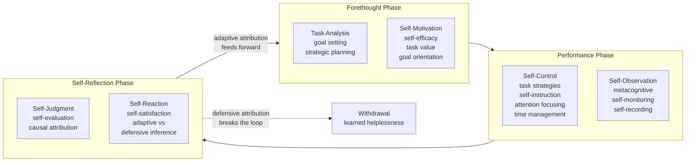

# 🧭 Self-Regulated Learning

> [!abstract] TL;DR
> **Self-regulated learning (SRL)** describes learners who are, in Zimmerman's phrase, **metacognitively, motivationally, and behaviorally active participants in their own learning** — they set goals, choose strategies, monitor their progress, and adapt when things stall, instead of passively absorbing material. Zimmerman models this as a **cyclical loop of three phases** — **forethought** (goal setting, planning, self-efficacy), **performance** (self-control and self-monitoring), and **self-reflection** (self-judgment, attribution, and adaptive reaction) — where reflection feeds forward into the next cycle. Winne & Hadwin recast the same process as an **information-processing feedback loop (COPES)** that continually compares performance against a standard. SRL is one of the strongest known predictors of academic achievement, and it can be **taught** through strategy instruction, modeling, and gradual release of responsibility.

---

## Intuition

**Analogy — the road trip with GPS versus flooring it blindly.** A self-regulated learner is like a driver who, *before* setting off, checks the map, picks a route, and estimates the arrival time; *while* driving, keeps one eye on the speedometer and the GPS and reroutes the moment traffic appears; and *after* arriving, reviews what slowed them down and updates the plan for next time. A passive learner is like someone who just points the car forward and stamps on the accelerator — no plan, no dashboard, no learning from the wrong turns. Both may spend the same hours on the road, but only one is actually *steering*.

The twist that makes learning special is that **you are simultaneously the driver and the car**. The dashboard you watch is your own understanding, the corrections you make are changes to how you study, and the "GPS" is your own metacognition. SRL is the skill of running that loop deliberately rather than drifting.

---

## How It Works

### The core claim

Barry Zimmerman defined self-regulated learners as those who are **metacognitively, motivationally, and behaviorally active** in their own learning. The word *and* is load-bearing: SRL is not one capacity but the **coordination of three** — knowing how to think about your thinking (metacognition), wanting to and believing you can (motivation), and actually deploying study tactics and managing your environment (behavior). Remove any leg and the loop collapses: a student who knows a strategy but doubts they can do it will not use it; one who is highly motivated but has no strategy burns effort for little gain.

Critically, SRL is **not a fixed trait** you either have or lack. It is a set of *processes* deployed on a *specific task in a specific context*, which is why it must be described as a cycle of actions rather than a personality score.

### Zimmerman's three cyclical phases

1. **Forethought (before the task).** Split into *task analysis* — **goal setting** (specific, proximal goals beat vague distal ones) and **strategic planning** (choosing how to attack the task) — and *self-motivation beliefs* — **self-efficacy** (belief you can succeed), outcome expectations, intrinsic **task value/interest**, and **goal orientation** (mastery vs. performance goals). Forethought sets the *standard* the rest of the loop will steer toward.
2. **Performance (during the task).** Split into *self-control* — **task strategies, self-instruction, imagery, attention focusing, time management, environmental structuring, and help-seeking** — and *self-observation* — **metacognitive self-monitoring** (Is this working? Am I on track?) and **self-recording** (tracking progress). This phase is where the plan meets reality and where feedback is generated.
3. **Self-reflection (after the task).** Split into *self-judgment* — **self-evaluation** (comparing outcome to the goal) and **causal attribution** (*why* did it go that way?) — and *self-reaction* — **self-satisfaction/affect** and **adaptive vs. defensive inferences**. This is the hinge: an **adaptive** attribution ("I used the wrong strategy" — controllable) sends a corrected plan into the next forethought phase, while a **defensive** one ("I'm just bad at this" — uncontrollable) triggers withdrawal and breaks the cycle.

Because self-reflection feeds forward into the next forethought phase, SRL is **cyclical, not linear** — each pass around the loop is a chance to get smarter about *how* you learn, not just *what* you learn.

### Winne & Hadwin's information-processing model (COPES)

Winne & Hadwin recast SRL as recursive **information processing**. Studying unfolds in four loosely-ordered phases — (1) *task definition*, (2) *goal-setting and planning*, (3) *enacting study tactics*, and (4) *metacognitive adaptation* — and each phase is built from the **COPES** architecture: **C**onditions (resources and constraints), **O**perations (the cognitive tactics applied), **P**roducts (what the operations generate), **E**valuations (feedback), and **S**tandards (the criteria a product should meet). **Monitoring is literally the comparison of a Product against its Standards**; the resulting discrepancy is an internal *error signal* that drives **control** (change the operations, the plan, or the standards). This is an explicitly **cybernetic** account — the same negative-feedback loop that governs a thermostat, now running inside the learner's head.

### Feedback loops, co-regulation, and socially-shared regulation

- **Feedback is the engine.** SRL runs on both *internal* feedback (self-generated monitoring) and *external* feedback (teacher, peer, or software). Good external feedback answers Hattie & Timperley's three questions: *Where am I going? How am I going? Where to next?*
- **Co-regulation** is the *temporary distribution* of regulation between a learner and a more capable other — a teacher scaffolds goal-setting or monitoring that the learner cannot yet do alone, then gradually hands it over. It is the Vygotskian bridge from **other-regulation → co-regulation → self-regulation**.
- **Socially-shared regulation (SSRL)** is when a *group* jointly regulates a shared task — negotiating shared goals, monitoring collective progress, and adapting together in collaborative learning. Regulation here is a property of the group, not just the individual.



*Trace the loop: goals set in forethought become the standard; performance generates monitoring data; reflection compares outcome to goal and, if the attribution is adaptive and controllable, sends a revised plan back into forethought. A defensive attribution short-circuits the cycle into disengagement.*

---

## Key Concepts

### Secondary (intuitive)

- **SRL = being the coach of your own studying.** Plan it, do it, check how it went, adjust — then go again.
- **Three phases:** *Before* (make a plan and psych yourself up), *During* (do the work and keep an eye on whether it's working), *After* (grade yourself and decide what to change).
- **Self-efficacy** = "I believe I can do this." It is the fuel: doubt it, and you never really try.
- The cycle **repeats** — each round you learn a bit more about how *you* learn best, so the wheel spins faster over time.

### Undergraduate (formal)

- **Zimmerman's three-phase cyclical model** with its forethought / performance / self-reflection sub-processes (above).
- **Metacognition** (Flavell): *metacognitive knowledge* (about tasks, strategies, and yourself) plus *metacognitive regulation* (planning, monitoring, evaluating). SRL embeds metacognition inside a *motivational and behavioral* loop rather than treating it in isolation.
- **Attribution theory** (Weiner): outcomes are attributed along *locus* (internal/external), *stability*, and *controllability*. Adaptive attributions (effort/strategy = internal, unstable, controllable) sustain the cycle; maladaptive ones (fixed ability = stable, uncontrollable) breed learned helplessness.
- **Goal orientation and goal type:** *mastery* vs. *performance* goals; specific **proximal** goals regulate behavior far better than vague **distal** goals because they give the monitoring loop a concrete reference standard.
- **Calibration:** the accuracy of self-monitoring — how well your confidence tracks your actual performance. Poor calibration (overconfidence) silently corrupts the whole loop.

### Graduate (models and dynamics)

- **Winne & Hadwin COPES** as a recursive information-processing / cybernetic model. Monitoring is a comparison $\Delta = \text{Standard} - \text{Product}$; the error signal $\Delta$ drives control, exactly like a negative-feedback controller. This makes SRL a *good-regulator* problem: effective self-regulation requires the learner to hold an accurate internal *model* of the task and of themselves.
- **Competing model families** (Panadero's synthesis): Zimmerman (social-cognitive, phase-based), **Boekaerts** (dual-processing / three-layered, emphasizing well-being and coping goals), **Winne & Hadwin** (information processing), and **Pintrich** (four-phase framework). They differ in emphasis but all reduce to *goal → enactment → monitoring → adaptation*.
- **Regulation is social:** the progression **self- → co- → socially-shared regulation** (Hadwin, Järvelä) extends the loop from the individual to the dyad and the group; SSRL is essentially *collective metacognition* in computer-supported collaborative learning.
- **The measurement problem:** SRL is a *dynamic event*, not a static aptitude. Self-report inventories (**MSLQ**, **LASSI**) capture beliefs but correlate weakly with real-time behavior; trace data, think-alouds, and microanalytic protocols capture the event but are costly. This aptitude-vs-event tension is a live methodological debate.

---

## Python Demo

```python
# Simulate the effect of self-regulation on learning outcomes.
# Two learners study the SAME set of skills (varying difficulty) over many cycles:
#   * PASSIVE learner  -> one fixed strategy, effort split evenly, never monitors.
#   * SELF-REGULATED   -> sets a mastery goal, monitors per-skill progress, switches
#                         strategy when a skill STALLS, and reallocates effort toward
#                         lagging, below-target skills (goal-directed control).
# We plot mean mastery per cycle and watch the two trajectories diverge.
import numpy as np
import matplotlib.pyplot as plt

rng = np.random.default_rng(7)

# --- Learning environment: a set of skills of varying difficulty ---
n_skills   = 6
n_cycles   = 30
difficulty = np.linspace(0.25, 0.9, n_skills)      # higher = harder to master

# Each skill has a hidden "best-fit" study strategy among K options.
# Using the matching strategy is highly effective; the others are weak.
K = 4
best_strategy = rng.integers(0, K, size=n_skills)  # unknown to the learner

def effectiveness(skill, strat):
    return 0.90 if strat == best_strategy[skill] else 0.35

base_rate = 0.6                                    # global learning-rate constant

def mastery_gain(mastery, skill, strat, effort):
    # diminishing returns near mastery=1; harder skills gain more slowly
    return (base_rate * effectiveness(skill, strat) * effort
            * (1.0 - mastery) * (1.0 - 0.5 * difficulty[skill]))

# ===================================================================
# PASSIVE learner: fixed strategy, uniform effort, no adaptation
# ===================================================================
def run_passive():
    mastery = np.zeros(n_skills)
    strat   = np.zeros(n_skills, dtype=int)        # strategy 0 for everything
    traj    = []
    for _ in range(n_cycles):
        effort = np.full(n_skills, 1.0 / n_skills) # even split, unchanging
        for i in range(n_skills):
            mastery[i] += mastery_gain(mastery[i], i, strat[i], effort[i])
        traj.append(mastery.mean())
    return np.array(traj)

# ===================================================================
# SELF-REGULATED learner: goals + monitoring + strategy switching +
# effort reallocation toward stalled, under-target skills
# ===================================================================
def run_self_regulated(target=0.85, stall=0.02):
    mastery = np.zeros(n_skills)
    strat   = rng.integers(0, K, size=n_skills)    # initial plan (forethought)
    tried   = [{int(strat[i])} for i in range(n_skills)]
    traj    = []
    for _ in range(n_cycles):
        # PERFORMANCE: concentrate effort where the gap to the goal is largest
        gap = np.clip(target - mastery, 0, None)
        effort = gap / gap.sum() if gap.sum() > 0 else np.full(n_skills, 1.0 / n_skills)
        for i in range(n_skills):
            g = mastery_gain(mastery[i], i, strat[i], effort[i])
            mastery[i] += g
            # MONITOR + REFLECT: if progress stalls while below target, attribute it
            # to a controllable cause (wrong strategy) and switch to an untried one
            if g < stall and mastery[i] < target and len(tried[i]) < K:
                choices  = [k for k in range(K) if k not in tried[i]]
                strat[i] = int(rng.choice(choices))
                tried[i].add(strat[i])
        traj.append(mastery.mean())
    return np.array(traj)

passive = run_passive()
srl     = run_self_regulated()

# --- Plot: cumulative (mean) mastery diverging over study cycles ---
cycles = np.arange(1, n_cycles + 1)
plt.figure(figsize=(10, 5))
plt.plot(cycles, passive, "o-", color="#C0392B", lw=2,
         label="Passive learner (fixed strategy, no monitoring)")
plt.plot(cycles, srl, "o-", color="#27AE60", lw=2,
         label="Self-regulated learner (goals + monitor + adapt)")
plt.xlabel("Study cycle")
plt.ylabel("Mean mastery across skills")
plt.title("Self-regulation compounds: monitoring & strategy-switching outpace fixed effort")
plt.ylim(0, 1)
plt.legend(loc="lower right")
plt.grid(alpha=0.3)
plt.tight_layout()
plt.show()

print(f"Passive learner  final mean mastery : {passive[-1]:.2f}")
print(f"Self-regulated   final mean mastery : {srl[-1]:.2f}")
print(f"Divergence (SRL advantage)          : {srl[-1] - passive[-1]:+.2f}")
```

Both learners spend identical total effort each cycle, yet the self-regulated curve pulls steadily above the passive one: by *monitoring* which skills stall, *switching* to the matching strategy, and *reallocating* effort toward the skills furthest from the goal, the regulated learner converts the same time into markedly more mastery. The gap widens over cycles — the compounding advantage that makes SRL such a strong predictor of achievement.

---

## Real-World Applications

- **Classroom strategy instruction.** Programs like **Self-Regulated Strategy Development (SRSD)** for writing teach students explicit routines for goal-setting, planning, monitoring, and revising — with reliably large effect sizes — via **modeling** and **gradual release of responsibility** ("I do → we do → you do").
- **Online learning, MOOCs, and self-directed study.** When external structure is stripped away, SRL becomes the single biggest predictor of completion. Low-structure environments *demand* strong self-regulation, and learning-analytics **dashboards** act as external feedback to scaffold monitoring for learners who cannot yet generate it alone.
- **Medical and professional education.** Reflective practice, learning portfolios, and **deliberate practice** are SRL cycles institutionalized — plan a case, perform, review, and feed lessons forward.
- **Adaptive learning software and intelligent tutoring systems.** Systems that prompt goal-setting, surface progress, and deliver timely feedback are engineering the SRL loop into the product.
- **Sport and music.** Zimmerman's own studies of dart-throwing, volleyball serving, and instrumental practice showed expert performers run tighter forethought–performance–reflection cycles (more specific goals, more self-monitoring, more strategic attributions) than novices.

---

## Common Pitfalls

- **Mistaking time-on-task for regulation.** Rereading notes for three hours *feels* productive because it builds fluency, but without monitoring it is passive. SRL is about the *quality* of regulation, not the *quantity* of study.
- **Poor calibration (illusions of competence).** Overconfident self-monitoring — "I've got this" when you don't — silently corrupts the loop, because the error signal that should trigger a strategy change never fires. Testing yourself calibrates better than restudying.
- **Defensive attribution.** Blaming failure on fixed ability or bad luck (uncontrollable) instead of strategy or effort (controllable) drains motivation and tips the learner into **learned helplessness**, breaking the cycle.
- **Teaching strategies without motivation (or vice versa).** A student who knows study tactics but has low self-efficacy will not deploy them; a motivated student with no tactics wastes energy. All three legs — metacognition, motivation, behavior — must be addressed together.
- **Treating SRL as a stable trait.** It is task- and domain-specific and context-dependent; it transfers poorly without *explicit* instruction, so "good students will just figure it out" leaves most learners behind.
- **Removing structure and assuming learners will self-regulate.** The classic failure of unsupported online courses: without scaffolding, co-regulation, or feedback, most learners lack the SRL to fill the gap and disengage.
- **Vague, distal goals.** "Do well this term" gives the monitoring loop nothing concrete to compare against; specific proximal goals ("summarize section 3 from memory tonight") make monitoring possible.

---

## Related Concepts

- [[Metacognition_and_Thinking_About_Thinking]] — the monitoring-and-control core that SRL wraps in motivation and behavior; SRL is metacognition operationalized as a repeating learning cycle.
- [[Motivation_and_Learning]] — self-efficacy, task value, and goal orientation are the fuel of the forethought phase; without motivation the regulation loop never starts or persists.
- [[Goal_Setting]] — specific, proximal goals are the *reference standard* against which the self-monitoring loop measures progress and computes the discrepancy that drives adaptation.
- [[Feedback_Loops_and_Causality]] — SRL is a **balancing feedback loop**: self-monitoring compares output to a goal and drives corrective control; delayed or absent feedback makes the loop overshoot or fail.
- [[Cybernetics_and_Control]] — Winne & Hadwin's COPES model is an explicit cybernetic account (measure → compare to standard → correct the error); the Good Regulator Theorem explains why a self-regulated learner needs an accurate internal model of the task.
- [[Observational_Learning]] — Zimmerman was Bandura's doctoral student; SRL rests on Bandura's **self-efficacy** construct and is developed by watching *coping models* demonstrate self-regulation, then imitating.

---

## Review Questions

1. **(Conceptual)** Name Zimmerman's three cyclical phases and one key sub-process of each. Explain *why* the model is described as cyclical rather than linear, and identify the single sub-process that decides whether the cycle continues to improve or collapses.
2. **(Scenario)** A student studies three hours every night by rereading notes and highlighting, yet keeps failing exams. Using the forethought / performance / self-reflection framework, diagnose which SRL processes are missing and prescribe one concrete intervention for each phase.
3. **(Trade-off / graduate)** Contrast Zimmerman's cyclical-phase model with Winne & Hadwin's COPES model. In what situations is each framing more useful, and explain how *both* ultimately reduce to a negative-feedback control loop. What does the "good regulator" idea imply about why accurate self-monitoring (calibration) is indispensable?

---

## Sources

- Zimmerman, B. J. (2002). "Becoming a Self-Regulated Learner: An Overview." *Theory Into Practice*, 41(2), 64–70.
- Zimmerman, B. J. (2000). "Attaining Self-Regulation: A Social Cognitive Perspective." In M. Boekaerts, P. R. Pintrich, & M. Zeidner (Eds.), *Handbook of Self-Regulation* (pp. 13–39). Academic Press.
- Winne, P. H., & Hadwin, A. F. (1998). "Studying as Self-Regulated Learning." In D. J. Hacker, J. Dunlosky, & A. C. Graesser (Eds.), *Metacognition in Educational Theory and Practice* (pp. 277–304). Erlbaum.
- Panadero, E. (2017). "A Review of Self-Regulation Models: Zimmerman, Boekaerts, Winne & Hadwin, Pintrich, and Efklides." *Frontiers in Psychology*, 8, 422.
- Hadwin, A. F., Järvelä, S., & Miller, M. (2018). "Self-Regulation, Co-Regulation, and Shared Regulation in Collaborative Learning." In D. H. Schunk & J. A. Greene (Eds.), *Handbook of Self-Regulation of Learning and Performance* (2nd ed.). Routledge.

---

#learning-science #self-regulated-learning #zimmerman #metacognition #self-regulation
