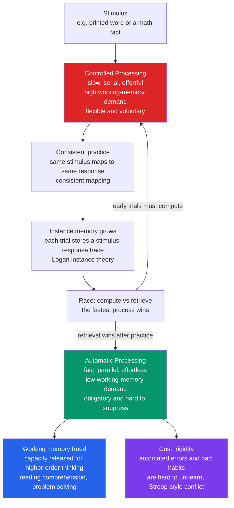

# ⚡ Automaticity and Procedural Fluency

> [!abstract] TL;DR
> **Automaticity** is what a skill becomes when enough practice makes it run *fast, effortlessly, and without conscious attention* — reading a word, touch-typing, recalling that 7×8 is 56. Automatic processes have a signature cluster of properties (Shiffrin & Schneider): they are **fast, parallel, effortless, involuntary/obligatory, and cost almost no working memory**, in contrast to slow, serial, effortful, capacity-limited **controlled** processing. Automaticity develops only under **consistent mapping** — the same stimulus reliably calling for the same response — and Logan's **instance theory** explains it as a shift *from computing an answer to remembering it*. Its enormous payoff is that it **frees working memory for higher-order thinking**: automatic decoding is what lets a reader comprehend, and automatic arithmetic is what lets a student solve multi-step problems. Its price is **rigidity** — an automated skill is hard to suppress or change, as the **Stroop effect** proves every time a fluent reader cannot *not* read a word.

## Intuition

**Analogy: try to look at a word in your own language and *not* read it.**

You can't. The instant your eyes land on "TABLE," the meaning is already in your head — no decision, no effort, no way to switch it off. Contrast that with a word in a script you're just starting to learn: there you must consciously decode letter by letter, slowly, and it takes your full attention. Same eyes, same page — completely different mental machinery.

That gap *is* automaticity. Early in learning, a skill runs on **controlled processing**: deliberate, sequential, attention-hungry, and easy to derail. After thousands of consistent repetitions, the very same skill runs on **automatic processing**: instant, parallel, attention-free, and almost impossible to stop. The Stroop effect weaponizes this — when the word "RED" is printed in blue ink and you're asked to name the *ink color*, your automatic reading fights your controlled color-naming and slows you down. You are watching automaticity refuse to be turned off.

---

## How It Works

### Core mechanics

Automaticity is not a separate faculty; it is the *end state* of a practiced process. The transition has a consistent structure:

1. **Start with controlled processing.** A novel or inconsistent task is executed by a slow, serial, effortful algorithm that runs *inside working memory*. Every step competes for the same tiny capacity, so the task is fragile: interrupt it, add a second task, or increase the load, and performance craters.
2. **Practice under consistent mapping.** Automaticity only develops when the stimulus-to-response mapping is **consistent** — the same input always demands the same output (a letter always maps to the same sound; a target digit is *always* a target, never a distractor). Under **varied mapping**, where today's target is tomorrow's distractor, no amount of practice produces automaticity: the search stays slow and serial (Schneider & Shiffrin, 1977).
3. **Accumulate memory traces.** Each consistent encounter lays down a stored *instance* linking the stimulus to its response. Over trials, the store fills with retrievable answers.
4. **Shift from computing to retrieving.** Performance becomes a *race* between the slow general algorithm and fast direct retrieval of a stored instance. Early on, computation usually wins because there is little to retrieve. As instances pile up, retrieval reliably beats computation, and the skill becomes automatic (Logan's **instance theory**, 1988). Because the answer is now *remembered rather than worked out*, it arrives fast, demands no working memory, and fires involuntarily.

The result is a process with the classic **automatic signature**: fast, parallel (multiple automatic processes run at once without mutual interference), effortless (near-zero working-memory cost), **obligatory** (it launches whether or not you want it to), and hard to modify. Controlled processing is the mirror image: slow, serial, capacity-limited, voluntary, and flexible.

### Why it matters: automaticity frees working memory

Working memory is the bottleneck of thinking (see [[Cognitive_Load_and_Learning]]). A controlled skill occupies that bottleneck; an automatic one bypasses it. This is the whole reason automaticity is central to learning:

- **Reading comprehension** requires automatic word *decoding*. If a reader must consciously sound out each word, working memory is spent on decoding and there is nothing left to build meaning (LaBerge & Samuels, 1974). Only when decoding is automatic can attention flow to comprehension.
- **Mathematical problem-solving** requires automatic *arithmetic facts*. A student who must compute 7×8 from scratch mid-problem loses the thread; automatic recall of the fact keeps working memory free for the multi-step reasoning.

Automaticity converts what was once crushing intrinsic load into a single free-running chunk — the same task that overwhelms a novice is trivial for an expert not because the expert has more capacity, but because most of the task no longer consumes any.

### The cost side

Obligatoriness cuts both ways. Because an automatic process runs without permission, it also runs when it is *wrong*: **automated errors and bad habits are hard to change**, an automatic solution can blind you to a better one (**Einstellung** / expertise-induced blindness), and a fluent expert may skip the very step where the anomaly lived. Automaticity buys speed at the cost of flexibility.



---

## Key Concepts

### Secondary (intuitive level)

- **Automatic skills run themselves.** Reading, touch-typing, and recalling times-table facts happen instantly, without effort, and without you "thinking about how."
- **You can't switch reading off.** Look at a familiar word and you have already read it — proof that a well-practiced skill becomes involuntary.
- **Practice is the difference.** A skill starts slow, effortful, and one-step-at-a-time; enough consistent repetition turns it fast and effortless.
- **Automatic skills free your mind.** Because reading and basic arithmetic run by themselves, your attention is free for the harder work of understanding and solving.

### Undergraduate (mechanistic level)

- **Two modes of processing (Shiffrin & Schneider, 1977).** *Controlled*: slow, serial, effortful, voluntary, capacity-limited, flexible. *Automatic*: fast, parallel, effortless, involuntary/obligatory, low working-memory load, resistant to change. These are ends of a continuum, not a binary switch.
- **Consistent vs varied mapping.** Automaticity develops *only* under **consistent mapping** (stimulus-response relations stable across practice). Under **varied mapping** the task stays controlled and serial — search time keeps scaling with set size no matter how much you practice. This is the diagnostic test for whether a skill *can* automate.
- **The Stroop effect (Stroop, 1935).** Naming the ink color of a color word is slowed when word and color conflict ("RED" in blue ink) because skilled reading is so automatic that word meaning is processed *involuntarily* and intrudes on the controlled color-naming task. It is the canonical demonstration of **obligatory** automaticity — and it barely appears in pre-readers, confirming that the interference is a *product of practice*.
- **Power law of practice (Newell & Rosenbloom, 1981).** Reaction time drops as a power function of the number of trials: fast at first, then diminishing returns, approaching an irreducible floor. Plotted log-log it is a straight line.
- **Why it matters for learning.** Automaticity releases working memory (see [[Working_Memory_and_Cognitive_Load]]): automatic decoding enables comprehension, automatic arithmetic enables problem-solving. Fluency in the low-level skill is a *prerequisite* for the high-level skill.

### Graduate (theoretical level)

- **Logan's instance theory of automatization (1988).** Automatization is a shift from a general **algorithm** (computation) to **memory retrieval** of stored instances. Each encounter deposits a separate trace; performance is a race between computing the answer and retrieving the fastest stored instance. As the number of instances grows, the *minimum* retrieval time over many samples shrinks — and the mathematics of the minimum of many random draws produces exactly the empirical **power-law speedup**. The theory elegantly predicts automaticity's speed, its item-specificity (automaticity attaches to *practiced items*, not the whole task), and its obligatoriness (retrieval is itself automatic).
- **Fluency and its measurement.** Fluency is *rate combined with accuracy* — correct responses per minute, not accuracy alone. A student can be 100% accurate yet non-fluent (accurate-but-slow means the skill is still controlled). Curriculum-Based Measurement (oral reading fluency in words-correct-per-minute) and Precision Teaching operationalize fluency as the true index of automaticity, distinguishing "can do it" from "does it without thinking."
- **The automaticity-flexibility trade-off.** Over-automatization reduces adaptability: **Einstellung** (mechanization of thought), functional fixedness, and expertise-induced blindness all arise when an automatic routine fires where a controlled, flexible response was needed. Expertise therefore requires retaining *metacognitive control* — the ability to *deautomatize* and re-engage controlled processing when the situation is novel or the default is wrong.
- **Building automaticity deliberately.** *Overlearning* (continued practice past the point of first mastery), *fluency drills* (timed practice targeting a rate criterion), math-fact and sight-word practice, all under **consistent mapping** and typically distributed over time (see [[Spaced_Repetition_and_the_Spacing_Effect]]). The sequencing rule is strict: **accuracy first, then speed** — drilling for speed on a shaky procedure automatizes the error.

---

## Python Demo

```python
# numpy + matplotlib only.
# Simulates the DEVELOPMENT OF AUTOMATICITY and its two signatures:
#   (A) POWER LAW OF PRACTICE  -- reaction time falls as a power function of trials.
#   (B) DUAL-TASK IMMUNITY     -- a concurrent task hugely slows a CONTROLLED skill
#                                 but barely touches an AUTOMATIC one, because an
#                                 automatic skill no longer consumes working memory.
#   (C) STROOP INTERFERENCE    -- as reading becomes automatic (obligatory), an
#                                 incongruent word intrudes on colour naming; a
#                                 pre-reader shows ~0 interference, a fluent reader
#                                 cannot suppress it.
import numpy as np
import matplotlib.pyplot as plt

# ------------------------------------------------------------------
# (A) Power law of practice:  RT(n) = A + B * n**(-alpha)
#     A     = irreducible floor (perception + motor), cannot be trained away
#     B     = the trainable controlled-processing component
#     alpha = learning-rate exponent
# ------------------------------------------------------------------
n = np.arange(1, 2001)                      # practice trials
A, B, alpha = 300.0, 950.0, 0.32
rt_single = A + B * n**(-alpha)             # single-task reaction time (ms)

# ------------------------------------------------------------------
# (B) Dual-task cost. A concurrent task competes for working memory. The
#     interference is proportional to how much WM the primary task STILL uses,
#     which is exactly its remaining controlled component B*n^-alpha. As the
#     skill automatizes, that demand -> 0, so the dual-task cost vanishes.
# ------------------------------------------------------------------
wm_demand = B * n**(-alpha)                 # residual controlled-processing demand
gamma = 0.9                                 # how hard the second task bites
dual_cost = gamma * wm_demand               # extra ms under concurrent load
rt_dual = rt_single + dual_cost

# ------------------------------------------------------------------
# (C) Stroop interference grows with reading automaticity.
#     reading_auto saturates with print exposure; the Stroop cost
#     (incongruent minus neutral RT) scales with it.
# ------------------------------------------------------------------
exposure = np.linspace(0.0, 1.0, 200)               # cumulative reading practice
reading_auto = 1.0 - np.exp(-4.5 * exposure)        # automaticity saturates
max_conflict = 190.0                                # peak word/colour conflict (ms)
stroop_cost = max_conflict * reading_auto           # incongruent - neutral (ms)

# ------------------------------------------------------------------
# Console summary
# ------------------------------------------------------------------
for trial in (1, 10, 100, 1000):
    i = trial - 1
    print(f"Trial {trial:>5}: single={rt_single[i]:6.1f} ms  "
          f"dual={rt_dual[i]:6.1f} ms  dual-task cost={dual_cost[i]:6.1f} ms")
print(f"Stroop interference -- pre-reader: {stroop_cost[0]:5.1f} ms   "
      f"fluent reader: {stroop_cost[-1]:5.1f} ms")

# ------------------------------------------------------------------
# Plots
# ------------------------------------------------------------------
fig, ax = plt.subplots(1, 3, figsize=(16, 4.6))

# Panel A: power law of practice (log-log => straight line for the trainable part)
ax[0].loglog(n, rt_single - A, color="#2563eb", lw=2)
ax[0].set_title("Power law of practice\n(controlled component vs trials, log-log)")
ax[0].set_xlabel("Practice trials (log)")
ax[0].set_ylabel("Trainable RT above floor (log, ms)")
ax[0].grid(alpha=0.3, which="both")

# Panel B: dual-task cost collapses as the skill automatizes
ax[1].plot(n, rt_single, color="#059669", lw=2, label="Single task")
ax[1].plot(n, rt_dual,   color="#dc2626", lw=2, label="Dual task (under load)")
ax[1].fill_between(n, rt_single, rt_dual, color="#dc2626", alpha=0.12,
                   label="Dual-task cost (controlled -> automatic)")
ax[1].set_title("Automaticity buys dual-task immunity")
ax[1].set_xlabel("Practice trials")
ax[1].set_ylabel("Reaction time (ms)")
ax[1].legend(fontsize=8)
ax[1].grid(alpha=0.3)

# Panel C: Stroop interference emerges as reading becomes obligatory
ax[2].plot(exposure, stroop_cost, color="#7c3aed", lw=2)
ax[2].set_title("Stroop interference is a PRODUCT of automaticity")
ax[2].set_xlabel("Reading practice / print exposure")
ax[2].set_ylabel("Stroop cost: incongruent - neutral (ms)")
ax[2].annotate("pre-reader:\nno interference", xy=(0.02, 8), fontsize=8)
ax[2].annotate("fluent reader:\ncannot suppress reading", xy=(0.42, 120), fontsize=8)
ax[2].grid(alpha=0.3)

plt.tight_layout()
plt.savefig("automaticity.png", dpi=150)
print("Saved automaticity.png")
```

**What the demo shows.** **Panel A** is the *power law of practice*: subtract the irreducible floor `A` and the trainable part of reaction time falls as a straight line on log-log axes — huge early gains, then diminishing returns. **Panel B** is the payoff: early on, adding a concurrent task inflates reaction time massively (the red gap), because the still-controlled skill is fighting the second task for working memory; after enough practice the skill automatizes, its working-memory demand approaches zero, and the two curves converge — the automatic skill has become **immune to dual-task interference**. **Panel C** flips automaticity's virtue into its cost: for a pre-reader, reading is not yet automatic, so an incongruent color word causes ~0 Stroop interference; as reading automatizes, word meaning is extracted *involuntarily* and the Stroop cost climbs toward its ceiling. The very property that frees working memory (obligatory, effort-free reading) is the property that makes reading impossible to suppress.

---

## Real-World Applications

- **Reading instruction.** The whole point of phonics-to-fluency progression is to make word recognition automatic. Oral reading fluency drills, repeated reading, and sight-word practice push decoding below conscious effort so working memory is available for comprehension (LaBerge & Samuels).
- **Mathematics education.** Math-fact fluency (times tables, number bonds) via timed drills and distributed practice frees working memory for multi-step problem-solving; students without automatic facts stall on the arithmetic and lose the reasoning thread.
- **Touch-typing, music, and sport.** Scales, drills, and repetition automate finger and motor patterns so the performer's attention is free for expression, tactics, or the next note — not the mechanics.
- **Aviation, medicine, and the military.** Emergency procedures and checklists are *overlearned* so they execute reliably under stress and cognitive overload, when controlled processing is the first thing to fail.
- **Expert tooling.** Vim/IDE keyboard shortcuts and command sequences become muscle memory; the expert's attention stays on the problem, not on how to move the cursor. This is consistent-mapping automaticity in a professional workflow.

---

## Common Pitfalls

- **Automating the error.** Practicing a flawed technique makes the *flaw* automatic and painful to unlearn — bad grip, wrong fingering, a buggy mental algorithm. The rule is **accuracy first, then speed**: never drill for fluency on a procedure you cannot yet do correctly.
- **Speed without accuracy.** Timed drills on shaky accuracy cement mistakes at high rate. Fluency is *rate combined with accuracy*, not raw speed; measure both.
- **Expecting automaticity under varied mapping.** If the stimulus-response mapping keeps changing (today's target is tomorrow's distractor), the task cannot automate no matter how much you practice — it stays slow and serial. Only consistent mapping automatizes.
- **Einstellung and expertise-induced blindness.** An automatic routine fires even when a novel situation demands a different, better response. Over-automatized experts skip the very step where the anomaly hides. Retaining metacognitive control — the ability to *deautomatize* on purpose — is part of real expertise.
- **Mistaking fluency for full understanding.** A student can recall a fact automatically without grasping *why* it is true. Automaticity of a procedure is necessary but not sufficient; it frees capacity for understanding, it does not create it.
- **Confusing "can do it" with "does it automatically."** Accurate-but-slow performance still consumes working memory. If the sub-skill is not yet automatic, it will collapse the moment the higher-order task adds load — exactly when you need it most.

---

## Related Concepts

- [[Cognitive_Load_and_Learning]] — automaticity is the mechanism that *closes the loop* in Cognitive Load Theory: it converts former intrinsic load into a free-running chunk, releasing working memory for germane processing.
- [[Working_Memory_and_Cognitive_Load]] — the capacity bottleneck that automatic processing bypasses; the entire payoff of automaticity is measured against this limit.
- [[Dual_Process_Theory]] — the System 1 / System 2 framing generalizes the same controlled-versus-automatic distinction into reasoning and judgment; automatic reading is a paradigm System 1 process.
- [[Attention_and_Selection]] — automatic processes launch *without* attentional selection and are hard to gate out, which is precisely why the Stroop word intrudes on color naming.
- [[Long_Term_Memory_Systems]] — Logan's instance theory grounds automatization in memory *retrieval*; the stored instances that win the compute-versus-retrieve race live in long-term memory.
- [[Attention_and_Cognitive_Load]] — the cognitive-psychology view of how limited attention is spent, and how automaticity reduces the attentional cost of a practiced task.
- [[Problem_Solving_and_Insight]] — automatic sub-skills (arithmetic facts, syntax) are the freed capacity that higher-order problem-solving depends on; over-automatization also produces the Einstellung effect studied here.
- [[Spaced_Repetition_and_the_Spacing_Effect]] — the practice schedule that builds durable automaticity most efficiently; overlearning and fluency drills work best when distributed rather than massed.

---

## Review Questions

**Tier 1 — Recall / Comprehension**
1. List the defining properties of *automatic* processing and contrast each with *controlled* processing. Why is "obligatory" the property the Stroop effect demonstrates?
2. Explain, in one or two sentences, why automatic word decoding is a *prerequisite* for reading comprehension rather than just a nice-to-have.

**Tier 2 — Application**
3. A teacher notices students can compute single-digit multiplication accurately but "fall apart" on word problems that require several such computations. Diagnose the problem in terms of automaticity and working memory, and prescribe a specific practice regimen — being explicit about the accuracy-then-speed ordering.
4. Using the demo's model, a skill has been practiced 10 times versus 1000 times. Predict what happens to its reaction time under a concurrent secondary task at each point, and explain the mechanism behind the shrinking dual-task cost.

**Tier 3 — Analysis / Synthesis**
5. Logan's instance theory claims automatization is a shift "from computation to retrieval." Use this single idea to explain three separate empirical facts at once: (a) the power-law shape of the speed-up, (b) why automaticity is *item-specific* rather than a global change, and (c) why an automatic response is involuntary.
6. Automaticity frees working memory but creates rigidity (Einstellung, expertise-induced blindness). Design a training approach for a domain of your choice (e.g., emergency medicine or aviation) that captures the working-memory benefit of automaticity while preserving the ability to *deautomatize* when a situation is novel. What signal tells the expert to switch back to controlled processing?

---

## Sources

- Shiffrin, R. M., & Schneider, W. (1977). "Controlled and automatic human information processing: II. Perceptual learning, automatic attending, and a general theory." *Psychological Review*, 84(2), 127–190.
- Schneider, W., & Shiffrin, R. M. (1977). "Controlled and automatic human information processing: I. Detection, search, and attention." *Psychological Review*, 84(1), 1–66. (Consistent vs varied mapping.)
- Logan, G. D. (1988). "Toward an instance theory of automatization." *Psychological Review*, 95(4), 492–527.
- LaBerge, D., & Samuels, S. J. (1974). "Toward a theory of automatic information processing in reading." *Cognitive Psychology*, 6(2), 293–323.
- MacLeod, C. M. (1991). "Half a century of research on the Stroop effect: An integrative review." *Psychological Bulletin*, 109(2), 163–203. (See also Stroop, J. R., 1935.)
- Newell, A., & Rosenbloom, P. S. (1981). "Mechanisms of skill acquisition and the law of practice." In *Cognitive Skills and Their Acquisition* (Anderson, Ed.).

---

#learning-science #automaticity #procedural-fluency #stroop #dual-task
