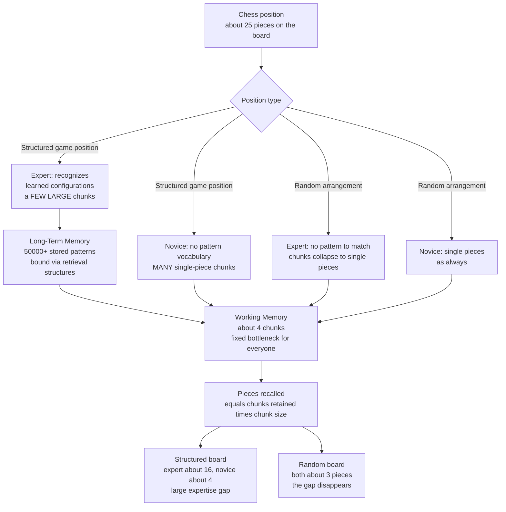

# ♟️ Chunking and Mental Models in Expertise

> [!abstract] TL;DR
> Working memory can hold only about **four** new units at once, yet experts routinely juggle far more than four elements of their craft. The trick is **chunking**: grouping many low-level elements into a single meaningful unit, so one working-memory slot now carries a whole configuration. The classic chess studies (**de Groot; Chase & Simon, 1973**) proved this is *pattern-based*, not raw memory — masters reconstruct a real game position far better than novices, but that advantage **vanishes** on a random board where no meaningful patterns exist. Expertise, on this view, is not a bigger memory but a vast **library of learned patterns** (estimates of 50,000+ for chess) plus the **retrieval structures** (Chase & Ericsson's *skilled memory* and Ericsson & Kintsch's *long-term working memory*) that let long-term memory act as an extension of the tiny workspace. Sophisticated internal **mental representations** are therefore the engine of expert perception, planning, and monitoring — and because they are painstakingly **domain-specific**, they transfer poorly and must be *built* through years of deliberate practice.

## Intuition

**Analogy: reading a sentence versus reading a scrambled one.**

Show a fluent English reader the sentence *"the quick brown fox jumps"* for five seconds and they will reproduce all 24 letters effortlessly — they did not memorize 24 letters, they recognized **five words**, and each word is a single chunk pulled from a lifetime of reading. Now scramble the same letters into *"xhfoej tkbporwuiqmnus"* and give them five seconds again: the very same person, with the very same eyes and the very same memory, now stumbles at four or five letters — exactly where a non-reader would land.

Nothing about their raw memory changed between the two trials. What changed is whether the input **matched patterns already stored in their head**. That is the entire story of expert memory in a nutshell: a chess master is a "fluent reader" of legal chess positions, and a random board is that master's scrambled sentence.

---

## How It Works

### Core mechanics

1. **The bottleneck.** Working memory holds only a handful of novel units — Miller's famous "seven plus or minus two," reinterpreted by Cowan as closer to **four chunks** of genuinely new information. This limit is stubborn and roughly the same for everyone. Experts do **not** have a bigger workspace.
2. **The chunk is the unit, not the element.** Miller's deep insight (1956) was that capacity is measured in *meaningful units*, not raw items. "F-B-I-C-I-A" is six letters but two chunks. Recoding elements into higher-order units is the only way past the bottleneck, and it is free capacity: a retrieved chunk enters working memory as **one slot** no matter how much internal detail it packs.
3. **Expertise = a huge pattern vocabulary.** Through years of exposure and practice, an expert accumulates an enormous store of domain patterns in long-term memory. For chess, Simon estimated on the order of **50,000 patterns** — comparable to a literate adult's recognition vocabulary. Perceiving a position becomes an act of *recognition*: the board decomposes into a few familiar formations (a castled-king shelter, a pawn chain, a known tactical motif) rather than 25 unrelated pieces.
4. **The de Groot / Chase & Simon experiments.** De Groot (1946) noticed masters and amateurs searched *similar* numbers of moves, so raw calculation did not separate them — but masters instantly *saw* the right candidate moves. Chase & Simon (1973) isolated the mechanism with a recall task: after a **5-second** glance at a board, masters replaced ~16 of ~25 pieces correctly, class-A players ~8, beginners ~4. The killer control: on **random** board positions, *all three groups collapsed to ~3 pieces*. The master's advantage was not memory capacity — it was pattern matching, and it evaporated when the patterns were gone.
5. **Skilled memory and retrieval structures.** Chase & Ericsson (studying digit-span experts) found that skilled memorizers do not merely chunk — they build **retrieval structures**: pre-learned scaffolds (like a memorized set of "slots" or a familiar route) onto which incoming information is *deliberately encoded* so it can be *reliably retrieved later* from long-term memory. Encoding is slower than the seconds working memory needs, but retrieval becomes fast and durable.
6. **Long-term working memory (Ericsson & Kintsch, 1995).** Generalizing skilled memory, they argued that within their domain experts use **long-term memory as a functional extension of working memory**. Because information is bound to well-practiced retrieval structures, an expert can hold in play far more than four items, resist interruption, and resume without loss — a skilled reader keeps the whole narrative available, a physician the whole patient. The four-slot limit still governs *novel* material, but not richly *structured, familiar* material.
7. **Template theory (Gobet & Simon, 1996).** Pure chunks (a handful of pieces) were too small to explain grandmaster feats and their sensitivity to whole-board structure. Templates are **large, schema-like chunks with variable "slots"** — a stereotyped configuration (say, a King's Indian pawn structure) whose fixed core is stored in long-term memory while a few open slots are filled rapidly with the specifics of *this* game. Templates bridge small perceptual chunks and full **mental models / schemas**.
8. **Representations as the core of expertise (Ericsson).** All of the above converges on one claim: what an expert really possesses is a set of increasingly **sophisticated mental representations** of their domain. These representations do triple duty — they drive **rapid pattern recognition** (seeing the right move), they enable **planning** (mentally running variations), and they support **self-monitoring** (noticing when something is off). Building better representations is what deliberate practice *is for*.
9. **How chunks form.** Chunks are grown, not given: repeated co-occurrence of elements under attention and feedback binds them into a unit, which is then recognized as a whole on future encounters (an incremental process EPAM/CHREST models simulate as discrimination-net node growth). Meaningful, well-structured practice accelerates this; rote exposure without engagement does not.
10. **Domain-specificity and weak transfer.** Because a chunk vocabulary is stitched to the statistical regularities of *one* domain, it is nearly useless elsewhere. A chess master has no memory edge for random boards, digit strings, or Go positions. Expertise is stubbornly **local** — which is precisely why there is no shortcut around the thousands of hours needed to build a new domain's representations.

### Flow: why experts win on real boards but not random ones



---

## Key Concepts

### Secondary (intuitive level)

- Your mind can only hold a few new things at once, but you can beat that limit by **grouping** things into meaningful bundles ("chunks").
- Experts are not born with better memories — they have seen so many patterns in their field that a complex scene looks *simple* to them, the way words look simple to a reader.
- Proof: a chess master remembers a real game board far better than a beginner, but if you scatter the pieces randomly, the master does **no better than anyone else**.
- This is why skill is so **specific**: being great at chess does nothing for your memory of phone numbers or a random photo.

### Undergraduate (mechanistic level)

- **Miller (1956):** capacity is measured in *chunks*, not raw items; recoding is the escape hatch from the ~7 (really ~4) limit.
- **de Groot / Chase & Simon (1973):** the recall-and-random-control paradigm dissociates *pattern recognition* from *raw memory*. Structured advantage large; random advantage ~zero. This is the load-bearing empirical result of the whole field.
- **Skilled memory theory (Chase & Ericsson):** experts encode with **meaningful associations** to prior knowledge, using **retrieval structures**, with **speed-up** over practice. Demonstrated by the digit-span runner SF who reached a span of ~80 digits by mapping them to running times.
- **Chunk vs template:** a *chunk* is a small recognized unit (a few pieces); a **template (Gobet & Simon)** is a large schema-like structure with fixed core plus fillable **slots**, explaining grandmaster whole-board memory.
- **Expertise is domain-specific:** the pattern store is tuned to one domain's regularities, so **transfer is minimal** and skill must be rebuilt from scratch elsewhere.

### Graduate (theoretical level)

- **Long-term working memory (Ericsson & Kintsch, 1995):** a formal challenge to the classic view that WM is a fixed small buffer. For skilled activities in familiar domains, encoded information in LTM stays **rapidly and reliably accessible** via retrieval cues held in short-term memory, so effective working capacity is expanded selectively. Explains resistance to interruption and expert text comprehension, chess blindfold play, and mental calculation.
- **Computational models:** EPAM and its successor **CHREST (Gobet)** implement chunking and templates as growth of a discrimination network, quantitatively reproducing recall-by-skill and the structured-vs-random dissociation, plus eye-movement data — a rare case where a cognitive theory is executable and fit to piece-level data.
- **The representation thesis (Ericsson):** superior performance is mediated by acquired, task-specific **mental representations** that integrate perception, memory, and control; these are the mechanism by which **deliberate practice** produces expertise. This reframes "talent" debates around the *quality of representations built*, not fixed capacity — though the strength of the deliberate-practice claim (how much variance it explains) remains actively contested (Macnamara et al. meta-analyses).
- **Boundary conditions and critiques:** template/LTWM accounts are strongest in stable, well-structured domains (chess, medicine, music) and weaker where environments are dynamic or feedback is poor; not all expert advantages reduce to chunk count (attention allocation, higher-order strategy, and metacognition also differ). Chunking explains *memory* signatures better than it fully explains *decision quality*.

---

## Python Demo

```python
# Reproduce the Chase & Simon (1973) chess-memory dissociation.
#
# Setup: after a ~5 s glance at a board of ~25 pieces, a viewer reconstructs
# it from memory. The ONLY thing expertise changes is AVERAGE CHUNK SIZE --
# how many pieces the viewer folds into a single working-memory unit:
#
#   * a MASTER parses a real game position into a few LARGE meaningful chunks
#   * a NOVICE sees near-isolated pieces (chunk size ~1)
#
# Crucially, chunking needs MEANING. On a RANDOM board no legal configuration
# exists, so even the master's chunk size COLLAPSES toward one piece -- and the
# expertise advantage must vanish. That collapse is the whole point of the study.
#
# Model: pieces_recalled = sum of sizes of the (few) chunks that fit in working
# memory, capped at the number of pieces on the board. Accuracy = recalled / total.

import numpy as np
import matplotlib.pyplot as plt

rng = np.random.default_rng(7)

TOTAL_PIECES = 25      # pieces on a realistic middlegame board
WM_CAPACITY  = 4.0     # meaningful CHUNKS held in working memory (Cowan's ~4)
N_TRIALS     = 4000

# Average pieces-per-chunk for each (group, stimulus). This single knob encodes
# the entire theory: expertise buys big chunks ONLY when meaningful patterns exist.
chunk_size_mean = {
    ("Expert", "Structured"): 4.0,    # recognizes learned patterns -> big chunks
    ("Expert", "Random"):     1.10,   # no pattern to exploit -> chunks collapse
    ("Novice", "Structured"): 1.15,   # almost no vocabulary -> piece-by-piece
    ("Novice", "Random"):     1.05,   # essentially isolated pieces
}

def recall_accuracy(group, stimulus):
    mu = chunk_size_mean[(group, stimulus)]
    # Chunks actually retained: working-memory capacity with modest trial noise.
    n_chunks = np.clip(np.round(rng.normal(WM_CAPACITY, 0.8, N_TRIALS)), 1, None).astype(int)
    acc = np.empty(N_TRIALS)
    for t in range(N_TRIALS):
        # Each chunk grabs >= 1 piece; excess above 1 is Poisson around the mean.
        sizes = 1 + rng.poisson(mu - 1.0, size=n_chunks[t])
        recalled = min(TOTAL_PIECES, int(sizes.sum()))
        acc[t] = recalled / TOTAL_PIECES
    return acc

groups = ["Expert", "Novice"]
stimuli = ["Structured", "Random"]
results = {(g, s): recall_accuracy(g, s) for g in groups for s in stimuli}

means = {k: v.mean() for k, v in results.items()}
sems  = {k: v.std() / np.sqrt(N_TRIALS) for k, v in results.items()}

# --- Console summary: the dissociation in numbers ---
print("Mean recall accuracy (pieces correct / 25):")
for s in stimuli:
    e, n = means[("Expert", s)], means[("Novice", s)]
    print(f"  {s:11s}  Expert {e:5.2f} ({e*TOTAL_PIECES:4.1f} pieces)   "
          f"Novice {n:5.2f} ({n*TOTAL_PIECES:4.1f} pieces)   gap {e-n:+.2f}")

# --- Grouped bar chart: expertise gap present for structured, gone for random ---
x = np.arange(len(stimuli))
width = 0.35
fig, ax = plt.subplots(figsize=(8, 5))

exp_means = [means[("Expert", s)] for s in stimuli]
nov_means = [means[("Novice", s)] for s in stimuli]
exp_err   = [sems[("Expert", s)]  for s in stimuli]
nov_err   = [sems[("Novice", s)]  for s in stimuli]

ax.bar(x - width/2, exp_means, width, yerr=exp_err, capsize=4,
       color="#2563eb", label="Expert (chess master)")
ax.bar(x + width/2, nov_means, width, yerr=nov_err, capsize=4,
       color="#dc2626", label="Novice (beginner)")

ax.set_xticks(x, stimuli)
ax.set_ylabel("Recall accuracy  [pieces correct / 25]")
ax.set_xlabel("Board type")
ax.set_title("Chase & Simon dissociation:\nexpert edge on real positions, gone on random ones")
ax.set_ylim(0, 1)
ax.legend()
ax.grid(axis="y", alpha=0.3)

# Annotate the vanishing gap
ax.annotate("large gap\n(pattern recognition)", xy=(0, 0.66), xytext=(0.05, 0.85),
            ha="left", fontsize=9,
            arrowprops=dict(arrowstyle="->", color="gray"))
ax.annotate("gap gone\n(no patterns to match)", xy=(1, 0.20), xytext=(0.75, 0.45),
            ha="left", fontsize=9,
            arrowprops=dict(arrowstyle="->", color="gray"))

plt.tight_layout()
plt.show()
```

Running it reproduces the signature result. On **structured** boards the expert recalls roughly **0.64** (about 16 of 25 pieces) versus the novice's **~0.18** (about 4 pieces) — a large gap. On **random** boards both groups collapse to roughly **0.16–0.18** (about 4 pieces) and the gap disappears. The expert's memory hardware never changed between conditions; only the availability of *meaningful patterns to chunk* changed. That single manipulation dissociating pattern recognition from raw capacity is the empirical heart of expertise research.

---

## Real-World Applications

- **Medical diagnosis.** Expert radiologists and dermatologists recognize illness "gestalts" almost instantly — a chest film resolves into a few meaningful patterns, not thousands of pixels. Their recall advantage for *real* scans over scrambled ones mirrors the chess result, and diagnostic training is largely the deliberate accumulation of case patterns (illness scripts).
- **Reading and language.** Fluent reading is chunking at scale: letters into words, words into phrases, phrases into ideas. The "word superiority effect" (letters recognized faster inside real words) is the everyday version of the chess dissociation.
- **Music performance.** Skilled musicians sight-read and memorize *structured* scores far better than random note sequences, encoding harmonic and phrase-level chunks rather than individual notes.
- **Software engineering.** Experienced programmers recall well-structured, idiomatic code far better than shuffled lines (Shneiderman replicated the chess paradigm in code), because they chunk by design patterns and algorithms — and lose the advantage on scrambled code.
- **Expert-performance training.** Ericsson's framework turns this into a prescription: deliberate practice should be designed to build **better mental representations** (targeted, feedback-rich, progressively harder), because representations — not innate memory — are what separate elite from average performers.
- **Sports and tactical domains.** Elite athletes' superior recall of *game-realistic* configurations (not random ones) underlies faster anticipation; perceptual-cognitive training rehearses exactly these pattern libraries.

---

## Common Pitfalls

- **"Experts just have better memories."** They do not, in general. The random-board control is decisive: the chess master's edge is *pattern-specific* and disappears without patterns. Confusing a domain skill with a general memory upgrade is the single most common misreading.
- **Expecting broad transfer.** Because chunk libraries are welded to one domain's regularities, expertise is stubbornly local. Programs that promise "training working memory to make you smarter overall" run headlong into weak far transfer; a chess master gets no random-string bonus.
- **Counting elements instead of chunks.** Capacity is in *meaningful units*. Judging difficulty or someone's "memory" by raw item count ignores that expertise repacks the same items into fewer, denser chunks.
- **Assuming exposure alone builds chunks.** Passive hours do not automatically create patterns; chunk formation needs attention, structure, and feedback. This is why *deliberate* practice, not mere experience, predicts elite performance — many people with decades of experience plateau.
- **Over-applying template/LTWM theory.** The account is strongest in stable, well-structured, feedback-rich domains. In noisy, dynamic, or low-feedback fields, expert advantages depend more on strategy and metacognition than on pattern chunking alone.
- **Treating decision quality as pure recall.** Chunking cleanly explains *memory* signatures; superior *choices* also require search guidance, evaluation, and monitoring layered on top of the pattern store. Recall and judgment are related but not identical.

---

## Related Concepts

- [[Working_Memory_and_Cognitive_Load]] — the fixed ~4-chunk bottleneck that chunking exists to circumvent; this note is the expertise-side complement to that capacity story.
- [[Cognitive_Load_and_Learning]] — schemas/chunks are the escape hatch from load; automaticity and the expertise-reversal effect follow from the same pattern-store logic.
- [[Schemas_and_Mental_Models]] — templates are large schema-like chunks with slots; mental models are the higher-order representations experts reason with.
- [[Mental_Representation]] — the general theory of internal stand-ins whose *format* (symbolic, analog, distributed) shapes what is easy to compute; expert representations are the applied case.
- [[Long_Term_Memory_Systems]] — where the 50,000+ patterns and retrieval structures live; long-term working memory reframes this store as a functional extension of the workspace.
- [[Problem_Solving_and_Insight]] — de Groot's finding that masters *see* the right candidate moves reframes expert problem-solving as recognition-primed rather than exhaustive search.

---

## Review Questions

**Tier 1 — Recall / Comprehension**
1. State the two-condition result of Chase & Simon (1973) and explain precisely why the random-board condition rules out a "bigger memory" explanation of chess expertise.
2. Define a *chunk* and distinguish it from a *template*. Why did Gobet & Simon need templates in addition to small chunks?

**Tier 2 — Application**
3. A study finds that expert electricians recall realistic circuit diagrams far better than novices, but the advantage disappears for randomly wired diagrams. Map each part of this finding onto the chunking account, and predict what would happen to a *novice's* recall if the "random" diagrams were secretly still valid, common circuits.
4. Using the demo's model, capacity is ~4 chunks. If a domain lets an expert form chunks averaging 5 elements while a novice forms chunks of ~1, predict the ratio of their recall on structured material and explain why that ratio collapses toward 1 on random material.

**Tier 3 — Analysis / Synthesis**
5. Ericsson & Kintsch argue that skilled performers use long-term memory as an extension of working memory, seemingly breaking the four-item limit. Reconcile this with the claim that the working-memory bottleneck is fixed and universal. Then explain what this implies for *how* to design deliberate practice: what, concretely, are you trying to change inside the learner, and why does it transfer so poorly to other domains?

---

## Sources

- Miller, G. A. (1956). "The magical number seven, plus or minus two: Some limits on our capacity for processing information." *Psychological Review*, 63(2), 81–97.
- de Groot, A. D. (1965). *Thought and Choice in Chess.* (Original work 1946.) Mouton.
- Chase, W. G., & Simon, H. A. (1973). "Perception in chess." *Cognitive Psychology*, 4(1), 55–81.
- Ericsson, K. A., & Kintsch, W. (1995). "Long-term working memory." *Psychological Review*, 102(2), 211–245.
- Gobet, F., & Simon, H. A. (1996). "Templates in chess memory: A mechanism for recalling several boards." *Cognitive Psychology*, 31(1), 1–40.
- Ericsson, K. A., Hoffman, R. R., Kozbelt, A., & Williams, A. M. (Eds.). (2018). *The Cambridge Handbook of Expertise and Expert Performance* (2nd ed.). Cambridge University Press.

---

#learning-science #chunking #expertise #mental-representation #chess
