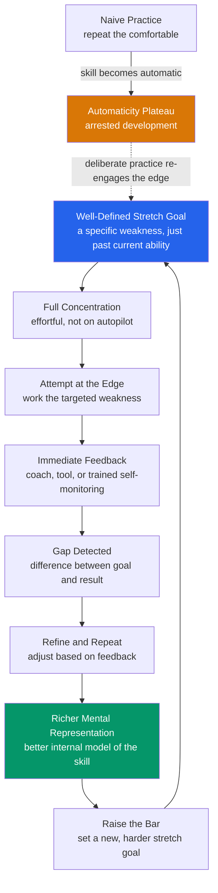

# 🎯 Deliberate Practice and Expertise

> [!abstract] TL;DR
> **Deliberate practice** (Ericsson, Krampe & Tesch-Romer, 1993) is the claim that expert performance is built not by *experience* or raw repetition but by a specific, effortful regimen: **well-defined stretch goals** just beyond current ability, **full concentration**, **immediate feedback**, and **repetition with refinement** aimed squarely at your *weaknesses*. Mere experience produces an early rise and then a **plateau** — once a skill becomes **automatic**, the challenge freezes and learning stops. Experts escape that trap by continuously working at the edge of their ability, and the core adaptation they build is not muscle or reflex but richer **mental representations** of their domain. The popular **"10,000-hour rule"** is a serious misreading of this work: Ericsson never claimed a magic number, and meta-analyses (Macnamara et al., 2014) show accumulated practice explains a *variable and often modest* fraction of performance differences, with talent, starting age, and task predictability all mattering.

---

## Intuition

**Analogy — the gym versus the treadmill.**

Two people spend the same hour "working out." The first climbs onto a treadmill, sets a comfortable pace, and jogs while watching TV. She has done this for ten years. She is *fit*, but she runs the same speed today that she did in year two — the effort became automatic, and automatic effort does not build anything new. The second person has a coach. Each session the coach picks the *one lift she is weakest at*, loads the bar to just past what she can currently do, watches every repetition, corrects her form the instant it slips, and adds weight the moment the old weight gets easy. She is uncomfortable the entire hour. A year later she is transformed.

Same hours, opposite outcomes. The treadmill is **naive practice** — repeating what you can already do. The coached, at-the-edge, feedback-drenched, always-a-little-too-hard session is **deliberate practice**. Expertise is not the treadmill runner with the most miles; it is the lifter who spent the most time in the zone where things *break and rebuild*. The whole theory is an argument that comfort is the enemy of growth, and that the felt strain of working past your current limit is not a side effect of improvement — it *is* the improvement.

---

## How It Works

### Core Mechanics

Ericsson's account starts by rejecting a folk assumption: that you get better at something simply by *doing it a lot*. Decades of data say otherwise. Most people reach an "acceptable" level at a skill — driving, typing, general medicine — and then improve little or not at all for years, no matter how many more hours they log. Deliberate practice specifies what the productive minority does differently. Four components define it:

1. **A well-defined, specific stretch goal.** Not "get better at piano" but "play this four-bar passage at 120 bpm without the left-hand stumble." The goal targets a *particular* weakness and sits **just beyond current ability** — hard enough to fail at, close enough to reach. This is the "edge of ability" or *challenge point*.
2. **Full concentration and effort.** Deliberate practice is not relaxing; it demands complete attention, which is why it can only be sustained for a few hours a day even by elite performers. Autopilot is disqualifying.
3. **Immediate, informative feedback.** You must see the gap between what you intended and what you produced, right away — from a coach, a teacher, a measuring tool, a recording, or well-trained self-monitoring. Without feedback the loop cannot close and errors ossify.
4. **Repetition with refinement.** You repeat the targeted action, but each repetition is *adjusted* in response to feedback, and once mastered the goal is *reset* higher. It is a spiral, not a circle.

The mechanism that ties these together is the construction of **mental representations** — increasingly detailed, domain-specific internal models that let experts perceive meaningful patterns, anticipate what comes next, evaluate their own performance, and plan. A chess master does not calculate more moves per second than a novice; she *sees* the board as a handful of familiar strategic configurations. Deliberate practice is, at bottom, the process of building and refining these representations — which is why it generalizes poorly across domains and why feedback (which corrects the representation) is non-negotiable.

The contrast case is instructive. **Naive practice** repeats the comfortable; as the skill becomes **automatic**, working-memory demand drops, attention wanders, feedback stops informing, and improvement asymptotes to a **plateau** Ericsson calls *arrested development*. Automaticity is wonderful for *executing* a skill efficiently and terrible for *improving* it. Deliberate practice deliberately *de-automatizes* — it drags the skill back under conscious, effortful control at a harder target so that adaptation can resume.

A useful three-way ladder: **naive practice** (mindless repetition, no goal) → **purposeful practice** (specific goals, focus, feedback, pushing past comfort, but self-directed) → **deliberate practice** (purposeful practice *plus* an established field with proven training methods and a teacher/coach who prescribes them). Ericsson reserved "deliberate practice" for the strict last case; most everyday improvement is at best purposeful.

### Flow / Architecture



---

## Key Concepts

### Secondary (intuitive level)

- Getting *lots* of experience at something is not the same as getting *good* at it. After a while, more of the same stops helping.
- The way to keep improving is to keep working on the parts you are *worst* at, at a level that is a little too hard, while paying full attention.
- You need to see your mistakes right away — a coach, a recording, or a score — so you can fix them instead of repeating them.
- The magic "10,000 hours" number you have heard is a myth. Hours matter, but *how* you practice matters more, and how far you can go also depends on where you started and on the person.

### Undergraduate (mechanistic level)

- **The four components** are non-negotiable together: a specific stretch goal, full concentration, immediate feedback, and repetition-with-refinement. Drop any one and you slide back toward naive practice.
- **Challenge point / edge of ability.** Learning is maximized when the task difficulty sits just above current competence — too easy yields no error signal to learn from, too hard yields error you cannot yet interpret. Deliberate practice keeps the learner parked at this moving edge.
- **Automaticity and arrested development.** Skills that become automatic run with minimal working-memory cost (great for performance) but stop generating the effortful error-correction that drives change (bad for improvement). Plateaus are the signature of a skill that has gone automatic and never been re-challenged.
- **Mental representations as the core adaptation.** Expertise is largely *perceptual and cognitive*, not just motor. Chase and Simon (1973) showed chess masters recall realistic board positions far better than novices but lose that advantage on *random* positions — proof the advantage is stored patterns (chunks), not raw memory. Deliberate practice builds and refines these representations.
- **Purposeful vs deliberate practice.** Purposeful practice has goals, focus, and feedback but is self-directed; *deliberate* practice adds an established body of training methods and a coach who administers them. Fields without such accumulated pedagogy (many management or creative roles) can only support purposeful practice.
- **Deliberate practice vs deliberate play.** In youth-sports research (Cote), *deliberate play* is intrinsically enjoyable, low-structure, child-led activity (pickup games) that builds broad motor skills and motivation; *deliberate practice* is effortful, coach-structured, and not inherently fun. Early diversified play plus later specialization often beats early single-sport grind.

### Graduate (theoretical and critique level)

- **The expert-performance approach.** Ericsson's methodological program: (1) capture *reproducible* expert performance in the lab with representative tasks, (2) analyze the mechanisms that mediate it (e.g., mental representations, retrieval structures), (3) trace how those mechanisms were *acquired* through the history of practice. This "capture-analyze-acquire" logic is the real contribution, more than any single number.
- **The 1993 violinist study.** Ericsson, Krampe and Tesch-Romer compared conservatory violinists rated best, good, and least accomplished, plus teachers. The best had accumulated more lifetime *solitary* deliberate practice (roughly 7,400 vs 5,300 vs 3,400 hours by age 18), and *no* expert had reached the top with less. Gladwell (2008) rounded the top group's ~10,000 hours by age 20 into a universal "10,000-hour rule" for anyone in any field — a claim Ericsson explicitly disowned: it was an *average of one elite group in one domain*, said nothing about a threshold, and ignored the wide individual spread.
- **The meta-analytic critique.** Macnamara, Hambrick and Oswald (2014) meta-analyzed 88 studies and found deliberate practice explained on average about **26% of the variance** in games, **21%** in music, **18%** in sports, but only **~4%** in education and **<1%** in professions. In other words, practice matters a great deal *and* leaves most of the variance unexplained. Follow-up work (Macnamara & Maitra, 2019) re-examining even the violinist data found weaker and messier relationships than the original.
- **What else predicts expertise.** Candidate moderators include **task predictability / environment regularity** (deliberate practice pays off most in stable, rule-governed domains like chess and less in "wicked," low-feedback ones like stock-picking or psychotherapy — cf. Kahneman and Klein on when intuition is trustworthy), **age of starting** (earlier onset correlates with attainment, partly via more accumulated practice and partly via developmental windows), **working-memory capacity and general cognitive ability**, and plausibly **genetic** influences on both trainability and the propensity to practice.
- **The "how much vs whether" reframing.** The mature consensus is not "practice does not matter" (it clearly does and is the biggest *malleable* factor) but "deliberate practice is **necessary but not sufficient**, and the return on it varies enormously by domain and person." Effect-size realism and attention to *for whom and where* replaced the seductive single-number story.

---

## Python Demo

```python
# Deliberate Practice: the Power Law of Practice, and why NAIVE practice
# plateaus while DELIBERATE practice keeps improving.
#
# PART A -- THE POWER LAW OF PRACTICE
#   The time (or error) to perform a task falls as a POWER function of the
#   number of practice trials:   T(N) = T1 * N**(-b)
#   Taking logs:  log T = log T1 - b * log N  ->  a STRAIGHT LINE on log-log
#   axes with slope -b. This is the most reproduced regularity in skill
#   acquisition (Snoddy 1926; Newell & Rosenbloom 1981).
#
# PART B -- DELIBERATE vs NAIVE PRACTICE
#   Track ERROR versus cumulative practice hours.
#     NAIVE practice repeats the already-comfortable. Once the skill becomes
#     AUTOMATIC the challenge freezes and error asymptotes to a PLATEAU
#     (arrested development):   E_naive(h) = E_floor + (E0 - E_floor)*h**(-b)
#     DELIBERATE practice keeps resetting the goal to the EDGE of current
#     ability, so error keeps being driven down as a pure power law and never
#     plateaus over the practice range:   E_delib(h) = E0 * h**(-b)

import numpy as np
import matplotlib.pyplot as plt

# ----- PART A: power law of practice -----
N  = np.arange(1, 5001)          # practice trials
T1 = 6.0                         # performance time on trial 1 (seconds)
b  = 0.30                        # learning-rate exponent
T  = T1 * N**(-b)                # power-law learning curve

# ----- PART B: deliberate vs naive practice -----
h       = np.arange(1, 5001)     # cumulative practice hours
E0      = 100.0                  # starting error
b_curve = 0.45
E_floor = 18.0                   # comfort / automaticity plateau (naive)
E_naive = E_floor + (E0 - E_floor) * h**(-b_curve)
E_delib = E0 * h**(-b_curve)

# ----- figure -----
fig, ax = plt.subplots(1, 3, figsize=(16, 5))

# Panel 1: power law on LINEAR axes -> diminishing-returns curve
ax[0].plot(N, T, color="#2563eb", lw=2)
ax[0].set_xlabel("Practice trials  N")
ax[0].set_ylabel("Performance time  [s]")
ax[0].set_title("Power law of practice\nT(N) = T1 * N^-b   [linear axes]")
ax[0].grid(alpha=0.3)

# Panel 2: SAME data on LOG-LOG axes -> straight line confirms the power law
ax[1].loglog(N, T, color="#2563eb", lw=2, label="learning curve")
ax[1].loglog(N, T1 * N**(-b), color="#dc2626", ls="--", lw=1,
             label=f"slope = -b = -{b:.2f}")
ax[1].set_xlabel("Practice trials  N  [log]")
ax[1].set_ylabel("Performance time  [s, log]")
ax[1].set_title("Same curve on LOG-LOG axes\nstraight line confirms a power law")
ax[1].legend()
ax[1].grid(alpha=0.3, which="both")

# Panel 3: deliberate vs naive -> plateau vs continued improvement
ax[2].semilogy(h, E_naive, color="#d97706", lw=2.2,
               label="naive practice  [plateaus]")
ax[2].semilogy(h, E_delib, color="#059669", lw=2.2,
               label="deliberate practice  [keeps improving]")
ax[2].axhline(E_floor, color="#d97706", ls=":", alpha=0.7)
ax[2].set_xlabel("Cumulative practice hours")
ax[2].set_ylabel("Error rate  [log]")
ax[2].set_title("Deliberate vs naive practice\nautomaticity plateau vs continued gain")
ax[2].legend()
ax[2].grid(alpha=0.3, which="both")

plt.tight_layout()
plt.savefig("deliberate_practice_and_expertise.png", dpi=150)
plt.show()

# ----- console summary -----
print("hours   naive_error   deliberate_error")
for hh in [100, 1000, 5000]:
    en = E_floor + (E0 - E_floor) * hh**(-b_curve)
    ed = E0 * hh**(-b_curve)
    print(f"{hh:>5}   {en:10.2f}   {ed:14.2f}")
```

The first two panels make the **power law of practice** concrete: on linear axes the learning curve shows the familiar fast-then-flattening shape, and the *same* data plotted on log-log axes falls onto a straight line of slope `-b` — the signature of a power function and the reason skill acquisition is often summarized as "the log-log law of practice." The third panel captures Ericsson's central contrast. Both curves start identically, but the **naive** learner's error flattens onto the `E_floor = 18` plateau (the point where the skill went automatic and the challenge stopped rising), while the **deliberate** learner — perpetually re-targeting weaknesses at the edge of ability — keeps driving error down as an unbroken power law, ending at roughly `2` where the naive learner is stuck near `20`. Same hours, different regimen, order-of-magnitude different outcome.

---

## Real-World Applications

- **Chess.** The founding domain of expertise research (de Groot; Chase and Simon). Modern training — annotated grandmaster games, tactics engines that flag your exact blunders, and structured study of your recurring weaknesses — is close to textbook deliberate practice, and chess's stable rules make it a high-return domain (the ~26% variance figure).
- **Music.** Conservatory pedagogy is built on deliberate practice: a teacher assigns specific technical goals, the student practices difficult passages in isolation (not just playing pieces through), and lessons supply immediate correction. Ericsson's violinist study is the canonical data.
- **Surgery and medicine.** Simulation-based training with objective metrics (e.g., laparoscopic box trainers, virtual-reality endoscopy simulators) provides the immediate feedback and repeatable stretch tasks that live operating rooms cannot. Studies show simulator-trained surgeons make measurably fewer errors — deliberate practice engineered into a field where naive "experience" alone notoriously plateaus.
- **Aviation.** Flight simulators let pilots repeatedly rehearse rare, high-stakes failures (engine-out, stall recovery) with instant instructor feedback — deliberate practice of exactly the situations real flying almost never provides, which is why simulator hours count toward proficiency.
- **Sports coaching.** Elite programs individualize practice to each athlete's weakest links, use video and sensor feedback for immediate correction, and progressively load difficulty. The coach is the mechanism that keeps the athlete at the edge and supplies the feedback loop.
- **Software and knowledge work.** Deliberate practice is *harder* to apply here because feedback is delayed and tasks are "wicked," but code review, structured kata, spaced problem sets, and post-incident retrospectives are attempts to manufacture the tight feedback and targeted-weakness structure that day-to-day work lacks.

---

## Common Pitfalls

- **Counting hours instead of practicing deliberately.** The 10,000-hour framing invites people to grind time and expect mastery. Ten thousand hours of the *treadmill* changes nothing; the demo's naive curve is the honest picture of high-volume, low-quality practice.
- **Practicing what you are already good at.** It feels productive and rewarding, which is exactly why it is a trap — comfort means no error signal, and no error signal means no learning. Deliberate practice is meant to feel like effortful failure at the edge, not fluent success in the middle.
- **Practicing without feedback.** Repetition of an *uncorrected* error trains the error. If you cannot see the gap between intention and result quickly, you are rehearsing, not improving. Manufacture feedback (recordings, metrics, a coach) before adding volume.
- **Letting a skill go fully automatic and calling it mastery.** Automaticity is efficient execution, not continued growth. Plateaued professionals often mistake fluency for expertise; breaking a plateau requires deliberately de-automatizing and re-challenging the skill.
- **Over-claiming from the theory (the Gladwell error).** Treating deliberate practice as the *sole* determinant of success ignores the meta-analytic reality that it leaves most variance unexplained and that starting age, cognitive ability, task predictability, and likely genetics all matter. Over-claiming both misleads learners and invites justified backlash.
- **Assuming it transfers.** Mental representations are domain-specific. Becoming an expert chess player builds chess representations, not general "brain training." Deliberate practice improves the trained skill and things very close to it — rarely more.
- **Ignoring recovery and sustainability.** Full-concentration practice is metabolically and attentionally expensive; even elite performers cap it at a few hours a day and protect sleep. Trying to run it eight hours straight produces fatigue-driven sloppy reps, which is naive practice in disguise.

---

## Related Concepts

- [[Mental_Representation]] — the core adaptation deliberate practice builds; expert advantage is stored, refined internal models, not faster raw processing.
- [[Problem_Solving_and_Insight]] — chess and other expertise research grew from studies of expert problem-solving; experts' pattern-based perception is the same chunking mechanism.
- [[Cognitive_Load_and_Learning]] — automaticity frees working memory (great for performance) but removes the effortful error-correction that drives improvement; deliberate practice re-imposes desirable difficulty.
- [[Working_Memory_and_Cognitive_Load]] — chunking via mental representations is how experts pack a whole configuration into one working-memory slot, escaping the capacity bottleneck.
- [[Long_Term_Memory_Systems]] — where expert representations and retrieval structures are ultimately stored and automated.
- [[Motivation_and_Learning]] — sustaining years of effortful, unpleasant practice depends on the expectancy-value and self-regulation machinery of motivation; the edge-of-ability zone must be motivationally survivable.
- [[Attention_and_Selection]] — the "full concentration" component; deliberate practice is disqualified the moment attention lapses into autopilot.
- [[Forgetting_and_the_Forgetting_Curve]] — why spacing and repetition-with-refinement, not massed cramming, consolidate skill over time.
- [[Adaptation_and_Learning_in_Systems]] — a systems view of the same idea: adaptive systems improve only while an error signal keeps driving change; equilibrium is a plateau.

---

## Review Questions

**Tier 1 — Recall / Comprehension**
1. List the four components that distinguish deliberate practice from ordinary experience, and explain what happens to learning if the *feedback* component is removed.
2. What is "arrested development," and why does a skill becoming *automatic* cause it?

**Tier 2 — Application**
3. A self-taught programmer has ten years of experience but has not improved measurably in five. Using the naive-versus-deliberate distinction and the concept of the "edge of ability," design a concrete weekly practice regimen that would restart their improvement, and specify where the feedback loop comes from in a field with notoriously delayed feedback.
4. Using the demo's two error curves, explain why two learners with the *same* number of practice hours can end an order of magnitude apart in error, and identify which single parameter in the model encodes "how deliberately" they practiced.

**Tier 3 — Analysis / Synthesis**
5. Gladwell popularized a "10,000-hour rule" from Ericsson's violinist study, while Macnamara et al. (2014) found deliberate practice explains roughly 26% of variance in games but under 1% in professions. Reconcile these: state precisely what Ericsson did and did not claim, explain why the variance-explained differs so much across domains (invoke task predictability and feedback quality), and argue for the "necessary but not sufficient" position without either dismissing practice or over-claiming it.

---

## Sources

- [Ericsson, K.A., Krampe, R.T. & Tesch-Romer, C. (1993). "The Role of Deliberate Practice in the Acquisition of Expert Performance." *Psychological Review*, 100(3), 363–406.](https://doi.org/10.1037/0033-295X.100.3.363)
- [Macnamara, B.N., Hambrick, D.Z. & Oswald, F.L. (2014). "Deliberate Practice and Performance in Music, Games, Sports, Education, and Professions: A Meta-Analysis." *Psychological Science*, 25(8), 1608–1618.](https://doi.org/10.1177/0956797614535810)
- [Chase, W.G. & Simon, H.A. (1973). "Perception in chess." *Cognitive Psychology*, 4(1), 55–81.](https://doi.org/10.1016/0010-0285(73)90004-2)
- [Hambrick, D.Z. et al. (2014). "Deliberate practice: Is that all it takes to become an expert?" *Intelligence*, 45, 34–45.](https://doi.org/10.1016/j.intell.2013.04.001)
- Ericsson, K.A. & Pool, R. (2016). *Peak: Secrets from the New Science of Expertise.* Houghton Mifflin Harcourt.
- Gladwell, M. (2008). *Outliers: The Story of Success.* Little, Brown and Company.

---

#learning-science #deliberate-practice #expertise #ericsson #skill-acquisition
