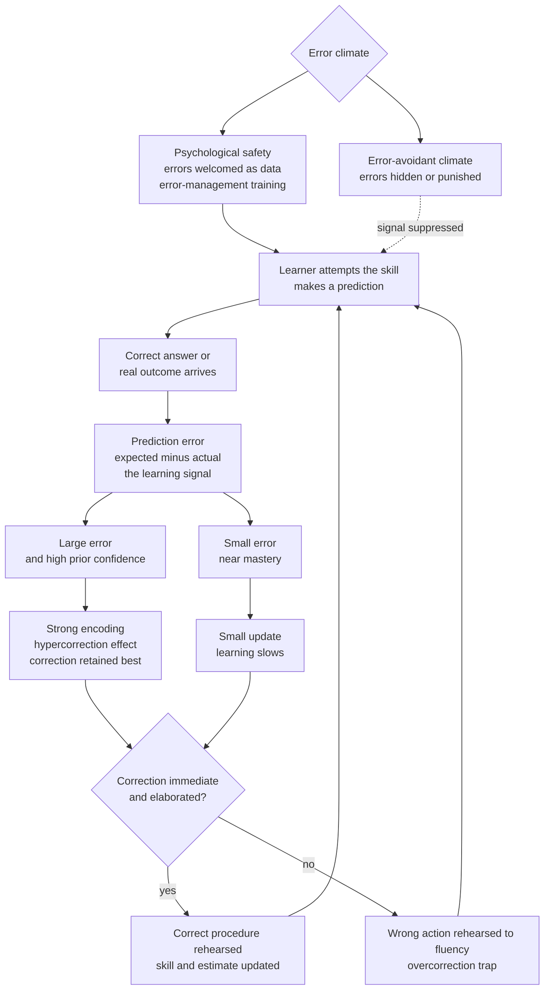

# 🎯 Feedback and Error Correction

> [!abstract] TL;DR
> Skill is built by errors, not despite them. Every attempt produces a **prediction error** — the gap between what the learner expected and what actually happened — and that gap *is* the learning signal. Formally this is the **delta rule** or **Rescorla-Wagner** update: revise your estimate in proportion to the error, so large errors drive fast correction and learning slows as errors shrink. The same principle runs from dopamine's **reward prediction error** up to backpropagation. Three findings turn this into practice: **error-management training** (encouraging and reframing errors during practice) beats error-avoidant training on adaptive transfer; **productive failure** (struggling before being taught) deepens conceptual learning; and the **hypercorrection effect** shows that errors made with *high confidence*, once corrected, are the ones retained best. The catch: errors are only fuel when the correction is informative and correctly rehearsed — practice a mistake enough and you become fluent in the mistake.

---

## Intuition

**Analogy — learning to parallel park by feel.** The first time you parallel park, you turn the wheel, look up, and the car is a foot from the curb at a bad angle. That gap — *where you expected the car to be* versus *where it actually is* — is the only thing that teaches you anything. If someone blindfolded you so you never saw the result, you could park a thousand times and never improve. The *size* of the gap sets the *size* of the lesson: the first wildly-wrong attempt corrects a lot, and by the twentieth try you are only nudging a few inches, so each correction is tiny. Learning naturally decelerates as you close in on "right."

Now add the twist that most people get backwards. Suppose you were *certain* you had it perfect — and then looked up to find the car mounting the pavement. That jolt of *"wait, I was sure!"* is not a humiliation to bury; it is the most memorable correction you will ever get. Confident mistakes, once corrected, stick harder than cautious ones. And one warning the analogy makes obvious: if you keep repeating the *same* bad turn-in without ever seeing or fixing the result, you do not stall — you get *good at parking badly*. Practicing an error just makes the error automatic.

---

## How It Works

### Errors are information, not failures

The folk model of learning treats an error as a defect: a thing that should not have happened, to be minimized and hidden. The cognitive-science model inverts this. An error is the single most information-rich event in a practice session, because it *localizes the gap* between the learner's current model and reality. A correct answer confirms what you already knew; an error tells you precisely where your model is wrong. A learning system that never errs is a system operating below its capacity — it is not being stretched.

### Prediction error as the learning signal

The unifying mechanism is **prediction error**: expected outcome minus actual outcome. This is the currency shared by animal conditioning, reinforcement learning, and the brain's reward system.

- **Rescorla-Wagner / the delta rule.** Learning updates an estimate `V` toward a target in proportion to the error: `V_new = V + alpha * (target - V)`, where `alpha` is the learning rate. The correction each step is proportional to the current error, so the estimate approaches the target as an exponential decay: big errors early, ever-smaller nudges later. This *automatically* produces the classic learning curve — steep at first, flattening near mastery.
- **Reward prediction error and dopamine.** Schultz's recordings showed midbrain dopamine neurons do not signal reward itself; they signal *reward prediction error* — they fire for better-than-expected outcomes, pause for worse-than-expected ones, and fall silent for fully predicted ones. The brain's teaching signal is literally surprise. See [[Decision_Making_and_Reward_Circuits]].
- **Temporal-difference learning.** In reinforcement learning the same idea becomes the TD error, `delta = r + gamma*V_next - V`, the engine behind [[RL_Fundamentals]] and [[Q_Learning_and_SARSA]]. Backpropagation in neural nets is the same story: propagate the output error backward and adjust weights against it.

### Error-management vs error-avoidant training

If errors are the fuel, how you *frame* them during training matters enormously. Keith and Frese contrasted two regimes for teaching a skill:

- **Error-avoidant training** guides learners along an error-free path, correcting or preventing mistakes before they happen.
- **Error-management training** deliberately lets learners make errors and adds *positive error framing* — "errors are a natural part of learning; an error tells you something."

Their meta-analysis found error-management training produces **better adaptive transfer** — performance on novel problems the training never covered. The mechanism: making and recovering from errors builds error-detection skill, exploration, and metacognitive strategies that a smooth guided path never exercises. Crucially, error-management training often looks *worse during training* and *better on transfer* — a case of Bjork's distinction between performance and learning.

### Productive failure

Kapur's **productive failure** pushes the timing further: have novices *attempt* a hard problem with little guidance *before* being taught the canonical method. Their initial solutions usually fail — yet these students later outperform peers who were taught the method first. The struggle activates relevant prior knowledge, focuses attention on the critical features of the problem, and makes the learner *aware of what they do not know*, priming them to absorb the eventual instruction. Failure, correctly staged, is *preparation for future learning*.

This lives in tension with the guidance-for-novices literature (worked examples reduce load for beginners — see [[Cognitive_Load_and_Learning]]). The reconciliation is *sequence and expertise*: struggle first to generate the questions, then instruct to answer them; and fade the struggle when a learner is a true novice at risk of overload.

### The hypercorrection effect

The most counter-intuitive finding: **errors committed with high confidence are corrected and retained best** (Butterfield and Metcalfe). You might expect that being *sure* and wrong would make a misconception sticky. The opposite holds. When a confident expectation is violated, the correct answer arrives as a large *surprise*, and surprise drives deep encoding. On a later test, the high-confidence errors are the ones whose corrections are remembered — the ones the learner is *least* likely to repeat. (A competing account notes that high confidence correlates with more surrounding knowledge, which scaffolds the fix; both mechanisms likely contribute.) The practical upshot: probe confidence, then aim corrective feedback at the confident errors — they are the highest-yield targets.

### Guided vs unguided correction, timing, and the danger of rehearsing errors

Making an error is necessary but not sufficient; the *correction* must be usable.

- **Knowledge of results vs elaborated feedback.** Merely telling a learner "wrong" (knowledge of results) is weak for complex skills. **Elaborated corrective feedback** — what was wrong, why, and the correct procedure — is what closes the gap.
- **Immediate vs delayed.** For raw motor-skill acquisition and genuine misconceptions, *immediate* correction prevents a wrong action from being rehearsed. For durable, transferable understanding, a modest *delay* forces reconstruction and prevents feedback dependence (the tradeoff detailed in [[Reflection_and_Feedback]]).
- **Overcorrection and grooving.** The dark side of error-driven learning: if a learner repeats an uncorrected error, the error itself becomes automatic — *fluency in the wrong thing*. Musicians "groove in" mistakes; typists automate typos. Once an error is over-practiced it is far harder to unlearn than to have learned correctly the first time. This is why deliberate practice demands slow, attentive, immediately-corrected repetition rather than fast, sloppy volume.
- **Deliberate practice requires feedback.** Ericsson's defining feature of deliberate practice is not raw hours but *repeated attempts at the edge of ability with immediate, informative feedback and correction*. Remove the feedback loop and practice plateaus into mere experience.

### Error climate and psychological safety

None of this fires if errors never surface. In teams and classrooms with an **error-avoidant climate** — where mistakes are punished, hidden, or shameful — the error signal is suppressed at the source, and with it the learning. Edmondson's **psychological safety** is the organizational precondition: a climate where errors can be admitted, examined, and corrected openly is what lets the whole error-driven machine run.



---

## Key Concepts

### Secondary (intuitive level)

- Mistakes are information, not failures — an error tells you exactly what to fix.
- Your brain learns most when it is *surprised* — when something turns out differently than you expected.
- The bigger the surprise, the bigger the lesson; as you close in on "right," each fix gets smaller.
- Being confidently wrong and then corrected is one of the most *memorable* ways to learn.
- Practice carefully: if you rehearse a mistake, you get good at the mistake.

### Undergraduate (mechanistic level)

- **Prediction error is the learning signal.** The delta rule updates `V` by `alpha * (target - V)`; the correction is proportional to the error, giving an exponential learning curve — fast then flattening.
- **Biological substrate.** Dopamine neurons encode *reward prediction error* (Schultz), firing to better-than-expected and pausing for worse-than-expected outcomes — surprise, not reward.
- **Error-management training** (encourage errors + positive framing) beats **error-avoidant training** on *adaptive transfer* (Keith and Frese), even when it looks worse during training.
- **Productive failure** (Kapur): unguided struggle *before* instruction improves conceptual learning by activating prior knowledge and surfacing knowledge gaps.
- **Hypercorrection effect** (Butterfield and Metcalfe): high-confidence errors, once corrected, are retained best — surprise drives encoding.
- **Feedback design:** elaborated corrective feedback beats bare knowledge-of-results; immediate for motor acquisition, delayed for transfer; guard against grooving in errors.

### Graduate (theoretical level)

- **Temporal-difference and actor-critic learning.** The TD error `delta = r + gamma*V_next - V` generalizes the delta rule to sequential decisions; dopamine as a TD-error signal (Schultz, Dayan, Montague) links neuroscience, RL, and animal learning under one computation.
- **Predictive processing / free energy.** A broader framing casts all learning and perception as *minimizing prediction error* (surprise) — errors are not incidental to cognition, they are its driving quantity.
- **Reconciling guidance debates.** Kirschner, Sweller, and Clark argue minimal guidance fails novices (worked-example effect); productive failure argues struggle helps. The resolution is *expertise-dependent sequencing* — struggle to generate questions, then instruct — bounded by the expertise-reversal effect and overload risk.
- **Competing accounts of hypercorrection.** Surprise-driven encoding vs the fact that high confidence co-occurs with richer related knowledge that scaffolds the correction; the effect is robust across both.
- **Performance vs learning.** Error-management and productive-failure regimes depress *training* performance while raising *transfer* — a canonical desirable-difficulty pattern (Bjork), which is why training metrics can systematically mislead.
- **Organizational moderator.** Edmondson's psychological safety and team *error climate* determine whether error signals are surfaced at all — the social precondition for the entire mechanism.

---

## Python Demo

```python
# Model ERROR-DRIVEN LEARNING and the HYPERCORRECTION EFFECT.
#
# Core idea (delta rule / Rescorla-Wagner): a learner revises an estimate in
# PROPORTION to its PREDICTION ERROR.
#
#     V_next = V + alpha * (target - V)
#     error  = target - V              # the learning signal
#
# Because the update is proportional to the current error:
#   * a LARGE error drives a LARGE correction   -> fast early learning
#   * as the error SHRINKS, corrections shrink  -> learning slows near mastery
#
# Second effect (hypercorrection): when an error was made with HIGH confidence,
# the correct answer violates a strong expectation. That surprise drives deeper
# encoding, so high-confidence errors, once corrected, are RETAINED BEST.

import numpy as np
import matplotlib.pyplot as plt

rng = np.random.default_rng(1)

# ---------- Part 1: delta-rule error dynamics ----------
target   = 1.0
alpha    = 0.35
n_trials = 30
trials   = np.arange(n_trials)
starts   = [0.0, 0.5, 0.9]            # initial estimates -> initial errors 1.0, 0.5, 0.1

fig, (ax1, ax2) = plt.subplots(1, 2, figsize=(13, 5))

for V0 in starts:
    V = V0
    errs = []
    for _ in range(n_trials):
        err = target - V              # prediction error
        errs.append(err)
        V += alpha * err              # delta-rule update
    ax1.plot(trials, errs, marker="o", ms=3,
             label=f"start {V0:.1f}  ->  initial error {target - V0:.1f}")

ax1.axhline(0, color="k", lw=0.8, ls="--")
ax1.set_xlabel("Practice trial")
ax1.set_ylabel("Prediction error  [target minus estimate]")
ax1.set_title("Delta rule: big errors correct fast, then learning slows")
ax1.legend()
ax1.grid(alpha=0.3)

# ---------- Part 2: hypercorrection effect ----------
n_items    = 6000
confidence = rng.uniform(0.0, 1.0, n_items)     # confidence held in the WRONG answer
# surprise at the correct answer scales with confidence; retention rises with it
p_retain   = np.clip(0.30 + 0.55 * confidence + rng.normal(0, 0.05, n_items), 0, 1)
retained   = rng.random(n_items) < p_retain      # was the correction remembered later?

edges   = np.linspace(0.0, 1.0, 6)
centers = 0.5 * (edges[:-1] + edges[1:])
b_idx   = np.clip(np.digitize(confidence, edges) - 1, 0, len(centers) - 1)
rates   = np.array([retained[b_idx == b].mean() for b in range(len(centers))])

ax2.bar(centers, rates, width=0.15, color="#2563eb", edgecolor="k",
        label="retained corrections")
ax2.plot(centers, rates, color="#dc2626", marker="o", lw=2, label="trend")
ax2.set_xlabel("Confidence held in the ORIGINAL wrong answer")
ax2.set_ylabel("Fraction of corrections retained later")
ax2.set_title("Hypercorrection: confident errors, once fixed, stick best")
ax2.set_ylim(0, 1)
ax2.legend()
ax2.grid(alpha=0.3, axis="y")

plt.tight_layout()
plt.show()

# ---------- console summary ----------
e0 = target - 0.0                                # largest initial error
n_to_mastery = int(np.ceil(np.log(0.05 / e0) / np.log(1 - alpha)))
print(f"Delta rule (alpha={alpha}): initial error {e0:.2f} decays by factor "
      f"{1 - alpha:.2f} each trial.")
print(f"  trials to cut error below 0.05: {n_to_mastery}")
print(f"Hypercorrection: corrected-retention rises from {rates[0]:.2f} "
      f"(low-confidence errors) to {rates[-1]:.2f} (high-confidence errors).")
```

Running it shows both effects. In the left panel every curve decays exponentially toward zero error, but the curve that *started* with the largest error falls fastest in absolute terms early on — larger errors drive larger corrections — while *within* any curve the steps shrink as the estimate nears the target, reproducing the flattening learning curve. The console reports it takes about **7 trials** to drive the initial error below 0.05 at `alpha = 0.35`. The right panel shows the hypercorrection signature: corrected-retention climbs from roughly **0.30** for errors made with no confidence to about **0.85** for errors made with full confidence — the confident mistakes are exactly the ones whose corrections endure.

---

## Real-World Applications

- **Software engineering.** Test-driven development makes the *failing test* the explicit prediction-error signal (red before green); continuous-integration failures are immediate corrective feedback; and *blameless postmortems* are error-management culture institutionalized — they surface errors as system information rather than personal blame, protecting psychological safety.
- **Aviation and medicine.** High-fidelity simulators deliberately induce emergencies and errors in a safe setting (error-management training), followed by structured debriefs. Crew Resource Management trains crews to *voice* errors and near-misses — engineering the error climate so signals surface.
- **Machine learning.** Gradient descent with backpropagation *is* error-driven learning at scale; reinforcement-learning agents update from reward prediction error. The whole field is applied delta-rule learning — see [[RL_Fundamentals]].
- **Language and knowledge apps.** Spaced-retrieval systems (Anki, Duolingo) give immediate corrective feedback and exploit hypercorrection by pushing learners to commit to answers before revealing the correct one, so confident errors get maximally memorable corrections.
- **Sports and music coaching.** Deliberate practice at slow tempo with immediate correction prevents grooving errors into automaticity; coaches deliberately raise difficulty until errors appear, because an error-free session is not stretching the athlete.
- **Intelligent tutoring systems.** Modern tutors stage *productive struggle* before delivering hints, then give elaborated (not bare) corrective feedback, adapting how early guidance appears to the learner's expertise.

---

## Common Pitfalls

- **Punishing errors instead of mining them.** An error-avoidant climate makes learners hide mistakes, killing the signal at its source. The fix is psychological safety: reward disclosure and analysis of errors, not their absence.
- **Grooving errors to fluency (overcorrection).** Fast, sloppy, uncorrected repetition automates the *wrong* action, which is harder to unlearn than to have learned correctly. Practice slowly with immediate correction; volume without feedback entrenches faults.
- **Bare knowledge-of-results for complex skills.** Telling a learner only "wrong" rarely closes the gap. Complex skills need *elaborated* feedback: what was wrong, why, and the correct procedure.
- **Removing all struggle from novices — or all guidance.** Give answers too early and you kill productive failure and the generative work that primes learning; give none and a true novice overloads (the worked-example effect). Sequence struggle then instruction, and scale it to expertise.
- **Ignoring confidence.** Treating all errors as equal wastes the hypercorrection lever. Confident errors are the highest-yield correction targets, not the most stubborn — probe confidence and aim there.
- **Judging a method by training performance.** Error-management and productive-failure regimes look *worse* during training and *better* on transfer. Optimizing the visible training metric selects for shallow, non-transferable learning.
- **Wrong feedback timing.** Immediate correction for motor acquisition and misconceptions; a modest delay for durable transfer. Always-immediate feedback breeds dependence and starves the learner's own error-detection.

---

## Related Concepts

- [[Reflection_and_Feedback]] — the S03 companion on *delivering* feedback (feed up/back/forward, the four levels, timing); this note supplies the error-as-engine mechanics that feedback acts on.
- [[RL_Fundamentals]] — reward prediction error and the delta/TD update are the computational formalization of error-driven learning.
- [[Q_Learning_and_SARSA]] — the TD error is the delta rule applied to sequential decision-making, propagating value backward from outcomes.
- [[Decision_Making_and_Reward_Circuits]] — dopamine neurons encode reward prediction error, the biological substrate of the learning signal used here.
- [[Adaptation_and_Learning_in_Systems]] — error-correcting feedback as the general mechanism by which adaptive systems track a changing environment.
- [[Cognitive_Load_and_Learning]] — the worked-examples-vs-problem-solving debate and the expertise-reversal effect that bound how much productive struggle a novice can bear.
- [[Memory_and_the_Learning_Brain]] — how surprising corrections get encoded and consolidated, the memory side of the hypercorrection effect.

---

## Review Questions

**Tier 1 — Recall / Comprehension**
1. State the delta rule in words and explain why it produces a learning curve that is steep early and flattens later. What plays the role of the "learning signal"?
2. What is the hypercorrection effect, and why is it counter-intuitive? Give the surprise-based explanation for why confident errors are corrected best.

**Tier 2 — Application**
3. A coding bootcamp finds that students trained on a smooth, error-free tutorial path ace the practice exercises but struggle badly on novel take-home projects. Using error-management training and the performance-versus-learning distinction, diagnose what is happening and redesign the training.
4. You are building a flashcard app. Design two concrete features — one exploiting the hypercorrection effect and one guarding against grooving errors — and justify each from the mechanisms in this note.

**Tier 3 — Analysis / Synthesis**
5. Productive failure says novices should struggle before instruction; cognitive load theory says novices should study worked examples first. Are these contradictory? Construct a single lesson sequence for teaching a genuinely novel skill that honors both, and specify the *signal* you would use to decide when to switch from struggle to guidance and how psychological safety and error climate gate whether either regime can work at all.

---

## Sources

- Rescorla, R. A., & Wagner, A. R. (1972). "A theory of Pavlovian conditioning: Variations in the effectiveness of reinforcement and nonreinforcement." In *Classical Conditioning II: Current Research and Theory*, 64–99.
- Schultz, W., Dayan, P., & Montague, P. R. (1997). "A neural substrate of prediction and reward." *Science*, 275(5306), 1593–1599.
- Keith, N., & Frese, M. (2008). "Effectiveness of error management training: A meta-analysis." *Journal of Applied Psychology*, 93(1), 59–69.
- Kapur, M. (2008). "Productive failure." *Cognition and Instruction*, 26(3), 379–424.
- Butterfield, B., & Metcalfe, J. (2001). "Errors committed with high confidence are hypercorrected." *Journal of Experimental Psychology: Learning, Memory, and Cognition*, 27(6), 1491–1494.
- Ericsson, K. A., Krampe, R. T., & Tesch-Römer, C. (1993). "The role of deliberate practice in the acquisition of expert performance." *Psychological Review*, 100(3), 363–406.

---

#learning-science #error-correction #feedback #prediction-error #productive-failure
