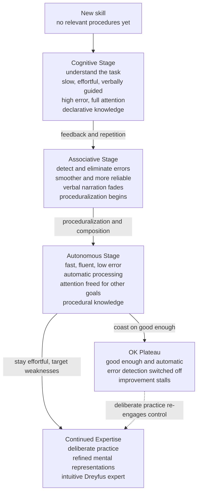

# 🎯 Stages of Skill Acquisition

> [!abstract] TL;DR
> Learning almost any complex skill passes through a predictable sequence. **Fitts & Posner (1967)** name three: a **cognitive** stage where you consciously figure out *what to do* (slow, effortful, error-riddled, narrated in your head), an **associative** stage where you *refine* it by detecting and eliminating errors (smoother, more reliable), and an **autonomous** stage where the skill runs *automatically* with almost no attention. **Anderson's ACT theory** gives the mechanism — knowledge shifts from **declarative** ("knowing that") to **procedural** ("knowing how") through **proceduralization** and **composition**. **Shiffrin & Schneider** frame the same shift as **controlled → automatic processing**, and the **Dreyfus model** stretches it into five levels from rule-following novice to intuitive expert. Improvement follows the **power law of practice** — huge early gains, then diminishing returns — which is exactly why most people stall at an **"OK plateau"** once the skill is *good enough*, and why escaping it requires **deliberate practice**, not more repetition.

---

## Intuition

**Analogy: learning to drive a manual car.**

On day one, every action is a conscious decision that you talk yourself through: *clutch in, into first, ease the clutch while feathering the gas, check the mirror, indicate...* Your whole mind is full. You stall at junctions, you grind the gears, and if a passenger asks a question you either ignore them or stall the car — there is no spare attention. This is the **cognitive** stage: you are building an explicit, step-by-step recipe and executing it one halting instruction at a time.

After a few weeks, the gear changes stop being a checklist. You still think about the tricky hill-start, but the basic sequence flows; you *feel* when the clutch bites and correct before you stall. Errors are rarer and you catch them yourself. This is the **associative** stage — the recipe is being polished into a smooth routine.

A year later you drive to work and remember nothing about the drive. You changed gear dozens of times, held a conversation, planned your day — and the driving happened by itself. This is the **autonomous** stage: the skill has become **automatic**, demanding almost no conscious attention, freeing your mind for everything else. The whole point of practice is to move a skill *out of the spotlight of consciousness* so the spotlight is available for something harder.

---

## How It Works

### The three stages (Fitts & Posner)

1. **Cognitive stage — understanding the task.** The learner encodes the goal and a rough set of instructions as **declarative knowledge** they can state in words. Performance is *slow, effortful, and highly variable*, with frequent gross errors, because every step is being reasoned through in working memory. The learner leans heavily on explicit rules, demonstrations, and self-instruction ("keep your eye on the ball"). Attention is saturated — there is no spare capacity for anything else.
2. **Associative stage — refining the task.** With practice and feedback, the learner begins **detecting and eliminating** their own errors. Gross mistakes disappear; the remaining adjustments are subtle. Actions grow *smoother, faster, and more consistent*. Verbal mediation fades — you stop narrating the steps. Knowledge is being reorganised from a list of instructions into a compiled routine. This stage can last a long time (weeks to years depending on the skill).
3. **Autonomous stage — automatic execution.** The skill now runs *automatically*: fast, fluent, low-error, and resistant to interference or distraction. Attention demand drops toward zero, so the performer can do the skill *and* something else at once (drive and talk, type and compose sentences). Performance is now driven by **procedural knowledge** that is fast but largely *inaccessible to introspection* — experts often cannot say exactly what they do.

### Anderson's ACT theory: declarative → procedural

**ACT** (Adaptive Control of Thought, later **ACT-R**) gives Fitts & Posner a computational engine. Skill knowledge exists in two forms:

- **Declarative knowledge** — facts and instructions stored as **chunks** you can state ("to change gear, press the clutch then move the lever"). In the cognitive stage you *interpret* these facts step by step, which is slow and loads working memory.
- **Procedural knowledge** — **production rules** of the form *IF (situation) THEN (action)* that fire directly, without conscious interpretation.

Two mechanisms convert one into the other:

- **Proceduralization** — repeatedly applying a declarative instruction "compiles" it into a dedicated production rule, so the fact no longer has to be retrieved and interpreted; the action just fires. (This is why experts stop needing the verbal rule.)
- **Composition** — several small production rules that always fire in sequence collapse into a single larger rule, cutting out intermediate steps. A twelve-step gear change becomes one fluid action.

The result: fewer working-memory retrievals, faster execution, and lower error — the associative-to-autonomous transition, mechanised.

### Controlled → automatic processing (Shiffrin & Schneider)

Shiffrin & Schneider (1977) showed experimentally that practice shifts processing along a spectrum:

- **Controlled processing** — slow, serial, effortful, capacity-limited, flexible, and *available to consciousness*. Dominates the cognitive stage.
- **Automatic processing** — fast, parallel, effortless, capacity-*free*, hard to suppress, and *opaque to introspection*. Dominates the autonomous stage.

The classic demonstration: under **consistent mapping** (a target is always a target), search becomes automatic and reaction time stops depending on how many distractors there are. Under **varied mapping** (today's target was yesterday's distractor), automaticity never develops. The lesson for skill design is sharp — **automaticity only builds when the stimulus-response mapping is consistent**.

### The power law of practice and the OK plateau

Across an enormous range of tasks, the time to perform a skill falls as a **power law of practice**: `T = a + b · N^(−β)`, where `N` is the number of practice trials. Plotted on log-log axes it is a straight line. The signature is **diminishing returns**: the first hundred trials buy a huge speed-up; the *next* hundred buy far less. Error rates fall on a similar curve.

This mathematics explains the **"OK plateau."** Once a skill reaches "good enough" for daily needs, it slips into the autonomous stage — automatic, comfortable, and *no longer improving*, because automatic execution removes the very error-detection and conscious control that drove improvement. Most drivers, typists, and even many professionals stop getting better for *decades* not from a talent ceiling but because they stopped practising in a way that demands effort. This is **arrested development**: automaticity, the goal of ordinary learning, becomes the enemy of continued expertise.

### The Dreyfus model: five levels

The Dreyfus brothers (1980) describe a parallel progression from **rule-following to intuition**:

1. **Novice** — follows context-free rules rigidly, no judgement ("shift up at 3000 rpm").
2. **Advanced beginner** — starts recognising recurring situational features, still rule-bound.
3. **Competent** — copes with volume and complexity by consciously *planning* and prioritising; feels responsibility for outcomes.
4. **Proficient** — perceives situations *holistically*, intuitively grasps what matters, but still deliberates about the action.
5. **Expert** — perception *and* action are intuitive and fluid; the expert "just knows" what to do and rarely reasons explicitly, deviating from rules when the situation calls for it.

The core Dreyfus claim: expertise is *not* the accumulation of more and better rules — it is the transcendence of rules by pattern-based intuition. This dovetails with Fitts & Posner's autonomous stage and with the finding that experts build rich **mental representations** (chunked patterns) that let them see meaning where novices see noise — the same mechanism behind chess masters recalling whole board positions at a glance.

### Stage progression



---

## Key Concepts

### Secondary Level

- **Three stages of learning a skill.** First you *think through* every step (cognitive), then you *smooth it out* and make fewer mistakes (associative), then it becomes *automatic* and you barely have to think (autonomous).
- **Automatic means free attention.** The whole reason to practise until something is automatic is so your mind is free to handle the harder parts — a learner driver cannot chat, an experienced one can.
- **Practice has diminishing returns.** The biggest improvements come early. After a while you get "good enough" and, unless you deliberately push, you stop getting better — the **OK plateau**.
- **"Knowing that" vs "knowing how."** You can *describe* how to ride a bike (declarative) long before you *can* ride one (procedural), and once you can ride, you often cannot fully describe how.

### Undergraduate Level

- **Fitts & Posner's stages mapped to knowledge type.** Cognitive stage = interpreting **declarative** instructions in working memory (slow, error-prone). Associative stage = **proceduralization** compiling instructions into rules. Autonomous stage = **procedural** execution, fast and low-attention.
- **ACT-R mechanisms.** *Proceduralization* turns an interpreted fact into a direct **production rule** (`IF...THEN...`); *composition* merges frequently co-firing rules into one. Both cut working-memory load and latency. See [[Cognitive_Architectures]].
- **Controlled vs automatic processing (Shiffrin & Schneider).** Practice moves a task from slow, serial, capacity-limited *controlled* processing to fast, parallel, capacity-free *automatic* processing — **but only under consistent stimulus-response mapping**. Inconsistent mappings never automate.
- **The power law of practice.** `T = a + b·N^(−β)`: performance time (and error) fall as a power function of practice trials — a straight line on log-log axes. The floor `a` is the irreducible limit; `β` is how fast you approach it.
- **Dreyfus five stages.** Novice → advanced beginner → competent → proficient → expert: a shift from rigid rule-following to holistic, intuitive judgement. Expertise transcends rules rather than accumulating them.
- **Deliberate practice and feedback change per stage.** Early on, feedback should be explicit and frequent (correcting gross errors); later, it must target *specific weaknesses* the automatic system no longer notices, or improvement stops.

### Graduate Level

- **Automaticity as a double-edged sword.** The autonomous stage is adaptive (frees capacity) *and* the mechanism of arrested development: once execution bypasses conscious monitoring, the error-detection loop that produced learning goes quiet. Ericsson's deliberate-practice programme is, in essence, a prescription for **staying out of pure automaticity** — deliberately operating at the edge of your ability with full attention and immediate feedback, which re-recruits controlled processing.
- **Learning vs performance, again.** Conditions that maximise smooth *performance* (blocked, low-error, automatic) often minimise long-term *learning*. Interleaving, variability, and error-inducing difficulty slow you down now but build more flexible representations — the **desirable difficulties** framework applied to skills, and a reason the associative stage should not be rushed into rote automaticity.
- **Mental representations are the real substance of expertise.** Chase & Simon's chess studies and Ericsson & Kintsch's *long-term working memory* show that experts do not have faster general hardware; they have elaborate, domain-specific **chunked representations** that let them encode, predict, and plan far beyond working-memory limits. Skill acquisition is largely the *construction of these representations*, not mere speed-up. Expert recall of structured positions is superb but collapses to novice levels for random positions — proving it is pattern knowledge, not memory capacity.
- **The Dreyfus model is contested.** Critics (e.g., Gobet, and the "intuition vs analysis" debate) argue real experts *fluidly combine* intuition and explicit analysis rather than abandoning rules, and that the model under-specifies mechanism. It is best read as a phenomenological description of the *felt* shift, complementary to ACT-R's mechanistic account.
- **Not all skills automate identically.** Closed, consistent, well-structured tasks (typing, sight-reading) automate cleanly and reward practice volume. Open, ill-structured, low-validity domains (psychotherapy, long-range forecasting) provide noisy or delayed feedback, so raw experience often fails to build genuine expertise — Kahneman & Klein's conditions for **skilled intuition** (a regular environment plus rapid, reliable feedback) must hold.

---

## Python Demo

```python
# numpy + matplotlib only.
# Models Fitts & Posner's three-stage skill acquisition as the POWER LAW OF
# PRACTICE. One learner, many practice trials. We plot:
#   (1) response time   T = a + b * N^(-beta)   -> fast early gains, diminishing returns
#   (2) error rate      decays with practice     -> errors detected & eliminated
#   (3) attention demand                         -> the shift from CONTROLLED to
#                                                    AUTOMATIC processing
# and shade the cognitive / associative / autonomous phases.
import numpy as np
import matplotlib.pyplot as plt

rng = np.random.default_rng(0)
N = np.arange(1, 401)                       # 400 practice trials

# --- 1. Power law of practice:  T = a + b * N^(-beta) ------------------
#     a    = irreducible performance floor (physiological limit)
#     b    = height of the initial (slow, cognitive) performance
#     beta = learning rate / how fast we approach the floor
a, b, beta = 0.45, 2.6, 0.55
T_true  = a + b * N ** (-beta)
T_noisy = T_true + rng.normal(0, 0.02, N.size) * (T_true - a + 0.05)

# --- 2. Error rate: high early, detected & eliminated with practice ----
err_true  = 0.55 * np.exp(-N / 55.0) + 0.02           # asymptotes ~2% floor
err_noisy = np.clip(err_true + rng.normal(0, 0.012, N.size), 0, 1)

# --- 3. Attention demand: controlled -> automatic processing ----------
#     starts near 1.0 (full working-memory involvement), decays toward a
#     small residual as the skill runs without conscious supervision.
attention = 0.15 + 0.85 * np.exp(-N / 85.0)

# --- Fitts & Posner phase boundaries (by trial) -----------------------
cog_end, assoc_end = 40, 170                 # cognitive | associative | autonomous

# --- Per-phase improvement rate: quantify diminishing returns ---------
def drop_per_trial(x, lo, hi):
    return (x[lo] - x[hi - 1]) / (hi - lo)   # avg reduction in T per trial
print("Average speed-up per trial (seconds/trial):")
print(f"  cognitive   (1-{cog_end:>3}) : {drop_per_trial(T_true, 0, cog_end):.4f}")
print(f"  associative ({cog_end}-{assoc_end}) : {drop_per_trial(T_true, cog_end, assoc_end):.4f}")
print(f"  autonomous  ({assoc_end}-400) : {drop_per_trial(T_true, assoc_end, N.size):.4f}")

# --- Plots ------------------------------------------------------------
fig, ax = plt.subplots(1, 3, figsize=(16, 4.6))
phase_colors = ["#fde68a", "#a7f3d0", "#bfdbfe"]
phase_names  = ["cognitive", "associative", "autonomous"]
bounds       = [0, cog_end, assoc_end, N.size]

def shade(a_):
    for i in range(3):
        a_.axvspan(bounds[i] + 1, bounds[i + 1], color=phase_colors[i], alpha=0.55,
                   label=phase_names[i])

# Panel 1: response time + error rate (twin axis) ----------------------
shade(ax[0])
ax[0].scatter(N, T_noisy, s=6, color="#334155", alpha=0.35)
ax[0].plot(N, T_true, color="#1e3a8a", lw=2, label="response time")
ax[0].set_title("Speed: power law of practice\n(diminishing returns)")
ax[0].set_xlabel("practice trial N"); ax[0].set_ylabel("response time (s)")
axb = ax[0].twinx()
axb.plot(N, err_noisy, color="#b91c1c", lw=1.3, alpha=0.8)
axb.plot(N, err_true, color="#7f1d1d", lw=2, ls="--")
axb.set_ylabel("error rate", color="#7f1d1d"); axb.set_ylim(0, 0.6)
ax[0].legend(loc="upper right", fontsize=8)

# Panel 2: attention demand (controlled -> automatic) ------------------
shade(ax[1])
ax[1].plot(N, attention, color="#6d28d9", lw=2.4)
ax[1].axhline(0.15, color="gray", ls=":", lw=1)
ax[1].text(250, 0.20, "residual automatic load", fontsize=8, color="gray")
ax[1].annotate("controlled\nprocessing", xy=(15, 0.9), fontsize=8, ha="center")
ax[1].annotate("automatic\nprocessing", xy=(330, 0.28), fontsize=8, ha="center")
ax[1].set_title("Attention: controlled -> automatic\n(working-memory load falls)")
ax[1].set_xlabel("practice trial N"); ax[1].set_ylabel("attention demand")
ax[1].set_ylim(0, 1.05)

# Panel 3: log-log -> the power law is a straight line ------------------
ax[2].loglog(N, T_true - a, color="#059669", lw=2)
ax[2].set_title("Log-log: T - a is a straight line\n(signature of a power law)")
ax[2].set_xlabel("log  practice trial N"); ax[2].set_ylabel("log  (T - floor)")
ax[2].grid(True, which="both", alpha=0.3)

plt.tight_layout()
plt.savefig("skill_acquisition.png", dpi=150)
print("Saved skill_acquisition.png")
```

**What the demo shows.** The **left panel** plots response time falling as a power law: the cognitive phase (yellow) shows a steep drop, the associative phase (green) a gentler one, and the autonomous phase (blue) an almost-flat approach to the floor `a` — the printed per-trial speed-ups quantify these **diminishing returns** (roughly an order of magnitude smaller each phase). The red error curve collapses from ~55% toward a 2% floor as mistakes are detected and eliminated. The **middle panel** shows attention demand decaying from near-total working-memory involvement (**controlled** processing) toward a small residual (**automatic** processing) — the mechanistic core of why an expert can perform the skill *and* do something else. The **right panel** confirms the model is a genuine power law: on log-log axes the residual time `T − a` is a straight line, the empirical signature Newell & Rosenbloom found across dozens of skills.

---

## Real-World Applications

- **Flight and surgical training.** Simulator curricula are explicitly staged: rote checklist drills (cognitive) → supervised scenarios with debrief feedback (associative) → high-fidelity emergencies where the procedure must run automatically while the trainee manages novel problems (autonomous). Automaticity of the routine is what frees a surgeon or pilot to handle the unexpected.
- **Intelligent tutoring systems.** ACT-R's declarative-to-procedural theory is the engine of **Cognitive Tutors** (Carnegie Learning): the tutor models each sub-skill as a production rule, tracks its mastery (**knowledge tracing**), and schedules practice on rules not yet proceduralized — deployed to hundreds of thousands of math students.
- **Music and sport pedagogy.** Coaches deliberately keep learners in the *associative* stage on hard sub-skills (slow practice, exaggerated feedback, isolating the weak movement) to prevent premature automation of a flawed technique — the essence of deliberate practice and the antidote to the OK plateau.
- **Touch typing and reading.** Both are consistent-mapping tasks that automate cleanly: with practice, letter-to-key and grapheme-to-sound mappings become automatic, freeing attention for composition and comprehension. Fluent reading is precisely word recognition that has left the controlled-processing stage.
- **UX and interface design.** Because expert users operate automatically, changing a familiar layout is costly: it forces automated procedures back into effortful controlled processing (the source of "why did they move the button?" rage). Designers weigh automaticity gains against the switching cost of breaking it.

---

## Common Pitfalls

- **Automating too early ("premature automaticity").** Grooving a skill into the autonomous stage before the technique is correct locks in the error — and automatic errors are far harder to unlearn than to learn right. Slow, effortful, deliberate practice must precede speed. This is why coaches slow learners down.
- **Confusing experience with expertise.** Twenty years of a skill is often *one year repeated twenty times*. Mere time-on-task drives you to "good enough" and stops; genuine improvement needs deliberate practice at the edge of ability with feedback. Length of experience correlates weakly with skill in many professional domains.
- **Mistaking fluency for mastery.** Autonomous performance *feels* effortless and expert, which breeds overconfidence and switches off the error-detection that fuels growth — the mechanism of the **OK plateau**. Smoothness is not the same as being at your ceiling.
- **Expecting the power law to keep paying off.** Learners get discouraged when gains slow, not realising diminishing returns are mathematically built in. The fix is not "practise more of the same" but changing *what* you practise (harder sub-skills, new variability).
- **Assuming all practice automates.** Automaticity requires **consistent stimulus-response mapping** and reliable feedback (Shiffrin & Schneider; Kahneman & Klein). In noisy, low-validity domains, more repetition builds confidence without competence.
- **Ripping novices through explicit rules too fast.** Skipping the cognitive stage (clear rules, worked examples, explicit feedback) overloads working memory. Beginners genuinely need the declarative scaffold that experts have discarded — see [[Cognitive_Load_and_Learning]].

---

## Related Concepts

- [[Cognitive_Architectures]] — Anderson's ACT-R operationalizes the whole progression: proceduralization and composition turn declarative chunks into fast production rules, and base-level activation *is* the power law of practice.
- [[Long_Term_Memory_Systems]] — the **declarative vs procedural** memory distinction is the substrate of the cognitive-to-autonomous shift; procedural (implicit) memory is what the autonomous stage runs on.
- [[Working_Memory_and_Cognitive_Load]] — the cognitive stage saturates working memory; automaticity is precisely the offloading of a skill so working memory is freed.
- [[Cognitive_Load_and_Learning]] — explains why novices need explicit scaffolding and worked examples, and why load falls as sub-skills automate.
- [[Dual_Process_Theory]] — controlled (System 2, effortful) versus automatic (System 1, fast) processing maps directly onto the cognitive versus autonomous stages.
- [[Theories_of_Learning]] — situates staged skill acquisition among behaviourist, cognitive, and constructivist accounts of how learning proceeds.
- [[Memory_and_the_Learning_Brain]] — the neural correlates: a shift from prefrontal/hippocampal control toward striatal, procedural circuits as a skill automates.
- [[Cognitive_Science_Overview]] — the broader field in which Fitts & Posner, Anderson, and Shiffrin & Schneider sit.

---

## Review Questions

**Tier 1 — Conceptual (can you explain it to a peer?)**
1. Name Fitts & Posner's three stages and, for each, state what happens to *speed*, *error rate*, and *attention demand*. Why does the ability to do a second task at the same time signal the autonomous stage?
2. In ACT theory, what is the difference between declarative and procedural knowledge, and what do "proceduralization" and "composition" each do to move a skill between stages?

**Tier 2 — Applied / scenario**
3. A driving instructor notices a student who can flawlessly recite the clutch-and-gear sequence but stalls every time at a busy junction. Using the stages and the idea of working-memory load, explain what is happening and what kind of practice would move them forward.
4. You are designing training for airport security screeners searching X-ray images for threats. Given Shiffrin & Schneider's consistent-versus-varied mapping finding, explain why automaticity is hard to build here and what you would change about the task or feedback to help it develop.

**Tier 3 — Analytical / trade-off**
5. The autonomous stage is the *goal* of ordinary learning yet the *cause* of the OK plateau. Reconcile this apparent contradiction and explain, mechanistically, why deliberate practice must partly *reverse* automaticity to keep improving.
6. The power law of practice guarantees diminishing returns. Two learners have both plateaued after 500 hours. One adds another 500 hours of the same routine; the other spends 500 hours on isolated weak sub-skills with immediate feedback. Predict their outcomes and justify the difference using the concepts of controlled processing, error detection, and mental representations.

---

## Sources

- Fitts, P. M., & Posner, M. I. (1967). *Human Performance*. Brooks/Cole. The original cognitive–associative–autonomous framework.
- Anderson, J. R. (1982). "Acquisition of cognitive skill." *Psychological Review*, 89(4), 369–406. Declarative-to-procedural, proceduralization, and composition.
- Shiffrin, R. M., & Schneider, W. (1977). "Controlled and automatic human information processing: II." *Psychological Review*, 84(2), 127–190.
- Newell, A., & Rosenbloom, P. S. (1981). "Mechanisms of skill acquisition and the law of practice." In *Cognitive Skills and Their Acquisition*. The power law of practice.
- Dreyfus, S. E., & Dreyfus, H. L. (1980). *A Five-Stage Model of the Mental Activities Involved in Directed Skill Acquisition*. UC Berkeley (ORC 80-2).
- Ericsson, K. A., Krampe, R. T., & Tesch-Römer, C. (1993). "The role of deliberate practice in the acquisition of expert performance." *Psychological Review*, 100(3), 363–406.

---

#learning-science #skill-acquisition #fitts-posner #dreyfus #automaticity
