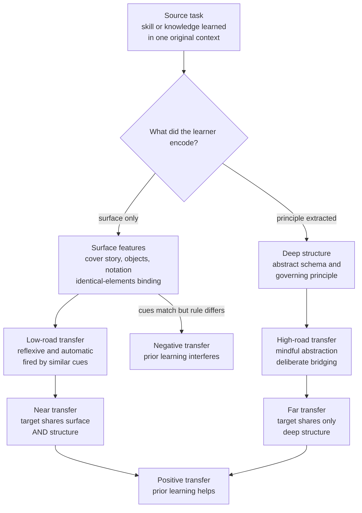

# 🔀 Transfer of Learning

> [!abstract] TL;DR
> **Transfer of learning** is the use of knowledge or a skill acquired in one context to solve a problem in a *different* context — and it is the entire point of education, because we can never train people on the exact situations they will actually face. The uncomfortable finding of a century of research is that transfer is **narrow and hard-won**: **near transfer** (to targets that share surface *and* deep structure) happens fairly readily, but **far transfer** (to targets that share only abstract structure) is rare and often fails outright. Thorndike's **identical-elements** theory explained why — the mind reuses only the specific components two tasks literally share — and Detterman later argued that most claimed far transfer is illusory. The lever that *does* work is teaching **deep structure**: abstract schemas, underlying principles, and worked analogies, practiced across **varied** surface contexts. This is the difference between Salomon & Perkins' **low-road** transfer (reflexive, cue-triggered, near) and **high-road** transfer (mindful abstraction, deliberately bridged, far) — and it is why "brain-training" games, "learning to think" claims, and the old "formal discipline" of Latin all failed to generalize.

---

## Intuition

**Analogy: the traveller who learned one city by its landmarks vs one city by its grid.**

Two people spend a month mastering their way around downtown Manhattan. The first memorizes routes by **landmarks**: "turn left at the red deli, go until the mural, the office is past the fountain." She is fast and confident *here*. Drop her in Chicago and she is helpless — the delis, murals, and fountains are gone, and she never learned anything portable. The second traveller instead learned the **structure**: Manhattan is a numbered grid, avenues run north–south, streets east–west, addresses climb predictably. Drop *him* in any grid city — Chicago, Salt Lake City, Kyoto's old core — and he navigates on day one. He transfers.

The landmarks are **surface features**: vivid, easy to learn, and worthless outside the original context. The grid is the **deep structure**: harder to extract, invisible if you only chase landmarks, but the only thing that survives a change of city. Every claim about transfer of learning is a claim about whether the learner encoded landmarks or the grid — and almost all of the difficulty of teaching is getting people to see the grid when the landmarks are so much easier to grab.

---

## How It Works

### Core mechanics

Transfer occurs when a learner's stored representation of a source task *matches* enough of a target task to be re-deployed there. What counts as "enough" is the whole story.

1. **Identical elements (Thorndike & Woodworth, 1901).** The founding law: task A transfers to task B only to the extent that B literally reuses specific components — stimulus–response bonds, facts, procedures — already trained in A. Transfer is not a general strengthening of "the mind"; it is componential overlap. This demolished the reigning **formal-discipline** theory (that studying Latin or geometry strengthens general reasoning "like a muscle"). Training reaction time on one set of stimuli barely improved it on new stimuli; the gains were bound to the trained elements.

2. **Surface vs deep (structural) similarity.** Two tasks can share **surface features** (cover story, objects, vocabulary, notation) or **deep structure** (the causal/relational schema, the governing principle, the solution procedure). *Near transfer* means the target shares both; *far transfer* means it shares only the deep structure. Learners are magnetically drawn to surface similarity — in Gick & Holyoak's classic studies, people who had just read a fortress-attack story usually *failed* to apply its "converging forces" solution to an analogous tumour-radiation problem, because the surface stories were unrelated. They had encoded the landmark, not the grid.

3. **Positive vs negative transfer.** *Positive* transfer: prior learning **helps** (knowing Spanish speeds learning Italian). *Negative* transfer: prior learning **interferes** — the reused component is a mismatch that must be unlearned (a driver from a right-hand-drive country stalling in left-hand traffic; a guitarist's finger habits fighting the violin; `for` loop indexing intuitions breaking in a 1-indexed language). Negative transfer is the dark twin of the identical-elements law: when surface cues match but the deep rule differs, the automatic re-deployment fires *wrongly*.

4. **Low-road vs high-road (Salomon & Perkins, 1989).** Two distinct routes to transfer. **Low-road** transfer is reflexive and automatic: extensive, varied practice makes a skill fire whenever a *perceptually similar* situation appears (a trained typist on any keyboard). It is efficient but inherently *near*. **High-road** transfer is effortful and mindful: the learner deliberately **abstracts** a principle out of the original context and consciously searches for where it applies. High-road is the only reliable route to *far* transfer, and it does not happen by accident — it must be provoked.

5. **Why far transfer is rare (Detterman's critique).** Reviewing decades of studies, Detterman (1993) argued that spontaneous far transfer is almost never observed unless the experimenter all but tells subjects to transfer; the "default" is specificity. Knowledge is encoded *situated* in its learning context, and the retrieval cues that would summon it in a new context are usually absent. Transfer is not the natural overflow of learning — it is a special achievement that instruction has to engineer.

### Conditions that promote transfer

The research converges on a short, actionable list:

- **Teach the deep structure explicitly.** Name the principle, the schema, the general form — do not leave it implicit under the surface story.
- **Varied practice / multiple examples.** Present the same principle across *different* surface contexts so the learner is forced to abstract what is common. This is exactly why [[Interleaving_and_Varied_Practice|interleaved, varied practice]] aids transfer while blocked drill on one context does not.
- **Analogical comparison.** Having learners *compare two analogues side by side* and map their shared relations dramatically raises later transfer — the mechanism studied in [[Analogical_Reasoning]] and [[Analogy_and_Conceptual_Metaphor]].
- **Self-explanation and abstraction prompts.** Asking "why does this work? what is the general rule here?" pushes encoding toward structure — the effect studied in [[Elaboration_and_Self_Explanation]].
- **Effortful, tested retrieval.** [[Retrieval_Practice_and_the_Testing_Effect|Retrieval practice]] under varied cues builds representations reachable from more directions, which is what a novel target context demands.
- **"Hugging and bridging" (Perkins & Salomon).** *Hugging* makes practice resemble the target context to secure low-road transfer; *bridging* deliberately draws out abstract connections to distant contexts to enable high-road transfer.



---

## Key Concepts

### Secondary Level

- **Transfer is the goal of learning.** You study so you can handle situations you were never explicitly taught. Learning that only works on the exact practice problems is nearly worthless.
- **Near vs far.** *Near* transfer is to something that looks and works like what you practiced (from practice division problems to a division problem on the test). *Far* transfer is to something that looks totally different but obeys the same underlying idea (from a physics lever to a business "leverage" argument). Near is common; far is hard.
- **Surface vs structure.** Two problems can look the same but work differently, or look different but work the same. Good learners chase the "works-the-same," which is the part that travels.
- **Help vs interference.** Prior learning usually helps (positive transfer), but sometimes it fights you when the new situation breaks the old habit (negative transfer) — like a video-game reflex that is wrong in a new game.

### Undergraduate Level

- **Identical-elements theory (Thorndike).** Transfer equals the specific components two tasks share; there is no general "mental muscle." This buried the **formal-discipline** doctrine and is why "Latin trains the mind" is false.
- **The surface-similarity trap.** Gick & Holyoak's fortress/tumour experiments: learners retrieve prior solutions by *surface* resemblance, so they miss deeply analogous problems dressed in different clothes. Providing *two* source analogues, or an explicit hint to compare, restores transfer — evidence that structure must be actively abstracted.
- **Low-road vs high-road (Salomon & Perkins, 1989).** Low-road = automatized skill generalizing across perceptually similar contexts via varied practice; high-road = deliberate, mindful abstraction of a principle and conscious mapping to a new domain. Far transfer essentially *requires* the high road.
- **Hugging and bridging.** Two teaching strategies: make practice look like the eventual application (hugging → low-road), or explicitly extract and connect the abstract principle to distant cases (bridging → high-road).
- **The transfer paradox.** Conditions that make training *feel* easy and fluent (blocked practice on one context, single worked format) produce the *least* transfer, while [[Interleaving_and_Varied_Practice|varied, interleaved practice]] produces more — transfer is one of the payoffs of the [[Desirable_Difficulties|desirable difficulties]] framework.

### Graduate Level

- **Detterman's "transfer is rare" thesis (1993).** A pointed review: spontaneous far transfer is almost never demonstrated cleanly; effects shrink as experimenters remove hints, and much of the literature confounds transfer with re-teaching. The strong claim — "if you want people to learn something, teach it to them; do not expect it to fall out of something else" — reframes transfer as the exception, not the rule.
- **Situated cognition and the specificity of encoding.** Knowledge is encoded bound to its context and cues (encoding-specificity, transfer-appropriate processing). Far transfer fails not because the knowledge is absent but because the target context does not *cue* it. This predicts that transfer is improved by training retrieval under varied cues, not by abstract "thinking skills" courses.
- **The failure of general-skills training.** Meta-analyses of **working-memory / brain-training** (e.g., n-back, Cogmed) show gains that transfer to *near* trained tasks but not to fluid intelligence or academic performance (Melby-Lervåg & Hulme; Owen et al., 2010, *Nature*). Same verdict for the **learning-styles** myth and generic "critical thinking" or "learning to learn" programs divorced from domain content: the general-transfer promise repeatedly fails the far-transfer test. Expertise and its transferable schemas are **domain-specific**.
- **Schema abstraction as the mechanism of far transfer.** What actually generalizes is an abstracted **schema** — a content-general relational structure induced from multiple varied instances. Analogical encoding (comparing cases to induce the common schema; Gentner, Loewenstein & Thompson, 2003) reliably raises far transfer, because it manufactures exactly the abstract representation that situated single-context learning withholds. This is the human analogue of representation learning in [[Transfer_Learning|machine transfer learning]]: a model (or mind) transfers only to the extent it has learned *features that are invariant across tasks* rather than surface statistics of the source.
- **Preparation for future learning (Bransford & Schwartz, 1999).** A reframing: measure transfer not as immediate isolated problem-solving but as whether prior learning helps a person *learn the new task faster* when given resources. By this "PFL" lens, well-structured learning transfers more than the pessimistic "sequestered problem-solving" paradigm suggests — the disagreement is partly about how you *measure* transfer.

---

## Python Demo

```python
# Near vs far transfer as a geometry of shared structure.
#
# A "task" produces labelled examples. Every example's label is generated by an
# INVARIANT deep-structure direction (the "grid"), while a separate SURFACE
# direction (the "landmarks") is ALSO predictive in the SOURCE task -- a
# spurious shortcut. Task "distance" d rotates these directions away from the
# source:
#     * the deep-structure direction rotates only SLIGHTLY (structure is shared
#       across contexts), so a learner keyed to structure keeps working.
#     * the surface direction rotates STRONGLY (landmarks vanish across
#       contexts), so a learner keyed to surface degrades fast -- and, once the
#       surface cue flips, its prior learning actively MISLEADS (negative transfer).
#
# We freeze two source-trained learners -- a SURFACE learner and a STRUCTURE
# learner -- and measure transfer accuracy on target tasks vs distance d.
# Result: transfer decays with distance for both, but training for structure
# FLATTENS the decay -> far transfer.
import numpy as np
import matplotlib.pyplot as plt

rng = np.random.default_rng(0)

D = 20                                  # feature dimensions
struct_idx = np.arange(0, D // 2)       # deep-structure subspace ("the grid")
surf_idx   = np.arange(D // 2, D)       # surface subspace ("the landmarks")

def unit_in(idx):
    v = np.zeros(D); v[idx] = rng.standard_normal(len(idx))
    return v / np.linalg.norm(v)

def ortho_unit_in(v, idx):              # unit vector in `idx` subspace, orthogonal to v
    r = np.zeros(D); r[idx] = rng.standard_normal(len(idx))
    r -= (r @ v) * v
    return r / np.linalg.norm(r)

# Invariant deep-structure direction (the TRUE rule) and the source surface shortcut.
w_struct = unit_in(struct_idx)          # STRUCTURE learner = keyed to the true rule
w_surf   = unit_in(surf_idx)            # SURFACE learner   = keyed to the shortcut
r_struct = ortho_unit_in(w_struct, struct_idx)   # rotation target for structure
r_surf   = ortho_unit_in(w_surf,   surf_idx)     # rotation target for surface

def rotate(v, r, theta):
    return np.cos(theta) * v + np.sin(theta) * r

A_STRUCT = 0.25 * np.pi   # structure rotates little with distance (shared across tasks)
A_SURF   = 1.00 * np.pi   # surface rotates a lot with distance (landmarks disappear)
STRENGTH = 1.5            # signal strength of each cue
NOISE    = 1.0

def transfer_accuracy(learner_w, d, n=4000):
    """Accuracy of a frozen source-trained learner on a target task at distance d."""
    y = rng.choice([-1.0, 1.0], size=n)
    u_struct = rotate(w_struct, r_struct, A_STRUCT * d)   # target's deep-structure axis
    u_surf   = rotate(w_surf,   r_surf,   A_SURF   * d)   # target's surface axis
    X = (y[:, None] * STRENGTH * u_struct[None, :]        # label carried by structure
         + y[:, None] * STRENGTH * u_surf[None, :]        # ...and by the surface cue
         + NOISE * rng.standard_normal((n, D)))
    pred = np.sign(X @ learner_w)
    return np.mean(pred == y)

distances = np.linspace(0.0, 1.0, 40)
surf_curve   = np.array([np.mean([transfer_accuracy(w_surf,   d) for _ in range(5)])
                         for d in distances])
struct_curve = np.array([np.mean([transfer_accuracy(w_struct, d) for _ in range(5)])
                         for d in distances])

# ---- report a few landmarks along the curve ----
for label, d in [("source (near)", 0.0), ("mid", 0.5), ("far", 1.0)]:
    i = int(np.argmin(np.abs(distances - d)))
    print(f"d={distances[i]:.2f} [{label:>13}]  "
          f"surface={surf_curve[i]:.2f}   structure={struct_curve[i]:.2f}")

# ---- plot: transfer performance vs task distance ----
plt.figure(figsize=(9, 5.5))
plt.plot(distances, struct_curve, color="#2563eb", lw=2.4,
         label="Structure-trained learner  (abstract rule)")
plt.plot(distances, surf_curve, color="#dc2626", lw=2.4,
         label="Surface-trained learner  (landmarks / shortcut)")
plt.axhline(0.5, color="gray", ls="--", lw=1.2, label="chance")
plt.fill_between(distances, surf_curve, 0.5, where=(surf_curve < 0.5),
                 color="#dc2626", alpha=0.15, label="negative transfer (interference)")
plt.annotate("NEAR\ntransfer", xy=(0.03, 0.9), fontsize=9, color="#444")
plt.annotate("FAR\ntransfer", xy=(0.85, 0.9), fontsize=9, color="#444")
plt.xlabel("Task distance  d   (surface + structural shift from source)")
plt.ylabel("Transfer accuracy on target task")
plt.title("Transfer decays with distance; training for structure flattens the decay")
plt.ylim(0.0, 1.02)
plt.legend(loc="lower left", fontsize=9)
plt.grid(alpha=0.3)
plt.tight_layout()
plt.savefig("transfer_of_learning.png", dpi=150)
print("Saved transfer_of_learning.png")
```

**What the demo shows.** At **distance 0** (the source task itself) both learners are near-perfect: the surface shortcut and the true rule are equally predictive *here*, so near transfer works either way. As task **distance grows**, the target's surface direction rotates away from what the surface learner memorized, so its accuracy **collapses through chance and below** — past the halfway point the old shortcut points the *wrong* way and the surface learner suffers **negative transfer** (its prior learning actively misleads, the red shaded region). The **structure learner** barely moves: because the deep-structure direction is nearly shared across tasks, its frozen weights still align with the target, so far transfer accuracy stays high. The single design choice — *train on the invariant structure instead of the surface shortcut* — is what turns a steep transfer cliff into a gentle slope. That is the whole pedagogy of transfer in one figure.

---

## Real-World Applications

> **Example — machine transfer learning as the engineered mirror.** A CNN or transformer pretrained on a huge, varied corpus learns **task-invariant features** (edges, textures, syntax, semantics) in its early layers; fine-tuning re-uses those on a new task with little data. This is Thorndike's identical-elements law made literal — transfer works exactly to the degree the pretrained representation shares structure with the target — and it fails ("negative transfer" / domain shift) when the source features do not match. See [[Transfer_Learning]].

- **Mathematics and physics education.** Students who drill one problem *format* solve near-identical test items but stall on structurally identical "word problems" in new cover stories. Curricula that teach the *schema* (rate problems, conservation principles) across varied surfaces, and have students *compare* analogous problems, measurably improve far transfer.
- **Professional and medical training.** Case-based teaching deliberately varies the surface presentation of the same underlying diagnosis so clinicians abstract the pattern rather than memorizing one vignette — hugging (realistic simulation) plus bridging (extracting the general rule).
- **Aviation and simulation.** High-fidelity simulators exploit *low-road* transfer: practice is made perceptually near to the cockpit so trained responses fire automatically in the real aircraft. Negative-transfer analysis is standard when pilots move between aircraft types whose controls conflict.
- **The cautionary tale — "brain training."** Commercial cognitive-training and "learning-styles" products promise *far* transfer (raise your IQ, boost school performance). Large studies (Owen et al., 2010; Simons et al., 2016 consensus) find gains confined to the trained tasks — a textbook far-transfer failure and a direct modern echo of the discredited formal-discipline theory.
- **Onboarding transferable engineers.** Teaching *concepts* (data structures, invariants, design principles) rather than one framework's API is a bet on far transfer: principles survive the next tech stack; memorized syntax is a landmark that vanishes.

---

## Common Pitfalls

- **Assuming transfer is automatic.** The default of learning is *specificity*: knowledge stays glued to its training context. Far transfer must be **engineered** (varied examples, explicit principles, comparison), never assumed to "fall out" of ordinary practice.
- **Teaching to surface fluency.** Blocked drill on one problem format produces smooth in-session performance and *terrible* transfer, because learners latch onto surface cues. The techniques that build transfer feel harder — this is a [[Desirable_Difficulties|desirable difficulty]], not a teaching failure.
- **Believing in general "thinking skills."** Chess, coding, Latin, or n-back training do not broadly sharpen "the mind." Cognitive skill is largely **domain-specific**; the transferable asset is an abstract *schema* built from real domain content, not a context-free faculty.
- **Ignoring negative transfer.** When a new context *looks* like an old one but obeys a different rule, prior habits fire wrongly (interference). Anticipate it explicitly when learners cross between similar-looking systems (a new language, a mirrored control scheme, a changed convention).
- **Single-example instruction.** One worked example teaches the surface story. It takes *multiple varied* examples plus active comparison to induce the schema that actually transfers — one instance cannot separate the grid from the landmarks.
- **Measuring transfer only by immediate sequestered problem-solving.** By the *preparation-for-future-learning* view, learning may transfer as a faster *ability to learn* the new task, which a one-shot test misses. Choosing the wrong measure makes real transfer look like no transfer.

---

## Related Concepts

- [[Analogical_Reasoning]] — the core mechanism of far transfer: mapping shared *relational structure* from a source to a target while ignoring surface differences; comparing analogues is the most reliable way to induce a transferable schema.
- [[Analogy_and_Conceptual_Metaphor]] — the cognitive-science account of structure mapping and how abstract schemas are projected across domains, the substrate of high-road transfer.
- [[Transfer_Learning]] — the machine-learning analogue: pretrained models transfer only via *task-invariant features*, and suffer negative transfer under domain shift — Thorndike's identical elements in silicon.
- [[Interleaving_and_Varied_Practice]] — varying the surface context of practice forces abstraction of the common structure, the single most practical driver of transfer over blocked, single-context drill.
- [[Desirable_Difficulties]] — Bjork's framing that transfer is a payoff of training conditions that feel harder in the moment (varied, interleaved, spaced, tested) but build more generalizable representations.
- [[Retrieval_Practice_and_the_Testing_Effect]] — effortful recall under varied cues makes knowledge reachable from more directions, which a novel target context requires.
- [[Elaboration_and_Self_Explanation]] — asking "why" and "what is the general rule" pushes encoding from surface features toward the deep structure that transfers.
- [[Cognitive_Load_and_Learning]] — transfer depends on well-built long-term *schemas*; conditions that raise germane, schema-building load aid transfer even though they feel harder in the moment.
- [[Deliberate_Practice_and_Expertise]] — expert skill is highly domain-specific; deliberate practice builds transferable schemas within a domain, not a general "trained mind."
- [[Theories_of_Learning]] — situated, constructivist, and cognitivist accounts each frame *why* knowledge is context-bound and what it takes to generalize it beyond the original setting.

---

## Review Questions

**Tier 1 — Conceptual (can you explain it to a peer?)**
1. Distinguish near from far transfer using the surface/structure distinction, and explain why Thorndike's identical-elements theory predicts that far transfer should be rare.
2. Give one clean example each of *positive* and *negative* transfer, and explain in terms of "reused components" why the same mechanism produces both.

**Tier 2 — Applied / scenario**
3. Students master a set of practice physics problems but fail structurally identical problems dressed in new cover stories on the exam. Diagnose what they encoded, and design three concrete instructional changes (drawing on varied practice, analogical comparison, and hugging/bridging) that would raise far transfer.
4. A company sells "brain-training" games claiming they boost general intelligence and job performance. Using the far-transfer literature (Owen et al.; the fate of formal-discipline theory), predict what the games *will* and *will not* improve, and state the single measurement that would expose the claim.

**Tier 3 — Analytical / trade-off**
5. In the Python demo, the structure-trained learner keeps high accuracy across distance while the surface-trained learner drops *below chance*. Explain geometrically why below-chance accuracy occurs, why it is a model of *negative* transfer, and what teaching move corresponds to "rotating a learner from the red curve onto the blue curve."
6. Detterman argues far transfer is essentially never observed, while Bransford & Schwartz argue it appears once you measure "preparation for future learning." Are these claims contradictory or complementary? Frame the disagreement as a dispute about how transfer is *operationalized*, and say which measure you would trust for evaluating a curriculum.

---

## Sources

- Thorndike, E. L., & Woodworth, R. S. (1901). "The influence of improvement in one mental function upon the efficiency of other functions." *Psychological Review*, 8(3), 247–261. The identical-elements theory that killed formal discipline.
- Gick, M. L., & Holyoak, K. J. (1983). "Schema induction and analogical transfer." *Cognitive Psychology*, 15(1), 1–38. The fortress/tumour experiments on surface vs structural retrieval.
- Salomon, G., & Perkins, D. N. (1989). "Rocky roads to transfer: Rethinking mechanisms of a neglected phenomenon." *Educational Psychologist*, 24(2), 113–142. Low-road vs high-road transfer, hugging and bridging.
- Barnett, S. M., & Ceci, S. J. (2002). "When and where do we apply what we learn? A taxonomy for far transfer." *Psychological Bulletin*, 128(4), 612–637.
- Detterman, D. K. (1993). "The case for the prosecution: Transfer as an epiphenomenon." In *Transfer on Trial: Intelligence, Cognition, and Instruction.* The "transfer is rare" critique.
- Owen, A. M., et al. (2010). "Putting brain training to the test." *Nature*, 465, 775–778. The far-transfer failure of cognitive-training games.

---

#learning-science #transfer #near-transfer #far-transfer #generalization
