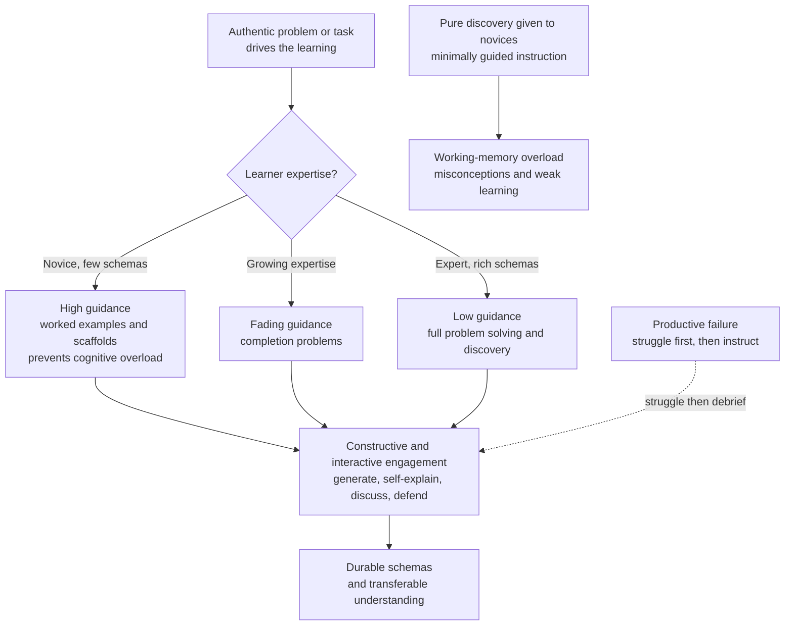

# 🧪 Active and Problem-Based Learning

> [!abstract] TL;DR
> **Active learning** replaces passive reception with *doing and reflecting*: students generate answers, explain to each other, and wrestle with problems instead of watching an expert perform. Freeman et al.'s 2014 meta-analysis of 225 STEM studies found active learning raises exam scores by about **0.47 standard deviations** and cuts failure rates from roughly 34 percent to 22 percent — an effect so large the authors argued lecture-only courses would be unethical in a drug trial. **Problem-based learning** (Barrows) drives that engagement with authentic, ill-structured problems. But there is a hard constraint: **active is not the same as unguided**. Kirschner, Sweller, and Clark showed that *minimally guided* discovery fails novices, who lack the schemas to navigate open problems and overload their working memory. The resolution is **guided active learning** — worked examples and scaffolds for beginners, faded to independent problem-solving as expertise grows (the guidance-fading effect), with carefully staged **productive failure** (Kapur) where useful.

## Intuition

**Analogy: learning to cook versus watching a cooking show.**

You can watch a celebrity chef debone a fish flawlessly for twenty seasons and still mangle your first attempt, because *watching* builds a comfortable illusion of competence while your hands learn nothing. The moment you pick up the knife — feeling the resistance, botching the cut, adjusting — is the moment learning actually happens. That is active learning: the gap between recognizing a skill and being able to *generate* it.

But now imagine your very first cooking lesson is "here is a kitchen and a whole fish, figure it out." With no idea what a fillet knife does or where the spine runs, you flail, cut yourself, and give up — that is **pure discovery**, and for a novice it is worse than useless. The expert cook, by contrast, *thrives* when simply handed the fish and left alone; instructions would only slow them down. The right amount of guidance is not fixed — it starts high and **fades** as you build the schemas that let you improvise. Good teaching is knowing exactly when to take the training wheels off.

---

## How It Works

### The generation and engagement principle

The engine underneath active learning is **generation**: information you produce yourself is remembered far better than information you merely read. Retrieving an answer, predicting an outcome, or explaining a step forces the brain to build and strengthen the retrieval pathways that reproduction depends on. Passive review skips that construction, which is why re-reading feels productive but leaves little behind. Active learning is, mechanically, a delivery system for continuous generation.

**Chi's ICAP framework** turns "engagement" from a vague virtue into a testable ordering. It predicts that learning quality rises monotonically across four modes of activity:

1. **Passive** — receiving without overt action (listening, watching). Weakest.
2. **Active** — physically manipulating material (highlighting, copying, pausing a video). Better, but often shallow.
3. **Constructive** — *generating* something beyond what was given (self-explaining, drawing a concept map, posing a question, inferring). Substantially better.
4. **Interactive** — co-constructing through substantive dialogue (arguing, defending, building on a partner's idea). Strongest, because each partner triggers constructive processing in the other.

The prediction, backed by many studies, is **Interactive > Constructive > Active > Passive**. Crucially, "active" in the everyday sense (busy hands) sits only second from the bottom — clicking and highlighting is not where the payoff lives. The payoff is in *constructing new knowledge*, which is exactly what a good problem forces.

### Problem-, project-, and inquiry-based learning

These are the classroom vehicles for constructive and interactive engagement:

- **Problem-based learning (PBL)**, formalized by Howard Barrows in medical education, starts each unit with an authentic, **ill-structured problem** (a patient with ambiguous symptoms) *before* teaching the content. Students identify what they need to know, research it, and apply it — learning the material as a tool for solving the case rather than as an abstract syllabus.
- **Project-based learning** organizes a stretch of learning around producing an artifact (a working device, a report, an app), foregrounding planning, iteration, and integration of skills.
- **Inquiry and discovery learning** ask students to investigate questions and *derive* principles themselves rather than being told them.

All three raise motivation and transfer when done well — and all three fail badly when the guidance is stripped out.

### The guidance debate: why minimally guided instruction does not work

Kirschner, Sweller, and Clark's 2006 paper "Why Minimal Guidance During Instruction Does Not Work" is the field's central warning. Their argument runs directly through **cognitive load** and **schema** theory:

- Novices have **no schemas** for the domain, so an open problem offers no structure to hang thinking on. They fall back on weak, load-heavy strategies like means-ends search, which consume the entire working-memory budget and leave nothing for building the schema the lesson was supposed to teach.
- Worse, unguided discovery lets learners **encode misconceptions** or wander to dead ends, and there is no reliable mechanism to correct them in real time.
- The evidence base — from many controlled comparisons — favors **strong instructional guidance** for novices: explicit instruction and **worked examples** beat pure discovery on both learning and efficiency.

The subtle point people miss: this is *not* an argument against active learning. It is an argument that engagement must be **scaffolded**. Worked examples are themselves an active study strategy when paired with self-explanation. The failure mode is not "students doing things" — it is "students doing things with no map."

### The resolution: guidance-fading and productive failure

The apparent conflict between "active learning wins" and "discovery fails" dissolves once guidance is treated as a *variable that changes with expertise*, not a fixed policy:

- **The guidance-fading effect.** The optimal amount of support declines as the learner builds schemas. The canonical trajectory is: study **worked examples** → practice **completion problems** (finish a partially worked solution) → solve **full problems independently**. Keeping heavy guidance too long triggers the **expertise-reversal effect**, where scaffolding a novice needed becomes redundant load that *slows* an expert. Guidance is not good or bad; it is *timed*.
- **Productive failure (Kapur).** A deliberate, bounded reconciliation: let students *struggle* with a challenging problem *before* instruction, even though they will mostly fail to solve it. That struggle activates prior knowledge, surfaces the gaps, and primes them to grasp the eventual explanation far more deeply — outperforming students who received the instruction first. The failure is "productive" precisely because it is **followed by** consolidating instruction, not left hanging. It is discovery *with a safety net and a debrief*.

### Delivery mechanisms in real classrooms

- **Flipped classroom** — move passive content delivery (lectures) to homework video, and spend precious class time on active problem-solving and discussion where a guide is present. It reallocates the interactive minutes to where they matter.
- **Peer instruction (Mazur)** — pose a conceptual question, have students commit to an answer, then discuss with a neighbor and re-answer. The gain comes from the constructive act of *explaining and defending*, which exposes and repairs misconceptions.
- **Think-pair-share** — the lightweight, low-prep version of the same interactive loop: think alone, pair to compare, share to the room.



---

## Key Concepts

### Secondary (intuitive level)

- You learn by *doing and explaining*, not by watching or re-reading — the person doing the work is the person doing the learning.
- Working through problems and talking them over with a partner beats sitting through a lecture, especially in science and maths.
- "Figure it all out on your own" does **not** work when you are a total beginner — you need a guide and some worked examples first.
- The training wheels should come off gradually: lots of help at the start, less and less as you get good.

### Undergraduate (mechanistic level)

- **Freeman et al. (2014):** meta-analysis of 225 STEM courses; active learning raised exam performance ~**0.47 SD** and lowered failure rates from ~34 percent to ~22 percent (odds of failing roughly **1.95x** higher under lecture).
- **ICAP framework (Chi):** learning quality follows **Interactive > Constructive > Active > Passive**; the win is *constructive* generation, not just physical activity.
- **The generation effect:** self-produced information is retained better than presented information, because retrieval and construction strengthen memory pathways.
- **Kirschner, Sweller & Clark (2006):** minimally guided instruction fails novices — no schemas means load-heavy search and unchecked misconceptions; explicit guidance and worked examples win for beginners.
- **Guidance-fading effect:** worked examples → completion problems → independent problems, matching support to growing expertise; overstaying guidance causes **expertise reversal**.

### Graduate (theoretical and design level)

- **Productive failure (Kapur, 2008–2016):** a designed sequence of *exploration before instruction* that reliably beats *instruction before exploration* on conceptual understanding and transfer, provided the struggle is bounded and followed by consolidation. Reconciles the discovery-vs-guidance camps by separating *when* to withhold guidance (during activation) from *whether* to provide it at all (always, eventually).
- **Load-theoretic account of PBL:** ill-structured problems have very high element interactivity; without prior schemas they exceed working-memory capacity. PBL's success in medical education depends on facilitation, prior knowledge, and scaffolds — stripping these reproduces the discovery-learning failures.
- **The engagement-vs-load tension:** active methods deliberately add *desirable difficulty* (germane load), but the same manipulation can tip into overload if intrinsic and extraneous load are not controlled. Design is a balancing act between enough struggle to force construction and not so much that schemas never form.
- **Effect-size caveats and mechanisms:** Freeman's 0.47 SD is an average over heterogeneous "active" interventions; the term covers everything from clicker questions to full PBL, and moderator analyses show class size, discipline, and *implementation fidelity* matter. The construct is real but coarse — "active learning" is a family, not a single treatment.

---

## Python Demo

```python
# Simulate the Freeman et al. (2014) meta-analysis result for active learning,
# and illustrate the guidance-vs-discovery tradeoff.
#
# Panel 1: exam-score DISTRIBUTIONS. Active learning shifts scores by ~0.47 SD.
# Panel 2: FAILURE RATES fall from ~34% (lecture) toward ~22% (active).
# Panel 3: GUIDANCE-FADING. Pure discovery underperforms guided instruction for
#          novices; the optimal guidance level is lower for experts and must FADE.

import numpy as np
import matplotlib.pyplot as plt

rng = np.random.default_rng(42)

# ---- Freeman et al. (2014) parameters ----
N            = 40000
sd           = 20.0                          # SD of exam scores (points)
mean_lecture = 68.0                          # traditional lecture mean
effect_size  = 0.47                          # active-learning boost, in SD units
mean_active  = mean_lecture + effect_size * sd   # shift the whole distribution
pass_mark    = 60.0                          # below this = fail (D / F / withdraw)

lecture = rng.normal(mean_lecture, sd, N)
active  = rng.normal(mean_active,  sd, N)

fail_lecture = np.mean(lecture < pass_mark) * 100.0
fail_active  = np.mean(active  < pass_mark) * 100.0

# odds ratio of failing under lecture vs active (Freeman reported ~1.95)
odds = (fail_lecture / (100 - fail_lecture)) / (fail_active / (100 - fail_active))

# ---- guidance vs discovery (Kirschner/Sweller + guidance-fading) ----
g = np.linspace(0.0, 1.0, 200)   # guidance level: 0 = pure discovery, 1 = fully worked
def outcome(guidance, g_star, spread=0.95):
    # inverted parabola: learning peaks at the learner's optimal guidance g_star
    return 1.0 - spread * (guidance - g_star) ** 2
novice = outcome(g, 0.80)        # novice needs strong guidance
expert = outcome(g, 0.30)        # expert learns best with faded guidance

fig, (ax1, ax2, ax3) = plt.subplots(1, 3, figsize=(16, 5))

# Panel 1: score distributions
bins = np.linspace(10, 130, 60)
ax1.hist(lecture, bins=bins, density=True, alpha=0.5, color="#dc2626", label="Traditional lecture")
ax1.hist(active,  bins=bins, density=True, alpha=0.5, color="#2563eb", label="Active learning")
ax1.axvline(pass_mark,    color="black",   ls="--", lw=1.5, label=f"Pass mark = {pass_mark:.0f}")
ax1.axvline(mean_lecture, color="#dc2626", ls=":")
ax1.axvline(mean_active,  color="#2563eb", ls=":")
ax1.set_xlabel("Exam score")
ax1.set_ylabel("Density of students")
ax1.set_title(f"Active learning shifts scores +{effect_size} SD")
ax1.legend(fontsize=8)

# Panel 2: failure rates
ax2.bar(["Lecture", "Active"], [fail_lecture, fail_active], color=["#dc2626", "#2563eb"])
for i, v in enumerate([fail_lecture, fail_active]):
    ax2.text(i, v + 0.6, f"{v:.0f}%", ha="center", fontweight="bold")
ax2.set_ylabel("Failure rate  [percent below pass mark]")
ax2.set_title("Active learning cuts the failure rate")
ax2.set_ylim(0, max(fail_lecture, fail_active) * 1.35)

# Panel 3: guidance vs discovery
ax3.plot(g, novice, color="#2563eb", lw=2, label="Novice")
ax3.plot(g, expert, color="#16a34a", lw=2, label="Expert")
ax3.axvline(0.0, color="gray", ls=":", alpha=0.7)
ax3.annotate("pure discovery\nfails novices", xy=(0.0, outcome(0.0, 0.80)),
             xytext=(0.15, 0.15), fontsize=8, color="gray",
             arrowprops=dict(arrowstyle="->", color="gray"))
ax3.scatter([0.80], [outcome(0.80, 0.80)], color="#2563eb", zorder=5)
ax3.scatter([0.30], [outcome(0.30, 0.30)], color="#16a34a", zorder=5)
ax3.annotate("guidance\nmust fade", xy=(0.55, 0.9), fontsize=8, color="black",
             ha="center")
ax3.set_xlabel("Guidance level  [0 = discovery, 1 = fully worked]")
ax3.set_ylabel("Learning outcome")
ax3.set_title("Guidance must fit expertise, then fade")
ax3.set_ylim(0, 1.05)
ax3.legend(fontsize=8)

plt.tight_layout()
plt.show()

print(f"Lecture: mean = {lecture.mean():.1f}, failure = {fail_lecture:.1f}%")
print(f"Active : mean = {active.mean():.1f}, failure = {fail_active:.1f}%")
print(f"Odds of failing (lecture vs active) ~ {odds:.2f}x  (Freeman reported ~1.95)")
print(f"Novice best guidance ~0.80; Expert best guidance ~0.30  -> guidance fades")
```

Running it reproduces the meta-analysis. Shifting the entire score distribution by 0.47 SD moves the mean from 68 to about **77**, which drops the fraction of students below the pass mark from roughly **34 percent to around 19 percent** and yields an odds ratio near **2.2x** — squarely in Freeman's reported range. Panel 3 makes the guidance point unmistakable: the novice curve peaks at **high** guidance and crashes at the pure-discovery end (guidance = 0), while the expert curve peaks at **low** guidance. Same activity, opposite optimal support — which is exactly why active learning must be *guided*, and why that guidance must *fade*.

---

## Real-World Applications

- **Medical education (PBL's birthplace):** McMaster and Maastricht built entire MD curricula around small-group problem-based case work — students diagnose authentic patient cases before formal lectures, with a tutor facilitating rather than lecturing.
- **University STEM reform:** peer instruction (Mazur's introductory physics at Harvard), clicker questions, and flipped classes are now mainstream responses to the Freeman evidence; many large universities restructured gateway courses to add in-class problem-solving.
- **Corporate and technical training:** scenario-based and simulation training (aviation simulators, incident-response "game days" in SRE) drop learners into authentic problems with heavy scaffolding that fades as competence grows.
- **K-12 project-based learning:** design challenges and inquiry units (build a bridge, investigate local water quality) — effective when teachers embed explicit instruction and worked examples, weak when they leave students to "just explore."
- **Coding bootcamps and MOOCs:** interactive coding exercises, pair programming, and graded projects operationalize constructive and interactive engagement; the best add worked-example walkthroughs before turning learners loose.

---

## Common Pitfalls

- **Equating "busy" with "learning."** Highlighting, copying slides, and clicking through an interactive widget are only *Active* on the ICAP ladder — near the bottom. Without a constructive generation step, engagement is theater. Design for self-explanation, prediction, and dialogue, not motion.
- **Handing novices open problems (the discovery trap).** Pure inquiry with no scaffolds overloads beginners, wastes time on unproductive floundering, and lets misconceptions harden. Provide worked examples and structure first; fade later.
- **Never fading the guidance (expertise reversal).** Keeping heavy step-by-step support once learners have schemas turns helpful scaffolding into redundant load that *slows* them. Guidance is a dial, not a switch.
- **Struggle without a debrief.** Productive failure only works if the struggle is *followed* by consolidating instruction. Struggle left unresolved is just failure — it entrenches confusion and frustration.
- **Treating "active learning" as one thing.** The 0.47 SD is an average over wildly different interventions. Copying a clicker gimmick without the underlying constructive/interactive design will not reproduce the effect; implementation fidelity is everything.
- **Ignoring the confidence-competence gap.** Students often *rate passive lectures higher* even while learning less from them, because fluent delivery feels like understanding. Active methods can feel harder and less pleasant while producing more learning — do not steer by comfort ratings.

---

## Related Concepts

- [[Cognitive_Load_and_Learning]] — the load-and-schema theory that explains *why* pure discovery fails novices and *why* worked examples and guidance-fading work.
- [[Retrieval_Practice_and_the_Testing_Effect]] — the generation principle in its purest form; active learning is largely a delivery system for continuous retrieval and generation.
- [[Desirable_Difficulties]] — the family of effortful conditions (including productive failure) that feel harder yet deepen learning; the theoretical home of "good struggle."
- [[Reflection_and_Feedback]] — active engagement only converts to learning when errors are surfaced and corrected; the debrief that makes productive failure productive.
- [[Problem_Solving_and_Insight]] — means-ends search is the load-heavy strategy novices fall back on in open problems, which worked examples are designed to bypass.
- [[Schemas_and_Mental_Models]] — the organized knowledge structures novices *lack*, which is the root reason unguided discovery overloads them.

---

## Review Questions

**Tier 1 — Recall / Comprehension**
1. State the headline result of Freeman et al. (2014) in both effect-size and failure-rate terms. What subject area did the meta-analysis focus on?
2. List the four levels of Chi's ICAP framework in order of learning quality, and give a one-line example of each.

**Tier 2 — Application**
3. A teacher launches a unit by giving beginner students an open, ill-structured engineering problem with no instruction, expecting "discovery." Using cognitive-load and schema theory, predict what happens and redesign the unit so it stays *active* while adding appropriate guidance.
4. Using the demo's model, a cohort has lecture scores distributed as N(68, 20) with a pass mark of 60. Estimate roughly how the failure rate changes when active learning shifts the mean by +0.47 SD, and explain why a *distribution shift* (not just a mean change) is the right way to think about the failure-rate drop.

**Tier 3 — Analysis / Synthesis**
5. Kirschner/Sweller/Clark say "minimal guidance does not work," yet Kapur's productive failure deliberately withholds guidance during initial struggle. Explain precisely why these two claims are *not* contradictory, and design a single lesson sequence for a novice topic that honors both — specifying where guidance is withheld, where it is provided, and what signal tells you to fade it.

---

## Sources

- Freeman, S., et al. (2014). "Active learning increases student performance in science, engineering, and mathematics." *PNAS*, 111(23), 8410–8415.
- Kirschner, P. A., Sweller, J., & Clark, R. E. (2006). "Why minimal guidance during instruction does not work." *Educational Psychologist*, 41(2), 75–86.
- Chi, M. T. H., & Wylie, R. (2014). "The ICAP framework: Linking cognitive engagement to active learning outcomes." *Educational Psychologist*, 49(4), 219–243.
- Kapur, M. (2008). "Productive failure." *Cognition and Instruction*, 26(3), 379–424.
- Barrows, H. S. (1996). "Problem-based learning in medicine and beyond: A brief overview." *New Directions for Teaching and Learning*, 1996(68), 3–12.

---

#learning-science #active-learning #problem-based-learning #inquiry #guided-instruction
