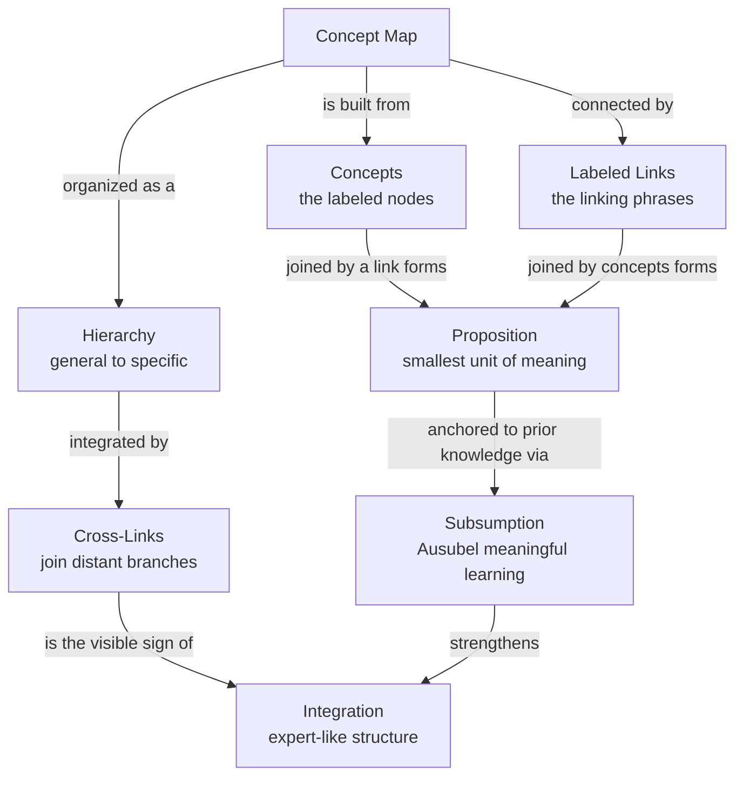

# 🕸️ Concept Mapping and Knowledge Organization

> [!abstract] TL;DR
> A **concept map** (Joseph Novak, 1970s) represents knowledge as a graph: **concepts are nodes**, **labeled links are the relationships**, and a concept–link–concept triple is a **proposition** — the smallest unit of meaning. Good maps are **hierarchical** (general concepts at the top, specific ones below) and stitched together by **cross-links** that connect distant branches. The theory behind them is **Ausubel's meaningful learning**: new material sticks when it is **subsumed** under relevant ideas you already hold, rather than memorized in isolation. The deeper lesson is that **how knowledge is organized matters as much as how much you have** — experts' knowledge is densely and hierarchically connected, novices' is sparse and fragmentary (Chi), and well-organized knowledge is retrieved and transferred far better. Concept mapping is worth doing chiefly as a **learner-generated, active elaboration and self-diagnostic** activity; its measured effect is moderate and comes almost entirely from *making* the map, not from studying someone else's.

---

## Intuition

**Analogy: a city with roads versus a warehouse of unlabeled boxes.** Imagine two people who own the same 200 facts. The first keeps them as boxes stacked in a warehouse — each fact sealed, unlabeled, reachable only if you happen to remember exactly which shelf it sits on. The second has laid out the same facts as *buildings in a city*, connected by named roads: "the market *supplies* the harbor," "the harbor *feeds* the railway." When you need something in the warehouse and forget its shelf, it is simply lost. When you need something in the city, even if you forget the address, you can *drive to it* — start from any landmark you do remember and follow the roads until you arrive. You can also see routes nobody told you about: if the market feeds the harbor and the harbor feeds the railway, then the market reaches the railway, an inference the roads make visible.

A concept map is that road network drawn on paper. The buildings are **concepts**, the named roads are **labeled links**, and each "market *supplies* harbor" road is a **proposition**. The warehouse owner has facts; the city-dweller has *organized* knowledge — and organization is exactly what lets you retrieve what you almost forgot and infer what you were never told. That is the whole reason study strategy cares about structure and not just quantity.

---

## How It Works

### Core mechanics of a Novakian concept map

1. **Concepts are nodes.** A concept is a perceived regularity in events or objects, given a label — "photosynthesis," "inflation," "recursion." In a map it is a boxed word or short phrase.
2. **Links are labeled, and the label carries the meaning.** An arrow from `Plant` to `Sunlight` is useless until you write *what* connects them: "requires," "converts," "is inhibited by." The **linking phrase** is what distinguishes a concept map from a mere bubble diagram.
3. **Concept + link + concept = a proposition.** `Plants` → *"convert"* → `Sunlight` is a claim that can be true or false. A concept map is therefore a set of **testable propositions**, which is why it doubles as an assessment instrument: wrong linking phrases expose misconceptions directly.
4. **Hierarchy: general at the top, specific below.** The most inclusive, general concepts sit at the top; more specific, less inclusive ones cascade downward. This visual hierarchy mirrors how Ausubel argued knowledge is stored — under a small number of superordinate anchoring ideas.
5. **Cross-links tie the branches together.** The highest-value feature: a link that connects a concept in one region of the map to a concept in a distant region. Cross-links are the visible evidence of **integration** — seeing that two things you learned separately are related is a hallmark of genuine understanding and the thing novices' maps most conspicuously lack.
6. **The map is progressively differentiated.** You start with a focus question and a few top concepts, then differentiate downward and reconcile across branches, revising as new relations surface. The *act of revising* is where the learning happens.

### The theoretical basis: Ausubel's meaningful learning and subsumption

Novak built concept maps as a tool to operationalize **David Ausubel's** theory. Ausubel's one-line thesis: *"The most important single factor influencing learning is what the learner already knows."* Learning is **meaningful** (as opposed to **rote**) to the degree that new material is consciously related to relevant existing ideas — a process he called **subsumption**: the new concept is filed *underneath* a broader anchoring idea already in the learner's cognitive structure. Rote learning attaches material arbitrarily and verbatim, with no anchor, so it decays fast and transfers to nothing. Meaningful learning anchors material to structure, so it is retained, is retrievable through many paths, and supports inference. A concept map is quite literally a picture of subsumption: the hierarchy *is* the set of anchoring relations, and building the map forces you to decide where each new idea attaches.

### Why organization matters: expert versus novice knowledge

The payoff of organization is dramatized by expertise research. In the classic study, **Chi, Feltovich, and Glaser (1981)** asked novices and expert physicists to sort physics problems into categories. Novices grouped by **surface features** — "these both have inclined planes," "these both have springs." Experts grouped by **deep principle** — "these are both conservation-of-energy problems," even when the surface details looked nothing alike. The experts were not merely holding *more* facts; their knowledge was **organized around principles**, hierarchically, so that a new problem activated the right solution schema immediately. Expertise is reorganization, not just accumulation. Well-structured knowledge is retrieved faster (more retrieval paths), transfers better (organized by transferable principle rather than surface skin), and makes inference cheap (the structure does part of the reasoning for you).

### Concept mapping as an active strategy and a diagnostic tool

Two distinct uses:

- **As a generative study strategy.** Building a map is a form of **elaboration**: you must retrieve concepts, decide relationships, name them, and reconcile contradictions — all effortful, meaning-focused processing. This is why *learner-generated* maps help and *pre-made* maps help far less: the value is in the construction.
- **As an assessment and self-diagnosis.** Because every link is a stated proposition, a map makes a learner's structure — and its holes — **visible**. Missing cross-links reveal fragmented knowledge; a wrong linking phrase ("mass *causes* weight" vs "mass *and gravity determine* weight") pinpoints a misconception a multiple-choice test would miss. Used on yourself, this is metacognition made concrete: the map shows you what you cannot yet connect.

### A concept map of concept mapping



---

## Key Concepts

### Secondary (explain to a curious beginner)
- **A concept map is a diagram of ideas joined by named arrows.** Draw the ideas as boxes, connect related ones with arrows, and — this is the key part — *write on the arrow what the relationship is*. "Rain → *fills* → River" tells a little true sentence.
- **General ideas go on top, specific ones below.** Put the big umbrella idea at the top and hang the details underneath it, so the picture shows what belongs under what.
- **The best maps have "shortcut" links across the page.** When two ideas in different corners turn out to be related, draw a line between them. Spotting those connections is a sign you really understand.
- **Make your own map, do not just read one.** The learning comes from *building* it — deciding what connects to what. A map someone hands you is far less useful than one you struggled to draw.

### Undergraduate (needs some cognitive-science background)
- **Proposition as the unit of meaning (Novak).** Concept + linking phrase + concept forms a proposition that is true or false; a map is a network of such propositions, which makes it both an expression of understanding and a testable object.
- **Ausubel's meaningful vs rote learning and subsumption.** New material is retained to the extent it is *non-arbitrarily* related to relevant existing anchoring ideas. Concept maps externalize this: the hierarchy shows the subsumptive anchors, and construction forces integration with prior knowledge (see [[Schemas_and_Mental_Models]]).
- **Advance organizers.** Ausubel's companion idea — a high-level introductory framework given *before* new material to provide anchoring structure. A skeleton concept map often serves as one.
- **Expert vs novice knowledge organization (Chi, Feltovich, Glaser, 1981).** Experts categorize by deep principle, novices by surface features; expertise is largely the *reorganization* of knowledge around principles, not sheer volume.
- **Concept maps vs mind maps vs argument maps.**
  - **Mind map** (Buzan): a *radial* diagram with one central topic and free-associated branches; links are usually **unlabeled** and there is no cross-branch structure. Good for brainstorming, weak for representing relationships.
  - **Concept map** (Novak): a *network* with **labeled** links, hierarchy, and cross-links; represents propositional structure, not just association.
  - **Argument map**: nodes are **claims and evidence**, links are **supports / rebuts / objects-to**; specialized for reasoning and debate rather than conceptual structure.
- **Effectiveness evidence.** Meta-analysis (Nesbit & Adesope, 2006) finds a **moderate** benefit over reading, lecturing, or list-making — larger when maps are **learner-generated**, used for **elaboration and discussion**, and when learners are trained to build them. It is not a magic bullet; it is a solid active-learning strategy.

### Graduate (system-level thinking)
- **Knowledge structures and schema quality.** A schema is not just a bag of facts but an *organized* structure with slots and relations; concept mapping is a way to externalize, inspect, and deliberately restructure that schema. The "goodness" of a knowledge structure — connectedness, hierarchy, presence of integrating cross-links — predicts transfer better than fact count (links to [[Knowledge_Representation]] and [[Concepts_and_Categorization]]).
- **The curse of the expert / expert blind spot.** Once knowledge is deeply organized and automatized, its structure becomes *invisible to its owner*. Experts systematically underestimate how much implicit organization novices lack, skip the anchoring steps, and teach the compressed conclusions instead of the scaffolding — a documented cause of poor expert instruction (the "expert blind spot," Nathan & Koedinger; the "curse of knowledge," Camerer, Loewenstein, Weber). Asking an expert to draw a *complete* concept map, cross-links and all, surfaces the tacit structure they would otherwise omit.
- **Assessment validity and scoring.** Concept maps can be scored (Novak & Gowin's scheme: propositions, hierarchy levels, cross-links, examples) and correlate with other achievement measures, but scoring reliability depends on task constraint (fill-in vs free-form) — a live measurement-theory tension between diagnostic richness and psychometric reliability.
- **Networked notes and the second-brain / Zettelkasten angle.** A personal knowledge base built as *linked atomic notes* — each idea a node, each `[[wikilink]]` a labeled or implicit relation — is a concept map at the scale of a lifetime of reading. The Zettelkasten insight (Luhmann) and the modern networked-note vault apply the same principle: value emerges from **cross-links between distant notes**, not from the notes in isolation, and the graph makes latent connections and inferences discoverable. This very vault, with its dense inter-note links, is an applied concept map.
- **Mapping supports metacognition.** Externalizing structure converts vague feelings of understanding into an inspectable object. Gaps, missing links, and shaky propositions become visible, countering the fluency illusion (see [[Calibration_and_Illusions_of_Competence]]); the map is a metacognitive mirror that shows *what you cannot yet connect*.

---

## Python Demo

```python
# ---------------------------------------------------------------------------
# Knowledge as a concept graph: novice (sparse, fragmented) vs expert
# (dense, hierarchical, cross-linked). Nodes = concepts, edges = LABELED
# relations, stored as a numpy adjacency matrix.
#
# We show three things with numpy + matplotlib only (NO networkx):
#   (1) an organization/connectivity metric (edges, mean reachable fraction,
#       number of disconnected knowledge "islands"),
#   (2) a RETRIEVAL/INFERENCE demo: cue ONE concept and count how many others
#       become reachable -- the well-organized expert map lets activation
#       spread to (almost) everything; the novice map strands most concepts,
#   (3) both maps drawn side by side.
# ---------------------------------------------------------------------------
import numpy as np
import matplotlib.pyplot as plt

# The same 8 concepts live in both maps -- only the ORGANIZATION differs.
concepts = ["Learning", "Memory", "Encoding", "Retrieval",
            "Forgetting", "Elaboration", "Schema", "Spacing"]
idx = {c: i for i, c in enumerate(concepts)}
n = len(concepts)

# Directed edges as (source, target, linking-phrase).
# NOVICE: a few isolated facts, no hierarchy, several disconnected islands.
novice_edges = [
    ("Learning", "Memory",     "needs"),
    ("Memory",   "Forgetting", "leads to"),
    ("Encoding", "Schema",     "uses"),
]
# EXPERT: hierarchical (general -> specific) PLUS integrating cross-links.
expert_edges = [
    ("Learning",    "Memory",     "happens in"),      # hierarchy
    ("Memory",      "Encoding",   "requires"),
    ("Memory",      "Retrieval",  "requires"),
    ("Memory",      "Forgetting", "undermined by"),
    ("Encoding",    "Elaboration","deepened by"),
    ("Encoding",    "Schema",     "anchors to"),
    ("Retrieval",   "Spacing",    "strengthened by"),
    ("Elaboration", "Schema",     "builds"),           # cross-link
    ("Retrieval",   "Encoding",   "reinforces"),       # cross-link
    ("Spacing",     "Forgetting", "counteracts"),      # cross-link
]

def build_adjacency(edges):
    A = np.zeros((n, n), dtype=int)
    for s, t, _ in edges:
        A[idx[s], idx[t]] = 1
    return A

A_nov = build_adjacency(novice_edges)
A_exp = build_adjacency(expert_edges)

# --- Organization metric: undirected transitive closure (reachability) ------
# Knowledge can be traversed either way for retrieval/inference, so we
# symmetrize, add self-loops, and iterate boolean matmul to a fixed point.
def transitive_closure(A):
    R = (A | A.T | np.eye(n, dtype=bool))
    while True:
        nxt = R | ((R.astype(int) @ R.astype(int)) > 0)
        if np.array_equal(nxt, R):
            return R
        R = nxt

def report(name, A):
    R = transitive_closure(A)
    edges = int(A.sum())
    mean_deg = 2 * edges / n                          # undirected degree
    reach_frac = (R.sum(axis=1) - 1) / (n - 1)        # exclude self
    mean_reach = reach_frac.mean()
    islands = len({frozenset(np.where(row)[0]) for row in R})
    print(f"{name:8s} | edges={edges:2d} | mean degree={mean_deg:4.2f} | "
          f"mean reachable={mean_reach:5.1%} | knowledge islands={islands}")
    return R, mean_reach

print("Organization / connectivity of the two knowledge structures")
print("-" * 68)
R_nov, reach_nov = report("Novice", A_nov)
R_exp, reach_exp = report("Expert", A_exp)

# --- Retrieval / inference demo: cue ONE concept, count activations ---------
cue = idx["Retrieval"]
activ_nov = int(R_nov[cue].sum()) - 1
activ_exp = int(R_exp[cue].sum()) - 1
print("-" * 68)
print(f"Cue the single concept '{concepts[cue]}' and let activation spread:")
print(f"  Novice reaches {activ_nov}/{n-1} other concepts "
      f"(the rest are unrecoverable islands).")
print(f"  Expert reaches {activ_exp}/{n-1} other concepts "
      f"-- organized structure enables retrieval AND inference.")

# --- Draw both concept maps -------------------------------------------------
# Hierarchical layout for the expert; scattered layout for the novice.
pos_exp = {
    "Learning":   (0.50, 1.00), "Memory":     (0.50, 0.74),
    "Encoding":   (0.18, 0.48), "Retrieval":  (0.50, 0.48),
    "Forgetting": (0.85, 0.48), "Elaboration":(0.08, 0.16),
    "Schema":     (0.34, 0.16), "Spacing":    (0.66, 0.16),
}
rng = np.random.default_rng(3)
pos_nov = {c: (rng.uniform(0.1, 0.9), rng.uniform(0.1, 0.9)) for c in concepts}

def draw_map(ax, edges, pos, title, color):
    for s, t, label in edges:
        x1, y1 = pos[s]; x2, y2 = pos[t]
        ax.annotate("", xy=(x2, y2), xytext=(x1, y1),
                    arrowprops=dict(arrowstyle="-|>", color="#64748b",
                                    lw=1.4, shrinkA=16, shrinkB=16))
        ax.text((x1 + x2) / 2, (y1 + y2) / 2, label, fontsize=6.5,
                color="#334155", ha="center", va="center",
                bbox=dict(boxstyle="round,pad=0.12", fc="white",
                          ec="none", alpha=0.85))
    for c, (x, y) in pos.items():
        ax.text(x, y, c, fontsize=8, ha="center", va="center", zorder=3,
                bbox=dict(boxstyle="round,pad=0.35", fc=color,
                          ec="#1e293b", lw=1.0))
    ax.set_title(title, fontsize=11, fontweight="bold")
    ax.set_xlim(-0.05, 1.05); ax.set_ylim(-0.05, 1.10); ax.axis("off")

fig, (axL, axR) = plt.subplots(1, 2, figsize=(13, 6))
draw_map(axL, novice_edges, pos_nov,
         f"Novice: sparse, fragmented\nmean reachable = {reach_nov:.0%}", "#fecaca")
draw_map(axR, expert_edges, pos_exp,
         f"Expert: dense, hierarchical, cross-linked\nmean reachable = {reach_exp:.0%}",
         "#bbf7d0")
fig.suptitle("Same 8 concepts, different ORGANIZATION -> different retrievability",
             fontsize=13, fontweight="bold")
fig.tight_layout(rect=[0, 0, 1, 0.96])
plt.show()
```

**What the demo shows.** Both learners "know" the same eight concepts, but the adjacency matrices differ only in *organization*. The novice map has 3 edges and splits into several disconnected **knowledge islands**, so its mean reachable fraction is low and cuing one concept activates almost nothing. The expert map has 10 edges — a general-to-specific hierarchy plus three integrating **cross-links** — forming a single connected structure where mean reachability approaches 100%. The retrieval demo makes the punchline concrete: cue the single concept "Retrieval" and, in the expert graph, activation spreads to essentially every other concept (you can *reach* what you half-forgot and *infer* relations nobody stated), while in the novice graph most concepts remain stranded on their own islands. Organization, not raw fact count, is what turns stored knowledge into retrievable, inference-ready knowledge.

---

## Real-World Applications

> **Education and curriculum design.** Concept maps are a mainstay in science education (Novak's home turf): students build maps to integrate a unit, teachers use them as pre/post diagnostics to surface misconceptions, and curriculum designers use them to sequence a subject from superordinate to subordinate concepts. Medical, nursing, and engineering programs use mapping to help students connect fragmented coursework into an integrated clinical or design model.

> **Expert knowledge elicitation.** IHMC's CmapTools was built partly to *extract* the tacit structure of expert knowledge — for NASA, the U.S. Navy, and domain-modeling projects — precisely because the **curse of the expert** hides that structure. Asking an expert to map their domain, cross-links included, externalizes organization they cannot otherwise articulate.

> **Personal knowledge management and networked notes.** Zettelkasten systems, Obsidian and Roam vaults, and "second brain" workflows are concept mapping at personal scale: atomic notes are concepts, `[[wikilinks]]` are relations, and the graph view *is* the map. As in a Novakian map, the value comes from the **cross-links between distant notes** — this polymath vault, densely interlinked across dozens of domains, is a working example of the principle.

> **Requirements, systems, and knowledge engineering.** Semantic networks, ontologies, and knowledge graphs (RDF triples are literally concept–relation–concept propositions) are the industrial descendants of concept maps; the same node-link-node structure underlies enterprise knowledge graphs and the entity graphs behind search and recommendation.

> **Team sense-making and onboarding.** Shared concept maps give a team a common mental model of a system or problem space, accelerate onboarding (a new engineer inherits the map instead of reconstructing the structure from scattered docs), and surface disagreements as clashing linking phrases.

---

## Common Pitfalls

- **Copying a pre-made map instead of building your own.** The learning is in the *construction* — retrieving concepts, deciding and naming relations, reconciling contradictions. Studying a polished map someone handed you captures little of the benefit; the effect sizes come almost entirely from **learner-generated** maps.
- **Drawing bubbles without labeling the links.** An unlabeled arrow is a mind-map branch, not a proposition. If you cannot name *how* two concepts relate, you have not yet integrated them — and skipping the labels lets you hide that gap from yourself.
- **No hierarchy and no cross-links.** A flat web of same-level nodes misses the point. Without general-to-specific structure there is no subsumption, and without cross-links there is no evidence of integration — exactly the two things that distinguish expert from novice organization.
- **Confusing a concept map with a mind map or an argument map.** Mind maps are radial and association-based; argument maps encode support/rebut relations between claims. Reaching for the wrong tool (e.g., a mind map to represent conceptual structure) produces a diagram that looks organized but carries no propositional content.
- **The curse of the expert while teaching or mapping.** Experts omit the anchoring scaffold because their own structure is invisible to them, producing sparse "obvious" maps that skip the very links novices need. The corrective is to map *for the novice*, forcing every implicit link to be stated.
- **Treating the map as the goal.** A beautiful map is not learning; it is an *externalization* of learning. Maps should be revised, tested against new material, and used to drive [[Retrieval_Practice_and_the_Testing_Effect]] — if it becomes decorative art you have substituted a product for the process.
- **Over-mapping arbitrary material.** Concept maps exploit *relational* structure. For genuinely arbitrary, list-like content (rote vocabulary, ordered sequences) there is little structure to map — mnemonics fit better (see [[Encoding_Strategies_and_Mnemonics]]).

---

## Related Concepts

- [[Schemas_and_Mental_Models]] — A concept map is an externalized schema; building one is a way to inspect and deliberately restructure the organized knowledge structures schema theory describes.
- [[Knowledge_Representation]] — Concept maps are an informal cousin of semantic networks, frames, and RDF-style triples; the concept–link–concept proposition is the same node-relation-node primitive used in formal knowledge representation.
- [[Concepts_and_Categorization]] — The nodes of any map are concepts; how humans form and organize categories (by principle vs surface feature) is exactly the expert-vs-novice difference that makes organization matter.
- [[Encoding_Strategies_and_Mnemonics]] — Mapping is a form of elaborative encoding that ties new material to prior knowledge; the complementary case is arbitrary material, where mnemonics rather than maps are the right tool.
- [[Retrieval_Practice_and_the_Testing_Effect]] — A finished map is a scaffold for self-testing; reconstructing a map from memory combines organization with retrieval practice for a stronger effect than either alone.
- [[Calibration_and_Illusions_of_Competence]] — Externalizing structure reveals missing links and shaky propositions, countering the fluency illusion; the map is a metacognitive mirror of what you cannot yet connect.
- [[Mental_Representation]] — Concept maps make an internal representation external and inspectable, bridging the private cognitive structure and a sharable public artifact.
- [[Theories_of_Learning]] — Novakian mapping operationalizes Ausubel's meaningful-learning theory, situating it within the broader landscape of learning theory.

---

## Review Questions

### Secondary
1. In a concept map, what is written *on the arrows*, and why is a map with labeled arrows more useful than one with plain, unlabeled lines connecting the boxes?
2. Two students memorized the same 30 facts for a test. One kept them as an unconnected list; the other drew a concept map linking them. Using the "city with roads vs warehouse of boxes" idea, explain why the mapper is more likely to recall a fact she cannot immediately bring to mind.
3. What is a "cross-link" in a concept map, and why does adding one suggest the student understands the material more deeply than a student whose map has none?

### Undergraduate
1. State Ausubel's distinction between **rote** and **meaningful** learning and explain how the process of **subsumption** is made visible in the hierarchical structure of a Novakian concept map. Why does this predict that a *learner-generated* map helps more than studying a pre-made one?
2. Chi, Feltovich, and Glaser (1981) found that expert physicists sorted problems by deep principle while novices sorted by surface features. Explain what this reveals about the *organization* (not just quantity) of expert knowledge, and describe how you would use a concept map to *diagnose* whether a student's knowledge is organized like a novice's or an expert's.
3. Distinguish a concept map, a mind map, and an argument map on two dimensions: the meaning of the **links** and the presence of **hierarchy**. Give one task for which each is the appropriate tool.

### Graduate
1. The "curse of the expert" (expert blind spot / curse of knowledge) predicts that domain experts produce *sparse* concept maps that omit anchoring links novices need. Design a procedure — task constraints, prompts, scoring — that would (a) measure the completeness of an expert's externalized structure and (b) counteract the blind spot so the elicited map is useful for instruction. What validity/reliability trade-offs does constraining the task introduce?
2. Nesbit and Adesope's (2006) meta-analysis reports only a *moderate* average benefit for concept mapping, larger for learner-generated maps used in elaboration. Propose a mechanistic account, grounded in meaningful learning and elaborative/retrieval processes, for *why* generation and elaboration moderate the effect — and predict a condition under which concept mapping should produce **no** benefit over rereading.
3. A personal Zettelkasten or Obsidian vault is a concept map at lifetime scale, with atomic notes as nodes and wikilinks as relations. Argue for or against the claim that such a network's *epistemic value* is dominated by its cross-links (edges between distant clusters) rather than its nodes, and describe a graph metric you could compute over the vault to operationalize "well-organized knowledge" in the expert-vs-novice sense.

---

## Sources

- Novak, J. D., & Cañas, A. J. (2008). "The Theory Underlying Concept Maps and How to Construct and Use Them." *IHMC CmapTools Technical Report* IHMC-CmapTools 2006-01 Rev 2008-01. [https://cmap.ihmc.us/docs/theory-of-concept-maps.php](https://cmap.ihmc.us/docs/theory-of-concept-maps.php)
- Novak, J. D., & Gowin, D. B. (1984). *Learning How to Learn.* Cambridge University Press. [https://doi.org/10.1017/CBO9781139173469](https://doi.org/10.1017/CBO9781139173469)
- Ausubel, D. P. (1968). *Educational Psychology: A Cognitive View.* Holt, Rinehart & Winston.
- Chi, M. T. H., Feltovich, P. J., & Glaser, R. (1981). "Categorization and Representation of Physics Problems by Experts and Novices." *Cognitive Science*, 5(2), 121–152. [https://doi.org/10.1207/s15516709cog0502_2](https://doi.org/10.1207/s15516709cog0502_2)
- Nesbit, J. C., & Adesope, O. O. (2006). "Learning With Concept and Knowledge Maps: A Meta-Analysis." *Review of Educational Research*, 76(3), 413–448. [https://doi.org/10.3102/00346543076003413](https://doi.org/10.3102/00346543076003413)

---

#learning-science #concept-mapping #knowledge-organization #novak #schema
