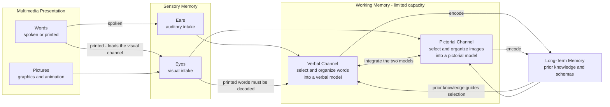

# 🎨 Dual Coding and Multimedia Learning

> [!abstract] TL;DR
> **Dual Coding Theory (Paivio, 1971/1986)** says memory runs on two separate but interconnected systems — a **verbal** code for language and a **visual/imaginal** code for pictures and mental images. Information encoded in *both* leaves two independent retrieval routes, so it is remembered better than information held in only one (the **picture superiority** and **concreteness** effects). **Mayer's Cognitive Theory of Multimedia Learning (CTML)** builds on this plus cognitive-load theory with three assumptions — **dual channels**, **limited capacity**, and **active processing** — and yields evidence-based design principles: pair words with relevant graphics, cut extraneous "seductive details," place related elements together in space and time, prefer **spoken** words over on-screen text alongside graphics (the modality effect), and never read your own bullet points aloud verbatim (the redundancy effect). The payoff is real *only* when the two codes are complementary; redundant or decorative additions overload the limited channels and hurt.

## Intuition

**Analogy: taking notes in two colors of ink that never run dry independently.**

Imagine you record every fact twice — once in words on the left of the page and once as a quick sketch on the right. Later, when the verbal note has smudged, the sketch is still legible, and vice versa. You have two physically separate copies, so losing one does not lose the memory. That redundancy across *different formats* is exactly why a diagram-plus-explanation sticks when a wall of text slides off.

But there is a catch the analogy makes obvious the moment you overdo it. If you cram the sketch, the words, *and* a second identical caption of the words all into the same narrow margin, the page becomes an unreadable smear — you spend your effort untangling the clutter instead of learning. Two *complementary* codes help; two *copies of the same code* fighting for the same space hurt. That single tension — complementary versus redundant — is the whole story of good multimedia design.

---

## How It Works

### Two codes, not one memory

Paivio's core claim is that cognition is not a single undifferentiated store. There are two functionally distinct subsystems:

- The **verbal system** processes and stores language-like units Paivio called **logogens** — words, sentences, sequential/serial structure.
- The **imaginal (non-verbal) system** processes and stores perceptual, picture-like units called **imagens** — mental images, shapes, spatial layout, holistic structure.

The two systems are **independent** (you can activate one without the other) yet **interconnected** by *referential* links: the word "dog" can evoke a mental image of a dog, and a picture of a dog can evoke its name. Three consequences follow directly:

1. **Additive recall.** An item coded in both systems has two independent chances of being retrieved. If either route survives, the memory is recovered — a probabilistic union, not a sum, but reliably higher than either code alone.
2. **The picture superiority effect.** Pictures are recalled better than their corresponding words because a picture is *spontaneously* dual-coded: you store the image *and* usually generate its verbal label, whereas a word is often stored verbally only.
3. **The concreteness effect.** Concrete, imageable words ("apple," "hammer") beat abstract words ("justice," "ratio") because the concrete ones easily recruit the imaginal system; the abstract ones live in the verbal system alone.

### From two codes to a theory of instruction: Mayer's CTML

Richard Mayer took Paivio's two channels, fused them with Sweller's cognitive-load theory, and produced the **Cognitive Theory of Multimedia Learning**. It rests on three assumptions:

- **Dual channels** — humans process visual/pictorial and auditory/verbal material through separate pathways (Paivio and Baddeley).
- **Limited capacity** — each channel can hold only a few elements at once (see [[Cognitive_Load_and_Learning]]).
- **Active processing** — meaningful learning is not passive intake; the learner must **select** relevant words and images, **organize** them into a coherent verbal model and pictorial model, and **integrate** the two with prior knowledge from long-term memory.

Learning succeeds when the two channels are used in parallel and integrated; it fails when one channel is overloaded or forced to duplicate work.

### Mayer's evidence-based principles

Each principle is a direct engineering consequence of dual channels and limited capacity:

- **Multimedia principle** — people learn better from words *and* pictures than from words alone. This is dual coding stated for instruction.
- **Coherence principle** — exclude interesting-but-irrelevant material ("seductive details": decorative images, background music, tangential stories). They consume limited capacity and can *lower* learning even while raising enjoyment.
- **Signaling principle** — cue the essential material (headings, arrows, highlighting) so the learner selects the right elements without searching.
- **Redundancy principle** — with graphics plus narration, do **not** add on-screen text that duplicates the narration verbatim. The eye now has to read *and* watch the graphic at once, overloading the visual channel.
- **Spatial contiguity principle** — place printed labels next to the part of the graphic they describe, not in a separate legend, so the learner does not hold one while hunting for the other (this cures **split attention**).
- **Temporal contiguity principle** — present corresponding narration and animation *at the same time*, not one after the other.
- **Segmenting principle** — break a continuous lesson into learner-paced chunks so each burst fits in working memory.
- **Pre-training principle** — teach the names and characteristics of key components *before* the full process, so the process explanation is not competing with vocabulary acquisition.
- **Modality principle** — with graphics, deliver the words as **speech**, not on-screen text. Narration enters the auditory channel while the graphic uses the visual channel, so the two run in parallel; on-screen text plus graphic jams both into the single visual channel. **Narration + graphics beats on-screen-text + graphics.**
- **Personalization principle** — conversational, first/second-person wording ("your heart pumps...") outperforms stilted formal prose by recruiting social engagement.

### Good dual coding versus reading your slides

The most common workplace failure is a deck of dense bullet points that the presenter reads aloud. This violates dual coding twice over: the "visual" is just *more words* (no pictorial code), and the spoken narration is *redundant* with the on-screen text (modality and redundancy violations). Genuine dual coding replaces the bullets with a **relevant diagram** and moves the words to **spoken narration** — two complementary codes, two channels, no duplication.

### Learner-generated dual coding

Dual coding is not only something instructors do *to* learners. When a student **sketchnotes**, draws a **diagram**, or builds a concept map, they are generatively encoding the same idea in a second, visual/spatial code — which is why summarizing a chapter as a labelled drawing beats re-reading it. The act of *choosing* what to draw is itself the selecting-and-organizing that CTML says drives learning.

### The learning-styles myth

Dual coding is frequently confused with the "learning styles" myth — the popular but unsupported idea that each person is a "visual," "auditory," or "kinesthetic" learner who should be taught only in their preferred channel. Dual coding says the opposite: **everyone** benefits from combining verbal and visual codes, because the benefit comes from the *material* engaging two complementary systems, not from matching a learner's self-reported style. Match the method to the content and the evidence, not to a label.



---

## Key Concepts

### Secondary (intuitive level)

- Your memory keeps two kinds of records: one for words, one for pictures and mental images.
- Learning something as *both* words and a picture gives you two ways to remember it, so it sticks better.
- Pictures are easier to remember than words because your brain automatically labels them too.
- Adding a diagram helps; adding a decorative image that has nothing to do with the topic just gets in the way.

### Undergraduate (mechanistic level)

- **Dual coding (Paivio):** independent verbal (logogen) and imaginal (imagen) systems joined by referential links. Recall from two codes is a probabilistic union, giving the additive-looking benefit; the **picture superiority** and **concreteness** effects follow directly.
- **CTML's three assumptions:** dual channels, limited capacity, active processing (select, organize, integrate).
- **Modality effect:** offloading words to the auditory channel (narration) frees the visual channel for the graphic, effectively widening total capacity — narration + graphics beats on-screen-text + graphics.
- **Redundancy and split-attention effects:** duplicating narration as on-screen text, or separating a label from its referent, forces wasteful cross-referencing that raises extraneous load (see [[Cognitive_Load_and_Learning]]).
- **Coherence / seductive details:** interesting-but-irrelevant additions compete for limited capacity and can lower learning while raising interest.

### Graduate (theoretical and design level)

- **Boundary conditions of the multimedia effect:** the benefit is largest for **low-prior-knowledge** learners and can *reverse* for experts (an expertise-reversal parallel) — a graphic that scaffolds a novice is redundant load to someone who already has the schema.
- **Complementarity, not duplication, is the mechanism:** dual coding gains require the two codes to carry *related but non-identical* information. Redundant codes (verbatim text + narration) provide no second route and add processing cost — the formal reason the redundancy principle exists.
- **Measurement and critique:** the picture superiority effect interacts with encoding task, retention interval, and item type; some "dual coding" benefits are alternatively explained by distinctiveness or levels-of-processing. Mayer's principles are backed by dozens of controlled experiments with medium-to-large effect sizes, but generalization across authentic classrooms, motivation, and long delays remains contested.
- **Generative multimedia:** learner-generated drawing, sketchnoting, and concept mapping shift the theory from *reception* to *production*; effectiveness depends on the quality of the learner's selecting/organizing, which is why unguided drawing sometimes fails while prompted, structured drawing succeeds.

---

## Python Demo

```python
# Model dual coding's recall benefit AND the redundancy / split-attention pitfall.
#
# Memory has TWO partly independent codes:
#   * a VERBAL code  (words / narration)      single-route recall p_verbal
#   * a VISUAL code  (pictures / graphics)    single-route recall p_visual  (> verbal: picture superiority)
#
# An item stored in BOTH codes is recalled if EITHER route survives -> a probabilistic
# union, NOT a sum:   P = 1 - (1 - p_verbal) * (1 - p_visual).  That is the dual-coding gain.
#
# The pitfall: adding on-screen text that DUPLICATES the narration does not add a new
# route (it is redundant verbally) and forces the graphic and the text to compete for the
# single VISUAL channel (split attention). We model that as an OVERLOAD factor that
# attenuates the visual code without improving the verbal code -> recall DROPS.

import numpy as np
import matplotlib.pyplot as plt

rng = np.random.default_rng(0)

p_verbal = 0.40    # single verbal code (words alone)
p_visual = 0.55    # single visual code (picture alone) -> higher: picture superiority
overload = 0.55    # fraction of visual-code strength that survives split attention

def dual(pv, pi):
    # two complementary codes: recalled if EITHER independent route works
    return 1.0 - (1.0 - pv) * (1.0 - pi)

# Predicted recall probability for each presentation format
formats = {
    "Words only\n(verbal code)":                 p_verbal,
    "Pictures only\n(visual code)":              p_visual,
    "Words + Pictures\n(dual coding)":           dual(p_verbal, p_visual),
    "Graphics + Narration\n(modality: 2 channels)": dual(p_verbal, p_visual),
    "Graphics + Narration + Text\n(redundant: split attention)":
        dual(p_verbal, overload * p_visual),     # visual attenuated, verbal not improved
}

# --- Simulate recall over N items (Bernoulli draws at each predicted probability) ---
N = 3000
labels = list(formats.keys())
p_pred = np.array([formats[k] for k in labels])
sim_recall = np.array([(rng.random(N) < p).mean() for p in p_pred])

# --- Plot ---
fig, (ax1, ax2) = plt.subplots(1, 2, figsize=(14, 5.5))

colors = ["#94a3b8", "#94a3b8", "#2563eb", "#16a34a", "#dc2626"]
xpos = np.arange(len(labels))
bars = ax1.bar(xpos, sim_recall, color=colors, edgecolor="black", alpha=0.9)
ax1.plot(xpos, p_pred, "kD", ms=7, label="predicted P(recall)")   # theory vs simulation
for x, s in zip(xpos, sim_recall):
    ax1.text(x, s + 0.015, f"{s:.2f}", ha="center", fontsize=9)
ax1.set_xticks(xpos)
ax1.set_xticklabels(labels, fontsize=8)
ax1.set_ylabel("Simulated fraction of items recalled")
ax1.set_ylim(0, 0.85)
ax1.set_title("Two complementary codes add; redundant codes overload")
ax1.legend(loc="upper left")
ax1.grid(axis="y", alpha=0.3)

# Panel 2: decompose WHY dual coding wins and redundancy loses
comp_labels = ["Verbal\nroute", "Visual\nroute", "Dual coding\nunion", "Redundant\nunion"]
comp_vals = [p_verbal, p_visual, dual(p_verbal, p_visual), dual(p_verbal, overload * p_visual)]
comp_colors = ["#f59e0b", "#0ea5e9", "#2563eb", "#dc2626"]
ax2.bar(comp_labels, comp_vals, color=comp_colors, edgecolor="black", alpha=0.9)
for x, v in enumerate(comp_vals):
    ax2.text(x, v + 0.012, f"{v:.2f}", ha="center", fontsize=9)
# annotate the additive gain and the overload loss
ax2.annotate("dual-coding gain\nover best single code",
             xy=(2, comp_vals[2]), xytext=(1.1, 0.80),
             arrowprops=dict(arrowstyle="->"), fontsize=8, ha="center")
ax2.annotate("split-attention\nloss",
             xy=(3, comp_vals[3]), xytext=(3.2, 0.30),
             arrowprops=dict(arrowstyle="->"), fontsize=8, ha="center")
ax2.set_ylabel("P(recall)")
ax2.set_ylim(0, 0.9)
ax2.set_title("Complementary codes union UP; redundant text pulls the visual route DOWN")
ax2.grid(axis="y", alpha=0.3)

plt.tight_layout()
plt.show()

# --- Console summary ---
best_single = max(p_verbal, p_visual)
print(f"Best single code (pictures):        {best_single:.2f}")
print(f"Dual coding (words + pictures):     {dual(p_verbal, p_visual):.2f}  "
      f"-> +{dual(p_verbal, p_visual) - best_single:.2f} over best single code")
print(f"Redundant (graphics+narration+text):{dual(p_verbal, overload * p_visual):.2f}  "
      f"-> {dual(p_verbal, overload * p_visual) - dual(p_verbal, p_visual):+.2f} vs clean dual coding")
```

Running it reproduces the theory. Pictures alone (0.55) already beat words alone (0.40) — the **picture superiority effect**. Combining the two complementary codes lifts predicted recall to about **0.73**, an additive-looking gain over either code because the item now survives if *either* route works — that is **dual coding**. Graphics with **narration** matches that best case by splitting the two codes across two channels (the **modality effect**). But bolting on redundant on-screen text attenuates the visual route (split attention) without adding a verbal route, dragging recall down to about **0.58** — *worse than clean dual coding and barely above pictures alone*. Two complementary codes help; a redundant third one hurts.

---

## Real-World Applications

- **E-learning and instructional video:** narrated animations (Khan Academy, well-designed MOOCs) apply the modality principle — spoken explanation over an evolving graphic, with no duplicated on-screen paragraph. Captions for accessibility are a deliberate, evidence-aware exception.
- **Technical documentation and UI onboarding:** labels placed directly on a screenshot (spatial contiguity) and a diagram paired with concise prose (multimedia) beat a legend-plus-text-block layout; progressive disclosure enacts segmenting.
- **Presentation design:** replacing text-dense, read-aloud slides with a single relevant diagram plus spoken narration — the practical fix for the "death by PowerPoint" redundancy trap.
- **Textbook and infographic design:** diagrams, worked schematics, and concept figures next to their explanations; concrete imageable examples for abstract ideas (the concreteness effect at work).
- **Study strategy:** learner-generated dual coding — sketchnoting a lecture, drawing a process diagram, or building a concept map — encodes material in a second visual/spatial code and outperforms passive re-reading (connects to [[Encoding_Strategies_and_Mnemonics]]).
- **Advertising and safety signage:** icon-plus-word warnings (a flame symbol beside "Flammable") exploit dual coding so the message is grasped fast and remembered.

---

## Common Pitfalls

- **Reading your slides aloud (the redundancy trap).** On-screen text plus verbatim narration jams two verbal streams into overlapping channels and provides no second code. Move the words to speech and put a *diagram* on the slide.
- **Decorative "seductive details."** Stock photos, background music, and fun-but-irrelevant anecdotes feel engaging while measurably lowering learning (coherence violation). If a visual does not carry information, it is competing for capacity.
- **Confusing "a slide full of text" with a visual.** Bullet points are still the verbal code. Dual coding requires a genuine *pictorial* representation — a diagram, chart, or image — not more words.
- **Split attention from separated labels.** Placing a diagram here and its key in a distant legend forces the learner to hold one while searching for the other. Integrate labels into the figure.
- **Believing the learning-styles myth.** There is no reliable "visual learner" who should get only pictures. Everyone benefits from both codes; match the method to the material, not to a self-reported style.
- **Assuming more codes are always better.** Redundant codes overload; only *complementary* codes help. Adding a third channel that duplicates an existing one is a cost, not reinforcement.
- **Ignoring expertise.** A scaffolding graphic that rescues a novice becomes redundant load for an expert who already holds the schema (expertise reversal). Fade the support as competence grows.

---

## Related Concepts

- [[Cognitive_Load_and_Learning]] — CTML is dual coding fused with cognitive-load theory; the redundancy, split-attention, and modality effects are all load effects.
- [[Encoding_Strategies_and_Mnemonics]] — dual coding is a core encoding lever; mnemonics like the method of loci force vivid imagery to add a visual code to arbitrary verbal material.
- [[Mental_Representation]] — the imagery-versus-propositional format debate and the representational basis for why concrete, imageable material encodes better.
- [[Visual_Cognition]] — how the visual system builds the pictorial code that the imaginal channel stores and retrieves.
- [[Multisensory_Integration]] — the perceptual mechanism behind combining auditory (narration) and visual (graphic) streams that the modality principle exploits.
- [[Working_Memory_and_Cognitive_Load]] — the limited-capacity channels whose bottleneck makes complementary coding help and redundant coding hurt.
- [[Learning_Science_Overview]] — situates dual coding among the evidence-based learning principles and flags the learning-styles myth.
- [[Attention_and_Focus_in_Learning]] — signaling and coherence work by steering limited attention toward the essential elements.

---

## Review Questions

**Tier 1 — Recall / Comprehension**
1. Name Paivio's two coding systems and their basic units, and explain why an item stored in both is remembered better than one stored in either alone.
2. State CTML's three assumptions and define the three active-processing steps a learner must perform (select, organize, integrate).

**Tier 2 — Application**
3. A training video shows an animated pump while the same explanatory sentences appear as on-screen text *and* are read aloud by a narrator. Identify every Mayer principle being violated, and redesign the video to fix each, stating which channel or load type your fix targets.
4. Using the demo's model, pictures alone give recall 0.55 and words alone 0.40. Compute the dual-coding union, then compute the redundant-format recall when the visual route is attenuated to 60 percent of its strength. Which format would you ship, and why is the redundant one worse than pictures alone is not — but still worse than clean dual coding?

**Tier 3 — Analysis / Synthesis**
5. Dual coding predicts that adding a visual helps, yet the coherence and redundancy principles say adding certain visuals or a second verbal stream hurts. Reconcile these into a single rule about *complementary versus redundant* codes, then explain how the boundary condition of learner expertise (expertise reversal) forces that rule to change as a learner progresses from novice to expert.

---

## Sources

- Paivio, A. (1986). *Mental Representations: A Dual Coding Approach.* Oxford University Press.
- Paivio, A. (1971). *Imagery and Verbal Processes.* Holt, Rinehart & Winston.
- Mayer, R. E. (2009). *Multimedia Learning* (2nd ed.). Cambridge University Press.
- Mayer, R. E., & Moreno, R. (2003). "Nine ways to reduce cognitive load in multimedia learning." *Educational Psychologist*, 38(1), 43–52.
- Clark, J. M., & Paivio, A. (1991). "Dual coding theory and education." *Educational Psychology Review*, 3(3), 149–210.

---

#learning-science #dual-coding #multimedia-learning #mayer #paivio
