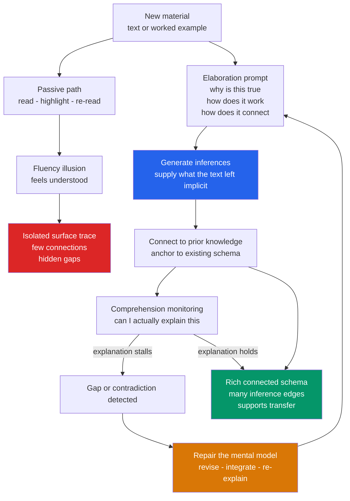

# 🔗 Elaboration and Self-Explanation

> [!abstract] TL;DR
> **Elaboration** is the act of adding *meaning and connections* to new material — explaining *how* and *why* it works and tying it to what you already know — instead of taking it in as an isolated fact. Its most powerful study-method forms are **elaborative interrogation** (relentlessly asking "why is this true?") and the **self-explanation effect** (Chi et al.): learners who explain worked examples to themselves *generate inferences that fill the gaps left by the text, monitor their own comprehension, and repair broken mental models* — and out-learn passive readers dramatically, especially on **transfer**. The **Feynman technique** and **learning-by-teaching / protege effect** are the same engine pointed outward: teaching (or expecting to teach) forces you to organize, simplify, and locate exactly where your understanding is thin. The crucial distinction: **explanation that builds new understanding beats mere restatement of the text**, and generation beats passive review because it forces deeper encoding, integration, and error detection.

---

## Intuition

**Analogy: two people assembling flat-pack furniture.**

The first person reads each instruction step and immediately performs it — screw A into hole B — never asking why. The manual is a checklist to be obeyed. When a step is ambiguous or a diagram skips a detail, they stall, because they have no model of *what the piece is for*.

The second person keeps narrating to themselves: *"This bracket must be the load-bearing joint — that's why it needs the longer bolts. This panel goes here because the shelf above will push down on it."* They are constantly generating explanations the manual never printed, connecting each part to a mental picture of the finished, working cabinet. When the diagram skips a detail, they fill it in by inference. When a step contradicts their model, they notice the mismatch and fix the model.

Both read the same manual. But the second person built an *understanding* of the cabinet, not just a copy of the instructions — so when a shelf later wobbles, they know exactly which joint to check. **Self-explanation is that running narration of how and why.** The text gives you the steps; elaboration builds the causal model that makes the steps make sense, transfer to new furniture, and reveal their own gaps.

---

## How It Works

Passive reading treats a text as something to *absorb*. Elaboration treats it as something to *interrogate and extend*. The learner becomes an active constructor who adds inferences the author left implicit, and every added inference is a new connection in the knowledge network.

### Core mechanics

1. **Elaboration adds connections, not just content.** To elaborate is to answer *how does this work?*, *why is it true?*, and *what does this remind me of?* Each answer links the new item to prior knowledge. Where re-reading strengthens a single isolated trace, elaboration weaves the item into an existing web, multiplying the routes by which it can later be retrieved and reasoned about.
2. **Elaborative interrogation: the "why" prompt.** Faced with a fact — *"the veins of a leaf carry water"* — the learner asks and answers *"why would that be true?"* Generating a plausible causal justification forces integration with existing schemas. Meta-analyses (Pressley; Dunlosky et al., 2013) rate elaborative interrogation as **moderately effective** and cheap, especially for factual material where the learner already has enough background to generate sensible answers.
3. **The self-explanation effect (Chi et al., 1989).** Students study **worked examples** (fully solved problems) and are observed thinking aloud. The best learners spontaneously *explain each step to themselves*: they generate the inferences the example omits, justify why a step is legal, relate the step to the underlying principle, and — critically — **monitor whether they actually understand**, flagging confusion. Poor learners re-read the steps and declare them "obvious." The gap in explaining, not in raw ability, predicts who can later solve novel problems.
4. **Three sub-mechanisms of self-explanation.** (a) **Generating inferences** — supplying the tacit knowledge a text leaves out, so the material becomes self-consistent. (b) **Comprehension monitoring** — the attempt to explain surfaces the exact points where understanding fails (you cannot explain what you do not grasp). (c) **Mental-model repair** — when a new statement conflicts with your current model, explanation forces you to notice the conflict and revise the model rather than ignore it.
5. **Generation beats reception.** Explaining is a *generative* act, like retrieval: you must produce the connective tissue yourself. This drives deeper encoding (you process meaning, not surface form), integration (new links to prior knowledge), and error detection (gaps and contradictions become visible). Passive review offers none of these because nothing is generated.
6. **The Feynman technique.** Pick a concept, explain it in **plain language as if teaching a beginner**, and watch for the moments you stall or reach for jargon — those are your gaps. Return to the source, patch the gap, and re-explain until the account is simple and complete. It is self-explanation plus a ruthless *simplicity* constraint that exposes shallow, borrowed phrasing.
7. **Learning by teaching and the protege effect.** Preparing to teach, and teaching itself, produces the same benefits: you must select the key ideas, organize them coherently, and anticipate a learner's questions. Even the *expectation* to teach improves learning versus expecting a test (Nestojko et al., 2014), because it changes how you organize the material while studying. Tutoring a "teachable agent" (a computer protege you must instruct) improves the tutor's own understanding — the **protege effect**.
8. **Prompted vs spontaneous, and the restatement trap.** Skilled learners self-explain *spontaneously*; most learners do not, but they can be *prompted* to (a menu of "why?" and "how does this connect?" questions), and prompted self-explanation reliably raises learning. The failure mode is **paraphrase / restatement**: repeating the text in slightly different words *feels* like explaining but adds no new inference and no new connection. **Understanding-building explanation adds something the text did not say; restatement does not.**

### The self-explanation loop vs the passive-reading path



---

## Key Concepts

### Secondary (explain to a curious beginner)

- **Don't just read it — explain it.** After each paragraph, close the book and say, in your own words, *why* the thing is true and *how* it works. If you can't, you found a gap — go back.
- **The "why" habit.** For every fact, ask "why would that be true?" and answer it. A fact you can justify sticks far better than a fact you merely saw.
- **Teach the empty chair.** Pretend you are explaining the topic to a younger sibling with no background. The spots where you get stuck or start using big words are exactly the spots you don't really understand yet (the **Feynman technique**).
- **Restating is not explaining.** Copying the sentence in slightly different words feels productive but teaches you almost nothing. Real explanation adds something the book didn't say — a reason, a link, an example.

### Undergraduate (needs some cognitive-science background)

- **Elaboration as deep, meaning-based encoding.** Elaboration is the study-method face of Craik and Lockhart's levels-of-processing: it forces semantic processing and installs distinctive, reusable retrieval cues (see [[Encoding_Strategies_and_Mnemonics]]).
- **Elaborative interrogation (Pressley et al., 1987; Dunlosky et al., 2013).** Answering "why is this true?" for to-be-learned facts. Rated **moderate** utility: effective and low-cost, but it depends on the learner having enough prior knowledge to generate correct justifications, and it helps factual material more than complex procedures.
- **The self-explanation effect (Chi, Bassok, Lewis, Reimann & Glaser, 1989; Chi et al., 1994).** Good students studying physics worked examples generated far more self-explanations than poor students and solved novel problems better. Prompting weaker students to self-explain a text on the circulatory system produced deeper, more integrated mental models than an unprompted control.
- **Worked examples plus self-explanation.** Worked examples cut cognitive load by showing the full solution, but their benefit collapses if students process them passively. Adding self-explanation prompts converts a low-effort demonstration into active model-building — the pairing is far stronger than either alone (see [[Cognitive_Load_and_Learning]]).
- **Prompted vs spontaneous self-explanation.** Since most learners don't self-explain on their own, instructional prompts ("explain how this step follows from the previous one") reliably induce the behavior and the benefit. Well-designed prompts push toward *principle-based* explanation, not paraphrase.
- **Understanding vs restatement.** The learning gain tracks *inference generation and integration*, not talk volume. Paraphrase and mere summary correlate weakly with learning; explanations that connect to principles and prior knowledge correlate strongly.
- **Expecting to teach (Nestojko, Bui, Kornell & Bjork, 2014).** Students told they would later teach the material organized and remembered it better than students told they would be tested — even though neither actually taught. The *stance* of preparing to explain changes encoding.

### Graduate (system-level thinking)

- **Constructive vs active vs passive: the ICAP framework (Chi & Wylie, 2014).** Engagement modes predict learning in ascending order: **Passive** (receiving) < **Active** (manipulating, e.g. highlighting) < **Constructive** (generating new ideas beyond the source, e.g. self-explaining, drawing inferences) < **Interactive** (co-constructing with a partner). Self-explanation is the paradigm *constructive* activity; the framework explains *why* it outperforms note-copying and re-reading.
- **Why transfer, specifically, benefits.** Self-explanation builds a more *connected* and *principle-indexed* representation, so knowledge is retrievable via the deep structure of a problem rather than its surface features — the precise capacity that near and far transfer require (see [[Problem_Solving_and_Insight]]). Passive learners index by surface cues and fail when the cover story changes.
- **Mental-model revision and self-repair (Chi, 2000).** Self-explanation is especially potent when a text conflicts with a learner's flawed prior model. The act of explaining surfaces the contradiction; without it, learners assimilate new statements *into* the wrong model, leaving misconceptions intact. Explanation is the mechanism by which conceptual change actually happens.
- **The generation and testing overlap.** Self-explanation shares machinery with the **generation effect** and **retrieval practice** (see [[Retrieval_Practice_and_the_Testing_Effect]]): all are effortful, productive acts that beat reception. Explaining *from memory* combines both — it is retrieval plus integration. The most efficient study routines interleave worked examples, self-explanation prompts, and spaced retrieval.
- **Learning by teaching, decomposed (Fiorella & Mayer; Bargh & Schul, 1980; Roscoe & Chi, 2007).** Preparing-to-teach drives selection and organization; the act of explaining to a learner drives generation, monitoring, and repair — especially when the "student" asks questions or gives feedback. The **protege effect** with teachable agents (e.g. Betty's Brain, Chi & Biswas) shows even instructing a *simulated* pupil raises the tutor's understanding, partly by an ego-protective motivation to prepare well for someone else.
- **Boundary conditions and costs.** Self-explanation is effortful and time-consuming; for low-prior-knowledge learners it can generate *incorrect* explanations that must be caught by feedback, and over-prompting can fragment attention. It shines for conceptually rich, principle-governed material and adds little to genuinely arbitrary rote content (where mnemonics win instead).

---

## Python Demo

```python
# numpy + matplotlib only.
# Model the SELF-EXPLANATION EFFECT as knowledge-GRAPH construction.
#
#   Concepts are NODES. Understanding is the EDGES between them.
#   - Reading marks concepts as "known" (adds nodes) and lays down only the
#     few links the text EXPLICITLY states.
#   - Self-explainers additionally GENERATE INFERENCES: for genuinely related
#     concepts they are both aware of, they infer the connecting edge, AND
#     they anchor new concepts to PRIOR KNOWLEDGE.
#
# Result: self-explainers build a far more CONNECTED graph, and TRANSFER
# (answering a novel question that requires linking two concepts) succeeds
# only if a PATH exists between them in the learner's graph.
import numpy as np
import matplotlib.pyplot as plt

rng = np.random.default_rng(1)

N       = 40      # concepts in the material
PRIOR   = 8       # prior-knowledge anchor concepts already known
PASSES  = 6       # study sessions
STUDENTS = 60     # simulated learners per condition

# Latent "true" structure: which concept pairs are genuinely relatable.
mask = np.triu(rng.random((N, N)) < 0.14, 1)
true_links = mask | mask.T

def study(self_explain):
    """Simulate one learner; return edges-per-pass and final adjacency."""
    A = np.zeros((N, N), dtype=bool)
    known = np.zeros(N, dtype=bool)
    known[:PRIOR] = True                       # prior knowledge anchors
    edges_over_time = []
    for _ in range(PASSES):
        known |= rng.random(N) < 0.55          # reading exposes concepts
        # reading lays down only sparse, explicitly stated links
        stated = true_links & (rng.random((N, N)) < 0.06)
        A |= stated | stated.T
        if self_explain:
            both = np.outer(known, known)      # both concepts understood
            # infer the connecting edge for related, understood concepts
            infer = true_links & both & (rng.random((N, N)) < 0.40)
            A |= infer | infer.T
            # anchor freshly-known concepts to prior-knowledge nodes
            for i in np.where(known)[0]:
                for a in rng.choice(PRIOR, size=2, replace=False):
                    if rng.random() < 0.30:
                        A[i, a] = A[a, i] = True
        np.fill_diagonal(A, False)
        edges_over_time.append(int(A.sum() // 2))
    return np.array(edges_over_time), A

def transfer(A, n_q=400):
    """Transfer test: fraction of random concept-pairs the learner can LINK
    (a path exists in their graph = they can reason from one to the other)."""
    R = A.copy()
    for _ in range(int(np.ceil(np.log2(N))) + 1):     # transitive closure
        R = R | ((R.astype(np.int32) @ R.astype(np.int32)) > 0)
    np.fill_diagonal(R, True)
    i = rng.integers(0, N, n_q)
    j = rng.integers(0, N, n_q)
    return R[i, j].mean()

# Run both conditions across many students
results = {}
for label, se in [("Read only", False), ("Self-explain", True)]:
    edges = np.zeros((STUDENTS, PASSES))
    trans = np.zeros(STUDENTS)
    for s in range(STUDENTS):
        e, A = study(se)
        edges[s] = e
        trans[s] = transfer(A)
    results[label] = (edges.mean(0), edges.std(0), trans.mean(), trans.std())

# ------------------------- Plot -------------------------
fig, (ax1, ax2) = plt.subplots(1, 2, figsize=(13, 5))
passes = np.arange(1, PASSES + 1)
colors = {"Read only": "tomato", "Self-explain": "steelblue"}

for label in results:
    m, sd, _, _ = results[label]
    ax1.plot(passes, m, "o-", lw=2, color=colors[label], label=label)
    ax1.fill_between(passes, m - sd, m + sd, color=colors[label], alpha=0.15)
ax1.set_xlabel("Study pass")
ax1.set_ylabel("Edges in knowledge graph  (connections built)")
ax1.set_title("Connectivity growth: self-explainers weave a denser web")
ax1.legend()

labels = list(results)
means  = [results[l][2] for l in labels]
errs   = [results[l][3] for l in labels]
ax2.bar(labels, means, yerr=errs, capsize=6,
        color=[colors[l] for l in labels])
for xi, m in enumerate(means):
    ax2.text(xi, m + 0.02, f"{m:.2f}", ha="center", fontsize=11)
ax2.set_ylabel("Transfer score  (fraction of concept-pairs linkable)")
ax2.set_ylim(0, 1)
ax2.set_title("Transfer: connected knowledge answers novel questions")

plt.tight_layout()
plt.savefig("self_explanation_effect.png", dpi=150)
print("Saved self_explanation_effect.png")

for l in labels:
    m, _, t, _ = results[l]
    print(f"{l:14s}  final edges = {m[-1]:5.1f}   transfer = {t:.2f}")
```

**What the demo shows.** Both groups end each pass "knowing" roughly the same *facts* (nodes), but the read-only learner accumulates only the handful of links the text spelled out, so their graph stays sparse and fragmented. The self-explainer generates inference edges between related concepts and anchors everything to prior knowledge, so their edge count climbs steeply pass after pass — a denser, more integrated web. The payoff appears in the transfer panel: a transfer question asks the learner to *connect two concepts they were never told to connect*, and it succeeds only if a path already exists in their graph. The self-explainer, with far more edges, can reach a large fraction of concept-pairs and answers most novel questions; the read-only learner, whose islands of fact never joined up, scores far lower. Same material, same study time — different *structure* of what was built.

---

## Real-World Applications

- **Worked-example instruction in STEM.** Math, physics, and programming courses interleave fully solved examples with **self-explanation prompts** ("why is this step valid?", "which principle does it use?"). This converts passive example-reading into active model-building and is one of the best-supported moves in instructional design.
- **The Feynman technique for exam prep.** Learners write a plain-language explanation of each concept as if teaching a beginner, mark every point where they stall, and return to the source to patch the gap. It is structured self-explanation with a simplicity constraint that exposes borrowed jargon.
- **Peer teaching and study groups.** Explaining a topic to a classmate (or being assigned to teach a subtopic in a jigsaw classroom) forces selection, organization, and gap detection — the learning-by-teaching effect. The *teacher* usually learns more than the listener.
- **Preparing-to-teach framing.** Telling students they will later explain the material to others (rather than be tested) measurably improves how they study, even if the teaching never happens (Nestojko et al.). Instructors exploit this by assigning explainer roles and "teach-back" tasks.
- **Teachable agents and tutoring software.** Systems where students teach a computer "protege" (e.g. Betty's Brain) leverage the protege effect: instructing the agent, then watching it succeed or fail, drives the tutor to build a more accurate model.
- **Elaborative interrogation in factual domains.** Medical, legal, and language learners turn lists of facts into "why?" chains, justifying each fact against underlying mechanisms so the material integrates rather than sitting as isolated trivia (see [[Encoding_Strategies_and_Mnemonics]]).
- **Technical onboarding and code review.** Explaining *why* a system is designed a certain way — in design docs, pairing, or rubber-duck debugging (explaining code line-by-line to an inanimate duck) — surfaces gaps and faulty assumptions exactly as self-explanation predicts.

---

## Common Pitfalls

- **Restatement disguised as explanation.** Paraphrasing the text in new words feels like understanding but adds no inference and no connection. The test: does your explanation say something the source did *not* explicitly state (a reason, a link, a consequence)? If not, you only restated.
- **The fluency illusion.** Material that reads smoothly *feels* understood, which suppresses the urge to explain. Force the explanation — from memory, in plain words — and the gaps that fluency hid become visible.
- **Generating wrong explanations without feedback.** Low-prior-knowledge learners can confidently self-explain *incorrectly*, entrenching misconceptions. Self-explanation needs a source of truth (worked solution, correct model, instructor) to catch and correct bad inferences.
- **Explaining rote, arbitrary material.** Self-explanation shines on principle-governed, interconnected content. For genuinely arbitrary lists (cranial-nerve order, vocabulary pairs) there is no "why" to find; mnemonics are the right tool there, not elaboration.
- **Over-prompting and cognitive overload.** Too many explanation prompts, or prompting before the basics are encoded, fragments attention and swamps working memory (see [[Working_Memory_and_Cognitive_Load]]). Prompt at the right grain, after enough exposure to have something to explain.
- **Treating it as a substitute for retrieval or spacing.** Elaboration deepens *encoding* but is not a delivery schedule. Pair self-explanation with spaced [[Retrieval_Practice_and_the_Testing_Effect]] so the well-built model is also durably rehearsed.
- **Explaining only the easy parts.** Learners gravitate to explaining what they already grasp, avoiding the confusing bits — which is exactly backwards. The stalls and contradictions are where the learning is; steer explanation *toward* discomfort.

---

## Related Concepts

- [[Encoding_Strategies_and_Mnemonics]] — elaboration is the study-method form of deep, meaning-based encoding; this note is the "why and how" application of the levels-of-processing principle.
- [[Retrieval_Practice_and_the_Testing_Effect]] — self-explanation and the Feynman technique are generative acts that overlap with retrieval; explaining *from memory* combines integration with active recall, and the two are best used together.
- [[Schemas_and_Mental_Models]] — self-explanation works by hooking new material into existing schemas and by *repairing* faulty mental models when a text contradicts them; this is the substrate elaboration builds on.
- [[Problem_Solving_and_Insight]] — self-explaining worked examples builds principle-indexed knowledge that transfers to novel problems, the core capacity problem-solving requires.
- [[Cognitive_Load_and_Learning]] — worked examples lower load, and self-explanation prompts turn that freed capacity into active model-building; over-prompting, though, can overload.
- [[Working_Memory_and_Cognitive_Load]] — generating explanations consumes working memory, so prompts must be pitched so difficulty stays desirable rather than overwhelming.
- [[Reflection_and_Feedback]] — comprehension monitoring during self-explanation is a metacognitive act; feedback is what catches the incorrect explanations that self-explanation can generate.
- [[Interleaving_and_Varied_Practice]] — a complementary desirable difficulty; interleaving forces discrimination between problem types, which self-explanation then justifies at the level of underlying principle.

---

## Review Questions

**Tier 1 — Conceptual (explain it to a peer)**
1. Chi et al. found that good and poor learners studied the *same* worked examples, yet only good learners solved novel problems afterward. What were the good learners doing differently, and why does that activity — rather than raw ability — predict transfer? Name the three sub-mechanisms of self-explanation.
2. Distinguish *explanation that builds understanding* from *mere restatement*. Give a one-sentence test a learner can apply to tell which one they just did.

**Tier 2 — Applied / scenario**
3. A student rereads a physics chapter four times and feels confident, but fails the exam's transfer problems. Redesign their study session using worked examples, self-explanation prompts, and the Feynman technique. For each element, state the specific mechanism it adds (deeper encoding, integration, comprehension monitoring, or error detection).
4. An instructor wants to exploit learning-by-teaching but has no time for peer-teaching sessions. Citing the "expectation to teach" finding, describe the smallest intervention that could still capture part of the benefit, and explain *when* in the learning process it acts.

**Tier 3 — Analytical / trade-off**
5. Elaborative interrogation is rated only *moderately* effective, and self-explanation can *backfire* for some learners. Explain the shared boundary condition behind both facts, and specify the two safeguards (one about the learner, one about the environment) that keep generative explanation from entrenching misconceptions.
6. Using the knowledge-graph model from the Python demo, explain precisely why self-explainers and read-only learners can end up knowing the same *facts* yet differ enormously on *transfer*. What structural property of the graph does transfer depend on, and which activity produces it?

---

## Sources

- Chi, M. T. H., Bassok, M., Lewis, M. W., Reimann, P., & Glaser, R. (1989). "Self-Explanations: How Students Study and Use Examples in Learning to Solve Problems." *Cognitive Science*, 13(2), 145–182. [https://doi.org/10.1207/s15516709cog1302_1](https://doi.org/10.1207/s15516709cog1302_1)
- Dunlosky, J., Rawson, K. A., Marsh, E. J., Nathan, M. J., & Willingham, D. T. (2013). "Improving Students' Learning With Effective Learning Techniques." *Psychological Science in the Public Interest*, 14(1), 4–58. [https://doi.org/10.1177/1529100612453266](https://doi.org/10.1177/1529100612453266)
- Chi, M. T. H., & Wylie, R. (2014). "The ICAP Framework: Linking Cognitive Engagement to Active Learning Outcomes." *Educational Psychologist*, 49(4), 219–243. [https://doi.org/10.1080/00461520.2014.965823](https://doi.org/10.1080/00461520.2014.965823)
- Nestojko, J. F., Bui, D. C., Kornell, N., & Bjork, E. L. (2014). "Expecting to Teach Enhances Learning and Organization of Knowledge in Free Recall of Text Passages." *Memory & Cognition*, 42(7), 1038–1048. [https://doi.org/10.3758/s13421-014-0416-z](https://doi.org/10.3758/s13421-014-0416-z)
- Fiorella, L., & Mayer, R. E. (2013). "The Relative Benefits of Learning by Teaching and Teaching Expectancy." *Contemporary Educational Psychology*, 38(4), 281–288. [https://doi.org/10.1016/j.cedpsych.2013.06.001](https://doi.org/10.1016/j.cedpsych.2013.06.001)

---

#learning-science #elaboration #self-explanation #feynman-technique #deep-learning
