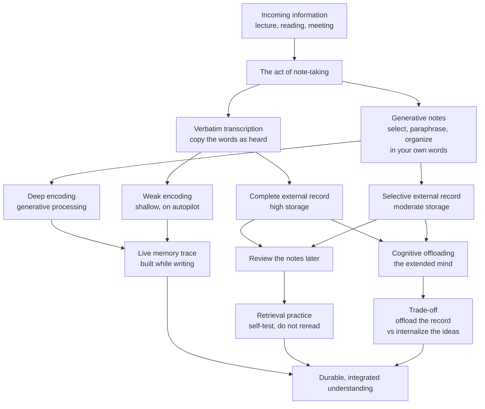

# 🗒️ Note-Taking and External Memory

> [!abstract] TL;DR
> A note does **two jobs at once**, and they pull in different directions. The **encoding function** is the value created *while you write* — selecting, paraphrasing, and reorganizing ideas in your own words transforms and deepens the memory trace. The **storage function** is the external record you keep to **review later**. Verbatim transcription maximizes storage but starves encoding; **generative note-taking** (summarizing, paraphrasing, mapping) trades a little completeness for far deeper processing, and it wins on **conceptual** understanding — the core of Mueller and Oppenheimer's "the pen is mightier than the keyboard" (with real replication caveats about *how big* the effect is). Methods (**Cornell, outlining, mapping, charting, the sentence method**) impose structure; **Zettelkasten** and the digital second brain (Luhmann, Obsidian, Roam) turn notes into a *networked, atomic* thinking tool where new ideas *emerge* from links. Reviewing notes only pays off when it becomes **retrieval practice**, not rereading — and offloading to an **external memory** is a genuine trade-off between saving working memory now and internalizing the ideas for good.

---

## Intuition

**Analogy: a chef writing a recipe versus a photocopier duplicating one.** A photocopier reproduces a cookbook page perfectly — every word preserved, nothing understood. A chef writing down a dish they just watched must *decide what matters*: which step is the technique and which is garnish, what to call the sauce, how to compress ten minutes of motion into three lines. The chef's version is shorter and lossier, yet the chef now *understands the dish* and could improvise it; the photocopy owner still cannot cook.

Note-taking sits on exactly that spectrum. Copying a lecture word-for-word is the photocopier: a complete external record built with almost no thinking. Rewriting it in your own words is the chef: a lossier record, but the act of compressing and translating **is** the learning. The paper you keep is only half the point — the other half already happened in your head, in the writing.

---

## How It Works

### Core Mechanics

1. **Two functions, one act (DiVesta and Gray, 1972; Kiewra, 1989).** Note-taking serves an **encoding function** (the process of taking notes changes how you process information *right now*) and an **external-storage function** (the notes are a record to consult *later*). Classic experiments dissociate them: taking notes but *never reviewing* still beats not taking notes at all — proof the encoding act has standalone value — while reviewing notes adds a *second*, separable boost from storage.

2. **Encoding is generative.** Real encoding value comes from **generative processing**: selecting what matters, paraphrasing into your own words, reorganizing, and connecting to prior knowledge. This is the same machinery as elaboration and the generation effect in [[Encoding_Strategies_and_Mnemonics]] — you cannot paraphrase an idea you have not understood, so paraphrasing *forces* understanding.

3. **Verbatim transcription short-circuits encoding.** Transcribing speech word-for-word can be done on autopilot, bypassing meaning. It maximizes the *record* while minimizing the *processing*. This is Mueller and Oppenheimer's mechanism: laptop note-takers type faster, transcribe more verbatim, and — despite having **more** words to study — perform **worse** on conceptual questions than slower longhand writers who were forced to summarize.

4. **Storage without review is inert.** A perfect record that is never reopened does nothing for long-term memory. Storage only cashes out through **review**, and review only cashes out when it becomes **retrieval practice** (self-testing, closing the notebook and reconstructing) rather than passive rereading — see [[Retrieval_Practice_and_the_Testing_Effect]].

5. **Note-taking imposes cognitive load.** Writing while listening is a dual task. In a fast lecture, the *storage* goal (capture everything) can crowd out the *encoding* goal (think about it) and even out-compete comprehension itself — a direct [[Cognitive_Load_and_Learning]] tension. Structured methods reduce this by giving the hand a plan so the mind is freed for meaning.

6. **Methods are scaffolds for structure.** **Cornell** (cue column, notes, summary), **outlining** (hierarchy of indentation), **mapping** (spatial, node-and-link, close to concept mapping), **charting** (a matrix for comparing dimensions), and the **sentence method** (one idea per line) each impose a skeleton that pushes you to organize as you write — organization is itself deep encoding.

7. **Networked notes make ideas emerge.** The **Zettelkasten** (Niklaus Luhmann's slip-box) treats each note as **atomic** (one idea) and **linked** to others, so knowledge becomes a graph rather than a filing cabinet. Digital tools (Obsidian, Roam) revive this: because retrieval walks along links, *new connections you never explicitly stored* surface when related notes sit next to each other. **Progressive summarization** (Tiago Forte) layers this over time — bold the key lines, highlight the key of the key — so each later pass is a fresh encoding event.

8. **The extended-mind trade-off.** A notebook is **external memory**: it lets you **offload** cognition and free scarce working memory (the [[Embodied_and_Extended_Cognition]] thesis). But offloading has a cost — what you reliably store *outside* you have less pressure to internalize (the "Google effect"). The skill is knowing which knowledge to externalize (references, details) and which to internalize (the core model you must reason with fluently).

### Flow: the dual functions of a note



---

## Key Concepts

### Secondary (explain to a curious beginner)
- **A note does two jobs.** It helps you *think now* (while you write) and gives you a *record for later*. Good notes serve both; bad notes serve neither.
- **Do not copy word-for-word.** Put it in *your own words*. If you cannot shorten it, you probably do not understand it yet — and struggling to shorten it is how you learn it.
- **Pick a shape.** The **Cornell** layout (a skinny left column for questions, a wide right side for notes, a summary strip at the bottom) or a simple **outline** forces you to organize while you write.
- **Review by testing, not rereading.** Cover the notes and try to say them back. Rereading feels productive but teaches you almost nothing.

### Undergraduate (needs some cognitive-science background)
- **The encoding-storage paradigm (Kiewra, 1989; DiVesta and Gray, 1972).** Two independent benefits: the *encoding* value of the act itself, and the *external-storage* value of reviewing. Both matter; the best condition is *take generative notes AND review them as retrieval practice*.
- **"The pen is mightier than the keyboard" (Mueller and Oppenheimer, 2014).** Longhand note-takers wrote *fewer* words but paraphrased more; laptop users transcribed more *verbatim*. Longhand won on **conceptual** questions (factual recall was roughly tied). The driver is generative processing, not the writing implement per se.
- **Replication nuance (Morehead, Dunlosky, and Rawson, 2019; and later registered reports).** The headline effect is **smaller and less reliable** than the original suggested, and sometimes vanishes when both groups are told to study or when verbatim-ness is controlled. The **mechanism** (generative encoding beats mindless transcription) is robust; the specific *laptop-versus-longhand* framing is fragile. Devices are not the villain — passive transcription is.
- **Note-taking methods.** **Cornell** (cue / notes / summary), **outlining** (indented hierarchy), **mapping** (spatial node-link, adjacent to concept mapping), **charting** (comparison matrix across fixed dimensions), **sentence method** (one idea per numbered line). Match the method to the material: charting for comparisons, mapping for relationships, outlining for hierarchies.
- **Note-taking and cognitive load.** Writing while listening splits attention. When speech is fast or dense, capture competes with comprehension; scaffolds and partial/skeletal notes (a pre-structured handout) lower load so more capacity goes to meaning. Ties to [[Working_Memory_and_Cognitive_Load]].
- **Review as retrieval practice.** Notes are most valuable when reprocessed *effortfully*. Turning the Cornell cue column into self-quiz questions converts storage into spaced [[Retrieval_Practice_and_the_Testing_Effect]].

### Graduate (system-level thinking)
- **Zettelkasten and emergence (Luhmann; Ahrens, 2017).** Luhmann's ~90,000-slip box was **atomic** (one thought per note) and **densely linked**. He credited it as a *thinking partner*: because notes were connected non-hierarchically, juxtapositions produced ideas he had not deliberately filed. The digital second-brain movement (Obsidian, Roam, backlinks, graph view — this very vault) operationalizes networked, associative memory in software; the *link*, not the folder, is the unit of value.
- **Progressive summarization and PARA (Forte, 2022).** Notes are refined in **layers** over time — capture, bold, highlight, executive-summary — so each pass is a new, spaced encoding event and future-you can enter at any depth. The cost is opacity risk: over-highlighting recreates the verbatim problem one level up.
- **The extended mind, formalized (Clark and Chalmers, 1998).** If a notebook reliably carries information you act on, it is *functionally* part of your cognitive system — cognition extends beyond the skull. **Cognitive offloading** frees working memory and enables tasks no unaided brain could do (long division on paper, a codebase in Git). The cost is the **"Google effect"** (Sparrow, Liu, and Wegner, 2011): we remember *where* to find offloaded facts better than the facts. Strategic offloading is the goal — externalize the lookup-able, internalize the reason-able. See [[Embodied_and_Extended_Cognition]] and [[Knowledge_Representation]].
- **Active versus passive notes.** *Passive* notes are write-once dead records; *active* notes are re-entered, re-linked, and queried — a living [[Knowledge_Representation]]. A Zettelkasten is active by design; a transcribed lecture is passive by default. Activity, not medium, predicts value.
- **The encoding-storage trade-off as a design problem.** More completeness (storage) generally means less processing (encoding) under a fixed time budget. The optimum depends on the *later demand*: for a **verbatim-critical** need (legal record, exact quote, an unfamiliar procedure you will re-derive later) high-fidelity capture is correct; for **conceptual mastery**, generative compression wins. Generative notes are a **desirable difficulty** ([[Desirable_Difficulties]]) — harder to make, better for transfer — and their fragmentary record pairs naturally with [[Spaced_Repetition_and_the_Spacing_Effect]] over the cue questions.

---

## Python Demo

```python
# Model the TWO functions of note-taking and their effect on later recall.
#
#   ENCODING function  = generative processing WHILE writing (deepens the trace)
#   STORAGE function    = completeness of the external record (enables review)
#
# Three strategies with different profiles:
#   No notes           -> some active listening, NO external record
#   Verbatim           -> shallow encoding, near-complete record (high storage)
#   Generative summary -> deep encoding, selective record (moderate storage)
#
# Two kinds of test:
#   FACTUAL recall     -> recovers verbatim detail; helped a lot by reviewing a
#                         complete record (storage-driven).
#   CONCEPTUAL recall  -> requires understanding built at encoding time; storage
#                         only helps if the notes were themselves meaningful, so
#                         its review benefit scales with storage * encoding.
#
# Punchline: verbatim ties/leads on FACTUAL recall, but GENERATIVE notes win
# clearly on CONCEPTUAL recall -- the Mueller & Oppenheimer result.
import numpy as np
import matplotlib.pyplot as plt

rng = np.random.default_rng(42)

strategies = ["No notes", "Verbatim\ntranscription", "Generative\nsummary notes"]
encoding = np.array([0.35, 0.30, 0.80])   # generative processing during writing
storage  = np.array([0.00, 0.95, 0.60])   # completeness of the external record

def factual_p(review):
    # facts are recoverable from a complete record you review
    return np.clip(0.20 + 0.35 * encoding + review * 0.55 * storage, 0, 1)

def conceptual_p(review):
    # understanding is built at encoding time; review only helps a MEANINGFUL
    # record, so its benefit scales with storage * encoding (verbatm review
    # barely builds concepts, generative review does)
    return np.clip(0.12 + 0.55 * encoding + review * 0.45 * (storage * encoding), 0, 1)

def simulate(p, n_items=25, n_subjects=80):
    draws = rng.binomial(n_items, p[:, None], size=(len(p), n_subjects)) / n_items
    return draws.mean(axis=1), draws.std(axis=1) / np.sqrt(n_subjects)

# --- with review (students study their notes before the test) ----------------
fact_m,  fact_e  = simulate(factual_p(review=1))
conc_m,  conc_e  = simulate(conceptual_p(review=1))

# --- conceptual recall WITHOUT vs WITH review (notes as retrieval practice) ---
conc_noreview_m, _ = simulate(conceptual_p(review=0))

# --- plot --------------------------------------------------------------------
fig, (ax1, ax2) = plt.subplots(1, 2, figsize=(12, 4.8))
x = np.arange(len(strategies))
w = 0.38

ax1.bar(x - w/2, fact_m, w, yerr=fact_e, capsize=4, label="Factual recall",
        color="#60a5fa")
ax1.bar(x + w/2, conc_m, w, yerr=conc_e, capsize=4, label="Conceptual recall",
        color="#7c3aed")
ax1.set_xticks(x); ax1.set_xticklabels(strategies, fontsize=8)
ax1.set_ylabel("Fraction recalled"); ax1.set_ylim(0, 1)
ax1.set_title("After review: verbatim ties on facts,\ngenerative wins on concepts")
ax1.legend(fontsize=8)

ax2.bar(x - w/2, conc_noreview_m, w, label="No review", color="#cbd5e1")
ax2.bar(x + w/2, conc_m, w, label="Reviewed as retrieval practice",
        color="#059669")
ax2.set_xticks(x); ax2.set_xticklabels(strategies, fontsize=8)
ax2.set_ylabel("Conceptual recall"); ax2.set_ylim(0, 1)
ax2.set_title("Storage pays off only through review\n(and most for generative notes)")
ax2.legend(fontsize=8)

fig.tight_layout(); plt.show()

# --- numeric summary ---------------------------------------------------------
print("Strategy            factual  conceptual  conceptual(no review)")
for s, f, c, c0 in zip(["No notes", "Verbatim", "Generative"],
                       fact_m, conc_m, conc_noreview_m):
    print("  %-16s  %.2f     %.2f        %.2f" % (s, f, c, c0))
```

Running it yields two panels. **Left:** after everyone reviews, *verbatim* notes edge out on **factual** recall (they preserve the exact wording), but *generative* notes dominate **conceptual** recall (roughly 0.78 versus 0.41 for verbatim and 0.31 for no notes) — the encoding function paying off. **Right:** conceptual recall barely moves for verbatim notes when you add review (rereading a transcript does not build understanding), while generative notes climb sharply — storage only converts to learning when the record was *meaningful* and the review is retrieval practice. The overall message: capture *less* but *think more*, then re-test what you kept.

---

## Real-World Applications

> **University lectures.** The Cornell method's cue column doubles as a built-in self-quiz: cover the notes, answer the cues from memory, then check. This is why Cornell outperforms plain transcription — it bakes generative encoding and later retrieval practice into one layout.

> **This vault (Obsidian) and Roam.** Atomic, backlinked notes are Luhmann's Zettelkasten in software. The graph view surfaces unexpected neighbors, so writing a note on one topic often *reveals* a connection to another — ideas emerging from structure rather than being filed by hand.

> **Software engineering.** A codebase, README, and Git history are an **extended memory** the team offloads to. You do not memorize every function signature; you internalize the *architecture* and let the repository hold the details — strategic offloading of the lookup-able, internalizing the reason-able.

> **Medicine and law.** Where the *record* is the product — a legal transcript, a patient chart, an exact drug dose — high-fidelity, near-verbatim capture is correct. The storage function legitimately outranks the encoding function when accuracy of the artifact, not the note-taker's memory, is what is on the line.

> **Meetings and journalism.** Reporters and product managers take fast, lossy, generative notes to *think* in the moment, then reconstruct and expand them within minutes — using the still-warm live trace to reinflate a sparse record, a deliberate encoding-then-storage sequence.

---

## Common Pitfalls

- **Transcribing instead of thinking.** Writing everything down feels diligent but runs the hand on autopilot and starves encoding. If your notes could have been produced by a speech-to-text app, you were the photocopier, not the chef.
- **Collector's fallacy.** Highlighting, clipping, and hoarding notes you never re-engage with feels like learning but is pure passive storage. Volume of captured material is not knowledge; *re-entering* it is.
- **Rereading masquerading as review.** Rereading notes is fluent and comforting and teaches little. Convert notes into questions and self-test — storage only cashes out as [[Retrieval_Practice_and_the_Testing_Effect]].
- **Blaming the device.** The laptop-versus-longhand debate is often misread as "screens are bad." The real culprit is *verbatim transcription*; a laptop user forced to paraphrase and organize can encode just as deeply. Fix the *behavior*, not the tool.
- **Over-offloading.** Externalizing everything you must reason with fluently leaves you unable to think without the crutch (the Google effect). Offload references and detail; internalize the core model.
- **Structure for its own sake.** Elaborate mapping, color systems, and app tinkering can become procrastination that produces beautiful passive notes with no encoding payoff. The goal is transformed understanding, not a pretty artifact.
- **Progressive summarization gone verbatim.** Bolding or highlighting *most* of a note recreates the transcription problem one layer up — the point is aggressive, selective compression.

---

## Related Concepts

- [[Encoding_Strategies_and_Mnemonics]] — generative note-taking is the elaboration and generation effect applied to notes; paraphrasing *is* deep, meaning-based encoding.
- [[Retrieval_Practice_and_the_Testing_Effect]] — the external-storage function only converts to durable memory when review becomes self-testing rather than rereading.
- [[Embodied_and_Extended_Cognition]] — notes as external memory make cognition literally extend beyond the brain; the offloading-versus-internalizing trade-off lives here.
- [[Knowledge_Representation]] — a Zettelkasten is a networked, associative knowledge representation; atomic linked notes mirror how memory itself is structured.
- [[Cognitive_Load_and_Learning]] — note-taking is a dual task; capturing too much can crowd out comprehension when the source is fast or dense.
- [[Working_Memory_and_Cognitive_Load]] — offloading to paper frees the tiny working-memory buffer, the same bottleneck chunking addresses.
- [[Desirable_Difficulties]] — generative notes are harder to make and lossier, yet produce better transfer, a textbook desirable difficulty.
- [[Spaced_Repetition_and_the_Spacing_Effect]] — the cue questions distilled from good notes are the natural units to space out over time.

---

## Review Questions

1. **(Conceptual)** Experiments show that taking notes and *never reviewing them* still beats not taking notes at all. Which of note-taking's two functions does this isolate, and why does the result mean you cannot fully explain note-taking's benefit as "having a record to study later"?
2. **(Scenario)** Two students attend the same fast-paced lecture. One types a near-complete transcript on a laptop; the other handwrites a sparse, paraphrased outline. On the factual quiz they score about the same, but on the essay asking them to *apply* the ideas, the handwriter wins decisively. Explain the mechanism in terms of the encoding versus storage functions — and identify what the laptop user could change to close the gap *without* switching away from the laptop.
3. **(Trade-off)** You are building a personal knowledge system and must decide, for each piece of information, whether to internalize it or offload it to your notes. Using the extended-mind idea and the "Google effect," give a principle for what belongs in each category, and explain the cost of getting the split wrong in either direction.

---

## Sources

- Mueller, P. A., & Oppenheimer, D. M. (2014). "The Pen Is Mightier Than the Keyboard: Advantages of Longhand Over Laptop Note Taking." *Psychological Science*, 25(6), 1159–1168. [https://doi.org/10.1177/0956797614524581](https://doi.org/10.1177/0956797614524581)
- Kiewra, K. A. (1989). "A Review of Note-Taking: The Encoding-Storage Paradigm and Beyond." *Educational Psychology Review*, 1(2), 147–172. [https://doi.org/10.1007/BF01326640](https://doi.org/10.1007/BF01326640)
- DiVesta, F. J., & Gray, G. S. (1972). "Listening and Note Taking." *Journal of Educational Psychology*, 63(1), 8–14. [https://doi.org/10.1037/h0032243](https://doi.org/10.1037/h0032243)
- Clark, A., & Chalmers, D. (1998). "The Extended Mind." *Analysis*, 58(1), 7–19. [https://doi.org/10.1093/analys/58.1.7](https://doi.org/10.1093/analys/58.1.7)
- Ahrens, S. (2017). *How to Take Smart Notes: One Simple Technique to Boost Writing, Learning and Thinking.* CreateSpace. (On Luhmann's Zettelkasten and networked, atomic notes.)

---

#learning-science #note-taking #external-memory #cornell-method #zettelkasten
