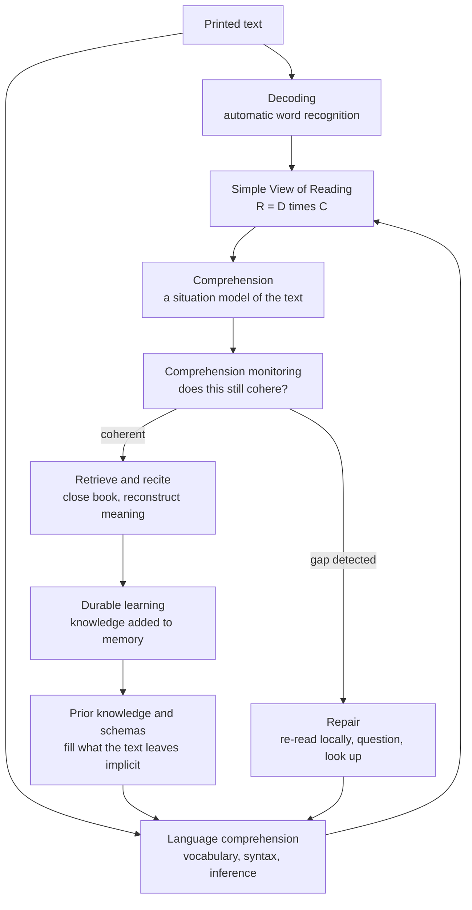

# 📖 Reading and Comprehension Strategies

> [!abstract] TL;DR
> Reading comprehension is **not one skill but a product of two**: the ability to turn print into words (**decoding**) and the ability to turn words into meaning (**language comprehension**). The **Simple View of Reading** captures this as a *multiplication* — `Comprehension = Decoding × Language comprehension` — so if either factor is near zero, understanding collapses. Once decoding is fluent, the dominant lever on comprehension is not a generic "reading skill" but **background knowledge**: the classic **Recht & Leslie baseball study** showed that poor readers who knew baseball out-comprehended good readers who did not, on a baseball passage. Willingham's slogan — *"comprehension is knowledge"* — follows directly. Good readers do not have a secret technique; they have a rich schema that fills what every text leaves unsaid. On top of that base, **active-reading routines** (SQ3R, PQ4R, self-questioning, annotating) and **comprehension monitoring** (metacognition: noticing *when you stop understanding*) convert passive eye-movement into durable learning. Two seductive myths to resist: **speed reading** (Rayner's eye-movement research shows you cannot both skim and comprehend deeply — it is a gist/depth trade-off), and the **fluency illusion of re-reading** (it feels productive and is nearly worthless; replace it with retrieval).

---

## Intuition

**Analogy: reading is watching a football match, not photographing the field.**

Two people watch the same match. One has never seen the sport; the other has followed it for years. The camera in their eyes is identical — same pixels, same players, same ninety minutes. Yet they "see" utterly different games. The novice sees men chasing a ball; the fan sees an offside trap collapsing, a manager's substitution changing the shape, a striker drifting into space *because* the full-back over-committed. The difference is not visual acuity. It is **knowledge**: the fan's mind supplies the invisible structure that the raw scene omits.

Text is exactly the same. An author never writes down everything — they *assume* you can fill the gaps. "The pitcher walked the batter to load the bases" is meaningless to someone without baseball knowledge and vivid to someone with it, though every word was decoded perfectly. **Comprehension is the schema you bring, not the ink on the page.** Decoding fluency just gets you into the stadium; knowledge is what lets you understand the game. And *monitoring* — the quiet inner voice that says "wait, I've lost the thread" — is what tells you to look again before you walk out thinking you understood.

---

## How It Works

### The Simple View of Reading

Gough & Tunmer (1986) proposed that reading comprehension (`R`) decomposes into two independent components:

- **Decoding (`D`)** — automatic, accurate word recognition: mapping print to phonology to a word you already know by ear. In skilled readers this is *automatic* — it consumes almost no working memory, freeing capacity for meaning.
- **Language comprehension (`C`)** — everything you would understand if the same text were *read aloud to you*: vocabulary, syntax, inference, and, crucially, **background knowledge**.

The relationship is a **product, not a sum**: `R = D × C`. Multiplicativity is the whole point. A reader who decodes flawlessly but lacks the language/knowledge to interpret the words (`C ≈ 0`) comprehends nothing — think of decoding a physics paper in a field you know nothing about, or a fluent adult reading a language they can pronounce but not speak. Conversely, a listener who understands the ideas perfectly but cannot decode the script (`D ≈ 0`) also gets zero *from the page*. You need **both**, and improving the near-zero factor helps far more than polishing the strong one.

### Knowledge is the hidden engine

Once decoding is automatic (roughly by upper-elementary age for typical readers), the variance in comprehension is dominated by `C`, and within `C` the biggest, most under-appreciated lever is **prior knowledge**. This is not a soft claim; it is one of the most replicated findings in the science of reading.

- **The baseball study (Recht & Leslie, 1988).** Junior-high students were sorted on *reading ability* and on *baseball knowledge*, then read and recalled a passage describing a half-inning of baseball. **Baseball knowledge, not reading ability, predicted comprehension.** "Poor" readers who knew baseball comprehended and recalled the passage *better* than "good" readers who did not. Knowledge trumped general reading skill.
- **Willingham's synthesis.** Because writers omit everything they assume the reader knows, comprehension depends on the reader's ability to supply the missing links by inference — and inference runs on knowledge. Hence *"the reason comprehension strategies work at all is that they buy you a little time to deploy the knowledge you have; they cannot substitute for knowledge you lack."* Broad knowledge and rich **vocabulary** (itself a proxy for knowledge) are the true long-run determinants of who reads well.

The instructional implication is uncomfortable: there is no content-free "reading skill" you can drill to make someone comprehend an unfamiliar domain. You build comprehension by building **knowledge and vocabulary** — which is why wide reading compounds (the *Matthew effect*: those who know more, learn more from every new text).

### Active reading: SQ3R and friends

Passive reading — eyes moving, mind idling — produces the fluency illusion without the learning. **Active-reading routines** force the generative, effortful processing that actually builds comprehension and memory. The canonical one is **SQ3R** (Robinson, 1946):

1. **Survey** — skim headings, abstract, summary, figures. Activate and pre-load the relevant schema *before* reading.
2. **Question** — turn each heading into a question. Now you read to *answer* something, which directs attention.
3. **Read** — read one section actively, seeking the answers you posed.
4. **Recite** — look away and **retrieve**: state the answer in your own words from memory. This is the load-bearing step — it is [[Retrieval_Practice_and_the_Testing_Effect]] embedded in reading.
5. **Review** — after finishing, retrieve across the whole text; revisit gaps.

**PQ4R** (Thomas & Robinson, 1972) is a close relative: **Preview, Question, Read, Reflect, Recite, Review** — adding an explicit *Reflect* step (elaborate, connect to what you know). Both work because they smuggle three evidence-based mechanisms into reading: **prior-knowledge activation** (Survey/Preview), **self-questioning** (which improves comprehension and monitoring), and **retrieval** (Recite/Review). **Annotating** — margin notes, questions, summaries in your own words — works for the same reason: it forces you to *generate* rather than *receive*.

### Comprehension monitoring (metacognition while reading)

The skill that most separates strong from weak readers is not speed — it is **noticing when comprehension has failed**. Skilled readers run a continuous background check: *does this cohere with what I already understood?* When it does not, they slow down, re-read locally, look up a word, or flag the confusion. Weak readers sail past contradictions and gaps without registering them — the "illusion of comprehension." This is [[Metacognition_and_Thinking_About_Thinking]] applied in real time, and it can be trained: self-explanation ("what did that paragraph just tell me, and why does it follow?") and self-questioning both raise monitoring accuracy.

### Gist reading vs deep study reading, and the speed-reading myth

Not all reading should be deep — but you must **choose deliberately**. *Gist reading* (skimming to decide relevance, to locate a fact, to survey a field) is fast and appropriate. *Deep study reading* (to build a durable model you will be tested on or will build upon) is slow, effortful, and cannot be rushed. The mistake is believing you can get depth at gist speed.

**Speed reading is largely a myth.** Rayner's decades of eye-movement research show reading is a sequence of ~200–250 ms **fixations** punctuated by **saccades**, with regressions back to reread — and comprehension is tightly coupled to this pattern (see [[Visual_Cognition]]). Techniques that force the eyes faster (RSVP flashing words, wide "meta-guiding" sweeps) **do not create super-readers; they force skimming**, and skimming trades comprehension for speed. Rayner et al. (2016) conclude bluntly: *there is no magic — if you want to understand more, the only reliable lever is knowing more words and more about the topic*, not moving your eyes faster. The apparent "speed" of experts is mostly the payoff of **knowledge**, which lets them predict and skip the redundant.

### The fluency illusion of re-reading

Re-reading is the most popular study strategy and one of the least effective (Dunlosky et al., 2013). The second pass feels *smooth* — you recognise every sentence — and that fluency is misread as mastery. But recognition is not recall; the ease is [[Calibration_and_Illusions_of_Competence]] in action. Re-reading is low-effort, so by the logic of [[Desirable_Difficulties]] it builds little durable memory. The fix is not to read *more* but to **close the book and retrieve**: after a section, look away and reconstruct it. That single swap — from re-reading to retrieval — is one of the highest-yield changes a student can make.



---

## Key Concepts

### Secondary Level

- **Reading = decoding plus understanding.** You must both *sound out the words* and *know what they mean together*. Being great at one does not rescue the other.
- **What you already know is your superpower.** The single biggest reason one person understands a page better than another is that they **know more about the topic** — not that they read "faster" or have a special trick.
- **Read actively, not passively.** Before reading, skim the headings and ask questions. After each part, **look away and say it back in your own words**. If you cannot, you did not understand it yet.
- **Re-reading is a trap.** The second read feels easy, but easy is not the same as learned. Test yourself instead of reading again.
- **Speed reading does not work.** You cannot read super-fast and still understand deeply. Slowing down on hard material is a feature, not a weakness.

### Undergraduate Level

- **The Simple View of Reading (Gough & Tunmer, 1986):** `R = D × C`. Comprehension is the *product* of decoding and language comprehension; a near-zero factor tanks the whole thing. Diagnosis matters — a struggling reader may have a decoding problem *or* a knowledge/language problem, and the remedies are different.
- **Prior knowledge dominates once decoding is automatic (Recht & Leslie, 1988):** on domain text, *topic knowledge* out-predicts general reading ability. "Comprehension is knowledge" (Willingham).
- **Active-reading protocols:** **SQ3R** (Survey, Question, Read, Recite, Review) and **PQ4R** (Preview, Question, Read, Reflect, Recite, Review). Their power comes from three embedded mechanisms — schema activation, self-questioning, and retrieval — not from the acronym itself.
- **Comprehension monitoring** is the metacognitive core: strong readers detect comprehension failures and deploy repair strategies; weak readers do not notice the gaps.
- **Text structure and signaling:** authors mark structure with headings, topic sentences, and **signal words** ("however", "in contrast", "as a result", "three reasons"). Readers who use these signposts build a better-organised situation model. Surveying exploits them.
- **The re-reading fluency illusion:** re-reading inflates confidence far more than learning; replace with retrieval and spacing.

### Graduate Level

- **From words to a situation model (Kintsch's construction-integration).** Comprehension proceeds from a *surface* code (exact words) to a *textbase* (propositions) to a **situation model** — an integrated mental representation that fuses the text with the reader's knowledge. Deep comprehension *is* the quality of this situation model, and it is knowledge-bound: gaps in the text are bridged by *inference*, and inference draws on schemas (see [[Schemas_and_Mental_Models]]).
- **Why the Simple View is multiplicative and where it strains.** The product form predicts the empirical pattern that `D` and `C` each set a *ceiling* the other cannot exceed, and that their relative importance shifts with development (decoding-limited in early readers, comprehension-limited later). Refinements add fluency and executive function as moderators, but the two-factor core is robust across languages of varying orthographic depth.
- **The knowledge–vocabulary–comprehension spiral (Matthew effect).** Vocabulary predicts comprehension, comprehension enables wider reading, wider reading grows vocabulary and knowledge — a positive feedback loop that widens gaps over time (Stanovich). Strategy instruction yields quick, small, plateauing gains; knowledge/vocabulary growth yields slow, compounding gains. Curriculum design should therefore prioritise *content-rich* reading over endless strategy drilling.
- **Eye movements as a window on cognition (Rayner).** The **eye–mind assumption** holds that fixation duration indexes ongoing processing; harder or lower-frequency words draw longer fixations and more regressions. This is why RSVP and skimming "speed" methods necessarily sacrifice comprehension: they eliminate the regressions and the processing time that difficult text demands. Perceptual span is ~14–15 characters to the right of fixation — a hard biological bound on how much can be taken in per fixation.
- **Monitoring as a metacognitive control loop.** Comprehension monitoring is a *test-and-repair* cycle: an internal standard of coherence, a comparison against the evolving model, and a control response (slow down, reread, look up). Its accuracy — how well "I feel I understand" tracks "I actually do" — is a calibration problem; self-explanation prompts improve it precisely by surfacing the gaps the fluent read conceals.

---

## Python Demo

```python
# numpy + matplotlib only.
# Model reading comprehension with the SIMPLE VIEW OF READING:
#     R = D x C
#   D = decoding automaticity        (print -> words)
#   C = language / knowledge comp.   (words -> meaning)
# and show the classic KNOWLEDGE EFFECT (Recht & Leslie baseball study):
# on a dense domain passage, PRIOR KNOWLEDGE trumps general reading skill.
import numpy as np
import matplotlib.pyplot as plt

def decoding(skill, difficulty):
    # Automatic word recognition. Skilled decoders are barely slowed by hard
    # text; weak decoders lose ground fast as vocabulary/syntax get harder.
    return np.clip(skill - difficulty * (1.0 - skill) * 0.9, 0.0, 1.0)

def language_knowledge(base_lang, knowledge, difficulty):
    # Language comprehension = general verbal ability PLUS domain knowledge that
    # fills the gaps a text leaves implicit. High knowledge buffers difficulty;
    # low knowledge collapses as the passage gets denser and more inferential.
    return np.clip(base_lang + 0.7 * knowledge - difficulty * (1.0 - knowledge) * 0.8,
                   0.0, 1.0)

def comprehension(skill, base_lang, knowledge, difficulty):
    return decoding(skill, difficulty) * language_knowledge(base_lang, knowledge, difficulty)

# ---------- Panel A: the Simple View is a PRODUCT, not a sum ----------
C = np.linspace(0, 1, 200)
D_levels = [0.3, 0.6, 0.9]

# ---------- Panel B: the baseball-study crossover ----------
d = np.linspace(0, 1, 200)   # difficulty / density of a BASEBALL passage
readers = [
    # label,                              skill, base_lang, knowledge, color
    ("Good decoder, HIGH knowledge",       0.90, 0.55, 0.90, "#1d4ed8"),
    ("Poor decoder, HIGH knowledge",       0.55, 0.50, 0.90, "#60a5fa"),
    ("Good decoder, LOW knowledge",        0.90, 0.55, 0.25, "#b91c1c"),
    ("Poor decoder, LOW knowledge",        0.55, 0.50, 0.25, "#f87171"),
]

fig, (axA, axB) = plt.subplots(1, 2, figsize=(13, 5.5))

for Dl in D_levels:
    axA.plot(C, Dl * C, lw=2, label=f"decoding D = {Dl}")
axA.set_title("Simple View is a PRODUCT:  R = D x C")
axA.set_xlabel("Language / knowledge comprehension  C")
axA.set_ylabel("Reading comprehension  R = D x C")
axA.annotate("C -> 0 forces R -> 0\n(decode every word, grasp nothing)",
             xy=(0.05, 0.03), xytext=(0.28, 0.20), fontsize=8,
             arrowprops=dict(arrowstyle="->", color="gray"))
axA.legend(fontsize=9)
axA.grid(alpha=0.3)

for lab, s, bl, k, col in readers:
    axB.plot(d, comprehension(s, bl, k, d), lw=2.3, color=col, label=lab)
axB.set_title("Prior knowledge trumps reading skill (baseball effect)")
axB.set_xlabel("Passage difficulty / density  (implicit, domain-loaded text ->)")
axB.set_ylabel("Predicted comprehension")
axB.set_ylim(0, 1)
axB.legend(fontsize=8, loc="lower left")
axB.grid(alpha=0.3)

# Report the crossover numerically.
poor_hi = comprehension(0.55, 0.50, 0.90, d)   # poor decoder, HIGH knowledge
good_lo = comprehension(0.90, 0.55, 0.25, d)   # good decoder, LOW  knowledge
print("On a DENSE domain passage (difficulty = 1.0):")
print(f"  Poor decoder + HIGH knowledge -> comprehension = {poor_hi[-1]:.2f}")
print(f"  Good decoder + LOW  knowledge -> comprehension = {good_lo[-1]:.2f}")
print("  => knowledge wins where the text leaves the most unsaid.")

plt.tight_layout()
plt.savefig("reading_comprehension.png", dpi=150)
print("Saved reading_comprehension.png")
```

**What the demo shows.** *Panel A* makes the multiplicativity of the Simple View visible: because `R = D × C`, driving language/knowledge comprehension toward zero drags comprehension to zero *no matter how good the decoding* — perfect pronunciation of a physics paper you cannot follow yields nothing. *Panel B* reproduces the **baseball-study crossover**: on easy text, decoding skill leads, but as the passage becomes dense and domain-loaded (more left implicit, more inference required), the **high-knowledge readers pull ahead of the low-knowledge readers regardless of decoding skill** — the poor-decoder/high-knowledge reader overtakes the good-decoder/low-knowledge reader. The lesson mirrors Willingham: on real domain text, *knowledge is comprehension*, and there is no generic reading skill that substitutes for it.

---

## Real-World Applications

- **Core-knowledge and content-rich curricula.** Programs built on the science of reading (e.g., knowledge-building literacy curricula) deliberately teach *broad background knowledge and vocabulary* across science, history, and the arts — because comprehension is knowledge-bound, and strategy drills alone plateau. The reading gains show up years later, on unfamiliar passages.
- **Textbook and technical-document design.** Clear **text structure** — informative headings, topic sentences, explicit **signal words**, summaries, and worked examples — measurably raises comprehension and supports the *Survey* step. Good docs are written so a reader can build the situation model without fighting the prose.
- **Study-skills instruction.** SQ3R/PQ4R are taught in universities and professional training precisely because they convert passive reading into schema-activation plus retrieval; the effective versions emphasise the *Recite* (retrieval) step, not the acronym.
- **Assistive and adaptive reading tech.** Tools that pre-teach domain vocabulary, gloss unfamiliar terms, or surface prerequisite knowledge address the *real* bottleneck (`C`), unlike "speed-reading" apps that merely force skimming and reduce comprehension.
- **Assessment design.** Reading tests that use *unfamiliar* passages inadvertently measure background knowledge as much as "reading ability," which is a fairness and validity concern — a direct consequence of the knowledge effect.
- **Expert reading in the professions.** Lawyers, radiologists, and engineers read their domain texts "fast" not by moving their eyes faster but by predicting and skipping the redundant — the knowledge-driven skipping Rayner's models describe.

---

## Common Pitfalls

- **Treating reading as one generic skill** — coaching "comprehension strategies" while ignoring that the reader simply lacks the *knowledge and vocabulary* the text assumes. Strategies buy time to deploy knowledge; they cannot manufacture it.
- **Chasing speed** — believing an RSVP app or wide-sweep technique makes you read faster *and* understand more. Eye-movement research says it forces skimming: you trade comprehension for words-per-minute. Match speed to purpose (gist vs deep study), do not maximise it.
- **Re-reading as the default study move** — the smooth second pass feels like mastery ([[Calibration_and_Illusions_of_Competence]]) but builds little durable memory. Swap re-reading for retrieval after each section.
- **Reading without monitoring** — letting the eyes run while the mind idles, then finishing with an illusion of understanding. Install a coherence check: after each paragraph, ask "what did that just tell me, and does it fit?"
- **Highlighting instead of processing** — passive highlighting marks text without generating meaning; it produces color, not comprehension. Annotate in your own words and pose questions instead.
- **Skipping the Survey/Preview** — diving straight into paragraph one wastes the cheapest, highest-leverage step: activating the relevant schema so incoming detail has somewhere to attach.
- **Same speed for everything** — reading a dense proof and a news blog at one pace. Deliberately downshift for high-difficulty, inference-heavy text; that slowdown is the work, not a failure.

---

## Related Concepts

- [[Retrieval_Practice_and_the_Testing_Effect]] — the engine inside the *Recite/Review* steps of SQ3R; closing the book and reconstructing the text is what turns reading into memory.
- [[Desirable_Difficulties]] — explains why effortful active reading beats smooth re-reading, and why the fluency of a second pass is a signal of *low* learning yield.
- [[Metacognition_and_Thinking_About_Thinking]] — comprehension monitoring is metacognition in real time: noticing when meaning has broken down and deploying a repair.
- [[Calibration_and_Illusions_of_Competence]] — the fluency illusion of re-reading; feeling of understanding diverging from actual comprehension.
- [[Schemas_and_Mental_Models]] — the knowledge structures that fill what a text leaves implicit and form the *situation model* of deep comprehension; the cognitive basis of the knowledge effect.
- [[Visual_Cognition]] — eye movements in reading (fixations, saccades, regressions, perceptual span) that ground Rayner's debunking of speed reading.

---

## Review Questions

**Tier 1 — Conceptual (can you explain it to a peer?)**
1. State the Simple View of Reading and explain why it is written as a *product* rather than a sum. What does the multiplicative form predict about a reader who decodes a graduate physics paper flawlessly but knows no physics?
2. In one sentence each, explain why *re-reading feels effective but is not*, and what to do instead.

**Tier 2 — Applied / scenario**
3. Two students read the same dense passage about cricket. Priya has average general reading scores but has played cricket for years; Sam is a strong general reader who has never seen the sport. Predict who comprehends and recalls more, name the study this mirrors, and explain the result using the Simple View. What, specifically, would *not* be a valid explanation?
4. A learner asks you to recommend a speed-reading app so they can "get through the textbook three times faster and remember more." Using eye-movement research and the gist-vs-deep distinction, explain what such an app actually does to comprehension, and redesign their study plan around SQ3R and retrieval instead.

**Tier 3 — Analytical / trade-off**
5. "Comprehension is knowledge" (Willingham) and "teach comprehension strategies" are often presented as competing prescriptions. Reconcile them: what *do* strategies like self-questioning and SQ3R contribute, what is their ceiling, and why does content-rich reading produce compounding gains that strategy drills do not (invoke the Matthew effect and the situation model)?
6. The Simple View treats decoding and language comprehension as independent factors, yet a struggling adolescent reader can be failing for either reason. Design a two-step diagnostic that separates a decoding deficit from a knowledge/language deficit, and explain why the remedy for each is different — and why treating all "poor comprehension" the same is a mistake.

---

## Sources

- Gough, P. B., & Tunmer, W. E. (1986). "Decoding, reading, and reading disability." *Remedial and Special Education*, 7(1), 6–10. The paper introducing the Simple View of Reading.
- Recht, D. L., & Leslie, L. (1988). "Effect of prior knowledge on good and poor readers' memory of text." *Journal of Educational Psychology*, 80(1), 16–20. The classic "baseball study."
- Willingham, D. T. (2017). *The Reading Mind: A Cognitive Approach to Understanding How the Mind Reads.* Jossey-Bass. See also Willingham, "How Knowledge Helps," *American Educator* (2006).
- Rayner, K., Schotter, E. R., Masson, M. E. J., Potter, M. C., & Treiman, R. (2016). "So much to read, so little time: How do we read, and can speed reading help?" *Psychological Science in the Public Interest*, 17(1), 4–34.
- Robinson, F. P. (1946). *Effective Study.* Harper & Row. The origin of the SQ3R method.
- Dunlosky, J., Rawson, K. A., Marsh, E. J., Nathan, M. J., & Willingham, D. T. (2013). "Improving students' learning with effective learning techniques." *Psychological Science in the Public Interest*, 14(1), 4–58. Rereading rated low utility; retrieval and distributed practice high.

---

#learning-science #reading #comprehension #sq3r #prior-knowledge
