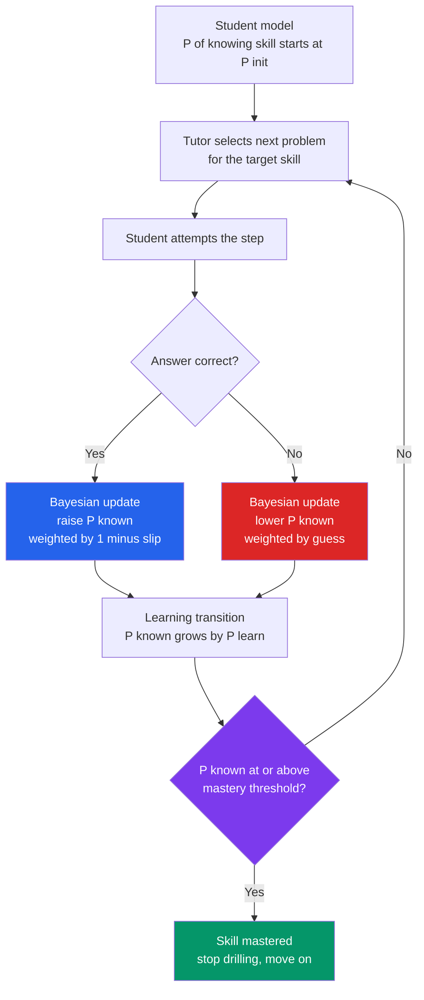

# 🎓 Educational Technology and AI Tutors

> [!abstract] TL;DR
> **Educational technology (edtech)** is the century-long attempt to bottle the effectiveness of a great human tutor and ship it at scale — from Skinner's mechanical **teaching machines** and the 1960s **PLATO** terminals, through **MOOCs**, to today's **AI tutors**. Its scientific core is the **intelligent tutoring system (ITS)**: software that builds a running model of *what a specific student knows* and adapts the next problem, hint, or explanation accordingly. The two engines are **model tracing** (compare each step to a cognitive model of the skill, e.g. Carnegie Learning's **Cognitive Tutor** built on **[[Cognitive_Architectures|ACT-R]]**) and **knowledge tracing** — most famously **Bayesian Knowledge Tracing (BKT)**, which infers a latent "known / not-known" state per skill from a stream of right/wrong answers. The motivating target is **Bloom's 2-sigma problem**: one-on-one mastery tutoring moves the average student to the ~98th percentile, a gap the whole field is trying to close cheaply. The honest evidence (VanLehn, 2011) is more modest — human tutoring buys roughly **0.8σ**, and good ITS come *within striking distance* of that — but the promise of scalable, always-available, personalized instruction is now colliding with **LLM tutors** (Khanmigo, ChatGPT-as-Socratic-tutor) whose upside (instant feedback, patience, availability) is shadowed by real risks: **hallucination**, **effort-offloading that destroys [[Desirable_Difficulties|desirable difficulty]]**, over-reliance, cheating, and equity gaps. The field's oldest lesson still binds: it is the **method**, not the **medium**, that teaches (Clark).

---

## Intuition

**Analogy: a driving instructor vs a driving video.**

Watch a two-hour video on parallel parking and you will *feel* like you understand it — but the video never sees your car drift, never says "ease off now," never notices you always forget the mirror. Sit beside a real instructor and something different happens: they watch *your* specific mistakes, adjust the very next thing they ask you to do, hand you a hint exactly when you stall (and withhold it when you are close), and keep you circling the same maneuver until *you* have it — not until the average student has it. That tight, personalized, correct-me-in-the-moment loop is why a good human tutor is worth so much more than a good lecture.

An **intelligent tutoring system** is an attempt to build that instructor in software. It keeps a private estimate — "does this learner know how to isolate a variable yet?" — updates that estimate every time you answer, and uses it to choose the next problem and decide when you have truly mastered the skill. An **LLM tutor** goes further, holding a natural-language conversation that *feels* like the instructor talking back. The unsolved question is whether the software is really watching *you*, or just playing a very convincing video that lets you offload the hard part.

---

## How It Works

An ITS is classically decomposed into **four modules**, and the whole promise of edtech turns on how good the second one is.

### The four components of a tutor

1. **Domain (expert) model** — an encoding of the subject itself: the correct facts, procedures, and the **knowledge components** (atomic skills) a problem requires. In a **model-tracing** tutor this is a set of *production rules* — a runnable cognitive model that can solve the problem the way an expert would, *and* reproduce common student errors ("buggy rules").
2. **Student model** — the tutor's running estimate of *this learner's* state: which knowledge components they have mastered, their misconceptions, their affect. This is where **knowledge tracing** lives.
3. **Tutoring (pedagogical) model** — the policy that turns the student model into action: which problem to serve next, when to give a hint vs let the learner struggle, when to declare **mastery** and move on.
4. **Interface** — how the interaction is delivered: a step-based algebra workspace, a dialogue box, or a full LLM chat.

### Two ways to trace a student

- **Model tracing** compares each *step* of the student's solution against the expert production rules in real time, enabling **step-level feedback** and just-in-time hints ("that step matches a known error — try distributing first"). This is the ACT-R-based approach of the **Cognitive Tutor** / Carnegie Learning.
- **Knowledge tracing** ignores the internal steps and asks a narrower question across problems: *given this learner's history of right and wrong answers on a skill, what is the probability they have actually learned it?* **Bayesian Knowledge Tracing (BKT)** answers this with a two-state hidden Markov model and four parameters. **Deep Knowledge Tracing (DKT)** answers it with a recurrent neural network trained on millions of response sequences.

### Bayesian Knowledge Tracing, precisely

BKT models a skill as a hidden binary state — **known** or **not-known** — governed by four numbers:

- **P(init)** = P of already knowing the skill before any practice,
- **P(learn)** = P of transitioning not-known → known after one practice opportunity,
- **P(slip)** = P of answering *wrong* despite knowing (a careless error),
- **P(guess)** = P of answering *right* despite not knowing (a lucky guess).

After every answer the tutor does two things: (1) a **Bayesian update** of P(known) using the observed correct/incorrect answer weighted by slip and guess, then (2) a **learning transition** that bumps P(known) upward by P(learn) — the student may have just acquired the skill by doing the problem. When P(known) crosses a **mastery threshold** (commonly 0.95), the tutor stops drilling that skill. This is **mastery learning** made adaptive: everyone reaches the same bar, but each learner takes as many problems as *they* need.



---

## Key Concepts

### Secondary Level

**Edtech is old, not new.** The dream of a teaching machine predates computers. In the 1920s Sidney **Pressey** built a mechanical multiple-choice tester; in the 1950s B.F. **Skinner** designed **teaching machines** for *programmed instruction* — tiny steps, an answer at every step, and immediate reinforcement, straight out of operant conditioning. In the 1960s the University of Illinois **PLATO** system put lessons on networked terminals with graphics, chat, and shared screens — decades ahead of its time.

**MOOCs promised a revolution.** Around 2012 ("the year of the MOOC"), Coursera, edX, and Udacity offered elite university courses free to millions. The reach was real, but **completion rates were low** (often single-digit percentages), and MOOCs turned out to mostly serve already-educated adults rather than democratize access. Lesson: putting a lecture online is not the same as teaching.

**AI tutors talk back.** A modern **AI tutor** like Khan Academy's **Khanmigo** or ChatGPT used as a study partner can answer your questions in plain language, give worked examples, and quiz you — available at 2 a.m., infinitely patient. The good ones are designed to be **Socratic**: they nudge you toward the answer instead of just handing it over.

**Flashcard apps are edtech too.** [[Spaced_Repetition_and_the_Spacing_Effect|Anki]] and the review engine inside **Duolingo** are simple, wildly effective educational technology — they schedule *when* you see each item so you review just before you forget.

### Undergraduate Level

**The four-module ITS architecture** (domain model, student model, tutoring model, interface) is the standard blueprint. **Model tracing** gives step-level feedback by matching each action to an expert cognitive model; **knowledge tracing** estimates skill mastery from answer histories. The **Cognitive Tutor** (Anderson, Koedinger, and colleagues at CMU; commercialized by **Carnegie Learning**) is the landmark model-tracing system, built directly on the **[[Cognitive_Architectures|ACT-R]]** theory of cognition, and deployed to hundreds of thousands of algebra students.

**Bloom's 2-sigma problem** (Bloom, 1984) is the field's north star. In his experiments, students taught **one-on-one with mastery learning** outperformed conventionally-taught students by about **two standard deviations** — the average tutored student scored above ~98% of the classroom group. The problem: individual human tutoring does not scale economically. Bloom explicitly framed the challenge as *finding group methods (or technology) that get close to 2σ affordably.*

**The real effectiveness numbers (VanLehn, 2011).** A careful meta-review punctured the mythology. VanLehn found human tutoring's advantage over no-tutoring was about **d ≈ 0.79**, not 2.0 — and, crucially, **step-based ITS reached about d ≈ 0.76**, essentially matching human tutors, while simpler answer-only computer-aided instruction lagged (~0.31). The takeaway is genuinely encouraging: well-designed ITS capture most of the human-tutor benefit — but the mythic 2σ is not the honest baseline.

**Mastery learning + adaptive/personalized systems.** Instead of fixed pacing, the tutor keeps advancing a learner on a skill until a mastery criterion is met (BKT's threshold), then moves on. Modern "personalized" and "adaptive learning" platforms (ALEKS, Knewton-style engines, Khan Academy's skill trees) generalize this across a knowledge graph of prerequisites.

**Media vs method — the Clark/Kozma debate.** Richard **Clark (1983)** argued that *media do not influence learning* — the medium is "merely the vehicle that delivers instruction," like the truck delivering groceries; what teaches is the **instructional method**, which any medium could deliver. Robert **Kozma (1994)** pushed back that some methods are only *possible* in certain media. This debate is the intellectual backbone of every "does this app actually work?" argument and a direct antidote to edtech hype.

**The "No Significant Difference" phenomenon.** Thomas Russell catalogued hundreds of studies comparing technology-delivered vs classroom instruction and found, over and over, **no significant difference** in outcomes. Read correctly (via Clark), this is not a failure of tech — it confirms that swapping the *delivery medium* while holding the *method* constant changes little. Technology helps when it enables a *better method* (immediate feedback, adaptivity, deliberate practice), not merely a new channel.

### Graduate Level

**BKT as a hidden Markov model — and its identifiability crisis.** BKT is a two-state HMM fit per knowledge component. Its parameters are notoriously **non-identifiable**: Beck & Chang (2007) and others showed that multiple very different parameter sets fit the data equally well, and that unconstrained fitting can produce *degenerate* solutions — e.g. P(guess) or P(slip) above 0.5, where the model "believes" a correct answer is evidence of *not* knowing. Fixes include capping slip/guess, Dirichlet priors, and **individualized BKT** with per-student P(init)/P(learn) (Yudelson et al., 2013). Extensions add **forgetting**, **item difficulty**, and **help/hint** effects.

**Deep Knowledge Tracing (DKT).** Piech et al. (2015) replaced the HMM with an **LSTM** that consumes the full sequence of (skill, correct?) events and predicts the probability of correctness on the next item. DKT posted higher AUC than BKT on benchmark datasets, but drew sharp critiques: it is a **black box** (no interpretable per-skill mastery state), its predictions can be **inconsistent** (mastery of a skill can drop after answering it correctly), and much of its early "win" came from **skill co-occurrence / data-leakage artifacts** (Xiong et al., 2016; Yeung & Yeung, 2018). The BKT-vs-DKT tension is the classic **interpretability-vs-accuracy** trade-off in student modeling — and matters because tutors *act* on these estimates.

**Learning analytics.** Beyond per-skill tracing, ITS and LMS platforms mine clickstreams, timing, and hint usage to predict **at-risk students**, detect disengagement ("gaming the system," Baker), and personalize interventions. This raises hard issues of **construct validity** (does time-on-page mean learning?), **algorithmic bias**, **surveillance**, and student privacy (FERPA/GDPR) — the same governance problems as any behavioral data pipeline.

**LLM tutors: the opportunity/risk ledger.** Systems like **Khanmigo** (GPT-4 behind Khan Academy) and general **[[Reasoning_Models|LLMs]]** used as Socratic tutors offer *scalable personalization, instant natural-language feedback, and 24/7 availability* — the closest thing yet to Bloom's affordable tutor. But the risks are structural, not incidental:
- **Hallucination** — a fluent, confident tutor that is *wrong* is worse than no tutor, especially for a novice who cannot detect the error (see [[LLM_Architecture_Deep_Dive]]).
- **Effort-offloading undermines [[Desirable_Difficulties|desirable difficulty]].** Learning requires effortful retrieval and productive struggle; a tutor that instantly supplies the answer removes exactly the friction that builds durable memory. The *generation effect* and [[Retrieval_Practice_and_the_Testing_Effect|testing effect]] evaporate if the student never generates or retrieves.
- **Over-reliance and metacognitive erosion** — learners outsource judgment and lose calibration of what they actually know.
- **The homework/cheating problem** — the same tool that tutors also completes the assignment, collapsing the assessment signal.
- **Equity** — access to premium models, devices, and bandwidth is uneven, so a "democratizing" technology can *widen* gaps (the Matthew effect), and models may underperform for dialects or contexts underrepresented in training data.

The pedagogical frontier is *alignment for teaching*: RLHF and system prompts that make the model **withhold answers, ask questions, and scaffold** — turning a next-token predictor into a Socratic tutor that protects the struggle instead of removing it.

---

## Python Demo

```python
# numpy + matplotlib only.
# Implements Bayesian Knowledge Tracing (BKT) -- the classic student model
# behind intelligent tutoring systems. A skill is a hidden binary state
# (known / not-known). We simulate ONE student's practice sequence, then run
# BKT to estimate the probability the skill is mastered after each answer,
# plot the mastery curve rising to a threshold, and show ADAPTIVE STOPPING.
import numpy as np
import matplotlib.pyplot as plt
from matplotlib.lines import Line2D

# ------------------------------------------------------------------
# BKT parameters
#   p_init  = P(L0)  prior that the skill is already known
#   p_learn = P(T)   chance of learning the skill after one opportunity
#   p_slip  = P(S)   chance of answering WRONG even though the skill IS known
#   p_guess = P(G)   chance of answering RIGHT even though it is NOT known
# ------------------------------------------------------------------
p_init, p_learn, p_slip, p_guess = 0.20, 0.15, 0.10, 0.20
mastery_threshold = 0.95

# ---- BKT update for a single observed response --------------------
def bkt_update(p_known, correct):
    # 1. Posterior P(known | response) via Bayes' rule
    if correct:
        num = p_known * (1.0 - p_slip)
        den = num + (1.0 - p_known) * p_guess
    else:
        num = p_known * p_slip
        den = num + (1.0 - p_known) * (1.0 - p_guess)
    p_post = num / den
    # 2. Learning transition: the student may have acquired the skill this step
    return p_post + (1.0 - p_post) * p_learn

def p_correct_next(p_known):
    # Predicted probability of a correct answer on the NEXT attempt
    return p_known * (1.0 - p_slip) + (1.0 - p_known) * p_guess

# ---- Simulate a ground-truth student, then trace them -------------
rng = np.random.default_rng(7)

def simulate_student(n_attempts):
    known = rng.random() < p_init          # hidden true state
    responses = []
    for _ in range(n_attempts):
        if known:                          # answer generated from TRUE state
            correct = rng.random() > p_slip
        else:
            correct = rng.random() < p_guess
        responses.append(int(correct))
        if not known and rng.random() < p_learn:   # true learning transition
            known = True
    return responses

n_attempts = 25
responses = simulate_student(n_attempts)

# Run BKT over the response stream
p_known = p_init
mastery_curve = [p_known]                   # index 0 = prior, before any answer
pred_correct = []
stop_at = None
for i, r in enumerate(responses):
    pred_correct.append(p_correct_next(p_known))
    p_known = bkt_update(p_known, r)
    mastery_curve.append(p_known)
    if stop_at is None and p_known >= mastery_threshold:
        stop_at = i + 1                     # adaptive stopping: mastery reached

mastery_curve = np.array(mastery_curve)
print(f"Responses (1=correct): {responses}")
print(f"Attempts to mastery  : {stop_at}")
print(f"Final P(known)       : {mastery_curve[-1]:.3f}")

# ------------------------------------------------------------------
# Plots
# ------------------------------------------------------------------
fig, ax = plt.subplots(1, 2, figsize=(13, 5))

# (1) Estimated mastery rising to the threshold + adaptive stop
x = np.arange(len(mastery_curve))
ax[0].plot(x, mastery_curve, color="steelblue", lw=2, zorder=1)
for i, r in enumerate(responses):
    ax[0].scatter(i + 1, mastery_curve[i + 1],
                  color="seagreen" if r else "crimson", s=60, zorder=3)
ax[0].axhline(mastery_threshold, color="gray", ls="--", lw=1.2)
ax[0].text(0.3, mastery_threshold + 0.01,
           f"mastery threshold {mastery_threshold:.2f}", color="gray", fontsize=9)
if stop_at is not None:
    ax[0].axvline(stop_at, color="darkorange", ls="-.", lw=1.5)
    ax[0].text(stop_at + 0.2, 0.22,
               f"adaptive stop\nat attempt {stop_at}", color="darkorange", fontsize=9)
handles = [Line2D([0], [0], marker="o", color="w", markerfacecolor="seagreen",
                  markersize=8, label="correct answer"),
           Line2D([0], [0], marker="o", color="w", markerfacecolor="crimson",
                  markersize=8, label="incorrect answer")]
ax[0].legend(handles=handles, fontsize=8, loc="lower right")
ax[0].set_title("BKT: estimated mastery P(skill known) over practice")
ax[0].set_xlabel("Practice attempt"); ax[0].set_ylabel("P(known)")
ax[0].set_ylim(0, 1.02)

# (2) One-step-ahead prediction vs the actual answers
xa = np.arange(1, n_attempts + 1)
ax[1].plot(xa, pred_correct, color="purple", lw=2, marker="o", ms=4,
           label="BKT predicted P(correct)")
ax[1].scatter(xa, responses, color="black", alpha=0.5, s=30,
              label="actual response (1=correct)")
ax[1].axhline(0.5, color="gray", ls=":", lw=0.8)
ax[1].set_title("BKT one-step-ahead prediction vs observed answers")
ax[1].set_xlabel("Practice attempt"); ax[1].set_ylabel("Probability / response")
ax[1].set_ylim(-0.05, 1.05); ax[1].legend(fontsize=8, loc="center right")

plt.tight_layout()
plt.savefig("bayesian_knowledge_tracing.png", dpi=150)
print("Saved bayesian_knowledge_tracing.png")
```

**What the demo shows.** The **left panel** is the heart of an ITS: starting from the prior P(init) = 0.20, each answer nudges the tutor's estimate of mastery — correct answers (green) push P(known) up sharply, an occasional slip (red) dents it, and the steady P(learn) transition drags the whole curve upward until it crosses the **0.95 mastery threshold**. At that crossing the **orange line marks adaptive stopping**: the tutor now believes the skill is learned and stops assigning problems, so a fast learner is not forced through busywork and a slow learner keeps practicing until they truly reach the bar — mastery learning, personalized per student. The **right panel** shows BKT's calibration: its one-step-ahead predicted probability of a correct answer (purple) climbs to track the observed responses (black), which is exactly the quantity a knowledge-tracing model is evaluated on (AUC against real answers).

---

## Real-World Applications

- **Carnegie Learning's Cognitive Tutor / MATHia.** The canonical deployed ITS, built on ACT-R model tracing plus BKT-style mastery tracking, used in thousands of US middle/high schools for algebra. A large RAND randomized study (Pane et al., 2014) found a significant positive effect on Algebra I in the *second* year of use (~0.2σ).
- **Khan Academy — Khanmigo.** A GPT-4-based tutor and teaching assistant engineered to be Socratic (nudge, don't answer), sitting atop Khan's mastery-based skill graph — a direct bet on LLMs as scalable one-on-one tutors.
- **Duolingo.** Combines a spaced-repetition scheduler (originally "Half-Life Regression," a knowledge-tracing model of word forgetting) with adaptive lesson selection and, more recently, LLM-driven explanations and role-play conversation (Duolingo Max).
- **ALEKS (McGraw-Hill).** Uses **knowledge space theory** to map a student's precise "outer fringe" of learnable topics and serve the next just-reachable one — adaptive mastery learning at scale in math, chemistry, and accounting.
- **Anki, SuperMemo, and Duolingo's review engine.** Spaced-repetition software is the most widely adopted, evidence-backed edtech in existence — schedule-based knowledge tracing of individual facts. See [[Spaced_Repetition_and_the_Spacing_Effect]].
- **ASSISTments and Cognitive Tutor datasets.** Public logs from these platforms power the entire **knowledge-tracing research field** (BKT, DKT, and successors are benchmarked on them), and drive **learning analytics** dashboards that flag struggling students to teachers.

---

## Common Pitfalls

- **Confusing the medium with the method (edtech hype).** "We put it on an iPad" changes the *vehicle*, not the *instruction*. Per Clark and the "No Significant Difference" literature, technology only moves outcomes when it enables a genuinely better method — feedback, adaptivity, deliberate practice — not merely a shinier delivery channel.
- **Believing the 2σ headline.** Bloom's 2-sigma result is real but is an *aspirational ceiling* under idealized one-on-one mastery conditions; VanLehn's honest baseline for human tutoring is closer to ~0.8σ. Marketing that promises "the 2-sigma effect from an app" is overclaiming.
- **Degenerate / non-identifiable BKT parameters.** Unconstrained fitting can land on nonsensical solutions where P(slip) or P(guess) exceed 0.5 — the model then treats correct answers as evidence of ignorance. Always bound slip/guess and use priors.
- **Trusting a black-box knowledge tracer blindly.** DKT can be more accurate yet produce *incoherent* mastery estimates (mastery dropping after a correct answer). If a tutor *acts* on the estimate (advancing or holding a student), interpretability and monotonicity constraints matter.
- **Letting the tutor remove the struggle.** An LLM that instantly hands over answers destroys the retrieval and generation effort that produces durable learning. A helpful-feeling tutor can be a *learning-reducing* tutor — the fluency trap at machine scale. Design for scaffolding, not answer-vending.
- **Hallucination for novices.** A confident, wrong explanation is most dangerous precisely for the learner least able to catch it. Ground LLM tutors in verified content and keep a human/answer-key in the loop for high-stakes facts.
- **Mistaking engagement metrics for learning.** Time-on-app, streaks, and clicks are easy to measure and easy to game; they are proxies, not evidence of durable knowledge. Validate against delayed, transfer-level assessments.

---

## Related Concepts

- [[Spaced_Repetition_and_the_Spacing_Effect]] — spaced-repetition software (Anki, Duolingo) is the most successful edtech in the wild and is itself a form of per-item knowledge tracing and adaptive scheduling.
- [[Cognitive_Architectures]] — ACT-R is the cognitive theory underlying model-tracing tutors like the Cognitive Tutor; the domain model *is* a runnable cognitive architecture.
- [[Bayesian_Reasoning]] — BKT's per-answer update is Bayes' rule applied to a latent knowledge state; slip and guess are the likelihood terms.
- [[Desirable_Difficulties]] — the effortful struggle that AI tutors most threaten to remove; the central pedagogical risk of instant-answer LLM tutors.
- [[Retrieval_Practice_and_the_Testing_Effect]] — the active-recall mechanism a good tutor should *provoke*, not bypass; offloading to an LLM cancels it.
- [[Feedback_and_Error_Correction]] — immediate, targeted feedback is the single biggest method advantage a tutor delivers over a lecture.
- [[AI_and_the_Future_of_Cognitive_Science]] — where LLM tutors, cognitive modeling, and the science of learning converge.
- [[Reasoning_Models]] — the LLM capabilities (multi-step reasoning, tool use) that determine how good a Socratic AI tutor can be.
- [[LLM_Architecture_Deep_Dive]] — why LLM tutors hallucinate and how their generation mechanism shapes their reliability as instructors.
- [[Motivation_and_Learning]] — gamification, streaks, and adaptivity in edtech succeed or fail on their effect on autonomous motivation, not just content delivery.

---

## Review Questions

**Tier 1 — Conceptual (can you explain it to a peer?)**
1. Name the four modules of a classic intelligent tutoring system and, in one sentence each, say what they do. Which module does Bayesian Knowledge Tracing implement?
2. In BKT, what do P(slip) and P(guess) represent, and why must a tutor account for them instead of treating every correct answer as proof the student knows the skill?

**Tier 2 — Applied / scenario**
3. A student answers a skill's problems C, C, W, C, C. Walk through, qualitatively, how BKT's estimate of P(known) moves at each step (why does the single W dent but not collapse the estimate?), and explain what "adaptive stopping" does once P(known) crosses 0.95.
4. Bloom found ~2σ for one-on-one tutoring; VanLehn found ~0.8σ for human tutors and ~0.76σ for step-based ITS. You are pitching an "AI tutor that delivers Bloom's 2-sigma effect." What is wrong with that claim, and what would an honest effect-size promise sound like?

**Tier 3 — Analytical / trade-off**
5. Using Clark's *media-vs-method* argument and the "No Significant Difference" phenomenon, explain why simply moving a course onto an LLM chatbot might produce *no* learning gain — and specify the conditions under which the same LLM *could* produce a real gain.
6. An LLM tutor can (a) instantly give a correct, well-explained answer or (b) refuse the answer and ask the student a guiding question. Using desirable difficulties and the testing effect, argue which policy produces more durable learning, and describe one measurable way you would test your claim without being fooled by in-session performance.
7. DKT beats BKT on predictive AUC but is a black box that can output incoherent mastery estimates. For a tutor that automatically *advances or holds* students, argue which model you would deploy and what constraints or guardrails you would add.

---

## Sources

- Bloom, B. S. (1984). "The 2 Sigma Problem: The Search for Methods of Group Instruction as Effective as One-to-One Tutoring." *Educational Researcher*, 13(6), 4–16.
- VanLehn, K. (2011). "The Relative Effectiveness of Human Tutoring, Intelligent Tutoring Systems, and Other Tutoring Systems." *Educational Psychologist*, 46(4), 197–221.
- Corbett, A. T., & Anderson, J. R. (1995). "Knowledge Tracing: Modeling the Acquisition of Procedural Knowledge." *User Modeling and User-Adapted Interaction*, 4(4), 253–278. (The original BKT paper.)
- Piech, C., Bassen, J., Huang, J., Ganguli, S., Sahami, M., Guibas, L., & Sohl-Dickstein, J. (2015). "Deep Knowledge Tracing." *Advances in Neural Information Processing Systems (NeurIPS)*, 28.
- Clark, R. E. (1983). "Reconsidering Research on Learning from Media." *Review of Educational Research*, 53(4), 445–459. (With Kozma, R. B. (1994). "Will Media Influence Learning? Reframing the Debate." *ETR&D*, 42(2), 7–19.)
- Anderson, J. R., Corbett, A. T., Koedinger, K. R., & Pelletier, R. (1995). "Cognitive Tutors: Lessons Learned." *Journal of the Learning Sciences*, 4(2), 167–207.

---

#learning-science #edtech #intelligent-tutoring #knowledge-tracing #ai-education
