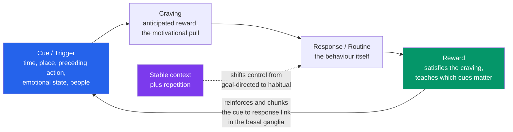

# 🔁 Habits and Behavior Change

> [!abstract] TL;DR
> A **habit** is a behavior that has been repeated so consistently in a stable context that it is triggered *automatically by a cue* rather than by a fresh decision — the control shifting from the effortful, goal-directed part of the brain to the cheap, chunked machinery of the **basal ganglia**. The mechanism is the **habit loop**: a **cue** fires a **craving** that drives a **routine** whose **reward** reinforces the whole cycle (Duhigg's three-part loop; Clear's four-part refinement). This is why *systems beat goals* for a learning practice: motivation and willpower are volatile and finite, but a well-designed cue running in a stable environment fires whether or not you feel like it. To *build* a habit you increase **B = MAP** (Fogg: make the behavior easy enough that low motivation still triggers it), anchor it to an existing routine (**habit stacking / implementation intentions**), keep the cue consistent, and slash the **activation energy**; to *break* one you make the cue invisible and add friction. Formation is slower than the myth of "21 days" — Lally et al. found a **median of ~66 days** with enormous individual variance, and, reassuringly, *missing an occasional day does not derail the process*.

---

## Intuition

**Analogy: the path worn across the grass.** Imagine a new university campus where the paved walkways form neat right angles between the buildings. On day one, everyone follows the pavement. But the shortest route from the library to the dining hall cuts diagonally across a lawn, and one hurried student walks it. Then another. Each footstep flattens the grass a little more, until a visible **desire path** appears — and once it exists, *nobody decides* to take it anymore. The worn track itself pulls people in. Walking the diagonal is no longer a choice weighed against the pavement; it is simply what the ground now affords.

A habit is a desire path worn into your nervous system. Early on, a study session is a diagonal you have to *choose* to walk, effortfully, against the pull of easier routes (the phone, the couch). Every repetition in the same context flattens the neural grass a little more. Eventually the cue — 7pm, at your desk, coffee poured — *is* the path, and the behavior initiates before deliberation gets a vote. The practical corollary follows immediately: if you want a behavior to become effortless, **stop relying on the daily choice and start engineering the path** — where it starts, what triggers it, how smooth the surface is. And if you want to kill a bad path, you don't fight the walkers with willpower; you put a fence across the entrance.

---

## How It Works

### Core Mechanics

A habit is not "a behavior you do a lot." It is behavior that has migrated to a different **control system**. Neuroscientists distinguish two modes of action selection:

1. **Goal-directed control** — the deliberate, model-based system. It represents the *outcome*, evaluates whether that outcome is still worth it, and is flexible but slow and metabolically expensive (prefrontal cortex, associative striatum). This is you *deciding* to study.
2. **Habitual control** — the automatic, model-free system. It maps a *cue directly to a response* without re-consulting the value of the outcome. It is fast, cheap, and runs with almost no working-memory load — but it is **rigid**: it keeps firing even when the reward has gone stale (sensorimotor striatum / dorsolateral basal ganglia).

Repetition in a **stable context** is the engine that transfers control from system 1 to system 2. As a behavior is learned, the basal ganglia perform **chunking**: an entire action sequence ("unlock phone, open app, scroll") gets compressed into a single retrievable unit, bracketed by neural activity that spikes at the *start* and *end* of the routine but goes quiet in the middle — the signature of an automated chunk running on autopilot. Once chunked, the sequence is triggered as a whole by its cue.

The behavioral expression of this machinery is the **habit loop**:

- **Cue (trigger):** a context that reliably precedes the behavior — a time, a place, a preceding action, an emotional state, the presence of other people. Cue *consistency* is the single most important lever in formation: a behavior tied to a stable, recurring cue automates; one tied to a shifting context never does.
- **Craving (Clear's addition):** the anticipatory motivational pull — you don't crave the cigarette, you crave the *relief*; you don't crave the flashcards, you crave the *feeling of competence*. The craving is what gives the cue its power.
- **Routine / Response:** the behavior itself.
- **Reward:** the payoff that satisfies the craving and, crucially, teaches the brain *which cues are worth remembering next time* — closing and strengthening the loop.

Charles Duhigg popularized the three-part **cue → routine → reward** loop; James Clear's *Atomic Habits* inserts **craving** between cue and response to foreground the motivational step (**cue → craving → response → reward**). Same circuit, different resolution.

**Why this beats goals and willpower for a learning practice.** Motivation is a wave — it peaks and crashes on a schedule you don't control. Willpower is a finite, depletable resource you're forced to spend every time behavior is a *decision*. A habit removes the decision: the cue does the work that motivation and willpower would otherwise have to. This is the heart of Clear's "you do not rise to the level of your goals, you fall to the level of your systems." A goal is a *direction*; a habit is the *mechanism* that moves you there whether or not you feel inspired at 7pm on a Tuesday.

### Flow / Architecture



---

## Key Concepts

### Secondary Level

- **A habit is an automatic behavior triggered by a cue.** You didn't decide to check your phone the moment you sat down — a cue fired and the routine ran on its own. That automaticity is the whole point: it makes good behaviors effortless and bad ones stubborn.
- **The habit loop: cue, routine, reward.** Something triggers the behavior (cue), you do it (routine), and you get a payoff (reward). The reward is what makes the loop repeat. *Atomic Habits* adds a fourth piece — the **craving** (the wanting) — between the cue and the routine.
- **Systems beat goals.** A goal is where you want to end up ("get fit," "learn Spanish"). A system is the *daily routine* that gets you there. You can't control whether you feel motivated, but you can design a system that runs anyway. Winners and losers often share the same goal — the difference is the system.
- **Make good habits easy, bad habits hard.** To build a study habit, remove friction: lay the book out, close the tabs, sit in the same chair at the same time. To break a bad one, add friction: log out, delete the app, put the snacks in the basement. Small changes to how *easy* a behavior is do most of the work.
- **Habit stacking.** Attach a new habit to one you already do: "*After* I pour my morning coffee, *I will* review five flashcards." The old habit becomes the reliable cue for the new one.
- **It takes longer than 21 days — and one missed day is fine.** The "21 days to a habit" claim is a myth. Real research found it took about **two months on average** (and much longer for some people). Reassuringly, skipping a single day barely matters — consistency over the long run beats perfection.
- **1% better every day.** Tiny improvements feel invisible day to day, but they *compound*. Getting 1% better each day for a year leaves you roughly 37 times better; getting 1% worse each day leaves you near zero. Small habits are powerful precisely because they multiply over time.

### Undergraduate Level

- **Goal-directed vs habitual control (dual-process action selection).** Early in learning, behavior is **goal-directed**: sensitive to the value of the outcome and flexible, but effortful. With repetition it becomes **habitual**: cue-driven, insensitive to outcome value, and cheap. The classic evidence is **outcome devaluation** — a well-trained rat keeps pressing a lever for a food it has just been made sick of, because the habit fires from the cue, not from a live evaluation of the reward. Humans do the same: keep eating popcorn in a cinema even when it's stale, because *the cinema* is the cue.
- **The basal ganglia and chunking (Graybiel).** As sequences automate, the dorsolateral striatum compresses them into **chunks** with "bracketing" activity at the start and end of the routine. This is why habits run as all-or-nothing sequences and why they free up the prefrontal cortex — the cognitive load of the behavior drops toward zero once it's chunked.
- **Cue consistency and context stability.** Habit formation depends far more on *consistency of context* than on total repetitions. Performing a behavior 40 times in the *same* setting automates it; performing it 40 times in scattered settings does not. Corollary: **context disruption** (a move, a new job, a holiday) is where old habits die and new ones can be planted — the cues are gone, so behavior reverts to goal-directed control. Interventions timed to life transitions ("fresh start") exploit this.
- **Implementation intentions and habit stacking.** Gollwitzer's **implementation intentions** — "*if* situation X arises, *then* I will do Y" — pre-commit the cue-response link, delegating action initiation to the environment. **Habit stacking** is a special case where the cue is *an existing habit* ("after I brush my teeth, I read one page"). Both convert a fragile *goal intention* into a near-automatic trigger (see [[Goal_Setting_and_Self_Monitoring]]).
- **The Fogg Behavior Model: B = MAP.** BJ Fogg formalizes that a behavior occurs only when three factors converge *at the same moment*: **M**otivation, **A**bility, and a **P**rompt (cue). Behavior fires when the motivation-ability combination is above an "action line" *and* a prompt appears. The practical insight: **motivation is unreliable, so lower the ability barrier** — make the behavior tiny enough that it happens even when motivation is low. Hence **Tiny Habits**: "floss one tooth," "read one sentence." Starting absurdly small guarantees the prompt succeeds, and the behavior grows naturally once the routine exists.
- **Reducing activation energy and environment design.** Every unit of friction between the cue and the behavior is a chance to bail. **Environment design** engineers the friction: make the study desk cue-rich and distraction-free, keep the guitar on a stand not in its case, put junk food out of sight. Making a good behavior the *path of least resistance* substitutes for willpower.
- **Temptation bundling.** Pair a behavior you *should* do with one you *want* to do — only listen to your favorite podcast while at the gym, only drink the fancy coffee while doing flashcards. The wanted activity supplies the immediate reward the effortful one lacks, patching the loop's weak link.
- **Breaking bad habits: invert the laws.** If good habits are made obvious, attractive, easy, and satisfying, bad ones are broken by making the cue **invisible** (remove it from the environment), the craving **unattractive** (reframe it), the response **hard** (add friction — the strongest lever), and the reward **unsatisfying**. You rarely delete a chunked habit; you *crowd it out* or *cut off its cue*.

### Graduate Level

- **The Lally et al. (2010) asymptotic model — and what "66 days" really means.** Lally tracked 96 people adopting a new eating, drinking, or activity behavior and modeled daily self-reported **automaticity** (a self-report habit index) against days of repetition. The best fit was an **asymptotic exponential rise to a plateau**: automaticity climbs steeply at first, then flattens as it saturates. The headline "**median 66 days**" is the *median time to reach 95% of each person's asymptote* — and it is a **median of a wildly spread distribution** (individual estimates ranged from ~18 to 254 days, with some curves not plateauing within the study window at all). Two further findings matter more than the number: **early repetitions add more automaticity than later ones** (diminishing returns — the curve is concave), and **"missing one opportunity to perform the behaviour did not materially affect the habit formation process,"** i.e., an occasional lapse barely dents the trajectory. This demolishes both the "21-day" myth and the all-or-nothing "I broke my streak, I've failed" mindset. The demo below reconstructs exactly this model.
- **Why systems beat goals, formalized.** A goal is a *reference value*; a habit is *automated, low-cost policy* for reaching it. Goals suffer known failure modes — the **intention-action gap**, the yo-yo of "achieve the goal, then revert because nothing changed the underlying behavior," and the motivational trough between distant milestones. Habits attack the mechanism instead of the target: they make the *rate of progress* independent of fluctuating motivation. This is the applied-learning statement of self-regulation theory — the endgame of any self-regulation system is to convert effortful, deliberate strategy use into **automaticity**, freeing working memory for the actual learning (see [[Self_Regulated_Learning]], [[Automaticity_and_Procedural_Fluency]]).
- **The Transtheoretical Model (stages of change; Prochaska & DiClemente).** Behavior change is not a single event but a progression through stages: **precontemplation** (not yet considering change) → **contemplation** (ambivalent, weighing it) → **preparation** (intending to act soon, small steps) → **action** (actively changing) → **maintenance** (sustaining the new behavior, guarding against relapse), with **relapse** treated as a normal, expected loop back rather than a failure. The practical implication is that *interventions must be stage-matched*: information helps a contemplator but is wasted on someone in precontemplation, while action-oriented tools (implementation intentions, environment design) are premature for someone still ambivalent. The model is descriptively influential but critiqued for arbitrary stage boundaries and mixed intervention evidence — treat it as a useful map, not a mechanism.
- **Keystone habits and behavioral cascades (Duhigg).** Some habits — Duhigg's **keystone habits** — disproportionately restructure other behaviors. Regular exercise correlates with people spontaneously eating better, procrastinating less, and using credit cards less; a daily study block can anchor better sleep and screen discipline. The mechanism is partly *identity* ("I'm the kind of person who trains / studies") and partly *small wins* that raise self-efficacy and spill into adjacent domains. The strategic move is to find the one or two keystone habits whose adoption pulls a cascade, rather than trying to reform everything at once.
- **Identity-based habits and the compounding argument.** Clear argues the durable unit of change is not the outcome ("I want to read more") but the **identity** ("I am a reader") — every performed instance is a "vote" for a self-image, and the self-image then generates the behavior top-down. Combined with **compounding** (the 1%-better geometric argument), this reframes habits as an *asset that accrues interest*: the value is invisible early (you are "below the plateau of latent potential") and only becomes obvious after the curve turns up. The same compounding runs in reverse for bad habits, which is why they feel harmless in the moment and catastrophic in aggregate.
- **Boundary conditions and honest caveats.** The habit construct is powerful but oversold in pop treatments. Not all valuable learning behaviors *can* fully automate — genuinely effortful, novel problem-solving (deliberate practice) resists chunking by design, so "make studying a mindless habit" is only half-right: you can automate *showing up and starting* (the cue and the activation), but the cognitively demanding core still requires goal-directed effort. And habit strength is domain-limited: simple, frequent, context-stable behaviors (flossing, a daily review) automate readily; complex, infrequent, or context-variable ones (writing a thesis) never become true habits and must lean on goal-directed self-regulation.

---

## Python Demo

```python
# numpy + matplotlib only.
# Reconstructs the Lally et al. (2010) model of habit formation and probes
# the "one missed day doesn't matter" finding.
#
# MODEL. Automaticity A rises toward a personal asymptote A_max via a
# gap-closing (asymptotic exponential) update -- each PERFORMANCE of the
# behaviour closes a fixed fraction g of the remaining gap:
#
#       performed day:  A <- A + g * (A_max - A)      # diminishing returns
#       missed day:     A <- A * (1 - decay)          # slight, recoverable dip
#
# Performing every day gives A(t) = A_max * (1 - (1-g)^t): a steep early climb
# that flattens to a plateau -- exactly the curve Lally fit to real data.
#
# The learning rate g is set from each person's "time to 95% of asymptote":
#       (1-g)^t95 = 0.05   ->   g = 1 - 0.05**(1/t95)
# Lally reported a MEDIAN t95 of ~66 days but a huge spread (~18 to 254 days),
# which we reproduce across simulated individuals.

import numpy as np
import matplotlib.pyplot as plt

rng   = np.random.default_rng(7)
DAYS  = 140
A_MAX = 95.0          # asymptotic automaticity on a 0-100 self-report scale
DECAY = 0.02          # small automaticity loss on a missed day

def g_from_t95(t95):
    """Learning rate that reaches 95% of the asymptote in t95 daily reps."""
    return 1.0 - 0.05 ** (1.0 / t95)

def simulate(schedule, g, a_max=A_MAX, decay=DECAY):
    """schedule[d] = True if the behaviour was performed on calendar day d."""
    A = np.zeros(len(schedule))
    for d in range(1, len(schedule)):
        if schedule[d]:
            A[d] = A[d - 1] + g * (a_max - A[d - 1])   # close the gap
        else:
            A[d] = A[d - 1] * (1.0 - decay)            # minor, recoverable dip
    return A

days = np.arange(DAYS + 1)

# ---- Panel 1: individual variability in habit-formation speed ----
# Six people who all perform daily but differ in how fast they automate.
t95_people = [18, 40, 66, 95, 154, 254]     # Lally's reported spread of t95
perfect    = np.ones(DAYS + 1, dtype=bool)

fig, (ax1, ax2) = plt.subplots(1, 2, figsize=(13.5, 5.5))

for t95 in t95_people:
    A = simulate(perfect, g_from_t95(t95))
    ax1.plot(days, A, lw=2, label=f"t95 = {t95:3d} days")

ax1.axvline(66, color="grey", ls="--", lw=1.2, label="median ~66 days")
ax1.axhline(0.95 * A_MAX, color="black", ls=":", lw=0.9)
ax1.text(2, 0.95 * A_MAX + 1.5, "95% of asymptote", fontsize=8)
ax1.set_xlabel("Days of repetition")
ax1.set_ylabel("Automaticity (0-100)")
ax1.set_title("Lally et al.: automaticity is an asymptotic curve\n"
              "same shape, wildly different speeds across people")
ax1.set_ylim(0, 100)
ax1.legend(fontsize=8, loc="lower right")
ax1.grid(alpha=0.3)

# ---- Panel 2: does missing the occasional day matter? ----
g66            = g_from_t95(66)                       # the "median" person
never_miss     = np.ones(DAYS + 1, dtype=bool)
occasional     = rng.random(DAYS + 1) > 0.15         # ~15% of days missed
occasional[0]  = True

A_perfect      = simulate(never_miss, g66)
A_occasional   = simulate(occasional, g66)

THRESH = 0.80 * A_MAX                                  # "habit is formed" line
def cross(A):
    hit = np.where(A >= THRESH)[0]
    return int(hit[0]) if hit.size else None

d_perfect, d_occ = cross(A_perfect), cross(A_occasional)

miss_days = days[~occasional]
ax2.plot(days, A_perfect,    lw=2.4, color="#2563eb", label="performs every day")
ax2.plot(days, A_occasional, lw=2.4, color="#059669",
         label="misses ~15% of days at random")
ax2.plot(miss_days, A_occasional[miss_days], "o", ms=3.5, color="#dc2626",
         label="a missed day")
ax2.axhline(THRESH, color="grey", ls="--", lw=1.0, label="habit-formed threshold")
ax2.set_xlabel("Calendar days")
ax2.set_ylabel("Automaticity (0-100)")
ax2.set_title("An occasional missed day barely shifts the curve\n"
              "consistency-on-average beats perfection")
ax2.set_ylim(0, 100)
ax2.legend(fontsize=8, loc="lower right")
ax2.grid(alpha=0.3)

plt.tight_layout()
plt.savefig("habit_formation.png", dpi=150)
plt.show()

n_missed = int((~occasional).sum())
print(f"Perfect performer   : reached habit-formed threshold on day {d_perfect}")
print(f"Occasional misser   : reached it on day {d_occ} "
      f"(missed {n_missed} of {DAYS} days)")
print(f"Delay from {n_missed} missed days: {d_occ - d_perfect} extra days")
# Despite skipping roughly 1 day in 7, the occasional misser reaches automaticity
# only a handful of days later than the perfect performer -- reproducing Lally's
# finding that lapses are recoverable and long-run consistency is what counts.
```

**What the demo shows.** The left panel reproduces the core Lally result: automaticity is a **concave rise to a plateau**, with the steepest gains in the *first* couple of weeks (early reps are worth more) and a long flattening tail. Every simulated person follows the *same shape*, yet the time to plateau ranges from under three weeks to over eight months — the "66 days" headline is a median sitting inside a huge spread, so it should never be read as a deadline. The right panel stress-tests the reassuring finding: a learner who skips roughly one day in seven (red dots) tracks almost on top of the flawless performer and crosses the "habit formed" threshold only a handful of days later. The takeaway for a study practice is direct — **long-run consistency, not an unbroken streak, is what builds automaticity**, so a missed day is a rounding error, not a reason to quit.

---

## Real-World Applications

- **Duolingo streaks and language-learning apps.** Duolingo is a habit-engineering machine: a **consistent daily prompt** (the notification and streak reminder), a **tiny ability barrier** (a lesson takes minutes — pure Fogg B=MAP), and an immediate, satisfying **reward** (XP, the streak flame, celebratory animation). The streak weaponizes loss aversion to protect cue consistency. The failure mode is instructive too — some users end up practicing to *protect the streak* rather than to learn, illustrating how a reward can capture a loop and drift from the real goal.
- **Anki and spaced-repetition study routines.** Effective self-learners don't rely on motivation to review flashcards; they **stack the review onto a stable daily cue** ("after morning coffee, clear the Anki queue") in a fixed location, turning [[Spaced_Repetition_and_the_Spacing_Effect]] from a good intention into an automatic routine. The activation energy is minimized because the deck is one click away and the session ends when the queue empties — a clear, satisfying stop.
- **Gym and health-behavior interventions.** Implementation-intention studies ("*if* it is 7am *then* I put on running shoes") reliably raise exercise adherence, and behavioral weight-loss programs find that *frequency of self-monitoring* is among the strongest predictors of success — the tracking log becomes both the cue and the reward. Fitness apps that pair a habit with a stable anchor and a visible streak are applying the same loop.
- **Fogg's "Tiny Habits" in behavior-change coaching.** BJ Fogg's method — anchor a *tiny* new behavior to an existing routine and celebrate immediately ("after I sit at my desk, I open my textbook to page one, then I fist-pump") — is used in health coaching and corporate learning precisely because it sidesteps unreliable motivation by driving ability to near-maximum and supplying an instant emotional reward that wires in the loop.
- **Product design and the attention economy.** Nir Eyal's "Hooked" model (trigger, action, variable reward, investment) is the habit loop applied — often adversarially — to consumer apps: infinite scroll and pull-to-refresh supply *variable* rewards (the most reinforcing schedule, per [[Operant_Conditioning]]) on a frictionless action. Understanding the loop is thus both how you *build* good study habits and how you *defend* against engineered bad ones (make their cues invisible, add friction — delete the app, grayscale the screen).

---

## Common Pitfalls

- **Believing the "21 days" myth.** The widely repeated 21-day figure traces to a plastic surgeon's 1960s observation about patients adjusting to appearances, not to habit research. Lally's data give a *median* nearer **66 days with a range up to eight months**. Expecting automaticity in three weeks sets learners up to quit right as the curve is still climbing. Fix: expect months, and judge progress by *decreasing effort*, not a calendar.
- **The "broken streak" spiral (all-or-nothing thinking).** Because Lally showed a single missed day barely matters, the real damage from a lapse is *psychological*, not mechanical — treating one miss as total failure ("I've ruined it") triggers abandonment. Fix: adopt "never miss twice." A lapse is a data point; two in a row is the start of a new (absent) habit.
- **Relying on motivation and willpower instead of design.** Motivation fluctuates and willpower depletes, so any behavior that stays a *decision* eventually loses on a bad day. Fix: engineer the cue and the environment so the behavior needs no decision — same time, same place, gear laid out, distractions removed.
- **Inconsistent or unstable cues.** A behavior scattered across random times and places never automates, because habit strength is built on *context consistency*, not raw repetition count. Fix: pin the behavior to one reliable, recurring anchor (a preceding habit, a fixed time-and-place).
- **Starting too big.** Ambitious first versions ("study three hours daily") raise the ability barrier so high that low-motivation days break the chain before automaticity forms. Fix: shrink it below the point of resistance (Fogg: "read one page"); the routine, not the volume, is what you're installing first, and volume grows once the cue reliably fires.
- **Fighting a bad habit with willpower instead of cutting its cue.** Chunked habits are cue-triggered and outcome-insensitive, so out-resolving them in the moment is a losing battle. Fix: make the cue **invisible** and add **friction** (log out, remove the app, leave the phone in another room) — attack the loop's entry point, not the routine's exit.
- **Trying to automate the wrong thing.** Genuinely effortful, novel cognitive work (deliberate practice) can't be reduced to a mindless chunk. Fix: automate the *activation* (showing up, starting, clearing the desk) and reserve goal-directed effort for the demanding core — don't expect the hard thinking itself to become "habit."

---

## Related Concepts

- [[Goal_Setting_and_Self_Monitoring]] — the counterpart lens: goals set the *direction* and implementation intentions / self-monitoring feed habit formation; this note argues the *system* (habit) is what actually executes the goal.
- [[Motivation_and_Learning]] — explains *why* willpower and motivation are unreliable (they fluctuate and deplete), which is the core case for offloading behavior onto cue-driven habits instead.
- [[Self_Regulated_Learning]] — habit formation is the endgame of self-regulation: converting effortful, deliberately-chosen strategies into low-cost automatic routines that no longer tax executive control.
- [[Operant_Conditioning]] — the reinforcement framework underneath the loop; the "reward" that strengthens a habit is operant reinforcement, and *variable* reward schedules explain the stickiest (often harmful) habits.
- [[Automaticity_and_Procedural_Fluency]] — the cognitive-mechanism sibling: chunking and the shift from working-memory-heavy performance to automatic execution is exactly what turns a behavior into a habit.
- [[Decision_Making_and_Reward_Circuits]] — the neural substrate: dopaminergic reward-prediction error and the goal-directed (associative striatum) vs habitual (sensorimotor striatum) control distinction that mechanistically define a habit.

---

## Review Questions

### Secondary Tier

1. A friend wants to "start reading more." Using the habit loop (cue, routine, reward) and habit stacking, design a concrete tiny habit for them — name the cue, the routine, and the reward — and explain why anchoring it to an existing habit works better than "just deciding to read."
2. Explain the desire-path analogy in your own words. Why does relying on willpower to study every night eventually fail, and what would you change about the *environment* instead?

### Undergraduate Tier

3. Using the Fogg Behavior Model (B = MAP), explain two different reasons a person might fail to do their intended evening study session, and give a distinct fix for each — one that raises **ability** and one that fixes the **prompt** — without touching motivation.
4. Lally et al. found a median of ~66 days but "missing one day doesn't matter." Explain what the 66-day figure actually measures, why the *range* around it matters more than the median, and how the asymptotic shape of the curve justifies the claim that an occasional lapse is harmless.
5. Distinguish goal-directed from habitual control. Using the outcome-devaluation phenomenon, explain why a chunked bad habit keeps firing even after you no longer want its reward, and what this implies about the *best strategy* for breaking it.

### Graduate Tier

6. "Systems beat goals." Formalize this claim using the intention-action gap and the idea that habits make the *rate of progress* independent of motivation. Then state a boundary condition: name a category of learning behavior that *cannot* be fully automated and explain why goal-directed self-regulation remains necessary there.
7. Design a stage-matched intervention (Transtheoretical Model) for a student who *says* they want to build a daily deliberate-practice habit but hasn't started. Identify which stage they are in, why action-oriented tools like implementation intentions would be premature, and what you would do first.
8. Critically evaluate the popular "identity-based habits + 1% compounding" narrative. Where is it genuinely supported by the science (Lally's curve, keystone habits, self-efficacy spillover), and where does it overreach (the precision of the 1% math, the automatability of complex cognitive work, the replication status of stage models)? Argue for a defensible synthesis.

---

## Sources

- [Lally, P., van Jaarsveld, C. H. M., Potts, H. W. W. & Wardle, J. (2010). "How are habits formed: Modelling habit formation in the real world." *European Journal of Social Psychology*, 40(6), 998–1009.](https://doi.org/10.1002/ejsp.674)
- [Wood, W. & Rünger, D. (2016). "Psychology of Habit." *Annual Review of Psychology*, 67, 289–314.](https://doi.org/10.1146/annurev-psych-122414-033417)
- [Graybiel, A. M. (2008). "Habits, Rituals, and the Evaluative Brain." *Annual Review of Neuroscience*, 31, 359–387.](https://doi.org/10.1146/annurev.neuro.29.051605.112851)
- [Gardner, B., Lally, P. & Wardle, J. (2012). "Making health habitual: the psychology of 'habit-formation' and general practice." *British Journal of General Practice*, 62(605), 664–666.](https://doi.org/10.3399/bjgp12X659466)
- [Fogg, B. J. (2009). "A Behavior Model for Persuasive Design." *Proceedings of the 4th International Conference on Persuasive Technology*, Article 40.](https://doi.org/10.1145/1541948.1541999)
- Clear, J. (2018). *Atomic Habits*. Avery. / Duhigg, C. (2012). *The Power of Habit*. Random House.

---

#learning-science #habits #behavior-change #automaticity #implementation-intentions
