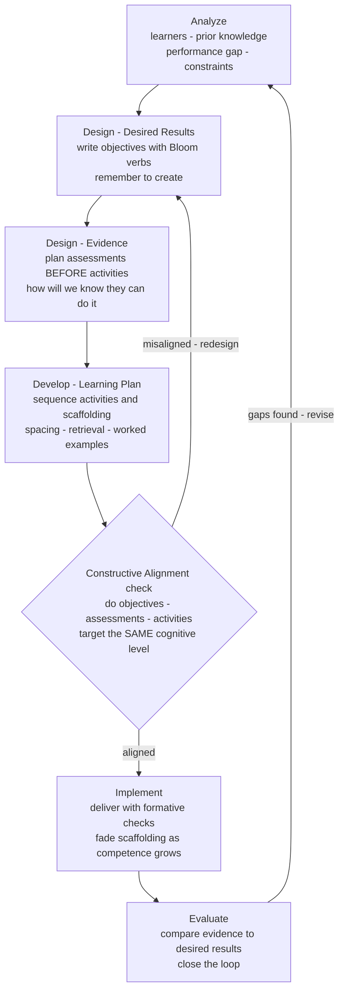

# 📐 Instructional Design Principles

> [!abstract] TL;DR
> **Instructional design (ID)** is the systematic, evidence-based engineering of learning experiences: instead of "picking topics and hoping," you specify *what learners must be able to do*, decide *how you will know they can do it*, and only then choose the *activities and materials* that get them there. Its three load-bearing frameworks — **ADDIE** (Analyze, Design, Develop, Implement, Evaluate) as the process spine, **backward design / Understanding by Design** (Wiggins & McTighe: start from desired results and assessment before instruction), and **constructive alignment** (Biggs: objectives, activities, and assessment all target the *same* cognitive level) — share one commitment: coherence. The whole toolkit of learning science (spacing, retrieval practice, worked examples, cognitive-load management, dual coding, feedback, scaffolding) then plugs into that coherent skeleton. Done well, ID is what separates a course that *feels* covered from one that is actually *learned*.

## Intuition

**Analogy: an architect never starts by laying bricks.**

Imagine two people asked to "build a house." The first is excited and starts immediately — laying bricks where they look nice, hanging a beautiful door, tiling a wall because the tiles are pretty. The result is a pile of attractive components that do not add up to a house anyone can live in: no load path, doors opening onto walls, a roof that does not meet the frame. The second person is an architect. They begin from the *end*: who will live here and what must the house let them do? Then they define how the finished house will be *inspected* — what it means to pass code, hold weight, keep out rain. Only after the requirements and the inspection criteria are fixed do they draw the blueprints, and every brick laid afterward exists to satisfy the plan.

Teaching has exactly these two personalities. The eager bricklayer is the instructor who starts from *activities* — "let's do a fun simulation, watch this video, run this group project" — and from *coverage* — "we must get through all twelve chapters." Wiggins and McTighe call these the **twin sins** of design: activity-oriented and coverage-oriented teaching. Both produce a pile of engaging or comprehensive components that never resolve into durable, usable competence. The architect is the instructional designer: they start from the desired results, define the evidence that would prove learning happened, and then — *last* — choose the instruction. Everything downstream serves an explicit goal, and nothing is in the course "just because."

---

## How It Works

Instructional design treats a course, lesson, or training module the way an engineer treats a system: as something to be **specified, built, tested, and revised** against measurable requirements, not improvised. Four ideas do most of the work — a process model, a design philosophy, an alignment principle, and a language for objectives — and the science-of-learning principles fill in the details.

### 1. ADDIE — the process spine

**ADDIE** is the classic instructional-systems-design cycle: **A**nalyze (who are the learners, what is their prior knowledge, what is the real performance gap, what constraints exist), **D**esign (write objectives, plan assessments, sketch the strategy), **D**evelop (build the actual materials, activities, media), **I**mplement (deliver it), **E**valuate (did it work, and revise). It is iterative, not linear — Evaluate feeds back into Analyze, and every phase can loop. ADDIE is deliberately content-agnostic; it says *what stages to go through*, while backward design and constructive alignment say *how to do the Design stage well*.

### 2. Backward design (Understanding by Design) — start from the end

Wiggins and McTighe invert the intuitive order into three stages:

1. **Identify desired results.** What enduring understandings, transferable skills, and knowledge should remain after the course is forgotten in detail? These become the **learning objectives**, written with precise, observable verbs (see Bloom below).
2. **Determine acceptable evidence.** *Before* planning any lesson, decide what performance would count as proof of each objective — the assessments. This is the radical move: you design the test first, so instruction has a target to aim at rather than a topic to cover.
3. **Plan learning experiences and instruction.** Only now choose activities, sequence, and materials — each justified by how it moves learners toward the evidence defined in stage 2.

Designing assessment *before* instruction is what prevents the twin sins: an activity that does not generate evidence for a desired result simply does not make the cut.

### 3. Constructive alignment — objectives, activities, and assessment must agree

Biggs' **constructive alignment** adds the coherence guarantee. Learners, he observed, do not learn what we *teach*; they learn what they believe they will be *assessed on* — assessment is the "hidden curriculum" that actually drives behavior. So the three elements must point at the same cognitive target:

- **Intended learning outcomes** stated as verbs at a specific level ("*analyze* a dataset," "*design* an experiment").
- **Teaching-learning activities** that require students to *practice that very verb* (if the outcome is "design," students must actually design, not watch designs being explained).
- **Assessment tasks** that make students *perform that verb* under evaluation.

When all three align, the system "traps" the learner into the intended deep processing. When they misalign — objectives say "evaluate" but the exam is multiple-choice recall — students correctly infer that recall is what pays, and they optimize for it. Misalignment is the single most common reason well-intentioned courses underdeliver.

### 4. Bloom's revised taxonomy — a language for objectives

You cannot align to a fuzzy verb like "understand" or "know." Anderson and Krathwohl's **revised Bloom's taxonomy** (2001) gives a six-level ladder of cognitive operations, each with action verbs, from lower to higher order:

**Remember → Understand → Apply → Analyze → Evaluate → Create.**

The level you choose dictates everything downstream: an objective at *Remember* ("list the phases of mitosis") licenses a recall quiz; an objective at *Evaluate* ("critique a proposed cell-cycle model for internal consistency") demands an assessment and activities operating at that height. Higher-order objectives are not automatically "better," but the level must be *chosen deliberately and matched* across objective, activity, and assessment. This taxonomy is also where instructional design shakes hands with critical-thinking pedagogy, which lives in the top three tiers.

### 5. Gagné's nine events and Merrill's first principles — micro-structure of a lesson

Where backward design shapes the *course*, **Gagné's nine events of instruction** shape a single *lesson*: (1) gain attention, (2) inform learners of the objective, (3) stimulate recall of prior learning, (4) present the content, (5) provide learning guidance, (6) elicit performance (practice), (7) provide feedback, (8) assess performance, (9) enhance retention and transfer. **Merrill's first principles of instruction** distill the common core of effective models into five: learning is promoted when it is **problem-centered**, and when it activates prior knowledge, **demonstrates** the skill, gives learners chances to **apply** it, and helps them **integrate** it into their own lives. Both are checklists that operationalize the same commitments as backward design at finer grain.

### 6. The science-of-learning toolkit, applied

A coherent skeleton is necessary but not sufficient — the activities that fill it should be the ones that actually build durable memory. Instructional design is where the vault's whole principle set becomes design decisions:

- **Spacing and sequencing** — distribute practice across a course calendar and order topics by prerequisite structure rather than by textbook chapter.
- **Retrieval practice** — build low-stakes quizzing and "brain dumps" into the design; assessment becomes an *instrument of learning*, not just measurement.
- **Worked examples and cognitive-load management** — scaffold novices with fully worked solutions and integrated diagrams, keeping intrinsic load metered and extraneous load near zero.
- **Dual coding** — pair words with visuals following multimedia principles.
- **Feedback** — Gagné's event 7 and the engine of formative assessment; timely, specific, actionable.
- **Interleaving and varied practice** — mix problem types so learners must *discriminate* which method applies, targeting transfer.

### 7. Scaffolding and the gradual release of responsibility

Support should not be constant — it should **fade** as competence grows. The **gradual release of responsibility** model sequences a skill as *I do it* (modeling / worked example), *we do it* (guided practice), *you do it together* (collaborative), *you do it alone* (independent). Framed by Vygotsky's **zone of proximal development**, the designer keeps each task just beyond what the learner can do unaided but within reach *with* support, then withdraws the support as it is internalized. Failing to fade is the **expertise-reversal effect**: guidance that rescued the novice becomes redundant extraneous load — and a learning ceiling — for the now-competent learner. The Python demo below quantifies exactly this.

### 8. Formative assessment, mastery learning, and universal design

- **Formative vs summative assessment.** Summative assessment *judges* learning at the end; **formative assessment** *informs* learning during it, feeding both instructor and learner the signal needed to adjust. Black and Wiliam's landmark synthesis showed formative assessment among the highest-leverage interventions available.
- **Mastery learning and the 2-sigma problem.** Bloom's **mastery learning** requires students to reach a competence threshold on each unit — with corrective feedback and re-tries — before advancing. His famous **2-sigma problem** reported that one-to-one tutoring with mastery methods moved the average student roughly *two standard deviations* above conventional group instruction, posing the open challenge of how to reach tutoring-level outcomes at scale (a challenge adaptive systems and, more recently, AI tutors chase directly).
- **Universal Design for Learning (UDL).** Rather than retrofitting accommodations, UDL designs *from the start* for variability, offering multiple means of **engagement**, **representation**, and **action/expression** so a single design serves the widest range of learners.



---

## Key Concepts

### Secondary (intuitive level)

- **Design backward, not forward.** Decide what you want learners to be able to *do* at the end, figure out how you would *check* that they can, and only then plan the lessons. Do not start from "fun activities" or "chapters to cover."
- **Say it as a verb you can see.** A good goal is something observable: "*solve* a quadratic," "*explain* why the sky is blue," not the vague "*know about* quadratics."
- **Match the test to the goal.** If the goal is to *design* something, the test should ask learners to *design*, not to recall a definition. Learners study for whatever the test rewards.
- **Take the training wheels off gradually.** Start with lots of help (examples, hints), then give less and less as the learner gets it — like moving from watching, to doing together, to doing alone.

### Undergraduate (mechanistic level)

- **ADDIE** is the iterative process spine (Analyze, Design, Develop, Implement, Evaluate); **backward design** governs how to do the Design stage — desired results → evidence → learning plan; **constructive alignment** is the coherence constraint tying objectives, activities, and assessment to one cognitive level.
- **Bloom's revised taxonomy** (Remember, Understand, Apply, Analyze, Evaluate, Create) supplies the verb ladder that makes objectives specific enough to align to and assess.
- **The twin sins** (activity-oriented and coverage-oriented design) are what backward design exists to prevent; both generate components uncoupled from goals.
- **Gagné's nine events** and **Merrill's first principles** operationalize effective lessons at fine grain; the science-of-learning principles (spacing, retrieval, worked examples, dual coding, feedback) are the *activities* that fill an aligned skeleton.
- **Formative vs summative** assessment: formative informs and adjusts *during* learning; summative judges *after*. Scaffolding follows the **gradual release of responsibility** and must **fade** to avoid the expertise-reversal ceiling.

### Graduate (theoretical and design level)

- **Constructive alignment as a systems constraint (Biggs, 1996).** Alignment works because assessment is the operative curriculum; it *constrains the learner's search over study strategies* toward the intended level of processing. Misalignment is not a cosmetic flaw but a control-system fault: the objective is the setpoint, but the assessment is the actual reward signal the learner optimizes, so any gap between them dominates behavior.
- **The 2-sigma problem (Bloom, 1984) and its descendants.** Mastery learning plus one-to-one tutoring shifted mean achievement by ~2 SD, framing personalization and immediate corrective feedback as the largest known instructional levers. This anchors the design case for adaptive tutoring, mastery gating, and — currently — LLM-based tutors, all attempts to approximate tutoring economics at population scale.
- **Load-aware sequencing and faded guidance.** Instructional design is partly *cognitive-load engineering over a trajectory*: pre-train prerequisite schemas, meter intrinsic load through segmenting, and use **faded worked examples** and **completion problems** so guidance decays exactly as expertise rises. Van Merriënboer's 4C/ID model formalizes this whole-task, complexity-laddered approach.
- **Prerequisite structure and learning maps.** Sequencing is not arbitrary ordering but a *partial order* over competencies: a skill's prerequisites must be automatic before the composite skill is taught, or working memory overloads. Knowledge-space / learning-map methods make this dependency graph explicit and drive adaptive routing.
- **Measurement and the alignment audit.** Rigorous ID treats alignment as *auditable*: every summative item maps to an objective, every objective maps to at least one activity that practices its verb, and orphan activities or unassessed objectives are design defects — the same coherence checking a compiler applies to a program.

---

## Python Demo

```python
# numpy + matplotlib only.
#
# CLAIM (gradual release of responsibility / scaffolding fade):
# The BEST instructional-support policy is neither constant-high nor constant-low
# guidance -- it is guidance that FADES as competence grows, keeping the learner
# in the Zone of Proximal Development (ZPD) the whole way.
#
# Model.  A learner has competence c. The task has fixed intrinsic difficulty D.
# Instructional support g REDUCES the difficulty the learner actually confronts:
#       experienced difficulty = D - g
# Learning per session is maximal when the challenge sits a little ABOVE current
# competence -- the "desirable difficulty" gap GAP_OPT (the ZPD sweet spot).
#   * challenge far ABOVE competence  -> overload      -> little learning
#   * challenge far BELOW competence  -> too easy / over-scaffolded -> little learning
# We compare three support policies over N practice sessions.

import numpy as np
import matplotlib.pyplot as plt

N       = 40      # practice sessions
D       = 8.0     # intrinsic task difficulty (fixed by the content)
GAP_OPT = 1.5     # optimal desirable-difficulty gap: challenge just above competence
SIGMA   = 1.5     # width of the productive Zone of Proximal Development
GMAX    = 0.5     # max competence gain per session, achieved inside the ZPD
C0      = 0.0     # starting competence (rank novice)

G_HIGH  = 6.5     # constant-HIGH support -> experienced difficulty D - g = 1.5
G_LOW   = 3.0     # constant-LOW  support -> experienced difficulty D - g = 5.0

def session_gain(challenge_gap):
    # Bell-shaped gain: best when the challenge the learner FACES sits GAP_OPT
    # above their competence. Overload (gap too big) and boredom / over-scaffolding
    # (gap too small or negative) both suppress learning.
    return GMAX * np.exp(-((challenge_gap - GAP_OPT) ** 2) / (2.0 * SIGMA ** 2))

def run(policy):
    c = C0
    c_hist, g_hist = [], []
    for _ in range(N):
        if policy == "high":
            g = G_HIGH
        elif policy == "low":
            g = G_LOW
        else:  # "faded": adaptively lower support to keep the learner in the ZPD
            g = np.clip(D - c - GAP_OPT, 0.0, G_HIGH)
        experienced = D - g            # difficulty the learner actually confronts
        gap         = experienced - c  # how far the challenge sits above competence
        c          += session_gain(gap)
        c_hist.append(c)
        g_hist.append(g)
    return np.array(c_hist), np.array(g_hist)

c_high, g_high_t = run("high")
c_low,  g_low_t  = run("low")
c_fade, g_fade_t = run("faded")

sessions = np.arange(1, N + 1)

fig, (ax1, ax2) = plt.subplots(1, 2, figsize=(13, 5))

# Panel 1: competence trajectories
ax1.plot(sessions, c_high, color="#dc2626", lw=2,   label="Constant HIGH support")
ax1.plot(sessions, c_low,  color="#f59e0b", lw=2,   label="Constant LOW support")
ax1.plot(sessions, c_fade, color="#2563eb", lw=2.5, label="FADED support (tracks ZPD)")
ax1.set_xlabel("Practice session")
ax1.set_ylabel("Competence acquired")
ax1.set_title("Fading scaffolding beats both constant policies")
ax1.legend(loc="lower right")
ax1.grid(alpha=0.3)

# Panel 2: the support policy itself over time
ax2.plot(sessions, g_high_t, color="#dc2626", lw=2,   label="HIGH (never fades)")
ax2.plot(sessions, g_low_t,  color="#f59e0b", lw=2,   label="LOW (never rises)")
ax2.plot(sessions, g_fade_t, color="#2563eb", lw=2.5, label="FADED (declines with mastery)")
ax2.set_xlabel("Practice session")
ax2.set_ylabel("Instructional support / scaffolding  g")
ax2.set_title("Guidance withdrawn as competence grows")
ax2.legend(loc="upper right")
ax2.grid(alpha=0.3)

plt.tight_layout()
plt.show()

print(f"Final competence after {N} sessions:")
print(f"  Constant HIGH support: {c_high[-1]:5.2f}  (fast start, early ceiling)")
print(f"  Constant LOW  support: {c_low[-1]:5.2f}  (novice overwhelmed, slow start)")
print(f"  FADED support:         {c_fade[-1]:5.2f}  (best of both worlds)")
```

**What the demo shows.** The three policies use the *same* number of sessions on the *same* task; only the support schedule differs. The **constant-HIGH** curve rises fastest at first — the novice is well supported and lands right in the productive zone — but it flattens into an early ceiling: once the learner is competent, the heavily-scaffolded task (experienced difficulty ~1.5) is trivially easy, offers no desirable difficulty, and learning stalls. This is the over-scaffolding / expertise-reversal trap: the training wheels are never removed. The **constant-LOW** curve is the mirror image: the novice confronts near-full difficulty, is overwhelmed, and wastes many early sessions crawling forward before competence finally catches up to the challenge. The two constant curves even **cross**. The **FADED** curve withdraws support *exactly as competence grows* (Panel 2 shows its staircase decline while the other two stay flat), holding the learner in the ZPD throughout — so it captures the novice's fast start *and* the expert's high ceiling, finishing well ahead of both. That is the gradual release of responsibility, quantified: the optimal amount of help is not a level, it is a *trajectory*.

---

## Real-World Applications

- **University course and syllabus design.** Backward design and constructive alignment are the dominant frameworks in higher-education teaching centers: instructors write outcome verbs, map every assessment item to an outcome, and audit for orphaned activities. Accreditation bodies increasingly *require* an objectives-assessment alignment matrix.
- **Corporate and compliance training.** ADDIE is the default instructional-systems-design cycle in L&D departments; the Analyze phase's "performance gap" framing keeps training tied to on-the-job behavior rather than content dumping, and Evaluate closes the loop with Kirkpatrick-style outcome measures.
- **Adaptive and mastery-based platforms.** Khan Academy, ALEKS, and Duolingo operationalize mastery learning and prerequisite maps — gating advancement on demonstrated competence, routing along a dependency graph, and spacing retrieval — a direct assault on Bloom's 2-sigma problem, now joined by LLM tutors chasing tutoring-quality personalization at scale.
- **Medical and aviation education.** Simulation-based training with immediate feedback, faded guidance, and mastery thresholds (a learner cannot advance until a procedure is performed to standard) reflects gradual release and deliberate practice designed around patient and passenger safety.
- **Accessible and inclusive design.** Universal Design for Learning shapes public-education materials and ed-tech accessibility standards, building multiple means of representation and expression into the original design rather than retrofitting accommodations.

---

## Common Pitfalls

- **The twin sins: designing from activities or coverage.** Choosing engaging tasks first ("let's do a debate") or racing to "cover the chapters" produces components uncoupled from any desired result. Fix: always derive activities *backward* from objectives and evidence.
- **Fuzzy objectives that cannot be aligned or assessed.** "Understand recursion" is unmeasurable; "trace and write a recursive function that computes a factorial" is. Vague verbs make constructive alignment impossible because there is no defined level to align to.
- **Objective-assessment mismatch.** Stating "students will *evaluate* competing arguments" but grading a multiple-choice recall exam. Students correctly optimize for the *assessment*, so the exam silently redefines the real objective downward. Audit that every assessment item operates at its objective's Bloom level.
- **Never fading the scaffolding.** Keeping worked examples, hints, and heavy structure for learners who no longer need them triggers the expertise-reversal effect and imposes a competence ceiling (see the demo). Support must decline as mastery rises.
- **Confusing "engaging" with "effective."** Games, videos, and rich media can raise satisfaction while adding extraneous load and reducing learning, especially for novices. Engagement is a means to germane processing, not an end.
- **Treating ADDIE as a one-way waterfall.** Skipping the Evaluate-to-Analyze loop turns a design *cycle* into a single shot; real ID iterates, using formative data to revise before scaling.
- **Ignoring prerequisite structure.** Teaching a composite skill before its sub-skills are automatic overloads working memory. Sequence by the dependency graph, not by the table of contents.

---

## Related Concepts

- [[Cognitive_Load_and_Learning]] — the capacity constraint every design decision must respect; instructional design is largely cognitive-load engineering across a learning trajectory (worked examples, faded guidance, expertise reversal).
- [[Learning_Science_Overview]] — the evidence-based principles (spacing, retrieval, desirable difficulties) that instructional design operationalizes into concrete course structure.
- [[Feedback_and_Error_Correction]] — Gagné's event 7 and the engine of formative assessment; timely corrective feedback is central to mastery learning and the 2-sigma effect.
- [[Transfer_of_Learning]] — the ultimate design target; sequencing, interleaving, and varied practice are chosen specifically to promote transfer, not just retention.
- [[Active_and_Problem_Based_Learning]] — the "elicit performance" activities an aligned design should choose; requires *guided* active learning with faded scaffolding, not minimal-guidance discovery.
- [[Retrieval_Practice_and_the_Testing_Effect]] — why assessment should be designed as an *instrument of learning*; low-stakes quizzing built into the plan.
- [[Spaced_Repetition_and_the_Spacing_Effect]] — distributing practice across a course calendar rather than massing it into a unit.
- [[Interleaving_and_Varied_Practice]] — how to sequence practice within and across units so learners discriminate which method applies.
- [[Desirable_Difficulties]] — the principle explaining why fading scaffolding and effortful assessment produce more durable learning.
- [[Dual_Coding_and_Multimedia_Learning]] — Mayer's multimedia principles as materials-design rules that manage extraneous load.
- [[Elaboration_and_Self_Explanation]] — a high-value activity type for germane processing, well suited to Merrill's "demonstration" and "application" principles.
- [[Deliberate_Practice_and_Expertise]] — the skill-acquisition analog of tight objective-practice-feedback loops with progressively harder targets.
- [[Stages_of_Skill_Acquisition]] — the novice-to-expert progression that drives gradual release, faded guidance, and expertise-reversal management.
- [[Self_Regulated_Learning]] — good designs build learner self-regulation and metacognition, not just deliver content.
- [[Motivation_and_Learning]] — Gagné's event 1 (gain attention) and UDL's "multiple means of engagement" pillar.
- [[Critical_Thinking_Frameworks]] — Bloom's higher tiers (Analyze, Evaluate, Create) are where instructional design and critical-thinking pedagogy meet.

---

## Review Questions

**Tier 1 — Recall / Comprehension**
1. Name the three stages of backward design in order, and explain why designing the assessment *before* the instruction prevents the "twin sins."
2. List the six levels of the revised Bloom's taxonomy from lowest to highest, and rewrite the vague objective "know about photosynthesis" as two distinct objectives at two different levels.

**Tier 2 — Application**
3. A course objective says students will "design an experiment to test a hypothesis," but the only graded assessment is a 40-question multiple-choice recall exam. Diagnose the failure using constructive alignment, predict how students will actually study, and propose an aligned assessment plus one aligned activity.
4. Using the demo's model, a designer keeps guidance constant and high for an entire training program. Describe the shape of the resulting competence curve, name the effect responsible for the ceiling, and specify what *signal* you would monitor to decide when to start fading support.

**Tier 3 — Analysis / Synthesis**
5. Bloom's 2-sigma problem reports that mastery-based one-to-one tutoring moves the average learner ~2 SD above conventional instruction, yet tutoring does not scale to whole populations. Design a course that approximates as much of the 2-sigma benefit as possible *without* one human tutor per student — specify how you would use mastery gating, formative assessment, faded scaffolding, spaced retrieval, and a prerequisite map, and identify the cognitive-load risk your design must manage for novices.

---

## Sources

- Wiggins, G., & McTighe, J. (2005). *Understanding by Design* (2nd ed.). ASCD. The definitive backward-design and "twin sins" reference.
- Biggs, J. (1996). "Enhancing teaching through constructive alignment." *Higher Education*, 32(3), 347–364.
- Anderson, L. W., & Krathwohl, D. R. (Eds.). (2001). *A Taxonomy for Learning, Teaching, and Assessing: A Revision of Bloom's Taxonomy of Educational Objectives.* Longman.
- Gagné, R. M., Wager, W. W., Golas, K. C., & Keller, J. M. (2005). *Principles of Instructional Design* (5th ed.). Wadsworth. The nine events of instruction.
- Merrill, M. D. (2002). "First principles of instruction." *Educational Technology Research and Development*, 50(3), 43–59.
- Bloom, B. S. (1984). "The 2 sigma problem: The search for methods of group instruction as effective as one-to-one tutoring." *Educational Researcher*, 13(6), 4–16.
- Black, P., & Wiliam, D. (1998). "Assessment and classroom learning." *Assessment in Education: Principles, Policy & Practice*, 5(1), 7–74.

---

#learning-science #instructional-design #addie #backward-design #blooms-taxonomy
