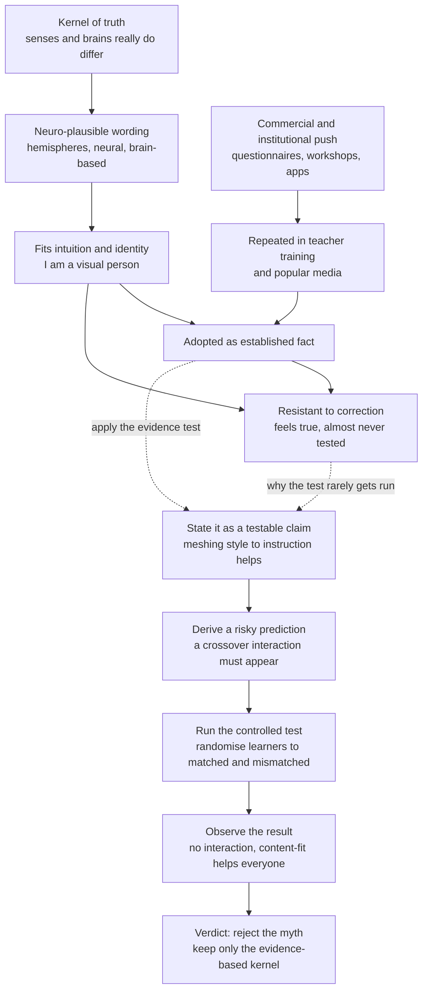

# 🧠 Learning Myths and Neuromyths

> [!abstract] TL;DR
> A **neuromyth** is a false belief about the brain and learning that survives because it *sounds* scientific, flatters our intuitions, and is repeated everywhere. The flagship is the **learning-styles myth**: the idea that each person has a fixed style (visual, auditory, kinaesthetic — VARK) and learns best when instruction is matched to it. That specific "matching" claim is the **meshing hypothesis**, and it is **falsifiable and false** — the properly controlled experiments that would show it (a *crossover interaction* between style and instruction) reliably find **no interaction at all**: everyone learns better from the modality best suited to the **content**, not to their supposed "style." The same graveyard holds "we use only **10% of our brain**," "**left-brain vs right-brain** learners," "**digital natives** think differently," the **Mozart effect**, "learning must always be **easy and fun**" (contradicted by [[Desirable_Difficulties]]), "**discovery learning** is always best," **multiple-intelligences** overreach, and **brain-training** that never transfers. Surveys (Dekker et al., 2012) find the *majority* of teachers endorse several of these. The fix is not memorising a debunk-list but installing one habit: distinguish a **preference** you enjoy from a **strategy** that demonstrably works, and demand the falsifiable test before you believe.

---

## Intuition

**Analogy: the "left-handed people are more creative" of the brain.**

You have heard that left-handers are more artistic, that we swallow eight spiders a year, that sugar makes kids hyperactive. Each one has three ingredients: a **kernel of something real** (handedness exists; spiders exist; sugar is real), a **story that is easy to tell**, and **endless repetition** until "everyone knows it." None of that makes any of them true. The sugar-hyperactivity belief survives double-blind studies that found *zero* effect, because parents *expect* to see it and their expectation edits their memory.

Neuromyths are exactly this species, wearing a lab coat. "You're a visual learner" feels as obviously true as "I'm right-brained" — it fits how you see yourself, a teacher once said it, a quiz on a website confirmed it. But *feeling true* and *being true* are different measurements, and this whole note is about the gap between them. The tell is always the same: the belief has never been asked to make a **risky prediction that could fail**. A real claim about learning says "if this is true, *this specific result* must appear in a controlled experiment." The learning-styles claim makes exactly such a prediction — a crossover interaction — and when we run the experiment, the prediction **does not appear**. That absence is the entire story.

---

## How It Works

### What a neuromyth is, and how common they are

A **neuromyth** (a term popularised by the OECD and by Dekker, Howard-Jones, and colleagues) is a misconception about the brain that is used to justify a practice in education, training, or self-improvement. They are not fringe. In **Dekker et al. (2012)**, surveying UK and Dutch teachers who were *interested in neuroscience*:

- **~97%** agreed that "individuals learn better when they receive information in their preferred learning style" — the learning-styles/meshing claim.
- **~48%** believed "we use only 10% of our brains."
- Large fractions endorsed left-brain/right-brain dominance and the idea that short bouts of coordination exercises can "integrate" the hemispheres.

Follow-up studies across dozens of countries (Howard-Jones, 2014) find the same pattern worldwide, and — the sting in the tail — **greater self-reported neuroscience knowledge did not protect against the myths**. Enthusiasm for brain science actually correlated with believing *more* of them, because a little neuro-vocabulary makes a myth easier to dress up, not easier to detect.

### The anatomy of persistence: why plausible-sounding neuroscience spreads

A neuromyth is engineered — by natural selection among ideas, not by anyone's intent — to be sticky. It survives because it hits several reinforcing cues at once:

1. **A kernel of truth.** People *do* differ; senses *do* exist; hemispheres *are* somewhat specialised. The myth over-extends a real fact into a false rule ("therefore each learner has a fixed sensory channel").
2. **Neuro-plausibility.** Adding words like "brain," "hemisphere," or "neural" makes a weak claim feel authoritative — the "**seductive allure of neuroscience explanations**" (Weisberg et al., 2008): irrelevant brain-talk raises how convincing non-experts find a bad explanation.
3. **Intuitive and identity fit.** "I'm a visual person" is a flattering, low-cost self-label that explains away difficulty ("I just wasn't taught in my style") without demanding change.
4. **Commercial and institutional reinforcement.** VARK questionnaires, "brain-based" workshops, brain-training apps, and Mozart-for-babies CDs are *products*; there is money and professional identity invested in the belief.
5. **It is rarely tested.** The claim feels so obvious that almost nobody runs the experiment that could falsify it — and the fluency illusion (see [[Calibration_and_Illusions_of_Competence]]) makes any pleasant, matched-feeling lesson *feel* effective regardless of outcome.

### The flagship case: learning styles and the meshing hypothesis

The learning-styles industry (VARK, Kolb, Dunn and Dunn, and dozens more) rests on a specific empirical claim that **Pashler, McDaniel, Rohrer, and Bjork (2008)** isolated and named the **meshing hypothesis**:

> *Instruction is most effective when its modality is matched to the learner's style.*

This is a genuine, testable **aptitude-treatment interaction (ATI)**. To confirm it, an experiment *must*:

1. Classify learners by style (e.g., visual vs auditory).
2. **Randomly** assign learners *within each style* to matched **or** mismatched instruction.
3. Give everyone the **same** final test.
4. Find a **crossover interaction**: visual learners do best with visual instruction, auditory learners do best with auditory instruction — two lines that **cross**.

The main effect is not enough — a method that is simply better *for everyone* proves nothing about styles. Only the *interaction* — matched beats mismatched *for each group* — supports meshing. Pashler et al. found that of the vast literature, almost no study used this correct design, and the few that did (and later ones like **Massa and Mayer, 2006** and **Rogowsky, Calhoun, and Tallal, 2015**) found **no such interaction**. People differ in what they *prefer* and in what they *think* helps them, but matching instruction to that preference does **not** improve learning. What actually drives results is matching the modality to the **content** (you learn geometry better with diagrams and pronunciation better with audio — for *everyone*). The Python demo below manufactures exactly this: a data set with a strong content effect and **zero** style-by-instruction interaction, so the crossover the theory predicts visibly fails to appear.

### Preferences versus effective strategies — the master distinction

The deepest lesson generalises past learning styles. Nearly every learning myth confuses a **preference** (what feels comfortable, easy, or identity-affirming) with a **strategy** (what produces durable, transferable learning when measured on a delayed test). They come apart constantly: re-reading is *preferred* and *ineffective*; retrieval practice is *disliked* and *effective*. Learning styles are just the most institutionalised version of "trust the preference." The evidence-based principles that *replace* the myths — spacing, retrieval, interleaving, worked examples, dual coding of the *content*, [[Desirable_Difficulties]] — are precisely the ones that often feel *worse* in the moment.

### A field guide to the other big myths

- **"We use only 10% of our brain."** Anatomically false: neuroimaging shows essentially all regions active across a day, damage to *any* region has consequences, and the brain — 2% of body mass — burns ~20% of energy, which evolution would never spend on idle tissue.
- **Left-brain vs right-brain learners.** Lateralisation is real (language typically left; some spatial functions right), but there is no "left-brained" analytical *person* vs "right-brained" creative *person*. A large fMRI study (Nielsen et al., 2013) found no individuals who preferentially used one hemisphere as a network.
- **Digital natives.** The claim (Prensky, 2001) that people born into digital technology have rewired brains that multitask and learn differently. Evidence (Kirschner and De Bruyckere, 2017) shows no such special cognition; media multitasking *harms* comprehension, and digital literacy is learned and unevenly distributed, not innate.
- **The Mozart effect.** Rauscher et al. (1993) found a tiny, ~15-minute boost in *spatial* reasoning after listening to Mozart. Marketing turned it into "classical music makes babies smarter." A meta-analysis (Pietschnig, Voracek, and Formann, 2010) found the effect negligible and attributable to short-term **arousal and mood**, not music, and certainly not to lasting intelligence gains.
- **"Learning should always be easy and fun."** Directly contradicted by [[Desirable_Difficulties]]: the conditions that make learning feel smooth (massing, re-reading) are among the least effective, while effortful retrieval feels hard and works best. Engagement matters, but *ease* is a false proxy for learning.
- **"Discovery learning is always best."** For novices, minimally-guided discovery is *less* effective than guided instruction with worked examples (Kirschner, Sweller, and Clark, 2006), because unguided search overloads working memory (see [[Cognitive_Load_and_Learning]]). Guidance should be high early and *faded* as expertise grows — the guidance debate, not a blanket rule either way.
- **Multiple-intelligences overreach.** Gardner's (1983) framework describes talents (musical, bodily-kinaesthetic, etc.) but is frequently *misused* as a learning-styles theory ("teach to a child's intelligence"). It has weak psychometric support, and Gardner himself has repeatedly stated MI is **not** a learning-styles theory.
- **Brain training that transfers.** Commercial "brain games" reliably improve *the trained task* (near transfer) but consensus reviews (Owen et al., 2010; Simons et al., 2016) find little evidence of **far transfer** to general intelligence or everyday cognition — the same *transfer* problem that also dooms most "learn to think" claims.



---

## Key Concepts

### Secondary (intuitive level)

- A **neuromyth** is a "fact" about the brain and learning that sounds smart but is not true — like "we only use 10% of our brain."
- The biggest one is **learning styles**: the idea that you are a "visual" or "hands-on" learner and should always be taught your way. Careful experiments show this does **not** improve how much you actually learn.
- What *does* matter is matching the method to the **material**: you learn map-reading with maps and song lyrics by listening — and that is true for *everybody*.
- Watch the difference between what you **like** and what **works**. Re-reading feels nice and does little; quizzing yourself feels hard and works a lot.
- A claim is trustworthy only if someone has *tested* it in a way that could have proven it wrong.

### Undergraduate (mechanistic level)

- **The meshing hypothesis (Pashler et al., 2008)** is the specific, falsifiable core of learning styles: instruction matched to a learner's style produces *better* learning. Confirming it requires a **crossover aptitude-treatment interaction** under random assignment and a common test — a design almost never used, and never yielding the interaction when it is.
- **Main effect vs interaction.** A method that helps everyone (a main effect of modality or content) is *not* evidence for styles. Only a **style × instruction interaction** — matched beats mismatched *within each style group* — would support meshing. Its absence is the empirical verdict.
- **Preferences ≠ strategies.** Style questionnaires measure a *preference*; they do not predict which instruction yields more learning. The reliable predictors are content fit and evidence-based methods (retrieval, spacing, interleaving, worked examples).
- **The anatomy of a neuromyth:** kernel of truth + neuro-plausibility + intuitive/identity fit + commercial reinforcement + never being tested. The **seductive allure of neuroscience** (Weisberg et al., 2008) explains why brain-language boosts a bad explanation's credibility.
- **The classic catalogue:** 10%-brain (false — whole-brain activity, 20% of energy), left/right-brain *people* (lateralisation is real, "hemispheric personalities" are not), digital natives (no special cognition; multitasking harms learning), Mozart effect (tiny arousal-driven, non-lasting), "easy and fun always" (vs desirable difficulties), "discovery always best" (vs guided instruction for novices).

### Graduate (theoretical and methodological level)

- **The ATI research program and its null.** Learning styles is a special case of Cronbach and Snow's **aptitude-treatment interaction** paradigm. A valid meshing test needs (a) a reliable style measure, (b) random assignment crossing style with instruction, (c) an outcome common to conditions, and (d) a *disordinal* (crossover) interaction. Reviews find the well-designed studies (Massa and Mayer, 2006; Rogowsky et al., 2015; Husmann and O'Loughlin, 2019) return null interactions; the persistence of the belief is thus a case of a **degenerating research program** kept alive by commerce and intuition rather than evidence.
- **Why refutation fails to dislodge belief.** Neuromyths are resistant because (i) they are **entrenched in identity and practice**, (ii) corrections must overcome the **continued-influence effect** (misinformation keeps affecting reasoning after retraction), and (iii) the **fluency illusion** means matched-feeling instruction is subjectively rated effective regardless of measured learning — so practitioners have *personal "evidence"* that is really just felt fluency. Refutation-text and prebunking approaches outperform bare correction.
- **The transfer boundary as a unifying lens.** Learning-styles, brain-training, and "learn-to-think" claims share a **far-transfer** assumption that the evidence does not support: trained gains are typically **near-transfer** and content-bound (Owen et al., 2010; Simons et al., 2016; Sala and Gobet meta-analyses). A disciplined reader treats *any* claim of broad, modality-general, or domain-general benefit as the extraordinary claim requiring extraordinary, pre-registered evidence.
- **Multiple intelligences vs psychometric g.** MI (Gardner, 1983) reframes abilities as independent "intelligences," but factor-analytic evidence for a positive manifold (g) and weak support for MI's independence make it a *taxonomy of talents* rather than a validated theory of intelligence — and explicitly not a learning-styles theory, a conflation Gardner has disowned.
- **From debunking to replacement.** The mature applied stance is not myth-listing but **theory substitution**: replace "teach to the learner's style" with "encode content in the modality it demands and dual-code where it helps," replace "make it easy" with **desirable difficulties**, replace "discovery is best" with **guidance faded by expertise** (the expertise-reversal effect), and equip practitioners with a **falsifiability heuristic** so they can vet the *next* myth themselves.

---

## Python Demo

```python
# numpy + matplotlib only.
#
# Empirically "test" the learning-styles / meshing hypothesis by simulation.
#
# 2x2 design:
#   learner STYLE        : visual vs auditory   (self-reported preference / VARK)
#   instruction MODALITY : visual vs auditory   (how the SAME lesson is delivered)
#   outcome              : score on a common final test (0..100)
#
# The MESHING hypothesis predicts a CROSSOVER interaction:
#   visual learners peak under visual instruction, auditory learners peak
#   under auditory instruction -> the two lines CROSS.
#
# The ACTUAL finding (Pashler 2008; Massa & Mayer 2006; Rogowsky 2015):
#   NO style x instruction interaction. Scores depend on the modality best
#   suited to the CONTENT (here visual delivery is modestly better for this
#   material) -- and that help is the SAME for every learner. The lines run
#   PARALLEL and the predicted crossover never appears.
import numpy as np
import matplotlib.pyplot as plt

rng = np.random.default_rng(42)
n_per_cell = 250          # learners in each of the 4 cells
sd = 12.0                 # individual variability in test scores
styles = ["visual", "auditory"]
instr  = ["visual", "auditory"]

def simulate(cell_means):
    """Draw test scores for all four cells from the given cell means."""
    return {(s, m): rng.normal(cell_means[(s, m)], sd, n_per_cell)
            for s in styles for m in instr}

base = 70.0

# ---- Model A: what the MESHING hypothesis predicts (matched > mismatched) ----
mesh = 12.0               # bonus when style MATCHES instruction
mesh_means = {
    ("visual",   "visual"):   base + mesh,   # matched
    ("visual",   "auditory"): base - mesh,   # mismatched
    ("auditory", "visual"):   base - mesh,   # mismatched
    ("auditory", "auditory"): base + mesh,   # matched
}

# ---- Model B: what the DATA actually show (content effect, NO interaction) ----
content = 6.0             # visual delivery slightly better FOR EVERYONE here
real_means = {
    ("visual",   "visual"):   base + content,
    ("visual",   "auditory"): base,
    ("auditory", "visual"):   base + content,   # auditory learners: SAME pattern
    ("auditory", "auditory"): base,
}

mesh_data = simulate(mesh_means)
real_data = simulate(real_means)

def cell_stats(data):
    means = {k: v.mean() for k, v in data.items()}
    sems  = {k: v.std(ddof=1) / np.sqrt(v.size) for k, v in data.items()}
    return means, sems

def interaction(data):
    # crossover contrast: (VV - VA) - (AV - AA); ~0 means NO interaction
    m = {k: v.mean() for k, v in data.items()}
    est = (m[("visual", "visual")]   - m[("visual", "auditory")]) \
        - (m[("auditory", "visual")] - m[("auditory", "auditory")])
    se = np.sqrt(sum(data[k].var(ddof=1) / data[k].size for k in data))
    return est, se

mm, ms = cell_stats(mesh_data)
rm, rs = cell_stats(real_data)
mi, mi_se = interaction(mesh_data)
ri, ri_se = interaction(real_data)

print("Style x Instruction interaction contrast  (VV - VA) - (AV - AA):")
print(f"  meshing prediction : {mi:+6.1f}   95% CI [{mi-1.96*mi_se:+.1f}, {mi+1.96*mi_se:+.1f}]  -> large, crosses")
print(f"  actual data        : {ri:+6.1f}   95% CI [{ri-1.96*ri_se:+.1f}, {ri+1.96*ri_se:+.1f}]  -> ~0, CI spans 0")

x = [0, 1]
fig, (ax1, ax2) = plt.subplots(1, 2, figsize=(13, 5.5), sharey=True)
for ax, means, sems, title in [
    (ax1, mm, ms, "What the MESHING hypothesis predicts"),
    (ax2, rm, rs, "What the DATA actually show"),
]:
    for style, color, marker in [("visual", "#2563eb", "o"), ("auditory", "#dc2626", "s")]:
        y   = [means[(style, "visual")], means[(style, "auditory")]]
        err = [sems[(style, "visual")], sems[(style, "auditory")]]
        ax.errorbar(x, y, yerr=err, marker=marker, ms=9, color=color, lw=2.2,
                    capsize=5, label=f"{style} learners")
    ax.set_xticks(x)
    ax.set_xticklabels(["Visual\ninstruction", "Auditory\ninstruction"])
    ax.set_title(title)
    ax.grid(alpha=0.3)
    ax.legend(loc="lower center", fontsize=9)

ax1.set_ylabel("Final test score")
ax1.annotate("lines CROSS\n= style x instruction interaction",
             xy=(0.5, base), ha="center", fontsize=9, color="#374151")
ax2.annotate("lines PARALLEL\n= no interaction, content helps everyone",
             xy=(0.5, base + content + 2), ha="center", fontsize=9, color="#374151")
ax1.set_ylim(50, 90)
plt.tight_layout()
plt.show()
```

**What the demo shows.** The left panel is the theory's fingerprint: a clean **crossover**, each learner group peaking under its "matched" modality, interaction contrast near **+48**. The right panel is what real experiments return: two **parallel** lines lifted equally by the content-appropriate (visual) delivery, with a style-by-instruction interaction of roughly **0** whose 95% confidence interval straddles zero. Same visual-versus-auditory manipulation, same test — the *only* difference is that in the real data the benefit of a modality is a property of the **content**, identical for both "styles," so the predicted crossover simply does not exist. That missing interaction is the empirical death of the meshing hypothesis, and the demo makes the negative result visible rather than asking you to take it on faith.

---

## Real-World Applications

- **Teacher training and curriculum policy.** Because a majority of teachers endorse learning styles (Dekker et al., 2012), professional-development programs now spend time *un-teaching* it and redirecting effort to spacing, retrieval, and worked examples — a higher-yield use of the same classroom minutes.
- **Corporate L&D and instructional design.** "We'll build a visual track and an auditory track for different learners" wastes budget on a non-effect. The evidence-based move is to match media to **content** (diagrams for spatial material, narration for procedures) and to dual-code, for *all* employees.
- **EdTech and adaptive platforms.** Systems that "adapt to your learning style" are selling a myth; systems that adapt to your **demonstrated performance** (what you got wrong, when to review it) are applying real science. The distinction is a due-diligence question for buyers.
- **Public science literacy.** The Mozart-effect and 10%-brain myths are textbook cases for teaching how a small lab finding gets inflated by marketing — used in [[Media_Literacy_and_Source_Evaluation]] and [[Scientific_Reasoning_and_Method]] to train claim-vetting on emotionally appealing but false science.
- **Personal study habits.** The single most valuable application is deleting "I'm a visual learner, so lectures don't work for me" and replacing it with method choice by *content and evidence* — which frees you to use effortful, effective strategies you were avoiding as "not my style."
- **Clinical and rehabilitation "brain training."** Skepticism about far transfer (Simons et al., 2016) directly informs which cognitive-training claims regulators and clinicians should treat as unproven versus supported.

---

## Common Pitfalls

- **Confusing a preference with a strategy.** "I *like* learning this way" is not evidence that you *learn better* this way. The preference is real and fine to enjoy; it just does not predict outcomes. Always ask for the delayed-test comparison.
- **Accepting a main effect as proof of styles.** "Visual instruction helped, so visual learners were right" is a logical error — it helped *everyone*. Only a *crossover interaction* would support styles, and it does not appear.
- **Being disarmed by brain-language.** "Neural," "hemisphere," and "brain-based" make claims *feel* rigorous (the seductive-allure effect). Treat neuro-vocabulary as a marketing signal to scrutinise harder, not a credential to trust.
- **Debunking the caricature instead of the claim.** Attack the strong, testable version (the meshing hypothesis, the crossover prediction), not a strawman. "People don't differ at all" is false and easy to refute; "matching instruction to style improves learning" is the real, false claim.
- **Throwing out the kernel with the myth.** Rejecting learning styles does *not* mean modality is irrelevant — content still has a best modality, and dual coding still helps. Rejecting "10% of the brain" does not deny neuroplasticity. Keep the true core.
- **Assuming refutation sticks.** Because of the continued-influence effect and identity investment, telling someone once rarely works. Provide the *replacement* explanation and let them experience the evidence (e.g., a delayed test) rather than merely asserting the correction.
- **"Make it easy and fun" as a design goal.** Optimising for felt ease optimises for the fluency illusion; see [[Desirable_Difficulties]]. Aim for *engaging effort*, not frictionless comfort.

---

## Related Concepts

- [[Desirable_Difficulties]] — the evidence-based antidote to the "learning should be easy and fun" myth; the conditions that feel hardest often teach best.
- [[Calibration_and_Illusions_of_Competence]] — the fluency illusion that makes a "matched," easy-feeling lesson *feel* effective is the same engine that keeps neuromyths alive.
- [[Cognitive_Load_and_Learning]] — explains why *guided* instruction beats unguided discovery for novices, defusing the "discovery is always best" myth.
- [[Theories_of_Learning]] — situates the guidance debate (constructivism vs direct instruction) that the discovery-learning myth distorts into an absolute.
- [[Learning_Science_Overview]] — the positive program of evidence-based principles that replace the debunked myths.
- [[Media_Literacy_and_Source_Evaluation]] — the general skill of vetting appealing-but-false claims, applied here to brain science.
- [[Scientific_Reasoning_and_Method]] — falsifiability and the crossover-interaction test are the method this note applies to a specific claim.
- [[Cognitive_Biases_and_Heuristics]] — the intuition-and-identity pulls (better-than-average, confirmation) that make neuromyths psychologically sticky.

---

## Review Questions

**Tier 1 — Recall / Comprehension**
1. Define a *neuromyth* and state the *meshing hypothesis* precisely. Why is "people have different learning preferences" true while the meshing hypothesis is false?
2. Explain the difference between a *preference* and an *effective strategy*, and give one concrete example where they point in opposite directions.

**Tier 2 — Application**
3. A colleague says, "We ran a study — visual instruction raised scores, which proves visual learners exist." Identify the design flaw in this reasoning, describe the *specific* result (interaction, not main effect) that would actually be required, and explain what the standard finding is instead.
4. You are asked to design a corporate training module "personalised to each employee's learning style." Rewrite the brief so it targets *content-appropriate modality* and evidence-based methods, and justify each substitution with a mechanism.

**Tier 3 — Analysis / Synthesis**
5. Neuromyths persist despite repeated refutation. Drawing on the fluency illusion, the seductive-allure-of-neuroscience effect, and the continued-influence effect, construct an explanation of *why*, and propose a professional-development intervention more likely to work than simply telling teachers the myth is false.
6. Learning styles, commercial brain training, and generic "learn to think" courses all make claims that fail. Identify the single assumption they share about **transfer**, explain why the evidence does not support it, and state a falsifiability heuristic a practitioner could apply to vet the *next* such claim before believing it.

---

## Sources

- Pashler, H., McDaniel, M., Rohrer, D., & Bjork, R. (2008). "Learning styles: Concepts and evidence." *Psychological Science in the Public Interest*, 9(3), 105–119.
- Dekker, S., Lee, N. C., Howard-Jones, P., & Jolles, J. (2012). "Neuromyths in education: Prevalence and predictors of misconceptions among teachers." *Frontiers in Psychology*, 3, 429.
- Willingham, D. T., Hughes, E. M., & Dobolyi, D. G. (2015). "The scientific status of learning styles theories." *Teaching of Psychology*, 42(3), 266–271.
- Kirschner, P. A., Sweller, J., & Clark, R. E. (2006). "Why minimal guidance during instruction does not work: An analysis of the failure of constructivist, discovery, problem-based, experiential, and inquiry-based teaching." *Educational Psychologist*, 41(2), 75–86.
- Howard-Jones, P. A. (2014). "Neuroscience and education: Myths and messages." *Nature Reviews Neuroscience*, 15(12), 817–824.
- Simons, D. J., Boot, W. R., Charness, N., Gathercole, S. E., Chabris, C. F., Hambrick, D. Z., & Stine-Morrow, E. A. L. (2016). "Do 'brain-training' programs work?" *Psychological Science in the Public Interest*, 17(3), 103–186.

---

#learning-science #neuromyths #learning-styles #debunking #evidence-based
