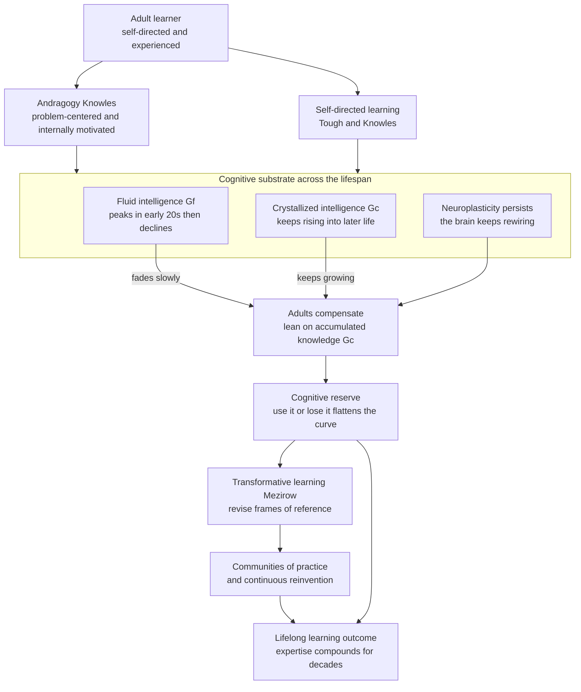

# 🌱 Lifelong and Adult Learning

> [!abstract] TL;DR
> The claim that "you can't teach an old dog new tricks" is one of the most persistent and most wrong ideas in folk psychology. **Neuroplasticity persists across the entire lifespan** — the adult brain keeps rewiring — and while **fluid intelligence** (raw processing speed and novel problem-solving) does decline gradually from the early twenties, **crystallized intelligence** (accumulated knowledge, vocabulary, judgment) keeps *rising* into the sixties and beyond. Adults therefore do not learn *worse* than children; they learn *differently*, leaning on a vast base of prior experience. **Andragogy** (Knowles) captures how: adults are self-directed, problem-centered, internally motivated, and treat their own experience as the richest resource in the room. Add **cognitive reserve** ("use it or lose it": education and mental activity measurably buffer age-related decline), **transformative learning** (Mezirow: adults revise entire frames of reference), and **communities of practice**, and you get the engineering-relevant conclusion — expertise can keep compounding for decades, and continuous reinvention is not just possible but the default state of a well-run mind.

## Intuition — analogy FIRST

Picture two very different libraries.

A **child's library** is a nearly empty building with a superbly fast, tireless librarian. There is almost nothing on the shelves yet, but the librarian sprints — pulling, filing, cross-referencing at blistering speed. That raw speed is **fluid intelligence**: the ability to reason about brand-new problems with no prior template. The building fills up fast precisely because the librarian is so quick.

An **adult's library** is the same building forty years later. The librarian has slowed a step — not dramatically, but noticeably; that is the gentle decline in fluid intelligence. But the shelves are now *packed* and, crucially, *superbly indexed*. Decades of reading, mistakes, and cross-referencing mean that when a new question arrives, the adult librarian rarely has to solve it from scratch — she recognizes it as a variant of something already on the shelf. That indexed depth is **crystallized intelligence**, and it keeps growing.

Here is the twist the folk saying misses: whether the older librarian's step keeps slowing quickly or barely at all **depends on how much she keeps working the shelves**. A library that stays busy — new acquisitions, constant reshelving, hard reference questions every day — keeps its librarian sharp for decades longer than one that goes quiet. That "keep the library busy" effect is **cognitive reserve**, and it is why lifelong learning is not sentimental advice but a measurable intervention on your own aging brain.

---

## How It Works

Adult learning rests on four load-bearing facts, each of which contradicts a popular myth.

**1. The brain stays plastic for life.** Early neuroscience wrongly assumed the adult brain was fixed. It is not. Synaptic strengthening, dendritic growth, and even limited adult neurogenesis (notably in the hippocampus) continue throughout life. The *mechanism* of learning — experience-dependent change at synapses — is the same at 8 and 58. What changes is the *ratio* of raw plasticity to accumulated structure, not the presence of plasticity itself. Learning a new language, instrument, or codebase at 50 is slower per hour but entirely achievable, and the process visibly reshapes gray matter.

**2. Fluid and crystallized intelligence follow opposite trajectories.** The Cattell-Horn-Carroll model splits general ability into **Gf** (fluid: reasoning about novel problems, working-memory-bound, processing speed) and **Gc** (crystallized: acquired knowledge, vocabulary, domain expertise). Salthouse's work on cognitive aging documents that Gf peaks in the early-to-mid twenties and then declines roughly linearly. But Gc rises across most of adulthood and stays high into the sixties and seventies. The practical upshot: as the "raw engine" fades, the "knowledge database" grows to compensate, so *real-world competence* in a familiar domain often peaks decades after fluid intelligence does.

**3. Cognitive reserve buffers the decline.** Two people with identical brain pathology can show very different symptoms; the one with more education, mentally demanding work, and lifelong learning tolerates more damage before impairment shows. That buffer is **cognitive reserve**. The "use it or lose it" literature (Stern and others) shows that sustained mental activity slows the *slope* of decline and delays its *onset* — it does not stop aging, but it flattens the curve. Deliberate, effortful learning is the single most controllable input to this reserve.

**4. Adults learn under a different contract — andragogy.** Malcolm Knowles contrasted **pedagogy** (the teaching of children: teacher-directed, content specified externally, motivation largely extrinsic, subject-centered) with **andragogy** (the art of helping adults learn). His five assumptions about adult learners are the operational core:

- **Self-concept → self-direction.** Adults see themselves as responsible agents and resent being managed like children; they want to steer their own learning.
- **Prior experience is the richest resource.** An adult classroom is a reservoir of experience — teaching should *mine* it (case discussion, peer learning) rather than treat learners as blank slates.
- **Readiness is tied to social role.** Adults become ready to learn what their life and work demand *now* (a new parent, a newly promoted manager) rather than on a fixed curriculum sequence.
- **Orientation is problem-centered, not subject-centered.** Adults want immediate application to real problems, not knowledge banked for a distant future.
- **Motivation is largely internal.** The strongest drivers are self-esteem, competence, curiosity, and quality of life — not grades or external pressure.

Two further frameworks complete the picture. **Self-directed learning** (Tough's foundational surveys found that most adult learning happens *outside* formal institutions in self-planned "learning projects"; Knowles formalized it) describes learners diagnosing their own needs, setting goals, finding resources, and self-evaluating. **Transformative learning** (Mezirow) addresses the deepest adult learning: a **disorienting dilemma** triggers critical reflection that revises an entire **frame of reference** — the assumptions through which one interprets the world. This is why adult learning is often not additive (new facts) but *reconstructive* (a new worldview). Finally, **communities of practice** (Wenger; see [[Theories_of_Learning]]) locate much adult and workplace learning in social participation — juniors move from the periphery to the core of a practice through consequential shared work.



---

## Key Concepts

### Secondary (intuitive level)

- **You never stop being able to learn.** The brain keeps physically rewiring your whole life — that is neuroplasticity. Adults just learn a bit slower per hour and use what they already know as a shortcut.
- **Two kinds of "smart."** *Fluid* smarts (thinking fast about brand-new puzzles) slowly declines after your twenties. *Crystallized* smarts (everything you know — words, facts, judgment) keeps growing. Adults win by playing to the second kind.
- **"Use it or lose it" is real.** People who keep learning and doing mentally demanding things stay sharp longer. Mental activity is like exercise for the brain.
- **Adults learn differently from kids.** They want to steer their own learning, connect it to real problems in their life, and use their own experience — not be lectured at.

### Undergraduate

- **Cattell-Horn-Carroll (CHC) model**: **Gf** (fluid — novel reasoning, working memory, processing speed) vs **Gc** (crystallized — acquired verbal and factual knowledge), plus broad abilities beneath *g*.
- **Salthouse's cognitive-aging findings**: near-linear decline of processing-speed-dependent Gf from the twenties; preserved and often rising Gc; the *processing-speed theory* that much age-related decline traces to slower fundamental processing.
- **Andragogy vs pedagogy** (Knowles): the five assumptions — self-concept, experience, readiness, orientation, motivation — and how they flip instructional design toward negotiation, case-based work, and immediate application.
- **Self-directed learning** (Tough, Knowles): learner-managed diagnosis of needs, goal-setting, resourcing, and self-evaluation; most adult learning is informal and self-planned.
- **Transformative learning** (Mezirow): disorienting dilemma → critical reflection → revised frame of reference; *meaning perspectives* and *meaning schemes*.
- **Cognitive reserve** (Stern): the discrepancy between brain pathology and clinical symptoms; education and mentally stimulating activity as protective factors that *delay onset* and *slow slope* of decline.

### Graduate

- **Peak-age dissociation across domains**: fluid-loaded skills (competitive mathematics, chess calculation speed, some athletic-cognitive tasks) peak early; crystallized-loaded skills (history writing, clinical diagnosis, software architecture, leadership) can peak in the fifties or later. Simonton's work on creative productivity shows domain-specific peak ages tied to how much accumulated knowledge the domain rewards.
- **Reserve vs maintenance vs compensation**: the cognitive-aging literature distinguishes *reserve* (tolerating pathology), *brain maintenance* (less pathology accumulating), and *compensation* (recruiting alternative networks — e.g., the PASA pattern, posterior-to-anterior shift in aging). Lifelong learning plausibly touches all three; disentangling them is an open methodological problem (reverse causation: does mental activity build reserve, or do high-reserve people seek mental activity?).
- **Expertise as a moving target**: deliberate practice (see [[Deliberate_Practice_and_Expertise]]) shows that expert performance keeps improving with structured effort for years or decades, partly *because* accumulated domain knowledge offloads work from fluid resources — the expert recognizes patterns rather than computing them, sidestepping the very abilities that decline.
- **Critiques of andragogy**: is it a *theory* of adult learning or a *set of design assumptions*? Critics (Hartree, Brookfield) note that self-direction is a goal and a cultural value, not a universal fact — many adults are not self-directed in unfamiliar domains, where they need pedagogy's structure. The pedagogy/andragogy line is a continuum keyed to *prior knowledge*, not to age per se.
- **The polymath / renaissance-learner question**: continuous reinvention across domains is bounded by transfer limits (situated learning warns knowledge is context-bound) and by the opportunity cost of Gf-heavy novice phases. The realistic model is *serial and networked expertise* — leveraging Gc from one domain to bootstrap the next — supported by external knowledge systems (the "second brain" / personal knowledge management practice) that offload memory to searchable notes so the aging biological store is augmented, not relied upon alone.

---

## Python Demo

The central empirical fact of adult learning is the *scissors crossing* of fluid and crystallized intelligence, plus the way continued deliberate learning bends the fluid-decline curve (cognitive reserve). This simulation reconstructs stylized lifespan trajectories in the spirit of the Cattell-Horn and Salthouse findings and overlays the reserve effect.

```python
# Lifespan trajectories of fluid vs crystallized intelligence,
# and the cognitive-reserve effect of continued deliberate learning.
# numpy + matplotlib only. Curves are stylized, not fitted norms.
import numpy as np
import matplotlib.pyplot as plt

age = np.linspace(5, 90, 400)

# --- Fluid intelligence Gf (Salthouse-style) -----------------------------
# Rapid maturation to a peak in the early-to-mid 20s, then a roughly
# linear age-related decline driven by falling processing speed.
gf_growth  = 1.0 / (1.0 + np.exp(-(age - 12) / 3.0))   # maturation 0 -> 1
gf_decline = np.clip(age - 22.0, 0.0, None) * 0.0090    # linear fall after 22
gf         = np.clip(gf_growth - gf_decline, 0.0, None)

# --- Crystallized intelligence Gc ---------------------------------------
# Slower to build, but keeps rising into later life; only a gentle
# decline very late as retrieval slows.
gc = 1.06 / (1.0 + np.exp(-(age - 22.0) / 12.0))       # slow, late saturation
gc = gc - np.clip(age - 68.0, 0.0, None) * 0.0022      # mild late tail

# --- Fluid intelligence WITH high cognitive reserve ----------------------
# Continued deliberate learning / mentally demanding activity delays the
# ONSET of decline (30 vs 22) and flattens its SLOPE (0.0050 vs 0.0090).
gf_res_decline = np.clip(age - 30.0, 0.0, None) * 0.0050
gf_reserve     = np.clip(gf_growth - gf_res_decline, 0.0, None)

# --- Plot ----------------------------------------------------------------
fig, ax = plt.subplots(figsize=(9.5, 5.5))
ax.plot(age, gf,         lw=2.4, color="#c0392b", label="Fluid Gf  (typical decline)")
ax.plot(age, gf_reserve, lw=2.4, color="#e67e22", ls="--",
        label="Fluid Gf  (high cognitive reserve)")
ax.plot(age, gc,         lw=2.4, color="#2471a3", label="Crystallized Gc  (accumulated knowledge)")

# Fill the "reserve dividend": preserved fluid ability from staying active.
ax.fill_between(age, gf, gf_reserve, color="#e67e22", alpha=0.15,
                label="Cognitive-reserve dividend")

# Mark the peak of each curve.
peak_gf = age[np.argmax(gf)]
peak_gc = age[np.argmax(gc)]
ax.axvline(peak_gf, color="#c0392b", ls=":", alpha=0.5)
ax.axvline(peak_gc, color="#2471a3", ls=":", alpha=0.5)

# Find the crossover: where Gc overtakes Gf.
cross = np.where(gc >= gf)[0]
cross_age = age[cross[0]] if cross.size else None
if cross_age is not None:
    ax.axvline(cross_age, color="gray", ls="-", alpha=0.4)
    ax.annotate("Gc overtakes Gf\nknowledge carries the load",
                xy=(cross_age, gc[cross[0]]),
                xytext=(cross_age + 4, 0.45),
                arrowprops=dict(arrowstyle="->", color="gray"))

ax.set_xlabel("Age (years)")
ax.set_ylabel("Ability (normalized 0 to 1)")
ax.set_title("Fluid vs crystallized intelligence across the lifespan")
ax.set_ylim(0, 1.15)
ax.legend(loc="lower center", fontsize=9)
ax.grid(alpha=0.3)
fig.tight_layout()
plt.show()

# --- Numbers that make the point ----------------------------------------
def val_at(curve, target_age):
    return float(curve[np.argmin(np.abs(age - target_age))])

print(f"Gf peaks at age ~{peak_gf:.0f}, Gc peaks at age ~{peak_gc:.0f}")
if cross_age is not None:
    print(f"Crystallized overtakes fluid at age ~{cross_age:.0f}")
print(f"At age 70  ->  Gf typical = {val_at(gf,70):.2f}, "
      f"Gf w/ reserve = {val_at(gf_reserve,70):.2f}, "
      f"Gc = {val_at(gc,70):.2f}")
print(f"Reserve dividend at 70 = "
      f"{val_at(gf_reserve,70) - val_at(gf,70):.2f} of preserved fluid ability")
```

Reading the output: Gf peaks in the early twenties and then slides down; Gc keeps climbing and *overtakes* Gf in mid-adulthood, which is the quantitative version of "experience compensates for a slowing engine." The dashed line and the shaded band show the reserve dividend — the fluid ability an adult *keeps* by continuing to learn deliberately rather than coasting. The curves are illustrative, not normed IQ data, but they encode the three robust findings: early Gf peak, rising-then-plateauing Gc, and a bendable fluid-decline slope.

---

## Real-World Applications

- **Corporate L&D and upskilling.** Effective professional training abandons the lecture model for andragogy: case studies, simulations, cohort-based problem projects, and just-in-time microlearning tied to a role the learner holds *now*. Reskilling programs for mid-career engineers succeed when they exploit crystallized knowledge (transferable architecture instincts) rather than pretending the learner is a fresh graduate.
- **Bootcamps and career changers.** People switching into software at 35 or 45 succeed by leaning on domain crystallized knowledge — a former accountant learns fintech faster than a generic beginner. The slower Gf is offset by superior self-regulation and transfer (see [[Self_Regulated_Learning]]).
- **Healthy-aging interventions.** "Cognitive training," language learning, and musical instruction in older adults are prescribed partly to build cognitive reserve; large longitudinal studies (e.g., education-as-protective-factor findings) motivate keeping older adults mentally engaged to delay dementia onset.
- **The "second brain" / personal knowledge management movement.** Tools like Obsidian, Zettelkasten note systems, and spaced-repetition apps operationalize lifelong learning: they externalize memory into searchable, linked notes so the learner offloads retrieval to the system and reserves biological effort for reasoning — a deliberate compensation strategy for aging Gc retrieval. (This very vault is an instance.)
- **Expert professions with late peaks.** Surgeons, judges, senior architects, and diagnosticians often reach peak effectiveness in their fifties, because the pattern library built over decades matters more than raw speed. Organizations retain and pair such experts with juniors precisely to transfer crystallized judgment.
- **Communities of practice at work.** Open-source projects, engineering guilds, and mentorship programs are structured lifelong-learning environments — newcomers learn by consequential participation, veterans keep learning by teaching and reviewing, feeding cognitive reserve on both sides.

---

## Common Pitfalls

- **Believing the "old dog" myth.** The single biggest barrier to adult learning is the self-fulfilling belief that adults cannot learn. It lowers effort and persistence, which then *produces* the poor outcome. Neuroplasticity evidence directly refutes it; a growth mindset is a prerequisite, not a nicety.
- **Confusing "slower" with "worse."** Adults do learn novel material more slowly per hour (lower Gf) and need more sleep-consolidation and spacing. Mistaking this for incapacity leads to giving up prematurely. The fix is *more time and better strategy*, not abandonment.
- **Teaching adults like children.** Ignoring andragogy — imposing rigid curricula, withholding autonomy, using extrinsic carrots, treating experience as irrelevant — reliably produces disengaged adult learners. The remedy is negotiated goals, immediate application, and mining the room's experience.
- **Assuming self-direction is automatic.** Andragogy's self-direction assumes the learner already has enough background to steer. Thrown into a genuinely unfamiliar domain, adults flounder without structure — they temporarily need *pedagogy*. Match structure to prior knowledge, not to age.
- **Treating cognitive reserve as a get-out-of-aging-free card.** Reserve *flattens and delays* decline; it does not abolish it, and correlational evidence is confounded by reverse causation. Sell it honestly as slope-bending, not immortality of the mind.
- **Additive-only mindset.** Some adult learning requires *unlearning* — Mezirow's transformative learning means revising frames of reference. Trying to bolt new knowledge onto an obsolete mental model (e.g., a senior engineer resisting a paradigm shift) fails; the frame itself must be reflected on and rebuilt.
- **Neglecting consolidation and health.** Adult learners often try to cram around busy lives, ignoring sleep, spacing, and retrieval practice — the very levers that most help an aging memory. Lifestyle (sleep, exercise, stress) is part of the adult learning system, not separate from it.

---

## Related Concepts

- [[Theories_of_Learning]] — situates andragogy against pedagogy, and communities of practice / situated learning within the broader map of learning paradigms.
- [[Deliberate_Practice_and_Expertise]] — why expertise keeps improving for decades; the mechanism (pattern recognition offloading fluid demand) that lets adults compensate for Gf decline.
- [[Self_Regulated_Learning]] — the self-monitoring and strategy-selection skills that make adult self-directed learning actually work.
- [[Learning_How_to_Learn]] — the meta-skill of managing one's own learning that lifelong learners depend on most.
- [[Motivation_and_Learning]] — internal motivation is a core andragogical assumption; the driver of sustained adult learning.
- [[Memory_and_the_Learning_Brain]] — how encoding, consolidation, and retrieval work, and how they change with age.
- [[Neuroplasticity]] — the biological guarantee that the adult brain keeps rewiring, refuting the "old dog" myth (psychology treatment).
- [[Neuroplasticity_and_Rehabilitation]] — clinical evidence of lifespan plasticity, including recovery and reorganization in adult and aging brains.
- [[Lifespan_Development]] — the developmental-psychology view of cognitive change from birth to old age, including cognitive aging.
- [[Intelligence_and_IQ_Testing]] — the psychometrics of Gf, Gc, and the CHC model that ground the fluid/crystallized distinction used here.

---

## Review Questions

1. **(Recall / comprehension)** State Knowles' five andragogical assumptions and, for each, contrast it with the corresponding assumption in pedagogy. Then explain, using the fluid/crystallized distinction, *why* these assumptions fit adults better than children.
2. **(Application / scenario)** A 45-year-old accountant is retraining as a backend engineer and is convinced she is "too old to learn to code." Design her a six-month learning plan that (a) directly counters the cognitive myth, (b) exploits her crystallized knowledge and self-regulation strengths, and (c) compensates for slower fluid processing. Justify each element with a named principle from this note.
3. **(Analysis / trade-off)** Cognitive-reserve studies show that highly educated, mentally active people decline more slowly — but the evidence is correlational. Describe the reverse-causation confound, propose a study design that would strengthen the causal claim, and explain what the Python demo's "reserve dividend" band would and would *not* let you conclude if it were real longitudinal data.

---

## Sources

- Knowles, M. S. (1980). *The Modern Practice of Adult Education: From Pedagogy to Andragogy* (rev. ed.). Cambridge/Prentice Hall.
- Salthouse, T. A. (2009). "When does age-related cognitive decline begin?" *Neurobiology of Aging*, 30(4), 507–514.
- Cattell, R. B. (1963). "Theory of fluid and crystallized intelligence: A critical experiment." *Journal of Educational Psychology*, 54(1), 1–22.
- Mezirow, J. (1991). *Transformative Dimensions of Adult Learning*. Jossey-Bass.
- Stern, Y. (2012). "Cognitive reserve in ageing and Alzheimer's disease." *The Lancet Neurology*, 11(11), 1006–1012.
- Tough, A. (1971). *The Adult's Learning Projects: A Fresh Approach to Theory and Practice in Adult Learning*. Ontario Institute for Studies in Education.

---

#learning-science #lifelong-learning #andragogy #adult-learning #cognitive-reserve
