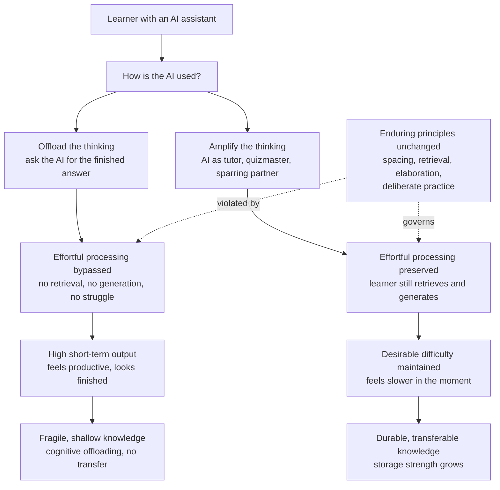

# 🔮 The Future of Learning

> [!abstract] TL;DR
> The *tools* of learning are being transformed faster than at any time since the printing press — AI tutors that never tire, instant feedback, infinitely personalised content, and an internet that has already made all information free and abundant. But the **cognitive machinery of learning has not changed and will not change**: durable knowledge is still built by *effortful processing* — spacing, retrieval, elaboration, deliberate practice — because those are facts about the human brain, not about technology. This produces the defining tension of the AI age: the same assistant that can *amplify* thinking can also *replace* it, and **cognitive offloading** — letting the AI do the retrieving and generating for you — bypasses the very effort that builds learning. The winning move is to use AI to *think better*, not to *avoid thinking*; the enduring value shifts from knowledge-transmission (the machine has that) to **metacognition, judgment, curation, and learning-to-learn**; and the human elements that never automate — motivation, mentorship, relationships, community — become *more* decisive, not less. This is the capstone: everything else in this vault is the toolkit for thriving as a learner in a world that keeps changing the tools.

---

## Intuition

**Analogy: the calculator, the car, and the muscle.**

When cheap calculators arrived, two things happened at once, and it is worth keeping them separate. First, nobody sane still argues we should do long division by hand for a living — the tool genuinely freed us from drudgery, and pretending otherwise is nostalgia. Second, a child who reaches for the calculator *before ever building number sense* never develops the mental estimation that tells them an answer is off by a factor of ten. The tool is a gift to the person who already has the skill and a trap for the person using it to *skip acquiring* the skill. Same device, opposite outcomes, depending entirely on whether it *replaces* effort or *extends* it.

Now stack two more analogies on top. The car: it is miraculous for *travel* and catastrophic for *fitness* — if your only movement is now behind a wheel, your body quietly atrophies, and you have to deliberately reintroduce the exercise the car removed. And the muscle itself: it grows only from load, from the reps that burn (this is the whole logic of [[Desirable_Difficulties]]). An AI that writes your essay, solves your problem, and summarises your reading is a car for the mind and a forklift at the gym. It will get the *output* produced — beautifully, instantly. The question the future forces on every learner is the one the woodcutter, the driver, and the lifter all face: **did the tool sharpen you, or did it do the work your growth depended on?** The future of learning is not a fact you will be told; it is a choice you will make, thousands of times, every time you decide whether to let the machine think *for* you or *with* you.

---

## How It Works

### What is genuinely changing

Four capabilities that were expensive or impossible a decade ago are now cheap and ambient:

1. **Personalised tutoring at scale.** An AI tutor can meet a learner exactly where they are, re-explain in a different way on demand, adjust pace, and be available at 2 a.m. — approximating the *one-to-one tutoring* that Bloom's "2 sigma" work identified as the gold standard but that was never affordable for everyone. This is the promise of modern educational technology and AI tutoring systems.
2. **Instant, specific feedback.** The tightest loop in skill acquisition — try, get told precisely what was wrong, adjust — used to bottleneck on a scarce human grader. Now it can be immediate on code, prose, math, or language, which matters because feedback timing and specificity are among the strongest levers in [[Feedback_and_Error_Correction]] and [[Reflection_and_Feedback]].
3. **On-demand content generation.** Explanations, examples, analogies, practice problems, and worked solutions can be generated for any topic at any difficulty, dissolving the old constraint that good materials were scarce and fixed.
4. **Information abundance became total.** The internet already made *facts* free; AI makes *synthesis* free. The scarce resource is no longer access to information — it is **attention, judgment, and the ability to evaluate and integrate** what is already at your fingertips.

### What is not changing (and cannot)

Underneath the changing tools sit invariants — facts about human cognition that no interface can repeal:

- **Learning is a change in long-term memory, and it is built by effort.** Attention gates encoding ([[Attention_and_Focus_in_Learning]]); retrieval and generation build durable traces; spacing exploits forgetting; elaboration ties new knowledge to old. These principles — *spacing, retrieval practice, interleaving, elaboration, deliberate practice* — are among the most robustly replicated findings in all of psychology, and they are indifferent to whether the content arrives on parchment, a screen, or from a language model.
- **The performance–learning distinction still holds.** What *looks* like learning in the moment (fluent output, a finished assignment) can be decoupled from what is actually retained — the central lesson of [[Desirable_Difficulties]]. AI massively inflates *performance* while doing nothing, by itself, for *learning*. This is the crux.
- **Metacognition still governs.** Whether any tool helps depends on the learner's ability to plan, monitor, and evaluate their own understanding ([[Self_Regulated_Learning]], [[Metacognition_and_Thinking_About_Thinking]]). A poor self-regulator with a great AI is often *worse off*, because the tool makes it easier to feel competent without being competent ([[Calibration_and_Illusions_of_Competence]]).

### The double edge: offloading vs amplifying

**Cognitive offloading** is the use of external tools to reduce internal cognitive effort — writing a phone number down instead of memorising it. Usually benign. But learning is precisely the domain where the *effort you offload is the effort that would have built the skill*. When an AI performs the retrieval, the generation, the struggle, and the synthesis, it removes the very operations that create durable memory and transferable understanding. The learner receives the *product* of thinking without ever *doing* the thinking — high short-term output, near-zero storage-strength gain.

The same tool, used differently, does the opposite. Treated as a **Socratic partner** — one that asks you questions, critiques your attempt *after* you have made it, offers a hint when you are genuinely stuck rather than an answer before you have tried, or plays devil's advocate against your argument — the AI *raises* the amount of effortful processing you do. It becomes a tireless generator of desirable difficulties and immediate feedback while *you* keep doing the retrieval and generation. The distinction is not the technology; it is the **workflow**:

- *Using AI to avoid thinking:* "Write my essay / solve this / summarise this so I don't have to read it." Effort bypassed, learning bypassed.
- *Using AI to think better:* "Quiz me on this. Tell me what my explanation missed. Give me a harder variant. Argue the opposing case so I have to defend mine." Effort preserved and sharpened.

### The shift in what is worth learning

If a machine can retrieve and synthesise any *stated* knowledge on demand, the durable human value moves up a level — from *knowing things* to *knowing how to know*, evaluate, and use. The premium shifts toward: **metacognition and learning-to-learn** ([[Learning_How_to_Learn]]), because the tools will keep changing and the meta-skill is what transfers; **judgment and evaluation**, because abundant and sometimes-wrong AI output must be verified and integrated; **taste and question-asking**, because the bottleneck is now knowing *what* to ask and *whether the answer is any good*; and **deep expertise in something**, because you cannot supervise, correct, or out-think an AI in a domain where you are a novice. Foundational knowledge does not become worthless — it becomes the *prerequisite* for using the tools well, exactly as number sense is the prerequisite for using a calculator without being fooled by it.



---

## Key Concepts

### Secondary Level

- **New tools, same brain.** AI can teach, tutor, quiz, and explain anything instantly — but your memory is still built the old-fashioned way, by *doing the thinking yourself*. Reading an AI's perfect answer feels like learning and mostly isn't.
- **The forklift-at-the-gym problem.** If you go to the gym and a machine lifts the weights for you, you get the workout done but build no muscle. Letting AI write your essay or solve your problem is the same: task finished, brain unchanged.
- **Two ways to use AI.** *Bad:* "Do it for me." *Good:* "Test me, correct me, give me a harder version, argue against me." The first replaces your effort; the second multiplies it.
- **What to get good at.** The most valuable skills in an AI world are *knowing how to learn*, *judging whether an answer is right*, *asking good questions*, and being *genuinely expert in at least one thing*. And the human stuff — a mentor who believes in you, a reason to care — matters more than ever, not less.

### Undergraduate Level

- **Cognitive offloading vs cognitive extension.** Offloading external memory (a to-do list) is fine; offloading the *learning operations themselves* (retrieval, generation, synthesis) removes the effort that produces durable memory. The design question for every AI workflow: does it extend the mind or substitute for it?
- **The desirable-difficulty tension, restated for AI.** AI is a fluency machine — it makes everything *feel* easy and *look* finished. Because ease-in-the-moment is a treacherous index of learning ([[Desirable_Difficulties]]), the tool that maximises subjective fluency is structurally biased toward *undermining* retention unless the learner deliberately re-inserts the effort.
- **Enduring principles are technology-independent.** Spacing ([[Spaced_Repetition_and_the_Spacing_Effect]]), retrieval practice ([[Retrieval_Practice_and_the_Testing_Effect]]), interleaving ([[Interleaving_and_Varied_Practice]]), elaboration ([[Elaboration_and_Self_Explanation]]), and deliberate practice ([[Deliberate_Practice_and_Expertise]]) work because of how memory is built, so they are the *stable core* of any future learning system. AI's best role is to *deliver these at scale*, not to bypass them.
- **Knowledge-transmission to competence.** The value of education shifts from delivering content (commoditised) to building skill, metacognition, and judgment. This reframes **credentialing vs competency**: a diploma certifies seat-time and past transmission; the labour market increasingly wants *demonstrated competence*, which AI both threatens (easy to fake finished work) and enables (verifiable, adaptive assessment).
- **Microlearning and its limits.** Bite-sized, mobile, spaced lessons genuinely exploit the spacing effect and lower the activation energy to start. But *deep expertise and complex problem-solving cannot be micro-chunked* — they require sustained, effortful, integrative work over long focused blocks that fight the [[Attention_and_Focus_in_Learning]] costs of a fragmented, notification-driven day.

### Graduate Level

- **The attention economy vs deep learning.** The dominant business model of the digital environment monetises *interruption*: it is engineered to fragment attention, which is the exact opposite of the sustained focus that encoding requires. The future learner's core discipline is therefore *attentional* — defending long, undistracted blocks against an environment optimised to prevent them. AI-driven feeds sharpen this conflict; AI-driven tutoring can, if designed against the grain, help resolve it.
- **Learning under information abundance: from access to curation.** When information is infinite and synthesis is free, the scarce, high-value skills invert: *evaluation* (is this true?), *curation* (what is worth attending to?), and *integration* (how does this connect to what I know?). The **polymath second-brain** — a densely cross-linked personal knowledge base like this very vault — is a rational response: not a place to *store* what AI can regenerate, but a scaffold for *your own* elaboration, connection-making, and long-term memory, where writing a note *is* the effortful processing. The externalised network complements, rather than replaces, the internal one.
- **Equity and access — the double-edged promise.** Free, personalised AI tutoring could be the greatest democratising force in the history of education, delivering Bloom's two-sigma tutoring to anyone with a phone. Or it could widen gaps: those with strong prior knowledge, metacognition, and self-regulation extract amplification, while those without use the same tool to offload and stagnate — a *Matthew effect* in which AI helps most exactly those who need it least. Which future obtains is a question of design, pedagogy, and access, not of the model.
- **The irreducibly human layer.** The elements that do *not* automate become the differentiators: **motivation** and the reasons a person chooses to endure difficulty ([[Motivation_and_Learning]]); **relationships and mentorship**, whose accountability, modelling, and belief drive persistence; **community**, which supplies norms, identity, and the social pressure that sustains long effort; and **wisdom and ethics**, judgment about *what is worth doing*, which no next-token predictor supplies. A future of learning that optimises only the cognitive-tool layer and neglects the motivational-social layer will produce learners who *can* learn anything and *want* to learn nothing.
- **What a lifelong learner should cultivate.** The durable portfolio: a reliable **learning-to-learn** loop; the metacognitive discipline to *distrust fluency* and choose methods that feel worse but work better; **attentional sovereignty** over one's own focus; the **judgment** to evaluate and integrate abundant, imperfect information; at least one domain of **real depth**; and the **motivational and relational infrastructure** (curiosity, mentors, community) that keeps the whole machine running for decades. The tools will keep changing; this is the part that compounds.

---

## Python Demo

```python
# numpy + matplotlib only.
# Model the central tension of learning in the AI age: convenience vs durability.
#
# Two learners, same syllabus, one year (52 weekly sessions), each using an AI:
#
#   OFFLOADER  -> asks the AI for the finished answer.
#                 Visible output per week is HIGH (the AI cranks out polished
#                 work fast), but effortful processing is bypassed, so durable
#                 knowledge (storage strength) barely accrues and what little
#                 is weakly encoded is quickly forgotten.
#
#   SOCRATIC   -> uses the AI as a tutor: gets hints/feedback but still does the
#                 retrieval and generation. Visible output is a bit LOWER and
#                 slower, but effortful processing is high, so durable knowledge
#                 compounds -- the desirable-difficulty payoff.
#
# The whole-vault theme: EFFORTFUL PROCESSING, not finished output, builds learning.
import numpy as np
import matplotlib.pyplot as plt

rng = np.random.default_rng(42)

weeks = 52
t = np.arange(1, weeks + 1)

# Fraction of each session spent on genuine effortful processing
# (retrieval / generation / desirable difficulty).
effort_offload = 0.15   # AI does the thinking -> little effort survives
effort_socratic = 0.80  # AI assists, learner still does the work

# --- Visible short-term output per week (assignments completed / immediate perf) ---
# Convenience makes the offloader's visible output HIGH and slightly higher.
out_offload  = np.clip(0.93 + 0.03 * rng.standard_normal(weeks), 0, 1.2)
out_socratic = np.clip(0.78 + 0.04 * rng.standard_normal(weeks), 0, 1.2)
cum_out_offload  = np.cumsum(out_offload)
cum_out_socratic = np.cumsum(out_socratic)

# --- Durable knowledge accrual (storage strength), New-Theory-of-Disuse style ---
# Per week: gain scales with effortful processing and with room-to-grow;
# weakly-encoded (low-effort) knowledge is more forgettable.
def simulate_knowledge(effort, weeks, gain=0.12, forget=0.06):
    K = np.zeros(weeks)
    k = 0.0
    for i in range(weeks):
        gain_i   = gain * effort * (1.0 - k)          # effort builds storage strength
        forget_i = forget * (1.0 - effort) * k        # low effort -> more forgetting
        k = min(max(k + gain_i - forget_i, 0.0), 1.0)
        K[i] = k
    return K

K_offload  = simulate_knowledge(effort_offload,  weeks)
K_socratic = simulate_knowledge(effort_socratic, weeks)

final_gap = K_socratic[-1] - K_offload[-1]
print(f"Week 52 durable knowledge  -- offloader: {K_offload[-1]:.2f}   "
      f"socratic: {K_socratic[-1]:.2f}")
print(f"Cumulative visible output  -- offloader: {cum_out_offload[-1]:.0f}   "
      f"socratic: {cum_out_socratic[-1]:.0f}")
print(f"Durable knowledge gap at 1 year: {final_gap:+.2f} in favour of the Socratic user")

fig, (ax1, ax2) = plt.subplots(1, 2, figsize=(13, 5.2))

# LEFT: visible output -- the offloader looks like the winner
ax1.plot(t, cum_out_offload,  color="#dc2626", lw=2.2, label="Offloader (AI does the thinking)")
ax1.plot(t, cum_out_socratic, color="#2563eb", lw=2.2, label="Socratic (AI assists the thinking)")
ax1.set_title("What everyone can see: finished output")
ax1.set_xlabel("Week")
ax1.set_ylabel("Cumulative visible output  [tasks completed]")
ax1.legend(loc="upper left", fontsize=9)
ax1.grid(alpha=0.3)
ax1.text(2, cum_out_offload[-1]*0.55,
         "Offloader is AHEAD\non visible output",
         color="#dc2626", fontsize=9)

# RIGHT: durable knowledge -- the Socratic learner pulls far ahead
ax2.plot(t, K_offload,  color="#dc2626", lw=2.4, label="Offloader")
ax2.plot(t, K_socratic, color="#2563eb", lw=2.4, label="Socratic")
ax2.fill_between(t, K_offload, K_socratic, color="#2563eb", alpha=0.12)
ax2.annotate("The durable\nknowledge gap",
             xy=(weeks*0.7, (K_offload[int(weeks*0.7)] + K_socratic[int(weeks*0.7)]) / 2),
             xytext=(weeks*0.35, 0.45), fontsize=10, color="#1e3a8a",
             arrowprops=dict(arrowstyle="->", color="#1e3a8a"))
ax2.set_title("What actually persists: durable knowledge")
ax2.set_xlabel("Week")
ax2.set_ylabel("Durable knowledge  [storage strength, 0..1]")
ax2.set_ylim(0, 1)
ax2.legend(loc="upper left", fontsize=9)
ax2.grid(alpha=0.3)

fig.suptitle("Convenience vs Durability: effortful processing is what builds learning",
             fontsize=13, y=1.02)
fig.tight_layout()
fig.savefig("future_of_learning.png", dpi=150, bbox_inches="tight")
print("Saved future_of_learning.png")
```

**What the demo shows.** The two panels tell opposite stories from the same year. On the **left** — the metric everyone can see — the offloader is *ahead*: the AI produces more finished work, faster, so cumulative visible output favours convenience. On the **right** — the metric that matters and that nobody sees until the delayed test, the job, the follow-on course — the Socratic learner's durable knowledge compounds toward roughly 0.9 while the offloader's plateaus near 0.25, because low-effort encoding barely grows and is quickly forgotten. The widening blue gap *is* the price of offloading. This is the [[Desirable_Difficulties]] dissociation reincarnated as an AI-era workflow choice, and it is the whole vault's thesis in one figure: **it is the effort, not the output, that becomes the learner.**

---

## Real-World Applications

- **AI tutoring platforms (Khanmigo, Duolingo Max, and successors).** The best implementations deliberately design *against* offloading — they refuse to hand over answers, ask the learner to explain and attempt first, and use the model to generate hints, questions, and spaced retrieval. That design choice is the difference between a learning tool and an answer vending machine.
- **Software engineering and AI coding assistants.** Copilot-style tools boom developer *output* immediately, but teams report juniors who ship AI-generated code they cannot debug or reason about. The durable path treats the assistant as a pair-programmer to interrogate ("why this approach?", "what breaks this?") rather than an autocomplete to accept — preserving the effortful understanding the productivity metric hides.
- **Higher education and academic integrity.** Take-home essays as a proxy for learning collapse when AI can write them, forcing a shift toward *competency-based* and *authentic* assessment — oral defenses, in-class generation, process portfolios, project work — that measures what the learner can do *without* the tool, echoing the credentialing-vs-competency debate.
- **Corporate L&D and microlearning.** Spaced, mobile microlearning genuinely fits the science for *facts and procedures*; organisations increasingly pair it with AI simulation and coaching for the *complex, integrative* skills that micro-chunks cannot carry, and with mentorship for the motivational glue that content alone never supplies.
- **The personal-knowledge-management / second-brain movement.** Tools like Obsidian, Roam, and Anki operationalise the enduring principles — this vault's dense wikilinking *is* elaboration and its spaced review *is* retrieval practice. In an age of infinite regenerable information, the value of a note is not storage but the *effortful act of writing and connecting it*, which is exactly why "let the AI summarise it" defeats the purpose.
- **Global access and equity programs.** Free multilingual AI tutoring is being piloted to reach learners without access to schools or teachers — the two-sigma promise at civilisational scale — while researchers watch closely for the Matthew-effect risk that it amplifies the already-advantaged unless paired with scaffolding, mentorship, and deliberate support for weak self-regulators.

---

## Common Pitfalls

- **Mistaking output for learning** — the single deepest trap of the AI age. A finished essay, a passing test, a working snippet are *performance*; only a delayed, unaided test reveals whether anything was learned. If the AI did the retrieval and generation, assume near-zero learning regardless of how polished the result looks.
- **Assuming the technology decides the outcome** — it doesn't; the *workflow* does. The same model is an amplifier or a crutch depending on whether it is asked to *do the thinking* or to *provoke and check yours*. Blaming or crediting the tool obscures the only variable you control.
- **Believing the science has been "disrupted"** — spacing, retrieval, elaboration, and deliberate practice are facts about the human brain, not about pre-AI pedagogy. Any pitch that AI makes effortful processing unnecessary is selling fluency, not learning.
- **Over-chunking everything into microlearning** — bite-sized lessons suit facts and habits but cannot carry deep expertise or complex problem-solving, which need sustained, focused, integrative effort. Fragmenting all learning to fit a notification-length attention span guarantees shallow ceilings.
- **Surrendering attention to the environment** — the attention economy is engineered to fragment the exact focus encoding requires. A learner who does not actively defend long undistracted blocks will find that even the best AI tutor cannot compensate for a spotlight that never settles ([[Attention_and_Focus_in_Learning]]).
- **Neglecting the human layer** — optimising cognitive tools while ignoring motivation, mentorship, and community produces learners who *can* learn anything and *choose* to learn nothing. The bottleneck of the future is rarely capability; it is caring, persistence, and direction, which are social and motivational, not technical.
- **Letting AI erode your calibration** — because AI makes everything feel easy and finished, it powerfully inflates the illusion of competence ([[Calibration_and_Illusions_of_Competence]]). Without deliberate unaided self-testing, you will systematically overestimate what you actually know.

---

## Related Concepts

- [[Learning_How_to_Learn]] — the meta-skill that becomes *the* durable value in an AI age: when tools keep changing, the ability to manage your own learning is what transfers.
- [[Desirable_Difficulties]] — the theoretical core of the whole tension: AI is a fluency machine, and this note explains why the ease it creates is precisely the signal that learning is being bypassed.
- [[Attention_and_Focus_in_Learning]] — the attention-economy front of the future: deep learning demands sustained focus that the digital environment is engineered to destroy.
- [[Self_Regulated_Learning]] — whether AI amplifies or replaces thinking is decided by the learner's plan–monitor–evaluate loop; good self-regulators extract amplification, poor ones offload.
- [[Metacognition_and_Thinking_About_Thinking]] — the higher-order awareness that lets a learner catch themselves outsourcing the effort that builds understanding.
- [[Calibration_and_Illusions_of_Competence]] — AI supercharges the fluency illusion; unaided self-testing is the antidote to feeling competent without being competent.
- [[Spaced_Repetition_and_the_Spacing_Effect]] — an enduring principle AI can *deliver at scale* rather than replace; the backbone of tools like Anki and adaptive tutors.
- [[Retrieval_Practice_and_the_Testing_Effect]] — the effortful operation AI most tempts learners to skip and, used well, most powerfully augments.
- [[Elaboration_and_Self_Explanation]] — the connect-it-to-what-you-know effort that a second brain externalises and that "let the AI summarise it" quietly defeats.
- [[Deliberate_Practice_and_Expertise]] — real depth in a domain is the prerequisite for supervising, correcting, and out-thinking an AI rather than being fooled by it.
- [[Motivation_and_Learning]] — the irreducibly human driver: no tutor, human or artificial, learns for a person who has no reason to endure difficulty.
- [[Feedback_and_Error_Correction]] — the tight try-correct-adjust loop AI can accelerate more than any prior technology, if the learner attempts first.
- [[AI_and_the_Future_of_Cognitive_Science]] — the sister capstone: where this note asks how humans should learn alongside AI, that one asks what AI reveals about the nature of mind and intelligence.
- [[The_Future_of_Literature]] — a parallel capstone in the vault on how a durable human practice absorbs technological upheaval while its core endures.

---

## Review Questions

**Tier 1 — Conceptual (can you explain it to a peer?)**
1. Explain the difference between *using AI to avoid thinking* and *using AI to think better*, and connect it to the concept of cognitive offloading. Why does the *same* tool produce opposite learning outcomes?
2. Name three enduring principles of learning that do not change no matter how advanced the technology, and explain *why* they are technology-independent.

**Tier 2 — Applied / scenario**
3. A student uses an AI to complete every assignment and consistently earns high marks, while a classmate uses the same AI only to quiz herself and critique her drafts, and gets slightly lower marks. Predict who will perform better on a cumulative unaided final exam six months later, who *looks* more successful in the meantime, and name the specific mechanisms (cognitive offloading, desirable difficulty, performance vs learning, storage strength) that drive the divergence.
4. You are designing an AI tutor for an underserved school. Describe three concrete design choices that would make it *amplify* effortful processing rather than let students offload it, and explain how you would guard against the Matthew-effect risk that it helps the already-advantaged most.

**Tier 3 — Analytical / trade-off**
5. "AI makes memorising facts obsolete, so schools should stop teaching content and only teach skills." Argue for and against, using the calculator analogy and the claim that foundational knowledge is a *prerequisite* for using AI well. Where exactly does the argument break down?
6. If information is now infinite and synthesis is free, what becomes the scarce, high-value cognitive skill — and why does a densely cross-linked personal second brain (like this vault) remain worth the effort even though an AI could regenerate most of its content on demand? Frame your answer in terms of *which* effort is being externalised and which is not.

---

## Sources

- Bjork, E. L., & Bjork, R. A. (2011). "Making things hard on yourself, but in a good way: Creating desirable difficulties to enhance learning." In M. A. Gernsbacher et al. (Eds.), *Psychology and the Real World* (pp. 56–64). Worth. — the invariant that AI cannot repeal.
- Bloom, B. S. (1984). "The 2 Sigma Problem: The search for methods of group instruction as effective as one-to-one tutoring." *Educational Researcher*, 13(6), 4–16. — the tutoring benchmark AI is trying to democratise.
- Sparrow, B., Liu, J., & Wegner, D. M. (2011). "Google Effects on Memory: Cognitive Consequences of Having Information at Our Fingertips." *Science*, 333(6043), 776–778. — foundational evidence on cognitive offloading to external tools.
- Deng, R., Jiang, M., et al. (2024). "Does ChatGPT enhance student learning? A systematic review and meta-analysis of experimental studies." *Computers & Education* / related meta-analytic work on generative-AI learning effects. — mixed effects on learning vs performance.
- Dunlosky, J., Rawson, K. A., Marsh, E. J., Nathan, M. J., & Willingham, D. T. (2013). "Improving Students' Learning With Effective Learning Techniques." *Psychological Science in the Public Interest*, 14(1), 4–58. — the enduring, technology-independent toolkit.

---

#learning-science #future-of-learning #ai-education #lifelong-learning #metacognition
