> [!abstract] TL;DR
> Linguistics is the scientific study of language — its structure (form), meaning (semantics), and social use (pragmatics). Saussure founded modern linguistics by showing that the sign is arbitrary and that language is a system of differences rather than a vocabulary list. Chomsky's generative grammar then proposed an innate universal grammar to explain how every child acquires a grammar that was never fully modeled in their input. These two revolutions — the structuralist and the generativist — frame every live debate in the field: how much of language structure is universal vs. culturally specific; how much is innate vs. learned; how much is form vs. function.

---

## Intuition

**Analogy:** Think of a game of chess. The pieces — a carved wooden horse, a marble tower, a plastic bishop — look nothing like cavalry, fortifications, or clergy. The *physical material* of the piece is irrelevant. What matters is not what a piece looks like but the network of moves that defines its role: the knight can do things the bishop cannot, and neither can do what the queen can. Remove any one piece from that system of contrasts and the others lose part of their meaning. You cannot understand the knight in isolation; you understand it through its differences from every other piece.

Ferdinand de Saussure argued that language is exactly like this. The word *tree* has nothing intrinsically tree-like about it — in French the same concept is *arbre*, in German *Baum*, in Swahili *mti*. The sound pattern is arbitrary; it means *tree* not because of any resemblance or causal connection, but because English speakers have agreed to use it and because it differs from *free*, *three*, *flee*, and every other word in the system. Language is not a nomenclature — a list of labels stuck onto pre-existing things. It is a structured system of differences, and meaning emerges from contrasts, not from individual symbols taken alone.

This chess analogy carries a second insight: different games have different rules. English distinguishes *blue* from *green* in one move; Russian requires two separate moves (*goluboy* vs *siniy*) just for the blue half of the spectrum. The rules — the grammar — vary across languages, and understanding how much they vary, and why, is the central empirical project of linguistics.

---

## How It Works

```mermaid
graph TD
    LING["Linguistics\nScientific study of language\nForm · Meaning · Use"]

    FORM["FORM\nHow language is structured"]
    MEANING["MEANING\nWhat language encodes"]
    USE["USE\nHow language is deployed"]

    PHONETICS["Phonetics\nPhysical sound properties\narticulatory · acoustic · auditory"]
    PHONOLOGY["Phonology\nSound systems & patterns\nphonemes · allophones · prosody"]
    MORPHOLOGY["Morphology\nWord structure\nmorphemes · inflection · derivation"]
    SYNTAX["Syntax\nSentence structure\nconstituents · trees · UG"]

    SEMANTICS["Semantics\nLinguistic meaning\ntruth conditions · compositionality"]
    PRAGMATICS["Pragmatics\nMeaning in context\nimplicature · speech acts · deixis"]

    HIST["Historical Linguistics\nLanguage change over time\nproto-languages · reconstruction"]
    SOCIO["Sociolinguistics\nLanguage and society\nvariation · diglossia · code-switching"]
    TYPOLOGY["Linguistic Typology\nCross-linguistic comparison\nWALS · universals · parameters"]

    LING --> FORM
    LING --> MEANING
    LING --> USE
    FORM --> PHONETICS
    FORM --> PHONOLOGY
    FORM --> MORPHOLOGY
    FORM --> SYNTAX
    MEANING --> SEMANTICS
    MEANING --> PRAGMATICS
    USE --> SOCIO
    USE --> HIST
    FORM -.-> TYPOLOGY
    MEANING -.-> TYPOLOGY

    style LING fill:#1a1a2e,color:#eee
    style FORM fill:#2563eb,color:#fff
    style MEANING fill:#7c3aed,color:#fff
    style USE fill:#059669,color:#fff
    style PHONETICS fill:#1d4ed8,color:#fff
    style PHONOLOGY fill:#1d4ed8,color:#fff
    style MORPHOLOGY fill:#1d4ed8,color:#fff
    style SYNTAX fill:#1d4ed8,color:#fff
    style SEMANTICS fill:#6d28d9,color:#fff
    style PRAGMATICS fill:#6d28d9,color:#fff
    style HIST fill:#047857,color:#fff
    style SOCIO fill:#047857,color:#fff
    style TYPOLOGY fill:#374151,color:#fff
```



---

## Key Concepts

### Secondary Level

**What is linguistics?**

Linguistics is the scientific — meaning systematic, evidence-based, and descriptive — study of human language. It is not about teaching people to speak correctly (that is prescriptive grammar, a different enterprise). It asks: what is the structure of language? How does language mean? How is it acquired by children? How does it vary across communities and change over time? How many distinct languages exist, and how similar or different are they in their structures?

Three fundamental distinctions organize the field from the ground up:

**Descriptive vs. prescriptive:** Descriptive linguistics analyzes language as it actually is used — it describes "I don't know nothing" as a grammatical double negative that follows consistent rules in many dialects of English. Prescriptive grammar judges "I don't know nothing" as incorrect according to a standard dialect. Linguistics is descriptive. Speakers of every dialect follow unconscious grammatical rules of extraordinary complexity; no dialect is linguistically inferior to any other.

**Synchronic vs. diachronic:** A synchronic study analyzes language at a single point in time (the grammar of contemporary English). A diachronic study traces change over time (how Latin *caballus* became French *cheval*, Spanish *caballo*, and Italian *cavallo*). Saussure insisted that the two perspectives must be kept analytically separate: the grammar a speaker knows is synchronic; historical linguistics is a different discipline with different methods.

**Langue vs. parole (Saussure):** *Langue* is the shared, abstract system of rules and conventions that all speakers of a language carry in their heads — the grammar, the phonological rules, the mental lexicon as a system of contrasts. *Parole* is any actual spoken or written utterance — the concrete use of the system in real time, with hesitations, errors, and individual variation. Linguistics takes *langue* as its primary object: the underlying system, not the particular instance.

**The core subfields at a glance:**

| Subfield | Question | Example |
|---|---|---|
| Phonetics | What are the physical properties of speech sounds? | The vocal tract position for producing /p/ vs /b/ |
| Phonology | How do sounds function as contrastive units in a system? | In English, /p/ and /b/ are distinct phonemes (pat ≠ bat); in some other languages they are not |
| Morphology | How are words built from smaller units? | *unbreakable* = un- + break + -able |
| Syntax | How are words combined into phrases and sentences? | Why "the cat the dog chased ran" is grammatical but hard to process |
| Semantics | What do words and sentences mean, and how do meanings compose? | "The bank was steep" is ambiguous; "colorless green ideas sleep furiously" is grammatical but semantically anomalous |
| Pragmatics | How does context determine what is communicated vs. merely said? | "Can you pass the salt?" is a question about ability but functions as a polite request |
| Sociolinguistics | How does language vary and change in social communities? | Why New Yorkers produce a different vowel in "caught" than speakers from the Midwest |
| Historical linguistics | How do languages change over time, and how are they related? | English, German, Greek, Sanskrit, and Farsi all descend from Proto-Indo-European |
| Linguistic typology | What patterns exist across the world's 7,000+ languages? | Most languages with verb-final order also place relative clauses before the noun |

**Hockett's design features of language:**

Charles Hockett (1960) proposed a list of design features that distinguish human language from other animal communication systems:

- **Arbitrariness**: the relationship between the sound (signifier) and meaning (signified) is conventional, not natural. *Dog* in English, *chien* in French, *perro* in Spanish.
- **Productivity / Creativity**: from a finite vocabulary and finite rules, speakers can produce and understand infinitely many new sentences, including ones never before uttered. "The purple penguin rehearsed her cello sonata in the submarine" is immediately understandable despite being novel.
- **Duality of patterning**: language operates simultaneously at two independent levels. Meaningless sounds (/p/, /æ/, /t/) combine to form meaningful morphemes (*pat*), which in turn combine to form meaningful sentences. No animal communication system demonstrates this double articulation.
- **Displacement**: language allows speakers to refer to things that are not present in the immediate context — the past, the future, hypothetical events, abstract concepts. Bee dances encode direction and distance but only for currently present food sources; they cannot refer to yesterday's pollen.
- **Cultural transmission**: language is not instinctively acquired; children must be exposed to a language community to acquire one. A child born to English speakers but raised in France acquires French.

Animal communication systems exhibit some of these features individually but no known system exhibits all of them.

---

### Undergraduate Level

#### Saussure and the Founding of Structural Linguistics

Ferdinand de Saussure (1857–1913) did not publish a book. His *Course in General Linguistics* (*Cours de linguistique générale*, 1916) was assembled by his students from lecture notes after his death, and it became the founding document of 20th-century linguistics and — through Lévi-Strauss, Lacan, and Barthes — of structuralism in anthropology, psychoanalysis, and literary theory.

**The linguistic sign:** Saussure defined the linguistic sign as a two-sided psychological entity: the *signifier* (sound-image, the mental representation of a sequence of sounds — the acoustic impression of *tree*, not any physical acoustic event) and the *signified* (concept — not the physical tree but the mental concept corresponding to that class of objects). The sign is the union of signifier and signified, as inseparable as the two sides of a sheet of paper.

**Arbitrariness:** The relationship between signifier and signified is *arbitrary* — there is no natural or necessary connection between the sound-image and the concept. This is why different languages use different sound-images for the same concept, and why sound change over time (Latin *canis* becoming Spanish *can*, then obsolete in favor of *perro*) does not disrupt the sign system. The only exceptions are onomatopoeia (*buzz*, *splash*) — and even these vary across languages.

**Language as a system of differences:** From arbitrariness follows the key structural insight: signs do not have positive, intrinsic meaning. They have *differential* value — their meaning is constituted by what they are *not*. The English vowel /æ/ (as in *cat*) means what it does only because English also has /ɛ/ (as in *bed*), /ɑ/ (as in *cot*), and /ʌ/ (as in *cut*). If English had only one vowel, the distinction between those would not exist. Similarly, the English word *sheep* has a different value from the French *mouton* — not because the concepts differ but because *sheep* contrasts with *mutton* (the meat) in English, while *mouton* covers both senses in French. The value of each sign is determined by the surrounding system.

**Synchrony vs. diachrony as a fundamental methodological division:** Saussure insisted that the synchronic and diachronic perspectives yield incompatible descriptions that must not be mixed. A synchronic grammar describes what speakers know *now* — the system as it exists at a moment. A diachronic account describes change — what moved from one state to another. A speaker's grammatical knowledge is entirely synchronic: an English speaker who says "he went" rather than "he goed" knows nothing about the suppletive history of *go* (from Old English *gān*, past tense from a different root *wende*). The fact that the form is historically suppletive is invisible to synchronic grammar. Pre-Saussurean 19th-century linguistics was almost entirely diachronic (the comparative-historical linguistics of Grimm, Bopp, Schleicher); Saussure created the synchronic perspective as an equal and autonomous scientific enterprise.

#### Greenberg's Universals and the WALS

Joseph Greenberg (1915–2001) collected data on word order in a sample of 30 languages and published "Some Universals of Grammar" in 1963, launching the empirical study of linguistic universals. His 45 universals included both **absolute universals** (holding without exception in the sample) and **implicational universals** (if a language has property X, it also tends to have property Y).

Selected universals that have held up across much larger subsequent samples:

- **Universal 1**: in declarative sentences with nominal subject and object, the subject almost always precedes the object (SOV and SVO account for ~85% of the world's languages; OVS and OSV are vanishingly rare).
- **Universal 3**: languages with dominant VSO order always use prepositions (not postpositions).
- **Universal 5**: if a language has both the dominant order SOV and a category of adjectives, almost all adjectives precede the noun.
- **All languages have consonants and vowels**: there are no known languages with only consonants or only vowels. The minimum vowel system (Kabardian: 2 vowels) is extremely rare; the maximum runs to ~15 (Danish, English are moderate at 12–15 vowels).
- **All languages distinguish nouns and verbs**: even languages like Straits Salish (a Salish language of British Columbia) that appear to lack the noun/verb distinction have been re-analyzed as having functional equivalents.

The **World Atlas of Language Structures (WALS)** (Dryer and Haspelmath, 2013) is the largest typological database, with 192 structural features coded for up to 2,679 languages. WALS has replaced impressionistic sampling with systematic cross-linguistic evidence and has revealed both strong typological tendencies and the enormous structural diversity of the world's 7,000+ languages.

**Absolute universals vs. tendencies:** A genuine absolute universal — holding without a single exception — is rare in linguistics. Most "universals" are statistical tendencies (implicational universals that admit exceptions) or functional-typological pressures rather than hard constraints. This distinction is crucial for the debate over Universal Grammar: the existence of typological tendencies does not by itself show that they are encoded in an innate language faculty. They might arise from processing pressures, iconicity, or cultural transmission effects.

#### The Chomskyan Revolution: Generative Grammar

Noam Chomsky's *Syntactic Structures* (1957) and *Aspects of the Theory of Syntax* (1965) transformed linguistics from a descriptive enterprise into a formal and cognitive one. Three ideas defined the revolution:

**Generative grammar:** A grammar is a finite system of rules that generates (in the mathematical sense — enumerates) all and only the grammatical sentences of a language. The goal is to characterize the *competence* — the tacit knowledge — of an ideal native speaker, not the actual *performance* (the errors, hesitations, and memory failures of real speech). This reframed grammar from a list of prescriptions to a formal theory of a cognitive system.

**Transformational grammar and deep vs. surface structure:** "John is eager to please" and "John is easy to please" are superficially parallel, but in the first John is the one doing the pleasing, while in the second someone else is pleasing John. Chomsky proposed that a sentence has two levels: a **deep structure** (abstract syntactic representation specifying grammatical relations — who does what to whom) and a **surface structure** (the actual word order you hear). Transformational rules map deep structure to surface structure. The sentences have the same surface form but different deep structures; "flying planes can be dangerous" has one surface form but two deep structures, explaining its ambiguity.

**The poverty of the stimulus argument:** The most powerful argument for an innate language faculty. Children acquire the grammar of their native language by age 4–5 with remarkable consistency, despite receiving input that is fragmentary, error-filled, and never accompanied by explicit grammatical instruction. More specifically, children acquire grammatical knowledge that goes systematically beyond what the input could support — they never make certain errors (like forming questions by moving the *first* auxiliary verb rather than the *main clause* auxiliary: "Is the man who is tall happy?" not "*Is the man who tall is happy?") even though that error would be predicted by the simplest hypothesis a child could form from the data. The inference is that children are not acquiring grammar from scratch — they arrive with a language faculty (*Universal Grammar*) that constrains the hypothesis space and explains the convergence on correct grammar from impoverished input.

**The Minimalist Program (1990s–present):** Chomsky's current framework reduces the computational core of syntax to a single operation, *Merge* — the recursive combination of two syntactic objects into a larger one. All syntactic structure, including the unbounded embedding that distinguishes human language from animal communication, derives from this one recursive operation. The program asks: why does language have the structure it has? The answer is that *Merge* is the simplest computationally conceivable operation that produces hierarchical, recursive structure — language evolved to an optimal design relative to the interface conditions between the syntactic system and the conceptual-intentional and sensorimotor systems.

**Critiques of generative grammar:**

- **Connectionism and statistical learning (Rumelhart, McClelland, Elman):** Many phenomena attributed to innate grammatical rules emerge from associative learning networks trained on input. English past tense (including the over-regularization pattern that children produce) can be modeled without any discrete rule system.
- **Usage-based linguistics (Tomasello, Goldberg):** Grammar is not a rule system separate from the lexicon; it is an inventory of constructions — form-meaning pairings that range from simple morphemes to complex sentence frames — acquired through use and generalization from exemplars.
- **Cognitive linguistics (Langacker, Lakoff, Talmy):** Syntax is not autonomous from meaning; grammatical categories directly reflect conceptual structures (space, force, figure/ground). The attempt to define grammaticality independently of meaning is misconceived.
- **Typological challenge (Evans and Levinson, 2009):** Cross-linguistic diversity undermines the specific empirical content of UG claims. For each proposed universal, the typological record reveals exceptions; the parameter-setting model cannot accommodate the degree of structural variation observed.

None of these critiques has replaced Chomskyan generative grammar as the dominant framework for formal syntax; they coexist as competing research programmes with different empirical emphases.

---

### Graduate Level

#### Language Change, Reconstruction, and the Comparative Method

Historical linguistics operates through the **comparative method** — the systematic comparison of cognates (words of common ancestry) across related languages to reconstruct the ancestral language. Grimm's Law (1822) was the first demonstration that sound changes are regular and exceptionless: every Proto-Indo-European *p* shifted to Germanic *f* (PIE *\*pṓds* → English *foot*, Latin *pēs/pedis*, Greek *poús/podós*). The regularity of sound change — the *Neogrammarian hypothesis* — is the methodological foundation of the comparative method: if changes are regular, then systematic correspondences across related languages are evidence of shared ancestry, and the reconstruction of the proto-form is constrained by those correspondences.

The comparative method has reconstructed **Proto-Indo-European (PIE)**, the ancestor of a family comprising approximately 450 languages spoken by 3 billion people, including Sanskrit, Greek, Latin, Persian, and all Germanic, Romance, Celtic, Baltic, and Slavic languages. PIE is estimated to have been spoken approximately 4,000–6,000 years ago in the Pontic-Caspian steppe (the "steppe hypothesis," Gimbutas/Anthony). The reconstruction is not speculation: specific proto-forms are posited on the basis of systematic cross-linguistic evidence, and the method has been independently validated by the discovery that ancient languages reconstructed before their texts were available (like Old Persian) matched the predicted forms.

**Language families and isolates:** The world's 7,000 languages are grouped into approximately 300 established language families. The largest by number of speakers is Indo-European; by structural diversity and internal divergence, Niger-Congo (1,500+ languages) is the most complex. **Language isolates** — languages with no demonstrated genetic relationship to any other language — include Basque (spoken in the Pyrenees, ancestral to Iberian populations predating Indo-European expansion), Burushaski (spoken in the Karakoram), and, arguably, Japanese/Korean (whose relationship to each other and to other languages is disputed). An isolate is not necessarily old; it may be the sole surviving member of a larger family all of whose other branches have gone extinct.

#### Phonological Theory: Feature Systems and Underlying Representations

Generative phonology, developed by Chomsky and Halle in *The Sound Pattern of English* (1968), proposed that:

1. Each segment is not an atomic unit but a bundle of **distinctive features** — binary properties (voiced/voiceless, nasal/oral, labial/coronal/dorsal...) that are phonetically grounded in articulatory or acoustic properties.
2. Speakers have an **underlying representation** — an abstract phonological form stored in the lexicon — and a **surface representation** — the phonetically realized form. Phonological rules map underlying to surface.
3. Alternations in related words (the final /s/ vs /z/ vs /ɪz/ in English plurals: *cats, dogs, buses*) reflect the same underlying form (/z/) being altered by phonological rules (devoicing after voiceless consonants; vowel insertion before sibilant clusters).

**Optimality Theory (Prince and Smolensky, 1993)** replaced derivational rule systems with a constraint-based architecture: universal constraints over output forms are ranked by language-particular priority, and the surface form is the output that best satisfies the constraint hierarchy overall. Languages differ in how they rank the same universal constraints, not in which constraints they have. This framework has been empirically productive in phonology and morphology and has influenced theories of syntax and pragmatics.

#### Pragmatics: Grice's Cooperative Principle and Speech Act Theory

Pragmatics studies the gap between sentence meaning (what a sentence says) and speaker meaning (what the speaker communicates in a context). The two foundational frameworks:

**Grice's Cooperative Principle (1975):** Speakers communicate by assuming — and expecting their interlocutors to assume — that utterances are cooperative: relevant, informative (but not more so than required), truthful, and clear. From these maxims, speakers **implicate** meanings beyond what they say. "Can you pass the salt?" implicates a request, not a question about physical ability, because an irrelevant answer about ability would violate the maxim of relevance. **Implicatures** are inferences that can be cancelled ("Can you pass the salt? — I'm asking because the doctor said I should check whether you can reach it") and are not semantic entailments. The study of implicature is central to how language functions in natural communication and how courts, politics, and rhetoric exploit the gap between saying and meaning.

**Speech Act Theory (Austin, Searle):** Every utterance performs not one but three simultaneous acts:
- **Locutionary act**: the act of saying something with a particular meaning.
- **Illocutionary act**: the social action performed *in* saying — promising, warning, declaring, asserting, requesting.
- **Perlocutionary act**: the effect the utterance produces in the hearer — convincing, alarming, offending.

"The gun is loaded" has the same locutionary act whether said as a warning to a child or as a threat in a robbery. The illocutionary force — warning vs. threat — depends on context and intent. Searle's taxonomy of illocutionary acts (assertives, directives, commissives, expressives, declarations) and the conditions that must hold for a speech act to be *felicitous* (appropriate in context) constitute a formal theory of what language does when it is used.

#### Generative Semantics and the Syntax-Semantics Interface

Compositionality is the fundamental principle of linguistic semantics: the meaning of a complex expression is a function of the meanings of its parts and their mode of combination. This enables language's infinite productivity — a language can express infinitely many meanings using finite vocabulary and finite rules.

Formal semantics (Montague, 1970) demonstrated that natural language can be given a compositional model-theoretic interpretation of the kind given to formal logical languages. Every sentence denotes a truth value relative to a possible world and assignment of values to variables. Quantifier phrases like "every student passed" are interpreted as generalized quantifiers — relations between sets. This framework has been productive in semantics and has linked linguistics to formal logic, philosophy of language, and more recently to semantics in NLP systems.

The **syntax-semantics interface** asks: which syntactic configurations correspond to which semantic interpretations? Scope ambiguities ("Every student read a different book" — same book for all, or different books?), binding ("John saw him" — can *him* refer to John?), and telicity ("Mary swam for an hour" vs. "Mary swam to the buoy in an hour") are systematic phenomena at this interface with both syntactic and semantic dimensions.

---

## Python Demo

```python
import numpy as np
import matplotlib
matplotlib.use("Agg")
import matplotlib.pyplot as plt

# ---------------------------------------------------------------
# Zipf's Law in Natural Language
#
# In any sufficiently large natural language corpus the frequency of
# a word is approximately inversely proportional to its rank:
#
#   frequency(r) ≈ C / r^α,   α ≈ 1.0 for most natural languages
#
# On a log-log plot this is a straight line with slope ≈ -1.
# The law holds for English, Mandarin, Russian, Arabic, Japanese,
# Latin, and every other natural language studied — suggesting a
# deep universal property of how language encodes information.
#
# Consequence: the top ~100-135 most frequent words (the, a, of,
# and, to, in, is ...) account for roughly 50% of all tokens in
# any typical English text.
# ---------------------------------------------------------------

rng = np.random.default_rng(2025)

# --- Parameters matching English corpus statistics ---
VOCAB_SIZE = 10_000    # 10,000 distinct word types
CORPUS_SIZE = 1_000_000  # 1 million token corpus
ALPHA = 1.07           # Zipf exponent for English (Brown corpus)

ranks = np.arange(1, VOCAB_SIZE + 1)

# ── Theoretical Zipf frequencies ──────────────────────────────────────────────

# Unnormalized: f(r) ∝ 1/r^α
harmonic_sum = np.sum(1.0 / ranks ** ALPHA)
# Normalize so total tokens = CORPUS_SIZE
freq_theory = (CORPUS_SIZE / harmonic_sum) / (ranks ** ALPHA)

# ── Simulated corpus: sample words proportional to Zipf probabilities ─────────

probs = freq_theory / freq_theory.sum()
sampled_tokens = rng.choice(VOCAB_SIZE, size=CORPUS_SIZE, p=probs)
# Count occurrences per word type
raw_counts = np.bincount(sampled_tokens, minlength=VOCAB_SIZE)
# Re-rank by frequency (rank 1 = most common)
sort_order = np.argsort(raw_counts)[::-1]
observed_freq = raw_counts[sort_order].astype(float)
observed_ranks = np.arange(1, VOCAB_SIZE + 1)

# ── Cumulative coverage ────────────────────────────────────────────────────────

cumulative = np.cumsum(observed_freq)
coverage = cumulative / CORPUS_SIZE

# How many words needed to cover 50%, 90%, 99% of all tokens?
n50 = int(np.searchsorted(coverage, 0.50)) + 1
n90 = int(np.searchsorted(coverage, 0.90)) + 1
n99 = int(np.searchsorted(coverage, 0.99)) + 1

# ── Log-log linear fit to measure the empirical exponent ──────────────────────

log_r = np.log10(observed_ranks)
log_f = np.log10(np.maximum(observed_freq, 1))
# Fit over the "clean" middle range (ranks 5 to 5000) avoiding edge effects
fit_mask = (observed_ranks >= 5) & (observed_ranks <= 5000)
coeffs = np.polyfit(log_r[fit_mask], log_f[fit_mask], 1)
slope, intercept = coeffs

# ── Print statistics ──────────────────────────────────────────────────────────

print("=" * 65)
print("Zipf's Law — Simulated Natural Language Corpus")
print("=" * 65)
print(f"  Vocabulary size   : {VOCAB_SIZE:,} word types")
print(f"  Corpus size       : {CORPUS_SIZE:,} tokens")
print(f"  Theoretical α     : {ALPHA}")
print(f"  Empirical slope   : {slope:.3f}  (ideal = -{ALPHA})")
print()
print(f"  Rank 1  (most common): {int(observed_freq[0]):,} tokens  "
      f"({100 * observed_freq[0] / CORPUS_SIZE:.2f}% of corpus)")
print(f"  Rank 10            : {int(observed_freq[9]):,} tokens")
print(f"  Rank 100           : {int(observed_freq[99]):,} tokens")
print(f"  Rank 1000          : {int(observed_freq[999]):,} tokens")
print()
print(f"  Words covering  50% of all tokens :  {n50:,}")
print(f"  Words covering  90% of all tokens :  {n90:,}")
print(f"  Words covering  99% of all tokens :  {n99:,}")
print(f"  Last {VOCAB_SIZE - n99:,} words cover only the remaining 1%")
print()
print("  Zipf ratio check (frequency × rank should be ≈ constant):")
for r in [1, 2, 5, 10, 50, 100, 500, 1000]:
    print(f"    rank {r:5d}:  freq = {int(observed_freq[r-1]):8,}   "
          f"freq × rank = {int(observed_freq[r-1]) * r:>10,}")
print()
print("  Key linguistic insight:")
print("  A model that knows only the top ~135 most frequent words of")
print("  actual English covers ~50% of every text it will ever read.")
print("  The entire remaining 50% is distributed across thousands of")
print("  rarer words — Zipf's law is why high-frequency vocabulary")
print("  matters so disproportionately in language learning and NLP.")

# ── Plots ──────────────────────────────────────────────────────────────────────

fig, axes = plt.subplots(1, 3, figsize=(16, 5))
fig.suptitle(
    "Zipf's Law — The Power Law of Natural Language\n"
    "Rank-frequency relationship is universal across all natural languages: "
    "frequency ∝ 1 / rank^α  (α ≈ 1)",
    fontsize=9.5, fontweight="bold"
)

# --- Panel 1: Raw rank-frequency (linear scale, top 300 words) ----------------
ax1 = axes[0]
top_n = 300
ax1.plot(observed_ranks[:top_n], observed_freq[:top_n],
         color="#2563eb", lw=1.8)
ax1.fill_between(observed_ranks[:top_n], observed_freq[:top_n],
                 alpha=0.15, color="#2563eb")
ax1.axvline(n50, color="#f59e0b", lw=1.2, linestyle="--",
            label=f"50% coverage ({n50} words)")
ax1.set_title(f"Rank-Frequency (linear)\nTop {top_n} words", fontsize=9)
ax1.set_xlabel("Rank", fontsize=8)
ax1.set_ylabel("Token frequency", fontsize=8)
ax1.legend(fontsize=7)
ax1.grid(alpha=0.2)

# --- Panel 2: Log-log plot — Zipf signature -----------------------------------
ax2 = axes[1]
ax2.scatter(log_r[::5], log_f[::5], s=3, alpha=0.35,
            color="#7c3aed", label="Observed (every 5th word)")
fit_line = np.polyval(coeffs, log_r)
ax2.plot(log_r, fit_line, color="#ef4444", lw=2,
         label=f"Linear fit (slope = {slope:.2f})")
ax2.set_title(
    "Log-Log Rank vs Frequency\n"
    "Straight line = power law (Zipf's Law)",
    fontsize=9
)
ax2.set_xlabel("log₁₀(Rank)", fontsize=8)
ax2.set_ylabel("log₁₀(Frequency)", fontsize=8)
ax2.legend(fontsize=7)
ax2.grid(alpha=0.2)

# Annotate slope
ax2.annotate(
    f"slope ≈ {slope:.2f}\n(Zipf predicts −{ALPHA})",
    xy=(log_r[500], fit_line[500]),
    xytext=(1.2, 3.0),
    fontsize=7,
    arrowprops=dict(arrowstyle="->", color="#374151"),
    color="#374151"
)

# --- Panel 3: Cumulative coverage curve ---------------------------------------
ax3 = axes[2]
ax3.plot(observed_ranks, coverage * 100, color="#059669", lw=1.8)
ax3.axhline(50, color="#f59e0b", lw=1.2, linestyle="--", label="50% of corpus")
ax3.axhline(90, color="#d97706", lw=1.2, linestyle="--", label="90% of corpus")
ax3.axhline(99, color="#ef4444", lw=1.2, linestyle="--", label="99% of corpus")
for n_thresh, y_lab, x_offset, col in [
        (n50,  50, 200, "#d97706"),
        (n90,  90, 200, "#b45309"),
        (n99,  99, 200, "#dc2626")]:
    ax3.axvline(n_thresh, color=col, lw=0.8, linestyle=":", alpha=0.7)
    ax3.text(n_thresh + x_offset, y_lab - 8,
             f"{n_thresh:,}", fontsize=7, color=col)
ax3.set_title(
    "Cumulative Vocabulary Coverage\n"
    "Tiny vocabulary core covers most of the corpus",
    fontsize=9
)
ax3.set_xlabel("Distinct words ranked by frequency", fontsize=8)
ax3.set_ylabel("% of all corpus tokens covered", fontsize=8)
ax3.legend(fontsize=7, loc="lower right")
ax3.set_xlim(0, VOCAB_SIZE)
ax3.set_ylim(0, 101)
ax3.grid(alpha=0.2)

plt.tight_layout()
plt.savefig("zipfs_law_language.png", dpi=110, bbox_inches="tight")
plt.show()
```

**What the demo demonstrates:**

- **Panel 1 (linear scale):** The raw rank-frequency curve is a violently convex hyperbola — the most common words are orders of magnitude more frequent than even moderately rare ones. The top word alone accounts for ~7% of all tokens in real English.
- **Panel 2 (log-log scale):** The hyperbola straightens into a near-perfect line with slope ≈ −1. This is the Zipf signature: a power law. The linearity holds across four orders of magnitude of rank. A slope near −1 is found in English, Chinese, Russian, and every natural language corpus large enough to measure.
- **Panel 3 (cumulative coverage):** The coverage curve is extremely concave — a small vocabulary covers a disproportionate share of text. The gap between "words needed for 50% coverage" and "words needed for 99% coverage" is vast, reflecting the long flat tail of rare vocabulary.
- **The applied implication:** Frequency-weighted vocabulary learning is optimal because Zipf's law guarantees that learning the most frequent ~135 words in English unlocks 50% of all text comprehension. This is why spaced-repetition vocabulary programs prioritize high-frequency items and why NLP systems trained on raw frequency statistics capture a large fraction of real-world language patterns with surprisingly small models.

---

## Real-World Applications

> **Natural Language Processing — Zipf's Law and vocabulary design:** Zipf's law directly governs the design of tokenizers in modern NLP. Byte-Pair Encoding (BPE) and WordPiece algorithms greedily merge the most frequent pairs of characters into subword units. The resulting vocabulary has a Zipfian distribution at the subword level, which means the model's embedding table is efficiently populated — common tokens appear frequently enough to receive strong gradient signal. The long tail of rare words (Zipf ranks > 10,000) is handled by decomposing them into familiar subword components, avoiding the out-of-vocabulary problem while respecting the statistical structure of natural language.

> **Forensic linguistics:** Authorship attribution — determining whether a disputed text was written by a particular person — uses quantitative methods grounded in the observation that individual writers have stable, unconscious stylistic fingerprints. Function word frequencies (the distribution across *the*, *a*, *of*, *and*, *to*...) are highly idiosyncratic and difficult to consciously manipulate. Forensic linguists used these methods in the Unabomber case (Ted Kaczynski's manifesto was identified by his brother based on distinctive phrases) and in disputes over attribution of early modern texts. The assumption is Zipfian: the statistical structure of high-frequency vocabulary is both universal (all languages obey it) and individually variable (the exact proportions are person-specific).

> **Language revitalization — minority language endangerment:** The UNESCO Atlas of the World's Languages in Danger documents approximately 2,500 languages currently in critical or severe danger. The mechanism of language death is not biological but social: intergenerational transmission breaks when children acquire the dominant language instead of the heritage language. Linguistics provides the documentation tools (field recording, grammar writing, lexicography) and the analysis to support community-led revitalization programmes. The Hawaiian *Pūnana Leo* programme (language nest immersion schools, 1983) and the Welsh medium-instruction model demonstrate that death is reversible given sustained institutional and community commitment.

> **Machine translation and Saussure's structuralism:** The central challenge in machine translation is that meaning is not in words but in systems of contrasts — Saussure's key insight. Translating individual words by dictionary lookup fails catastrophically because words in different languages carve up the semantic space differently (English *brother* must become French *frère* or German *Bruder* straightforwardly, but English *know* must become either French *savoir* [know a fact] or *connaître* [know a person], depending on context). Modern neural translation models implicitly learn distributed representations of words that encode their relational position within the target language's system of contrasts — a computational realization of Saussurean differential value.

> **Language pedagogy and the frequency argument:** Zipf's law has direct implications for second-language instruction. Corpus-based vocabulary research (Paul Nation's vocabulary lists for English) ranks words by frequency in large corpora and demonstrates that the 2,000–3,000 most frequent word families are sufficient to understand approximately 90–95% of academic text. This frequency-grounded pedagogy — teaching high-frequency items first through spaced repetition — is the most effective evidence-based method for vocabulary acquisition. Nation's work links Saussurean linguistics (words as systems of contrasts), corpus linguistics (frequency in large datasets), and language pedagogy in a single empirically grounded programme.

---

## Common Pitfalls

- **Confusing linguistics with grammar prescriptivism** — linguistics is descriptive: it studies language as it is, not as authorities think it should be. "I don't know nothing" is a grammatical double negative in many English dialects and follows consistent rules; it is not an error from a linguistic standpoint. Students entering the field must unlearn the conflation of "bad grammar" with "ungrammatical in the linguistic sense."

- **Treating writing as primary** — writing is a technology invented 5,000 years ago; spoken language has existed for at least 100,000 years and likely much longer. All children acquire spoken (or signed) language naturally; writing must be explicitly taught. The phonology, morphology, and syntax of a language are encoded in speech, not in orthography. Spellings like *knight* or *colonel* are historical artifacts that obscure the actual phonological system, which is /naɪt/ and /ˈkɜː.nəl/.

- **Conflating language and dialect** — the boundary between a "language" and a "dialect" is political and social, not linguistic. Linguists sometimes say "a language is a dialect with an army and a navy" (attributed to Max Weinreich): Mandarin Chinese encompasses mutually unintelligible regional varieties (Cantonese speakers cannot understand Shanghainese), but they are grouped under one "language" for political reasons; conversely, Danish, Swedish, and Norwegian are largely mutually intelligible but are counted as separate "languages" because they have separate national identities.

- **Assuming Zipf's law requires explanation at the level of language** — Zipf's law appears in city populations, income distributions, protein interaction networks, and many other systems. Some of its appearance in language reflects very general properties of any system subject to preferential attachment or power-law generation processes, not something specific to human linguistic cognition. The law is real and important for NLP, but it does not by itself reveal anything about the cognitive architecture of language.

- **Poverty of the stimulus as proof of innateness** — the poverty of the stimulus argument shows that children's input underdetermines certain aspects of their grammatical knowledge. This is a real observation. But underdetermination by input does not directly prove the specific content of Chomsky's Universal Grammar — it shows only that something constrains hypothesis formation, which could be general cognitive biases, probabilistic inference over structured input, or social-pragmatic cues, as well as specifically linguistic innate knowledge. The inference from "the input is insufficient" to "the grammar is innate" is valid only if all non-innate alternatives are ruled out.

- **Treating the subfields as independent sciences** — phonology without syntax is impoverished (stress patterns depend on morphological and syntactic constituency); semantics without pragmatics misses most of what language communicates; synchronic analysis without awareness of diachrony produces unmotivated synchronic analyses (why do English verbs have a distinction between *lie/lay*, *rise/raise*, *fall/fell*? Because of inherited Old English causative morphology, invisible in synchrony). The subfields are analytically separable but empirically entangled.

---

## Related Concepts

- [[Language_and_Culture]] — The Sapir-Whorf hypothesis is the psycholinguistic interface between Saussurean structural linguistics and cultural anthropology; Saussure's arbitrariness of the sign is the foundation on which Whorf's claim that language structures thought is built; Berlin and Kay's color universals and Boroditsky's experimental Whorfianism are the empirical resolution of the debate Saussure's framework opened.

- [[Language_and_Thought]] — Chomsky's Universal Grammar and its poverty-of-the-stimulus argument are treated in depth from the cognitive psychology side; language acquisition stages, the nativist vs. social-pragmatic debate (Tomasello), Broca's and Wernicke's areas, and the Sapir-Whorf hypothesis at the experimental level all connect directly to the linguistics overview.

- [[Semiotics_and_Symbolic_Communication]] — Saussure's semiology is the direct predecessor of Peircean semiotics; the sign/signifier/signified distinction, arbitrariness, and the differential value of signs are foundational to both anthropological semiotics and Saussurean linguistics; the Peircean index/icon/symbol distinction extends Saussure's framework to non-linguistic sign systems.

- [[Language_Model_Basics]] — N-gram language models are direct computational implementations of the distributional structure that Zipf's law describes; the probability distribution over next tokens is essentially a formalization of conditional token frequencies in a corpus; the perplexity metric measures how well a model has captured the Zipfian structure of the target language.

- [[Structuralism_and_Symbolic_Anthropology]] — Lévi-Strauss explicitly modeled his structural anthropology on Saussurean linguistics; mythemes and kinship structures were analyzed as systems of differences exactly as phonemes are; the structuralist project in anthropology is the application of Saussure's synchronic method to cultural phenomena.

---

## Review Questions

### Secondary

1. Saussure said the linguistic sign is "arbitrary." A student argues: "But *moo* clearly sounds like what a cow does, so language isn't arbitrary." How would a linguist respond, and what does the existence of onomatopoeia actually tell us about the arbitrariness thesis?
2. All known human languages have a distinction between something like nouns and something like verbs. Does this fact support the claim that Universal Grammar is innate, or could it be explained without positing an innate language faculty? What would a non-nativist explanation look like?
3. Zipf's law says the most frequent word in English ("the") occurs about 7% of the time. If you were building a language learning app and could only teach a student 200 words before they had to start reading real texts, how would Zipf's law guide your choice of which 200 words to teach first?

### Undergraduate

1. Chomsky distinguishes between a speaker's **competence** (their internalized grammatical knowledge) and their **performance** (their actual speech behavior). He argues that linguistics should study competence, not performance. What methodological and empirical problems does this competence/performance distinction create? What kinds of data does it exclude, and are those exclusions theoretically justified?
2. Saussure argued that synchronic and diachronic analyses must be kept strictly separate. Consider the English verb alternation *lie/lay* (intransitive/causative). A synchronic grammar must specify their morphological relationship; a historical grammar explains why they differ (Old English causative morphology). Is this a case where Saussure's separation works cleanly, or does the synchronic grammar *need* the diachronic explanation to be non-arbitrary? What is at stake for linguistic theory?
3. The Neogrammarian hypothesis states that sound changes are exceptionless — every instance of a given phoneme in a given environment changes in the same way. Yet there are apparent exceptions (analogy, borrowing, dialect mixture). Does the existence of apparent exceptions refute the hypothesis, or is it still a productive methodological principle? How does the exception-handling make the hypothesis unfalsifiable or productively constrained?

### Graduate

1. Chomsky's Minimalist Program proposes that the core syntactic operation is *Merge* — recursive combination of two syntactic objects. Evans and Levinson argue that even recursion may not be universal (citing Everett's Pirahã analysis). If Pirahã genuinely lacks syntactic recursion, does this falsify Minimalism specifically or Universal Grammar generally? Formulate the most precise version of what would be falsified, and identify exactly what independent evidence would be needed to adjudicate the claim beyond analysis of transcripts.
2. Zipf's law appears in city populations, book sales, protein interaction networks, and natural language corpora. Simon (1955) showed that any process with preferential attachment — in which new items are added with probability proportional to existing frequency — generates a Zipf-like power law. Does this mean Zipf's law in language is *trivial* (a consequence of a domain-general mathematical process)? Or does the specific exponent, the specific relationship to communicative efficiency, and the universality across typologically diverse languages require a specifically linguistic explanation? Construct both arguments and evaluate them.
3. Formal semantics (Montague) and cognitive semantics (Langacker, Lakoff) represent radically different approaches to linguistic meaning. Montague semantics is compositional, truth-conditional, and formally precise; cognitive semantics is embodied, prototype-theoretic, and empirically rich but formally underdetermined. Assess whether they are genuinely in conflict or studying different aspects of the same phenomenon. In which domains does each framework have superior explanatory power, and is a unified formal-cognitive semantics theoretically achievable?

---

## Sources

- [Saussure, F. de (1916/1983). *Course in General Linguistics*, trans. Roy Harris. Open Court](https://archive.org/details/courseingenerall00saus)
- [Chomsky, N. (1957). *Syntactic Structures*. Mouton de Gruyter](https://www.degruyter.com/document/doi/10.1515/9783112316009/html)
- [Chomsky, N. (1965). *Aspects of the Theory of Syntax*. MIT Press](https://mitpress.mit.edu/9780262530071/)
- [Greenberg, J.H. (1963). "Some Universals of Grammar with Particular Reference to the Order of Meaningful Elements." In *Universals of Language*, ed. J.H. Greenberg. MIT Press](https://www.jstor.org/stable/3812017)
- [Hockett, C.F. (1960). "The Origin of Speech." *Scientific American* 203(3), 88–96](https://doi.org/10.1038/scientificamerican0960-88)
- [Zipf, G.K. (1949). *Human Behavior and the Principle of Least Effort*. Addison-Wesley](https://archive.org/details/in.ernet.dli.2015.90211)
- [Dryer, M.S. & Haspelmath, M. (eds.) (2013). *The World Atlas of Language Structures Online*. Max Planck Institute for Evolutionary Anthropology](https://wals.info/)
- [Evans, N. & Levinson, S.C. (2009). "The Myth of Language Universals." *Behavioral and Brain Sciences* 32(5), 429–448](https://doi.org/10.1017/S0140525X0999094X)
- [Chomsky, N. (1995). *The Minimalist Program*. MIT Press](https://mitpress.mit.edu/9780262531283/)
- [Montague, R. (1970). "Universal Grammar." *Theoria* 36(3), 373–398](https://doi.org/10.1111/j.1755-2567.1970.tb00434.x)
- [Grice, H.P. (1975). "Logic and Conversation." In *Speech Acts*, ed. P. Cole & J. Morgan. Academic Press](https://www.ucl.ac.uk/ls/studypacks/Grice-Logic.pdf)
- [Austin, J.L. (1962). *How to Do Things with Words*. Oxford University Press](https://global.oup.com/academic/product/how-to-do-things-with-words-9780198810680)
- [Prince, A. & Smolensky, P. (1993). *Optimality Theory: Constraint Interaction in Generative Grammar*. Rutgers University Center for Cognitive Science](https://roa.rutgers.edu/content/article/files/4_prince_1.pdf)
- [Nation, I.S.P. (2001). *Learning Vocabulary in Another Language*. Cambridge University Press](https://www.cambridge.org/core/books/learning-vocabulary-in-another-language/2BA9E7D84EF67FA6E04AB3EE1264AEA2)
- [UNESCO Atlas of the World's Languages in Danger](https://www.unesco.org/en/articles/atlas-worlds-languages-danger)

---

#Linguistics #FoundationsPhonetics #Overview
