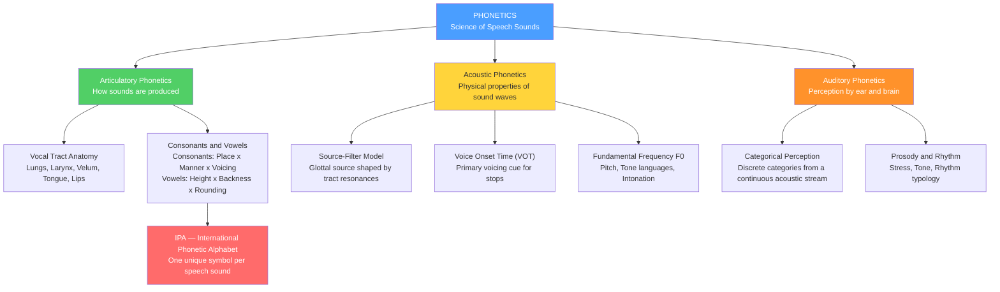

# Phonetics — The Science of Speech Sounds

> [!abstract] TL;DR
> Phonetics is the empirical science of speech sounds, divided into three interlocking branches: **articulatory** (how the vocal tract shapes sounds), **acoustic** (the physical properties of the resulting pressure waves), and **auditory** (how the ear and brain decode those waves into perceived categories). It provides the empirical foundation for the IPA, second-language teaching, speech technology, and clinical assessment of speech disorders.

---

## Intuition — analogy FIRST

A concert-hall pipe organ produces music by reshaping acoustic tubes: long, wide tubes give deep bass notes; short, narrow ones give bright treble. The human vocal tract works by the same physics — it is a roughly 17 cm variable-geometry tube. Your **lungs** supply the air pressure; the **larynx** optionally injects a buzzy periodic pulse (voicing); and your **tongue**, **lips**, **velum** (soft palate), and **teeth** sculpt the tube's shape in real time, creating a different resonance pattern — a different speech sound — dozens of times per second.

Phonetics is the discipline that precisely measures these shapes (articulatory phonetics), characterises the resulting pressure waves mathematically (acoustic phonetics), catalogues every shape-and-wave combination used across human languages into a single universal notation (the IPA), and asks how the listener's ear and brain convert a continuous stream of sound back into discrete words (auditory phonetics).

---

## How It Works



---

## Key Concepts

### Secondary Level

#### Three Branches of Phonetics

| Branch | Core question | Primary methods |
|--------|---------------|-----------------|
| **Articulatory** | How does the vocal tract produce sounds? | X-ray, MRI, electropalatography |
| **Acoustic** | What are the physical properties of the pressure wave? | Spectrogram, formant tracking, oscilloscope |
| **Auditory** | How do the ear and brain decode those waves into phonemes? | Perceptual experiments, EEG/MEG, ABR |

#### The Vocal Tract and Sound Production

Speech starts with air from the **lungs** (the power supply). At the **larynx** (voice box), two muscular vocal folds can be brought together and set into vibration at rates from ~80 Hz (low male voice) to ~300 Hz (high female voice), producing a rich, harmonically complex **voiced** sound. When the folds are held open and apart, air passes silently — the sound is **voiceless**.

After the larynx, the airstream travels through the **pharynx** into the **oral cavity**. When the **velum** (soft palate) is lowered, air also flows through the **nasal cavity**, adding nasal resonance. The tongue, lips, and teeth reshape the oral cavity continuously, changing the resonance properties dozens of times per second.

#### Phones, Phonemes, and Allophones

- A **phone** [brackets] is any distinct speech sound a human can produce, without regard to language: [p], [pʰ], [b].
- A **phoneme** /slashes/ is a sound category in a *specific* language that distinguishes meaning. English /p/ and /b/ are different phonemes because they distinguish "pin" from "bin."
- An **allophone** is a phonetically distinct variant of a phoneme that does *not* change meaning. In English, the aspirated [pʰ] of "pin" and the unaspirated [p] of "spin" are both realisations of /p/ — they are allophones in complementary distribution.

#### Consonants: Place and Manner

**Place of articulation** — where in the vocal tract the main constriction occurs:

| Place | Contact | English examples (IPA) |
|-------|---------|------------------------|
| Bilabial | Both lips together | /p b m/ |
| Labiodental | Lower lip + upper teeth | /f v/ |
| Dental | Tongue tip + upper teeth | /θ ð/ (thin, this) |
| Alveolar | Tongue tip + alveolar ridge | /t d s z n l/ |
| Postalveolar | Tongue blade behind the ridge | /ʃ ʒ tʃ dʒ/ (shoe, measure, church, judge) |
| Palatal | Tongue body + hard palate | /j/ (yes) |
| Velar | Tongue back + soft palate (velum) | /k g ŋ/ (king, sing) |
| Uvular | Tongue back + uvula | /q ʁ/ (Arabic, French r) |
| Glottal | Glottis itself | /h ʔ/ (hat; glottal stop in "uh-oh") |

**Manner of articulation** — the type of airflow constriction:

| Manner | Mechanism | Examples |
|--------|-----------|---------|
| Plosive (Stop) | Complete oral closure, then sudden release | /p b t d k g/ |
| Fricative | Narrow turbulent constriction | /f v s z ʃ ʒ θ ð h/ |
| Affricate | Stop immediately released into a fricative | /tʃ dʒ/ |
| Nasal | Oral closure + lowered velum for nasal cavity flow | /m n ŋ/ |
| Lateral | Tongue contacts the ridge; air flows round the sides | /l/ |
| Approximant | Near-closure without turbulence | /ɹ j w/ |
| Trill | Rapid vibrations against an articulator | /r/ (Spanish, Italian) |
| Click | Ingressive (inward) airstream mechanism | /ǀ ǃ ǁ/ (Zulu, Xhosa) |

**Voicing** — whether the vocal folds vibrate during the sound:
- Voiceless: /p t k f s ʃ θ h/
- Voiced: /b d g v z ʒ ð/

#### Vowels and the Vowel Quadrilateral

Vowels have no oral closure. Their quality is determined by the shape of the resonating cavity, captured by two articulatory dimensions on the IPA vowel **quadrilateral**:

- **Height** — how close the tongue's highest point is to the palate: Close (high) → Close-mid → Open-mid → Open (low)
- **Backness** — how far back the tongue's highest point is: Front → Central → Back
- **Rounding** — in most languages, back vowels are rounded (lips protruded), front vowels unrounded. Each quadrilateral cell lists the unrounded symbol on the left, the rounded on the right.

Representative English vowels:
/i/ (heed, high front) — /ɪ/ (hid, near-high front) — /e/ (hayed, mid front) — /ɛ/ (head, low-mid front) — /æ/ (had, near-low front) — /ɑ/ (father, low back) — /ɔ/ (law, low-mid back rounded) — /o/ (hoed, mid back rounded) — /u/ (who'd, high back rounded) — /ʌ/ (hud, mid-low back) — /ə/ (schwa, mid central, unstressed syllables)

**Monophthongs** are single-quality vowels; **diphthongs** are vowel glides from one position to another within a syllable (e.g., /aɪ/ in "time", /ɔɪ/ in "boy").

---

### Undergraduate Level

#### The International Phonetic Alphabet (IPA)

The IPA (International Phonetic Association, est. 1886; alphabet revised 2015/2020) provides **one unique symbol for every phonetically distinct speech sound found in any human language**. It contains:
- ~107 base letter symbols
- 55 diacritics (small marks for aspiration [pʰ], nasalisation [ã], length [aː], tone marks, etc.)
- 17 suprasegmental marks (primary stress ˈ, secondary stress ˌ, syllable boundary ., intonation boundaries)

The **consonant chart** is a 2-D grid: columns = place of articulation (left to right: bilabial to glottal), rows = manner of articulation (top to bottom: plosive to click). Each cell holds a voiceless symbol (left) and a voiced one (right). Shaded cells are physiologically impossible (e.g., no bilabial lateral).

The **vowel quadrilateral** is stylised as a trapezoid representing the interior of the oral cavity. The four corner reference points are the **Cardinal Vowels** defined by Daniel Jones (1917): [i] (front close), [a] (front open), [ɑ] (back open), [u] (back close). All other vowels are described relative to these.

#### Acoustic Phonetics: The Source-Filter Model

Fant (1960) and Stevens formalised the **source-filter model** of speech production:

1. **Source** — the glottis produces either a quasi-periodic pulse train (voiced, rich in harmonics at f₀, 2f₀, 3f₀, …) or broadband turbulence (voiceless fricatives) or a combined burst-plus-turbulence (affricates).
2. **Filter** — the vocal tract above the glottis selectively amplifies narrow frequency bands — **formants** — determined by its shape. The output speech = source × filter (convolution in time domain; multiplication in frequency domain).

For a neutral schwa [ə] in an adult male vocal tract (~17 cm), the three lowest formants are approximately:

| Formant | Frequency | Articulatory correlate |
|---------|-----------|------------------------|
| **F1** | ~500 Hz | Inversely proportional to tongue height (mouth opening). Low for /i u/; high for /a/ |
| **F2** | ~1500 Hz | Proportional to tongue frontness. High for front vowels; low for back vowels |
| **F3** | ~2500 Hz | Related to pharyngeal constriction, lip protrusion, retroflexion; encodes speaker voice quality |

Vowel identity is encoded primarily in the **F1 × F2 space**. Pivotal data points (Peterson & Barney, 1952, male averages):
- /i/ (heed): F1 ≈ 270 Hz, F2 ≈ 2290 Hz — high and front
- /ɑ/ (hod): F1 ≈ 730 Hz, F2 ≈ 1090 Hz — low and back
- /u/ (who'd): F1 ≈ 300 Hz, F2 ≈ 870 Hz — high and back

#### Voice Onset Time (VOT)

VOT is the interval from the **release burst of a stop** to the **onset of vocal fold vibration** (voicing). It is the primary acoustic cue for the voiced/voiceless contrast in stops:

| VOT range | Category | Example languages |
|-----------|----------|------------------|
| < 0 ms (voicing starts before release) | Pre-voiced | Spanish /b d g/, Thai voiced stops |
| 0–25 ms (short-lag) | Voiceless unaspirated | Spanish /p t k/, French /p t k/ |
| 40–80 ms (long-lag) | Voiceless aspirated | English /pʰ tʰ kʰ/ (syllable-initial) |

The landmark cross-linguistic VOT study (Lisker & Abramson, 1964) across 11 languages found that languages partition the VOT continuum at different boundary points, and listeners hear their own language's boundary categorically.

#### Coarticulation

Articulatory gestures for adjacent sounds overlap in time. When you say "scoop," the lips begin rounding for /u/ well before the tongue leaves the /k/ closure. This **coarticulation** means:
- Sounds in context differ acoustically from their isolated counterparts — there are no clean segment boundaries in the signal
- Anticipatory coarticulation: articulators plan several sounds ahead
- Carryover coarticulation: a past gesture persists into the next sound
- Spectrogram reading requires attending to **formant transitions** (the rapid changes in F1/F2 leading into and out of a sound) — these transitions carry crucial place-of-articulation information, especially for stops

#### Prosody and Rhythm

**Prosodic** (suprasegmental) features operate over units larger than a single segment:

- **Lexical stress** (Germanic languages, English): prominence — achieved through higher F0, longer duration, and greater intensity — distinguishes syllables within a word and can change word class: "record" (REcord, noun) vs. "record" (reCORD, verb).
- **Lexical tone** (tonal languages): different F0 contours on a syllable distinguish entirely different words. Mandarin has 4 tones (High, Rising, Dipping/Low, Falling); Cantonese has 6; Vietnamese has 6; Yoruba has 3.
- **Intonation** (all languages): sentence-level pitch patterns encode grammatical information (questions vs. statements) and pragmatic stance. ToBI (Tones and Break Indices) notation transcribes English intonation as sequences of High (H) and Low (L) tones.
- **Rhythm typology** (Pike 1945; Abercrombie 1967):
  - **Stress-timed**: English, German, Dutch — stressed syllables recur at roughly equal intervals; unstressed syllables are compressed
  - **Syllable-timed**: French, Spanish, Italian — all syllables have roughly equal duration
  - **Mora-timed**: Japanese, Tamil — the mora (sub-syllabic unit: a short vowel = 1 mora; a long vowel or final nasal = 2 morae) is the isochronous unit

#### Categorical Perception

Alvin Liberman et al. (1957) at Haskins Laboratories synthesised a 14-step acoustic continuum from /ba/ to /da/ to /ga/ by gradually shifting F2 onset frequency. Listeners:
1. **Labelled** stimuli categorically — almost all tokens were assigned to one of three categories with an abrupt boundary between them
2. **Discriminated** poorly within a category (e.g., two tokens from the /ba/ range that were acoustically different were perceptually indistinguishable) but well across the boundary

This pattern — **better discrimination at category boundaries than within categories** — defined categorical perception and suggested that phoneme categories actively reshape auditory memory.

---

### Graduate Level

#### Distinctive Feature Theory

Chomsky and Halle's *Sound Pattern of English* (SPE, 1968) reanalysed phonemes as bundles of binary **distinctive features** drawn from a universal set. Examples:
- [+voiced]: vocal folds vibrate during the sound (/b d g v z ʒ/ are [+voiced]; /p t k f s ʃ/ are [−voiced])
- [+nasal]: velum is lowered (/m n ŋ/ are [+nasal])
- [+high]: tongue body raised above the neutral position (/i u k g/ are [+high])
- [+back]: tongue body retracted behind neutral (/u ɑ k g/ are [+back])

A **natural class** is any set of sounds sharing a feature bundle. Phonological rules apply to natural classes — e.g., "English stops aspirate syllable-initially" = [−voiced, +plosive] → [+spread glottis] / #_.

**Articulatory Phonology** (Browman & Goldstein, 1989) replaced discrete features with continuous **gestures** — tract-variable constriction movements described by coupled nonlinear oscillators. This models coarticulation naturally as temporal overlap of gestural scores, rather than as rule-based addition of diacritics. It predicts gradient phonetic reduction (fast speech, casual register) without requiring two separate modular components.

#### Categorical Perception: Theoretical Debates

The original Haskins **Motor Theory** (Liberman & Mattingly, 1985) claimed that listeners recover the speaker's intended articulatory gestures, not the acoustic signal, explaining why categorical perception appears to be speech-specific. Evidence: the **McGurk effect** (McGurk & MacDonald, 1976) — when the visual /ga/ mouth movement is dubbed onto the acoustic /ba/, English listeners report hearing /da/ — demonstrating that speech perception is inherently multimodal and gesture-referenced.

Counter-evidence and alternative theories:
- Categorical perception also occurs for **musical intervals** and non-speech acoustic stimuli (Pisoni, 1977), weakening the "speech-special" claim
- The **direct-realist** view (Fowler, 1996): listeners perceive distal articulatory events, but through general ecological perception mechanisms, not a specialised speech module
- The **auditory-phonetic** view (Diehl, Lotto, Holt, 2004): categorical perception reflects the non-linear response properties of the general auditory system — no speech module is needed

The debate remains active and experimentally productive.

#### Laboratory Phonology and Exemplar Theory

Classical generative phonology (1965–1990) treated the phonetics-phonology interface as a strict boundary: phonology is categorical (rules on features), phonetics is a gradient implementation module. Laboratory phonology (Beckman & Kingston, 1990; Pierrehumbert, 2001) systematically dismantled this:
- **Lexical frequency effects**: high-frequency words are shorter and more reduced than low-frequency words with the same phonological form (Gahl, 2008) — a categorical rule cannot explain this
- **Probabilistic phonotactics**: the "wordlikeness" of a novel form is graded, not binary, based on the frequency of its constituent sequences
- **Exemplar theory**: listeners store detailed acoustic instances of words (including talker, rate, context), not only abstract categories; phonological knowledge is the accumulating density distribution over exemplars

Implication for NLP: end-to-end neural models that learn continuous acoustic representations capture gradient phonetic knowledge that rule-based categorical systems cannot.

#### MFCCs and the Acoustic Front-End

Classic automatic speech recognition (ASR) systems extract **Mel-Frequency Cepstral Coefficients** from each speech frame, mimicking auditory processing:

1. **Pre-emphasis**: apply high-pass filter (H(z) = 1 − 0.97z⁻¹) to boost high frequencies, compensating for the ~6 dB/octave roll-off of the glottal source
2. **Framing**: 25 ms Hamming-windowed frames with 10 ms hop
3. **Power spectrum**: compute |DFT|² for each frame
4. **Mel filterbank**: apply M triangular filters (M = 26–40) spaced linearly below 1 kHz and logarithmically above, on the **Mel scale**:
$$m = 2595 \log_{10}\!\left(1 + \frac{f}{700}\right)$$
   This mimics the cochlea's tonotopic organisation: finer frequency resolution at low frequencies, coarser at high
5. **Log compression**: $\log(|\text{filterbank output}|)$ approximates the auditory intensity response (Weber-Fechner law)
6. **DCT**: retain the first 12–13 cepstral coefficients (MFCCs), discarding higher coefficients that encode fine spectral ripple rather than formant shape
7. **Deltas and delta-deltas**: append first and second temporal derivatives to capture formant dynamics

Modern end-to-end ASR (wav2vec 2.0, Whisper) replaces hand-crafted MFCCs with convolutional or transformer-based feature learners trained directly on raw waveforms, but the learned representations still cluster around formant-like spectrotemporal patterns.

#### Formant Synthesis

Synthesising speech by directly specifying formant trajectories over time — the **Klatt synthesiser** (Klatt, 1980) — provides the most explicit proof of the source-filter model: if you specify F0, F1, F2, F3, voicing amplitude, and frication amplitude, you can reproduce any speech sound. A formant synthesiser is implemented as a parallel or cascade bank of second-order resonator (bandpass) filters, each tuned to one formant frequency and bandwidth. Formant synthesis remains the gold standard for:
- Producing experimental stimuli with fine-grained acoustic control (speech perception research)
- Demonstrating mechanistic understanding of the source-filter mapping
- Accessible TTS for low-resource languages where neural training data is unavailable

---

## Python Demo

Visualise the acoustic vowel space for General American English. Formant values follow Peterson and Barney (1952) male-speaker averages. By phonetic convention, the F1 y-axis is **inverted** (high vowels with low F1 appear at the top, matching the traditional vowel diagram) and the F2 x-axis is **inverted** (front vowels with high F2 appear on the left). Red arrows illustrate three key steps of the **Northern Cities Vowel Shift** (Labov 2010): /æ/ raises, /ɑ/ fronts, and /ɔ/ fronts.

```python
import numpy as np
import matplotlib.pyplot as plt
import matplotlib.patches as mpatches

# ── Formant data: (IPA symbol, keyword, F1 Hz, F2 Hz) ─────────────────────────
# Source: Peterson & Barney (1952), male-speaker averages
vowels = [
    ('/i/',  'heed',  270, 2290),
    ('/ɪ/',  'hid',   390, 1990),
    ('/e/',  'hayed', 530, 1840),
    ('/ɛ/',  'head',  660, 1720),
    ('/æ/',  'had',   860, 1550),
    ('/ɑ/',  'hod',   730, 1090),
    ('/ɔ/',  'hawed', 590,  880),
    ('/ʌ/',  'hud',   640, 1190),
    ('/ʊ/',  'hood',  440, 1020),
    ('/u/',  "who'd", 300,  870),
]

# Northern Cities Vowel Shift (NCVS) — displacement vectors (ΔF1, ΔF2)
# Positive ΔF1 = lower (more open vowel); Positive ΔF2 = fronter vowel
ncvs_shifts = {
    '/æ/': (-160, +180),   # raises toward /ɛ/ (F1 drops, F2 stays high)
    '/ɑ/': (   0, +330),   # fronts toward /æ/ (F2 rises sharply)
    '/ɔ/': (+100, +250),   # fronts and lowers toward /ɑ/
}

# Build lookup for arrow drawing
vowel_map = {sym: (f1, f2) for sym, _, f1, f2 in vowels}

fig, ax = plt.subplots(figsize=(9, 7))
ax.set_facecolor('#f7f7f7')
ax.grid(True, linestyle='--', linewidth=0.6, alpha=0.45, color='gray')

# --- Draw NCVS arrows (behind scatter points so they don't obscure labels) ---
for sym, (df1, df2) in ncvs_shifts.items():
    f1, f2 = vowel_map[sym]
    ax.annotate(
        '',
        xy=(f2 + df2, f1 + df1),   # arrow head: shifted (target) position
        xytext=(f2, f1),            # arrow tail: original vowel position
        arrowprops=dict(arrowstyle='->', color='crimson', lw=2.2),
        zorder=2
    )

# --- Plot each vowel as a labelled scatter point ---
for sym, word, f1, f2 in vowels:
    ax.scatter(f2, f1, s=100, color='steelblue',
               edgecolors='white', linewidths=1.0, zorder=4)
    ax.annotate(
        f'{sym}\n({word})',
        xy=(f2, f1),
        xytext=(7, 5),
        textcoords='offset points',
        fontsize=8.5,
        color='#1a1a1a',
        zorder=5
    )

# --- Phonetic convention: invert both axes ---
# Invert y-axis: high vowels (low F1) float to the top of the chart
ax.invert_yaxis()
# Invert x-axis: front vowels (high F2) appear on the left
ax.invert_xaxis()

# --- Axis labels and title ---
ax.set_xlabel(
    'F2 — Second Formant (Hz)\n'
    '<-- Front vowels                              Back vowels -->',
    fontsize=10
)
ax.set_ylabel(
    'F1 — First Formant (Hz)\nHigh                                    Low',
    fontsize=10
)
ax.set_title(
    'Acoustic Vowel Space — General American English\n'
    'Peterson & Barney (1952), male averages  |  '
    'Red arrows = Northern Cities Vowel Shift (Labov 2010)',
    fontsize=10, pad=10
)

# --- Legend ---
dot_patch  = mpatches.Patch(color='steelblue', label='Vowel: (F1, F2) formant centre')
ncvs_patch = mpatches.Patch(color='crimson',   label='Northern Cities Vowel Shift direction')
ax.legend(handles=[dot_patch, ncvs_patch], loc='upper right', fontsize=9)

plt.tight_layout()
plt.show()

# Expected: vowel space trapezoid in the upper-left and lower-left quadrant
# /i/ top-left (front-high); /u/ top-right (back-high); /a/ bottom-centre (low)
# NCVS arrows show /ae/ rising, /ɑ/ fronting, /ɔ/ fronting + lowering
```

---

## Real-World Applications

**Automatic Speech Recognition (ASR).** The entire classical ASR pipeline is built on acoustic phonetics. MFCC feature extraction mimics the auditory filterbank; Hidden Markov Models (HMMs) model phoneme sequences; language models re-rank hypotheses. Modern deep-learning ASR (wav2vec 2.0, Whisper) learns phoneme-like representations in its first convolutional layers, essentially rediscovering the spectrogram structure that phoneticians identified by hand.

**Text-to-Speech Synthesis (TTS).** Rule-based formant synthesisers (Klatt, 1980) converted phoneme sequences to F0/formant trajectories. Concatenative systems stitched together recorded phoneme units (diphones). Neural TTS (Tacotron, FastSpeech, VITS) generates mel spectrograms or raw waveforms directly from grapheme/phoneme sequences, but prosody modules still encode the phonetic categories of stress, tone, and duration that phonetics defines.

**Second-Language Teaching and Pronunciation.** The IPA gives learners and teachers a shared notation for comparing native-language and target-language sound systems. Contrastive analysis (e.g., Spanish /b d g/ are unaspirated — a detail invisible in orthography) predicts learner difficulties and guides explicit feedback. Speech analysis software (Praat) gives learners real-time formant and pitch displays.

**Clinical Phonetics and Speech-Language Pathology.** Acoustic analysis of formant trajectories, VOT, and prosodic timing supports differential diagnosis of:
- **Dysarthria** (motor execution deficit, e.g., in ALS, cerebral palsy): formant undershoot, reduced VOT contrast, abnormal F0 range
- **Apraxia of speech** (motor planning/programming deficit): inconsistent segment substitutions, lengthened inter-word durations, groping articulatory movements
- **Phonological disorders in children**: substitution and deletion patterns that follow natural-class predictions from feature theory

**Language Documentation.** Endangered languages (many with fewer than 100 speakers) must be documented before they disappear. Field phoneticians use the IPA plus spectrograms to transcribe new sounds that fall outside the European phoneme inventory (clicks, implosives, pharyngealised vowels, complex tone systems). Such documentation is the first step toward grammars, dictionaries, and community language programmes.

**Forensic Phonetics.** Speaker comparison in criminal investigations uses spectrographic voice prints and formant trajectories to assess whether two recordings share a speaker. Long-term F0, spectral tilt, formant values, and voice quality features (jitter, shimmer) form an acoustic fingerprint that trained phoneticians compare. Courts in multiple jurisdictions accept such evidence under strict methodology standards.

---

## Common Pitfalls

- **Conflating phone, phoneme, and allophone** — A phone is a physical sound (observable). A phoneme is a mental category in one language (abstract). An allophone is a phone that is a variant of a phoneme without changing meaning. The same phone [pʰ] is an allophone of /p/ in English but a separate phoneme /pʰ/ in Hindi and Thai — context (language system) determines which level of analysis applies.

- **Treating IPA as English-centric** — The IPA symbol /r/ denotes an alveolar trill (Spanish, Italian); English uses a retroflex or bunched approximant properly transcribed as /ɹ/. French uses a uvular fricative /ʁ/. Using "r" interchangeably for all three obscures critical phonetic differences.

- **Reading the spectrogram as if formants are absolute frequencies** — Formant frequencies scale with vocal tract length. A child's F1 for /i/ may be 400 Hz; an adult male's may be 270 Hz. The same phone is identified by *relative* formant patterns and the F1 × F2 trajectory shape, not by absolute Hz values. Normalising for vocal tract length is essential when comparing across speakers.

- **Ignoring coarticulation when studying segments** — Transcribing speech sound by sound and analysing each in isolation misses the continuous articulatory overlap that constitutes real speech. Coarticulation is not noise — it is systematic and predictable from phonetic context. Systems that ignore it (e.g., simple dictionary look-up ASR) fail badly.

- **Confusing tone (lexical) with intonation (sentential)** — Tone languages use pitch contour to distinguish word meaning; changing tone changes the word. Intonation languages use pitch patterns for grammatical or pragmatic purposes (questions, emphasis) without changing the lexical identity. Mandarin is a tone language AND uses intonation — these operate simultaneously at different linguistic levels. Treating every pitch change as intonation when analysing a tone language destroys lexical information.

---

## Related Concepts

**Neuroscience**
- [[Auditory_System_and_Sound_Processing]] — The peripheral and central auditory pathway (cochlea → brainstem → auditory cortex) is the biological substrate of auditory phonetics; tonotopy corresponds directly to the acoustic frequency organisation of the vowel space.
- [[Language_and_the_Brain]] — Broca's area coordinates articulatory motor planning; Wernicke's area performs phonological decoding; the Hickok-Poeppel dual-stream model maps phonetics directly onto dorsal (motor-phonetic) and ventral (phonological-semantic) cortical streams.

**Physics and Signal Processing**
- [[Waves_in_Fluids_and_Acoustics]] — The physics of pressure waves, acoustic impedance, resonance in tubes, and the wave equation underlie the source-filter model of speech and the formant resonance calculations.
- [[Fourier_Transform]] — Spectral analysis of speech is a direct application of the Fourier transform; formants are the peaks of the short-time power spectrum, and the vocal tract filter is best described in the frequency domain.
- [[DFT_and_FFT]] — The FFT computes the short-time spectra from which spectrograms and formant tracks are derived; all digital speech analysis pipelines run on DFT-based frame-by-frame analysis.

**Audio and Speech Technology**
- [[Mel_Filterbank_MFCCs]] — MFCCs are the standard acoustic feature representation for ASR, designed around the Mel scale (which models cochlear frequency resolution) and cepstral decorrelation; they encode the same formant structure phoneticians measure manually.
- [[Spectrograms_Features]] — Practical guide to spectrogram computation, windowing, and reading the time-frequency features (formants, voicing, frication noise) that phoneticians interpret.
- [[STFT_and_Windowing]] — The Short-Time Fourier Transform is the computational engine behind every spectrogram; windowing trade-offs (time resolution vs. frequency resolution) directly affect formant measurement accuracy.
- [[ASR_Deep_Learning]] — End-to-end ASR (CTC, attention, transformers) implicitly learns phonetic categories from data; understanding the phonetic structure it must model clarifies why certain architectures work and where they fail (tonal languages, coarticulation).
- [[TTS_Fundamentals]] — Text-to-speech synthesis must map from phoneme sequences to acoustic representations; phonetics defines the target acoustic properties (formant targets, VOT, prosodic patterns) that the synthesis model must reproduce.
- [[Prosody_and_Expressive_TTS]] — Modelling stress, tone, and intonation in TTS requires the prosodic feature representations defined by phonetics (F0 contours, duration patterns, rhythm typology).

---

## Review Questions

### Secondary

1. You are trying to help a French speaker learn to pronounce English /θ/ (as in "think"). Describe exactly which articulators are involved and what they do, compared to the closest French sounds /t/ (alveolar stop) and /s/ (alveolar fricative). What specific articulatory error is the French speaker most likely to make, and why?

### Undergraduate

2. A spectrogram of the word "bad" shows a dark region of F1 and F2 transitions before the onset of voicing, an aspirated release burst, and a steady-state vowel region. Sketch (in words or a rough drawing) what the spectrogram of "pad" would look like instead, and explain how VOT and the formant transitions differ between /b/ and /p/ in these words. What would change if the speaker were Spanish rather than English?

### Graduate

3. Categorical perception was originally taken as evidence for a specialised speech-perception module (Motor Theory). Summarise two pieces of counter-evidence — one from non-speech perception and one from developmental data — that challenge a strictly speech-special interpretation. Then explain how **Exemplar Theory** accounts for both categorical-boundary sharpness and the gradient lexical-frequency effects observed in laboratory phonology, without positing either a speech module or discrete abstract categories.

---

## Sources

- Ladefoged, P. & Johnson, K. (2015). *A Course in Phonetics*, 7th ed. Cengage Learning. — The standard undergraduate introduction; covers all three branches with IPA transcription exercises.
- Johnson, K. (2012). *Acoustic and Auditory Phonetics*, 3rd ed. Wiley-Blackwell. — Deep treatment of the source-filter model, formant theory, spectrograms, and the auditory system.
- Peterson, G. E. & Barney, H. L. (1952). Control methods used in a study of the vowels. *Journal of the Acoustical Society of America*, 24(2), 175–184. — The foundational vowel formant dataset; still the benchmark for formant space visualisations.
- Lisker, L. & Abramson, A. S. (1964). A cross-language study of voicing in initial stops. *Word*, 20(3), 384–422. — Established VOT as a universal phonetic dimension and mapped its cross-linguistic variation.
- Liberman, A. M., Harris, K. S., Hoffman, H. S., & Griffith, B. C. (1957). The discrimination of speech sounds within and across phoneme boundaries. *Journal of Experimental Psychology*, 54(5), 358–368. — Original categorical perception experiment; one of the most cited papers in phonetics.
- Chomsky, N. & Halle, M. (1968). *The Sound Pattern of English*. Harper & Row. — SPE distinctive feature theory; defines the formal feature vocabulary still used in phonological analysis.
- Labov, W. (2010). *Principles of Linguistic Change, Vol. 3: Cognitive and Cultural Factors*. Wiley-Blackwell. — Comprehensive documentation of the Northern Cities Vowel Shift and the social embedding of sound change.

---

#Linguistics #FoundationsPhonetics #Phonetics
