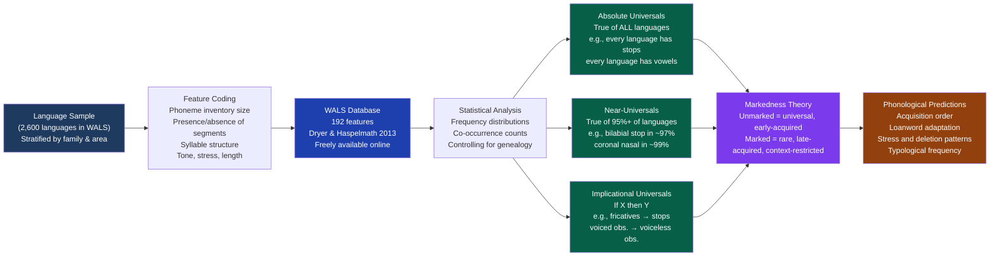

# Phonological Typology and Universals

> [!abstract] TL;DR
> Phonological typology compares sound systems across unrelated languages to find cross-linguistic structural patterns and universals. The World Atlas of Language Structures (WALS) documents 2,600+ languages on 192 features; Greenberg's implicational universals (if X then Y) constrain which phoneme inventories can exist; markedness theory explains why voiced stops, nasal vowels, and clicks are consistently rare; and environmental hypotheses link altitude to ejective consonants and humidity to vowel richness. The deepest result is that a handful of phonemes — /p, t, k, m, n, a, i, u/ — appear in virtually every language while hundreds of others appear in fewer than 5%, tracing a distribution that reflects the acoustics of the human vocal tract, not cultural accident.

---

## Intuition

**Analogy:** Imagine cataloguing the world's rivers — not their histories (where each originated geologically), but their structures right now: width, depth, flow rate, branching patterns. Without knowing which river derives from which ancient watershed, you'd quickly find structural regularities. All rivers flow downhill. Rivers wider than a kilometre always have tributaries. Rivers with no tributaries are always small. Some properties appear to be universal laws of rivers; others are options within a constrained space.

Phonological typology does exactly this for sound systems. It brackets the question of how languages are historically related and instead asks: across any 2,600 languages you sample, what structures appear in nearly all of them, what structures appear in very few, and when structure X appears, is structure Y reliably present too? The answers turn out to be constrained in ways that cannot be explained by cultural convention alone — they reflect what the human vocal tract can produce efficiently, what the auditory system can discriminate reliably, and how sound systems are learned by children in every generation.

---

## How It Works



---

## Key Concepts

### Secondary Level

**What phonological typology is — and what it is not**

Historical-comparative linguistics asks: how are languages related? It reconstructs proto-languages, traces sound changes, and builds family trees. Phonological typology asks a different question: across languages that may have no historical connection at all, what structural patterns recur? A typologist comparing Swahili, Quechua, and Japanese is not looking for genetic relationship — she is looking for structural regularities that transcend lineage.

The goal is to find **universals** (properties true of all or almost all languages) and to describe the range and pattern of **variation** (ways languages can differ). Finding that all languages have oral stops, but only 15% have pharyngeal fricatives, tells us something about which parts of the articulatory-acoustic space are natural stable stopping-points for human sound systems.

**WALS: the World Atlas of Language Structures**

The World Atlas of Language Structures (WALS), edited by Matthew Dryer and Martin Haspelmath (2013), is the primary data resource for phonological typology. Key facts:

| Property | Detail |
|---|---|
| Languages documented | ~2,600 (from ~400 language families) |
| Features coded | 192 (phonological, morphological, syntactic, lexical) |
| Geographic coverage | All inhabited continents, all major families |
| Accessibility | Freely available at wals.info |

WALS is a global database, not a random sample — it over-represents well-documented languages and has uneven geographic coverage (fewer languages from New Guinea, fewer from the Pacific). This sampling issue is important for interpretation: conclusions should be treated as tendencies, not census facts.

**Sound inventory sizes: the extremes and the average**

Consonant and vowel inventory sizes vary enormously across languages. Key benchmarks from WALS:

| Category | Description | Example |
|---|---|---|
| Smallest consonant inventories | ~6–9 consonants | Pirahã (Brazil): ~11 phonemes total |
| Average consonant inventory | ~22 consonants | English: ~24 consonants |
| Large consonant inventory | 35–50 consonants | Swahili: ~35; Georgian: ~28+ |
| Largest consonant inventories | 50–150+ consonants | Taa (!Xóõ, Botswana/Namibia): ~58–94 consonants (analysis-dependent), with ~20 click consonants; ~150 total phonemes including clicks and tones |

Vowel inventories are smaller and show less variation: most languages have between 5 and 10 vowels. The most common vowel inventory size cross-linguistically is exactly 5 (roughly 15% of WALS languages), and the **cardinal five-vowel system** /a, e, i, o, u/ (or close approximations) is the most common specific configuration — found in languages as unrelated as Spanish, Swahili, Japanese, and Yoruba.

**Which phonemes appear in almost every language?**

Some segments are universal or near-universal; others are rare. The pattern is not random — it reflects acoustics and articulatory efficiency:

| Segment | Approximate frequency across languages | Note |
|---|---|---|
| /t/ or /d/ (coronal stop) | ~99% | The most universal consonant class |
| /k/ (velar stop) | ~96% | Nearly universal |
| /m/ (bilabial nasal) | ~96% | |
| /n/ (coronal nasal) | ~97%+ | |
| /p/ (bilabial stop) | ~85% | Absent in Tlingit, Mohawk, and a few others |
| /s/ (alveolar fricative) | ~73% | Most common fricative |
| /a/ (low central vowel) | ~99%+ | Universal or near-universal |
| /i/ (high front vowel) | ~99%+ | |
| /u/ (high back rounded) | ~97%+ | |
| /ŋ/ (velar nasal, as in *sing*) | ~61% | |
| Clicks | ~1–2% | Southern Africa, Tanzania only |
| Uvular stops (like Parisian /R/) | ~17% | Cluster in North America and Eurasia |
| Pharyngeal fricatives (/ħ, ʕ/ as in Arabic) | ~7% | Semitic languages, some Caucasian |

The pattern: bilabial, coronal, and velar stops; bilabial and coronal nasals; and the three cardinal vowels /i, a, u/ are universal or near-universal. More articulatorily complex or acoustically less distinct segments — uvulars, pharyngeals, clicks, retroflex consonants, front rounded vowels — are progressively rarer.

---

### Undergraduate Level

#### Greenberg's Implicational Universals

Joseph Greenberg's 1963 paper "Some Universals of Grammar with Special Reference to the Order of Meaningful Elements" established the framework of **implicational universals** — statements of the form "if a language has X, it also has Y." His 1966 work on phonological universals extended this to sound systems. Key phonological implicational universals:

**The Stop Hierarchy:**
> If a language has fricatives, it has stops.

Fricatives require stops as a precondition — but not vice versa. Languages with stops but no fricatives exist (e.g., many Oceanic languages have very limited fricative inventories). The reverse — fricatives but no stops — is essentially unattested. Stops are more basic, acquired earlier, and more universally present.

**The Voicing Symmetry Universal:**
> If a language has voiced obstruents, it has voiceless obstruents.

Voiceless stops (/p, t, k/) always appear before voiced stops (/b, d, g/). If a language contrasts /b/ vs /p/, it also contrasts /g/ vs /k/ — there is no language with /b/ but not /p/. The implication runs one way only: voiceless is more basic.

**The Front Vowel Universals:**
> If a language has front rounded vowels (/y/ as in French *lune*, /ø/ as in French *peu*), it has front unrounded vowels (/i, e/).

Front rounded vowels are marked: they add lip rounding to front vowel articulations that normally lack it (in most languages, front = unrounded). They never appear alone — they always co-occur with the corresponding unrounded front vowels. This universal is exceptionless in WALS.

**The Velar-Coronal Stop Universal:**
> If a language has a velar stop /k/, it has a coronal stop /t/ (or its equivalent).

Coronal stops are more universal than velars; velars never appear in isolation from coronals. The implication is coronal-preferring.

**Why implicational universals matter:**

These universals are not arbitrary correlations. They constrain the **typological space** — the set of logically possible phoneme inventories. Without Greenberg's universals, the space of possible consonant inventories would include any random subset of possible consonants. With them, we know that certain combinations are forbidden or near-forbidden: a language cannot have fricatives but not stops; cannot have voiced stops but not voiceless ones. The possible inventories cluster in a structured region of the theoretical space, and the forbidden regions tell us what is unnatural for the human sound-production and perception system.

#### Markedness Theory

Markedness is the theoretical framework that systematizes the typological asymmetries Greenberg observed. Originally developed by Prague School phonologists (Trubetzkoy, Jakobson) and later formalized in generative linguistics (Chomsky and Halle 1968) and Optimality Theory (Prince and Smolensky 1993), markedness theory distinguishes two poles of every phonological opposition:

- **Unmarked**: More frequent cross-linguistically; acquired earlier by children; more resistant to deletion under fast speech; present wherever its pair is present; the default realization in neutralization contexts
- **Marked**: Rarer; acquired later; deleted or simplified under phonological pressure; always implies the presence of the unmarked member

Key markedness relationships in phonology:

| Domain | Unmarked | Marked |
|---|---|---|
| Voicing in stops | Voiceless /p, t, k/ | Voiced /b, d, g/ |
| Nasality in vowels | Oral vowels (/a, i, u/) | Nasal vowels (/ã, ĩ/) |
| Syllable structure | CV (open syllable) | CVC, CCV, CVCC (closed, complex onset/coda) |
| Vowel height opposition | High (/i, u/) and low (/a/) | Mid vowels (/e, o/) — less stable |
| Stop place | Coronal /t/ | Bilabial /p/ | Velar /k/ (ordering debated) |
| Consonant manner | Stops | Fricatives | Affricates | Approximants |
| Lexical tone | Absence of tone | Presence of tone |

Markedness is not an absolute property but a relational one: /b/ is marked relative to /p/, but /b/ is unmarked relative to /ɓ/ (implosive b). The same segment can be unmarked in one context and marked in another — word-final voiced obstruents are more marked than word-initial ones, which is why final devoicing (German, Russian) is a common process while initial devoicing is rare.

**Why markedness matters practically:**

1. **Acquisition order**: children acquire unmarked segments first. Virtually all children produce /m, p, b, t, d, n, k, g/ before fricatives or affricates; voiceless stops before voiced ones; open syllables before closed ones; oral vowels before nasal ones.
2. **Loanword adaptation**: when a language borrows a word containing a marked segment it lacks, it replaces that segment with the nearest unmarked equivalent. Japanese has no coda consonants (all syllables are open), so borrowed words systematically add vowels to create CV structure: *strike* → *sutoraiku*.
3. **Phonological processes**: lenition, deletion, and simplification processes preferentially affect marked segments. Coda consonants delete; voiced fricatives become voiced stops; consonant clusters reduce.
4. **Typological frequency**: the frequency of a segment cross-linguistically is roughly its markedness value — more universal = more unmarked.

#### The Altitude Hypothesis: Ejectives at High Elevation

One of the most provocative recent findings in phonological typology comes from Caleb Everett (2013), who found a robust geographic correlation: **ejective consonants cluster in languages spoken at high elevations**.

Ejective consonants (like the /p'/, /t'/, /k'/ in Quechua, Amharic, Hausa dialects, and many Pacific Northwest languages) are produced by closing the glottis and compressing air above it using a rising larynx, releasing it explosively without any lung pressure. The proposed mechanism is straightforward: at high altitudes, atmospheric pressure is lower, making the normal pulmonary egressive airstream (lungs pushing air out) acoustically less efficient for building the pressure burst that makes stops perceptible. The ejective mechanism — compressing a sealed column of supraglottal air — does not depend on atmospheric pressure in the same way, making it relatively more efficient at altitude.

Geographic clusters of ejective languages:
- **Andes** (above 2,000–4,500m): Quechua, Aymara, and many neighboring languages
- **Ethiopian plateau** (1,500–3,000m): Amharic, Tigrinya, Oromo, and other Cushitic/Semitic languages
- **Caucasus** (variable elevation): Georgian, Armenian, Chechen, and Nakh-Daghestanian languages
- **North American plateau** (1,000–2,000m): Salish languages, Tsimshian, Haida, many Athabaskan languages

The correlation is statistically significant across multiple analytical frameworks. However, the mechanism remains debated: the acoustic effect of altitude on ejective production efficiency is real but modest, and the correlation may also reflect the fact that the populations who historically occupied these high-altitude areas were part of the same migration waves, introducing a genealogical confound (related languages share ejectives by descent, not by independent innovation).

#### The Humidity Hypothesis: Vowels and Climate

In a related 2015 paper, Caleb Everett, Damian Blasi, and Seán Roberts reported that **tonal complexity and vowel inventory size correlate with environmental humidity**. The proposed mechanism: desiccated air dries the vocal folds, reducing their pliability and making fine-grained tonal and vowel distinctions more variable and less reliably produced. Languages spoken in humid tropical environments therefore face less physiological cost in maintaining large vowel contrasts and tonal distinctions.

The geographic clusters are plausible: tonal languages (Vietnamese, Mandarin, Yoruba, the Bantu languages) are concentrated in tropical and subtropical regions; the languages of the extremely dry Saharan belt and Arabian peninsula tend to have simpler vowel systems. But the humidity hypothesis has faced stronger criticism than the altitude-ejective correlation. Critics point out that many tonal languages are spoken at high, drier altitudes (Tibetan, Mandarin in the north), that the genealogical confound is severe (nearly all tonal languages belong to just a few families), and that the acoustic mechanism — while not implausible — has not been demonstrated in controlled phonetic experiments. The hypothesis is best treated as a stimulating provocation requiring more controlled investigation.

#### Zipf's Law and Phoneme Frequency

Zipf's Law — the observation that word frequency in natural language follows a power-law distribution (the most frequent word appears roughly twice as often as the second most frequent, three times as often as the third, and so on) — extends to the phonological level in two ways:

1. **Within-language phoneme frequency**: In any language, a small number of phonemes account for the majority of sounds in running text. In English, /ə/ (schwa), /n/, /t/, /r/, /s/ collectively account for over 40% of all consonant occurrences, while rare sounds like /ʒ/ (the *s* in *measure*) account for less than 0.1%. More frequent phonemes also tend to appear in more frequent words.

2. **Across languages — universality as frequency**: The most universal phonemes (those in 95%+ of languages) are also the most frequent within individual languages. /a/, /i/, /u/, /n/, /t/ are both cross-linguistically universal and within-language frequent. This convergence is not accidental: phonemes that are easy to produce, acoustically distinctive, and resistant to perceptual confusion are naturally both common within languages and stable across them.

The **Liljencrants-Lindblom dispersion theory** formalizes this: stable vowel systems are those in which the vowels are maximally dispersed in acoustic (formant) space, minimizing the chance of perceptual confusion. The three-vowel system /i, a, u/ has maximum dispersion; the five-vowel system /i, e, a, o, u/ is the next most dispersed configuration. This explains why these configurations dominate the typological record.

---

### Graduate Level

#### Optimality Theory and Formal Markedness

In Optimality Theory (Prince and Smolensky 1993), markedness is formalized as a set of **markedness constraints** — constraints that penalize specific structures without regard to the input — ranked against **faithfulness constraints** that demand output-input identity. The grammar of any language is a ranking of the universal constraint set (CON); the typology of possible grammars is the **factorial typology** — all possible total orderings of the constraints.

Key OT concepts for phonological typology:

- **Markedness constraints** (e.g., \*VOICED-STOP: penalize voiced obstruents; \*COMPLEX-ONSET: penalize onset clusters; \*NASAL-VOWEL: penalize nasal vowels) are universal — present in all grammars. What differs is their ranking relative to faithfulness.
- **Faithfulness constraints** (IDENT-F, MAX: no deletion, DEP: no epenthesis) demand that output forms preserve input contrasts. When faithfulness outranks a markedness constraint, the marked structure surfaces; when markedness outranks faithfulness, it is repaired.
- **Typological prediction**: a language with nasal vowel contrasts has faithfulness constraints for nasality ranked above \*NASAL-VOWEL. A language without nasal vowels (the majority) has \*NASAL-VOWEL ranked above that faithfulness constraint. The cross-linguistic rarity of nasal vowels is predicted by the number of rankings in which \*NASAL-VOWEL dominates — most of the factorial typology's rankings will place markedness above faithfulness for this feature.

OT's elegant insight is that cross-linguistic typology falls out from the same universal constraint set operating at different rankings. The typological research program for OT is to determine whether all attested phonological patterns (and no unattested ones) correspond to some valid ranking of the universal constraint set — a **restrictiveness** test that motivates empirical typological work.

#### Galton's Problem: Statistical Independence in Typology

The central methodological challenge in quantitative typological work is **genealogical non-independence**, sometimes called Galton's Problem (after Francis Galton, who raised an analogous issue for cross-cultural statistics in 1889). The problem: if two closely related languages (say, Spanish and Italian) both lack ejective consonants, that is not two independent data points for the typological generalization "most Romance languages lack ejectives" — it is one data point (Latin, the common ancestor, lacked ejectives). Counting them separately inflates the sample size and distorts significance calculations.

Solutions in the literature:

**Dryer's genus method (1992)**: Matthew Dryer proposed counting not individual languages but *genera* — groups of languages within a family that are no more closely related to each other than, say, French and Greek within Indo-European. WALS uses approximately 480 genera as the effective sampling unit for statistical generalizations.

**Maslova's conditional probability method (2000)**: Elena Maslova proposed computing the probability that a feature distribution would arise by chance given the rates of feature gain and loss over time, correcting for the fact that related languages share features through ancestry.

**Bayesian phylogenetic comparative methods**: Modern approaches (Pagel et al., Dunn et al. 2011) model languages as tips on an explicit phylogenetic tree and use Bayesian methods to estimate rates of gain and loss of features while statistically controlling for shared ancestry. This approach can test whether co-occurrence of features X and Y is more common than expected given their individual frequencies and the genealogical structure of the sample — directly testing whether an implicational universal holds beyond genealogical confound.

The genealogical independence problem does not invalidate typological generalization — it requires appropriate statistical controls. When Dryer applied genus-level counting to Greenberg's word-order universals, most of them survived; a few were revealed as artifacts of geographic clustering rather than genuine universals.

#### Clicks and the Deep History of Human Language

Clicks (pulmonic velaric ingressive consonants: consonants produced by creating a seal at two places in the mouth, rarefying the air between the seals by a tongue movement, then releasing the front seal to produce an ingressive burst) are the most distinctive phonological rarities in the world's languages. Their geographic distribution is:

- **Khoisan language families of southern Africa**: the Tuu family (including Taa/!Xóõ and Nuu), the Kx'a family (including Juǀ'hoansi/!Kung), and the Khoe-Kwadi family. These are not a single genealogical unit — "Khoisan" is a geographic-typological grouping of three distinct families that happen to share clicks and geographic proximity.
- **Hadza** (Tanzania): a language isolate with clicks, spoken by approximately 1,200–1,600 people in the Lake Eyasi basin of north-central Tanzania.
- **Sandawe** (Tanzania): another language isolate with clicks, spoken by approximately 60,000 people in central Tanzania.
- **Damin** (Australia): a ritual language register of the Lardil people of Mornington Island, documented in the 1970s, which independently developed click-like sounds — the only unambiguous independent development of clicks outside Africa.

Three hypotheses for the geographic clustering:

1. **Retention hypothesis**: clicks are an archaic feature of early human language, retained in these southern African and Tanzanian lineages while being lost everywhere else. Under this hypothesis, clicks are a phylogenetically ancient phonological feature whose distribution traces the deepest branches of human population history. This is consistent with Atkinson's (2011) Science paper proposing a serial founder effect phonemic diversity gradient: as humans dispersed out of Africa in multiple bottleneck events, phoneme inventory sizes decreased with distance from Africa (smaller inventories in the Americas and Oceania than in Africa), suggesting that phonological complexity is a signature of ancient population size and isolation.

2. **Contact hypothesis**: clicks spread by areal diffusion — Hadza and Sandawe acquired them through contact with Khoisan populations, not by direct descent from a click-using ancestor. Some linguists argue that the distribution of clicks in Tanzania is more parsimoniously explained by diffusion than by retention.

3. **Independent innovation hypothesis**: clicks independently evolved multiple times (including in Damin), and the African clustering reflects the fact that the specific ecological and social conditions favouring clicks arose repeatedly in the same region. This is the least parsimonious hypothesis given the complexity of the click systems involved.

Atkinson's phonemic diversity gradient paper triggered substantial critical response. Dryer (2011) and others showed that the dataset had sampling problems, that the gradient is less robust when genealogical clusters rather than individual languages are used, and that many features don't show the expected gradient. Nevertheless, the application of population genetic methods (serial founder bottlenecks) to phonological data remains a productive research direction, connecting phonological typology to the genetics and paleoanthropology of modern human dispersal.

#### Implicational Hierarchies Beyond Pairs

Beyond pairwise implicational universals, phonological typology reveals **implicational hierarchies** — ordered sequences in which having a feature at position *n* implies having all features at positions < *n*:

**The Sonority Hierarchy** (in syllable structure):
Stops < Fricatives < Nasals < Liquids < Glides < Vowels

Onset clusters respect this: if a language allows /pr/ (stop + liquid) as an onset cluster, it also allows /pl/, /tr/, /fr/, etc. But no language allows /rp/ (liquid + stop) as an onset — the sonority must rise toward the vowel. Coda clusters mirror this in reverse. The Sonority Sequencing Principle is one of the strongest phonological universals.

**The Person-Case Constraint / Animacy Hierarchy** (relevant for case marking, though more morphological):
1st > 2nd > 3rd person > Proper nouns > Common nouns > Inanimates

If a language marks a distinction at a lower point on this hierarchy, it marks all distinctions higher up. Case marking, agreement morphology, and differential object marking all respect this hierarchy cross-linguistically.

**The Place Hierarchy for nasals**:
Bilabial /m/ > Coronal /n/ > Velar /ŋ/

If a language has only one nasal phoneme, it is bilabial /m/. If it has two, they are /m/ and /n/. Velar /ŋ/ appears only in languages that also have /m/ and /n/. The hierarchy is exceptionless in WALS.

These implicational hierarchies reveal that typological space is not flat — it has a structure that reflects the acoustics of nasality, the sonority of manner classes, and the cognitive salience of person categories. Markedness theory provides the framework for why these hierarchies exist; formal typological linguistics aims to derive them from first principles of phonetics, psycholinguistics, and language acquisition.

---

## Python Demo

```python
import numpy as np
import matplotlib
matplotlib.use("Agg")
import matplotlib.pyplot as plt

# ---------------------------------------------------------------
# PHONOLOGICAL TYPOLOGY SIMULATION
#
# Part 1: Consonant inventory size distribution
#   - Model 500 synthetic languages with consonant inventory sizes
#     drawn from a log-normal distribution
#   - Parameters tuned to match WALS cross-linguistic data:
#     modal consonant inventory ~22, range ~6–122
#   - Annotate the real-world extremes (Pirahã, Taa/!Xóõ)
#
# Part 2: Greenberg's implicational universal
#   - Simulate a Greenberg-style universal:
#     "If a language has fricatives, it has stops"
#   - P(stops | fricatives) = 0.99 (near-absolute)
#   - P(stops | no fricatives) = 0.70 (still common but not obligatory)
#   - Build the contingency table and compute implication strength
# ---------------------------------------------------------------

rng = np.random.default_rng(42)
N_LANGS = 500

# ── Part 1: Consonant Inventory Size ──────────────────────────────────────────
# Log-normal parameters: mode ≈ 22 consonants
# log-normal mode = exp(mu - sigma^2)  →  mu = ln(22) + sigma^2
sigma_log = 0.45
mu_log = np.log(22) + sigma_log ** 2    # ≈ 3.29

raw_sizes = rng.lognormal(mu_log, sigma_log, N_LANGS)
consonant_inventories = np.clip(raw_sizes, 6, 122).astype(int)

print("=" * 60)
print("Part 1: Consonant Inventory Size Distribution")
print("=" * 60)
print(f"  N synthetic languages : {N_LANGS}")
print(f"  Mean inventory size   : {consonant_inventories.mean():.1f} consonants")
print(f"  Median                : {np.median(consonant_inventories):.1f}")
print(f"  Std dev               : {consonant_inventories.std():.1f}")
print(f"  Min / Max             : {consonant_inventories.min()} / {consonant_inventories.max()}")
print(f"  % below 15 ('small')  : {(consonant_inventories < 15).mean() * 100:.1f}%")
print(f"  % 15–34 ('average')   : {((consonant_inventories >= 15) & (consonant_inventories <= 34)).mean() * 100:.1f}%")
print(f"  % above 34 ('large')  : {(consonant_inventories > 34).mean() * 100:.1f}%")
print()

# ── Part 2: Greenberg Implicational Universal ─────────────────────────────────
# ~85% of languages have fricatives (WALS chapter 19)
has_fricatives = rng.random(N_LANGS) < 0.85

# Implication: fricatives → stops
P_STOPS_GIVEN_FRIC   = 0.99   # near-absolute (Greenberg universal)
P_STOPS_GIVEN_NOFRIC = 0.70   # still common — stops are basic

has_stops = np.where(
    has_fricatives,
    rng.random(N_LANGS) < P_STOPS_GIVEN_FRIC,
    rng.random(N_LANGS) < P_STOPS_GIVEN_NOFRIC
)

# Contingency table counts
fric_and_stops    = np.sum( has_fricatives &  has_stops)   # expected: very large
fric_no_stops     = np.sum( has_fricatives & ~has_stops)   # expected: nearly zero
nofric_and_stops  = np.sum(~has_fricatives &  has_stops)   # possible
nofric_no_stops   = np.sum(~has_fricatives & ~has_stops)   # possible

total_fric   = fric_and_stops + fric_no_stops
total_nofric = nofric_and_stops + nofric_no_stops

p_stops_given_fric   = fric_and_stops   / total_fric   if total_fric   > 0 else 0.0
p_stops_given_nofric = nofric_and_stops / total_nofric if total_nofric > 0 else 0.0

print("=" * 60)
print("Part 2: Greenberg Implicational Universal — Fricatives → Stops")
print("=" * 60)
print(f"  Languages with fricatives    : {total_fric} ({total_fric / N_LANGS * 100:.1f}%)")
print(f"  Languages without fricatives : {total_nofric} ({total_nofric / N_LANGS * 100:.1f}%)")
print()
print("  Contingency Table:")
print(f"  {'':28} {'Has Stops':>10}  {'No Stops':>10}")
print(f"  {'Has Fricatives':28} {fric_and_stops:>10}  {fric_no_stops:>10}")
print(f"  {'No Fricatives':28} {nofric_and_stops:>10}  {nofric_no_stops:>10}")
print()
print(f"  P(stops | fricatives)    = {p_stops_given_fric:.3f}")
print(f"  P(stops | no fricatives) = {p_stops_given_nofric:.3f}")
print(f"  Implication strength     = {p_stops_given_fric - p_stops_given_nofric:.3f}")
print()
print("  Interpretation:")
print(f"  The {fric_no_stops} language(s) with fricatives but no stops")
print("  represent the near-zero cell that Greenberg's universal predicts.")
print("  In actual WALS data, this cell is empty: the universal is absolute.")
print("  Stops are more basic than fricatives — their presence is obligatory")
print("  whenever fricatives exist, but not the reverse.")

# ── Plot ──────────────────────────────────────────────────────────────────────
fig, axes = plt.subplots(1, 2, figsize=(14, 5.5))
fig.suptitle(
    "Phonological Typology: Inventory Sizes and Implicational Universals\n"
    "(500 simulated languages; log-normal model calibrated to WALS data)",
    fontsize=10, fontweight="bold"
)

# Panel 1: Consonant inventory histogram
ax1 = axes[0]
bins = np.arange(5, 128, 5)
n_hist, _, patches = ax1.hist(
    consonant_inventories, bins=bins,
    color="#4f46e5", edgecolor="white", linewidth=0.5, alpha=0.87
)
# Colour-code size categories
for patch, left_edge in zip(patches, bins[:-1]):
    if left_edge < 15:
        patch.set_facecolor("#dc2626")   # small
    elif left_edge <= 34:
        patch.set_facecolor("#4f46e5")   # average
    else:
        patch.set_facecolor("#059669")   # large

ax1.axvline(consonant_inventories.mean(), color="#fbbf24", linewidth=2,
            linestyle="--", label=f"Mean = {consonant_inventories.mean():.1f}")
ax1.axvline(np.median(consonant_inventories), color="#f97316", linewidth=2,
            linestyle="-.", label=f"Median = {np.median(consonant_inventories):.1f}")

# Annotate real-world extremes
ax1.annotate(
    "Pirahã (~11)\nworld minimum",
    xy=(11, 4), xytext=(30, max(n_hist) * 0.62),
    fontsize=8, color="#9ca3af",
    arrowprops=dict(arrowstyle="->", color="#9ca3af", lw=1.2)
)
ax1.annotate(
    "Taa (!Xóõ)\n~150 phonemes",
    xy=(105, 1.5), xytext=(72, max(n_hist) * 0.45),
    fontsize=8, color="#9ca3af",
    arrowprops=dict(arrowstyle="->", color="#9ca3af", lw=1.2)
)

# Legend for colour coding
from matplotlib.patches import Patch
legend_patches = [
    Patch(facecolor="#dc2626", label="Small (<15)"),
    Patch(facecolor="#4f46e5", label="Average (15–34)"),
    Patch(facecolor="#059669", label="Large (>34)"),
]
ax1.legend(handles=legend_patches + ax1.get_legend_handles_labels()[0],
           fontsize=7.5, loc="upper right")
ax1.set_xlabel("Consonant Inventory Size", fontsize=9)
ax1.set_ylabel("Number of Simulated Languages", fontsize=9)
ax1.set_title("Consonant Inventory Size Distribution\n"
              "Log-normal model, modal ≈ 22 consonants", fontsize=9)
ax1.grid(axis="y", alpha=0.2)

# Panel 2: Implicational universal — stacked bar chart
ax2 = axes[1]
categories = ["Has Fricatives", "No Fricatives"]
bar_stops   = [fric_and_stops,   nofric_and_stops]
bar_nostops = [fric_no_stops,    nofric_no_stops]
x = np.arange(len(categories))
width = 0.45

b_stops = ax2.bar(x, bar_stops, width,
                  label="Has Stops", color="#059669",
                  edgecolor="black", linewidth=0.7)
b_nostops = ax2.bar(x, bar_nostops, width, bottom=bar_stops,
                    label="No Stops", color="#dc2626",
                    edgecolor="black", linewidth=0.7, alpha=0.85)

# Label the bar segments
for bar, val in zip(b_stops, bar_stops):
    if val > 0:
        ax2.text(bar.get_x() + bar.get_width() / 2, bar.get_height() / 2,
                 str(val), ha="center", va="center",
                 fontsize=10, color="white", fontweight="bold")
for bar, base, val in zip(b_nostops, bar_stops, bar_nostops):
    if val > 0:
        ax2.text(bar.get_x() + bar.get_width() / 2, base + val / 2,
                 str(val), ha="center", va="center",
                 fontsize=10, color="white", fontweight="bold")

ax2.set_xticks(x)
ax2.set_xticklabels(categories, fontsize=10)
ax2.set_ylabel("Number of Languages", fontsize=9)
ax2.set_title(
    "Greenberg's Implicational Universal: Fricatives → Stops\n"
    f"P(stops|fric.) = {p_stops_given_fric:.2f}   "
    f"P(stops|no fric.) = {p_stops_given_nofric:.2f}\n"
    f"The 'fricatives + no stops' cell is nearly empty",
    fontsize=8.5
)
ax2.legend(fontsize=9, loc="upper right")
ax2.set_ylim(0, max(total_fric, total_nofric) * 1.15)
ax2.grid(axis="y", alpha=0.2)

plt.tight_layout()
plt.savefig("phonological_typology_universals.png", dpi=110, bbox_inches="tight")
plt.show()
```

**What the simulation demonstrates:**

- **Inventory distribution (Panel 1)**: The log-normal shape matches the actual WALS distribution — most languages cluster between 15 and 35 consonants, with a long right tail for languages with very large inventories (Georgian, languages with clicks or tones as contrastive segments). The colour-coding makes visible that the "average" category dominates while extremes are uncommon. The annotation of Pirahã and Taa places the simulation in the real typological space.
- **Implicational universal (Panel 2)**: The near-empty "Has Fricatives / No Stops" cell visualises what Greenberg's universals predict: that cell should be essentially zero. When fricatives are present, stops are almost certainly present (P = 0.99). When fricatives are absent, stops are still common (P = 0.70) — stops are independently basic and do not depend on fricatives. The asymmetry of the contingency table is the formal signature of an implicational universal.

---

## Real-World Applications

> **Language documentation and the WALS sample bias problem:** The WALS database is not a random sample of the world's ~7,000 languages. Well-documented European, East Asian, and South Asian languages are overrepresented; under-documented languages of Papua New Guinea (which has roughly 850+ languages), the Amazon basin, and sub-Saharan Africa are underrepresented. When typologists make universal claims, they must acknowledge that gaps in the database may conceal counter-examples. The endangered language documentation movement — recording grammars and phonological analyses of languages before their last speakers die — is directly relevant to the quality of typological databases. Every language documented adds a data point that may confirm, qualify, or falsify a proposed universal.

> **Loanword phonology and markedness in contact linguistics:** When English words enter Japanese, a systematic set of phonological adaptations occur that directly follow markedness theory predictions. English has CVC syllables (like *milk*, *bank*, *strike*); Japanese syllable structure is CV or CVN (only nasals can close syllables). Japanese loanwords from English systematically insert vowels to convert CVC → CVCV: *milk* → *miruku*, *strike* → *sutoraiku*, *bed* → *beddo*. The inserted vowel is almost always /u/ (the most unmarked high vowel in Japanese). These adaptations are not random — they follow the markedness profile of Japanese, inserting the minimal structure needed to satisfy Japanese phonotactic constraints while preserving as much of the original word as possible.

> **Speech technology and cross-lingual phoneme transfer:** Automatic speech recognition (ASR) systems trained on one language fail systematically on phones that the training language does not have. A system trained on English has no representation for retroflexes, tones, or pharyngeals; when deployed on Hindi (retroflexes), Mandarin (tones), or Arabic (pharyngeals), it misidentifies these as the nearest English phoneme. Phonological typology informs the design of multilingual ASR architectures: knowing which phoneme classes are universal (and therefore well-represented in any training data) versus which are rare (and therefore require targeted data collection) guides feature engineering and transfer learning. The International Phonetic Alphabet's coverage of all human phonemes — itself a product of typological survey — is the specification language for phoneme inventories in multilingual NLP systems.

> **The ejective-altitude connection and paleoanthropology:** If Everett's altitude-ejective correlation reflects genuine functional pressure rather than genealogical clustering, it implies that populations migrating into high-altitude environments had phonological incentives to innovate ejectives or preserve them if already present in their phonological repertoire. This makes the altitude hypothesis a tool for reconstructing the phonological history of highland populations: the distribution of ejectives in the Andes, the Caucasus, and East Africa may contain information about the phonological properties of the populations that first settled these regions. This connects phonological typology to the paleoanthropological question of how, when, and from where the high-altitude regions of the world were settled.

> **Clicks, genetics, and the deepest branching of human lineages:** The Khoisan populations of southern Africa who speak click languages are also, by many genetic analyses, among the deepest-branching lineages of modern humans — populations whose ancestors diverged from the rest of Homo sapiens early in human prehistory (>100,000 years ago in some estimates). If clicks are an ancient retention rather than an innovation, then phonological typology and population genetics are converging on the same conclusion about the deep antiquity of southern African hunter-gatherer populations. This connects directly to the genetic evidence for human diversity patterns — the same Out-of-Africa serial founder bottleneck logic that explains decreasing genetic diversity with distance from Africa also predicts decreasing phonological complexity, linking the world's sound systems to the genetics of human dispersal.

---

## Common Pitfalls

- **Treating WALS numbers as precise** — WALS documents approximately 2,600 languages, but many entries are based on partial grammars or early descriptive work. The feature coding represents a linguist's analysis, which may differ from another linguist's analysis of the same language. Inventory counts for complex languages like !Xóõ (Taa) range from 58 to 112+ consonants depending on which segments are treated as phonemic versus allophonic. Typological statistics should be read as rough distributions, not precise counts.

- **Ignoring Galton's problem** — A common error in popular typological claims is to count each language as an independent data point. If 40 of 50 sampled languages with ejectives are from the Caucasus or the Americas (where ejective-using language families cluster), the effective sample size is not 40 — it may be closer to 4 or 5 independent genealogical lineages. All typological generalizations require controlling for genealogical and geographic clustering.

- **Conflating universals with strong tendencies** — Near-universal does not mean universal. Claiming that "all languages have /p/" is false (Tlingit, Mohawk, and other languages lack a bilabial stop). The correct formulation is that ~85% of WALS languages have a bilabial stop, making it a strong cross-linguistic tendency but not an absolute universal. The difference matters: an absolute universal implies a strong cognitive or physiological constraint; a near-universal allows for exceptions that require explanation.

- **Assuming markedness is absolute and context-free** — Markedness is a relational, context-dependent property. Voiced /b, d, g/ are marked relative to voiceless /p, t, k/ — but within a given language, the marked segment may be the high-frequency one (in Spanish, /b, d, g/ between vowels lenite to fricatives, showing that even marked stops are context-sensitive). Markedness values can reverse across positions (coda position vs. onset position), register (conversational vs. formal), and rate of speech. Treating markedness as an absolute ranking is an oversimplification.

- **Misreading the altitude and humidity hypotheses as confirmed** — Everett's ejective-altitude correlation is real and statistically significant. The humidity-vowel correlation is weaker and more contested. Both are subject to severe genealogical confounds. Neither should be cited as established fact; both are productive hypotheses with plausible mechanisms that require additional phonetic and experimental testing. The correlation is not the mechanism.

- **Treating Pirahã's small inventory as an exotic curiosity** — Pirahã (~10–11 phonemes) is often cited as a typological extreme but rarely analysed carefully. The small inventory is related to the language's simple syllable structure (CV or CVN) and limited consonant contrasts — both predictable given the implicational universals about simple systems: a language with few phonemes will systematically lack the marked segments (fricatives, voiced obstruents, complex clusters) that require larger inventories as preconditions. Pirahã is not bizarre; it is the logical extreme of the typological continuum.

- **Confusing phonological typology with the Sapir-Whorf hypothesis** — Phonological typology studies structural patterns in sound systems; it does not claim that different phoneme inventories give speakers different cognitive worlds. The fact that a language has click consonants or ejectives does not entail that its speakers perceive or conceptualize reality differently. Typology is about the structure of linguistic systems; the Sapir-Whorf debate is about whether linguistic structure shapes non-linguistic cognition. These are distinct questions that require different evidence.

---

## Related Concepts

- [[Language_and_Culture]] — Greenberg's universals and typological diversity are directly relevant to the Sapir-Whorf debate; the Pirahã case documented by Daniel Everett (minimal phoneme inventory, no recursion) is discussed in both typological and anthropological registers; the debate about linguistic universals vs. diversity maps onto the typology-versus-Whorf tension
- [[Language_and_Thought]] — Phonological typology provides the structural backdrop for psycholinguistic experiments on categorical perception; the finding that phoneme boundaries are cross-linguistically constrained (via markedness) but also language-specific (different boundary placements affect reaction times) connects the typological and psycholinguistic research programmes
- [[Language_and_the_Brain]] — The neural correlates of phoneme perception (auditory cortex, left IFG) are shaped by the phoneme inventory of the native language — the brain adapts to the specific contrasts required; typological variation in inventory size and complexity is a natural independent variable for neuroimaging studies of phonological processing
- [[Language_Socialization_and_Acquisition]] — Markedness predicts acquisition order: children acquire unmarked phonemes (voiceless stops, open syllables, oral vowels) before marked ones; this cross-linguistic acquisition universality is the developmental evidence for markedness theory and connects typological work to empirical language acquisition research
- [[Human_Genome_and_Genetic_Variation]] — Atkinson's (2011) serial founder effect hypothesis connects phonemic diversity gradients to population genetic diversity gradients from the Out-of-Africa dispersal; the deep genetic antiquity of Khoisan populations, who speak the world's most phonologically complex languages (with clicks), is directly relevant to the retention hypothesis for click origins
- [[Human_Evolution_and_Paleoanthropology]] — The geographic distribution of click languages overlaps with the populations carrying the deepest-branching human mitochondrial haplogroups (L0, L1); understanding when and where modern human language capacity evolved requires integrating phonological typology with paleoanthropological and genetic evidence
- [[Auditory_System_and_Sound_Processing]] — The cross-linguistic universality of /i, a, u/ reflects maximum acoustic dispersion in formant space (Liljencrants-Lindblom theory); the auditory system's sensitivity to formant frequencies, place of articulation cues, and voice onset time directly constrains which contrasts are perceptually stable and therefore likely to be preserved across languages

---

## Review Questions

### Secondary

1. The World Atlas of Language Structures lists the average consonant inventory as approximately 22 consonants. Pirahã has about 11 phonemes total, while Taa (!Xóõ) has approximately 150. What does this range tell us about whether human language has a fixed "correct" number of phonemes? What is the most common specific vowel system cross-linguistically, and why might this particular configuration be so widespread?
2. Greenberg's implicational universal states: "If a language has fricatives, it also has stops." Does this mean that every language must have fricatives if it has stops? Explain the logic of implicational universals and give two other examples of the form "If X, then Y" in phonology.
3. A linguist claims to have discovered a language that has voiced stops (/b, d, g/) but absolutely no voiceless stops (/p, t, k/). Based on what you know about markedness and implicational universals, why would this discovery be extraordinary? What would it challenge?

### Undergraduate

1. Markedness theory predicts that unmarked segments are more universal, acquired earlier by children, and more resistant to deletion under phonological stress. Trace these three predictions through the example of oral vs. nasal vowels: what does the WALS cross-linguistic distribution look like? What does the developmental data show about acquisition order? What does the lenition/deletion prediction look like in languages that have nasal vowels?
2. Caleb Everett (2013) finds a statistically significant correlation between altitude and ejective consonants. A critic responds: "But most ejective-using languages in the Americas belong to two or three language families that historically occupied high-altitude regions. Isn't this just genealogical clustering, not independent evidence?" Evaluate this critique. What analytical tools (Dryer's genus method, Bayesian phylogenetics) would you need to determine whether the correlation survives genealogical correction?
3. The Liljencrants-Lindblom dispersion theory predicts that stable vowel systems are those in which vowels are maximally dispersed in acoustic (formant) space. The three-vowel system /i, a, u/ achieves maximum dispersion and is the most common three-vowel configuration cross-linguistically. Does this mean that vowel systems are determined by acoustic optimization rather than cultural convention? What would a strong form of the acoustic dispersion hypothesis predict about languages that have non-maximally-dispersed vowel systems — should they be disfavoured or unstable over time?

### Graduate

1. Optimality Theory's approach to cross-linguistic typology derives phonological variation from different rankings of a universal constraint set (CON). The **factorial typology** — the set of all possible rankings — is supposed to generate exactly the attested typological patterns and no unattested ones. Critically evaluate this restrictiveness goal: (a) what would it take for a typological gap to falsify a proposed universal constraint? (b) how does the existence of near-universal tendencies (rather than absolute universals) complicate the OT typological programme? (c) what role do non-typological considerations (acquisition, frequency, analogy) play in explaining patterns that OT's formal machinery cannot capture?
2. Atkinson's (2011) Science paper proposed a serial founder effect model of phonemic diversity: as humans dispersed out of Africa in successive bottleneck events, phoneme inventory sizes decreased with distance from Africa, paralleling the genetic diversity gradient. Reconstruct the argument precisely, then evaluate the two most serious methodological critiques (Dryer 2011, others): which objections are empirically tractable (sampling issues, genealogical control) and which raise deeper theoretical problems (what counts as a "phoneme" across radically different descriptive frameworks)? What would a replication with modern endangered language documentation data look like?
3. Implicational universals constrain phonological typological space: certain combinations (fricatives without stops; front rounded vowels without front unrounded vowels; voiced obstruents without voiceless ones) are unattested. Are these absolute prohibitions reflecting hard cognitive or physiological constraints on human sound systems — or are they simply instabilities that would be lost rapidly in transmission across generations, making their current absence a diachronic artefact rather than a synchronic impossibility? Formulate a research programme using computational phylogenetic methods (rate of gain vs. loss of marked features) to distinguish these two explanations, and specify what the results would look like under each hypothesis.

---

## Sources

- [Dryer, M.S. & Haspelmath, M. (eds.) (2013). *WALS Online* (v2020.3). Zenodo](https://wals.info)
- [Greenberg, J.H. (1963). "Some Universals of Grammar with Special Reference to the Order of Meaningful Elements." In *Universals of Language*, ed. J. Greenberg. MIT Press](https://mitpress.mit.edu/9780262570077/)
- [Greenberg, J.H. (1966). "Language Universals with Special Reference to Feature Hierarchies." Mouton](https://doi.org/10.1515/9783110878516)
- [Maddieson, I. (1984). *Patterns of Sounds*. Cambridge University Press](https://doi.org/10.1017/CBO9780511753459)
- [Maddieson, I. (2013). "Consonant Inventories." In WALS Online, Chapter 1](https://wals.info/chapter/1)
- [Prince, A. & Smolensky, P. (1993/2004). *Optimality Theory: Constraint Interaction in Generative Grammar*. Blackwell](https://roa.rutgers.edu/files/537-0802/537-0802-PRINCE-0-0.PDF)
- [Everett, C. (2013). "Evidence for Direct Geographic Influences on Linguistic Sounds: The Case of Ejectives." *PLOS ONE* 8(6): e65275](https://doi.org/10.1371/journal.pone.0065275)
- [Everett, C., Blasi, D.E., & Roberts, S.G. (2015). "Climate, vocal folds, and tonal languages." *PNAS* 112(5): 1322–1327](https://doi.org/10.1073/pnas.1417413112)
- [Atkinson, Q.D. (2011). "Phonemic Diversity Supports a Serial Founder Effect Model of Language Expansion from Africa." *Science* 332: 346–349](https://doi.org/10.1126/science.1199295)
- [Dryer, M.S. (2011). "Comment on Atkinson." *Science* 335: 657](https://doi.org/10.1126/science.1208516)
- [Dryer, M.S. (1992). "The Greenbergian Word Order Correlations." *Language* 68(1): 81–138](https://doi.org/10.2307/416370)
- [Liljencrants, J. & Lindblom, B. (1972). "Numerical Simulation of Vowel Quality Systems." *Language* 48(4): 839–862](https://doi.org/10.2307/412424)
- [Trubetzkoy, N.S. (1939/1969). *Principles of Phonology*. University of California Press](https://archive.org/details/principlesofphon00trub)
- [Jakobson, R., Fant, G. & Halle, M. (1952). *Preliminaries to Speech Analysis*. MIT Press](https://mitpress.mit.edu/9780262600071/)
- [Dunn, M., Greenhill, S.J., Levinson, S.C., & Gray, R.D. (2011). "Evolved structure of language shows lineage-specific trends in word-order universals." *Nature* 473: 79–82](https://doi.org/10.1038/nature09923)
- [Evans, N. & Levinson, S.C. (2009). "The Myth of Language Universals." *Behavioral and Brain Sciences* 32(5): 429–448](https://doi.org/10.1017/S0140525X0999094X)
- [WALS Online — wals.info (free access to full database)](https://wals.info)

---

#Linguistics #FoundationsPhonetics #PhonologicalTypology
