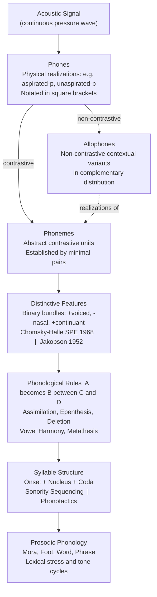

# Phonology — Sound Systems and Patterns

> [!abstract] TL;DR
> Phonology is the branch of linguistics that studies how languages organize sounds into abstract cognitive systems: it distinguishes physically realized speech segments (phones) from the contrastive mental units speakers actually perceive (phonemes), decomposes those units into binary distinctive features, expresses systematic sound alternations as context-sensitive rules (A → B / C __ D), and constrains which sound sequences a language permits via phonotactics and syllable structure. Optimality Theory (Prince & Smolensky 1993) unifies all of this under a competition among ranked universal constraints, predicting cross-linguistic typology from a single architecture. Understanding phonology explains why English speakers never consciously distinguish aspirated [pʰ] from plain [p], why Turkish suffix vowels change to match the root, and why neural tokenizers still struggle with morphophonological alternations.

---

## Intuition

**Analogy:** Imagine a city's transit network. Every vehicle physically running on the tracks is a **phone** — a concrete, measurable object. But from a commuter's perspective, what matters is not the exact vehicle number but which **route** it serves: the route-5 tram and the route-7 tram serve different stops, so they are functionally distinct — these are **phonemes**. Two different vehicle models (articulated vs. short) running the same route-5 service are interchangeable to the commuter: they are **allophones** — non-contrastive variants of the same route. The transit authority's rulebook (phonological rules) specifies when vehicles are rerouted, when routes merge, and what track configurations are physically permitted (phonotactics). Optimality Theory is the scheduling software that balances two competing pressures: the network prefers simple, unmarked configurations (MARKEDNESS constraints) but must still serve every requested stop (FAITHFULNESS constraints). Different cities rank those priorities differently — and that is why Mandarin allows no onset clusters while Polish accumulates eight consonants before a vowel.

The deeper insight: transit-monitors counting every vehicle are phoneticians; commuters who only notice missed stops are native speakers. Phonology is the science of commuter cognition.

---

## How It Works

### Core Mechanics

**From signal to phones.** The acoustic speech signal is physically continuous — a pressure wave. Phonetic analysis segments it into discrete sounds called **phones**, each described by three articulatory coordinates: *place* (where the articulators meet: bilabial, alveolar, velar), *manner* (how airflow is modified: stop, fricative, nasal, lateral), and *voicing* (whether the vocal folds vibrate). Phones are transcribed in square brackets: [pʰæt] (the English word "pat" with an aspirated initial stop).

**Establishing the phonemic inventory via minimal pairs.** Two phones are allophones of the same phoneme if and only if (a) they never contrast — no word-pair differs only in those two sounds — and (b) they are in complementary distribution — wherever one occurs the other cannot. English [pʰ] (aspirated) and [p] (plain) satisfy both: [pʰæt] "pat" vs. [spæt] "spat" — you cannot swap them to change meaning. By contrast, [pʰæt] "pat" vs. [bæt] "bat" — swapping /p/ for /b/ changes meaning — so /p/ and /b/ are distinct phonemes. The minimal pair test is the empirical cornerstone of phonemic analysis.

**Distinctive feature theory.** Each phoneme decomposes into a bundle of binary features (SPE notation, Chomsky & Halle 1968, building on Jakobson, Fant & Halle 1952). Every feature contrasts a marked value [+F] with an unmarked value [-F]:

| Phoneme | voiced | nasal | continuant | sonorant | labial |
|---------|--------|-------|------------|----------|--------|
| /p/ | - | - | - | - | + |
| /b/ | + | - | - | - | + |
| /m/ | + | + | - | + | + |
| /f/ | - | - | + | - | + |
| /v/ | + | - | + | - | + |

A **natural class** is a set of phonemes that share one or more features and behave identically under phonological rules. {/p/, /b/, /m/} is the natural class [+labial]; {/p/, /t/, /k/} is [-voiced, -continuant, -sonorant] = voiceless stops. Rules stated over natural classes are simpler and more general than rules listing individual segments — the formal economy argument for feature theory.

**Phonological rules.** A rule writes as A → B / C __ D: segment A becomes B when it occurs between context C and context D (C or D may be absent, a word boundary, or a prosodic category). Major rule types:
- *Assimilation*: a segment acquires a feature from a neighbor. Nasal place assimilation in English: /n/ → [m] / __ [+labial] (so "in place" → [ɪmˈpleɪs]).
- *Vowel harmony*: a feature propagates across an entire word. In Turkish, all vowels in a word agree in [±back]: "ev-de" (house-LOC) vs. "araba-da" (car-LOC) — the locative suffix vowel copies backness from the root.
- *Epenthesis*: a vowel or consonant is inserted to satisfy syllable structure requirements. Japanese borrows English "strike" as [sutoraiku], inserting [u] to break illegal onset clusters.
- *Dissimilation*: adjacent identical or similar sounds diverge. Latin "peregrinus" → Spanish "peregrino" (the rhotic dissimilates across the word).
- *Deletion*: a segment is removed. Final-schwa deletion in English fast speech: "going to" → "gonna."
- *Metathesis*: two segments exchange positions. Old English "brid" → Modern English "bird."

**Syllable structure and phonotactics.** A syllable has the internal structure: **Onset + Rhyme**, where **Rhyme = Nucleus + Coda**. The nucleus is the obligatory syllabic peak (usually a vowel); the onset is the pre-nuclear consonant(s); the coda is the post-nuclear consonant(s). Languages differ sharply in which positions they require or permit:
- Japanese allows only CV and CVN (nasal coda): strict NOCODA language.
- English allows complex onsets and codas: "strengths" /stɹɛŋkθs/ = C³VC⁴.

The **Sonority Sequencing Principle (SSP)** governs which consonant clusters are well-formed within a syllable: sonority must rise monotonically from onset edge to nucleus, and fall from nucleus to coda edge. The sonority hierarchy: obstruents (stops < fricatives) < nasals < liquids < glides < vowels. An onset cluster [bl] is well-formed (obstruent < liquid = rising), but [lb] is ill-formed (falling before the nucleus). Languages vary in how strictly they enforce SSP — English tolerates /st/ (stop-fricative = flat, not rising) as a marked exception.

**Onset Maximization Principle:** When syllabifying between vowels, assign as many consonants to the following onset as phonotactics permit. English "nation" /neɪʃən/ syllabifies as /neɪ.ʃən/ not /neɪʃ.ən/, maximizing the second onset.

**Resyllabification and liaison.** In French, a phrase-final consonant that is normally silent resyllabifies as the onset of a following vowel-initial word: "les amis" is pronounced [le.za.mi] — the /z/ of the plural article becomes the onset of "amis." This liaison is obligatory in careful speech and shows that syllable structure is computed over stretches longer than a single word.

**Optimality Theory.** OT (Prince & Smolensky 1993) replaces rule-ordering derivations with a constraint-ranking architecture:
1. GEN generates all logically possible output candidates from an underlying input.
2. CON is a set of ranked, violable universal constraints.
3. EVAL selects the candidate that best satisfies the constraint hierarchy — the one with the fewest highest-ranked violations.

The two constraint families:
- **MARKEDNESS** constraints penalize complex or dispreferred structures (*CODA, *COMPLEX-ONSET, NOCODA).
- **FAITHFULNESS** constraints penalize divergence between input and output (IDENT-[feature], MAX-IO "don't delete", DEP-IO "don't insert").

Different rankings of the same constraints produce different language patterns. English ranks FAITH >> *CODA (codas are allowed); Japanese ranks *CODA >> FAITH (coda consonants are deleted or cause epenthesis):

| Input /kæt/ | \*CODA | FAITH |
|---|:---:|:---:|
| ☞ kæt | * | |
| kæ | | *! |

Cross the constraint columns: the winner is the candidate that loses the comparison only on lower-ranked constraints. This tableau formalizes English. Relabeling the winner as "kæ" and ranking *CODA >> FAITH would formalize a coda-free language.

**Prosodic phonology and moraic theory.** At levels above the syllable, segments are organized into a prosodic hierarchy: mora → syllable → foot → prosodic word → phonological phrase → intonational phrase → utterance. A **mora** (μ) is the unit of phonological weight: light syllables have one mora (CV), heavy syllables have two (CVV or CVC). Weight distinctions affect stress, compensatory lengthening, and reduplication. A **foot** is a grouping of two syllables (or two moras) that determines stress placement. English uses a left-headed trochaic foot (stressed syllable first): "BEA-ver," "TA-ble." Lexical phonology (Kiparsky 1982) adds that phonological rules apply in cycles corresponding to morphological layers: level-1 rules (stress-sensitive) apply before level-2 rules (stress-insensitive), capturing why "tórcure → tórment" (stress shift) is level-1 but "tórtúre → tórtùrement" maintains the original stress.

### Flow / Architecture



---

## Key Concepts

### Secondary Level

**The phoneme as a cognitive unit.** The central puzzle of phonology is that speakers of a language do not hear what is physically there — they hear what is contrastively meaningful. American English speakers physically produce two distinct [p]-sounds: a strongly aspirated [pʰ] (a puff of air follows the release in "pin") and a plain [p] (no aspiration after the /s/ in "spin"). Speakers cannot consciously hear the difference; even trained phoneticians must learn to attend to it. Yet a speaker of Thai or Hindi immediately notices it, because in those languages aspiration is phonemic — it distinguishes words. The phoneme is therefore not an acoustic object but a cognitive category: it is what the mind's sound-system represents.

**Minimal pairs.** The classic diagnostic is the minimal pair: two words that differ in exactly one sound and in meaning. "Pat" vs. "bat" (voicing of initial consonant); "pit" vs. "pet" (vowel height); "fin" vs. "thin" (place of fricative). Each pair establishes that the differing sounds are distinct phonemes in English. Languages can be compared by their minimal-pair inventories: Mandarin has four lexical tones (mā-má-mǎ-mà = mother-hemp-horse-scold), making tone phonemic; English has no tonal minimal pairs.

**Complementary distribution and allophones.** English /l/ has two allophones: "clear" [l] before vowels ("love"), and "dark" [ɫ] before consonants and at word end ("milk," "feel"). They never occur in the same phonological context — they are in complementary distribution. Knowing one predicts the other: a phonological rule "L → [ɫ] / __ [+consonant] or word-final" captures the pattern. This rule is part of English phonology but not of French, where both l-variants can contrast.

**The International Phonetic Alphabet (IPA).** The IPA encodes the full range of human speech sounds across languages. Square brackets [ ] enclose phonetic (phone-level) transcription; slashes / / enclose phonemic transcription. The two notations carry different claims: [pʰæt] says "a physically aspirated p was produced"; /pæt/ says "the underlying phoneme sequence is /p, æ, t/ — surface realization depends on the phonological rules of the language."

### Undergraduate Level

**Feature geometry and underspecification.** Chomsky & Halle (1968) treated features as a flat set attached to each segment. Later researchers (Clements 1985, Sagey 1986) organized features into a hierarchical **feature tree**: laryngeal features (voicing, aspiration) are grouped together; place features (labial, coronal, dorsal) form their own node; manner features hang from a separate branch. This geometry explains *spreading*: assimilation rules copy a sub-tree, not individual features — nasal place assimilation spreads the entire [Place] node from a following stop to the nasal, changing its place of articulation in one operation rather than feature by feature.

**Vowel harmony in depth.** Turkish suffixes agree with root vowels in both the front/back dimension and the rounded/unrounded dimension. "Gece" (night) → "geceler" (nights) but "araba" (car) → "arabalar" (cars). The -lar/-ler alternation shows [-back] harmony: front-vowel roots attract the front suffix. The -im/-ım/-um/-üm alternation shows four-way harmony across both dimensions. The theoretical question is how the feature [±back] propagates from root to suffix across intervening material: autosegmental phonology (Goldsmith 1979) treats [±back] as a feature on a separate tier that spans the full word, with individual segments associating to it. Blocking occurs when an opaque segment (one that does not participate in harmony) breaks the association line.

**The Sonority Sequencing Principle in detail.** The sonority hierarchy is: stops (1) < fricatives (2) < nasals (3) < liquids (4) < glides (5) < vowels (6). A well-formed syllable onset must have strictly rising sonority; a well-formed coda must have strictly falling sonority. "Strong" = /stɹ/ violates SSP at the onset edge (2-1-4 is not monotonically rising), but English licenses this through a specific lexical exception for /s/. Cross-linguistically, languages that allow complex onsets systematically prefer rising-sonority clusters, as documented in Greenberg's universals and confirmed in typological databases (UPSID). SSP interacts with stress: heavy syllables (CVC) attract stress in many languages, explaining Latin stress assignment and Arabic morphophonology.

**Optimality Theory: the typological argument.** The deepest motivation for OT is not just that it replaces rules with constraints but that it predicts **typology**. If there are n constraints, there are n! possible rankings, each defining a possible human language (the Factorial Typology theorem). Conversely, any surface pattern that cannot be derived from any ranking of universal constraints is predicted to be unattested. For example: no language has a grammar that deletes a consonant in onsets but not in codas, because no ranking of universal constraints produces this outcome. This makes OT empirically falsifiable in a way that rule-ordering systems are not — and the typological predictions have largely been confirmed.

**Moraic theory and weight.** A mora (μ) is the minimal timing unit. A short vowel contributes one mora; a long vowel or diphthong contributes two; a coda consonant may or may not contribute a mora depending on the language. "Weight-by-Position" (Hayes 1989): coda consonants are moraic in languages that use weight for stress (Arabic, Classical Latin) but non-moraic in languages where only the vowel nucleus determines weight. This explains compensatory lengthening: if a coda consonant is deleted, its mora must be filled — the nucleus lengthens to fill the empty mora slot (Greek: "esnos" → "einos" with lengthening after n-deletion).

### Graduate Level

**Lexical phonology and the cycle.** Kiparsky (1982) proposed that morphological structure creates phonological domains, and rules apply cyclically within each domain before the next morphological layer is added. Level-1 morphology (stress-neutral affixes, irregular inflection) triggers level-1 phonological rules (stress shift, vowel reduction, trisyllabic shortening). Level-2 morphology (regular inflection, derivational suffixes like "-ness," "-ful") triggers level-2 rules. This explains a classic English alternation: "electric" → "electricity" (stress shifts, vowel changes — level-1 suffix -ity) vs. "electric" → "electricness" (no stress shift — level-2 suffix -ness). The Strict Cycle Condition prevents rules from applying at a level where they would derive forms not licensed by morphological structure.

**Correspondence theory and output-output faithfulness.** Standard OT posits input-output (IO) faithfulness: outputs should resemble their lexical inputs. Benua (1997) and Kenstowicz (1996) showed that some alternations are better explained by output-output (OO) faithfulness: a derived form should resemble its base form in the output. "Divinity" [dɪˈvɪnɪti] resembles "divine" [dɪˈvaɪn] in stress pattern and segmental content despite the input /diːvaɪn/ → [dɪˈvaɪn] alternation. OO-FAITH captures paradigm uniformity effects that IO-FAITH misses and predicts that related forms within a paradigm will show more convergence than unrelated borrowings.

**Harmonic serialism and Gradient Symbolic Representations.** Standard OT is parallel: the entire output is evaluated simultaneously. Harmonic Serialism (McCarthy 2000) reintroduces derivationality: each step in the derivation must increase harmony under the same constraint ranking. This captures opaque interactions — cases where a rule's environment is created or destroyed by another rule — which parallel OT handles awkwardly. A more recent development is Gradient Symbolic Representations (Smolensky & Goldrick 2016), which allows phonological features to take gradient (non-binary) values, connecting phonology to neural network representations and explaining gradient well-formedness judgments that categorical theories cannot model.

**Interface with morphology: morphophonology.** Phonological rules often apply at morpheme boundaries in ways that are not predictable from the phonology alone. English past tense: /wɑk + d/ → [wɔːkt] (final devoicing + flapping), /hʌg + d/ → [hʌgd] → [hʌgd] (no devoicing — morphological identity preservation). The analysis requires distinguishing post-lexical rules (apply blindly across word boundaries) from lexical rules (sensitive to morpheme structure). Stratal OT (Bermudez-Otero 2018) maps this onto OT's constraint-ranking architecture: different strata have different rankings, producing different outputs at each morphological layer.

---

## Python Demo

Simulate Bayesian phonotactic constraint learning. A learner hears syllables from an unknown language and infers the parameter theta = P(complex onset CC-), which encodes whether onset clusters are grammatical. The true grammar has theta = 0.35. Show how the posterior over theta tightens as the learner accumulates 20, 50, 100, and 200 syllable observations.

```python
"""
Bayesian phonotactic constraint learning.

A learner observes syllables and infers theta = P(complex onset CC-).
True grammar: theta = 0.35  (cluster onsets are moderately common).
Prior: Beta(2, 2) — weakly informative, centered at 0.5.
Conjugate update: Beta(a + k, b + n - k) after observing k/n complex-onset syllables.

Uses only numpy, matplotlib, and the standard-library math module.
"""

import math
import numpy as np
import matplotlib.pyplot as plt

# ---------------------------------------------------------------------------
# Beta PDF implemented from scratch (no scipy)
# ---------------------------------------------------------------------------
def beta_pdf(x_arr, a, b):
    """Evaluate the Beta(a, b) PDF over a numpy array x_arr in (0, 1)."""
    log_norm = math.lgamma(a) + math.lgamma(b) - math.lgamma(a + b)
    x = np.clip(x_arr, 1e-12, 1 - 1e-12)
    log_pdf = (a - 1) * np.log(x) + (b - 1) * np.log(1 - x) - log_norm
    return np.exp(log_pdf)

def credible_interval(a, b, alpha=0.05, n_grid=5000):
    """Approximate equal-tailed credible interval via numerical CDF."""
    x = np.linspace(0.0001, 0.9999, n_grid)
    pdf = beta_pdf(x, a, b)
    cdf = np.cumsum(pdf) / pdf.sum()
    lo = float(x[np.searchsorted(cdf, alpha / 2)])
    hi = float(x[np.searchsorted(cdf, 1 - alpha / 2)])
    return lo, hi

# ---------------------------------------------------------------------------
# Experiment
# ---------------------------------------------------------------------------
np.random.seed(42)

THETA_TRUE  = 0.35     # true P(complex onset CC-) in the language being learned
PRIOR_A, PRIOR_B = 2, 2  # Beta(2, 2) prior: weakly uninformative

sample_sizes = [20, 50, 100, 200]
palette      = ["#e74c3c", "#e67e22", "#27ae60", "#2980b9"]
x_grid       = np.linspace(0.001, 0.999, 500)

fig, axes = plt.subplots(2, 2, figsize=(12, 8))
fig.suptitle(
    "Bayesian Phonotactic Constraint Learning\n"
    "Posterior over theta = P(complex onset CC-)   |   True theta = 0.35",
    fontsize=13, fontweight="bold"
)

for ax, n, color in zip(axes.flat, sample_sizes, palette):
    # Generate n syllable observations from the true grammar
    data = np.random.binomial(1, THETA_TRUE, size=n)
    k = int(data.sum())               # number of complex-onset syllables observed

    # Bayesian conjugate update
    post_a = PRIOR_A + k
    post_b = PRIOR_B + (n - k)

    prior_pdf     = beta_pdf(x_grid, PRIOR_A, PRIOR_B)
    posterior_pdf = beta_pdf(x_grid, post_a, post_b)

    lo, hi       = credible_interval(post_a, post_b)
    post_mean    = post_a / (post_a + post_b)
    post_var     = post_a * post_b / ((post_a + post_b) ** 2 * (post_a + post_b + 1))
    post_std     = math.sqrt(post_var)

    # Plot
    ax.fill_between(
        x_grid, posterior_pdf,
        where=(x_grid >= lo) & (x_grid <= hi),
        alpha=0.18, color=color,
        label=f"95% CI [{lo:.2f}, {hi:.2f}]"
    )
    ax.plot(x_grid, prior_pdf,     color="gray",  lw=1.2, ls="--", alpha=0.7,
            label=f"Prior Beta({PRIOR_A},{PRIOR_B})")
    ax.plot(x_grid, posterior_pdf, color=color,   lw=2.1,
            label=f"Posterior (mean={post_mean:.3f}, sd={post_std:.3f})")
    ax.axvline(x=THETA_TRUE, color="black", lw=1.5, ls=":",
               label=f"True theta={THETA_TRUE}")

    ax.set_title(f"N = {n}  |  complex onsets observed: {k}/{n}", fontsize=10)
    ax.set_xlabel("theta = P(complex onset CC-)")
    ax.set_ylabel("Posterior density")
    ax.set_xlim(0, 1)
    ax.legend(fontsize=7.5)

plt.tight_layout()
plt.savefig("phonotactic_learning.png", dpi=150, bbox_inches="tight")
plt.show()
print("Saved: phonotactic_learning.png")
```

**What the output shows.** At N = 20 the posterior is wide and barely moves from the prior: the learner has seen too few syllables to distinguish theta = 0.35 from theta = 0.50. By N = 100 the posterior has centered tightly over 0.30–0.40 and the 95% credible interval no longer includes 0.50. At N = 200 the CI is narrow enough for the learner to confidently say "this language permits onset clusters at roughly one-third frequency." This replicates the empirical finding (Saffran, Newport & Aslin 1996; Chambers, Onishi & Fisher 2003) that infants track phonotactic statistics from as few as 60–90 minutes of exposure.

---

## Real-World Applications

**Speech recognition and phoneme models (ASR).** Hidden Markov Models — the dominant pre-deep-learning ASR architecture — define one state per phoneme and emit acoustic feature vectors from that state. The phonemic inventory of the language directly determines the model topology: an ASR system for English needs 40–44 phoneme states; one for Thai needs additional tonal states. Deep learning ASR (CTC-based wav2vec 2.0, Whisper) still implicitly learns a phonemic inventory in its latent representations, and analysis of its attention layers rediscovers classic distinctive features.

**Text-to-speech (TTS) synthesis.** High-quality TTS must apply phonological rules to convert grapheme sequences to phone sequences before acoustic synthesis. "Cats" /kæts/ and "dogs" /dɒgz/ require the phonological rule for English plural allomorphy (voicing assimilation of the suffix: [-s] after voiceless, [-z] after voiced). Tacotron 2 and similar neural TTS systems either learn this from transcribed data or use explicit phonological front-ends (Festival, flite) to pre-apply the rules.

**Cross-linguistic NLP tokenization.** Neural subword tokenizers (BPE, WordPiece) are not phonologically aware — they operate on orthography. But orthographic and phonological boundaries correlate, and languages with complex morphophonology (Turkish vowel harmony, Finnish consonant gradation) expose the tokenizer to alternating surface forms of the same morpheme, inflating vocabulary. Phonologically informed tokenizers that normalize to underlying forms before tokenization have been shown to improve downstream performance on morphologically rich languages.

**Language documentation and the IPA.** The IPA was designed specifically for phonological fieldwork: a trained linguist can use it to transcribe any human language without prior knowledge of its sound system. UNESCO uses IPA transcription as the standard for endangered language documentation (ELDP). The UPSID database (Maddieson 1984) encodes the phonemic inventories of 451 languages in IPA, enabling typological generalizations such as: all languages have at least one stop, and no language has more fricatives than stops.

---

## Common Pitfalls

- **Confusing phones with phonemes.** A common beginner error is writing /pʰ/ as a phoneme in an English phonemic transcription. The aspiration is a phonetic detail — an allophonic property of /p/ in onset position — not an independent phoneme. Phonemic transcription should write /p/ alone; phonetic transcription may specify [pʰ]. The distinction matters practically: speech recognition language models built on phonemic transcriptions must not double-encode allophonic variation.
- **Treating allophones as random variation.** Students often describe allophones as "optional." They are not: they are predictable and obligatory. An English speaker physically cannot produce a plain [p] at the start of a stressed syllable without it sounding foreign-accented. The complementary distribution is a grammatical fact, not a stylistic choice.
- **Over-applying the Sonority Sequencing Principle.** SSP is a statistical universal, not an inviolable law. English /st/ clusters violate it at the onset edge, as do /sn/, /sm/, /sl/. The correct analysis is that English has a lexical exception licensing an initial /s/ before a stop or nasal — not that SSP is wrong. Applying SSP mechanically to English yields incorrect syllabifications.
- **Misreading OT tableaux: the "!" convention.** An exclamation mark (!) in an OT tableau marks the fatal violation — the first (highest-ranked) constraint on which a candidate loses. Students sometimes read "!" as meaning "this candidate does worst overall." The correct reading is "this candidate is eliminated at this constraint." A candidate may accumulate more total violations than the winner yet survive longer in the competition if its violations are all on lower-ranked constraints.
- **Conflating underlying and surface forms.** Optimality Theory (and all generative phonology) distinguishes the **underlying representation** (UR, stored in the lexicon) from the **surface representation** (SR, what is actually pronounced). The UR of the English past tense suffix is /d/; the SR is [t] after voiceless consonants ("walked"), [d] after voiced consonants ("jogged"), [ɪd] after alveolar stops ("wanted"). Writing the UR as /t/ would fail to capture the generalization.
- **Ignoring prosodic domains.** Post-lexical rules (liaison, sandhi) apply across word boundaries only within specific prosodic domains. French liaison applies within the phonological phrase but not across phrase boundaries. Applying it categorically without tracking domain structure produces ungrammatical outputs (hypercorrection in L2 French is a classic manifestation of this error).

---

## Related Concepts

- [[Language_and_the_Brain]] — Broca's area drives phonological sequencing and phonological working memory (the "inner speech" loop); damage to the left perisylvian cortex produces phonemic paraphasias (substituting one phoneme for another), showing that the phonemic level is a neurally distinct representational tier.
- [[Language_Socialization_and_Acquisition]] — Children acquire the phonological rules and phonotactic constraints of their native language during the first year of life, before they acquire any morphology or syntax; the Critical Period Hypothesis has its earliest closure for phonology (native-like accent is rarely acquired after puberty).
- [[Language_and_Culture]] — The Sapir-Whorf debate intersects with phonology via the question of whether phonological categories are universal (Jakobson's universals) or language-specific (Sapir's claim that phonemes are language-internal constructs); the answer is both: features are universal, but which contrasts are phonemic is language-particular.
- [[Semiotics_and_Symbolic_Communication]] — Saussure's foundational claim that the linguistic sign is arbitrary applies specifically at the phonological level: the sounds /k-æ-t/ have no natural connection to the furry animal they denote. Phonology operationalizes the "signifier" half of the Saussurean sign.
- [[Tokenization]] — Subword tokenization algorithms (BPE, WordPiece) operate on orthographic, not phonological, boundaries; phonologically informed tokenization is an active research direction for morphologically complex languages where surface and underlying forms diverge significantly.

---

## Review Questions

### Secondary

1. English speakers cannot hear the difference between aspirated [pʰ] (as in "pin") and plain [p] (as in "spin"), yet speakers of Hindi notice it immediately. Why? What does this tell us about what phonological knowledge actually is?
2. Identify a minimal pair in any language you know. What phonemic contrast does it establish? Could those same two sounds be allophones in another language?
3. English "dogs" ends in [z] but "cats" ends in [s], and "wanted" ends in [ɪd]. What is the underlying phoneme of the plural/past-tense suffix, and what phonological rule is at work in each case?

### Undergraduate

1. A linguist documents a language in which the sounds [d] and [ɾ] (a flap) never appear in the same environment: [d] occurs at the start of words and after consonants, [ɾ] occurs between vowels. Propose an analysis: are they allophones or separate phonemes? Write the phonological rule. Now describe one piece of additional evidence that could falsify your analysis.
2. Turkish vowel harmony extends [±back] from the root to all suffixes, but "foreign" loanwords sometimes violate it ("alkol" keeps the back vowel through the word despite the first vowel being front). How does Optimality Theory handle opaque inputs like this, and what constraint ranking would you propose? Compare this to how a rule-based derivation would handle it.
3. Apply the Sonority Sequencing Principle to the English word "splint." Identify any violations. Are they word-internal violations or do they fall at the word edge? What theoretical mechanism licenses them, and does the same mechanism apply cross-linguistically?

### Graduate

1. Kiparsky's Strict Cycle Condition predicts that certain phonological alternations should be blocked in underived environments (environments not created by current-cycle morphology). Design an experiment using nonce words that would test whether English speakers obey the Strict Cycle Condition for a phonological rule of your choice (e.g., trisyllabic shortening or velar softening). What result would support the cyclic account, and what result would argue for a constraint-only OT analysis without cycles?
2. Harmonic Serialism (McCarthy 2000) and standard parallel OT both use the same constraint set but differ in whether evaluation is serial or parallel. Describe an opaque phonological interaction (feeding or counterfeeding opacity) in any language. Show that parallel OT fails to derive the attested surface form without stipulation, then sketch how Harmonic Serialism derives it step by step. What does this tell us about the architecture of the phonological computation?
3. Gradient Symbolic Representations (Smolensky & Goldrick 2016) allow phonological features to take non-integer activation values (e.g., a segment may be 0.7 [+voiced] and 0.3 [-voiced]). What empirical phenomena motivate moving from categorical to gradient representations? How does this connect phonological theory to the learned representations of transformer-based speech models like wav2vec 2.0? What constraints must a gradient account satisfy to remain a *linguistic* theory rather than simply a neural network description?

---

## Sources

- [Chomsky, N. & Halle, M. (1968). *The Sound Pattern of English*. MIT Press.](https://mitpress.mit.edu/9780262530972/the-sound-pattern-of-english/)
- [Prince, A. & Smolensky, P. (1993/2004). *Optimality Theory: Constraint Interaction in Generative Grammar*. Blackwell.](https://roa.rutgers.edu/files/537-0802/537-0802-PRINCE-0-0.PDF)
- [Hayes, B. (2009). *Introductory Phonology*. Wiley-Blackwell.](https://www.wiley.com/en-us/Introductory+Phonology-p-9781405190251)
- [Goldsmith, J. (1979). Autosegmental Phonology. PhD Dissertation, MIT.](https://www.cambridge.org/core/journals/language/article/abs/autosegmental-phonology-by-john-a-goldsmith-new-york-garland-1979-pp-ix-331/1A5C67A91D7CE2B8E7BB6BB3B6FEA8DE)
- [Saffran, J. R., Newport, E. L. & Aslin, R. N. (1996). Word segmentation: The role of distributional cues. *Journal of Memory and Language*, 35, 606–621.](https://doi.org/10.1006/jmla.1996.0032)
- [McCarthy, J. J. (2007). *A Thematic Guide to Optimality Theory*. Cambridge University Press.](https://www.cambridge.org/core/books/thematic-guide-to-optimality-theory/3B0ADE2D10B79E37DA91E7C9A9A8D3E5)
- [Optimality Theory — Prince & Smolensky original ROA manuscript](http://ruccs.rutgers.edu/images/personal-alan-prince/gamma/oiel.pdf)

---

#Linguistics #FoundationsPhonetics #Phonology
