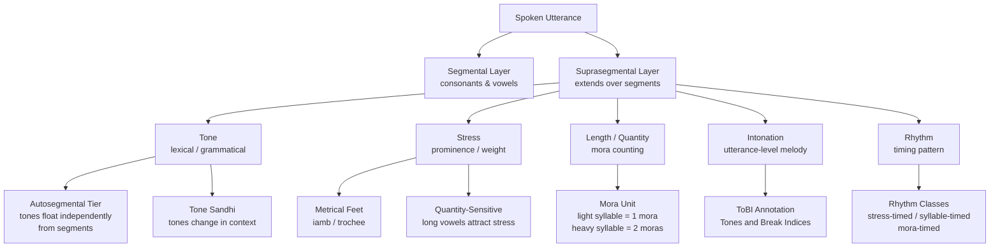

> [!abstract] TL;DR
> Suprasegmentals are phonological features — tone, stress, length, intonation, and rhythm — that operate above the level of individual consonants and vowels; they are the "musical layer" of language that determines meaning, pragmatic intent, and emotional color beyond the words themselves.

---

## Intuition

**Analogy:** Imagine reading a sentence of sheet music. The individual notes on the staff are the consonants and vowels — the segments. But pitch markings, tempo indications, crescendo/decrescendo hairpins, and slur marks all operate *across* those notes. You could play every note perfectly and still perform the piece wrong if you ignored those overlay markings. Suprasegmentals are exactly those overlay markings on speech.

In English, the word *record* is spelled identically whether it means a vinyl disc (noun, stress on the first syllable: RE-cord) or the act of capturing audio (verb, stress on the second: re-CORD). The consonants and vowels are the same; the suprasegmental feature of stress carries the entire semantic distinction. Multiply this effect across tonal languages where pitch itself is part of the word, and you grasp why linguists treat the suprasegmental tier as co-equal to the segmental tier.

---

## How It Works



---

## Key Concepts

### Secondary Level

**What is a suprasegmental?**
A *suprasegmental* (also called a *prosodic feature*) is any phonological property that spans more than one segment. The word "segment" refers to an individual sound unit — a consonant or vowel. Suprasegmentals are layered on top of the segmental string; they cannot be described by looking at a single sound in isolation.

The three universally recognized suprasegmentals are:
1. **Tone** — variation in fundamental frequency (F0) that signals lexical or grammatical meaning.
2. **Stress** — the prominence given to one syllable over others within a word or phrase.
3. **Length (quantity)** — whether a vowel or consonant is phonemically short or long.

**Pitch vs. Tone vs. Intonation**
These three terms are often confused:
- *Pitch* is a perceptual property of sound — how high or low something sounds.
- *Tone* is the linguistically meaningful use of pitch to distinguish words (lexical tone) or grammatical categories.
- *Intonation* is the melodic contour of an entire utterance, signaling pragmatic meaning (question vs. statement, new vs. given information) rather than word identity.

**Stress in everyday English**
English has contrastive word stress, meaning the placement of stress changes meaning:
- *IN-sult* (noun) vs. *in-SULT* (verb)
- *OB-ject* (noun) vs. *ob-JECT* (verb)
- *PER-mit* (noun) vs. *per-MIT* (verb)

Primary stress is the most prominent syllable; secondary stress is intermediate; unstressed syllables are reduced (often to the schwa /ə/).

**Basic intonation patterns**
Even without knowing linguistics, native English speakers produce:
- A **falling tone** at the end of statements ("She went home.")
- A **rising tone** at the end of yes/no questions ("She went home?")
- A **rise-fall** on exclamations for emphasis
Children acquire these patterns before age 2 — prosody is learned earlier than most vocabulary.

---

### Undergraduate Level

**Autosegmental phonology and tone**
In the 1970s, John Goldsmith proposed that tones should be analyzed on a separate *autosegmental tier* — a parallel track of representation that can associate to vowels or consonants independently. This explains phenomena like:
- **Tone spread**: one tone spreading across multiple vowels ("spreading right")
- **Floating tones**: tones that exist in the phonological representation but are not associated with any segment at the surface level; they trigger sandhi effects on neighboring syllables
- **Depressor consonants**: voiced consonants that lower the pitch of associated tones in Bantu languages

Evidence for autosegmental representation includes tone sandhi in Mandarin Chinese: the third tone (falling-rising ˩˧) becomes a second tone (rising ˧˥) before another third tone. This cannot be captured by rules referring to single segments; it requires a tone tier where tones interact.

**Major tone language families**
| Language | Tone Count | Tone Type |
|----------|------------|-----------|
| Mandarin Chinese | 4 lexical + 1 neutral | Level, rising, falling-rising, falling |
| Cantonese | 6 (sometimes 9 with checked tones) | Highly contrastive |
| Vietnamese | 6 | Includes glottalization, creakiness |
| Yoruba | 3 levels (H, M, L) | Level tones + downstep |
| Thai | 5 | Mix of level and contour |
| Punjabi | 3 | Tonal contrasts from breathy consonants |

Note: Tone languages are not a minority — approximately 70% of the world's languages are tonal. Indo-European languages (with some exceptions like Swedish, Norwegian, Punjabi, Serbo-Croatian) are non-tonal, which is why this feature is often underestimated by English-speaking linguists.

**Metrical phonology and stress systems**
Metrical phonology (Liberman & Prince 1977; Hayes 1995) accounts for stress by organizing syllables into rhythmic units called *metrical feet*. The two primary foot types are:
- **Trochee**: strong-weak (S-W) — stress on the first syllable; e.g., English "BA-by", "TA-ble"
- **Iamb**: weak-strong (W-S) — stress on the second syllable; e.g., French "ami", English "aLIVE"

Languages show two main stress system types:
- **Fixed stress**: stress always falls on the same syllable position relative to the word edge. Polish is consistently penultimate (second-to-last); Czech and Hungarian are initial.
- **Quantity-sensitive stress**: syllable weight (whether a syllable is heavy or light) determines where stress falls. A heavy syllable has a long vowel or a coda consonant; a light syllable is open and has a short vowel. Latin, Arabic, and Classical Greek are quantity-sensitive.

The **stress clash** occurs when two stressed syllables are adjacent ("thirtéen mén"); English resolves it by shifting one stress ("THÍRteen men"). The **stress lapse** occurs when too many unstressed syllables occur in a row, creating a flat, hard-to-parse sequence.

**Length and the mora**
The *mora* (μ) is the unit of timing smaller than a syllable:
- A light syllable (V, short vowel + no coda) = 1 mora
- A heavy syllable (VV, long vowel; or VC, vowel + coda) = 2 moras

Languages differ in their rhythmic basis:
| Rhythm type | Approximate isochrony | Examples |
|-------------|----------------------|---------|
| Stress-timed | Stressed syllables recur at equal intervals | English, German, Dutch, Russian |
| Syllable-timed | Each syllable has equal duration | French, Spanish, Italian, Mandarin |
| Mora-timed | Each mora has equal duration | Japanese, Tamil |

Finnish and Japanese exploit vowel length phonemically: Japanese *kito* ("prayer") vs. *kiito* ("silk thread"); Finnish *tuli* ("fire") vs. *tuuli* ("wind") vs. *tuuli* — each additional mora is a distinct word. *Compensatory lengthening* is a cross-linguistic tendency: when a coda consonant is deleted, the preceding vowel lengthens to preserve the mora count of the syllable.

**ToBI annotation**
ToBI (Tones and Break Indices) is the standard annotation system for English intonation developed in the 1990s. It uses:
- **Pitch accents** (H*, L*, H+L*, L+H*, etc.) to mark tonal targets on prominent syllables
- **Boundary tones** (H%, L%) to mark the pitch at utterance boundaries
- **Break indices** (0–4) to indicate the degree of prosodic boundary between words

For example, a simple yes/no question like "Are you coming?" receives a rising nuclear pitch accent L+H* followed by a high boundary tone H%.

---

### Graduate Level

**Autosegmental Metrical (AM) theory**
The dominant generative framework for intonation is Autosegmental-Metrical (AM) phonology (Pierrehumbert 1980; Ladd 1996). Rather than describing intonation as a continuous F0 curve, AM theory analyzes it as a sequence of discrete tonal targets (H and L) aligned with metrically prominent syllables. The phonetic F0 contour results from interpolation between these targets.

Key AM concepts:
- **Nuclear pitch accent**: the final, most prominent accent in an intonational phrase — it has the greatest perceptual weight
- **Downstep** (! in notation): a categorical lowering of the H tone relative to the previous H, common in African and some Asian languages; creates the impression of a gradually declining baseline
- **Upstep** (the reverse, rarer): found in Igbo
- **Register**: the overall pitch height range of a speaker; can be independently scaled up for emphasis or whispered speech

**Tonal geometry and underspecification**
Tonal geometries (modeled on Feature Geometry for segments) specify which tonal features can spread, delete, or be copied. Underspecification theory holds that default tones are not represented underlyingly — they are supplied by rules. For instance, Yoruba mid tone may be analyzed as underspecified, spreading from adjacent tones or inserted by default.

**Prosodic hierarchy**
Within Prosodic Morphology (Nespor & Vogel 1986), prosodic constituents form a strict hierarchy:
```
Utterance (U)
  Intonational Phrase (IP)
    Phonological Phrase (PPh)
      Prosodic Word (PW)
        Foot (Ft)
          Syllable (σ)
            Mora (μ)
              Segment
```
Each level has its own phonological rules. For instance, resyllabification (linking a word-final consonant to the next word's onset: "an apple" → [ə.næ.pəl]) occurs at the phonological phrase level; certain sandhi rules apply only within the prosodic word.

**OT approaches to stress**
Optimality Theory (Prince & Smolensky 1993) reframes stress assignment as constraint interaction. Universal constraints like PARSE-σ (every syllable must belong to a metrical foot), FOOT-FORM-TR (feet are trochees), ALIGN-HEAD-R (the head foot is at the right edge), and WSP (weight-sensitive stress: heavy syllables are stressed) interact — their ranking varies cross-linguistically, yielding different surface patterns. This architecture correctly predicts that the same constraint in different languages produces different outcomes depending on what it outranks.

**Rhythm metrics and the nPVI**
The isochrony hypothesis — that stressed intervals (in stress-timed languages) or syllable intervals (in syllable-timed languages) are equal in duration — has been largely falsified by acoustic measurements. Yet rhythmic differences are perceptually real. The *normalized Pairwise Variability Index* (nPVI) quantifies durational variability in a speech stream:

$$\text{nPVI} = \frac{100}{m-1} \sum_{k=1}^{m-1} \left| \frac{d_k - d_{k+1}}{(d_k + d_{k+1})/2} \right|$$

where $d_k$ is the duration of the $k$-th vocalic interval. Languages cluster empirically: English nPVI ~60 (high variability, stress-timed); French nPVI ~40 (low variability, syllable-timed). This provides an acoustic correlate for the typological rhythm classes.

**Prosody and autism spectrum**
Research in clinical linguistics shows that prosodic atypicality is one of the most consistent features of autism spectrum condition. Individuals may speak with flat, monotone intonation (reduced F0 range), with unusual stress placement, or with a "foreign accent" effect — applying stress and intonation patterns that do not match the ambient language. This suggests that prosodic acquisition involves separate neural systems for tone, rhythm, and pragmatic inference, and that these systems can be selectively impaired.

**Prosody and emotional paralinguistics**
Cross-cultural studies (Banse & Scherer 1996; Laukka et al. 2013) find that both production and perception of emotional prosody show pan-cultural consistency for basic emotions (fear, anger, sadness, joy, disgust) — suggesting partial universality. However, cultural norms shape which emotions are expressed, how intensely, and in what social contexts. Acoustic correlates include:
- **Fear**: high F0, wide F0 range, fast speech rate, breathy voice
- **Anger**: high F0, wide range, loud, tense voice quality
- **Sadness**: low F0, narrow range, slow rate, creaky voice
- **Joy/happiness**: high F0, upswings, fast rate, modal voice

---

## Python Demo

```python
import numpy as np
import matplotlib.pyplot as plt

# Model F0 pitch contours for 4 pragmatic functions over a 3-word sentence.
# Time axis: 0–1.0 s; F0 range realistic for adult speech (~80–300 Hz).
# Piecewise linear interpolation from (time, F0) anchor points.

def piecewise_f0(anchors, t):
    """Interpolate F0 values from (time, Hz) anchors."""
    ts, fs = zip(*anchors)
    return np.interp(t, ts, fs)

t = np.linspace(0.0, 1.0, 300)

# 1. Neutral statement — steady then falling at the end
neutral = piecewise_f0(
    [(0.0, 185), (0.15, 183), (0.45, 165), (0.70, 140), (0.90, 115), (1.0, 100)], t
)

# 2. Yes/No question — slight dip mid-utterance, then sharp final rise
yn_question = piecewise_f0(
    [(0.0, 175), (0.25, 172), (0.55, 158), (0.75, 168), (0.90, 205), (1.0, 252)], t
)

# 3. List-final item — falls all the way to a low boundary tone
list_final = piecewise_f0(
    [(0.0, 168), (0.25, 162), (0.50, 148), (0.72, 118), (0.90, 92), (1.0, 82)], t
)

# 4. Surprised exclamation — starts high, wide excursion, stays elevated
surprised = piecewise_f0(
    [(0.0, 255), (0.12, 285), (0.30, 300), (0.50, 278), (0.72, 248), (0.90, 225), (1.0, 210)], t
)

contours = [neutral, yn_question, list_final, surprised]
titles = [
    "Neutral Statement (falling)",
    "Yes/No Question (final rise)",
    "List-Final Item (low boundary)",
    "Surprised Exclamation (high, wide)"
]
colors = ["steelblue", "darkorange", "forestgreen", "crimson"]

fig, axes = plt.subplots(2, 2, figsize=(11, 6.5), sharex=True, sharey=True)

for ax, f0, title, color in zip(axes.flat, contours, titles, colors):
    ax.plot(t, f0, color=color, linewidth=2.5)
    ax.fill_between(t, f0, 75, alpha=0.12, color=color)
    ax.axhline(100, color="gray", linewidth=0.7, linestyle="--", alpha=0.5, label="100 Hz")
    ax.axhline(200, color="gray", linewidth=0.7, linestyle="--", alpha=0.5, label="200 Hz")
    # Mark word boundaries at roughly 1/3 and 2/3 of the utterance
    for boundary in [0.33, 0.66]:
        ax.axvline(boundary, color="black", linewidth=0.6, linestyle=":", alpha=0.4)
    ax.set_title(title, fontsize=10, fontweight="bold")
    ax.set_ylim(75, 320)
    ax.set_yticks([100, 150, 200, 250, 300])
    ax.set_ylabel("F0 (Hz)", fontsize=9)
    ax.set_xlabel("Time (s)", fontsize=9)
    ax.grid(True, alpha=0.25)

fig.suptitle("Piecewise-Linear F0 Contours — Four Pragmatic Functions", fontsize=13, fontweight="bold")
plt.tight_layout()
plt.savefig("prosody_f0_contours.png", dpi=150, bbox_inches="tight")
plt.show()
```

The output shows four panels. The neutral statement traces a gentle decline from ~185 Hz to 100 Hz. The yes/no question dips slightly mid-utterance then rises sharply to ~250 Hz at the final boundary. The list-final item falls steeply to a low boundary at ~82 Hz, signaling "more items follow." The surprised exclamation occupies the top of the F0 register and stays there — a wide, high pitch range is the acoustic correlate of heightened arousal and surprise across languages.

---

## Real-World Applications

**Text-to-Speech synthesis (TTS)**
Modern neural TTS systems such as Tacotron 2 and FastSpeech 2 must generate naturalistic prosody to avoid the "robotic" quality of early synthesis. They learn to predict F0 contours, phoneme durations, and energy envelopes as part of the acoustic model. Without accurate prosody prediction, even phonetically perfect synthesis sounds unnatural. Systems like Google Wavenet and Amazon Polly use prosody transfer and SSML (Speech Synthesis Markup Language) tags to let users control emphasis, rate, and pitch. See [[Prosody_and_Expressive_TTS]] for the engineering details.

**Automatic Speech Recognition (ASR)**
Prosodic cues are used in ASR post-processing for punctuation prediction, sentence boundary detection, and disfluency handling. A rise in F0 before a pause often signals a question; a fall and pause signals a sentence-final boundary. Without prosodic segmentation, ASR transcripts lack punctuation, making downstream NLP tasks harder.

**Language learning**
Tonal languages present a uniquely challenging learning target for non-native speakers. A Mandarin learner who masters all consonants and vowels but ignores tone will produce systematic misunderstandings: *ma1* (妈 "mother"), *ma2* (麻 "hemp"), *ma3* (马 "horse"), *ma4* (骂 "scold"), *ma5* (吗, question particle) are five distinct morphemes in the same segmental form. Prosody-aware pronunciation training is essential for tonal language learners.

**Forensic linguistics**
Prosodic features — particularly speech rate, pitch range, and rhythm — are used as speaker-characterizing features in forensic speaker comparison. Pathological prosody (flat intonation, atypical stress, unusual rhythm) is a clinical diagnostic criterion in autism, Parkinson's disease, and certain schizophrenia subtypes.

**Poetry and metrics**
The study of poetic meter is applied prosody. English iambic pentameter (five iambic feet per line: w-S w-S w-S w-S w-S) is a deliberate manipulation of the language's default trochaic and iambic stress patterns for aesthetic effect. Violations of the expected meter — a stressed syllable where a weak one is expected — create the tension and emphasis that make poetry memorable.

---

## Common Pitfalls

- **Conflating pitch and tone** — Pitch is a continuous acoustic property; tone is a discrete linguistic category. A speaker's F0 varies continuously throughout an utterance, but listeners categorize tones discretely. Treating raw F0 as equivalent to tone misses the categorical perception that native speakers perform.

- **The "tone language = hard" misconception** — English speakers often believe tone languages are exotic or exceptionally difficult. In reality, most of the world's population grows up speaking a tonal language. The difficulty is specific to adult learners whose phonological system does not yet use pitch lexically.

- **Applying English intonation universally** — English rising intonation on questions is not universal. In some languages (e.g., Lakota, many African languages with lexical tone), yes/no questions are marked by particles or morphology, not intonation. Assuming universal question-rise is a common cross-linguistic error.

- **Treating the stress-timed / syllable-timed distinction as binary** — It is a typological tendency, not a strict binary. Languages exist on a continuum of rhythmic variability (quantified by nPVI), and single languages can show different rhythmic profiles across speaking styles, registers, and rates.

- **Ignoring tonal sandhi in NLP pipelines** — Tonal sandhi (e.g., Mandarin tone 3 + tone 3 → tone 2 + tone 3) means that the surface tone of a morpheme depends on context. NLP systems that treat tone as a static morpheme-level feature will mislabel sandhi contexts.

- **Overgeneralizing autosegmental "floating tones"** — Floating tones are a powerful theoretical tool, but postulating them where no phonological evidence exists leads to overly abstract analyses. The evidence for a floating tone should include both underlying alternations and phonological behavior (e.g., triggering downstep on a following syllable).

---

## Related Concepts

- [[Language_and_Thought]] — Prosody is the interface between phonology and pragmatics; the Sapir-Whorf question extends to whether tonal systems shape speakers' perception of pitch categories.
- [[Language_Development]] — Children acquire prosodic contours (especially intonation) before segmental phonology; bootstrapping theory proposes that prosodic cues help infants segment the speech stream into words and phrases.
- [[Emotion_Theories]] — Prosodic features (F0 range, speech rate, voice quality) are the primary acoustic channel through which emotion is communicated; universal vs. culture-specific emotional prosody maps onto debates in emotion theory.
- [[Fourier_Transform]] — Fundamental frequency (F0), the acoustic correlate of pitch, is extracted from speech via pitch-detection algorithms that operate on the frequency-domain representation of the audio signal; the Fourier Transform is the mathematical foundation of spectral speech analysis.
- [[Prosody_and_Expressive_TTS]] — Engineering systems that synthesize natural prosody require explicit models of F0 contours, duration, and energy; reference encoder architectures learn prosodic style embeddings from speech.

---

## Review Questions

### Secondary

1. A speaker says "You're going to the party" as a flat statement, then says the same words with a rising pitch at the end. What changed, and what does it communicate?
2. In English, *content* has two different stress patterns depending on its part of speech. Identify them and explain what suprasegmental feature is doing the work.
3. Why do linguists say that languages can be roughly classified as "stress-timed," "syllable-timed," or "mora-timed"? Give one example of each.

### Undergraduate

1. Explain the difference between lexical tone and intonation. Why is it problematic to say that Chinese is a "tonal language" while English "uses intonation" as if these were mutually exclusive categories?
2. What is a metrical foot in phonology, and how does the distinction between trochees and iambs help explain why English stress differs from French stress? Give a concrete lexical example.
3. A Mandarin speaker says tone 3 + tone 3 in sequence. What phonological process occurs, and what does this phenomenon argue for in terms of theoretical phonology (specifically regarding the autosegmental tier)?

### Graduate

1. Autosegmental Metrical (AM) theory represents intonation as sequences of H and L tones aligned with metrically prominent positions rather than as a continuous F0 curve. What empirical evidence supports this discrete-target analysis over a purely phonetic interpolation account?
2. The nPVI was proposed as an acoustic metric for rhythm typology. What are its conceptual advantages over the original isochrony hypothesis, and what are its known limitations when applied cross-linguistically?
3. OT accounts of stress derive different surface patterns from the same universal constraints through re-ranking. Construct a simple tableau showing how FOOT-FORM-TR ranked above ALIGN-HEAD-R yields initial stress, while the reverse ranking yields final stress — then discuss what evidence would distinguish the two grammars in a new language.

---

## Sources

- [Goldsmith, J. A. (1976). Autosegmental phonology. MIT doctoral dissertation.](https://www.semanticscholar.org/paper/Autosegmental-phonology-Goldsmith/e1a12eedbe0b9a40e7c3e2082f72073ac9c90e87)
- [Hayes, B. (1995). Metrical Stress Theory. University of Chicago Press.](https://press.uchicago.edu/ucp/books/book/chicago/M/bo3631760.html)
- [Ladd, D. R. (2008). Intonational Phonology (2nd ed.). Cambridge University Press.](https://www.cambridge.org/core/books/intonational-phonology/E33B2E04D2B98D36CD5F56AC8E84DD9A)
- [Nespor, M., & Vogel, I. (1986). Prosodic Phonology. Foris Publications.](https://www.degruyter.com/document/doi/10.1515/9783110977790/html)
- [Ramus, F., Nespor, M., & Mehler, J. (1999). Correlates of linguistic rhythm in the speech signal. Cognition, 73(3), 265–292.](https://www.sciencedirect.com/science/article/pii/S0010027799000529)
- [Beckman, M. E., & Ayers, G. M. (1997). Guidelines for ToBI labelling. Ohio State University.](https://kb.osu.edu/handle/1811/36494)
- [Laukka, P., et al. (2013). Universal and culture-specific factors in the recognition and performance of musical affect. Emotion, 13(3), 434–449.](https://psycnet.apa.org/record/2013-03226-001)
- [Yip, M. (2002). Tone. Cambridge University Press.](https://www.cambridge.org/core/books/tone/13EC4CF6B11A2B977CEC64DB11B95C18)

---

#Linguistics #FoundationsPhonetics #Prosody
