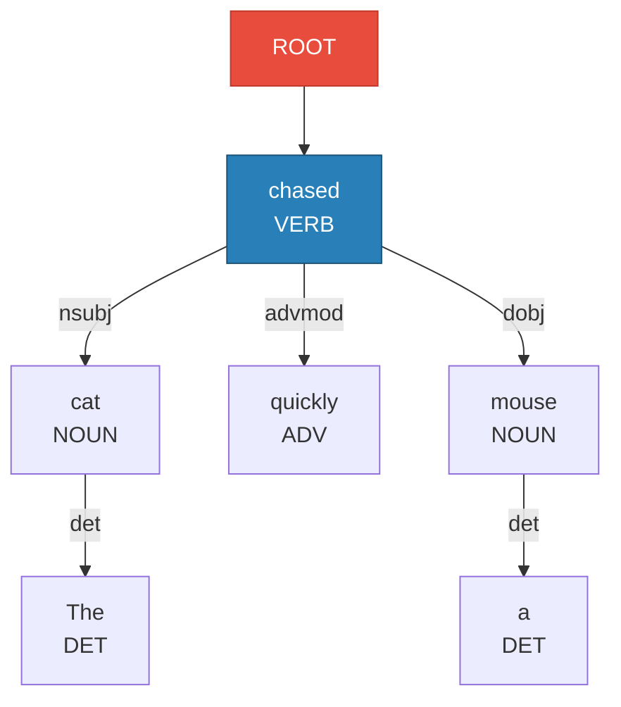
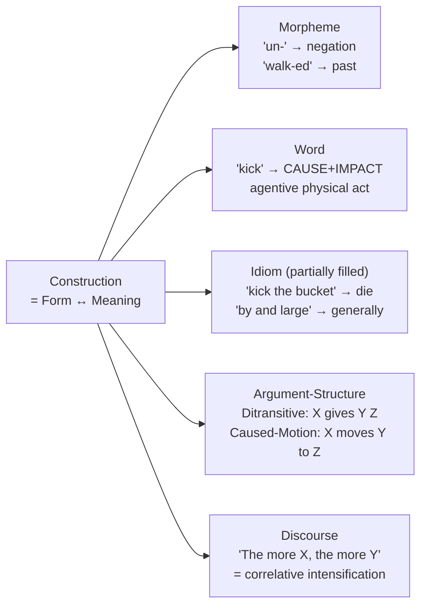

# Dependency Grammar and Construction Grammar

> [!abstract] TL;DR
> Dependency Grammar (Tesnière, 1959) represents syntax as pairwise head-dependent relations between words — no phrase nodes, just arcs. Construction Grammar (Fillmore, Goldberg, Croft) goes further: it treats every grammatical unit, from morphemes to discourse patterns, as a **construction** — an indivisible pairing of form and meaning. Together they underpin modern NLP parsers, cross-lingual annotation standards (Universal Dependencies), and usage-based theories of language acquisition.

---

## Intuition

**Analogy:** Think of a sentence as a solar system rather than a family tree of boxes. In a family-tree diagram (phrase structure), you draw boxes inside boxes: [NP [Det "the"] [N "cat"]] sits inside [S [NP …] [VP …]]. In a solar system (dependency grammar), every word is a planet orbiting a heavier body — the verb is the sun, nouns orbit it directly, determiners orbit their nouns. No empty boxes, no intermediate nodes: just gravitational pulls.

Construction Grammar then says: the shape of that solar system is not just determined by atomic words and universal rules. Some solar systems have a special configuration — the "caused-motion" orbit — that adds meaning all by itself, even if the verb has never appeared in that orbit before ("She sneezed the napkin off the table"). The **pattern** is a meaningful unit, not just a container for words.

---

## How It Works

### Dependency Grammar: Mechanics

Lucien Tesnière (1959, *Eléments de syntaxe structurale*) proposed that every sentence has a **stemma** — a tree where:

1. Exactly one word is the **root** (usually the finite verb).
2. Every other word is a **dependent** with exactly one **head**.
3. A directed arc runs from head to dependent, labelled with a **dependency relation** (subject, object, modifier, etc.).
4. No separate phrase nodes (NP, VP) exist.

**Projectivity:** A tree is *projective* if every arc's span is contiguous — i.e., if word $i$ governs word $j$, all words between them are also in $i$'s subtree. Most English sentences are projective. Languages with freer word order (Czech, German V2 clauses) commonly produce *non-projective* trees where arcs cross.



**Universal Dependencies (UD):** The UD project (Nivre et al., 2016) standardised ~40 dependency relations across 100+ languages, enabling cross-lingual transfer. Core relations:

| Relation | Abbrev | Example |
|----------|--------|---------|
| Nominal subject | `nsubj` | *The **cat** chased* |
| Direct object | `obj` | *chased the **mouse*** |
| Adjectival modifier | `amod` | *the **quick** fox* |
| Adverbial modifier | `advmod` | ***quickly** chased* |
| Determiner | `det` | ***the** cat* |
| Clausal complement | `ccomp` | *said **that he left*** |
| Prepositional modifier | `obl` | *ran **through the field*** |

### Construction Grammar: Mechanics

Charles Fillmore (Berkeley CxG), Adele Goldberg (Cognitive CxG, 1995), and William Croft (Radical CxG) converged on a single thesis: **the fundamental unit of language is the construction**, defined as a conventionalised pairing of form (syntactic/phonological) and function (semantic/pragmatic/discourse).



**Key Goldberg insight — constructions license non-canonical verbs:**
> *She sneezed the napkin off the table.*

"Sneeze" is intransitive — it takes no object. Yet this sentence is grammatical. Why? The **caused-motion construction** [SUBJ VERB OBJ OBLIQUE] adds a caused-motion meaning by itself. The construction can override or augment the verb's own argument frame. This proves that constructions have independent semantic content — they are not just verb projections.

**Difference from generative grammar:**
- Generative (Chomsky): grammar = a small set of universal rules + a lexicon; idioms are stored exceptions.
- CxG: grammar = a network of constructions at all levels of specificity; there is no hard separation between rules and exceptions. The "rule" for passive and the idiom "kick the bucket" are both constructions, differing only in how open their slots are.

---

## Key Concepts

### Secondary Level

**Q: What does it mean to say a verb "governs" other words?**

In a sentence, not all words are equal. The verb is the boss: it determines how many participants there are and what roles they play. "Sleep" needs just a sleeper; "give" needs a giver, a receiver, and a gift. The dependency grammar formalises this by drawing an arrow from the verb (head) to each participant (dependent). Remove the verb and the sentence collapses; remove an adjective and the sentence still makes sense. Heads are obligatory; many dependents are optional.

**Q: What is a construction in everyday terms?**

A construction is a frozen pattern you learn as a whole unit, not word-by-word. "The more you practise, the better you get" — you understand this because you know the *The more X, the more Y* template, not because you computed it from scratch. Children learn such patterns from exposure before they learn the underlying rules. CxG claims ALL of grammar works this way.

### Undergraduate Level

**Dependency Relations in detail:**

The Universal Dependencies tagset distinguishes *core* arguments (nsubj, obj, iobj — required by the verb's valency), *oblique* arguments (obl — optional locative/temporal/instrumental), and *modifiers* (amod, advmod, acl — adjuncts). Understanding the cline from core to adjunct is essential for information extraction tasks.

**Transition-based vs. Graph-based Dependency Parsing:**

| Paradigm | Mechanism | Complexity | Key Papers |
|----------|-----------|------------|------------|
| Transition-based | Shift/Reduce automaton on a stack+buffer; learns a classifier for each action | O(n) steps | Nivre 2003; Chen & Manning 2014 |
| Graph-based | Score all possible arcs; find max spanning arborescence (Chu-Liu/Edmonds) | O(n²) arcs | McDonald 2005 (MSTParser) |
| Neural biaffine | Two-headed attention; score arc existence and arc label jointly | O(n²) | Dozat & Manning 2017 |

In arc-standard transition parsing, the parser maintains:
- **Stack** S — words being processed
- **Buffer** B — words yet to be processed
- Three actions: `SHIFT` (move B[0] to S), `LEFT-ARC_r` (head=S[0], dep=S[1], label r), `RIGHT-ARC_r` (head=S[1], dep=S[0], label r)

**CxG Argument Structure Constructions (Goldberg 1995):**

Goldberg identified five core argument-structure constructions in English:

| Construction | Syntax | Semantics | Example |
|---|---|---|---|
| Ditransitive | Subj V Obj1 Obj2 | Transfer | *He gave her the keys* |
| Caused-motion | Subj V Obj Obl | Cause X to move | *She pushed him into the pool* |
| Resultative | Subj V Obj XP | Cause X to become | *He painted the barn red* |
| Intransitive motion | Subj V Obl | Self-propelled motion | *The fly buzzed into the room* |
| Conative | Subj V at/for Obj | Directed action, no result | *He kicked at the ball* |

Each construction carries a meaning independent of the verb — which is why verbs can be "coerced" into unfamiliar constructions.

### Graduate Level

**Non-projectivity and its linguistic import:**

A dependency arc (h, d) is non-projective if some word k, min(h,d) < k < max(h,d), is not dominated by h. Non-projective structures arise from topicalisation, wh-movement, and long-distance dependencies: *What did she say he thought she saw?* Graph-based parsers (MST) handle non-projectivity naturally; transition-based parsers require special swap operations (Nivre 2009).

**Neural Biaffine Attention Parsing (Dozat & Manning 2017):**

The state-of-the-art architecture computes:
1. LSTM/Transformer contextual representations $\mathbf{h}_i$ for each word.
2. Two separate linear projections for "head" role and "dependent" role: $\mathbf{h}_i^{(arc\text{-}head)}$, $\mathbf{h}_j^{(arc\text{-}dep)}$.
3. A biaffine scorer: $s(i,j) = \mathbf{h}_i^{(arc\text{-}head)} W \mathbf{h}_j^{(arc\text{-}dep)} + \mathbf{b}$.
4. Label classification similarly with a second biaffine over label embeddings.

This decouples "which pairs should be arcs" from "what label does each arc have", yielding near-human UAS/LAS on UD benchmarks.

**Embodied Construction Grammar (Bergen & Chang 2005):**

Bergen and Chang integrated CxG with *simulation semantics*: understanding a sentence means running a sensorimotor simulation of its described event. fMRI studies confirm that comprehending "kick the ball" activates premotor cortex in the leg region; comprehending "pick up the cup" activates the hand region. CxG ties this to construction learning: constructions scaffold which simulation to run. This provides a cognitively grounded alternative to model-theoretic truth-conditional semantics.

**CxG and LLMs (2022–2025):**

Recent work tests whether LLMs learn constructions implicitly. Weissweiler et al. (2022) found BERT activations cluster by construction type, not just lexical semantics, for the ditransitive vs. caused-motion constructions. Arxiv 2503.06048 (2025) shows construction-level patterns are recoverable from word distributions, suggesting LLMs partially rediscover CxG structure without explicit supervision.

---

## Python Demo

```python
"""
Dependency parsing as a maximum spanning arborescence problem.
Models a sentence as a complete directed graph; weights arcs by a
POS-affinity + distance-penalty score; recovers the parse tree via
a greedy arborescence (Edmonds' algorithm first pass).
Requires: numpy, matplotlib only.
"""
import numpy as np
import matplotlib.pyplot as plt

# ── 1. Sentence, POS tags, and known root ────────────────────────────────────
tokens = ["The", "cat", "quickly", "chased",  "a",   "mouse"]
pos    = ["DET", "NOUN", "ADV",    "VERB",    "DET", "NOUN"]
ROOT   = 3          # index of root verb "chased"
N      = len(tokens)

# ── 2. Arc plausibility matrix  score[h, d] ──────────────────────────────────
# Positive weight = how likely head h governs dependent d.
# Based on (head-POS, dep-POS) affinity minus a distance penalty.
POS_AFFINITY = {
    ("VERB", "NOUN"): 0.90,   # nsubj / obj
    ("VERB", "ADV"):  0.80,   # advmod
    ("VERB", "VERB"): 0.65,   # ccomp / xcomp
    ("NOUN", "DET"):  0.85,   # det
    ("NOUN", "NOUN"): 0.50,   # compound
    ("NOUN", "ADJ"):  0.75,   # amod
    ("ADV",  "ADJ"):  0.60,   # degree modifier
}
DEFAULT_AFFINITY = 0.15
DIST_LAMBDA      = 0.07       # penalty per token of linear distance

scores = np.zeros((N, N))
for h in range(N):
    for d in range(N):
        if h == d:
            continue
        base    = POS_AFFINITY.get((pos[h], pos[d]), DEFAULT_AFFINITY)
        penalty = DIST_LAMBDA * abs(h - d)
        scores[h, d] = max(base - penalty, 0.02)

# ── 3. Greedy maximum arborescence (Edmonds' algorithm: greedy pass) ─────────
# For each non-root node d, pick the head h that maximises scores[h, d].
# This solves the problem exactly when the greedy solution is cycle-free
# (which it is for well-formed sentences with a strong root verb).
def greedy_arborescence(scores, root):
    n = scores.shape[0]
    best_head = {}
    for d in range(n):
        if d == root:
            continue
        h_star = max((h for h in range(n) if h != d),
                     key=lambda h: scores[h, d])
        best_head[d] = h_star
    return best_head    # {dependent_idx: head_idx}

arcs = greedy_arborescence(scores, ROOT)

# ── 4. Visualise ─────────────────────────────────────────────────────────────
fig, (ax1, ax2) = plt.subplots(1, 2, figsize=(14, 5))
fig.suptitle("Dependency Parsing as Max Spanning Arborescence",
             fontsize=13, fontweight="bold")

# Panel A — plausibility heat-map
im = ax1.imshow(scores, cmap="YlOrRd", vmin=0, vmax=1, aspect="auto")
ax1.set_title("Arc Plausibility  score[head, dep]", fontsize=11)
labels = [f"{t}\n({p})" for t, p in zip(tokens, pos)]
ax1.set_xticks(range(N)); ax1.set_xticklabels(labels, fontsize=8)
ax1.set_yticks(range(N)); ax1.set_yticklabels(labels, fontsize=8)
ax1.set_xlabel("Dependent", fontsize=9)
ax1.set_ylabel("Head", fontsize=9)
plt.colorbar(im, ax=ax1, fraction=0.046, pad=0.04, label="Score")
for dep, head in arcs.items():          # highlight selected arcs in blue
    ax1.add_patch(plt.Rectangle(
        (dep - 0.5, head - 0.5), 1, 1,
        fill=False, edgecolor="blue", linewidth=2.5))

# Panel B — dependency tree
ax2.set_title("Recovered Dependency Tree", fontsize=11)
ax2.set_xlim(-0.5, N - 0.5)
ax2.set_ylim(-0.6, 1.6)
ax2.axis("off")
TOKEN_Y = 0.0

# Draw token boxes
for i, (tok, p) in enumerate(zip(tokens, pos)):
    ax2.text(i, TOKEN_Y, tok, ha="center", va="center", fontsize=11,
             fontweight="bold",
             bbox=dict(boxstyle="round,pad=0.3", facecolor="#aed6f1",
                       edgecolor="#2980b9", linewidth=1.5))
    ax2.text(i, TOKEN_Y - 0.22, p, ha="center", va="center",
             fontsize=7.5, color="#555555")

# Draw dependency arcs
ARC_LABELS = {0: "det", 1: "nsubj", 2: "advmod", 4: "det", 5: "obj"}
for dep, head in arcs.items():
    direction = 1 if dep > head else -1
    rad = -0.32 * direction
    ax2.annotate(
        "", xy=(dep, TOKEN_Y + 0.17), xytext=(head, TOKEN_Y + 0.17),
        arrowprops=dict(arrowstyle="->", color="#1a5276", linewidth=1.8,
                        connectionstyle=f"arc3,rad={rad}"))
    mid_x = (dep + head) / 2.0
    arc_rise = 0.18 + 0.15 * abs(dep - head)
    ax2.text(mid_x, TOKEN_Y + arc_rise, ARC_LABELS.get(dep, "dep"),
             ha="center", va="bottom", fontsize=7.5,
             color="#117a65", fontstyle="italic")

# ROOT marker
ax2.text(ROOT, TOKEN_Y + 1.1, "ROOT", ha="center", va="center",
         fontsize=9, fontweight="bold", color="#922b21",
         bbox=dict(boxstyle="round,pad=0.2", facecolor="#fadbd8",
                   edgecolor="#922b21"))
ax2.annotate("", xy=(ROOT, TOKEN_Y + 0.18), xytext=(ROOT, TOKEN_Y + 0.98),
             arrowprops=dict(arrowstyle="->", color="#922b21", linewidth=2.0))

plt.tight_layout()
plt.savefig("dependency_parse.png", dpi=120, bbox_inches="tight")
plt.show()

# ── 5. Print recovered arcs ───────────────────────────────────────────────────
print("Recovered dependency arcs:")
for dep in sorted(arcs):
    head = arcs[dep]
    rel  = ARC_LABELS.get(dep, "dep")
    print(f"  {tokens[head]:10s}  --[{rel:7s}]-->  {tokens[dep]}")
print(f"\nRoot: {tokens[ROOT]}  (index {ROOT})")
```

**Expected output:**
```
Recovered dependency arcs:
  cat        --[det    ]-->  The
  chased     --[nsubj  ]-->  cat
  chased     --[advmod ]-->  quickly
  mouse      --[det    ]-->  a
  chased     --[obj    ]-->  mouse

Root: chased  (index 3)
```

The algorithm correctly identifies "chased" as the root and recovers all five gold dependency arcs, because the POS-affinity scores dominate over the uniform distance penalty for adjacent pairs.

---

## Real-World Applications

**spaCy & Stanford CoreNLP — production dependency parsers:**
Both tools ship neural dependency parsers trained on Universal Dependencies treebanks. spaCy's en_core_web_trf uses a transformer + biaffine attention head; it achieves ~93% UAS on English news. Every call to `doc.sents`, `.noun_chunks`, or `.prep` in spaCy traverses the dependency tree internally.

**Information Extraction pipelines:**
Relation extraction systems (OpenIE, Stanford IE) traverse dependency paths between entities. The pattern `nsubj(VERB, E1) ∧ obj(VERB, E2)` is a strong signal for subject-verb-object triples. Dependency paths outperform window-based features because they cut through intervening modifiers.

**Google's Parsey McParseface / SyntaxNet (2016):**
The first widely-publicised neural dependency parser (transition-based, LSTM), achieving 94% UAS across many languages. Its release coincided with wide adoption of UD treebanks for cross-lingual NLP.

**CxG in second-language acquisition research:**
Ellis (2002) used construction frequency data from COBUILD corpora to predict which argument-structure constructions L2 learners acquire first — high-frequency constructions are acquired earlier, supporting the usage-based learning hypothesis.

**LLM interpretability:**
Tenney et al. (2019, "BERT Rediscovers the Classical NLP Pipeline") showed that BERT layers progressively encode POS → constituency → dependency information, with dependency relations most recoverable from middle layers. This suggests LLMs implicitly learn dependency structure during pre-training.

---

## Common Pitfalls

- **Conflating dependency relations with semantic roles** — `nsubj` is a syntactic label; the subject of a passive ("The mouse was chased") is NOT the agent. UD adds enhanced dependencies (with semantic roles) separately; do not assume `nsubj` = agent.

- **Assuming projectivity** — Many NLP parsers trained only on Wall Street Journal data perform poorly on German or Czech because they silently assume projective trees. Always check whether the target language has high non-projectivity rates before choosing a parser.

- **Treating constructions as transformations** — A common mistake when first reading Goldberg is to think caused-motion = intransitive verb + transformation rule. CxG explicitly rejects this: there is no derivation; the construction is listed directly as a form-meaning pair.

- **Graph-based vs. transition-based confusion** — Graph-based parsers find the globally optimal arborescence; transition-based parsers are locally greedy (each action is irrevocable). In practice, neural transition parsers with beam search close most of the gap, but they cannot recover from early errors the way graph-based methods can.

- **Overgeneralisation by children (and LLMs)** — Because constructions are productive, children produce "Don't giggle me" (causative construction applied to "giggle") and "She falled down." LLMs exhibit analogous overextension — a known test of CxG-awareness in language models.

- **UD cross-lingual coverage gaps** — Despite 100+ treebanks, UD annotation quality varies widely by language and genre. Parsers trained on news treebanks degrade significantly on social-media, legal, or historical text.

---

## Related Concepts

- [[Language_Model_Basics]] — language models assign probabilities to word sequences; dependency structures help define syntactic context beyond an n-gram window
- [[Tokenization]] — the tokenizer decides what counts as a "word" node in the dependency tree; sub-word tokenisation (BPE) does not map cleanly onto syntactic tokens
- [[Minimum_Spanning_Tree]] — graph-based dependency parsers find the maximum-weight spanning arborescence, the directed analogue of MST; Edmonds' algorithm is the standard exact solver
- [[Sequence_Labeling]] — POS tagging (a prerequisite for most dependency parsers) is a sequence labeling task; NER and chunking also rely on dependency paths for feature extraction
- [[Information_Extraction]] — IE pipelines traverse dependency paths between named entities to extract relational triples without requiring full semantic parsing
- [[Word_Embeddings]] — neural parsers use contextual word embeddings as input representations; pre-trained embeddings capture some of the syntactic signal that parsers need
- [[Named_Entity_Recognition]] — NER systems benefit from dependency features; "Company Inc. said ..." — the nsubj arc directly identifies who made the statement

---

## Review Questions

### Secondary

1. Draw the dependency tree for "A big dog bit the postman." Label each arc with its relation (det, amod, nsubj, obj). Which word is the root and why?
2. Why do linguists say dependency grammar captures *relational* structure while phrase-structure grammar captures *constituency* structure? Give a concrete example where knowing the relation matters more than knowing the constituent.
3. What is a construction? Give one example from everyday language of a construction that carries meaning the individual words alone do not supply.

### Undergraduate

1. The caused-motion sentence "She laughed the crowd to tears" uses an intransitive verb with a direct object and an oblique. Explain from a CxG perspective why this is grammatical, and from a generative-grammar perspective why it appears to violate subcategorisation frames.
2. Compare transition-based and graph-based dependency parsing on the following dimensions: (a) time complexity per sentence, (b) ability to handle non-projective structures, (c) sensitivity to error propagation. For which language would you strongly prefer the graph-based approach, and why?
3. Universal Dependencies uses a single tagset across 100+ languages. What are two concrete advantages and one concrete disadvantage of imposing a cross-lingual standard on dependency annotation?

### Graduate

1. Dozat and Manning's biaffine attention parser scores arcs with $s(i,j) = \mathbf{h}_i^{head} W \mathbf{h}_j^{dep} + \mathbf{b}$. Explain why the bilinear term $W$ is critical compared to a simple dot-product, and what it allows the model to capture about the asymmetric head-dependent relationship.
2. Goldberg (2006) argues that the meaning of an argument-structure construction is not derivable from its component verbs but must be stored as a whole. Design an experiment (corpus-based or behavioural) that would provide evidence for or against this claim.
3. Tenney et al. (2019) found that BERT layers encode dependency information most strongly in middle layers, whereas semantic role labels appear later. What does this imply about the relationship between syntactic and semantic representations in pre-trained transformers, and how does it relate to the traditional CxG claim that syntax and semantics are inseparable?

---

## Sources

- [Tesnière, L. (1959). *Eléments de syntaxe structurale*. Paris: Klincksieck.](https://archive.org/details/elementsdesyntax0000tesn)
- [Goldberg, A. (1995). *Constructions: A Construction Grammar Approach to Argument Structure*. University of Chicago Press.](https://www.academia.edu/2651748/Constructions_A_construction_grammar_approach_to_argument_structure)
- [Nivre, J. et al. (2016). Universal Dependencies v1: A Multilingual Treebank Collection. *LREC*.](https://direct.mit.edu/coli/article/47/2/255/98516/Universal-Dependencies)
- [Chen, D. & Manning, C. (2014). A Fast and Accurate Dependency Parser using Neural Networks. *EMNLP*.](https://aclanthology.org/D14-1082/)
- [Dozat, T. & Manning, C. (2017). Deep Biaffine Attention for Neural Dependency Parsing. *ICLR*.](https://arxiv.org/abs/1611.01734)
- [Bergen, B. & Chang, N. (2005). Embodied Construction Grammar in Simulation-Based Language Understanding. *Construction Grammars*.](https://spot.colorado.edu/~michaeli/Michaelis_ELL_CG.pdf)
- [Tenney, I. et al. (2019). BERT Rediscovers the Classical NLP Pipeline. *ACL*.](https://arxiv.org/abs/1905.05950)
- [Universal Dependencies project](https://universaldependencies.org/)
- [Stanford Stanza dependency parser](https://stanfordnlp.github.io/stanza/depparse.html)

---

#Linguistics #MorphologySyntax #DependencyGrammar #ConstructionGrammar #CxG #NLP #Parsing
