# Morphology and Word Formation

> [!abstract] TL;DR
> Morphology is the study of how words are built from minimal meaning-bearing units called morphemes. English "unbreakable" contains three: *un-* (negation) + *break* (the root) + *-able* (possibility) — three pieces of meaning, one phonological word. Every language deploys morphemes differently: Mandarin keeps them mostly one-per-word and expresses grammar via word order; Turkish stacks them in long chains where each affix has exactly one job; Latin fuses several grammatical meanings into a single ending; Inuktitut packs entire sentences into one morphologically complex word. Understanding these systems is foundational for historical linguistics, language typology, computational NLP, and the psychology of how readers recognize words in under 200 milliseconds.

---

## Intuition

**Analogy:** Think of morphemes as LEGO bricks and words as the structures you build from them. Some bricks can stand alone as complete objects — a flat plate that functions by itself. These are *free morphemes* (the words *cat*, *run*, *happy*). Other bricks only make sense when snapped onto something else — the angled connector piece that is useless in isolation but transforms whatever it touches. These are *bound morphemes* (the suffix *-ness*, which needs a base: *happi-ness*, *dark-ness*). When you snap *un-* onto *happy* and then *-ness* onto the result, you have not merely added pieces — you have followed a rule that generates a new concept (*unhappiness*) by compositional assembly.

The analogy goes further. Just as LEGO has bricks for decoration (they add nothing structural), languages have morphemes that mark grammatical relationships without altering meaning — the *-s* on *cats* does not change what a cat is; it marks plurality that the sentence may already make clear. And just as some LEGO sets are wildly modular (you can build almost anything from the standard brick) while others have highly specialized connector pieces that only fit in one slot, languages vary dramatically in how freely their morphological bricks can be combined. Turkish is the open-ended LEGO set; Latin is the specialized construction kit where each piece fits precisely but the repertoire is limited.

---

## How It Works

```mermaid
graph TD
    MORPH["MORPHOLOGY\nStudy of internal word structure\nMorpheme = minimal meaning unit\ncannot be further divided without loss of meaning"]

    MORPH --> MORPH_TYPES["MORPHEME TYPES"]
    MORPH --> WORD_FORM["WORD FORMATION PROCESSES"]
    MORPH --> TYPOLOGY["MORPHOLOGICAL TYPOLOGY"]
    MORPH --> NLP_APP["NLP APPLICATIONS"]

    MORPH_TYPES --> FREE["Free Morphemes\nstand alone as words\ncat, run, happy, the"]
    MORPH_TYPES --> BOUND["Bound Morphemes\nrequire a host word\n-ness, un-, -ed, -s, -ing"]

    FREE --> CONTENT["Content Morphemes\nnouns, verbs, adj, adv\nlexical meaning"]
    FREE --> FUNCTION["Function Morphemes\nprepositions, articles\ngrammatical meaning"]
    BOUND --> AFFIXES["Affixes\nprefix: un-, re-, mis-\nsuffix: -ness, -er, -ed\ninfix: b-um-ili (Tagalog)\ncircumfix: ge-...-t (German perfect)"]
    BOUND --> CLITICS["Clitics\nphonologically attached\nsyntactically independent\nI've, don't, -'s (possessive)"]

    AFFIXES --> DERIV["Derivational Affixes\nchange category or core meaning\nhappy → un|happy\nnation → nation|ize\nteach → teach|er"]
    AFFIXES --> INFL["Inflectional Affixes\nmark grammatical features\ncats (-s: plural)\nwalked (-ed: past)\nbigger (-er: comparative)"]

    WORD_FORM --> COMPOUND["Compounding\nblackbird, greenhouse\nsoftware, heartbeat\ntypeface, daydream"]
    WORD_FORM --> CONVERSION["Conversion / Zero-derivation\nto email, to table, to google\na run, a walk, a buy"]
    WORD_FORM --> BLEND["Blending\nbrunch = breakfast+lunch\nsmog = smoke+fog\nblog = web+log"]
    WORD_FORM --> CLIP["Clipping\nad (advertisement)\nfridge (refrigerator)\ngym, phone, flu, bike"]
    WORD_FORM --> ACRONYM["Acronymy\ninitialism: NASA, FBI\ntrue acronym: laser, radar\nscuba, Taser, WiFi"]
    WORD_FORM --> BACKFORM["Backformation\nedit ← editor\nburgle ← burglar\npea ← pease (reanalysed as plural)"]
    WORD_FORM --> EPONYM["Eponymy\nsandwich (Lord Sandwich)\njacuzzi, hoover, google\nbowie knife, cardigan"]

    TYPOLOGY --> ANALYTIC["Analytic / Isolating\nMandarin, Vietnamese, Thai\none morpheme ≈ one word\ngrammar via word order and particles"]
    TYPOLOGY --> AGGLUT["Agglutinative\nTurkish, Swahili, Finnish\nmorphemes chain neatly\neach morpheme has one meaning\nev-ler-im-de-n (from my houses)"]
    TYPOLOGY --> FUSION["Fusional / Inflectional\nLatin, Russian, Arabic\none affix = multiple meanings\nLatin -ō = 1sg+present+active"]
    TYPOLOGY --> POLYSYNTH["Polysynthetic\nInuktitut, Mohawk, Cherokee\nwhole clauses in one word\nverb incorporates arguments\ntakulaarpunga = I went to see him"]

    NLP_APP --> STEM["Stemming\nPorter Stemmer: running→run\ncrude but fast\nover-stems: university→univers"]
    NLP_APP --> LEMMA["Lemmatization\nfind dictionary base form\nran→run, better→good (suppletion)\nrequires POS context"]
    NLP_APP --> BPE["Byte Pair Encoding (BPE)\nlearns subword units from data\nrediscovers morpheme-like pieces\nGPT, LLaMA tokenizers"]
    NLP_APP --> RICH["Morphologically Rich Languages\nTurkish, Finnish, Arabic\nhigh type/token ratio\nchallenge for LLM tokenizers\nsparsity in training data"]

    style MORPH fill:#1a3a5c,color:#fff
    style MORPH_TYPES fill:#154360,color:#fff
    style WORD_FORM fill:#1b5e20,color:#fff
    style TYPOLOGY fill:#4a148c,color:#fff
    style NLP_APP fill:#bf360c,color:#fff
    style DERIV fill:#0d47a1,color:#fff
    style INFL fill:#006064,color:#fff
    style ANALYTIC fill:#311b92,color:#fff
    style AGGLUT fill:#4a148c,color:#fff
    style FUSION fill:#560027,color:#fff
    style POLYSYNTH fill:#1b5e20,color:#fff
    style BPE fill:#bf360c,color:#fff
```



---

## Key Concepts

### Secondary Level

**The morpheme: the atom of meaning**

A morpheme is the smallest unit of a language that carries meaning or grammatical function and cannot be subdivided without destroying that meaning. The word *cats* contains two morphemes: *cat* (the animal) and *-s* (plurality). The word *ran* contains one morpheme, despite having three phonemes — you cannot split *ran* into smaller pieces that each contribute meaning. Compare: *runs* has two morphemes (*run* + *-s*) but *ran* is a single suppletive form.

Three related terms that are frequently confused:

| Term | Definition | Example |
|---|---|---|
| **Morpheme** | Abstract unit of meaning — the concept | The negation prefix in English |
| **Morph** | Actual phonological realization of a morpheme in a given word | *un-* in *unhappy* |
| **Allomorph** | Alternate phonological shapes of the same morpheme | *un-*, *im-*, *ir-*, *il-* are all allomorphs of the same negation morpheme |

The allomorph example is important: the English negation prefix is realized as *in-* before most consonants (*incomplete*, *incorrect*), *im-* before bilabial stops (*impossible*, *immoral*), *ir-* before *r* (*irregular*, *irresponsible*), and *il-* before *l* (*illegal*, *illegible*). These surface differences are phonologically conditioned — the morpheme is one, the morphs are four. The choice is determined by the first phoneme of the base, a process called assimilation.

**Bound vs. free morphemes**

The primary structural distinction:

- **Free morphemes** can stand alone as complete words: *cat*, *run*, *happy*, *the*, *and*. They are further divided into **content morphemes** (nouns, verbs, adjectives, adverbs — carrying lexical meaning) and **function morphemes** (prepositions, articles, conjunctions — marking grammatical relationships).

- **Bound morphemes** must attach to a host and cannot stand alone: *-ness*, *un-*, *-ed*, *-ing*, *-s*. They are typically affixes: prefixes (attached before the root), suffixes (after), infixes (inside the root), or circumfixes (wrapped around).

**Inflection versus derivation: the fundamental split**

Inflectional morphology modifies a word to fit its grammatical environment without changing its lexical meaning or part of speech. The verb *run* appears as *run*, *runs*, *ran*, *running* — all are the same lexical item in different grammatical forms. English has very few inflectional morphemes (about eight), largely because it is an analytic language that has shed most of its earlier inflectional system.

Derivational morphology creates new lexical items. *Runner* is not a form of the verb *run*; it is a noun with its own meaning, its own place in the dictionary, and its own set of inflectional forms (*runners*, *runner's*). Derivation often (but not always) changes the grammatical category:

| Base | + Affix | Result | Category change? |
|---|---|---|---|
| *nation* (N) | *-al* | *national* (Adj) | Yes: N → Adj |
| *national* (Adj) | *-ize* | *nationalize* (V) | Yes: Adj → V |
| *nationalize* (V) | *-ation* | *nationalization* (N) | Yes: V → N |
| *happy* (Adj) | *un-* | *unhappy* (Adj) | No: Adj → Adj |
| *read* (V) | *-able* | *readable* (Adj) | Yes: V → Adj |

One key rule of thumb: inflectional morphemes appear **outside** derivational ones. *National-ize-d* (derivation first, inflection second) is grammatical; *\*national-ed-ize* is not.

**Common word formation processes in English**

Beyond affixation, English creates new words through:

- **Compounding**: joining two or more free morphemes. *Blackbird* (one species, not any black bird — meaning is non-compositional), *greenhouse*, *software*, *heartburn*. Stress typically falls on the first element, distinguishing compounds from adjective-noun phrases (*BLACKbird* vs. *black BIRD*).

- **Conversion (zero-derivation)**: changing a word's category without any visible affix. English is unusually productive here: *to email*, *to google*, *to text*, *to table* (a motion), *a run*, *a find*, *a must*. The morphological change is real — the word now takes verb or noun inflections — but there is no overt suffix to mark it.

- **Blending**: fusing parts of two words. *Brunch* (breakfast + lunch), *smog* (smoke + fog), *blog* (web + log), *Brexit* (Britain + exit). Unlike compounding, blends are phonologically truncated.

- **Clipping**: shortening an existing word. *Ad* from *advertisement*, *fridge* from *refrigerator*, *gym* from *gymnasium*, *flu* from *influenza*. The clipped form replaces rather than coexists with the original in many registers.

- **Acronymy**: initialisms where each letter names itself (FBI, USA) versus true acronyms pronounced as words (NASA, laser from *light amplification by stimulated emission of radiation*, radar, scuba). The category boundary is porous — *WiFi* is neither pure initialism nor full acronym.

- **Backformation**: extracting a new word by removing an affix that is not actually there. *Edit* was backformed from *editor* (as if *editor* = *edit* + *-or*); *burgle* from *burglar*; *self-destruct* from *self-destruction*. The process reveals that morphological analysis is sometimes wrong — speakers reanalyze a word's structure and generate a new form from the misanalysis.

- **Eponymy**: using a proper name to create a common word. *Sandwich*, *cardigan*, *wellington*, *jacuzzi*, *hoover*, *google*. Eponyms often lose their capital letters over time as the connection to the original person fades.

---

### Undergraduate Level

**Allomorphy in depth: phonological, morphological, and lexical conditioning**

Allomorphy — the existence of multiple phonological shapes for the same morpheme — is conditioned by three types of environments:

**1. Phonologically conditioned allomorphy** is predictable from general phonological rules and applies automatically. The English plural morpheme has three allomorphs:
- */-s/* after voiceless consonants: *cats, books, cups*
- */-z/* after voiced consonants and vowels: *dogs, beds, toes*
- */-ɪz/* after sibilants: *buses, churches, judges*

The same three-way distribution applies to the third-person singular present (*walks, runs, watches*) and the regular past tense (*walked, jogged, waited*). This is not coincidence — it reflects a single phonological rule (assimilation of the final consonant's voicing to the suffix's voicing, with an epenthetic vowel to break up consonant clusters) operating across morphological categories.

**2. Morphologically conditioned allomorphy** is idiosyncratic — it cannot be predicted from phonology and must be listed in the lexicon. The English indefinite article *a/an* is conditioned by the following sound (phonologically conditioned), but Latin's case endings differ by declension class (first, second, third declension), which is a morphological property of the noun, not a phonological property of the following context.

**3. Lexical / suppletive allomorphy** is entirely unpredictable: *go/went*, *good/better/best*, *be/am/is/are/was/were*. These are suppletive pairs where the standard morphological relationship has been replaced by historically unrelated forms (Latin *bon-us / mel-ior* — two different roots). Suppletion tests the boundary of the morpheme concept: are *go* and *went* really allomorphs of the same morpheme, or are they two separate lexical items that happen to share a paradigm slot? Most morphologists say they are allomorphs — the functional relationship (past tense of motion) is what defines the morpheme, not phonological relatedness.

**Morphological typology: a continuum, not a taxonomy**

Languages are traditionally classified into four morphological types, but these are poles on a continuum, not discrete categories. Every language displays features of multiple types; the classification captures the dominant tendency.

**Analytic (isolating):** Mandarin Chinese is the prototypical example. Words are typically monosyllabic morphemes; there is virtually no inflectional morphology; tense, aspect, number, and case are expressed through separate function words and word order. The sentence 我昨天吃了三个苹果 (*Wǒ zuótiān chī le sān gè píngguǒ*, "I ate three apples yesterday") uses seven separate words/morphemes and zero inflectional affixes. Vietnamese and Thai pattern similarly.

**Agglutinative:** Turkish is the textbook case. Words can be extended by stacking morphemes in transparent chains, where each morpheme contributes exactly one grammatical meaning and the boundaries between morphemes are clear. *ev* (house) → *ev-ler* (houses) → *ev-ler-im* (my houses) → *ev-ler-im-de* (in my houses) → *ev-ler-im-de-n* (from my houses). A single Turkish verb can pack tense, aspect, mood, person, number, and negation into suffixes on the root, generating words like *gidebilecekmisiniz* ("will you be able to go?"). This makes Turkish and related agglutinative languages (Swahili, Finnish, Hungarian) both morphologically expressive and computationally challenging: each word is effectively a mini-sentence.

**Fusional (inflectional):** Latin, Russian, Ancient Greek, and Arabic are canonical examples. Like agglutinative languages, they use affixes to mark grammatical categories — but unlike agglutinative languages, a single affix simultaneously encodes multiple categories. The Latin ending *-ō* on a verb simultaneously encodes first-person, singular, present tense, active voice, and indicative mood — five features in one morph. These features cannot be separated; there is no distinct morpheme for "first person" that can be stripped away while leaving the others. Russian nominal endings pack case, number, and gender into a single fused suffix, with different paradigms (declension classes) for different noun classes.

**Polysynthetic:** Languages like Inuktitut (spoken across the Arctic), Mohawk, and Warlpiri incorporate so many morphemes into a single word that the word is equivalent to what English would express as a full clause. Inuktitut *takulaarpunga* means "I went to see him/her" — the verb root *taku-* (see) + mood/evidential + aspect + movement morpheme + first-person singular marker. The critical typological feature is that core arguments (subject, object) are incorporated into the verb, so a noun phrase (other than for emphasis or clarification) is not syntactically required. This challenges the cross-linguistic universality of the distinction between "word" and "sentence."

**Productivity, blocking, and the mental lexicon**

Not all word formation rules are equally available. A rule's **productivity** is a measure of how freely it applies to new bases. The suffix *-ness* is highly productive in English: any adjective can in principle form a *-ness* nominalization (*weirdness*, *boldness*, *readiness*). The suffix *-th* (forming nouns from adjectives: *warmth*, *strength*, *length*, *growth*) is almost entirely unproductive — we cannot coin *\*coldth* or *\*darkth*, despite the structural analogy.

**Blocking** accounts for why some logically possible forms are never coined: an existing word "blocks" a derived form that would otherwise be generated by a productive rule. Because *butter* already exists as a noun, *\*butterer* (one who butters) is blocked even though *-er* is a highly productive agentive suffix. *Cows* blocks *\*kine-s* (kine being the archaic plural). *Better* and *best* block *\*gooder* and *\*goodest*. Blocking is evidence that morphological generation is not purely rule-driven; it must access the lexicon to check whether a slot is already occupied.

The linguist Harald Baayen developed a quantitative measure of productivity based on **hapax legomena** — words appearing exactly once in a corpus (the Greek: "said once"). His insight: if a suffix is still actively producing new words, a large proportion of its corpus instances will be hapaxes (brand-new coinings that appear only once in even a large corpus). If a suffix is fossilized, almost all its instances will be frequent, established forms. The ratio P = (hapax instances with affix X) / (total tokens with affix X) measures the current vitality of affix X. For *-ness*, P remains high across large corpora; for *-th*, P is near zero.

**Infixes, circumfixes, and reduplication**

English has almost no infixes (bound morphemes inserted inside the root), which makes infixation cross-linguistically remarkable when it occurs. Tagalog uses infixation systematically: the actor-focus infix *-um-* is inserted after the first consonant of the root — *bili* (buy) → *bumili* (the one who buys). Bontoc Igorot uses infixes to derive verbs: *fikas* (strong) → *fumikas* (to be strong). Colloquial English has an expletive infix (tmesis) seen in words like *abso-bloody-lutely* or *fan-friggin-tastic*, but this is a marginal phonological phenomenon, not a grammatical morpheme.

Circumfixes are split morphemes that simultaneously bracket the root: in German, the past participle is formed with *ge-...-(e)t* — *ge-mach-t* (made), *ge-kauf-t* (bought). The two parts of the circumfix are not independently meaningful; they function as a unit.

Reduplication — copying all or part of the root — is extremely common across languages but rare in English. Indonesian and Malay use total reduplication to form plurals and intensifiers: *anak* (child) → *anak-anak* (children). Tagalog uses partial reduplication. English has a few fossilized cases (*hocus-pocus*, *wishy-washy*, *tip-top*), but they are lexicalized rather than productive.

**Clitics: the morphology-syntax interface**

Clitics occupy a theoretically important boundary position: they are phonologically dependent (they cannot bear main stress and require a host), but syntactically they behave like independent words rather than affixes. English *'s* (possessive: *the man's hat*), *'ve* (*I've*), *'ll* (*they'll*), and *n't* (*don't*, *can't*) are clitics. Unlike true suffixes, they can attach to phrasal hosts that the morpheme does not semantically belong to: *the king of England's crown* — the possessive *'s* attaches to *England* phonologically, but the possessor is the entire phrase *the king of England*, not just England.

Languages vary dramatically in how many clitics they employ versus how much grammatical work they assign to affixes. French has proclitic object pronouns (*je le vois*, "I see him") that must precede the verb; Serbo-Croatian has complex second-position clitic clusters; Ancient Greek had second-position particles that attached to whatever word came first in the clause regardless of its grammatical function.

---

### Graduate Level

**Morphological theory: competing frameworks**

Three major theoretical frameworks compete to describe what morphological knowledge consists of:

**Item-and-Arrangement (IA):** The classical structural linguistics approach (Bloomfield, Harris). Morphological analysis identifies morphemes (items) and specifies how they combine (arrangement). The word *walked* = *walk* + *-ed*. The framework handles concatenative morphology cleanly but struggles with non-concatenative morphology (Arabic root-and-pattern) and with cases where the expected morpheme is missing (zero morphemes) or where the "morpheme" cannot be segmented (suppletion).

**Item-and-Process (IP):** Morphological rules are operations on representations, not just concatenations of pieces. Adding a prefix is an operation; changing a vowel to mark tense (*sing/sang*, *ride/rode*, *take/took* — the Germanic ablaut or umlaut process) is an operation; zero-derivation is an operation (identity transformation). IP handles alternations that IA must handle with abstract underlying morphemes.

**Word-and-Paradigm (WP):** The primary alternative in contemporary morphological theory (Stump, Corbett). Instead of building words from morphemes, WP takes the **word form** as the basic unit and describes paradigms — the full set of grammatical forms a lexical item can take. A word is characterized by a cell in a multidimensional paradigm space (case × number × gender × tense × aspect...). WP handles the pervasive property of **exponence** — the fact that a single affix may realize a bundle of features simultaneously, and a single feature may be realized across multiple positions — without requiring abstract zero morphemes or underlying representations.

**Distributed Morphology (DM):** A contemporary minimalist approach (Halle and Marantz 1993) that rejects the lexicon as a repository of morphologically complex words. Instead, syntactic operations assemble abstract morphosyntactic features into hierarchical structures, and **vocabulary items** (phonological spell-out rules) are inserted post-syntactically to realize those structures. DM predicts that allomorphy is the rule rather than the exception — what looks like a single morpheme is often the convergence of multiple syntactic heads — and it unifies morphology with syntax under a single generative system.

**The mental lexicon and morphological decomposition**

Psycholinguistic evidence strongly suggests that morphologically complex words are not stored as monolithic wholes in the mental lexicon. Key findings:

- **Morphological priming**: in masked priming experiments, briefly presenting *darkness* speeds up recognition of *dark* more than it speeds up recognition of a form-match without semantic overlap (*carpet* → *car*). This suggests that encountering *darkness* causes automatic decomposition into *dark* + *-ness*, briefly activating the base form *dark*. The priming effect is sensitive to morphological structure, not just phonological overlap.

- **Frequency effects**: whole-word frequency and base-word frequency independently predict response times. Seeing *darkness* activates both the stored form *darkness* (whose recognition speed depends on how often *darkness* itself has been encountered) and the decomposed base *dark* (whose activation depends on *dark*'s own frequency). This dual-route evidence is consistent with the Dual-Route model (Pinker 1999), which proposes a separate rote-memory system for high-frequency irregular forms (went, caught, feet) and a productive rule system for regular forms (walked, loved, cats).

- **Masked morphological priming for opaque forms**: *corner* primes *corn* under very brief exposure, suggesting initial parsing even of morphologically opaque (semantically non-compositional) strings. At longer intervals, the priming disappears — the system initially decomposes based on form, then confirms or abandons the decomposition based on semantic coherence. This two-stage model (Full-Decomposition followed by semantic verification) explains both the sensitivity of the lexicon to morphological structure and its ultimate recovery of the correct lexical representation.

- **Frequency and familiarity effects on productivity**: the most familiar forms of a derivational family (the high-frequency words like *happiness*, *sadness*) may be stored as wholes, while lower-frequency forms (*narkiness*, *grottiness*) are assembled on-line from their parts. This predicts longer recognition times for low-frequency derived forms — a prediction confirmed across multiple languages.

**Morphological analysis in NLP: from rule-based to statistical to neural**

The history of NLP morphology processing mirrors the history of the field:

1. **Rule-based morphological analyzers** (1980s–1990s): systems like KIMMO (Koskenniemi 1983) and the two-level morphology model encoded morphological rules as finite-state transducers. The input string is run through a transducer that simultaneously applies phonological rules and morpheme segmentation rules. Such systems achieve near-perfect accuracy on the languages they are designed for but require extensive hand-crafting of rules and lexicons for each language. They are still used in production systems for morphologically rich languages like Arabic and Finnish.

2. **Stemming** (Porter 1980): a fast, approximate method that strips suffixes according to a rule table without reference to a lexicon. The Porter Stemmer reduces *running*, *runner*, *runs* all to *run*, and reduces *university* to *univers* (over-stemming). Stemming is language-specific, makes no grammatical commitments, and produces non-words as stems — but it is computationally trivial and sufficient for bag-of-words information retrieval where precision matters less than recall.

3. **Lemmatization**: mapping inflected forms to their dictionary citation form using a combination of morphological rules and a lexicon. *Better* → *good* (requires knowledge of suppletion); *ran* → *run* (requires knowledge of irregular paradigms); *mice* → *mouse*. Lemmatization requires POS context — *saw* as a noun lemmatizes to *saw* (the tool), while *saw* as a verb lemmatizes to *see*. spaCy and Stanford CoreNLP implement lemmatization via lookup tables and morphological rules.

4. **Byte-Pair Encoding (BPE)**: the dominant subword tokenization algorithm used in modern LLMs (GPT, LLaMA, PaLM). BPE starts with a character vocabulary, counts character pair frequencies in the training corpus, and iteratively merges the most frequent pair into a new symbol. The result is a vocabulary of subword units that are not linguistically motivated morphemes but which correlate strongly with morpheme boundaries in morphologically regular languages. BPE effectively rediscovers morphological structure from distributional statistics alone — *-ing*, *-tion*, *un-*, *re-* tend to emerge as stable BPE tokens because their morphological predictability means they occur in consistent distributional contexts. For morphologically rich languages like Turkish, however, BPE performs suboptimally: the combinatorial explosion of Turkish morphological forms means that each Turkish word-form occurs very rarely in the training corpus, producing many singleton tokens and inadequate representations.

5. **The morphological richness challenge**: in English, a verb has 4–5 distinct forms; in Turkish, a verb root can in principle generate over 10,000 distinct forms from regular morphological rules. This creates a vocabulary explosion problem. A tokenizer that represents Turkish at the word level needs an enormous vocabulary to achieve the same coverage as an English word-level tokenizer. The cross-lingual performance gap between high-resource (English, Chinese) and low-resource (Turkish, Finnish, Swahili) languages in multilingual LLMs is partly a morphological tokenization problem: agglutinative languages are tokenized into many tiny pieces, receiving fewer training examples per token and producing representations that fragment semantically coherent morphological units.

**Language typology and the word order correlation**

Joseph Greenberg (1963) identified cross-linguistic universals correlating morphological type with syntactic properties. Languages with predominantly postpositional case marking (SOV word order, like Japanese and Turkish) tend toward agglutinative morphology. Languages with prepositional case marking (SVO or VSO, like English and Modern Hebrew) tend toward analytic or fusional morphology. These correlations are statistical tendencies, not hard laws — but they reflect diachronic pressures: the same communicative pressures that favor explicit case marking (necessary when word order is flexible and does not determine grammatical roles) also favor rich morphological paradigms.

---

## Python Demo

```python
import numpy as np
import matplotlib.pyplot as plt

np.random.seed(2024)

# ─────────────────────────────────────────────────────────────────────────────
# MORPHOLOGICAL PRODUCTIVITY MODEL
#
# Based on: Baayen (1989, 1992) — Productivity P = hapax legomena with
# that affix / total tokens with that affix.
# High P → suffix is still actively being applied to new bases (productive).
# Low P → suffix is fossilized; most corpus instances are established forms.
#
# Four suffixes of decreasing productivity:
#   -ness  p=0.050  highly productive: goodness, loudness, weirdness, ...
#   -ize   p=0.020  productive: computerize, privatize, legalize, ...
#   -er    p=0.010  partially productive: runner, teacher, but *sayer is odd
#   -th    p=0.001  fossil: warmth, strength, length — almost no new coinings
#
# Model:
#   B base words available (those that CAN take the suffix)
#   Each epoch: new coinings = Poisson(p * un_suffixed_remaining)
#   New coinings enter as hapax legomena
#   Each epoch, hapaxes graduate (seen again) with probability q
#   Heaps' Law: V(N) = K * N^beta is plotted for typological comparison
# ─────────────────────────────────────────────────────────────────────────────

B = 3000          # base pool: potential bases available in the language
EPOCHS = 300      # corpus expansion steps
q = 0.06          # probability a hapax is re-used per epoch (graduates to established)

SUFFIXES = {
    "-ness":  {"p": 0.050, "color": "#27ae60", "ls": "-",   "marker": "o"},
    "-ize":   {"p": 0.020, "color": "#2980b9", "ls": "--",  "marker": "s"},
    "-er":    {"p": 0.010, "color": "#e67e22", "ls": "-.",  "marker": "^"},
    "-th":    {"p": 0.001, "color": "#e74c3c", "ls": ":",   "marker": "D"},
}

rng = np.random.default_rng(2024)
results = {}

for name, cfg in SUFFIXES.items():
    p = cfg["p"]
    un_coined = B
    hapax = 0
    established = 0
    vocab_history   = []
    hapax_history   = []
    new_per_epoch   = []

    for _ in range(EPOCHS):
        # New coinings: logistic saturation as base pool depletes
        expected_new = p * un_coined
        new = int(rng.poisson(max(expected_new, 0)))
        new = min(new, un_coined)
        un_coined -= new
        hapax     += new

        # Hapaxes graduate to established when seen again
        graduating = int(rng.binomial(hapax, q))
        hapax      -= graduating
        established += graduating

        total_vocab = hapax + established
        vocab_history.append(total_vocab)
        hapax_history.append(hapax)
        new_per_epoch.append(new)

    vocab_arr = np.array(vocab_history, dtype=float)
    hapax_arr = np.array(hapax_history, dtype=float)

    results[name] = {
        "vocab":       vocab_arr,
        "hapax":       hapax_arr,
        "hapax_ratio": np.where(vocab_arr > 0, hapax_arr / vocab_arr, 0.0),
        "new_per_epoch": np.array(new_per_epoch, dtype=float),
        **cfg,
    }

# ─────────────────────────────────────────────────────────────────────────────
# HEAPS' LAW: V(N) = K * N^beta
# Agglutinative languages have higher beta — vocabulary grows faster per token
# because the same roots combine into many distinct word-forms.
# ─────────────────────────────────────────────────────────────────────────────
N = np.logspace(3, 8, 300)   # 1K to 100M tokens
heaps_profiles = {
    "Analytic / Isolating  beta=0.53 (Mandarin-like)":  (14.0, 0.53, "#e67e22"),
    "Fusional              beta=0.67 (English-like)":   (10.0, 0.67, "#2c3e7a"),
    "Agglutinative         beta=0.78 (Turkish-like)":   ( 7.0, 0.78, "#8e44ad"),
}

# ─────────────────────────────────────────────────────────────────────────────
# PLOT — four panels
# ─────────────────────────────────────────────────────────────────────────────
fig, axes = plt.subplots(2, 2, figsize=(14, 10))
fig.suptitle(
    "Morphological Productivity: Vocabulary Growth and the Hapax Legomena Signal\n"
    "Baayen (1989) Model  +  Heaps' Law Typological Comparison",
    fontsize=12, fontweight="bold"
)

epochs = np.arange(1, EPOCHS + 1)

# ── Panel A: Vocabulary growth curves by suffix ───────────────────────────────
ax = axes[0, 0]
for name, r in results.items():
    ax.plot(epochs, r["vocab"], color=r["color"], linestyle=r["ls"],
            linewidth=2.2, label=f"{name}   (p={r['p']:.3f})")
ax.set_xlabel("Corpus Epoch", fontsize=10)
ax.set_ylabel("Cumulative Vocabulary Size\n(distinct derived forms coined)", fontsize=9)
ax.set_title("Vocabulary Growth by Suffix Productivity\n(Logistic saturation as base pool depletes)", fontsize=10)
ax.legend(fontsize=9, loc="lower right")
ax.grid(alpha=0.2)

# ── Panel B: Hapax ratio — the Baayen productivity signal ─────────────────────
ax = axes[0, 1]
for name, r in results.items():
    ax.plot(epochs, r["hapax_ratio"], color=r["color"], linestyle=r["ls"],
            linewidth=2.2, label=name)
ax.axhline(0.5, color="gray", linestyle=":", linewidth=1.2, alpha=0.5,
           label="50% hapax threshold")
ax.set_xlabel("Corpus Epoch", fontsize=10)
ax.set_ylabel("Hapax Ratio  (hapax legomena / total forms)", fontsize=9)
ax.set_title("Hapax Legomena Proportion — Baayen's Productivity Signal\n"
             "Productive suffixes sustain high hapax ratios", fontsize=10)
ax.legend(fontsize=8.5)
ax.set_ylim(-0.05, 1.05)
ax.grid(alpha=0.2)
ax.annotate(
    "High hapax ratio =\nnew forms still being\ncreated freely",
    xy=(0.04, 0.87), xycoords="axes fraction", fontsize=8,
    bbox=dict(boxstyle="round,pad=0.3", fc="white", alpha=0.75)
)
ax.annotate(
    "Low hapax ratio =\nall existing forms are\nwell-established (fossil)",
    xy=(0.04, 0.05), xycoords="axes fraction", fontsize=8,
    bbox=dict(boxstyle="round,pad=0.3", fc="white", alpha=0.75)
)

# ── Panel C: New coinings per epoch ──────────────────────────────────────────
ax = axes[1, 0]
window = 10   # rolling average to smooth Poisson noise
for name, r in results.items():
    smoothed = np.convolve(r["new_per_epoch"], np.ones(window) / window, mode="valid")
    ax.plot(np.arange(len(smoothed)), smoothed, color=r["color"],
            linestyle=r["ls"], linewidth=2.2, label=name)
ax.set_xlabel("Corpus Epoch", fontsize=10)
ax.set_ylabel("New Coinings per Epoch\n(10-epoch rolling average)", fontsize=9)
ax.set_title("Rate of New Word Formation\n(Decelerates as base pool is exhausted)", fontsize=10)
ax.legend(fontsize=9)
ax.grid(alpha=0.2)

# ── Panel D: Heaps' Law — typological comparison ─────────────────────────────
ax = axes[1, 1]
for label, (K, beta, color) in heaps_profiles.items():
    V = K * (N ** beta)
    ax.loglog(N, V, color=color, linewidth=2.2, label=label)

# Mark the NLP training scale (1B tokens)
ax.axvline(1e9, color="gray", linestyle="--", linewidth=1.2, alpha=0.55)
ax.text(1.1e9, 5e3, "1B token\ntraining\ncorpus", fontsize=8, color="gray")

ax.set_xlabel("Corpus Size N (tokens, log scale)", fontsize=10)
ax.set_ylabel("Vocabulary Size V  (log scale)", fontsize=9)
ax.set_title("Heaps' Law: V(N) = K · N^β\nHigher β = faster vocabulary growth (richer morphology)", fontsize=10)
ax.legend(fontsize=8.5, loc="upper left")
ax.grid(alpha=0.2, which="both")

plt.tight_layout()
plt.savefig("morphological_productivity.png", dpi=150, bbox_inches="tight")
plt.show()

# ── Console summary ───────────────────────────────────────────────────────────
print("\n=== Suffix Productivity Summary (end of epoch 300) ===")
print(f"{'Suffix':>8} | {'Vocab':>6} | {'Hapax':>6} | {'Hapax%':>7} | {'p (rate)':>9}")
print("-" * 52)
for name, r in results.items():
    v    = int(r["vocab"][-1])
    h    = int(r["hapax"][-1])
    ratio = r["hapax_ratio"][-1]
    print(f"{name:>8} | {v:>6} | {h:>6} | {ratio:>7.1%} | {r['p']:>9.3f}")

print("\n=== Heaps' Law: vocabulary size at 1B tokens ===")
for label, (K, beta, _) in heaps_profiles.items():
    V_1B = int(K * (1e9 ** beta))
    print(f"  {label[:40]:40s} : V ≈ {V_1B:,}")
```

**What the simulation shows:**

- **Panel A (vocabulary growth)**: *-ness* reaches saturation (uses up most of its 3,000 potential bases) well before epoch 300; *-th* barely grows at all because its productivity rate is so low that almost no new forms are coined per epoch.
- **Panel B (hapax ratio)**: Productive suffixes maintain a high hapax ratio throughout because new coinings are continuously entering the vocabulary as hapaxes, while established forms accumulate more slowly. Fossil suffixes (like *-th*) have near-zero hapax ratios — every attested form has already been seen many times.
- **Panel C (coinings per epoch)**: The rate of coining decelerates as the base pool is depleted — this is the logistic saturation effect that Baayen observed empirically: productivity declines as a language's morphological "space" fills up.
- **Panel D (Heaps' Law)**: Agglutinative languages have higher beta values because the same root can appear in thousands of distinct surface forms, expanding the type vocabulary much faster per additional token than analytic languages where each root typically generates fewer distinct forms.

---

## Real-World Applications

> **Example 1 — Turkish NLP and the tokenization crisis.** A Turkish verb root like *git-* (go) can theoretically generate over 40,000 distinct surface forms via regular agglutinative morphology: *gidebilecekmisiniz* ("will you be able to go?"), *gidemeyecekmisiniz* ("will you not be able to go?"), and so on across tense, aspect, mood, negation, causative, passive, person, and number suffixes. Standard BPE tokenizers trained on multilingual data fragment these forms into phonologically arbitrary pieces (*gi*, *debe*, *li*, *cek*, *mi*, *siniz*) that do not correspond to morpheme boundaries. This produces degraded representations: a Turkish form that should activate the semantic content of three or four meaningful morphemes instead activates a sequence of subword fragments with no consistent meaning. The result is that Turkish-language tasks (sentiment analysis, named entity recognition, machine translation) show significantly worse performance than English on comparably sized models — not because of data quantity alone but because the tokenizer is destroying morphological information that a morphologically aware tokenizer would preserve.

> **Example 2 — BPE as emergent morphology in LLMs.** Byte Pair Encoding, the tokenization algorithm used by GPT-4, LLaMA, and PaLM, was not designed as a morphological analysis tool — it is a lossless data compression algorithm. Yet when applied to large English text corpora, BPE reliably produces tokens that correspond to English morphemes: *-tion*, *-ing*, *-ness*, *un-*, *re-*, *-ly* consistently emerge as stable BPE tokens because their distributional predictability (they appear in consistent contexts) makes them efficient merge candidates. This is a remarkable illustration that morphological structure is not merely a descriptive linguistic category but a real distributional property of the data that compression algorithms can discover without linguistic supervision.

> **Example 3 — Spell-checking and lemmatization in information retrieval.** Search engines and information retrieval systems face a stemming/lemmatization decision with major precision-recall consequences. If a user searches for *running*, should documents containing *run*, *runs*, *ran*, or *runner* match? Lemmatization (which correctly identifies all inflected forms of *run*) improves recall for inflectional variants without over-collapsing (*run* → *runner* are different lexical items). For languages with productive derivational morphology, query expansion using morphological analysis can dramatically improve recall on enterprise search: a query for *nationalization* can automatically expand to *nationalize*, *nationalizing*, *nationalized*, *denationalization*, capturing related documents that use different morphological forms of the same root.

> **Example 4 — Morpheme-aware machine translation.** Early statistical machine translation systems (phrase-based MT) struggled with German, Russian, and Arabic because the high inflectional richness of those languages meant that many word forms occurred rarely in training data even when the underlying lemma was frequent. The word *Haushaltskonsolidierungsgesetz* (budget consolidation law) occurs rarely as a compound whole, but its component morphemes are frequent. Neural MT systems mitigate this via BPE but do not fully solve the problem for highly inflected languages. Dedicated morphological pre-processing pipelines (morpheme segmentation before feeding to the MT system) improve performance on Arabic-English and German-English translation specifically for domains with many rare inflected forms.

> **Example 5 — The mental lexicon in reading disorders.** Developmental dyslexia is associated with deficits in phonological processing, but morphological processing deficits are also documented. Dyslexic readers show reduced morphological priming effects — they are less likely to automatically decompose *walker* into *walk* + *-er*, relying instead on whole-word recognition, which fails for lower-frequency words. Morphological awareness training — explicitly teaching children to identify and manipulate morphemes — has been shown to improve both reading accuracy and reading comprehension in dyslexic children, over and above phonics instruction alone. This applied finding underscores that morphological representations are not merely descriptively convenient — they are part of the cognitive machinery of reading.

---

## Common Pitfalls

- **Confusing morphemes with syllables** — A morpheme is defined by meaning, not by phonological structure. The word *belief* has two syllables (*be-lief*) but one morpheme: neither *be-* nor *-lief* contributes an independently identifiable meaning. The word *blackbird* has one syllable less than *be-lief* but contains two morphemes (*black* + *bird*). Syllables are phonological units; morphemes are morphosyntactic units; the two are frequently non-isomorphic.

- **Treating the inflection-derivation distinction as absolute** — The distinction is descriptively useful but not theoretically sharp. Several phenomena fall in the grey zone. Comparatives (*bigger*, *biggest*) are usually called inflectional, yet they change the word's referential content — *a bigger dog* and *a big dog* refer to different property extents. Aspect marking in Slavic languages (imperfective/perfective pairs) involves what looks like derivational morphology (prefix changes) but functions grammatically like inflection. The distinction is a spectrum along several dimensions (productivity, category change, paradigmatic vs. non-paradigmatic) rather than a binary.

- **Assuming English morphology is representative** — English is morphologically impoverished relative to the world's languages. It has lost most of its earlier inflectional system (Old English had four cases, three genders, and multiple declension classes for nouns), and its derivational morphology, while productive, is not exceptional. Students trained on English linguistic intuitions frequently underestimate the morphological complexity of agglutinative and polysynthetic languages, and overestimate the role of word order in grammatical encoding generally.

- **Confusing zero-derivation with homophony** — When *run* appears as a verb (*I run every morning*) and as a noun (*a good run*), these are not simply two uses of the same word — they are two distinct lexical items that happen to be phonologically identical, created by conversion. Evidence: they have different inflectional paradigms (verb: *runs*, *ran*, *running*; noun: *runs*, *run's*) and different distribution (the noun can be modified by adjectives, the verb cannot). Zero-derivation is a real morphological operation that creates a new lexical item, even though it leaves no phonological trace.

- **Treating BPE tokens as morphemes in NLP applications** — BPE tokens are distributional units that *correlate* with morphemes in English but are not morphemes. The BPE token *##ing* in BERT often corresponds to the progressive aspect suffix, but it also appears in words where *-ing* is not a morpheme (*ring*, *king*, *string*). Using BPE tokenization as if it guaranteed morphological segmentation will introduce errors in morphological analysis pipelines. For applications requiring genuine morphological annotation, purpose-built morphological analyzers (like Morfessor, UDPipe, or language-specific FSTs) should be used.

- **Ignoring blocking in productivity assessments** — Measuring productivity purely by counting hapaxes can overestimate the availability of a rule if blocking effects are not controlled. The suffix *-ness* appears highly productive partly because *-th* (the blocked competitor) is no longer active — any new nominalization from an adjective goes to *-ness* by default. The apparent productivity of *-ness* reflects not just the positive force of the rule but the elimination of competing patterns. Genuine productivity analysis must consider the size of the potential base (how many possible bases the rule could apply to) relative to the number of attested forms.

---

## Related Concepts

- [[Language_and_Culture]] — Linguistic relativity (Sapir-Whorf) intersects with morphological typology: does an agglutinative language with grammaticalized evidentiality (obligatory marking of whether you witnessed an event directly) shape speakers' epistemic attitudes? Color and spatial cognition experiments test whether grammatical categories encoded in morphology bias non-linguistic thought
- [[Language_Socialization_and_Acquisition]] — Children acquire morphology in a characteristic sequence; inflectional morphemes are acquired before derivational ones; cross-linguistic studies of morpheme acquisition order (Roger Brown's 14 grammatical morphemes) were among the first systematic data points for Universal Grammar claims; critical period effects on morphological attainment are documented for L2 learners
- [[Writing_Systems_and_Literacy]] — Morphological awareness is a key predictor of reading success; morphographic writing systems (Chinese logographs, Egyptian hieroglyphs) encode morphemes directly rather than phonemes; alphabetic systems that mark morpheme boundaries orthographically despite phonological alternation (English *sign/signal*, where the silent *g* preserves the morphological connection) facilitate morphological priming in reading
- [[Semiotics_and_Symbolic_Communication]] — Morphemes are Peircean symbols (arbitrary form-meaning pairings); the compositional semantics of morphological combination (how the meaning of a complex word is computed from its parts) is a central question in formal semantics; iconicity in morphology (reduplication for plurality or intensification across languages) shows that morphological form-meaning relationships are not always arbitrary
- [[Tokenization]] — BPE and WordPiece tokenization algorithms used in modern LLMs emerge from attempts to handle subword structure; BPE independently rediscovers morpheme-like units from distributional statistics; tokenization challenges for morphologically rich languages (Turkish, Finnish, Arabic) motivate morphology-aware tokenization research
- [[Text_Preprocessing]] — Stemming and lemmatization are morphological normalization steps in NLP preprocessing pipelines; the choice between stemming (crude suffix stripping) and lemmatization (rule-plus-lexicon dictionary lookup) is a classic NLP preprocessing trade-off
- [[String_Matching_Overview]] — Finite-state transducers, the mathematical backbone of computational morphological analyzers, are a special case of string transduction; string matching algorithms underlie both morphological segmentation and morphological generation; suffix arrays and related data structures enable efficient morphological indexing

---

## Review Questions

### Secondary

1. The word *unhappiness* contains three morphemes. Identify each morpheme, state whether it is free or bound, and state whether each bound morpheme is inflectional or derivational. Then explain why *-ness* must come after *un-* rather than before it — what rule of English morphology governs this ordering?

2. English uses the word *-s* to mark plural (*cats*), third-person singular present tense (*she runs*), and possessive (*the cat's bowl*). Are these the same morpheme or different morphemes? What is the evidence that might argue each way, and what does this case reveal about the difference between a morpheme (abstract) and an allomorph (surface form)?

3. The words *brunch*, *smog*, and *blog* were all formed by a process called blending. Identify the source words for each blend and explain what distinguishes blending from compounding. Can you coin a new English blend following the same process? What makes some blends spread widely while others remain nonce coinages?

### Undergraduate

1. Turkish *evlerindeyiz* (approximately "we are in their houses") packs into a single word what English requires five words to say. Analyze this Turkish form morpheme by morpheme, identifying the root, the plural marker, the possessive marker, the case marker, and the copula. Then explain what practical consequences the agglutinative structure of Turkish has for NLP systems trained on Turkish text — specifically for tokenization, vocabulary size, and the sparsity problem.

2. Baayen's productivity measure P = (hapax legomena with affix X) / (total tokens with affix X) is intended to measure how actively a morphological rule is being applied in a language community at a given time. What does it mean for a suffix to have P ≈ 0? What does it mean for P to remain high even in a very large corpus? Evaluate the measure: what are its strengths as a corpus-based operationalization of productivity, and what morphological phenomena might it fail to capture? Consider blocking in your answer.

3. Distributed Morphology (Halle and Marantz 1993) claims that there is no morphological component of grammar separate from syntax — all morphological structure is generated by syntactic operations, with phonological spell-out rules inserting vocabulary items post-syntactically. What evidence from suppletion, allomorphy, and the inflection-derivation distinction does DM handle elegantly, and what evidence creates difficulties for the theory? Compare the DM treatment of irregular past tense forms (went, caught, bought) with the dual-route model's treatment.

### Graduate

1. The critical period for second-language morphology is well documented: adult L2 learners of English rarely achieve native-like mastery of inflectional morphology even with decades of input, despite achieving native-like fluency in vocabulary and pragmatics. Propose a theoretical account of why morphology specifically — as opposed to vocabulary or phonetics — should be particularly vulnerable to critical period effects. Your account should draw on what is known about morphological decomposition in the mental lexicon, the role of implicit statistical learning in morphological acquisition, and the interaction between morphological and syntactic processing.

2. BPE tokenization, when applied to a large English corpus, consistently produces tokens that correspond to English morphemes (*-tion*, *-ing*, *-ness*, *un-*, *re-*). Does this mean that BPE "learns morphology"? Develop a precise answer that distinguishes between (a) discovering distributional regularities that correlate with morphological structure and (b) representing morphological structure as linguistically defined. What would a genuinely morphology-aware tokenizer need to do that BPE does not do? What are the practical NLP consequences of the difference for downstream tasks in morphologically rich languages?

3. Morphological typology — the analytic/agglutinative/fusional/polysynthetic classification — is one of the oldest cross-linguistic generalizations in linguistics. Evaluate this typology from three angles: (a) as a descriptive framework, identifying the phenomena it captures well and those it obscures; (b) as a diachronic claim, considering whether languages move through these types cyclically (the "typological cycle" hypothesis: fusional → analytic → agglutinative → fusional...); and (c) as a computational challenge, assessing whether morphological type predicts NLP task performance and whether that prediction is explained by tokenization artifacts, data sparsity, or structural properties of the language.

---

## Sources

- [Baayen, R.H. (1992). "Quantitative aspects of morphological productivity." *Yearbook of Morphology*, 4, 109–149](https://link.springer.com/chapter/10.1007/978-94-011-2516-1_7)
- [Halle, M. & Marantz, A. (1993). "Distributed Morphology and the pieces of inflection." In K. Hale & S.J. Keyser (Eds.), *The View from Building 20*. MIT Press](https://mitpress.mit.edu/books/view-building-20)
- [Pinker, S. (1999). *Words and Rules: The Ingredients of Language*. Basic Books](https://www.basicbooks.com/titles/steven-pinker/words-and-rules/9780465072705/)
- [Stump, G. (2001). *Inflectional Morphology: A Theory of Paradigm Structure*. Cambridge University Press](https://www.cambridge.org/core/books/inflectional-morphology/9DBAD4ACD3B21FDBAC1B07B4A23C0F6D)
- [Greenberg, J.H. (1963). "Some universals of grammar with particular reference to the order of meaningful elements." In J.H. Greenberg (Ed.), *Universals of Language*. MIT Press](https://mitpress.mit.edu/books/universals-language)
- [Sennrich, R., Haddow, B., & Birch, A. (2016). "Neural Machine Translation of Rare Words with Subword Units." *ACL 2016*. https://arxiv.org/abs/1508.07909](https://arxiv.org/abs/1508.07909)
- [Koskenniemi, K. (1983). *Two-level Morphology: A General Computational Model for Word-form Recognition and Production*. University of Helsinki Department of General Linguistics](https://www.cs.helsinki.fi/u/koskenni/doc/two-level.pdf)
- [Matthews, P.H. (1991). *Morphology* (2nd ed.). Cambridge University Press](https://www.cambridge.org/core/books/morphology/D9DB29D9B62A53F24D29A59012B28B5D)
- [Katamba, F. (1993). *Morphology*. Palgrave Macmillan](https://www.palgrave.com/gp/book/9780333541647)
- [Spencer, A. (1991). *Morphological Theory*. Blackwell](https://www.wiley.com/en-gb/Morphological+Theory-p-9780631161448)
- [Bybee, J.L. (1985). *Morphology: A Study of the Relation between Meaning and Form*. John Benjamins](https://www.benjamins.com/catalog/tsl.9)
- [Tomaschek, F. et al. (2019). "Paradigm size, neighbors, morphological complexity." *Language, Cognition and Neuroscience*, 34(8)](https://doi.org/10.1080/23273798.2019.1600406)
- [Rastle, K. (2019). "The place of morphology in learning to read in English." *Cortex*, 116, 45–54](https://doi.org/10.1016/j.cortex.2018.01.015)
- [Morphology — Linguistic Society of America](https://www.linguisticsociety.org/resource/morphology)
- [SIGMORPHON Shared Tasks on Morphological Reinflection — Association for Computational Linguistics](https://sigmorphon.github.io/)

---

#Linguistics #MorphologySyntax #Morphology #WordFormation #Morphemes #Inflection #Derivation
