# Morphosyntactic Typology — Word Order and Grammatical Categories

> [!abstract] TL;DR
> Morphosyntactic typology is the cross-linguistic study of how the world's languages organize grammatical relations — who counts as "subject," what properties receive obligatory markers, and which structural choices cluster together. Greenberg's implicational universals reveal that SOV languages strongly prefer postpositions and prenominal relative clauses while SVO languages show the reverse, making word order a window into whole grammatical architectures. Alignment systems divide languages into nominative-accusative types (English, Latin: intransitive subjects align with agents) and ergative-absolutive types (Basque, Dyirbal: intransitive subjects align with patients) — a split that shapes passivization, NLP cross-lingual transfer, and the typological sampling of the world's 7,000+ grammars.

---

## Intuition

**Analogy:** Consider two packaging factories. Factory A puts a colored tag on every item: red tags are senders, blue tags are receivers, green tags are intermediaries. Because the tags carry all the relational information, workers can place boxes on the conveyor belt in any order — sender-first, receiver-first, it does not matter. Factory B removed the tagging system to cut costs, so workers must follow a strict left-to-right rule: sender, then action, then receiver. Swap the positions, and the shipment goes to the wrong address.

Human languages face exactly this design choice. A language with a rich case-marking system — Latin, Russian, Turkish — attaches suffixes to nouns announcing their grammatical role. Latin *Canis mordet virum* ("Dog bites man") and *Virum mordet canis* are both grammatical and synonymous because *-is* on *canis* signals subject and *-um* on *virum* signals object regardless of position. English, which shed most of its Old English case endings, enforces strict subject-verb-object order: "The dog bites the man" and "The man bites the dog" are different sentences.

This trade-off between morphological tagging and positional rigidity is one of the deepest regularities in human language. Morphosyntactic typology maps that trade-off — and dozens of correlated structural choices — across the world's languages, revealing both remarkable diversity and striking implicational patterns.

---

## How It Works

```mermaid
graph TD
    TOP["Morphosyntactic Typology\nCross-linguistic grammar structure"]

    TOP --> ALN["Alignment Systems\nhow languages group S, A, P"]
    TOP --> ORD["Basic Word Order\nfrequency and correlates"]
    TOP --> GRC["Grammatical Categories\nwhat languages grammaticalize"]

    ALN --> NACC["Nominative-Accusative\nS treated like A, P separate\nEnglish, Latin, Russian, Japanese"]
    ALN --> EABS["Ergative-Absolutive\nS treated like P, A separate\nBasque, Dyirbal, Inuit"]
    ALN --> SPLT["Split Ergativity\nNOM-ACC in imperfective\nERG-ABS in perfective\nHindi, Georgian"]

    ORD --> SOV_D["SOV ~46pct of languages\nJapanese, Turkish, Hindi\nPostpositions, Prenominal RC\nHead-final, Case-rich"]
    ORD --> SVO_D["SVO ~30pct of languages\nEnglish, French, Mandarin\nPrepositions, Postnominal RC\nHead-initial, Less case"]
    ORD --> VSO_D["VSO ~9pct of languages\nArabic, Welsh, Tagalog\nPrepositions, Postnominal RC\nHead-initial"]

    GRC --> TDEV["Tense, Aspect, Evidentiality\nTense not universal\nQuechua evidential suffixes\nAspect-prominent: Mandarin"]
    GRC --> GNDF["Gender, Definiteness, Classifiers\nFrench: 2 genders\nSwahili: 15 noun classes\nMandarin: numeral classifiers"]
    GRC --> NULS["Null Subjects - Pro-drop\nSpanish, Italian: yes\nEnglish, French: no\nChinese: partial"]

    style TOP fill:#1a1a2e,color:#eee
    style ALN fill:#7c3aed,color:#fff
    style ORD fill:#2563eb,color:#fff
    style GRC fill:#059669,color:#fff
    style NACC fill:#c4b5fd,color:#111
    style EABS fill:#c4b5fd,color:#111
    style SPLT fill:#c4b5fd,color:#111
    style SOV_D fill:#93c5fd,color:#111
    style SVO_D fill:#93c5fd,color:#111
    style VSO_D fill:#93c5fd,color:#111
    style TDEV fill:#6ee7b7,color:#111
    style GNDF fill:#6ee7b7,color:#111
    style NULS fill:#6ee7b7,color:#111
```



---

## Key Concepts

### Secondary Level

**Basic word order and its frequency**

Every language has a canonical order for the three core participants of a transitive clause: subject (S), verb (V), and object (O). Matthew Dryer's survey of over 1,300 languages in the World Atlas of Language Structures (WALS) yields:

| Order | Approx. frequency | Examples |
|-------|------------------|---------|
| SOV | ~46% | Japanese, Turkish, Hindi, Korean, Amharic |
| SVO | ~30% | English, Mandarin, Swahili, French |
| VSO | ~9% | Modern Standard Arabic, Welsh, Classical Hebrew |
| VOS | ~3% | Malagasy, Fijian |
| OVS | ~2% | Hixkaryana (Amazonian) |
| OSV | ~1% | Xavante |

These are probabilistic tendencies for neutral declarative sentences with no special discourse context. Almost every language allows some word order variation for topicalization, focus, or emphasis.

**Case marking: the tagging system**

Cases are grammatical labels attached to noun phrases indicating their role. Latin has six cases; Russian has six; German has four; Finnish has fifteen.

Key Latin cases:
- **Nominative** (*-us/-a*): subject of a finite verb — *Canis* ("dog, subject")
- **Accusative** (*-um/-am*): direct object — *Canem* ("dog, object")
- **Genitive** (*-i/-ae*): possession — *Canis* ("of the dog")
- **Dative** (*-o/-ae*): indirect object, recipient — *Cani* ("to/for the dog")
- **Ablative** (*-o/-a*): separation, means, accompaniment — *Cane* ("from/with/by the dog")
- **Vocative**: direct address — *Canis!*

Notice that *Canis* is both nominative singular and genitive singular in this noun class — a **syncretism** where two cases share one form. All case systems show some syncretism; no language perfectly distinguishes every role with a distinct form.

**Grammatical gender and noun classes**

Many languages assign every noun to a gender class; adjectives, pronouns, and sometimes verbs must agree with that class. Grammatical gender is not the same as biological sex: it is a classification system that partially correlates with sex but is largely arbitrary.

- **French** (2 genders): *le livre* (masculine), *la table* (feminine). The gender of most nouns must be memorized; it correlates weakly with form (*-eur* tends masculine, *-tion* tends feminine) but not reliably with meaning.
- **German** (3 genders): *der Mann* (masc.), *die Frau* (fem.), *das Kind* (neut.). *Das Mädchen* ("the girl") is neuter because the diminutive suffix *-chen* is grammatically neuter, overriding biological sex.
- **Swahili** (15 noun classes): organized not by sex but by semantic properties — animate/inanimate, natural objects, abstract concepts, liquids, diminutives, augmentatives. Agreement morphology on verbs, adjectives, and demonstratives tracks the noun class of the head noun.

Latin and Russian have no articles (definite or indefinite), yet have rich gender agreement. The concept of definiteness ("a dog" vs. "the dog") is expressed through word order, demonstratives, and context rather than through a dedicated article.

**Tense, aspect, and what languages must grammaticalize**

English requires tense marking on every finite verb: "She walks" (present) vs. "She walked" (past). Tense — encoding when an event occurs relative to speech time — is not universal. Mandarin has no obligatory tense morphology; temporal meaning is conveyed by adverbials (*zuotian* "yesterday," *yijing* "already") and context.

What Mandarin does grammaticalize obligatorily is **aspect**: the particle *le* marks perfective aspect (completed action); *guo* marks experiential aspect (ever-happened); *zhe* marks ongoing state. Aspect (internal temporal structure of events) and tense (location in time) are distinct grammatical dimensions. Languages vary in which they mark obligatorily.

**Null subjects and pro-drop**

English requires overt subjects even when the referent is contextually obvious: "It is raining" uses a meaningless *it*. Spanish and Italian allow subject omission: *Llueve* and *Piove* ("It rains," no overt subject) are grammatical. These are called **pro-drop** or **null subject languages**.

The mechanism: pro-drop languages almost always have rich verbal agreement. Spanish *hablo / hablas / habla / hablamos / habláis / hablan* encodes person and number on the verb, making subject pronouns redundant. English *speak* has only one inflected form for five of six persons; it cannot uniquely identify its subject, so the pronoun is required.

Chinese is a partial exception: subjects and objects can be omitted based on discourse topic-tracking, but verbs show no person agreement. This is **discourse pro-drop** (topic-drop) — distinct from agreement-licensed pro-drop.

---

### Undergraduate Level

#### Alignment: Nominative-Accusative vs. Ergative-Absolutive

The most fundamental typological dimension in morphosyntax is **alignment** — how a language groups the core arguments of clauses. Three roles are central:

- **S**: the sole argument of an intransitive verb ("The child laughed")
- **A**: the agent/subject of a transitive verb ("The child saw the dog")
- **P**: the patient/object of a transitive verb ("The child saw **the dog**")

**Nominative-Accusative (NOM-ACC):** S and A are grouped together (both receive nominative case or unmarked form); P is distinct (receives accusative). The principle: the "subject" of any clause — transitive or intransitive — is marked the same way. English, Latin, Russian, Japanese, and Turkish are all NOM-ACC.

| Role | Latin | Japanese |
|---|---|---|
| S | *Canis currit* (dog-NOM runs) | Inu-ga hashiru (dog-SUBJ runs) |
| A | *Canis mordet...* (dog-NOM bites) | Inu-ga kamu... (dog-SUBJ bites) |
| P | *...canem* (dog-ACC) | ...inu-wo kamu (dog-OBJ bites) |

**Ergative-Absolutive (ERG-ABS):** S and P are grouped together (both receive absolutive case, usually unmarked); A is distinct (receives ergative case). The principle: the transitive subject/agent is marked differently from both the intransitive subject and the object.

Basque example:
- S: *Gizona etorri da* (man-**ABS** came AUX) — "The man came"
- A: *Gizonak ikusi du* (man-**ERG** saw AUX) — "The man saw..."
- P: *...emakumea* (woman-**ABS**) — "...the woman"

The man-noun takes *-ak* (ergative) when agent of a transitive verb, but no suffix (absolutive) when intransitive subject. The woman-noun (P) also takes no suffix (absolutive).

**Why alignment matters:** Passivization works differently. In a NOM-ACC language the passive promotes P to S position: "The dog was bitten." In a strict ERG-ABS language the equivalent operation is an **antipassive**, which demotes A from its marked ergative position and makes the clause formally intransitive.

#### Split Ergativity

Many languages are neither purely NOM-ACC nor ERG-ABS but shift alignment in different grammatical contexts. Hindi-Urdu is the most-studied example:

- **Imperfective aspect** (present, future): NOM-ACC alignment.
- **Perfective aspect** (past): ERG-ABS alignment — the agent takes the postposition *-ne*, and the verb agrees with the object rather than the subject.

*Vo khana khata hai* (he-NOM food-ACC eats) — imperfective: NOM-ACC
*Usne khana khaya* (he-ERG food-ABS ate) — perfective: ERG-ABS

The split runs along the **tense-aspect axis**: imperfective = NOM-ACC, perfective = ERG-ABS. Georgian, Inuit, and many Australian languages show analogous splits. The most common conditioning factor is tense/aspect, though splits can also be triggered by nominal properties (pronouns vs. full NPs) or by person.

#### Greenberg's Implicational Universals and Head Direction

Joseph Greenberg (1963) analyzed 30 languages and formulated 45 implicational universals — statements of the form "If a language has property X, it tends to have property Y." His most important cluster concerns **head direction**.

Every phrase has a **head** (the obligatory core) and **dependents** (modifiers). A **head-final language** places heads after dependents; a **head-initial language** places heads before dependents:

| Phrase type | Head-final: Japanese | Head-initial: English |
|---|---|---|
| Verb Phrase | *hon wo yomu* (book ACC read) | read the book |
| Adpositional phrase | *gakkou ni* (school to) | to school |
| Relative clause | *watashi ga katta hon* (I bought book) | the book I bought |

**Key universals:**
- **Universal 2**: Languages with SOV order almost always have postpositions; VSO/SVO languages have prepositions.
- **Universal 4**: SOV languages almost always have genitive preceding noun.
- **Universal 18**: SOV languages tend to have adjectives before nouns more than SVO languages.
- **Universal 19**: When relative clauses follow the noun, adjectives also follow; when relative clauses precede, adjectives may precede or follow.

These universals express **typological harmony**: head-final languages (SOV) tend to have head-final properties across all phrase types. Languages deviating from this are "disharmonic" — they exist but are rarer.

| Word order | Adpositions | Relative clause | Adjective | Representative languages |
|---|---|---|---|---|
| SOV | Postposition | Prenominal | Prenominal (tendency) | Japanese, Turkish, Korean |
| SVO | Preposition | Postnominal | Postnominal (tendency) | English, French, Swahili |
| VSO | Preposition | Postnominal | Postnominal | Arabic, Welsh, Hebrew |

#### Evidentiality: Grammaticalized Source of Knowledge

Many languages require speakers to grammatically mark not just *what* happened but *how they know it* — a category called **evidentiality**.

**Quechua** (Andean) has three main evidential suffixes that must appear on verbs in every sentence:
- *-mi* (direct evidence): I witnessed it personally — *Paymi hamurqa-n-mi* ("She came, I saw it")
- *-si* (reportative): someone told me — *Paymi hamurqa-n-si* ("She came, reportedly")
- *-chá* (inferential): I infer from evidence — *Paymi hamurqa-n-chá* ("She came, I infer")

**Turkish** distinguishes direct from indirect evidentiality in the past tense: *-di* (I witnessed) vs. *-(i)miş* (I did not witness, I infer or was told). A speaker who says *Ahmet geldi* commits to having witnessed the arrival; *Ahmet gelmiş* signals non-witnessing — appropriate for hearsay or inference from physical evidence.

Evidentiality is distinct from epistemic modality ("probably," "must"). English can express evidential meaning lexically ("apparently," "they say") but does not grammaticalize it as an obligatory morphological category.

#### Classifier Systems

Languages with classifiers require a measure word between a numeral and the noun it quantifies. Mandarin disallows *san shu* (*three tree*); the grammatical form is *san ke shu* (*three CLASS-for-plants tree*). The classifier *ke* signals the semantic class of the noun.

Mandarin classifiers are organized by semantic properties:
- *ge* — general, animate, abstract
- *ben* — bound items (books, magazines)
- *ke* — plant-like objects
- *tiao* — long, flexible objects (fish, roads, trousers)
- *zhang* — flat objects (paper, tables, faces)

Classifiers encode a culturally specific ontology of how objects are categorized by shape, flexibility, and function. They are not grammatical gender — they do not trigger agreement on adjectives or verbs.

#### Negation Typology and Negative Concord

Languages vary in how negation is syntactically placed:

| Strategy | Example | Language |
|---|---|---|
| Preverbal negative | *ne* + verb | Old French, many languages |
| Postverbal negative | verb + *not* | English (*do not*) |
| Bipartite circumfix | *ne*...*pas* | Modern French (*Je ne mange pas*) |
| Verb-final negative | verb + suffix | Japanese (*tabenai*) |

**Negative concord** occurs when multiple negative elements in a sentence all contribute to a single negation rather than canceling each other. Italian: *Non ho visto nessuno* (not-have-I seen nobody) means "I haven't seen anyone," not "I have seen someone." Both *non* and *nessuno* contribute to one negative. French, Spanish, Russian, and the large majority of the world's languages have negative concord. Standard English does not — but many English dialects do, and the stigmatization of "I didn't see nobody" is a prescriptive rather than grammatical judgment.

#### Relativization Strategies and the Keenan-Comrie Accessibility Hierarchy

The **Keenan-Comrie Noun Phrase Accessibility Hierarchy** (1977) ranks grammatical positions from most to least accessible for relativization:

Subject > Direct Object > Indirect Object > Oblique > Genitive > Object of Comparison

**Implication**: if a language can relativize position X, it can relativize all positions above X. Languages that can only relativize subjects cannot relativize objects; languages that relativize genitive can relativize everything above it.

Three main relativization strategies:

1. **Gap strategy** (English, most European languages): leave a gap where the relativized noun would appear — "the man I saw __ yesterday."

2. **Resumptive pronoun** (Arabic, Hebrew, Persian): retain a pronoun — Arabic *al-rajul alladi ra'aytu-hu* (the-man who saw-I-him): "the man that I saw him."

3. **Correlative** (Hindi, Sanskrit, many South Asian languages): relative clause precedes main clause, with correlative pronoun in the main — *jo kitab maine parhii, vo bahut achhi thi* (which book I-read, that-one very good was): "The book I read was very good."

Languages tend to use gap strategies for higher positions (subject, direct object) and may require resumptive pronouns for lower, more oblique positions — or they may use resumptive pronouns throughout.

---

### Graduate Level

#### Differential Object Marking

Not all direct objects are marked identically even within a single language. **Differential Object Marking (DOM)** occurs when a language marks some direct objects overtly while leaving others unmarked, conditioned by properties of the object NP.

**Spanish** *a*-marking: animate, specific direct objects are marked with preposition *a*; inanimate or generic objects are not:
- *Vi a Juan* (I saw DOM Juan) — animate, specific proper noun: *a* required
- *Vi una película* (I saw a film) — inanimate, non-specific: no *a*
- *Busco secretaria* (I look-for secretary) — "I'm looking for a (any) secretary" (generic): no *a*
- *Busco a la secretaria* — "I'm looking for the (specific) secretary": *a* required

The cross-linguistic conditioning follows Silverstein's **Animacy Hierarchy**:

1st person > 2nd person > 3rd person pronoun > proper name > human noun > animate noun > inanimate noun

Higher-animacy objects are more likely to receive overt case marking. The logic: a highly animate, discourse-prominent direct object could be confused with a subject; DOM markers disambiguate. DOM is found in Turkish (accusative only on definite/specific objects), Hindi (postposition *-ko* on animate/definite objects), and many other languages.

**Implications for NLP**: DOM creates systematic asymmetries that neural parsers trained on English (which lacks DOM) fail to handle in Spanish or Turkish. The parser must learn that the presence or absence of the *a* marker is not noise but a signal of the specificity and animacy of the object — a morphosyntactic category with no direct analog in the training data.

#### Philippine-Type Voice Systems

Philippine languages (Tagalog, Cebuano, Ilocano) have a grammatical system that does not fit neatly into NOM-ACC or ERG-ABS frameworks. They have a **voice** system with four to six morphemes on the verb, each promoting a different argument to the **pivot** position (marked by *ang*, the absolutive/nominative marker):

- **Actor Voice (AV)**: *Bumili ang lalaki ng isda* (bought-AV ANG man GEN fish) — "The man bought fish."
- **Patient Voice (PV)**: *Binili ng lalaki ang isda* (bought-PV GEN man ANG fish) — "The fish was bought by the man."
- **Benefactive Voice (BV)**: the beneficiary is pivot — "The person I bought it for..."
- **Locative Voice (LV)**: the location is pivot — "The place where I bought it..."
- **Instrumental Voice (IV)**: the instrument is pivot — "The money with which I bought it..."

The pivot takes *ang* regardless of semantic role. Non-pivot core arguments take *ng* (genitive/oblique). Any semantic role can be "promoted" to pragmatically salient position without changing core event semantics.

Western linguists long debated whether Philippine voice is an information-structure system (focus), a case system (grammatical relations), or a unique type. The consensus now is that it is a distinct alignment type: neither purely NOM-ACC nor ERG-ABS, grammaticalizing information-structure distinctions directly in verbal morphology in ways European languages handle only through word order or lexical means.

#### Language Universals: Absolute vs. Implicational, and the Evans-Levinson Challenge

Greenberg distinguished two kinds of universals:

1. **Absolute universals**: properties found in ALL languages without exception. Very few survive careful scrutiny — all languages have some distinction between consonants and vowels, all have some way of expressing negation, all appear to have some recursive capacity (though Everett disputes this for Pirahã). Absolute universals are falsified by a single counter-example.

2. **Implicational universals**: if X, then Y — statistical tendencies with attested exceptions. Their value lies in constraining typological space: some feature combinations are far rarer than chance would predict.

**Evans and Levinson (2009)** challenged the strong universalist program by showing that proposed universals fail across domains: the noun-verb distinction is gradient in Salish languages; obligatory subjects are absent in null-argument languages; binary tense is absent in Yagua. Their alternative: typological tendencies arise from universal features of human cognition and communicative demands, not from a language-specific innate module.

The debate matters practically for NLP. If deep structural universals are shared across languages, cross-lingual transfer should be tractable. If typological variation is radical — as Evans and Levinson argue — then systems trained on English (SVO, NOM-ACC, prepositional, postnominal RC) face fundamental architectural mismatches when applied to Basque (SOV, ERG-ABS, postpositional, prenominal RC), not merely vocabulary substitution.

#### Nominal Tense and Noun Incorporation

Tense is usually a verbal category, but some languages grammaticalize time on nouns. **Yagua** (Amazonian Peru) marks on nouns when the referent was last relevant to the discourse. **Kiowa** has a three-way nominal distinction: the referent is present, absent (was here, has left), or remote (never here or long gone) — a genuine nominal tense encoded in the noun's inflectional morphology.

**Noun incorporation** allows full noun roots to be integrated into verb complexes. Mohawk (Iroquoian) *wa'khonú:wehse* ("I-it-liked-it") incorporates the object noun root directly into the verb — a single word expressing what English requires a clause to express. Noun incorporation correlates with polysynthetic morphology and with the absence of a clear isolating noun-verb distinction, challenging the assumption that all languages distinguish the same major lexical categories.

---

## Python Demo

```python
import numpy as np
import matplotlib
matplotlib.use("Agg")
import matplotlib.pyplot as plt

# ---------------------------------------------------------------
# SIMULATION: Greenberg's Implicational Universals
# Cross-linguistic word order correlates
#
# We generate 200 synthetic languages with:
#   (1) Basic word order: SOV / SVO / VSO / Other
#   (2) Adposition type: postposition vs. preposition
#   (3) Relative clause position: pre-nominal vs. post-nominal
#   (4) Adjective position: pre-nominal vs. post-nominal
#
# Conditional probabilities derived from:
#   Greenberg (1963) "Some Universals of Grammar"
#   Dryer (2013) WALS Chapters 83, 85, 87, 90
#
# Key predictions:
#   SOV  ->  postpositions + prenominal RC  (strong, Universals 2 and 19)
#   SVO  ->  prepositions  + postnominal RC (strong, head-initial harmony)
#   VSO  ->  prepositions  + postnominal RC (moderate, patterns like SVO)
# ---------------------------------------------------------------

rng = np.random.default_rng(2025)
N = 200

# --- 1. Generate word orders (WALS frequency data) ---
# SOV ~46%, SVO ~30%, VSO ~9%, other ~15%
order_names = ["SOV", "SVO", "VSO", "Other"]
order_probs = [0.46, 0.30, 0.09, 0.15]
word_orders = rng.choice(4, size=N, p=order_probs)

# --- 2. Conditional feature probabilities indexed by [SOV, SVO, VSO, Other] ---

# P(postposition | word_order)  — Greenberg Universal 2, WALS Ch. 85
p_postposition = np.array([0.86, 0.14, 0.08, 0.45])

# P(prenominal relative clause | word_order)  — Universal 19, WALS Ch. 90
p_prenominal_rc = np.array([0.78, 0.10, 0.04, 0.32])

# P(prenominal adjective | word_order)  — Universal 18, WALS Ch. 87
# Weaker: many African SOV languages (Ewe, Yoruba) have postnominal adjectives
p_prenominal_adj = np.array([0.55, 0.38, 0.22, 0.42])

# P(case marking | word_order)  — WALS Ch. 28
# SOV languages tend toward richer case systems (morphology / word-order trade-off)
p_case_marking = np.array([0.68, 0.32, 0.22, 0.48])


def sample_feature(prob_by_order, order_array):
    """Bernoulli draw for each language using its order-conditional probability."""
    per_lang = prob_by_order[order_array]
    return rng.binomial(1, p=per_lang)


postposition  = sample_feature(p_postposition,  word_orders)
prenominal_rc = sample_feature(p_prenominal_rc,  word_orders)
prenominal_adj= sample_feature(p_prenominal_adj, word_orders)
case_marking  = sample_feature(p_case_marking,   word_orders)

order_counts = np.array([np.sum(word_orders == i) for i in range(4)])


def pct_with_feature(feature, n_orders=3):
    """Percentage of languages with feature=1 for each of the first n_orders."""
    result = []
    for oi in range(n_orders):
        mask = word_orders == oi
        result.append(feature[mask].mean() * 100 if mask.sum() > 0 else 0.0)
    return np.array(result)


pct_post  = pct_with_feature(postposition)
pct_prerc = pct_with_feature(prenominal_rc)
pct_preadj= pct_with_feature(prenominal_adj)
pct_case  = pct_with_feature(case_marking)

# --- 3. Print summary table ---
print("=" * 72)
print("Greenberg Word Order Correlates — Synthetic Sample (N=200 languages)")
print("=" * 72)
hdr = f"{'Feature':<34}  {'SOV':>8}  {'SVO':>8}  {'VSO':>8}"
print(hdr)
print(f"{'Languages in sample':<34}  {order_counts[0]:>8d}  "
      f"{order_counts[1]:>8d}  {order_counts[2]:>8d}")
print("-" * len(hdr))
for label, vals in [
    ("% with postpositions",        pct_post),
    ("% with prenominal RC",        pct_prerc),
    ("% with prenominal adjective", pct_preadj),
    ("% with case marking",         pct_case),
]:
    print(f"{label:<34}  {vals[0]:>7.1f}%  {vals[1]:>7.1f}%  {vals[2]:>7.1f}%")
print()
print("Reading: SOV -> HIGH postpositions + HIGH prenominal RC (Universals 2, 19)")
print("         SVO -> LOW  postpositions + LOW  prenominal RC (head-initial harmony)")
print("         VSO -> LOW  postpositions + LOW  prenominal RC (patterns like SVO)")
print("         Adjective position: weaker correlation (Universal 18 is probabilistic)")
print("         Case marking: distinct dimension — morphology/word-order trade-off")

# --- 4. Four-panel contingency bar chart ---
fig, axes = plt.subplots(2, 2, figsize=(13, 9))
fig.suptitle(
    "Greenberg's Implicational Universals: Cross-Linguistic Word Order Correlates\n"
    "Synthetic sample of N=200 languages — conditional probabilities from WALS data",
    fontsize=11, fontweight="bold",
)

short_labels = [
    f"SOV\n(n={order_counts[0]})",
    f"SVO\n(n={order_counts[1]})",
    f"VSO\n(n={order_counts[2]})",
]
x = np.arange(3)

panel_data = [
    (pct_post,    100 - pct_post,
     "Postpositions",     "Prepositions",
     "#7c3aed", "#c4b5fd",
     "Adposition Type\n(Greenberg Universal 2 — strongest correlation)"),
    (pct_prerc,   100 - pct_prerc,
     "Pre-nominal RC",    "Post-nominal RC",
     "#2563eb", "#93c5fd",
     "Relative Clause Position\n(Greenberg Universal 19)"),
    (pct_preadj,  100 - pct_preadj,
     "Pre-nominal Adj",   "Post-nominal Adj",
     "#059669", "#6ee7b7",
     "Adjective Position\n(Greenberg Universal 18 — weaker correlation)"),
    (pct_case,    100 - pct_case,
     "Case marking",      "No case marking",
     "#d97706", "#fde68a",
     "Case Marking\n(WALS correlation — morphology / word-order trade-off)"),
]

for ax, (pct1, pct2, lbl1, lbl2, col1, col2, title) in zip(axes.flat, panel_data):
    width = 0.35
    bars1 = ax.bar(x - width / 2, pct1, width, label=lbl1,
                   color=col1, edgecolor="black", linewidth=0.8)
    bars2 = ax.bar(x + width / 2, pct2, width, label=lbl2,
                   color=col2, edgecolor="black", linewidth=0.8)
    ax.set_title(title, fontsize=9.5)
    ax.set_ylabel("% of languages", fontsize=8)
    ax.set_xticks(x)
    ax.set_xticklabels(short_labels, fontsize=8)
    ax.set_ylim(0, 112)
    ax.legend(fontsize=7.5, loc="upper right")
    ax.grid(axis="y", alpha=0.25)
    for bar in bars1:
        h = bar.get_height()
        ax.text(bar.get_x() + bar.get_width() / 2, h + 1.5,
                f"{h:.0f}%", ha="center", va="bottom",
                fontsize=7.5, color=col1, fontweight="bold")
    for bar in bars2:
        h = bar.get_height()
        ax.text(bar.get_x() + bar.get_width() / 2, h + 1.5,
                f"{h:.0f}%", ha="center", va="bottom",
                fontsize=7, color="#555555")

plt.tight_layout()
plt.savefig("greenberg_word_order_correlates.png", dpi=110, bbox_inches="tight")
plt.show()
```

**What the simulation demonstrates:**

- **Strong correlations (Universals 2 and 19)**: SOV languages show roughly 86% postpositions and 78% prenominal RC in the model; SVO languages show roughly 14% and 10% respectively. The head-final / head-initial harmonic clusters are near-categorical for these two features — exactly as Greenberg's data and WALS confirm.
- **Weaker correlation (Universal 18)**: Adjective position shows a real but softer association. Many SOV languages in sub-Saharan Africa (Ewe, Yoruba) have postnominal adjectives despite being otherwise head-final. The model sets P(prenominal adj | SOV) = 0.55, not 0.85 — a probabilistic implication, not a near-law.
- **VSO behaves like SVO**: Both are head-initial and show low postposition and prenominal RC rates, consistent with WALS showing VSO and SVO clustering together for adposition and RC position.
- **Case marking is a separate dimension**: Case marking correlates with SOV through the morphology/word-order trade-off, not through head direction per se — which is why it does not pattern as strongly as adposition type and RC position.

---

## Real-World Applications

> **German machine translation and long-range verb-final dependencies:** German is an SOV language embedded in a predominantly SVO European context. German subordinate clauses are verb-final: *Ich habe gehört, dass der Mann das Buch, das seine Frau ihm gestern geschenkt hat, lesen will* — the main verb *will* (wants) is separated from its subject *der Mann* by three embedded clauses. Neural sequence models trained on English (SVO) must learn that German subordinate clause structure creates fundamentally different long-range dependencies, not merely a vocabulary swap. This is the primary reason German-English machine translation was historically harder than French-English despite German and English being closely related.

> **Universal Dependencies and cross-lingual parser transfer:** The Universal Dependencies (UD) project (Nivre et al., 2016) built annotated treebanks for 100+ languages in a shared dependency framework, enabling cross-lingual parser transfer. Typological alignment type is the dominant predictor of transfer difficulty: systems trained on English (SVO, NOM-ACC) transfer reasonably to French and Spanish (SVO, NOM-ACC) but underperform on Basque (SOV, ERG-ABS) and Turkish (SOV, NOM-ACC with rich agglutinative morphology) without language-specific fine-tuning. The morphosyntactic typology of the target language determines which parser components need adaptation.

> **Evidentiality in Indigenous knowledge documentation:** Quechua's obligatory evidential suffixes have direct consequences for how Indigenous ecological and medical knowledge is recorded. A Quechua speaker describing traditional plant medicine cannot speak without grammatically encoding whether they witnessed the cure directly, inferred it from results, or received it secondhand. This epistemological precision — built into the grammar — is invisible in Spanish or English translations, where evidential nuance must be explicitly paraphrased. Anthropological and medical documentation projects with Andean communities require transcription protocols specifically to capture this grammatical dimension.

> **DOM and NLP parsing bias:** Spanish Differential Object Marking (*a*-marking of animate/specific objects) creates systematic asymmetries that dependency parsers trained on English fail to handle. The parser must learn that presence or absence of the *a* preposition before a direct object is not a prepositional phrase but a DOM marker conditioned on animacy and specificity — a morphosyntactic category with no direct English analog. The same issue arises in Turkish (accusative *-(y)i* only on definite objects) and Hindi (postposition *-ko* on animate/definite objects), affecting all cross-lingual NLP pipelines that assume uniform object marking.

> **Negative concord and language standardization ideology:** Negative concord is standard in Italian, formal French (*ne...personne*), Spanish, Russian, Greek, and the majority of the world's languages — yet is stigmatized in standard English as "double negation." The stigmatization is a 17th–18th century prescriptive artifact: grammarians applied arithmetic logic (minus × minus = plus) to English grammar. This history is a case study in how typologically common features become misclassified as errors when language standardization is driven by ideological prescriptivism rather than grammatical description. Understanding that negative concord is typologically normal, not defective, has direct implications for language education and dialect discrimination in legal and institutional settings.

---

## Common Pitfalls

- **Confusing S, A, and O/P terminology** — The standard typological notation uses *S* for the sole argument of an intransitive verb, *A* for the agent of a transitive verb, and *P* (or *O*) for the patient. Beginners confuse *S* with "subject" in the traditional sense — but in an ergative language *S* and *P* share the same case, not *S* and *A*. The distinction is load-bearing for understanding alignment.

- **Treating NOM-ACC as the default alignment** — European languages are almost all NOM-ACC, so students from European linguistic traditions treat NOM-ACC as the normal case and ERG-ABS as exotic. In terms of world language count, ergative alignment covers a large fraction of languages (Australian, many Caucasian, many Mayan, Tibeto-Burman families) and is not rare. The NOM-ACC bias is a sampling artifact of which languages receive the most scholarly attention.

- **Assuming tense is universal** — Every language can express temporal meaning; not every language obligatorily grammaticalizes it. Mandarin, Burmese, and many Papuan languages manage time through adverbials and context, with rich aspect morphology but no tense morphology. "Mandarin has no tense" is imprecise; "Mandarin has no *grammaticalized tense morphology*" is correct.

- **Confusing absence of articles with absence of definiteness** — Latin and Russian have no articles but still encode definiteness as a pragmatic distinction through word order, demonstratives, and context. Absence of a grammatical marker does not mean absence of the underlying distinction; it means the language does not obligatorily mark it.

- **Misreading pro-drop as ellipsis** — English speakers often interpret Spanish *hablo* ("I speak," no pronoun) as "leaving out the subject for brevity," as if the pronoun were just dropped for economy. But pro-drop in agreement-rich languages is not optional omission of a required element — the null subject is a fully licensed grammatical form. The verbal morphology encodes person and number completely; no information is missing.

- **Treating Greenberg's universals as absolute laws** — Greenberg's universals are implicational tendencies with attested exceptions. Amharic is SOV with prepositions; Mandarin is SVO with prenominal relative clauses (making it typologically unusual). Universals describe the center of typological gravity, not impermeable constraints. The existence of exceptions does not refute an implicational universal; it raises the question of why the deviation occurs.

- **Treating negative concord as a logical error** — Prescriptive English grammar has stigmatized multiple negation ("I didn't see nothing") as logically wrong. Typologically, negative concord is the majority pattern across the world's languages. Whether two negatives "cancel" is a matter of grammatical convention, not logical necessity; the stigmatization reflects social ideology, not linguistic inadequacy.

---

## Related Concepts

- [[Language_and_Culture]] — The Sapir-Whorf debate intersects directly with morphosyntactic typology: does obligatory evidentiality marking in Quechua shape how speakers reason about knowledge? Does grammatical gender in French prime semantic associations for object properties? The typological dimensions surveyed here are the precise independent variables in neo-Whorfian experiments on language and cognition.

- [[Language_and_Thought]] — Cognitive psychology operationalizes the same typological contrasts experimentally: do NOM-ACC versus ERG-ABS speakers describe accidental events differently? Do speakers of languages with obligatory aspect marking perceive action completion differently? The typological categories in this note are the linguistic variables that psycholinguistic studies on language and thought manipulate.

- [[Language_Model_Basics]] — Neural language models trained on SOV languages (Japanese, Turkish) develop internal representations with different dependency structures than models trained on SVO languages (English). Morphosyntactic typology directly determines the difficulty of cross-lingual transfer, the required context window for head-final languages with long verb-final subordinate clauses, and the appropriate subword tokenization granularity for case-marking morphology.

- [[Cognitive_Anthropology]] — Folk classification systems and cultural schemas interact with morphosyntactic structure: classifier languages like Mandarin encode ontological categories grammatically; Swahili's 15 noun classes reflect a cultural conceptualization of animate and inanimate domains that is distributed through agreement morphology on every verb, adjective, and demonstrative.

- [[Language_Socialization_and_Acquisition]] — Children acquire morphosyntactic typology in systematic cross-linguistic patterns: SOV children acquire postpositions before prepositions; NOM-ACC children show early case-marking overgeneralization errors; pro-drop acquisition is tightly linked to the development of verbal agreement morphology. Cross-linguistic acquisition data constitute an independent test of whether typological universals reflect learning biases or input statistics.

- [[Language_Development]] — The Brown morpheme order (English children acquire grammatical morphemes in a fixed sequence) has been replicated and extended cross-linguistically. Obligatory categories — tense in English, evidentiality in Quechua — are acquired early because they appear in every utterance; optional or low-frequency categories are acquired later. The typological profile of the target language directly shapes the acquisition trajectory.

- [[Tokenization]] — NLP tokenization strategies must be sensitive to morphosyntactic typology. Agglutinative SOV languages like Turkish and Finnish attach multiple morphemes to a single root; byte-pair encoding tokenization cuts these complex forms differently from the isolating SVO structure of English. The appropriate tokenization granularity — word-level, subword, character — depends on the typological profile of the target language, specifically how much grammatical information is packed into morphological inflection.

- [[Semiotics_and_Symbolic_Communication]] — Case markers, alignment morphology, and grammatical gender agreement are indexical signs in the Peircean sense: they do not represent semantic content symbolically but point to and track grammatical roles and referential identities through discourse. The semiotics of agreement (a verb agreeing with its subject in person, number, and gender) is a system of co-referential indices that bind grammatical structure to the identities of discourse participants.

---

## Review Questions

### Secondary

1. Latin *Marcus amat Iuliam* and *Iuliam amat Marcus* both mean "Marcus loves Julia." English "Marcus loves Julia" and "Julia loves Marcus" mean different things. What grammatical mechanism allows Latin to vary word order freely while English cannot? Name the two Latin case endings that carry this information, and identify which marks the subject and which marks the object.

2. Spanish speakers say *hablo* ("I speak") without a subject pronoun, while English speakers must say "I speak." What is the technical term for languages that allow this? What property of the Spanish verb makes the pronoun unnecessary, and why does English lack that property?

3. Swahili has 15 noun classes while French has 2 genders. Both are examples of "grammatical gender." Explain what grammatical gender means in the technical linguistic sense — how it differs from biological sex — and give one example from each language where grammatical category and biological sex are mismatched.

### Undergraduate

1. Hindi shows **split ergativity**: imperfective clauses use nominative-accusative alignment; perfective clauses use ergative-absolutive alignment. In the perfective, the agent takes postposition *-ne* and the verb agrees with the object. Define ergative-absolutive alignment precisely using the S/A/P notation. Then explain why the Hindi perfective is classified as ergative-absolutive: which argument takes the ergative-like marker, and which argument takes the absolutive-like default form?

2. Greenberg's Universal 2 states that languages with SOV word order overwhelmingly prefer postpositions, while SVO and VSO languages prefer prepositions. Explain this correlation using the concepts of **head direction** and **typological harmony**. Then identify one well-known exception (a language that is SOV but uses prepositions, or SVO but uses postpositions), and explain why the existence of this exception does not refute the universal as stated.

3. The Keenan-Comrie Accessibility Hierarchy ranks grammatical positions as: Subject > Direct Object > Indirect Object > Oblique > Genitive > Object of Comparison. What is the key implication of this hierarchy for which relative clauses a language can form? A language is described as being able to relativize only subjects and direct objects. Which of the following relative clauses can it form, and which cannot it form: (a) "the woman who sang," (b) "the book that I read," (c) "the man to whom I gave the book," (d) "the person whose car I borrowed"?

### Graduate

1. The **Philippine voice system** has been analyzed as an information-structure (focus/topic) phenomenon and as a distinct alignment type irreducible to either NOM-ACC or ERG-ABS. Construct the alignment-type analysis: in what sense does the Tagalog *ang* marker function as an absolutive case marker that is compatible with multiple semantic roles, and how does this differ from the NOM-ACC analysis where *ang* is simply the "subject" marker? What would constitute decisive evidence between these two analyses, and what implications would each have for the Keenan-Comrie Accessibility Hierarchy's prediction about subject-hood and relativization?

2. **Differential Object Marking (DOM)** in Spanish marks animate, specific direct objects with *a* and leaves inanimate or non-specific objects unmarked. The standard disambiguation explanation holds that animate, prominent objects could otherwise be confused with subjects. Evaluate this explanation against two pieces of counterevidence: (a) languages with strict SVO word order (no subject-object ambiguity) also show DOM; (b) the Spanish *a* applies to first- and second-person object pronouns (*a mí, a ti*) where animacy disambiguation is trivially unnecessary. What do these cases suggest about the discourse-functional versus purely structural motivation for DOM, and what account better explains the full distribution?

3. Evans and Levinson (2009) argue that Greenberg's typological universals arise from universal features of human cognition and communicative demands rather than from a language-specific inborn module. Greenberg's universals are stated as statistical tendencies and have attested exceptions. Does the existence of exceptions falsify the Chomskyan parametric account, or are the two accounts making claims at different levels of abstraction? Formulate the precise empirical content of each account — what exactly does the parametric account predict for the distribution of typological features, and what does the functional-typological account predict — and specify what evidence would falsify each independently of the other.

---

## Sources

- [Greenberg, J.H. (1963). "Some Universals of Grammar with Particular Reference to the Order of Meaningful Elements." In *Universals of Language*, ed. J.H. Greenberg. MIT Press](https://archive.org/details/universalsoflang00gree)
- [WALS Online — World Atlas of Language Structures (Dryer & Haspelmath, eds., 2013)](https://wals.info)
- [Dryer, M.S. (2013). "Order of Object and Verb." WALS Chapter 83](https://wals.info/chapter/83)
- [Dryer, M.S. (2013). "Order of Adposition and Noun Phrase." WALS Chapter 85](https://wals.info/chapter/85)
- [Dryer, M.S. (2013). "Order of Relative Clause and Noun." WALS Chapter 90](https://wals.info/chapter/90)
- [Keenan, E.L. & Comrie, B. (1977). "Noun Phrase Accessibility and Universal Grammar." *Linguistic Inquiry* 8(1), 63–99](https://www.jstor.org/stable/4177973)
- [Dixon, R.M.W. (1994). *Ergativity*. Cambridge University Press](https://www.cambridge.org/9780521448697)
- [Comrie, B. (1989). *Language Universals and Linguistic Typology*, 2nd ed. Blackwell](https://www.wiley.com/en-us/Language+Universals+and+Linguistic+Typology-p-9780226114712)
- [Evans, N. & Levinson, S.C. (2009). "The Myth of Language Universals." *Behavioral and Brain Sciences* 32(5), 429–448](https://doi.org/10.1017/S0140525X0999094X)
- [Aikhenvald, A.Y. (2004). *Evidentiality*. Oxford University Press](https://academic.oup.com/book/1851)
- [Nivre, J. et al. (2016). "Universal Dependencies v1." *LREC 2016*](https://aclanthology.org/L16-1262)
- [Croft, W. (2003). *Typology and Universals*, 2nd ed. Cambridge University Press](https://www.cambridge.org/9780521001045)
- [Bybee, J. (2010). *Language, Usage and Cognition*. Cambridge University Press](https://www.cambridge.org/9780521616300)

---

#Linguistics #MorphologySyntax #Typology
