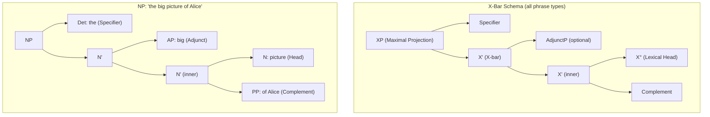
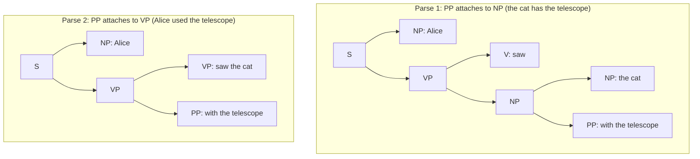

> [!abstract] TL;DR
> Phrase Structure Grammar formalises the insight that sentences are not flat word lists but nested hierarchical trees — phrases built from words, sentences built from phrases. X-bar theory (Chomsky 1970, Jackendoff 1977) shows that every phrase type shares the same internal skeleton: a lexical head flanked by a specifier and a complement. The formalism is identical to context-free grammars in computer science, making linguistic PSG and compiler theory two faces of the same mathematical object, and enabling constituency parsers that underpin information extraction, machine translation, and grammar checking at scale.

---

## Intuition

**Analogy:** Consider Russian nesting dolls. Each doll is complete on its own, yet it opens to reveal a smaller doll inside, which opens to reveal another, down to the tiniest innermost figure. You cannot pull out the third doll without lifting the second — each inner layer is encapsulated by the one outside it. You can pick up any one complete doll and carry it elsewhere without disturbing the others at its level.

Human sentences work exactly this way. The phrase "the old grey cat" is a complete unit. You can replace it wholesale with "it," move it to the front of the sentence, or coordinate it with another phrase. These manipulations treat "the old grey cat" as an indivisible object — a doll. Inside, it contains another unit, "old grey cat," and inside that, "grey cat," and so on. Phrase structure grammar makes this nesting visible by drawing the tree of encapsulated constituents. Any group of words that behaves as a unit — that can be substituted, moved, or coordinated as a whole — is a **constituent**, a syntactic building block.

---

## How It Works

### Identifying Constituents: Four Diagnostic Tests

A **constituent** is any sequence of words that forms a syntactic unit within the phrase structure. Whether a string is a constituent can be tested four independent ways:

**Test 1 — Substitution (Pro-form replacement):** If an entire string can be replaced by a single pro-form (pronoun, pro-verb "do so," pro-PP "there") without changing the sentence's grammaticality, the string is a constituent.
- "The old grey cat slept on the mat" → "**It** slept on the mat."  ✓ ("the old grey cat" is an NP constituent)
- "Cat slept on the" → "**It** slept." ✗ (no pro-form can replace this fragment — not a constituent)

**Test 2 — Movement (Topicalisation / Fronting):** Constituents can be displaced to the front or back of a clause as a unit. Fragments cannot move.
- "In the garden, Mary worked." ← "Mary worked in the garden." ✓ (PP "in the garden" moved as a unit)
- "*Mat on the, Mary slept." ← "Mary slept on the mat." ✗ ("mat on the" cannot front — not a constituent)

**Test 3 — Coordination:** Only constituents of the same type can be joined with *and*, *or*, *but*.
- "The cat [slept on the mat] and [dreamed of fish]." ✓ (two VP constituents coordinated)
- "*The cat slept [on the mat and dreamed] of fish." ✗ ("on the mat and dreamed" spans two different phrase types — not a constituent)

**Test 4 — Question formation (Answer ellipsis):** A constituent can stand alone as a complete answer to a question.
- "What did the cat chase?" — "**The mouse.**" ✓ (NP "the mouse" can stand alone as answer)
- "What did the cat?" — "*The mouse chased.*" ✗ (no natural fragment answers this)

These four tests triangulate constituency from different angles. A sequence that passes all four is robustly a constituent; one that fails multiple tests almost certainly is not.

### Context-Free Grammar Formalism

Phrase structure is formalised as a **context-free grammar (CFG)**, a set of rewrite rules of the form:

```
A → α
```

where A is a single non-terminal symbol (NP, VP, S, …) and α is a string of terminals (words) and/or non-terminals. The same formalism appears in computer science as **Backus-Naur Form (BNF)** — the notation used to define every programming language grammar since ALGOL 60. A CFG for a fragment of English:

```
S   → NP VP
NP  → Det N | Det Adj N | NP PP   (NP can embed a PP: "the cat on the mat")
VP  → V NP  | V PP
PP  → P NP
Det → "the" | "a"
Adj → "big" | "old"
N   → "cat" | "dog" | "mouse" | "garden"
V   → "chased" | "saw" | "found"
P   → "in" | "with"
```

Applying these rules top-down from S produces a **parse tree** — a rooted, labelled tree in which leaves are words and internal nodes are phrase categories. Every complete derivation from S to a word sequence is a sentence of the language; the parse tree records which rules were applied in what order.

Crucially, one string can have **multiple parse trees** — structural ambiguity — when different rule applications yield the same surface word sequence with different hierarchical structures.

### X-Bar Theory

Chomsky (1970) and Jackendoff (1977) observed that all phrase types — NP, VP, AP, PP — share the same internal skeleton, called the **X-bar schema**:

```
XP  (Maximal Projection: the full phrase)
├── Specifier      (Det in NP; Aux in VP/IP)
└── X'  (X-bar: intermediate projection)
    ├── X'         (adjuncts iterate at this level, left or right)
    │   ├── X°     (Lexical Head: the word the phrase is named after)
    │   └── Complement  (a phrase selected by the head)
    └── AdjunctP   (optional modifier, same height as outer X')
```

The schema unifies all phrases under one template:
- In an NP: X° = N, Specifier = Det, Complement = PP (*of Alice*), Adjunct = AP (*big*)
- In a VP: X° = V, Specifier = subject (in some analyses), Complement = NP/PP object
- In a PP: X° = P, Complement = NP

**Functional projections** extend the schema upward: above VP sits **IP (Inflectional Phrase)**, whose head I° carries tense and agreement and whose specifier is the surface subject. Above IP sits **CP (Complementizer Phrase)**, whose head C° is *that*, *if*, or the empty complementizer. The clausal spine is therefore always CP > IP > VP, with the lexical verb buried inside VP.

### Flow / Architecture



---

## Key Concepts

### Secondary Level

**What a Parse Tree Encodes**

The parse tree for "the cat chased the mouse" is not just a diagram — it encodes who did what to whom. The two NPs ("the cat," "the mouse") occupy structurally different positions: one is the specifier of IP (subject), the other is the complement of V (object). English marks this distinction by word order alone; Latin marks it with case endings on the nouns. Either way, the underlying tree structure is the same. Syntax's job is to deliver this relational information to semantics.

**The four constituency tests in practice:**

Apply them to "in the tall building" to confirm it is a PP constituent:
1. Substitution: "She works **there**." (pro-PP replaces the whole PP) ✓
2. Movement: "**In the tall building**, she works." ✓
3. Coordination: "She works [in the tall building] and [near the park]." ✓
4. Question: "Where does she work?" — "**In the tall building.**" ✓

Now try "the tall" alone — it fails all four tests. No pro-form replaces it, it cannot front, it cannot coordinate with a complete phrase of any type, and no question can be answered with "the tall." It is not a constituent.

**Structural ambiguity:**

The string "I saw the man with the telescope" is two sentences sharing one spelling. Are you using the telescope to see, or does the man have the telescope? The ambiguity is **structural**, not lexical — every word has one meaning, but the PP "with the telescope" can attach to two different phrase nodes, yielding two different trees. The words do not disambiguate; only context or world knowledge resolves which reading was intended.

---

### Undergraduate Level

**X-Bar Theory in Detail**

Three key distinctions define the X-bar system:

| Syntactic function | Position | Example in NP |
|---|---|---|
| **Specifier** | Sister to the full X' under XP | Det (*the*) |
| **Complement** | Sister to X° under the inner X' | PP (*of Alice*) — selected by head |
| **Adjunct** | Sister to X' at the outer X' level | AP (*big*) — optional, not selected |

The **head-complement distinction** is selectional: the head *requires* its complement by valency. "Picture" selects a PP-of complement ("a picture **of Alice**"); "give" selects an NP and a PP-to ("give **a book** **to Alice**"). Adjuncts are free additions; the same AP ("big") can modify almost any noun.

**Adjuncts iterate at X':** Because an adjunct attaches to X' and produces another X', there is no structural limit to stacking: "the big old grey crumbling picture of Alice." Each adjective adds another X' layer, preserving the specifier-X' binary-branching structure all the way up.

**Functional projections:** In Minimalist syntax, the full sentential structure contains layers above the lexical VP:

```
CP (Complementizer Phrase)
└── C° (that / if / ∅)
IP (Inflectional Phrase / TP)
└── I° (tense + agreement morphology)
    └── VP (Verb Phrase)
        └── V° + complements
```

When a wh-word moves to [Spec,CP] in question formation ("What did she see **?**"), it leaves the VP internal position and lands in the specifier of CP — an instance of Internal Merge (movement) driven by the uninterpretable wh-feature on C°.

**PP Attachment Ambiguity**

This is the canonical illustration of structural ambiguity in constituency parsing. The sentence "Alice saw the cat with the telescope" has two parse trees, both grammatical under the CFG above:



In Parse 1, the PP is inside the object NP (NP → NP PP); in Parse 2, the PP modifies the whole VP (VP → VP PP). The semantic difference is whether Alice or the cat possesses the telescope.

PP attachment is one of the hardest problems in computational parsing. Church & Patil (1982) showed that the number of parses for a sentence with n PPs attached to a VP + n NPs grows as the Catalan number C(n) — superexponential in n. For n = 5, there are 132 possible attachment structures from five PPs alone.

**Garden Path Sentences**

Garden path sentences exploit the fact that human parsing is **incremental** (left-to-right) and **greedy** (readers commit to the most plausible parse at each word):

> "The horse raced past the barn fell."

Readers parse "The horse raced past the barn" as a complete sentence (NP subject + VP predicate). The word "fell" then requires a radical reanalysis: "the horse" must be the subject of "fell," and "raced past the barn" is a reduced relative clause modifying "horse." The correct parse is "[The horse [raced past the barn]] fell." Most readers report noticeable processing difficulty — the garden path effect — measured in reading-time experiments as elevated fixation durations at "fell."

Garden path effects reveal that the human parser uses one parse tree at a time (serial, not parallel) and only revises it under strong disconfirming evidence, a finding central to psycholinguistic models of sentence processing.

**The Head Parameter**

X-bar theory predicts that the head's position relative to its complement — **head-initial** (head precedes complement) vs. **head-final** (complement precedes head) — determines a cluster of typological properties:

| Property | Head-initial (English) | Head-final (Japanese) |
|---|---|---|
| Verb + Object | "see **the cat**" | "**neko wo** miru" (cat-ACC see) |
| Preposition/Postposition | "**in** the house" | "uchi **ni**" (house in) |
| Relative clause position | post-nominal: "the man **who left**" | pre-nominal: "**who left** man" |
| Complementizer position | initial: "that she left" | final: "she left **to iu**" |

Setting a single parameter (head precedes / follows complement) cascades across multiple surface word-order properties. This explanatory compactness is a central argument for the Principles-and-Parameters architecture in [[Syntactic_Theory_and_Generative_Grammar]].

---

### Graduate Level

**The CYK Algorithm and Complexity**

The **Cocke–Younger–Kasami (CYK) algorithm** is the standard chart parser for context-free grammars. It requires the grammar to be in **Chomsky Normal Form (CNF)**: every rule is either A → B C (binary) or A → w (terminal). Any CFG can be mechanically converted to CNF.

The algorithm fills a triangular chart `dp[i][j]` — the set of non-terminals spanning tokens `i..j` — using dynamic programming:

```
For span = 2 to n:
  For each start i, end j = i + span − 1:
    For each split k in [i, j−1]:
      For each rule A → B C:
        if B ∈ dp[i][k] and C ∈ dp[k+1][j]:
          add A to dp[i][j]
```

Time complexity: O(n³ |G|) where |G| = number of rules. Space: O(n² |G|). Storing **backpointers** — which (k, B, C) justified each entry — allows recovering all parse trees, not just detecting grammaticality. The number of distinct parse trees can be exponential (Catalan numbers for PP attachment), so enumeration is done lazily.

**Probabilistic CFGs and Statistical Parsing**

A PCFG attaches a probability P(A → α) to each rule, normalised so that for each non-terminal A, the probabilities of all rules with A on the left-hand side sum to 1. The probability of a parse tree is the product of all its rule probabilities. The **Viterbi algorithm** finds the most probable parse in O(n³ |G|) time, identical to CYK but with max-product instead of set-union.

The problem with vanilla PCFGs: probabilities are rule-local and cannot capture **lexical dependencies** — "ate" subcategorises differently from "knew," yet both are verbs sharing the same rule probabilities. **Lexicalised PCFGs** (Collins 1997, Charniak 2000) annotate each non-terminal with its head word: NP[cat] is an NP headed by "cat." This allows the model to encode that "cat" rarely takes sentential complements while "say" often does.

**Penn Treebank and Neural Parsers**

The **Penn Treebank** (Marcus et al., 1993) annotated ~1 million words of Wall Street Journal newswire with phrase-structure trees in a bracket notation `(S (NP (DT the) (NN cat)) (VP (VBD chased) ...))`. Converting PTB trees to CNF and training a PCFG on them defined the standard constituency parsing benchmark for two decades.

The shift from hand-crafted to learned grammars proceeded in three phases:

| Era | Approach | Key System | F1 (PTB §23) |
|---|---|---|---|
| 1993–2002 | Generative PCFG | Collins (1999) | ~88% |
| 2003–2014 | Discriminative / CRF | Petrov (2006) split-merge | ~90% |
| 2015–2025 | Neural | Kitaev & Klein (2018) self-attentive | ~95.8% |

The **labeled bracketing F1** score is computed over constituency spans: a span is correct if the parser produces the exact same (start, end, label) triple as the gold tree. State-of-the-art systems like the Berkeley Neural Parser use a transformer encoder to score candidate spans and a CYK-like decoder to find the globally optimal consistent tree.

**Generative Capacity of CFGs**

Chomsky's hierarchy situates CFGs between regular grammars (recognisable by finite-state automata) and context-sensitive grammars:

```
Regular ⊂ Context-Free ⊂ Context-Sensitive ⊂ Recursively Enumerable
```

Natural languages are not strictly context-free. Swiss German cross-serial dependencies (*Hans sieht dass Jakob das Haus malt* "Hans sees that Jakob paints the house" with cross-serial verb-object agreement) require mildly context-sensitive formalisms such as Tree-Adjoining Grammars (TAGs) or Combinatory Categorial Grammars (CCGs). However, CFGs approximate natural languages well enough for most engineering purposes, and the clean O(n³) parsing complexity makes them the practical standard.

---

## Python Demo

```python
"""
Phrase Structure Grammar: CYK parsing with ambiguity detection and parse-tree
visualization. Implements the CYK algorithm with full backpointers to enumerate
ALL parse trees for each sentence, then renders them as annotated constituency
trees using matplotlib. No NLP libraries -- numpy and matplotlib only.
"""
import numpy as np
import matplotlib.pyplot as plt
from collections import defaultdict

# ── 1. CFG in Chomsky Normal Form ─────────────────────────────────────────────
# Binary rules: (B, C) → A
BINARY = {
    ('NP', 'VP'): 'S',
    ('Det', 'N'): 'NP',
    ('NP', 'PP'): 'NP',    # NP modified by PP: "the cat [with the telescope]"
    ('V',  'NP'): 'VP',
    ('V',  'PP'): 'VP',    # intransitive verb + PP argument
    ('VP', 'PP'): 'VP',    # VP modified by PP: "saw the cat [with telescope]"
    ('P',  'NP'): 'PP',
}
# Terminal rules: word → category
TERM = {
    'the': 'Det',  'a': 'Det',
    'cat': 'N',    'dog': 'N',    'mouse': 'N',
    'garden': 'N', 'telescope': 'N',
    'Alice': 'NP', 'Bob': 'NP',   # proper nouns enter as NP directly (no unit rule)
    'chased': 'V', 'saw': 'V',    'found': 'V',
    'in': 'P',     'with': 'P',
}

# ── 2. CYK chart with full backpointers ──────────────────────────────────────
def cyk(words):
    """
    chart[i][j][A] = list of derivations:
      ('lex',)           -- terminal span (single word)
      ('bin', k, B, C)   -- A -> B C with left=[i..k], right=[k+1..j]
    """
    n = len(words)
    chart = [[defaultdict(list) for _ in range(n)] for _ in range(n)]
    for i, w in enumerate(words):
        if w in TERM:
            chart[i][i][TERM[w]].append(('lex',))
    for span in range(2, n + 1):
        for i in range(n - span + 1):
            j = i + span - 1
            for k in range(i, j):
                for (B, C), A in BINARY.items():
                    if chart[i][k][B] and chart[k+1][j][C]:
                        chart[i][j][A].append(('bin', k, B, C))
    return chart

# ── 3. Enumerate ALL parse trees ──────────────────────────────────────────────
def all_trees(chart, words, sym, i, j):
    """
    Returns all parse trees rooted at sym spanning words[i..j].
    Tree format: (symbol, "word")        for a leaf
                 (symbol, [left, right]) for an internal node
    """
    out = []
    for d in chart[i][j].get(sym, []):
        if d[0] == 'lex':
            out.append((sym, words[i]))
        else:
            _, k, B, C = d
            for L in all_trees(chart, words, B, i, k):
                for R in all_trees(chart, words, C, k + 1, j):
                    out.append((sym, [L, R]))
    return out

# ── 4. Bracketed string representation ───────────────────────────────────────
def brackets(tree):
    sym, payload = tree
    if isinstance(payload, str):
        return f'[{sym} {payload}]'
    return f'[{sym} {brackets(payload[0])} {brackets(payload[1])}]'

# ── 5. Tree coordinate assignment ────────────────────────────────────────────
def layout(node, depth, x_ctr):
    """
    Assigns (x, y) positions via in-order traversal.
    x_ctr = [next_leaf_x]  (mutable shared counter)
    Returns (root_x, node_records, edge_list):
      node_records: [(tag, label, x, y)]   tag in {'cat', 'word'}
      edge_list:    [(x1, y1, x2, y2)]
    """
    sym, payload = node
    if isinstance(payload, str):                    # leaf
        x = float(x_ctr[0]);  x_ctr[0] += 1
        records = [('cat',  sym,     x, -depth),
                   ('word', payload, x, -depth - 0.85)]
        edges   = [(x, -depth, x, -depth - 0.85)]
        return x, records, edges
    left, right = payload                           # binary internal node
    lx, lr, le  = layout(left,  depth + 1, x_ctr)
    rx, rr, re  = layout(right, depth + 1, x_ctr)
    mx = (lx + rx) / 2.0
    records = [('cat', sym, mx, -depth)] + lr + rr
    edges   = [(mx, -depth, lx, -(depth + 1)),
               (mx, -depth, rx, -(depth + 1))] + le + re
    return mx, records, edges

# ── 6. Draw a parse tree ──────────────────────────────────────────────────────
CAT_COLORS = {
    'S':  '#aed6f1', 'NP': '#a9dfbf', 'VP': '#f9e79f',
    'PP': '#f5cba7', 'Det':'#d7bde2', 'N': '#d2b4de',
    'V':  '#fad7a0', 'P':  '#f5b7b1',
}

def draw_tree(ax, tree, title):
    _, records, edges = layout(tree, depth=0, x_ctr=[0])
    for x1, y1, x2, y2 in edges:
        ax.plot([x1, x2], [y1, y2], '-', color='#555', lw=1.2, zorder=1)
    for tag, label, x, y in records:
        fc = '#fdfefe'  if tag == 'word' else CAT_COLORS.get(label, '#d5d8dc')
        ec = '#7f8c8d'  if tag == 'word' else '#1c2833'
        fw = 'normal'   if tag == 'word' else 'bold'
        ax.text(x, y, label, ha='center', va='center', fontsize=8, fontweight=fw,
                bbox=dict(boxstyle='round,pad=0.22', facecolor=fc,
                          edgecolor=ec, linewidth=1.4), zorder=2)
    xs = [r[2] for r in records];  ys = [r[3] for r in records]
    ax.set_xlim(min(xs) - 0.7, max(xs) + 0.7)
    ax.set_ylim(min(ys) - 0.3, 0.5)
    ax.set_title(title, fontsize=9, fontweight='bold', pad=5)
    ax.axis('off')

# ── 7. Parse the sentences ────────────────────────────────────────────────────
sent1 = "Alice chased the dog".split()
sent2 = "Alice saw the cat with the telescope".split()

chart1 = cyk(sent1)
chart2 = cyk(sent2)

t1 = all_trees(chart1, sent1, 'S', 0, len(sent1) - 1)
t2 = all_trees(chart2, sent2, 'S', 0, len(sent2) - 1)

print(f"'{' '.join(sent1)}'  ->  {len(t1)} parse tree(s)")
print(f"'{' '.join(sent2)}'  ->  {len(t2)} parse trees  <- structurally ambiguous\n")
for idx, tree in enumerate(t2, 1):
    print(f"Parse {idx}:  {brackets(tree)}")

# ── 8. Visualise all three parse trees side by side ──────────────────────────
fig, axes = plt.subplots(1, 3, figsize=(17, 6))
fig.suptitle("CYK Constituency Parse Trees", fontsize=13, fontweight='bold')

draw_tree(axes[0], t1[0],
          f"Unambiguous:\n\"{' '.join(sent1)}\"")
draw_tree(axes[1], t2[0],
          "Ambiguous -- Reading 1\n[PP attaches to NP]\n\"the cat [with the telescope]\"")
draw_tree(axes[2], t2[1],
          "Ambiguous -- Reading 2\n[PP attaches to VP]\n\"[saw the cat] [with the telescope]\"")

plt.tight_layout()
plt.savefig('phrase_structure_parse_trees.png', dpi=130, bbox_inches='tight')
plt.show()
print('\nPlot saved: phrase_structure_parse_trees.png')
```

**Expected output:**
```
'Alice chased the dog'  ->  1 parse tree(s)
'Alice saw the cat with the telescope'  ->  2 parse trees  <- structurally ambiguous

Parse 1:  [S [NP Alice] [VP [V saw] [NP [NP [Det the] [N cat]] [PP [P with] [NP [Det the] [N telescope]]]]]]
Parse 2:  [S [NP Alice] [VP [VP [V saw] [NP [Det the] [N cat]]] [PP [P with] [NP [Det the] [N telescope]]]]]

Plot saved: phrase_structure_parse_trees.png
```

The bracketed forms make the structural difference concrete. In Parse 1, the outer NP dominates both the inner NP "the cat" and the PP "with the telescope." In Parse 2, the outer VP dominates an inner VP "saw the cat" and the PP at the same level. The matplotlib output renders each tree with colour-coded nodes: blue for S, green for NP, yellow for VP, orange for PP — identical word tokens appearing in visually distinct structural positions across the two ambiguous trees.

---

## Real-World Applications

**Penn Treebank and Statistical Constituency Parsing**

Marcus et al. (1993) annotated 2,499 sections of Wall Street Journal text (~1M words) with manual phrase-structure trees. The PTB created the benchmark that drove a decade of research. Stanford's unlexicalized PCFG parser (Klein & Manning 2003) and Petrov's latent-variable PCFG (split-merge grammar) each improved on hand-designed grammars by learning fine-grained sub-categories (NP-SBJ, NP-OBJ) from treebank statistics alone. The neural Berkeley Parser (Kitaev & Klein 2018) uses a transformer encoder to score every possible labeled span (i, j, A) and assembles the globally optimal tree with a top-down CYK decoder, reaching ~95.8% F1 on PTB section 23.

**Compiler Design and Formal Language Theory**

Every programming language compiler uses a CFG to define syntax and a parser to build the Abstract Syntax Tree (AST). Python's grammar is a CFG in BNF; GCC uses an LALR(1) parser generator. Chomsky's 1956 hierarchy — Regular ⊂ Context-Free ⊂ Context-Sensitive — is the theoretical backbone of formal language theory in computer science. The connection is not metaphorical: Chomsky co-invented the Chomsky hierarchy precisely because he was working on both linguistic and computational formalisms simultaneously in the late 1950s.

**NLP Pipelines: Information Extraction and Semantic Parsing**

Constituency trees define **syntactic spans** — contiguous chunks of text corresponding to phrases. Named-entity taggers, coreference resolvers, and semantic role labellers all rely on these spans to constrain candidate arguments. A span-based NER model scores every (i, j) pair as a potential named entity; the CYK chart structure naturally enumerates all such spans in O(n²) space. Stanford CoreNLP ships a constituency parser as the first stage of its information extraction pipeline.

**Grammar Checking and Writing Tools**

Grammarly and Microsoft Editor use shallow phrase-structure parsing to detect fragment sentences (no VP under S), dangling modifiers (no NP in the sentence for the modifier to attach to), and subject-verb agreement errors. The detection rule is structural: "find an NP of any complexity in subject position, extract its head noun, check agreement with the VP head verb." That rule is only statable over a parse tree, not a flat word string.

---

## Common Pitfalls

- **Confusing constituency and dependency trees** — A constituency tree (PSG) groups words into nested phrases; a dependency tree draws head-dependent arcs between individual words with no intermediate phrase nodes. spaCy returns a dependency tree; Stanford CoreNLP returns a constituency tree. They are not interchangeable, and algorithms designed for one generally do not work on the other. See [[Dependency_and_Construction_Grammar]] for the contrasting formalism.

- **Applying only one constituency test** — Any single test can fail for independent reasons. An NP inside a heavy-NP island ("*The fact that she left him annoyed her" — "that she left him" cannot front despite being a CP constituent) fails the movement test due to island constraints, not because it is not a constituent. Converging evidence from all four tests is required before making a constituency judgment.

- **Assuming all ambiguity is lexical** — Most ambiguity seen in NLP benchmarks is **structural**: PP attachment, coordination scope ("old men and women"), relative clause attachment. Word-sense ambiguity is a separate and simpler problem. Systems that conflate the two (treating every word as ambiguous) miss the structural source of the difficulty.

- **Converting to CNF without care** — The standard CYK implementation requires CNF, but naive conversion introduces artificial nodes (e.g., X → Y Z W becomes X → X_YZ W; X_YZ → Y Z) that obscure the original grammar structure. When building the final tree you must **undo** the binarization to recover the original multi-child rules. Failure to do this is a common bug in student implementations.

- **Conflating the head parameter with basic word order** — The head parameter predicts a *cluster* of correlating properties (preposition vs. postposition, head-initial vs. head-final relative clauses, etc.), not just SVO vs. SOV. English is SVO but also rigidly head-initial; Japanese is SOV and rigidly head-final. A language can be SVO and still have some head-final PPs (rare but attested); the parameter is a statistical tendency, not an absolute law for every construction. See [[Morphosyntactic_Typology]] for the typological perspective.

- **Treating grammar rules as derivational steps** — In modern Minimalist syntax, there are no PSG rules as such. The operation External Merge assembles structure bottom-up, and Internal Merge (movement) copies constituents to higher positions. The PSG rule S → NP VP is a *description* of the output, not a generative step. Conflating the description with the mechanism leads to confusion when confronted with movement phenomena where the "subject" in NP position is actually a copy of a lower NP.

---

## Related Concepts

- [[Syntactic_Theory_and_Generative_Grammar]] — The parent framework: Minimalist Program, deep/surface structure, transformations, and the broader theoretical context in which PSG rules are situated as descriptive outputs of Merge operations
- [[Dependency_and_Construction_Grammar]] — The primary alternative to constituent-based syntax: dependency grammar draws head-dependent word-pair arcs without intermediate phrase nodes; Construction Grammar denies the generative/transformational architecture entirely
- [[Morphosyntactic_Typology]] — Cross-linguistic survey of the head direction parameter and its word-order correlates; provides the empirical typological evidence that X-bar theory aims to explain through a single binary parameter
- [[Universal_Grammar_and_Language_Acquisition]] — The acquisition argument for PSG: children acquire hierarchical phrase structure without explicit instruction, which Chomsky uses as evidence that X-bar constraints are innate
- [[Language_Model_Basics]] — Statistical and neural language models learn distributional regularities over token sequences; they implicitly encode some constituent structure but lack explicit phrase-node representations; constituency parsers are used to inject structural supervision into pre-training
- [[String_Matching_Overview]] — Formal language theory underpins both string matching and CFG parsing; the Chomsky hierarchy situates regular grammars (finite automata, string matching) strictly below CFGs (parse trees, constituency) in expressive power
- [[Tokenization]] — The first pipeline stage before constituency parsing: subword tokenization (BPE) segments words into pieces that do not align with syntactic constituents, creating a mismatch between tokenizer output and parser input that neural parsers must bridge

---

## Review Questions

### Secondary

1. Apply all four constituency tests to the string "under the old bridge" in "She walked under the old bridge." What category is this constituent, and how do the test results confirm it?
2. Draw the full phrase-structure tree for "a big dog chased the cat." Label every node (S, NP, VP, Det, Adj, N, V) and every leaf word.
3. The sentence "Flying planes can be dangerous" is ambiguous. Identify the two readings and describe in everyday language what structural difference between the two parse trees creates the ambiguity. You do not need to draw the full trees.

### Undergraduate

1. Explain the X-bar distinction between **complement** and **adjunct**. Use the NP "the student of physics in this class" to illustrate: which PP is the complement and which is the adjunct, and how do the two constituency tests (movement and iteration) diagnose the difference?
2. Outline the CYK algorithm step by step for the sentence "the cat saw Bob" using the grammar defined in the Python Demo section. Fill in the triangular chart manually for spans of length 1, 2, and 3. What does the chart contain at position `dp[0][3]` and why?
3. The **head direction parameter** in English is set to head-initial. List three surface word-order properties that follow from this setting and verify each with a Japanese counterexample. Then identify one construction in English that appears to violate head-initiality (hint: think about possessives like "Alice's cat") and explain how X-bar theory handles it.

### Graduate

1. PCFGs attach independent probabilities to rules, so P(*the cat that the dog that the mouse chased bit ran*) = P(S→NP VP) × P(NP→Det N) × ... — a product of rule probabilities. What structural property of this sentence is underweighted by a context-free probability model, and how do **lexicalised PCFGs** (Collins 1997) and **neural span-based parsers** (Kitaev & Klein 2018) differently address the same deficiency?
2. The Catalan number C(n) counts the number of distinct binary brackettings of n+1 items, growing as C(n) ~ 4^n / (n^{3/2} √π). A sentence with 5 prepositional phrases attached to a VP+NP sequence can therefore have C(5) = 42 distinct parse trees. Explain why this matters for **ambiguity resolution in information extraction**, and describe how the Penn Treebank training signal + a PCFG decoder solves (or fails to solve) the disambiguation problem.
3. Strict CFGs cannot describe Swiss German cross-serial dependencies, where verbs and their objects are interleaved across clause boundaries rather than nested. Identify which property of CFGs (closure, the pumping lemma, or Ogden's lemma) formally blocks their description, and name one **mildly context-sensitive** formalism (TAG, CCG, or MG) that extends CFGs minimally to cover these constructions. What is the parsing complexity of that formalism and why does it remain tractable for NLP?

---

## Sources

- [Chomsky, N. (1957). *Syntactic Structures*. Mouton.](https://archive.org/details/syntacticstructu00chom)
- [Jackendoff, R. (1977). *X-Bar Syntax: A Study of Phrase Structure*. MIT Press.](https://mitpress.mit.edu/9780262600156/)
- [Marcus, M. et al. (1993). Building a Large Annotated Corpus of English: The Penn Treebank. *Computational Linguistics* 19(2).](https://aclanthology.org/J93-2004/)
- [Klein, D. & Manning, C. (2003). Accurate Unlexicalized Parsing. *ACL 2003*.](https://aclanthology.org/P03-1054/)
- [Kitaev, N. & Klein, D. (2018). Constituency Parsing with a Self-Attentive Encoder. *ACL 2018*.](https://arxiv.org/abs/1805.01052)
- [Carnie, A. (2021). *Syntax: A Generative Introduction* (4th ed.). Wiley-Blackwell.](https://www.wiley.com/en-us/Syntax%3A+A+Generative+Introduction%2C+4th+Edition-p-9781119569572)
- [Jurafsky, D. & Martin, J. H. (2024). *Speech and Language Processing* (3rd ed. draft). Chapter 17: Constituency Parsing.](https://web.stanford.edu/~jurafsky/slp3/)
- [Church, K. & Patil, R. (1982). Coping with syntactic ambiguity. *AJCL* 8(3–4).](https://aclanthology.org/J82-3003/)

---

#Linguistics #MorphologySyntax #PhraseStructure #Constituency #XBar #CFG #ParseTrees
