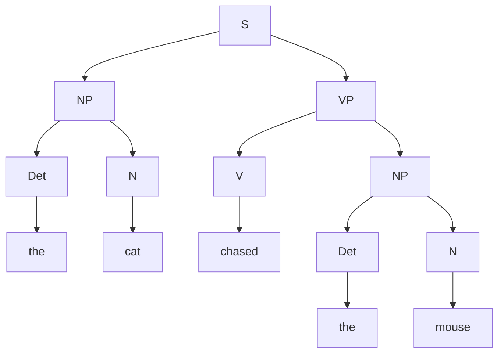

> [!abstract] TL;DR
> Syntax is the rule system governing how words combine into sentences. Chomsky's **generative grammar** (1957–present) revealed that these rules are hierarchical, recursive, and potentially universal — meaning a finite brain produces and comprehends an infinite set of sentences it has never encountered. The field's central question is whether this capacity for structured combination is a species-specific biological endowment or an emergent property of general learning.

---

## Intuition

Think of **LEGO bricks**. You have a finite set of brick types (words) and a finite instruction manual (syntax rules). The structures you can build are infinite. Crucially, the manual does not list every possible structure — it lists *operations*: "a square brick can sit on top of a rectangular brick," "a row can attach to another row." These operations apply *recursively*, so you can nest structures inside structures without bound.

Chomsky's core insight in 1957 was that human syntax works exactly this way. The rules do not enumerate sentences; they enumerate structural *operations* — ways of combining noun phrases with verb phrases, embedding clauses inside clauses, moving constituents to new positions. Because the operations are recursive, the language they generate is infinite.

The most famous demonstration: *"Colorless green ideas sleep furiously."* This sentence is completely nonsensical — ideas cannot be green and cannot sleep — yet every competent English speaker immediately recognises it as *grammatical*. Syntax is a system unto itself, entirely independent of meaning.

---

## How It Works

Sentences are not flat lists of words; they are **hierarchical trees**. Words group into **constituents** (syntactic units), constituents group into phrases, and phrases combine into sentences.

The core mechanism is **phrase structure rules**, written as context-free grammar (CFG) productions:

```
S   → NP VP           (sentence = noun phrase + verb phrase)
NP  → Det N           (noun phrase = determiner + noun)
VP  → V NP            (verb phrase = verb + noun phrase)
Det → "the" | "a"
N   → "cat" | "mouse" | "cheese"
V   → "chased" | "ate"
```

These rules produce **parse trees**. The parse tree for "the cat chased the mouse":



The tree reveals structure invisible in the surface word string. "the cat" forms a unit (NP subject) entirely different in role from "the mouse" (NP object). The tree encodes *who did what to whom* — the basic information syntax must deliver to semantics.

**Constituency tests** identify whether a group of words forms a single constituent:
- **Substitution**: "the big old cat" → "it" (pronoun replacement works, so it is an NP constituent)
- **Movement**: "Into the room, the cat ran" — the PP moved as a unit, so it is a constituent
- **Question formation**: "What did the cat chase? — The mouse." — "the mouse" answers as a unit

Recursive rules like `NP → NP PP` allow indefinite embedding: "the cat in the house on the hill near the river…" — same structural rule applied repeatedly, unbounded length.

---

## Key Concepts

### Secondary Level

**Syntactic Categories and Phrases**

Every word belongs to a lexical category. Each category *heads* a phrase:

| Category | Abbrev. | Examples | Phrase Headed |
|---|---|---|---|
| Noun | N | cat, freedom, idea | NP (Noun Phrase) |
| Verb | V | chase, seem, sleep | VP (Verb Phrase) |
| Adjective | Adj | big, colorless, eager | AP (Adjective Phrase) |
| Adverb | Adv | quickly, furiously | AdvP |
| Determiner | Det | the, a, every | — (functional head in NP) |
| Preposition | P | in, on, near | PP (Prepositional Phrase) |

**CFG notation** writes rules as A → α, where A is a single non-terminal and α is a string of terminals and/or non-terminals. The `|` symbol separates alternatives:

```
NP → Det N | Det Adj N | NP PP
VP → V | V NP | V NP PP
```

**Recursion gives discrete infinity.** The rule `NP → NP PP` is self-referential: an NP can contain another NP. Starting from "the cat," one application gives "the cat in the house," a second gives "the cat in the house on the hill," and so on without limit. A finite grammar generates infinite sentences — this is what Chomsky called **discrete infinity**, the defining property of human language.

**Grammaticality is independent of meaning.** The two dimensions are orthogonal:

| | Grammatical | Ungrammatical |
|---|---|---|
| Meaningful | "The cat chased the mouse." | "*Cat the mouse the chased." |
| Nonsensical | "Colorless green ideas sleep furiously." | "*Furiously sleep ideas green colorless." |

Starred (*) forms violate syntactic rules; the others obey them regardless of truth or sense.

---

### Undergraduate Level

**X-Bar Theory**

All phrases across all languages share a parallel internal architecture (Chomsky 1970, Jackendoff 1977). X-Bar theory formalises this:

```
XP  (maximal projection — the full phrase)
 ├── Specifier
 └── X'  (X-bar — intermediate projection)
      ├── X  (lexical head — the word naming the phrase)
      └── Complement
```

For "the picture of the queen" (NP):
- Head X = N (*picture*)
- Complement = PP (*of the queen*)
- Specifier = Det (*the*)

**The Projection Principle**: every phrase must have a head; the head determines the category of its phrase. An NP must have a nominal head; a VP a verbal head. This principle explains why you cannot simply insert arbitrary words into any position.

---

**Deep vs. Surface Structure and Transformations**

*Syntactic Structures* (1957) and *Aspects* (1965) introduced two levels of representation:

- **Deep Structure (D-Structure)**: the underlying hierarchical structure representing grammatical relations — who is the subject, who the object.
- **Surface Structure (S-Structure)**: the actual word order after **transformational rules** have moved constituents.

The **Passive Transformation** illustrates the distinction:

> Active: *[NP the cat] [VP chased [NP the mouse]]*
> Passive: *[NP the mouse] was chased by [NP the cat]*

The object NP ("the mouse") has moved to subject position; the agent has been demoted to a by-PP. Same event, different grammatical packaging — same deep structure, different surface structure.

The deep/surface distinction resolves the **structural ambiguity** in minimal pairs:

> (a) "John is eager to please." — John does the pleasing (John = Agent of *please*)
> (b) "John is easy to please." — Someone else pleases John (John = Patient of *please*)

Surface form: NP + *be* + Adj + *to* + V — identical. Deep structures: radically different. In (a), John is the understood subject of *please*; in (b), John is the understood object. This cannot be captured by surface order alone.

---

**Government and Binding Theory: Principles and Parameters**

By the 1980s, Chomsky replaced language-specific phrase-structure rules with a universal framework: **Government and Binding (GB) / Principles and Parameters (P&P)**. The core idea: all human languages share universal abstract **principles**; cross-linguistic variation comes from setting a small number of binary **parameters**.

*Selected Principles (universal — no language violates them):*
- **Structure Dependence**: grammatical rules refer to tree positions, never linear string positions. The English question rule ("move the auxiliary past the subject") is defined over structural dominance, not word count.
- **Theta Criterion**: each argument receives exactly one thematic role (Agent, Patient, Goal…); each role is assigned to exactly one argument.
- **Extended Projection Principle (EPP)**: every clause must have a subject — even "dummy" subjects like *it* in "It is raining."

*Selected Parameters (binary switches set per language):*

| Parameter | [+] Setting | [−] Setting |
|---|---|---|
| **Head Direction** | Head-initial: head precedes complement (*V NP*, *P NP*) — English, French | Head-final: complement precedes head (*NP V*, *NP P*) — Japanese, Turkish |
| **Pro-Drop** | Null subject allowed — Spanish (*Habla inglés*), Italian | Overt subject required — English (*\*Speaks English*) |
| **Wh-Movement** | Wh-phrase moves to front — English ("What did you eat?") | Wh-phrase stays in-situ — Mandarin ("你吃了什么?" = "You ate what?") |

The **head-direction parameter** has remarkable **cascading effects**. Setting a language to head-initial predicts:
- Prepositions (not postpositions): "in the house" vs. Japanese "house-ni (in)"
- Post-nominal relative clauses: "the man *who left*" vs. Japanese "*who left* man"
- Auxiliary before verb: "*is* running" vs. Japanese "running *iru*"

A single parameter setting predicts a constellation of typological properties — this is the explanatory power of P&P.

---

### Graduate Level

**The Minimalist Program**

Chomsky's *Minimalist Program* (1995, extended through the 2000s–present) asks: *why* is the language faculty structured as it is? The answer proposed: because it is optimally designed for the interfaces it must serve.

The language faculty interfaces with:
- **Phonological Form (PF)**: the articulatory-perceptual system
- **Logical Form (LF)**: the conceptual-intentional system (semantics, pragmatics)

**Core claim**: the only syntactic operations are those mandated by interface conditions. All else is eliminated as computational overhead.

*Two fundamental operations:*

**External Merge**: take two syntactic objects α and β from the numeration (the lexical array for the derivation) and combine them into a new set {α, β}. This builds structure from scratch.

```
Merge(the, cat)        → {Det, N}     = NP (subject)
Merge(chased, NP_obj)  → {V, NP}      = VP
Merge(NP_subj, VP)     → {NP, VP}     = TP/S
```

**Internal Merge (Move)**: re-Merge an element α *already present* in the syntactic object at a higher position. This replaces all classical movement rules.

```
Derivation of "What did the cat chase __?"
1. Build: [the cat] [chase [what]]
2. Internal Merge: move "what" → Spec-CP   (wh-movement)
3. Internal Merge: move "did" → C           (subject-auxiliary inversion)
→ Surface: What did the cat chase?
```

Movement is triggered by **uninterpretable features** that must be deleted before Spell-Out. A wh-phrase bears an uninterpretable wh-feature; the C head has an EPP feature requiring a specifier with matching wh-features. Internal Merge satisfies both simultaneously.

**Agree**: a *probe* (functional head with uninterpretable features) searches its c-command domain for a *goal* bearing matching interpretable features. This mechanism handles subject-verb agreement, case assignment, and many other dependencies without separate rules.

The **Strong Minimalist Thesis**: Merge is free — it is not restricted by any language-specific filter. All apparent restrictions follow from interface conditions at PF and LF. If this is correct, the "language organ" reduces to a single recursive operation (Merge) plus the interfaces.

---

**Construction Grammar**

An influential alternative to the derivational tradition (Fillmore 1988, Goldberg 1995, Croft 2001):

- The basic unit of grammar is a **construction**: a pairing of form and meaning at any level (morpheme, word, phrase, sentence)
- There is no deep structure and no movement
- Meaning is not fully compositional — some meaning inheres in the construction itself

The canonical example is the **ditransitive construction** [NP V NP NP]:

| Sentence | Verb type | Reading |
|---|---|---|
| "She *gave* him the book." | transfer verb (expected) | X causes Y to receive Z |
| "He *baked* her a cake." | creation verb (unexpected) | X causes Y to receive Z |
| "She *sneezed* the napkin off the table." | manner-of-motion verb (very unexpected) | X causes Y to receive Z |

The caused-motion/transfer reading is NOT contributed by *sneeze* — it is contributed by the [NP V NP NP] construction itself. Construction grammarians argue this is impossible to derive transformationally; the construction is the primitive unit.

Construction Grammar is **non-derivational** and **usage-based**: constructions are learned through exposure, not specified innately. Evidence comes from child language acquisition (children acquire constructions item-by-item before they generalise) and psycholinguistic priming studies (structural priming operates on construction frames, not abstract rules).

**Minimalist response**: event semantics (Kratzer's vP shell) plus argument structure can derive the ditransitive readings without construction-specific stipulations — the caused-motion meaning comes from a light verb *v* that encodes causation, not from the surface form.

The debate remains live. Each framework handles some phenomena more elegantly; neither has a knockdown argument.

---

**Syntactic Typology**

Cross-linguistic syntax reveals systematic variation in **basic word order**. Greenberg (1963) identified the correlations; P&P provides a formal account.

*Basic word order frequencies (n ≈ 1500 languages):*

| Order | Approx. frequency | Examples |
|---|---|---|
| **SOV** | ~44% | Japanese, Turkish, Hindi, Persian, Latin |
| **SVO** | ~28% | English, French, Mandarin, Swahili |
| **VSO** | ~9% | Welsh, Arabic, Hebrew (Modern), Irish |
| **VOS** | ~3% | Malagasy, Tzotzil |
| **OVS** | ~1% | Hixkaryana |
| **OSV** | <1% | Xavante |

OS orders (object before subject) are vanishingly rare — consistent with the typological pressure to place agentive subjects first (Topic > Agent > elsewhere).

**Greenberg's head-direction correlates:**
- Head-initial languages tend toward: VO order, prepositions, post-nominal relative clauses, post-nominal adjectives, SVO/VSO
- Head-final languages tend toward: OV order, postpositions, pre-nominal relative clauses, pre-nominal adjectives, SOV

These co-occurrences are not statistical accidents; they are predicted by the head-direction parameter propagating uniformly through the phrase-structure system.

**Challenge to universalism:** Haspelmath (2021) and Evans & Levinson (2009) argue that no strictly universal syntactic principles hold across all 7,000+ languages — only statistical tendencies. If correct, this undermines the Principles-and-Parameters architecture, which requires *absolute* universal principles. The debate between **formal universalism** (Chomsky tradition) and **typological functionalism** (Greenberg-Haspelmath tradition) is the deepest ongoing fault line in the field.

---

## Python Demo

```python
# Syntactic Theory — CFG sentence generation, combinatorial explosion, CYK parsing
# Grammar: S→NP VP; NP→Det N | Det Adj N; VP→V NP
# Terminals: Det→{the,a}, N→{cat,mouse,cheese}, V→{chased,ate}, Adj→{big,hungry}

from itertools import product
from collections import defaultdict
import numpy as np
import matplotlib.pyplot as plt

# ── 1. Grammar definition ────────────────────────────────────────────────────
LEXICON = {
    'Det': ['the', 'a'],
    'N':   ['cat', 'mouse', 'cheese'],
    'V':   ['chased', 'ate'],
    'Adj': ['big', 'hungry'],
}
RULES = {
    'S':  [['NP', 'VP']],
    'NP': [['Det', 'N'],
           ['Det', 'Adj', 'N']],   # optional adjective → length-6 sentences
    'VP': [['V', 'NP']],
}

def expand(sym):
    """Return every terminal string derivable from sym."""
    if sym in LEXICON:
        return [[w] for w in LEXICON[sym]]
    result = []
    for rhs in RULES[sym]:
        parts = [expand(s) for s in rhs]
        for combo in product(*parts):
            result.append([w for part in combo for w in part])
    return result

all_sents = expand('S')
print(f"Total grammatical sentences: {len(all_sents)}")
# Expected: 72 (len-5) + 144+144 (len-6) + 288 (len-7) = 648

by_len = defaultdict(int)
for s in all_sents:
    by_len[len(s)] += 1
for L in sorted(by_len):
    print(f"  Length {L}: {by_len[L]:5d} sentences")

# Theoretical k^5 growth for a pure length-5 grammar with vocab size k per category
vocab_sizes = np.arange(2, 16, dtype=float)
count_theory = vocab_sizes ** 5   # Det(k) * N(k) * V(k) * Det(k) * N(k)

# ── 2. Visualise combinatorial growth ────────────────────────────────────────
fig, (ax1, ax2) = plt.subplots(1, 2, figsize=(12, 4))

lengths = np.array(sorted(by_len.keys()), dtype=int)
counts  = np.array([by_len[l] for l in lengths], dtype=int)
bars = ax1.bar(lengths, counts, color='#4a9eff', edgecolor='#1a56db', linewidth=1.2)
for bar, c in zip(bars, counts):
    ax1.text(bar.get_x() + bar.get_width() / 2,
             bar.get_height() + 3, str(c),
             ha='center', va='bottom', fontweight='bold', fontsize=11)
ax1.set(xlabel='Sentence length (tokens)', ylabel='Grammatical sentences',
        title='CFG Sentence Count by Length\n'
              '(S→NP VP; NP→Det [Adj] N; VP→V NP)',
        xticks=lengths)

ax2.loglog(vocab_sizes, count_theory, 'o-', color='#059669',
           linewidth=2, markersize=6)
ax2.set(xlabel='Vocabulary size per category (k)',
        ylabel='Length-5 sentence count  (log–log)',
        title='Combinatorial Explosion: count ~ k⁵\n'
              '(slope = 5 on log–log confirms power law)')
ax2.grid(True, which='both', alpha=0.3)

plt.tight_layout()
plt.savefig('cfg_combinatorial_explosion.png', dpi=150)
plt.show()
print("Plot saved: cfg_combinatorial_explosion.png")

# ── 3. CYK Chart Parser ───────────────────────────────────────────────────────
# Grammar in Chomsky Normal Form (base grammar — length-5 sentences):
#   Binary:   S→NP VP;  NP→Det N;  VP→V NP
#   Terminal: individual words mapped to categories

TERM_RULES = {
    'the':    {'Det'}, 'a':      {'Det'},
    'cat':    {'N'},   'mouse':  {'N'},   'cheese': {'N'},
    'chased': {'V'},   'ate':    {'V'},
}
BINARY_RULES = {
    ('NP', 'VP'): 'S',
    ('Det', 'N'): 'NP',
    ('V',  'NP'): 'VP',
}

def cyk(tokens):
    """
    CYK chart parser.
    dp[i][j] = set of non-terminals spanning tokens[i..j] inclusive.
    Returns True iff 'S' spans the full sentence.
    """
    n = len(tokens)
    dp = [[set() for _ in range(n)] for _ in range(n)]

    # Length-1 spans: terminal lookup
    for i, word in enumerate(tokens):
        dp[i][i] = set(TERM_RULES.get(word, set()))

    # Longer spans: try every binary split
    for span in range(2, n + 1):
        for i in range(n - span + 1):
            j = i + span - 1
            for mid in range(i, j):
                for (B, C), A in BINARY_RULES.items():
                    if B in dp[i][mid] and C in dp[mid + 1][j]:
                        dp[i][j].add(A)

    return 'S' in dp[0][n - 1]

test_cases = [
    ("the cat chased the mouse",   True,  "canonical SVO"),
    ("a cheese ate a cat",         True,  "all valid lexical items"),
    ("the cat chased",             False, "missing object NP"),
    ("cat the chased mouse the",   False, "wrong constituent order"),
    ("the mouse was chased",       False, "passive — not in this grammar"),
]

print(f"\n{'Sentence':<34} {'Exp':>5} {'Got':>5}  {'Result'}")
print("─" * 68)
for sent, expected, case in test_cases:
    got  = cyk(sent.split())
    mark = "PASS" if got == expected else "FAIL"
    print(f"{sent:<34} {str(expected):>5} {str(got):>5}  [{mark}] {case}")
```

**Expected output:**
```
Total grammatical sentences: 648
  Length  5:    72 sentences
  Length  6:   288 sentences
  Length  7:   288 sentences

Sentence                           Exp   Got  Result
────────────────────────────────────────────────────────────────────
the cat chased the mouse           True  True  [PASS] canonical SVO
a cheese ate a cat                 True  True  [PASS] all valid lexical items
the cat chased                    False False  [PASS] missing object NP
cat the chased mouse the          False False  [PASS] wrong constituent order
the mouse was chased              False False  [PASS] passive — not in this grammar
```

---

## Real-World Applications

**Computational parsing.** The Stanford Parser (Klein & Manning, 2003) uses a probabilistic CFG (PCFG) to assign constituency parse trees to free text. spaCy's dependency parser assigns head-dependent arcs between words. Both tools are production components of information extraction, question answering, and NLP pipelines at scale.

**Machine translation word reordering.** English (SVO) and Japanese (SOV) place the verb at opposite ends of the sentence. Naive word-for-word translation produces ungrammatical output. Syntax-aware MT systems use parse trees to reorder constituents correctly before generating the target language.

**Grammar checking.** Tools like Microsoft Editor and Grammarly use shallow syntactic parsing to detect subject-verb agreement errors ("*The cats was sleeping"), missing determiners, and fragment sentences. The underlying technology is finite-state and context-free parsing derived directly from Chomsky's hierarchy.

**Compiler design.** Every programming language compiler uses a CFG to define the language's syntax and a parser (LL, LR, LALR, Earley) to build the Abstract Syntax Tree (AST) from source code. Chomsky defined the Chomsky Hierarchy (regular → context-free → context-sensitive → recursively enumerable) in 1956; this hierarchy *is* the theoretical foundation of formal language theory in computer science. The application of transformational ideas to programming languages is not metaphorical — it is historically direct.

**Speech recognition.** ASR systems use finite-state grammars (a restricted CFG) to constrain the language model's output, helping the acoustic model choose between phonetically similar hypotheses by checking whether candidate strings are syntactically well-formed.

---

## Common Pitfalls

- **Conflating grammaticality with meaningfulness.** "Colorless green ideas sleep furiously" is grammatical. "Him see water yesterday quickly" is ungrammatical but interpretable. These are entirely independent dimensions. Never use "doesn't make sense" as evidence that something is syntactically ill-formed.

- **Assuming English syntax is universal.** SOV (Japanese, Turkish, Hindi) is the world's *most common* word order, not a deviation from English SVO. The absence of an overt subject in Spanish is grammatical (pro-drop), not an error. English syntactic intuitions are unreliable cross-linguistically.

- **Treating Minimalism as the only framework.** Construction Grammar, Head-Driven Phrase Structure Grammar (HPSG), Lexical-Functional Grammar (LFG), and Role-and-Reference Grammar (RRG) are all active research programs with distinct empirical strengths. No framework has achieved consensus.

- **Confusing constituency trees and dependency trees.** Constituency (phrase-structure) trees show hierarchical phrase groupings (Stanford CoreNLP style). Dependency trees show head-dependent word-pair relations (Universal Dependencies / spaCy style). They encode different structural information and are not directly interconvertible; mixing up which tree type a tool outputs leads to incorrect downstream analysis.

- **Thinking "deep structure = meaning."** In the Aspects model, deep structure is a *syntactic* level representing argument structure — not a semantic representation. Logical Form (LF), introduced in GB theory, is the distinct level that interfaces with semantics. Conflating D-Structure with LF misreads four decades of theoretical development.

---

## Related Concepts

- [[Language_and_Thought]] — The cognitive psychology of language: the Sapir-Whorf hypothesis on whether syntax shapes thought, Chomsky's nativist argument that syntax acquisition requires innate Universal Grammar, and psycholinguistic evidence about syntactic processing.
- [[Language_Development]] — How children acquire syntactic rules: overgeneralization ("goed"), U-shaped learning curves, and the critical period for grammar acquisition; the poverty-of-the-stimulus argument uses developmental data as key evidence.
- [[Language_and_the_Brain]] — Neural substrates of syntax: Broca's area supports syntactic processing; Broca's aphasia produces agrammatic speech; ERP components (ELAN at ~120 ms, P600 at ~600 ms) index automatic phrase-structure violation detection.
- [[Language_Model_Basics]] — Statistical NLP models (n-grams, transformers) learn syntactic regularities from raw text without explicit CFG rules; the contrast illuminates what formal grammar theory captures that purely distributional approaches have historically struggled with (long-distance dependencies, structural ambiguity).
- [[Language_and_Culture]] — How obligatory grammatical categories (grammatical gender, evidentiality, aspect, classifier systems) encode culturally salient distinctions; connects syntactic typology to the anthropological study of language and culture.
- [[Language_Socialization_and_Acquisition]] — Anthropological and usage-based perspectives on grammar learning; how children acquire constructions through social interaction rather than innate parameter-setting; theoretical ground for Construction Grammar's challenge to P&P.

---

## Review Questions

### Secondary

1. Explain what a **constituent** is. Describe two distinct tests you could apply to determine whether the phrase "the big grey cat" forms a single syntactic constituent in English, and explain what the results would be.

2. Chomsky wrote "Colorless green ideas sleep furiously" in 1957. Why is this sentence linguistically significant? What does it demonstrate about the relationship between syntax and semantics?

3. Draw the phrase-structure tree for "a mouse ate the cheese." Label every node with its syntactic category (S, NP, VP, Det, N, V).

### Undergraduate

1. What is the difference between **deep structure** and **surface structure**? Use the contrast between "John is eager to please" and "John is easy to please" to explain why this distinction is necessary, and show that surface string order cannot determine who does the pleasing.

2. Explain the **Head Direction Parameter** with examples from English and Japanese. Name two other syntactic properties that co-vary with head direction in these languages, and explain why the Principles-and-Parameters framework predicts this clustering.

3. The **pro-drop parameter** distinguishes Spanish (null subjects licensed) from English (overt subjects required). Describe exactly what evidence a field linguist working on an undescribed language would collect to determine whether it is [+pro-drop] or [−pro-drop].

### Graduate

1. In the **Minimalist Program**, both passive constructions and wh-questions are analyzed as instances of **Internal Merge** driven by uninterpretable feature-checking. Sketch the derivation of "What did the cat chase?" step by step, naming the features that trigger each application of Internal Merge and the heads that bear them.

2. The **ditransitive construction** in Construction Grammar ("She sneezed the napkin off the table") is frequently cited as evidence that meaning resides in constructions, not in heads. Formulate the argument precisely. Then present the Minimalist response using vP shells and event semantics (Kratzer 1996). What empirical facts would distinguish the two accounts?

3. Syntactic typology reveals that head-initial languages strongly tend to use prepositions, post-nominal relative clauses, and VO order, while head-final languages show the reverse. Does this systematic co-occurrence better support the **Principles-and-Parameters** account (a single parameter predicts the cluster) or the **functional-typological** account (independent functional pressures converge on similar solutions)? What class of languages would be most diagnostic for deciding between these two positions?

---

## Sources

- Chomsky, N. (1957). *Syntactic Structures*. Mouton.
- Chomsky, N. (1965). *Aspects of the Theory of Syntax*. MIT Press.
- Chomsky, N. (1981). *Lectures on Government and Binding*. Foris Publications.
- Chomsky, N. (1995). *The Minimalist Program*. MIT Press.
- Goldberg, A. E. (1995). *Constructions: A Construction Grammar Approach to Argument Structure*. University of Chicago Press.
- Greenberg, J. H. (1963). "Some universals of grammar with particular reference to the order of meaningful elements." In *Universals of Language* (pp. 73–113). MIT Press.
- Jackendoff, R. (1977). *X-Bar Syntax: A Study of Phrase Structure*. MIT Press.
- Carnie, A. (2021). *Syntax: A Generative Introduction* (4th ed.). Wiley-Blackwell.
- Jurafsky, D. & Martin, J. H. (2024). *Speech and Language Processing* (3rd ed. draft). https://web.stanford.edu/~jurafsky/slp3/
- Evans, N. & Levinson, S. C. (2009). "The myth of language universals." *Behavioral and Brain Sciences*, 32(5), 429–448.
- Klein, D. & Manning, C. D. (2003). "Accurate unlexicalized parsing." *Proceedings of ACL 2003*.

---

#Linguistics #MorphologySyntax #Syntax #GenerativeGrammar
