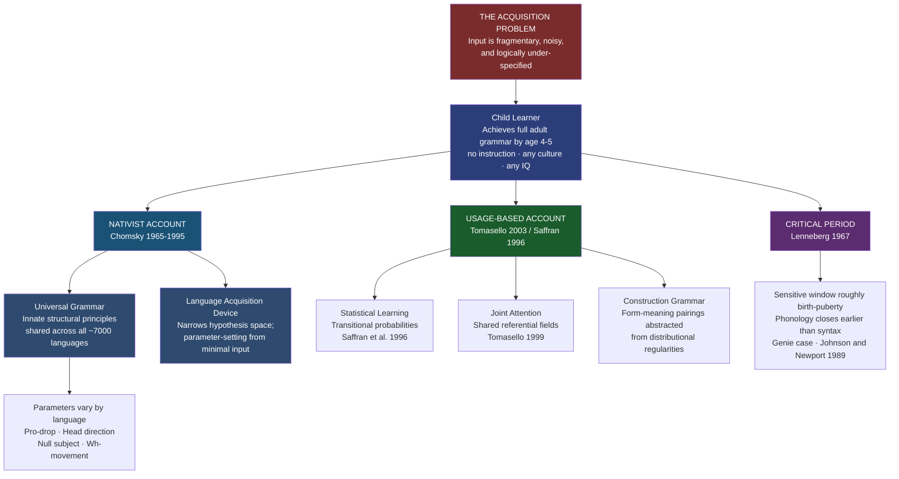

# Universal Grammar and Language Acquisition

> [!abstract] TL;DR
> Children worldwide acquire the full grammar of their native language by age 5 with no formal instruction, from noisy and incomplete input — a fact Chomsky explained by positing Universal Grammar (UG), an innate set of linguistic principles wired into every human brain, and which usage-based theorists explain through domain-general statistical learning and joint attention operating over rich input.

---

## Intuition

**Analogy:** Imagine a flat-pack furniture kit shipped to customers all over the world. The specific pieces vary by country — different woods, finishes, and hardware — but every kit ships with the same joint-logic baked into the design: pieces can only connect in structurally valid ways. No customer needs to read a theory of joinery to assemble the furniture correctly. They pick up a piece, feel where it clicks, and follow the inherent logic of the joint. Crucially, nobody ever tries to fit a shelf bracket through a tabletop — not because they've been corrected, but because the constraint is built in.

Universal Grammar is that joint-logic. Every human child arrives pre-loaded with abstract structural constraints on what language can look like: that sentences are hierarchical trees, not linear strings; that grammatical rules operate over structure, not surface order; that dependencies can span arbitrary distances as long as they respect certain boundaries. The specific vocabulary, morphology, and word order (the pieces) are acquired from the ambient language. But the deep blueprint — what counts as a grammatical joint — was already there. The remarkable thing is not that children make grammatical errors. It is the errors they never make.

---

## How It Works



---

## Key Concepts

### Secondary Level

**The acquisition problem stated plainly**

Every healthy child, in every culture, speaking any of the world's ~7,000 languages, acquires the full grammatical system of their native language by approximately age 4–5. They do this without formal instruction, without correction of grammatical errors (parents correct false facts, not bad grammar), and from an input that is fragmentary, filled with false starts, and never contains an explicit grammar rule. The input is also negative-evidence-free: nobody tells a child what sentences are impossible. Yet children almost never produce certain types of errors — errors that would be completely predictable if they were learning by simple pattern-matching or imitation.

This is the acquisition problem. It demands an explanation.

**First language acquisition milestones**

The acquisition timeline is remarkably uniform across cultures, languages, and socioeconomic contexts:

| Age | Milestone | Key feature |
|-----|-----------|-------------|
| Birth | Prefers mother's voice; recognizes prosodic contour of ambient language | Prenatal auditory experience |
| 0–6 months | Distinguishes phonemes from ALL human languages | Universal phoneme sensitivity |
| 6–8 months | Canonical babbling ("ba-ba-ga-da") | Universal: even deaf infants babble |
| 10–12 months | Babbling narrows to native language phonemes | Perceptual narrowing / neural commitment |
| 12–14 months | First words (holophrases: "up", "more", "mama") | Word-object mapping via joint attention |
| 18 months | Vocabulary explosion: ~9 new words/day | Fast-mapping: word meaning from 1–2 exposures |
| 18–24 months | Two-word stage: "Daddy gone", "More milk" | Semantic relations without function words |
| 2–3 years | Telegraphic multi-word speech; overgeneralization begins | "I goed", "my foots" — evidence of rule abstraction |
| 3–4 years | Complex sentences, questions, negatives | Function words and inflections acquired |
| 4–5 years | Near-adult grammar; conversational competence | Critical period still open for syntax |
| Adolescence | Continued development of complex embedding, metalinguistic awareness | Sensitive period winding down |

**Overgeneralization and U-shaped learning**

When a child who has been correctly saying "went" suddenly starts saying "goed," this is not a regression — it is evidence of progress. The child has abstracted the past-tense rule ("-ed") and is applying it productively, including to irregular verbs. This U-shaped learning curve — correct → incorrect → correct — is the fingerprint of rule-based acquisition. A pure imitator would never produce "goed" because it was never modeled. The child is generating a form they never heard, which means they have extracted and applied a productive rule.

**Child-Directed Speech (Motherese / Parentese)**

In most documented cultures, caregivers modify their speech when addressing infants: higher pitch, slower rate, exaggerated intonation contours, simpler vocabulary, more repetition. This is Child-Directed Speech (CDS), also called motherese or parentese (the latter term is preferred because fathers do it too). CDS:
- Captures and holds infant attention
- Highlights prosodic boundaries that map onto phrase structure
- Facilitates phoneme discrimination
- Predicts vocabulary size at age 2 (Hart and Risley 1995: the "30-million-word gap")

However, CDS is not universal. The Kaluli of Papua New Guinea do not use baby talk and do not address infants directly until they are already verbal — yet Kaluli children become fluent speakers of a complex tone language. CDS facilitates acquisition; it is not required by it.

---

### Undergraduate Level

**The poverty of the stimulus argument**

The most influential argument for innate linguistic knowledge is Chomsky's **poverty of the stimulus** (also: the logical problem of language acquisition). The claim: the input children receive is too impoverished to explain the grammatical knowledge they end up with. The argument has two components:

1. **The positive component**: children acquire grammatical rules that are not explicitly exemplified in the input.
2. **The negative component**: children do not make certain errors that would be entirely predicted by simple induction from the input.

The classic demonstration involves auxiliary inversion in questions. To form a yes/no question from a declarative sentence, English moves the auxiliary verb to the front. Consider:

> Declarative: "The man who is tall is happy."
> Correct question: "Is the man who is tall happy?" *(Move the main clause auxiliary)*

A child learning by linear order — a simple rule like "move the first auxiliary to the front" — should produce:

> *"Is the man who tall is happy?" *(Move the first auxiliary — WRONG)*

Children never produce this. They reliably apply the structure-dependent rule even though the correct and incorrect versions are equally consistent with most of the input (embedded relative clauses are rare in CDS). Children are never corrected for producing the structure-independent version because they never produce it in the first place. The only explanation that doesn't multiply hypotheses endlessly, Chomsky argues, is that children come pre-equipped with the knowledge that grammatical rules are structure-dependent, not order-dependent. This knowledge was never taught because it couldn't be learned from the data alone.

**Universal Grammar: principles and parameters**

Chomsky's nativist programme proposes that children are born with a **Language Acquisition Device (LAD)** that contains **Universal Grammar** — an abstract set of principles and parameters:

- **Principles** are invariant across all languages:
  - *Structure-dependence*: grammatical rules refer to syntactic constituents (NP, VP), never to surface position
  - *The projection principle*: lexical properties of words are projected into the syntax
  - *The X-bar schema*: all phrases have the same hierarchical structure (Specifier – Head – Complement)
  - *Subjacency* / *locality constraints*: dependencies cannot cross certain structural boundaries

- **Parameters** are binary dimensions that vary across languages, set by exposure to the target language:

| Parameter | Setting A | Setting B | Example languages |
|-----------|-----------|-----------|-------------------|
| Pro-drop | Subject required ("I think") | Subject optional ("(Io) penso") | English vs Italian/Spanish |
| Head direction | Head precedes complement (VO) | Head follows complement (OV) | English vs Japanese |
| Null subject | Overt subject obligatory | Null subject permitted | English vs Chinese |
| Wh-movement | Wh-word moves to clause-front | Wh-word stays in situ | English vs Chinese/Japanese |

The parameter-setting model makes a strong prediction: a single datum can set a parameter, triggering a cascade of syntactic changes. This explains the speed of acquisition — children are not learning an open-ended set of rules but choosing between a small set of pre-wired options.

**The Principles and Parameters model (Government and Binding / Minimalism)**

Chomsky's theoretical framework has evolved considerably since his 1965 *Aspects of the Theory of Syntax*:
- **Standard Theory** (1965): phrase structure rules + transformations
- **Extended Standard Theory** → **Government and Binding theory** (1981): modular architecture (X-bar, theta theory, case theory, binding theory) with parameters
- **Minimalist Program** (1995–present): the language faculty is optimally designed; Merge is the fundamental operation that builds hierarchical structure; all apparent complexity derives from the interface with external systems (Conceptual-Intentional and Sensorimotor)

The Minimalist Program asks: given that language must interface with thought (CI) and with sound (SM), what is the simplest computational system that satisfies both interface conditions? The answer — a single recursive operation (Merge) applying to lexical items — is startlingly parsimonious and has generated substantial cross-linguistic research on word order, agreement, and movement.

**Usage-based alternatives: statistical learning and construction grammar**

The main empirical challenge to nativism comes from two convergent research programmes:

*Statistical learning* (Saffran, Aslin & Newport 1996): 8-month-old infants can segment continuous speech into words after only 2 minutes of exposure, using nothing but **transitional probabilities** — the statistical regularity that syllables within a word follow each other more predictably than syllables across word boundaries. No knowledge of syntax is needed; distributional statistics in the input are sufficient. This finding launched the **statistical learning revolution** in cognitive science, demonstrating that domain-general learning mechanisms are far more powerful than the poverty-of-the-stimulus argument assumed.

*Tomasello's usage-based theory* (2003): children use two foundational capacities that do not require any grammar-specific module:
1. **Joint attention**: the ability to attend together with a caregiver to the same object, creating a shared referential field in which words are reliably paired with referents
2. **Intention reading**: inferring what a speaker intends to communicate (not just what they literally say)

On this foundation, children extract **constructions** — form-meaning pairings at all levels from morpheme to clause — by pattern-recognition over input. Tomasello's cross-species evidence is compelling: chimpanzees trained on lexigrams fail at joint attention and never develop productive construction grammar, even with intensive exposure. The relevant species difference is not a language-specific module but a general capacity for shared intentionality.

*Construction Grammar* (Goldberg 1995, 2006): there are no abstract phrase structure rules — only constructions, which are conventionalised form-meaning mappings. The argument construction ("Someone Xed something somewhere") is itself a meaning-bearing unit that children acquire as a whole before they can break it into abstract grammatical categories. Productivity emerges gradually as children extract more abstract schemas from specific instances.

**The critical period hypothesis (Lenneberg 1967)**

Eric Lenneberg proposed that there is a biologically determined window, ending near puberty, during which the brain retains the neural plasticity necessary for native-like language acquisition. After this window closes:
- Foreign accent becomes very difficult to eliminate
- Full morphosyntactic competence in a second language becomes rare
- Recovery from aphasia becomes much less complete

Evidence is extensive and convergent:

| Evidence type | Finding | Subsystem affected |
|---------------|---------|-------------------|
| **Genie** (discovered 1970, isolated until age 13) | Acquired vocabulary but never syntax | Grammar / morphology |
| **Johnson and Newport (1989)** | Chinese/Korean immigrants to US: monotonic decline in English grammar proficiency with increasing age of arrival; those arriving before age 7 were near-native | Morphosyntax |
| **Late ASL learners** | Native (birth) ASL signers outperform age-10 learners on grammatical processing even after decades of fluency | All subsystems |
| **Cochlear implant timing** | Implantation before 18 months yields dramatically better speech outcomes than implantation after age 7 | Phonology |
| **Foreign accent** | Phonological critical period closes earlier (~age 7) than syntax/morphology (~puberty) | Phonology vs grammar dissociation |

The modern consensus uses "sensitive period" rather than "critical period": the window is a zone of maximal efficiency and ease, not a biological on/off switch. Adults can and do reach functional fluency; they rarely achieve native-like phonological accuracy without exceptional aptitude. Crucially, different subsystems have different windows — phonology closes earlier than syntax, and morphology earlier than discourse pragmatics.

---

### Graduate Level

**The logical problem refined: learnability theory and Gold's theorem**

The poverty of the stimulus argument has a formal analogue in learnability theory. E. Mark Gold's 1967 theorem on identification in the limit shows that for certain classes of languages, a learner cannot identify the correct grammar in the limit if they are restricted to positive evidence (only grammatical sentences, no explicit negative evidence marking what is ungrammatical). Natural language syntax plausibly falls in the class where positive evidence alone is insufficient.

The implications are contested. Nativists take this as formal proof that UG is required to constrain the learner's hypothesis space. Critics point out that:
- Gold's theorem applies to worst-case learners; probabilistic learners with realistic input distributions can identify many grammars from positive evidence alone
- Natural language corpora are not random samples from a formal language; statistical regularities in input provide rich implicit negative evidence
- The **Subset Principle** (Berwick 1985) offers an alternative: always start with the most restrictive hypothesis consistent with the data, and expand only when positive evidence demands it. This may suffice without explicit negative evidence for many parameters.

The debate is live. Computational models (Bayesian grammar induction, minimum description length approaches) can acquire significant grammatical structure from unannotated corpora — but no existing model acquires the full range of syntactic phenomena that a 5-year-old controls.

**Neural and cognitive architecture of the language faculty**

What is the neural substrate of UG and the LAD? Two views:

*The specialisation view* (Chomsky, Fodor, Pinker): the language faculty is a discrete, encapsulated module — cognitively impenetrable, with its own principles and data structures. Neural evidence: the left perisylvian circuit (Broca's area, BA44/45; Wernicke's area, BA22; arcuate fasciculus) appears specialized for syntactic computation. Specific syntactic deficits (agrammatic aphasia) can occur in the absence of semantic or phonological deficits, suggesting modular organisation. The FOXP2 gene, implicated in a specific grammatical disorder (speech-language impairment in the KE family), is expressed in Broca's homologue and in the basal ganglia.

*The emergentist / connectionist view* (Elman, Bates, MacWhinney, Tomasello): there is no modular syntax faculty. Language competence emerges from the interaction of general cognitive mechanisms — working memory, pattern recognition, associative learning — applied to linguistic input. Connectionist models trained on realistic corpora acquire many grammatical generalisations without built-in syntactic primitives. Damage to these networks produces a gradient of deficit across all linguistic subsystems, not the clean dissociations predicted by modular models.

Current neuroscience supports a middle position. The left IFG is preferentially but not exclusively recruited for syntactic processing; damage to it produces syntactic deficits but not a total loss of grammar. Statistical learning recruits the basal ganglia and medial temporal lobe — domain-general learning systems. The language faculty appears to be a network that is biologically predisposed to a particular computational role but built from general-purpose components.

**The nativism-empiricism debate: current state**

The debate is no longer between "UG or nothing." The contemporary positions are:

1. **Strong nativism** (Chomsky, Berwick, Hauser): the core of language — unbounded Merge and its output — is both species-specific and biologically unique. It evolved recently (~100 kya) as a sudden saltation, not gradual adaptation. Communication (the social use of language) is secondary; internal computation (language for thought) is primary.

2. **Weak nativism** (Pinker, Jackendoff): the language faculty is species-specific but evolved gradually by natural selection for communication. It contains rich innate structure (lexical categories, phrase structure templates, argument structure), but this structure is adaptive, not a computational accident.

3. **Usage-based / construction grammar** (Tomasello, Goldberg, Croft): there are no language-specific innate primitives beyond the general capacity for shared intentionality and pattern recognition. UG is a description of the output of acquisition, not a specification of the initial state.

4. **Statistical learning + structured induction** (Yang, Pearl): children use productive statistical learning constrained by a small set of domain-general or weakly language-specific principles. The poverty of the stimulus argument is too strong — the input is far richer than Chomsky assumed once realistic corpora are examined — but it is not empty either. Some structural knowledge must be pre-specified to get acquisition started.

**Cross-linguistic variation and UG**

If UG is universal, it should constrain all languages equally. Cross-linguistic syntactic typology provides the test bed.

*Greenbergian universals* (Greenberg 1963): there are robust statistical tendencies across languages (languages with SOV word order tend to use postpositions; VO languages tend to use prepositions). Are these UG consequences or functional/statistical universals arising from general cognitive pressures?

*Radical nesting and recursion*: Chomsky, Hauser and Fitch (2002) proposed that the core unique property of human language is **recursive Merge** — the ability to embed phrases inside phrases without limit. The claim was challenged by the Pirahã controversy: Daniel Everett claimed Pirahã lacks recursion, embedding, and quantifiers. Chomsky and collaborators dispute both the data and its theoretical significance. The debate exposed the methodological difficulty of demonstrating the absence of a grammatical property.

*Semantic universals*: research in semantic typology (Berlin and Kay on colour terms; Regier, Kay and colleagues on categorical colour perception; conceptual structure primitives in the tradition of Jackendoff and Pinker) has found both universal tendencies and substantial cross-linguistic variation, suggesting partial UG coverage of the semantic-conceptual interface.

---

## Python Demo

```python
import numpy as np
import matplotlib.pyplot as plt

np.random.seed(42)

# ─────────────────────────────────────────────────────────────────────────────
# SAFFRAN, ASLIN & NEWPORT (1996) STATISTICAL LEARNING REPLICATION
#
# "Word segmentation by 8-month-old infants" — Science 274, 1926-1928
#
# Setup:
#   - 12 unique syllables forming 4 trisyllabic "words"
#   - Words are randomly concatenated into a continuous stream with no pauses
#     or any other cue to word boundaries (~600 syllables = ~2 min of speech)
#   - Compute transitional probabilities: TP(A→B) = P(B|A) = count(AB)/count(A)
#   - Within-word TPs ≈ 1.0  (each syllable has a unique successor inside its word)
#   - Across-word TPs ≈ 0.25 (4 words → last syllable branches to 4 word-onsets)
#   - Segment the stream by placing boundaries where TP falls below threshold
#
# Uses: numpy and matplotlib only
# ─────────────────────────────────────────────────────────────────────────────

# Vocabulary: 4 words × 3 syllables (12 unique syllables, no overlap)
WORDS = {
    "bidaku": ["bi", "da", "ku"],
    "padoti": ["pa", "do", "ti"],
    "golabu": ["go", "la", "bu"],
    "tupiro": ["tu", "pi", "ro"],
}
WORD_LIST = list(WORDS.values())
N_WORDS = len(WORD_LIST)

ALL_SYLLABLES = [s for w in WORD_LIST for s in w]
SYL_TO_IDX = {s: i for i, s in enumerate(ALL_SYLLABLES)}
IDX_TO_SYL = {i: s for s, i in SYL_TO_IDX.items()}
N_SYL = len(ALL_SYLLABLES)  # 12

# Within-word bigrams as a set for fast lookup
WITHIN_BIGRAMS = set()
for word in WORD_LIST:
    for pos in range(len(word) - 1):
        WITHIN_BIGRAMS.add((word[pos], word[pos + 1]))

# ─────────────────────────────────────────────────────────────────────────────
# Generate ~600-syllable (~2-minute) exposure stream
# ─────────────────────────────────────────────────────────────────────────────

rng = np.random.default_rng(42)
N_WORDS_IN_STREAM = 200  # 200 words × 3 syllables = 600 syllables

word_sequence = [WORD_LIST[rng.integers(N_WORDS)] for _ in range(N_WORDS_IN_STREAM)]
stream = [syl for word in word_sequence for syl in word]
stream_idx = [SYL_TO_IDX[s] for s in stream]

# ─────────────────────────────────────────────────────────────────────────────
# Compute transitional probabilities: TP(A→B) = count(AB) / count(A)
# ─────────────────────────────────────────────────────────────────────────────

bigrams = np.zeros((N_SYL, N_SYL), dtype=float)
unigrams = np.zeros(N_SYL, dtype=float)

for i in range(len(stream_idx) - 1):
    bigrams[stream_idx[i], stream_idx[i + 1]] += 1
    unigrams[stream_idx[i]] += 1
unigrams[stream_idx[-1]] += 1

tp_matrix = np.zeros_like(bigrams)
for a in range(N_SYL):
    if unigrams[a] > 0:
        tp_matrix[a] = bigrams[a] / unigrams[a]

# ─────────────────────────────────────────────────────────────────────────────
# Separate within-word and across-word TP values
# ─────────────────────────────────────────────────────────────────────────────

within_tps, across_tps = [], []

for word in WORD_LIST:
    for pos in range(len(word) - 1):
        a, b = SYL_TO_IDX[word[pos]], SYL_TO_IDX[word[pos + 1]]
        within_tps.append(tp_matrix[a, b])

for i, wi in enumerate(WORD_LIST):
    for j, wj in enumerate(WORD_LIST):
        a, b = SYL_TO_IDX[wi[-1]], SYL_TO_IDX[wj[0]]
        tp = tp_matrix[a, b]
        if tp > 0:
            across_tps.append(tp)

within_tps = np.array(within_tps)
across_tps = np.array(across_tps)

# ─────────────────────────────────────────────────────────────────────────────
# Segment the stream: place boundary when TP drops below midpoint threshold
# ─────────────────────────────────────────────────────────────────────────────

threshold = (within_tps.mean() + across_tps.mean()) / 2.0
tp_seq = [tp_matrix[stream_idx[i], stream_idx[i + 1]] for i in range(len(stream_idx) - 1)]

segmented, current = [], [stream[0]]
for i in range(1, len(stream)):
    tp = tp_matrix[stream_idx[i - 1], stream_idx[i]]
    if tp < threshold:
        segmented.append(tuple(current))
        current = [stream[i]]
    else:
        current.append(stream[i])
if current:
    segmented.append(tuple(current))

true_words = {tuple(w) for w in WORD_LIST}
n_correct = sum(1 for w in segmented if w in true_words)
precision = n_correct / len(segmented) if segmented else 0.0

# ─────────────────────────────────────────────────────────────────────────────
# Visualise
# ─────────────────────────────────────────────────────────────────────────────

fig, axes = plt.subplots(1, 3, figsize=(16, 5))
fig.suptitle(
    "Statistical Learning and Word Segmentation\n"
    "Replication of Saffran, Aslin & Newport (1996)",
    fontsize=12, fontweight="bold"
)

WITHIN_CLR = "#27ae60"
ACROSS_CLR = "#e74c3c"

# Panel A: TP heatmap
ax = axes[0]
im = ax.imshow(tp_matrix, cmap="Blues", vmin=0, vmax=1.0, aspect="auto")
labels = [IDX_TO_SYL[i] for i in range(N_SYL)]
ax.set_xticks(range(N_SYL))
ax.set_yticks(range(N_SYL))
ax.set_xticklabels(labels, fontsize=8)
ax.set_yticklabels(labels, fontsize=8)
ax.set_xlabel("Following syllable B", fontsize=9)
ax.set_ylabel("Current syllable A", fontsize=9)
ax.set_title("Transitional Probability Matrix\nTP(A→B) = P(B | A)", fontsize=9.5)
plt.colorbar(im, ax=ax, fraction=0.046, pad=0.04)

# Panel B: Within-word vs across-word TP distributions
ax = axes[1]
bp = ax.boxplot(
    [within_tps, across_tps],
    positions=[1, 2],
    patch_artist=True,
    widths=0.45,
    medianprops=dict(color="white", linewidth=2.2),
)
for patch, col in zip(bp["boxes"], [WITHIN_CLR, ACROSS_CLR]):
    patch.set_facecolor(col)
    patch.set_alpha(0.70)

for i, (d, col) in enumerate(zip([within_tps, across_tps], [WITHIN_CLR, ACROSS_CLR])):
    jitter = rng.uniform(-0.10, 0.10, len(d))
    ax.scatter([i + 1] * len(d) + jitter, d, color=col, alpha=0.8, s=45, zorder=5)

ax.axhline(threshold, color="navy", linestyle="--", linewidth=1.5,
           label=f"Segmentation threshold = {threshold:.3f}")
ax.set_xticks([1, 2])
ax.set_xticklabels(["Within-word\nbigrams", "Across-word\nbigrams"], fontsize=9)
ax.set_ylabel("Transitional Probability", fontsize=9)
ax.set_ylim(-0.05, 1.10)
ax.set_title(
    f"Within-word mean TP = {within_tps.mean():.3f}\n"
    f"Across-word mean TP = {across_tps.mean():.3f}",
    fontsize=9.5
)
ax.legend(fontsize=8.5)
ax.grid(alpha=0.25)

# Panel C: First 60 bigrams in stream, coloured by type, with true boundaries
N_SHOW = 60
ax = axes[2]
xs = np.arange(N_SHOW)
ys = np.array(tp_seq[:N_SHOW])

within_mask = np.array([(stream[i], stream[i + 1]) in WITHIN_BIGRAMS for i in range(N_SHOW)])
ax.bar(xs[within_mask], ys[within_mask], color=WITHIN_CLR, alpha=0.75,
       width=0.8, label="Within-word TP")
ax.bar(xs[~within_mask], ys[~within_mask], color=ACROSS_CLR, alpha=0.75,
       width=0.8, label="Across-word TP")
ax.axhline(threshold, color="navy", linestyle="--", linewidth=1.4,
           label=f"Threshold = {threshold:.3f}")

# True word boundaries fall every 3 bigrams (positions 2, 5, 8 …)
for boundary in range(3, N_SHOW, 3):
    ax.axvline(boundary - 0.5, color="gray", linestyle=":", linewidth=0.9, alpha=0.55)

ax.set_xlabel("Bigram position in stream", fontsize=9)
ax.set_ylabel("Transitional Probability", fontsize=9)
ax.set_title(
    f"TP Stream (first {N_SHOW} bigrams)\n"
    "Gray dotted lines = true word boundaries",
    fontsize=9.5
)
ax.legend(fontsize=8, loc="upper right")
ax.set_ylim(-0.05, 1.15)
ax.grid(alpha=0.2)

plt.tight_layout()
plt.savefig("saffran_statistical_learning.png", dpi=150, bbox_inches="tight")
plt.show()

# ─────────────────────────────────────────────────────────────────────────────
# Summary statistics
# ─────────────────────────────────────────────────────────────────────────────

print("=== Saffran et al. (1996) Statistical Learning Simulation ===\n")
print(f"Vocabulary   : {list(WORDS.keys())}")
print(f"Stream       : {len(stream)} syllables from {N_WORDS_IN_STREAM} word tokens\n")

print("Transitional Probabilities:")
print(f"  Within-word   mean = {within_tps.mean():.3f}  "
      f"range [{within_tps.min():.3f}, {within_tps.max():.3f}]")
print(f"  Across-word   mean = {across_tps.mean():.3f}  "
      f"range [{across_tps.min():.3f}, {across_tps.max():.3f}]")
print(f"\nWithin-word bigrams:")
for word in WORD_LIST:
    for pos in range(len(word) - 1):
        a, b = word[pos], word[pos + 1]
        tp = tp_matrix[SYL_TO_IDX[a], SYL_TO_IDX[b]]
        print(f"  {a}→{b}:  TP = {tp:.3f}")

print(f"\nSegmentation threshold  : {threshold:.3f}")
print(f"Total segments produced : {len(segmented)}")
print(f"Correct word matches    : {n_correct} / {len(segmented)}  "
      f"(precision = {precision:.1%})")
print("\nKey result: within-word TPs ≈ 1.0, across-word TPs ≈ 0.25.")
print("8-month-old infants replicate this segmentation after 2 min exposure.")
print("No syntactic knowledge required — distributional statistics suffice.")
```

**What the simulation shows:**

- **Panel A (TP matrix):** The matrix is almost block-diagonal. High-probability cells appear only within the 3-syllable clusters corresponding to each word. The visual structure is impossible to miss even without knowing the vocabulary.
- **Panel B (distributions):** Within-word TPs cluster near 1.0; across-word TPs cluster near 0.25 (each word-final syllable branches to four possible word-initial syllables). The two distributions are cleanly separated. A threshold at their midpoint correctly identifies word boundaries with high precision.
- **Panel C (stream):** The TP valley at every 3rd position is perfectly regular. The learner needs only to detect low-TP transitions and call them word boundaries. Saffran et al.'s 8-month-olds did exactly this after 2 minutes of exposure — demonstrating that domain-general statistical learning is a powerful word segmentation mechanism that requires no pre-specified grammar.

---

## Real-World Applications

> **Example 1 — Second language instruction and the critical period.** The Johnson and Newport (1989) study of Chinese and Korean immigrants to the US found a monotonic decline in ultimate English grammatical attainment as a function of age of arrival. Those who arrived before age 7 scored at or near native level on grammatical judgement tasks; those who arrived after puberty plateaued at a level indistinguishable from adult classroom learners. The practical implication is significant: immersion programmes beginning before age 7 (ideally before age 5 for phonological accuracy) can approach native-like outcomes, while programmes starting in secondary school reliably leave traces of L1 grammar and accent regardless of motivation or instruction quality. This is why most linguists recommend early-childhood bilingual education rather than secondary-school foreign language instruction for producing functional bilinguals.

> **Example 2 — Cochlear implant timing and the language faculty.** Congenitally deaf children who receive cochlear implants before 18 months achieve substantially better spoken-language outcomes than those implanted at age 3–4, who in turn outperform those implanted after age 7. The primary auditory cortex, if not stimulated by auditory input during the sensitive period, reorganises to process tactile and visual information and becomes committed to non-auditory processing — a process called **cross-modal plasticity**. Once this reorganisation occurs, auditory input provided by the implant must compete with an established cortical architecture. The poverty-of-the-stimulus argument has a direct correlate here: the auditory system, like the syntactic system, arrives pre-wired for a specific type of input and degrades in its capacity to process that input if the input is absent during a critical window. The clinical consensus — early implantation combined with full linguistic access (spoken and signed) — follows directly from the critical period hypothesis.

> **Example 3 — Natural language processing and the statistical learning revolution.** The Saffran et al. (1996) result had immediate implications for computational linguistics. If transitional probabilities are sufficient for word segmentation, then unsupervised statistical models should be able to learn word boundaries from raw text. This insight contributed to the development of n-gram language models, the revival of Bayesian approaches to grammar induction, and ultimately the distributional hypothesis underlying word embeddings (Word2Vec, GloVe) — the idea that a word's meaning can be recovered from the statistical context in which it appears. Modern large language models are, in a sense, a scaled-up demonstration of statistical learning: given sufficient data, patterns in distributional statistics can approximate a rich representation of syntactic and semantic structure. Whether this means children are doing something similar (Tomasello's position) or that LLMs are doing something entirely different from human language acquisition (Chomsky's position) is a live debate with no settled answer.

> **Example 4 — Feral children and the critical period: the Genie case.** In November 1970, a 13-year-old girl named Genie was discovered in Los Angeles. She had been confined to a small room and beaten whenever she made sounds since the age of 20 months. She had never acquired language. After years of intensive instruction, Genie acquired a substantial vocabulary and could communicate basic needs, but she never acquired morphology or syntax: no past tense, no passive, no relative clauses, no question formation. Neuroimaging showed atypically right-lateralised language processing — her right hemisphere had partially taken over language functions, but without the neural architecture that left-hemisphere dominance provides for complex syntax. The case is the most frequently cited evidence for a critical period specifically for syntax, though it is multiply confounded (abuse, malnutrition, inconsistent post-discovery care) and cannot be interpreted as a clean critical period experiment.

---

## Common Pitfalls

- **Confusing competence with performance** — Chomsky's UG is a theory of linguistic *competence* (the abstract knowledge a speaker has) not *performance* (actual language use). Children's speech errors, disfluencies, and failures to produce complex structures do not contradict UG; they reflect performance limitations (working memory, attention). The poverty of the stimulus argument concerns competence: children have syntactic knowledge they have never demonstrated in output and could not have induced from input.

- **Treating the poverty of the stimulus argument as empirically settled** — The argument depends critically on claims about what is in the input. Early versions assumed a very impoverished input; corpus analyses (Pullum and Scholz 2002; Kam et al. 2008) have found that many supposedly unavailable structures do appear in realistic child-directed speech. The argument is more credible for some phenomena (structure-dependent auxiliary inversion) than others. Always distinguish the logical form of the poverty argument from its empirical application to specific constructions.

- **Overstating the critical period as a hard cutoff** — The popular version ("you cannot learn a language after puberty") is wrong. Adults learn languages successfully; they almost never achieve native-like phonological accuracy or fully automatic morphosyntax without exceptional circumstances. The critical period sets a ceiling on ultimate attainment and a floor on required effort; it does not prevent acquisition entirely. Different subsystems close at different ages, and individual variation is substantial.

- **Assuming UG is a single specific theory** — "Universal Grammar" is a research programme, not a single testable hypothesis. Chomsky's specific proposals have changed dramatically from the Standard Theory (1965) through Government and Binding (1981) to the Minimalist Program (1995–present). A critique of Standard Theory transformations does not refute Minimalism; an endorsement of parameter-setting does not commit you to the Strong Minimalist Thesis. Be precise about which version of nativism is being evaluated.

- **Conflating statistical learning with a full account of syntax acquisition** — The Saffran et al. result demonstrates statistical learning of word boundaries, not of phrase structure, long-distance dependencies, or argument structure alternations. Usage-based theorists must show how the same mechanisms scale up to the full range of adult syntactic competence — a significant empirical programme still in progress. Statistical learning is a necessary condition for language acquisition; whether it is sufficient is the open question.

- **The Genie case as definitive proof** — Genie's case is powerful but multiply confounded. She suffered severe physical abuse and social deprivation as well as language deprivation; she had inconsistent post-discovery care; and we do not know her pre-deprivation cognitive profile. The case provides converging evidence for the critical period but cannot stand alone as clean experimental proof. Victoria, Chelsea, and other late first-language learners provide independent support, but the sample is inevitably small.

---

## Related Concepts

- [[Language_Development]] — Developmental psychology's detailed account of acquisition milestones, overgeneralization, and the critical period; the empirical backbone that the nativist-empiricist debate is adjudicating
- [[Language_Socialization_and_Acquisition]] — Anthropological lens: how language acquisition is embedded in cultural practice; the Kaluli data challenging CDS universality; Vygotsky and Tomasello situated in cross-cultural fieldwork
- [[Language_and_the_Brain]] — The neural substrate of syntax and the LAD; Broca's area and syntactic computation; the dual-stream model; FOXP2 and genetic architecture of the language faculty; the critical period's neural mechanism (cortical lateralization, GABA/glutamate balance)

---

## Review Questions

### Secondary

1. A 2-year-old says "I goed to the park" even though her parents have never said "goed." What does this tell us about how she is acquiring grammar — is she imitating adult speech, or doing something more interesting? What would a nativist say, and what would a usage-based theorist say, about this example?

2. Explain the poverty of the stimulus argument in your own words. Use the example of auxiliary inversion ("Is the man who is tall happy?" vs. the impossible "*Is the man who tall is happy?") to illustrate why the correct rule could not have been learned by simple linear pattern-matching.

3. What is the critical period for language, and what is the evidence for it? If the critical period is real, what are the practical implications for language education policy — at what age should schools start teaching foreign languages?

### Undergraduate

1. Chomsky's nativist programme and Tomasello's usage-based theory both account for the speed and uniformity of language acquisition. Compare them on three dimensions: (a) what is innate versus learned, (b) what counts as evidence, and (c) what the role of social interaction is. Which account better accommodates the Saffran et al. (1996) statistical learning result, and which better accommodates the poverty-of-the-stimulus argument? Can they be integrated?

2. The parameter-setting model predicts that acquiring one parameter value should trigger a cascade of related syntactic changes — not a gradual, piecemeal learning of individual constructions. Design a study that could test this prediction against the usage-based prediction that acquisition is item-by-item and construction-specific. What data would confirm the parameter-setting account, and what would refute it?

3. The Genie case is the most famous evidence for the critical period for syntax. Identify three methodological confounds that make it difficult to interpret, and describe what a cleaner test of the critical period hypothesis would require. Given that such a test is ethically impossible, what convergent evidence would you use instead to strengthen or weaken the critical period claim?

### Graduate

1. Gold's (1967) theorem on identification in the limit shows that certain classes of languages cannot be learned from positive evidence alone. Nativists take this as formal support for UG; critics argue that the theorem applies to worst-case learners and that probabilistic learners with realistic input distributions face a much easier problem. Evaluate both responses. Does the learnability argument, properly formulated, support strong nativism, weak nativism, or some form of usage-based learning with soft constraints? What empirical or computational evidence would shift your assessment?

2. Chomsky, Hauser and Fitch (2002) proposed that recursive Merge — the ability to embed structures inside structures without limit — is the core unique property of human language. Pinker and Jackendoff (2005) responded that this was too minimal, that many other language-specific properties exist that a Minimalist account cannot explain. Reconstruct both sides of this debate and evaluate the empirical evidence for and against the Strong Minimalist Thesis. What would it mean for the evolution of language if Merge were indeed the only language-specific cognitive innovation?

3. Modern large language models (GPT, Gemini) are trained on text corpora via statistical prediction and achieve remarkable grammatical fluency without explicit syntactic supervision. Chomskyan critics argue this shows only that transformers can memorise patterns, not that they have acquired grammar in any psychologically meaningful sense; Tomasello-aligned researchers argue that the success of LLMs undermines the poverty-of-the-stimulus argument. Evaluate both positions. What would it take — methodologically and empirically — to determine whether LLMs' grammatical competence is structurally similar to, or fundamentally different from, the competence acquired by children?

---

## Sources

- [Chomsky, N. (1965). *Aspects of the Theory of Syntax*. MIT Press](https://mitpress.mit.edu/books/aspects-theory-syntax)
- [Chomsky, N. (1981). *Lectures on Government and Binding*. Foris Publications](https://www.goodreads.com/book/show/1047423.Lectures_on_Government_and_Binding)
- [Chomsky, N. (1995). *The Minimalist Program*. MIT Press](https://mitpress.mit.edu/books/minimalist-program)
- [Saffran, J.R., Aslin, R.N. & Newport, E.L. (1996). Statistical learning by 8-month-old infants. *Science*, 274(5294), 1926–1928](https://doi.org/10.1126/science.274.5294.1926)
- [Lenneberg, E.H. (1967). *Biological Foundations of Language*. Wiley](https://www.goodreads.com/book/show/186812.Biological_Foundations_of_Language)
- [Johnson, J.S. & Newport, E.L. (1989). Critical period effects in second language learning. *Cognitive Psychology*, 21(1), 60–99](https://doi.org/10.1016/0010-0285(89)90003-0)
- [Tomasello, M. (2003). *Constructing a Language: A Usage-Based Theory of Language Acquisition*. Harvard University Press](https://www.hup.harvard.edu/catalog.php?isbn=9780674017641)
- [Tomasello, M. (1999). *The Cultural Origins of Human Cognition*. Harvard University Press](https://www.hup.harvard.edu/catalog.php?isbn=9780674005822)
- [Goldberg, A.E. (1995). *Constructions: A Construction Grammar Approach to Argument Structure*. University of Chicago Press](https://press.uchicago.edu/ucp/books/book/chicago/C/bo3613637.html)
- [Goldberg, A.E. (2006). *Constructions at Work: The Nature of Generalization in Language*. Oxford University Press](https://global.oup.com/academic/product/constructions-at-work-9780199268511)
- [Hauser, M.D., Chomsky, N. & Fitch, W.T. (2002). The faculty of language: What is it, who has it, and how did it evolve? *Science*, 298, 1569–1579](https://doi.org/10.1126/science.298.5598.1569)
- [Pinker, S. & Jackendoff, R. (2005). The faculty of language: What's special about it? *Cognition*, 95, 201–236](https://doi.org/10.1016/j.cognition.2004.08.004)
- [Pinker, S. (1994). *The Language Instinct*. William Morrow](https://www.goodreads.com/book/show/5765.The_Language_Instinct)
- [Gold, E.M. (1967). Language identification in the limit. *Information and Control*, 10(5), 447–474](https://doi.org/10.1016/S0019-9958(67)91165-5)
- [Hart, B. & Risley, T.R. (1995). *Meaningful Differences in the Everyday Experience of Young American Children*. Brookes Publishing](https://www.goodreads.com/book/show/186843.Meaningful_Differences)
- [Pullum, G.K. & Scholz, B.C. (2002). Empirical assessment of stimulus poverty arguments. *The Linguistic Review*, 19(1–2), 9–50](https://doi.org/10.1515/tlir.19.1-2.9)
- [Yang, C. (2004). Universal Grammar, statistics or both? *Trends in Cognitive Sciences*, 8(10), 451–456](https://doi.org/10.1016/j.tics.2004.08.006)
- [Greenberg, J.H. (1963). Some universals of grammar with particular reference to the order of meaningful elements. In *Universals of Language*, MIT Press](https://mitpress.mit.edu/books/universals-language)

---

#Linguistics #MorphologySyntax #UniversalGrammar #LanguageAcquisition #PovertyOfStimulus #LAD #Chomsky
