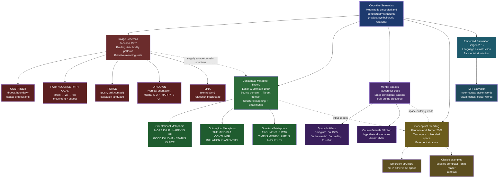

> [!abstract] TL;DR
> Cognitive semantics holds that meaning is grounded in embodied physical experience rather than in abstract symbol-world relations; its centerpiece — Conceptual Metaphor Theory (Lakoff & Johnson 1980) — shows that abstract domains such as time, argument, and morality are understood through systematic structural mappings from concrete bodily experience, with image schemas as the primitive building blocks, mental spaces as the discourse-level architecture, and conceptual blending as the engine of novel meaning-construction.

---

## Intuition

**Analogy:** When a doctor says a tumour is "invading" surrounding tissue, a stock trader says the market is "climbing," and a philosopher says an argument "collapsed under scrutiny," they are not reaching for decorative colour. They are doing what human minds always do: understanding invisible, intangible domains — disease progression, financial value, logical validity — through the structure of visible, physical experience (invasion, climbing, collapsing). Remove these mappings and the sentences become literally unsayable.

This is the central insight of cognitive semantics. Abstract thought is not a free-floating formal manipulation of symbols; it is built out of, and remains structured by, concrete bodily experience. The body does not merely house the mind — it shapes the very concepts the mind can form. "Grasping" an idea, "seeing" what someone means, "standing firm" in one's beliefs, "weighing" the evidence: each expression is a window onto the embodied scaffolding of abstract cognition. The mappings are so pervasive that we have stopped noticing them as mappings at all, which is why it took linguists and philosophers until 1980 to systematically document what ordinary speakers do in every sentence.

---

## How It Works



The diagram maps the five major theoretical components of cognitive semantics. Image schemas form the primitive layer, supplying the source-domain structure that Conceptual Metaphor Theory organises into cross-domain mappings. Those mappings become the input spaces that Conceptual Blending elaborates into novel constructions with emergent properties. Mental spaces provide the discourse-level architecture within which all of this operates, and Embodied Simulation supplies the neural evidence that these processes involve genuine motor and perceptual engagement rather than amodal symbol manipulation.

---

## Key Concepts

### Secondary Level

**Why cognitive semantics challenges the traditional picture**

The dominant view in Western philosophy from Aristotle through Frege and the early Chomsky treated meaning as a formal relation between symbols and objective categories in the world. Words referred to things; sentences were true or false depending on whether they corresponded to states of affairs; logic was the calculus of meaning. On this view — sometimes called *objectivism* or the *conduit metaphor of communication* — meanings are packages transferred between speaker and hearer, and abstract thought is fundamentally non-bodily.

Cognitive semantics rejects this picture on empirical grounds. Language does not carve nature at its joints; it carves it at the joints that matter to embodied creatures with our specific perceptual systems, motor apparatus, and social environment. The concepts we have, and the way they are structured, reflect what it is like to be a human body moving through a physical and social world — not the mind-independent logical structure of reality.

**What is a conceptual metaphor?**

A *conceptual metaphor* is a systematic mapping from one conceptual domain (the *source* domain, typically concrete and bodily) onto another (the *target* domain, typically abstract). The mapping preserves the relational structure of the source domain: if A is related to B in the source, then the concept that corresponds to A is related to the concept that corresponds to B in the target.

The most famous example: **ARGUMENT IS WAR**

| Source domain: WAR | Target domain: ARGUMENT |
|---|---|
| weapons | logical evidence / rhetorical devices |
| attack | challenge a claim |
| defend | uphold a position |
| win / lose | convince / fail to convince |
| strategy | rhetorical approach |
| territory | established position |
| casualties | conceded points |
| truce | agree to disagree |

Linguistic evidence: *"He attacked every weak point in my argument." "She defended her thesis brilliantly." "He shot down all my objections." "I've never won an argument with her." "Your claims are indefensible." "I demolished his position."*

Crucially, this is not merely a linguistic convention — it is a conceptual mapping. English speakers do not merely *talk about* arguments as if they were wars; they *reason about* arguments using the same structure. They experience an argument as a context in which you can win or lose, in which strategies matter, in which some positions are defensible and others are exposed. The conceptual metaphor structures the entire cognitive experience of argumentation.

**Three types of conceptual metaphors**

Lakoff and Johnson identified three types, reflecting how the bodily source domain relates to the abstract target:

1. **Orientational metaphors** organise whole systems of concepts in terms of spatial orientation — up/down, front/back, in/out — derived from bodily experience of posture and movement:
   - MORE IS UP: *"Turn it up a notch; output is rising; the budget climbed."*
   - HAPPY IS UP: *"She's on cloud nine; I'm feeling up today; my spirits lifted."*
   - GOOD IS LIGHT: *"A bright future; shady dealings; he shed light on the problem."*
   - STATUS IS SIZE: *"A big man in town; she's a giant in her field."*
   
   The bodily grounding is direct: piling objects up increases height; erect posture correlates with health and positive states; slumped posture with illness and sadness; daylight with safety; darkness with danger.

2. **Ontological metaphors** take abstract domains and treat them as objects, substances, or entities, making them quantifiable, manipulable, and locatable:
   - THE MIND IS A CONTAINER: *"He's got a lot on his mind; ideas are floating around in his head; I can't get it out of my head."*
   - INFLATION IS AN ENTITY: *"We need to fight inflation; inflation is driving up prices; we can't slow inflation down."*
   - TIME IS AN OBJECT: *"I found some time; I've lost three hours; time is slipping away."*

3. **Structural metaphors** are the richest type: they map the *entire internal structure* of one domain onto another:
   - ARGUMENT IS WAR (as above)
   - TIME IS MONEY: *"Don't waste my time; I've invested a lot of time in this; I've saved a few minutes."*
   - LIFE IS A JOURNEY: *"She's at a crossroads; he's gone off the rails; we've come a long way together."*
   - THEORIES ARE BUILDINGS: *"That argument is shaky; we need to build a stronger foundation; the whole theoretical edifice collapsed."*

**Why conceptual metaphors are invisible**

The most counterintuitive finding is that the most fundamental conceptual metaphors are *not felt as metaphors at all*. When you say "I see what you mean" or "the price went up" or "let's move on," you are not aware of speaking metaphorically. The reason is that conceptual metaphors are not rhetorical ornaments applied to pre-existing literal concepts — they *are* the concepts. For many abstract domains, there is no independent, non-metaphorical way of thinking about them. The only cognitive tools we have for thinking about argument, time, ideas, morality, and emotion are the structural mappings from bodily experience. This is why the same metaphors recur across cultures that have had no contact — not because they are borrowed, but because they are motivated by the same universal bodily experience.

---

### Undergraduate Level

**Image schemas: the primitive building blocks**

*Image schemas* (Mark Johnson, *The Body in the Mind*, 1987) are recurrent, pre-linguistic patterns of bodily interaction with the environment that serve as the cognitive substrate for conceptual structure. They are not images in the visual sense but abstract kinesthetic-spatial patterns that are continually enacted through embodied experience.

Key image schemas and the language they ground:

| Image schema | Core pattern | Language it structures |
|---|---|---|
| CONTAINER | bounded region with interior / exterior / boundary | in, out, into, outside, contained, enclosed, penetrate, overflow |
| PATH / SOURCE-PATH-GOAL | movement from origin through trajectory to endpoint | from, to, via, through, reach, arrive, leave, approach |
| FORCE | energy applied to produce motion or resistance | push, pull, drive, compel, prevent, resist, yield, overcome |
| UP-DOWN | vertical axis relative to gravitational field | rise, fall, high, low, elevated, depressed, above, below |
| LINK | connection between two entities | connect, attach, bind, separate, sever, network, related |
| BALANCE | equal distribution around a centre point | fair, just, weigh, compensate, lopsided, equilibrium |
| PART-WHOLE | structure composed of components | member, component, organ, whole, complete, fragment |
| CENTRE-PERIPHERY | gradient from focal centre to edges | central, peripheral, core, fringe, marginal, focus |

Image schemas are *pre-linguistic*: developmental psychologists (Mandler 1992; Spelke 1994) have documented that infants represent containment, path, and contact schemas before they acquire language. A 4-month-old infant shows surprise when an object passes through a solid barrier (violation of CONTAINMENT) long before acquiring the word "through." This pre-linguistic grounding is what makes image schemas the appropriate candidate for the universal cognitive substrate of language and thought.

The spatial prepositions of any language are a dense inventory of image schemas. English *through* activates the PATH schema with a CONTAINER traversal; *across* activates PATH with a planar SURFACE; *out of* is a PATH that exits a CONTAINER. When Lakoff and Johnson say that understanding emotion as "in" or "out of" our control invokes the CONTAINER schema, they are claiming that the prepositional grammar of spatial containment is literally the cognitive structure through which we understand control.

**Prototype theory and the cognitive commitment**

Cognitive semantics does not operate in isolation: it is part of a broader *cognitive linguistics* programme committed to two theses. The *cognitive commitment* says that the principles of linguistic structure should reflect what is known from cognitive science about general cognitive organisation. The *generalization commitment* says that the same principles should account for patterns across grammatical levels (phonology, morphology, syntax, semantics, pragmatics).

Eleanor Rosch's *prototype theory* (1973–78) is the empirical foundation for the cognitive account of concepts that cognitive semantics presupposes. Categories are not defined by necessary and sufficient conditions (the classical view) but are organized around *prototypical* instances. Chairs have graded membership: a kitchen chair is a more prototypical chair than a dentist's chair, which is more prototypical than a car seat, which is more prototypical than a swing. This gradient structure is exactly what cognitive semantics predicts for metaphorically extended concepts: LIFE IS A JOURNEY produces central cases (pivotal life decisions as "crossroads") and peripheral cases (minor daily decisions as "small steps"), not a binary in/out boundary.

**Mental spaces: the discourse-level architecture (Fauconnier 1985)**

While Conceptual Metaphor Theory accounts for stable conceptual mappings, Gilles Fauconnier's *mental spaces* theory accounts for meaning-construction during the moment-to-moment flow of discourse.

A *mental space* is a small conceptual packet — a partial model of the domain being talked about — that is activated and enriched as discourse proceeds. Mental spaces are not long-term memory structures (like the domains of CMT) but working constructs built and modified online.

*Space-builders* are linguistic expressions that open or navigate to a new mental space:
- Temporal: *"In 1985, the president was Reagan."*
- Epistemic: *"According to the conspiracy theory, the moon landing was faked."*
- Modal: *"In her dream, she was flying."*
- Conditional: *"If the Republicans win, the policy changes."*
- Imaginative: *"In the movie, the hero falls in love."*

Each space-builder opens a new mental space that is *projected* from a base space but has its own internal structure. The sentence "In the painting, the woman is pointing at you" opens a representational space in which the woman exists; she does not exist in the physical space of the painting (which is canvas and paint). Crucially, we can compare entities across spaces (the Mona Lisa *is* a woman, even though she is also paint) — this is what Fauconnier calls *cross-space mapping* via *identification principles*.

Mental spaces explain counterfactuals naturally: *"If Napoleon had won at Waterloo, Europe would look very different today"* opens a hypothetical mental space with Napoleon as the victor; reasoning proceeds within that space using normal inference but does not contaminate our beliefs about the actual world. Without mental space architecture, it is impossible to explain how we can reason coherently about possibilities that we simultaneously know to be false.

**Cross-cultural variation in conceptual metaphors**

The CMT framework predicts a division between *primary* and *complex* metaphors (Grady 1997):
- *Primary metaphors* are directly motivated by universal correlations in embodied experience: AFFECTION IS WARMTH (because physical warmth from caregivers co-occurs with emotional affection); KNOWING IS SEEING (because we get information primarily through vision); MORE IS UP (because quantities of physical substance increase in height when accumulated). These should be universal.
- *Complex metaphors* are built from combinations of primary metaphors and are elaborated within specific cultural contexts: TIME IS MONEY is built from several primary metaphors but its full elaboration (time has a precise price, time is scarce, wasting time is a moral failing) is specific to industrialised capitalist cultures. Tribal societies with no wage labour do not develop this elaboration.

Cross-linguistic evidence strongly supports this division:
- The **TIME IS SPACE** metaphor is universal, but the spatial axis varies: in English, time moves horizontally from left to right (or towards us from behind). In Mandarin, a vertical axis is also available (earlier events are "up," later ones "down"). In Aymara (Andean), the future is *behind* the speaker and the past is *in front* — because the past is visible (known) and the future is unseen; the ego-moving-through-time vs. time-moving-past-the-ego metaphors differ in their presuppositions about agency and knowledge.
- The **ARGUMENT IS WAR** metaphor is strong in competitive, adversarial discourse cultures but weaker in others. Lakoff proposed that **ARGUMENT IS A COLLABORATIVE JOURNEY** (we explore a problem together, we arrive at shared positions) is a conceptually available alternative that different cultures activate to different degrees.
- **Colour-emotion metaphors** vary systematically with cultural colour symbolism: the ANGER IS RED metaphor is attested in English, Hungarian, and Mandarin; but in some cultures anger is associated with heat rather than colour, and the specific hue varies.

---

### Graduate Level

**Conceptual blending theory (Fauconnier & Turner 2002)**

Conceptual Metaphor Theory operates with two-domain mappings: a source domain maps onto a target domain. But many striking cases of meaning construction involve *more than two* input spaces and produce structure that is present in neither input. Fauconnier and Turner's *conceptual blending* theory provides the more general architecture.

The blending network has four spaces:
1. **Input space 1** — one conceptual domain
2. **Input space 2** — a second conceptual domain
3. **Generic space** — the abstract structure shared by both inputs (what makes the mapping possible)
4. **Blended space** — a new space that inherits selectively from both inputs and develops *emergent structure* that exists in neither

The emergent structure is the key contribution: properties that belong to neither input alone but arise from the integration of the two. This is what makes blending more powerful than mere metaphor.

**Example 1 — The desktop computer interface**

Input 1: Physical office (files, folders, a desktop surface, a trash can, a filing cabinet, cutting and pasting paper)
Input 2: Computer data operations (stored data objects, directories, deleted files, the screen display, clipboard buffer operations)
Generic space: organised manipulation of information objects
Blend: the GUI desktop, with metaphorical files you drag to a metaphorical trash can to delete, metaphorical folders you open, a clipboard you cut-and-paste from

Emergent properties: files can be "in" multiple folders simultaneously (impossible with physical folders); you can "undo" the deletion of a file (you cannot un-crumple paper); the trash can holds items until you "empty" it (physical trash is removed immediately). The blend has its own rules, derived neither from physical offices nor from raw computer operations.

**Example 2 — The Grim Reaper**

Input 1: DEATH (an abstract, impersonal process)
Input 2: A HUMAN AGENT (a farmer with a scythe, harvesting)
Generic space: an agent performing a systematic, sequential action on multiple patients
Blend: a skeletal humanoid figure with a scythe who "comes for" individuals, can be bargained with or outwitted, arrives at a specific time

Emergent properties: death has intentions, a schedule, and an identity — which is why every human culture has death-deity narratives (Anubis, Yama, Azrael) built on this or equivalent blends. The blend creates the cognitive infrastructure for personified death in religion, literature, and folk belief.

**Example 3 — "Safe sex"**

Input 1: SEX (an intimate activity)
Input 2: SAFETY (protective behaviour against physical danger, e.g., wearing a helmet)
Generic space: an intentional agent engaging in an activity with potential negative outcomes
Blend: an activity in which one actively manages risks through precautionary practices

Emergent: the entire conceptual infrastructure of "practicing safe sex" — you don't just have sex and avoid danger, you *practice* safety as an ongoing skill, you use "protection" as a category of equipment, there is a "safe" and "unsafe" version of the activity. This conceptual infrastructure did not exist before the AIDS crisis; the blend was constructed in the 1980s and rapidly institutionalised.

**Primary vs. complex metaphors (Grady 1997)**

Joseph Grady's refinement of CMT distinguishes:
- *Primary metaphors*: one-to-one mappings directly motivated by *subjective* and *sensorimotor* correlation in experience. DIFFICULTY IS HEAVINESS (lifting heavy things requires more effort; performing difficult tasks feels effortful — the same felt quality is recruited). INTIMACY IS CLOSENESS (we are physically closer to those we are emotionally close to — constant co-occurrence creates the mapping). These are irreducible and universal.
- *Complex metaphors*: compositional structures built from multiple primary metaphors by blending and elaboration. LIFE IS A JOURNEY = PURPOSES ARE DESTINATIONS + MEANS ARE PATHS + DIFFICULTIES ARE IMPEDIMENTS + TIME IS MOTION TOWARD A GOAL + ... Each component is a primary metaphor; the complex metaphor assembles them into a coherent scenario.

This decomposition has methodological value: it explains why complex metaphors vary cross-culturally (different cultures elaborate the primary components differently) while primary metaphors are universal (they are directly grounded in universal features of human embodiment and the environment).

**Embodied simulation and neural evidence (Bergen 2012)**

The *Simulation Semantics* hypothesis (Bergen, *Louder Than Words*, 2012) provides the neural mechanism for the embodied-meaning claims of cognitive semantics. The proposal: understanding language involves running offline mental simulations of the events or situations described, using the same neural systems that would be active during actual perception and action.

Empirical evidence from functional neuroimaging:
- **Motor cortex activation**: reading action sentences ("The carpenter nailed the board"; "The ballerina kicked the wall") activates the motor cortex in a *body-part-specific* way — hand-action sentences activate the hand area; foot-action sentences activate the foot area. This is predicted by simulation semantics and is inexplicable on purely amodal-symbol views.
- **Visual cortex activation**: reading sentences that describe visual scenes activates early visual cortex. Reading colour-specific sentences ("The Volkswagen is red") activates colour-processing regions; reading form-specific sentences activates shape-processing regions.
- **Spatial imagery in sentence comprehension**: when readers process sentences with implicit spatial orientation ("He looked up at the eagle"; "He looked down at the ant"), their responses to visual probes that appear in the corresponding spatial position are faster — they are literally simulating the visual perspective.
- **Haptic and proprioceptive simulation**: reading about grasping activates grasp-related somatosensory areas; reading about rough textures activates somatosensory cortex in a texture-sensitive way.

Bergen's key theoretical claim: "Language is a set of instructions for constructing meaning in the mind/brain." Words and sentences are not meanings in themselves — they are instructions that cause the brain to simulate the relevant experience, and *that simulation is the meaning*. This means that understanding "the ballerina kicked the wall" requires running a partial motor simulation of kicking, even if one has never been a ballerina.

**Critiques of Conceptual Metaphor Theory and responses**

CMT has attracted substantial criticism:

1. **The directionality problem** (Glucksberg 2008): some apparent source-to-target mappings can equally be described in the reverse direction. Is it ARGUMENT IS WAR, or has warfare been conceptualised in terms of argumentation? CMT advocates respond that the primacy direction is empirically determined by which domain is more concrete and more routinely used as source — the physiological groundedness test: war involves actual physical force and threat to life, which is more directly bodily than abstract logical challenge.

2. **The invariance hypothesis challenge**: Lakoff proposed that structure is mapped invariantly from source to target (preserving relational structure). Critics showed that not all structural features transfer: ARGUMENT IS WAR does not entail that arguments involve physical death, that combatants are in uniform, or that there are non-combatant civilians. Lakoff and Turner (1989) revised this to a *partial* invariance claim — what gets mapped is the *relational structure* (not surface features), and what does not map is excluded by the specific topology of the target domain.

3. **The polysemy problem** (Murphy 1996): linguistic expressions that appear to reflect conceptual metaphors often do not. *"The road goes through the village"* uses *through* — normally a CONTAINER-traversal schema — but no one understands a road as going "inside" the village. The word is polysemous (not everything licensed by a schema is a genuine schema activation). Cognitive semanticists respond with corpus analysis: systematic patterns across a domain are evidence for the metaphor; isolated polysemy is not.

4. **The embodiment hypothesis is too strong** (Mahon & Caramazza 2008): the fMRI data for embodied simulation are consistent with multiple interpretations, including that motor cortex activation is *downstream* of symbolic semantic processing rather than constitutive of it. The debate between *strong* embodiment (motor activation *is* meaning) and *weak* embodiment (motor activation is an *associated* simulation) remains unresolved.

**Frame semantics and Construction Grammar (Fillmore, Goldberg)**

Charles Fillmore's *Frame Semantics* is closely related to cognitive semantics: words evoke *frames* — structured background knowledge representations — and meaning is understood against those frames. The word "murder" evokes a frame with roles (killer, victim, instrument, manner) and background presuppositions (intentionality, unlawfulness). Adele Goldberg's *Construction Grammar* integrates this insight: grammatical constructions (the ditransitive, the resultative, the caused-motion construction) are themselves form-meaning pairings that activate frames and interact with the cognitive metaphor system. This means the syntax-semantics interface is not a compositional grammar applied to concepts but a network of constructions, each with its own embodied-experiential grounding.

---

## Python Demo

```python
import numpy as np
import matplotlib.pyplot as plt

# Visualise ARGUMENT IS WAR as a source-to-target bipartite mapping graph.
# Panel 1 (top): Source domain nodes (WAR) mapped to target domain nodes
#                (ARGUMENT) with arrows annotated by linguistic evidence.
#                The arrow structure shows that the mapping preserves
#                relational structure: if A attacks B using C in the source,
#                then A challenges B's claim using evidence C in the target.
# Panel 2 (bottom): Blended-space entailments — emergent structure present
#                   in neither the WAR nor the ARGUMENT domain alone.

source_nodes = [
    "weapons",
    "attack",
    "defend",
    "win / lose",
    "strategy",
    "territory",
    "casualties",
    "truce",
]
target_nodes = [
    "logical evidence",
    "challenge a claim",
    "uphold a position",
    "convince / fail",
    "rhetorical approach",
    "established position",
    "conceded points",
    "agree to disagree",
]
# Linguistic evidence for each cross-domain correspondence
evidence_labels = [
    '"facts as ammunition"',
    '"attacked my argument"',
    '"defended my thesis"',
    '"won / lost the debate"',
    '"game plan / tactics"',
    '"occupying high ground"',
    '"surrendered that point"',
    '"ceasefire on the issue"',
]
# Emergent structure in the blended space — present in neither input alone
blend_entailments = [
    "Arguments have\n'casualties'\n(reputational damage)",
    "Positions become\n'occupied territory'\n— held or lost",
    "Speakers can\n'retreat' gracefully\nor 'fight to the last'",
    "Debates end in\n'stalemate' or\n'decisive victory'",
    "A strong point is\na 'powerful weapon'\nin the argument",
]

n = len(source_nodes)

fig, (ax1, ax2) = plt.subplots(
    2, 1, figsize=(14, 12),
    gridspec_kw={"height_ratios": [3, 1.1]},
)
fig.patch.set_facecolor("#0e1117")

# ── Panel 1: Bipartite mapping graph ─────────────────────────────────────────
ax1.set_facecolor("#0e1117")
ax1.set_xlim(0, 1)
ax1.set_ylim(-0.02, 1.08)
ax1.axis("off")

y_pos = np.linspace(0.93, 0.06, n)
x_src, x_tgt = 0.09, 0.91

src_box = dict(boxstyle="round,pad=0.38", fc="#3b1212", ec="#f87171", lw=1.4)
tgt_box = dict(boxstyle="round,pad=0.38", fc="#122038", ec="#60a5fa", lw=1.4)

# Column headers
ax1.text(x_src, 1.04, "SOURCE DOMAIN\n(WAR)", fontsize=11, color="#f87171",
         fontweight="bold", ha="center", va="center")
ax1.text(0.50, 1.04, "ARGUMENT IS WAR", fontsize=14, color="white",
         fontweight="bold", ha="center", va="center")
ax1.text(x_tgt, 1.04, "TARGET DOMAIN\n(ARGUMENTATION)", fontsize=11,
         color="#60a5fa", fontweight="bold", ha="center", va="center")

for i in range(n):
    y = y_pos[i]

    # Source node
    ax1.text(x_src, y, source_nodes[i], fontsize=9.5, color="#fca5a5",
             fontweight="bold", ha="center", va="center", bbox=src_box)

    # Target node
    ax1.text(x_tgt, y, target_nodes[i], fontsize=9.5, color="#93c5fd",
             fontweight="bold", ha="center", va="center", bbox=tgt_box)

    # Mapping arrow (source → target)
    ax1.annotate(
        "", xy=(x_tgt - 0.09, y), xytext=(x_src + 0.09, y),
        arrowprops=dict(
            arrowstyle="-|>",
            color="#94a3b8",
            lw=1.3,
            mutation_scale=15,
        ),
    )

    # Linguistic evidence label above the arrow
    ax1.text(
        0.50, y + 0.036, evidence_labels[i], fontsize=8,
        color="#86efac", style="italic", ha="center", va="bottom",
    )

ax1.text(
    0.50, 0.01,
    "Arrows show structural mappings. Green labels = linguistic evidence for each "
    "correspondence. Relational structure is preserved: 'A uses weapon against B' "
    "→ 'A uses evidence to challenge B's claim.'",
    fontsize=7.5, color="#94a3b8", style="italic", ha="center", va="bottom",
)

# ── Panel 2: Blended space ────────────────────────────────────────────────────
ax2.set_facecolor("#0e1117")
ax2.set_xlim(0, 1)
ax2.set_ylim(0, 1)
ax2.axis("off")

ax2.text(
    0.50, 0.97,
    "BLENDED SPACE — Emergent Entailments (Fauconnier & Turner 2002)",
    fontsize=11, color="#d946ef", fontweight="bold", ha="center", va="top",
)
ax2.text(
    0.50, 0.83,
    "These properties exist in neither WAR nor ARGUMENT alone — they arise "
    "from the integration of both inputs in the blend.",
    fontsize=8.5, color="#94a3b8", style="italic", ha="center", va="top",
)

blend_box = dict(boxstyle="round,pad=0.52", fc="#1e0f30", ec="#d946ef", lw=1.2)
xs = np.linspace(0.10, 0.90, 5)
for x_box, ent in zip(xs, blend_entailments):
    ax2.text(
        x_box, 0.40, ent, fontsize=8.5, color="#f0abfc",
        ha="center", va="center", bbox=blend_box, multialignment="center",
    )

fig.suptitle(
    "Conceptual Metaphor Theory — ARGUMENT IS WAR\n"
    "Source-to-target domain mapping with linguistic evidence "
    "and emergent blended entailments",
    color="white", fontsize=12, y=1.00,
)

plt.tight_layout(rect=[0, 0, 1, 0.99])
plt.savefig("conceptual_metaphor_argument_war.png", dpi=150,
            bbox_inches="tight", facecolor="#0e1117")
plt.show()
```

The output shows two panels. The top panel displays the ARGUMENT IS WAR mapping as a bipartite graph: eight source-domain WAR nodes on the left and eight target-domain ARGUMENT nodes on the right, connected by arrows annotated with the linguistic expressions that serve as evidence (italicised in green). The arrows show that the mapping preserves relational structure — a relationship that holds between nodes in the source domain (A uses weapon against B) holds between corresponding nodes in the target (A uses evidence to challenge B's claim). The bottom panel shows five blended entailments: properties that emerge from integrating both domains and that belong to neither domain on its own — the idea that arguments have "casualties," that positions are "territory" to be held or yielded, that debates can end in "stalemate." These emergent entailments are what give the conceptual metaphor its generative power.

---

## Real-World Applications

> **Example 1 — Political framing (Lakoff, *Don't Think of an Elephant*, 2004).** Lakoff applied CMT directly to American political communication. The metaphor CRIME IS A PREDATOR (crime hunts victims; criminals are predators; communities are prey) activates policy inferences about hunting down, caging, and eliminating criminals — punitive criminal justice. The metaphor CRIME IS A DISEASE (crime spreads through communities; infected neighbourhoods need treatment; criminal behaviour is a symptom of underlying conditions) activates policy inferences about prevention, treatment, and addressing root causes — rehabilitative justice. Both are metaphorical frames for the same empirical phenomenon, but they motivate diametrically opposite policy responses. Political debate is, in large part, a battle between activated conceptual metaphors: whichever frame is activated first and most consistently wins, regardless of the evidence presented within it.

> **Example 2 — UX design and the desktop metaphor.** The graphical user interface that has structured personal computing since the early 1980s is a conceptual blend: physical office materials (files, folders, a desktop, a trash can) blended with computer data operations (stored data objects, directories, deleted files). The blend generated emergent properties — files that can be in multiple folders simultaneously, deletions that can be undone, documents that can be "copied" without losing the original — that belong to neither input domain. The desktop metaphor is so cognitively powerful that users who have never seen a physical filing system learn the interface within minutes, because they are recruiting image-schema and conceptual-metaphor knowledge already in their cognitive repertoire. This is the practical case for embodied design: interfaces succeed when they leverage pre-existing conceptual mappings rather than requiring users to learn amodal symbol systems.

> **Example 3 — Metaphor detection in NLP and FrameNet.** The computational detection of metaphorical language is an active NLP research problem. Systems based on Charles Fillmore's FrameNet (a large lexical database of frame-evoking words) attempt to identify when a word is used in its primary (literal) frame versus a secondary (metaphorical) frame. The word "attack," for instance, has a primary ATTACK frame (physical aggression) and is also used in ARGUMENTATION contexts — metaphor detection algorithms flag this as a conceptual metaphor usage. The MIP (Metaphor Identification Procedure) and its extension MIPVU provide reproducible annotation protocols for metaphor in corpus data, enabling quantitative studies of how often and in what contexts speakers use conceptual metaphors. These tools demonstrate that across most corpora, 10–20% of all content words are used metaphorically — a figure that would be inexplicable if metaphor were a rare rhetorical ornament rather than a pervasive cognitive structure.

> **Example 4 — Cognitive Behavioural Therapy and therapeutic reframing.** One of the core techniques of CBT is *cognitive restructuring* — identifying the conceptual metaphors and schemas that a patient uses to understand their situation and systematically replacing maladaptive ones with more flexible alternatives. A patient who understands her depressive episode as DEPRESSION IS A PRISON (trapped, can't escape, bars blocking progress, sentenced for no crime) will respond differently to treatment than one who reframes it as DEPRESSION IS A WEATHER SYSTEM (temporary, not caused by personal failure, will pass, one can shelter while it does). The therapist's job is partly to surface the implicit conceptual metaphors governing the patient's self-understanding and introduce alternative source domains. Cognitive semantics provides the theoretical vocabulary for why this technique works: changing the source domain changes the entire structure of inferences, expectations, and action-affordances.

> **Example 5 — Mathematical reasoning and spatial metaphors.** The NUMBER LINE metaphor (numbers as points on a spatial line, larger numbers to the right, smaller to the left) is so deeply embedded in mathematical cognition that it shapes numerical processing at the neurological level. Brain imaging studies find that mental arithmetic activates parietal regions associated with spatial processing. The FORC schema (equations as balanced scales) underlies the understanding of algebraic equality. The PATH schema grounds the understanding of mathematical limits, continuity, and asymptotes ("the function approaches 0," "it tends toward infinity"). Cognitive semantics explains what mathematicians have long noted informally: abstract mathematics is only learnable because it is introduced through spatial and physical metaphors, and mathematical intuition is largely spatial-bodily in character.

---

## Common Pitfalls

- **Treating conceptual metaphors as conscious rhetorical choices** — The CMT claim is that conceptual metaphors are not deliberate figures of speech but the default cognitive structure through which abstract reasoning proceeds. A speaker who says "prices are rising" is not consciously invoking MORE IS UP — the mapping is activated automatically. This means that cross-cultural comparison cannot rely on informant reports of what they think is metaphorical; it requires systematic corpus analysis and experimental methods (e.g., priming paradigms) to reveal implicit mappings.

- **Conflating linguistic metaphor with conceptual metaphor** — Not every novel or dead linguistic expression reflects an active conceptual mapping. "The leg of the table" may be a fossilised metaphor with no active FURNITURE-IS-BODY conceptual structure behind it. The criterion for a *conceptual* metaphor is systematic entailment: if knowing that arguments are WAR-like leads you to additional inferences (that you can win or lose, that strategies matter, that some positions are defensible), the conceptual metaphor is active. Isolated polysemy is not sufficient evidence.

- **Over-universalising from English data** — Lakoff and Johnson's original examples were almost exclusively from American English. Early CMT criticism correctly noted that this made it difficult to distinguish genuinely universal metaphors from English-specific ones. The subsequent cross-linguistic research (Kövecses, Yu, Maalej, Kövecses & Szabo) largely vindicated the universality of primary metaphors while revealing substantial cross-cultural variation in complex metaphors. Researchers must check cross-linguistic data before claiming a metaphor is universal.

- **Confusing image schemas with mental images** — Image schemas are abstract kinesthetic-spatial patterns, not pictures. The CONTAINER schema is not a mental image of a box — it is the abstract pattern of bounded region, interior, exterior, and boundary that can be projected onto anything from a physical container to a social group to a concept to a nation state. Treating image schemas as visual imagery misses their abstract, kinesthetic character.

- **The "blending explains everything" objection** — Conceptual blending theory is sometimes criticised for being too powerful: because almost anything can be described as a two-input blend with emergent structure, the theory risks being unfalsifiable. Fauconnier and Turner respond that the theory makes specific predictions about which blends succeed (they must achieve Integration, Web, Unpacking, and Relevance constraints) and which fail; a proposed blend that violates the Integration constraint (where components from different spaces become confused rather than productively combined) predicts communicative failure. The constraints are the falsifiable commitments of the theory.

- **Neglecting polysemy and meaning variation** — CMT and blending theory tend to describe conceptual structures at a high level of abstraction, which can obscure the fact that the same linguistic expression activates different mappings in different contexts and registers. "The economy is heating up" activates a TEMPERATURE metaphor for economic activity; "the economy is growing" activates a PLANT metaphor. Both are active in the same register of economic discourse; neither displaces the other. A full account of polysemy requires not just identification of the dominant mapping but a catalogue of the full polysemous network around each domain.

- **Inferring strong embodiment from fMRI correlations** — The motor and visual cortex activations documented by Bergen and colleagues are consistent with both *strong embodiment* (motor activation constitutes semantic content) and *weak embodiment* (motor activation is a downstream simulation epiphenomenal to amodal semantic processing). The current evidence does not definitively resolve this, and researchers should not claim that cognitive neuroscience "proves" the strong embodiment thesis when the data are equally consistent with a weaker version.

---

## Related Concepts

- [[Language_and_Thought]] — The Sapir-Whorf debate (does language determine thought?) is the psycholinguistic parallel to CMT's claim that conceptual structure is shaped by embodied experience. Weak Whorfianism (language biases thought) is compatible with CMT; strong Whorfianism (language determines thought) is actually rejected by CMT, which holds that the embodied image-schema substrate is pre-linguistic and universal.
- [[Cognitive_Anthropology]] — Quinn and Holland's cultural models theory and Lakoff-Johnson CMT developed in parallel and share the core claim that abstract cognition is structured by schemas derived from embodied experience; cognitive anthropology extends this into cross-cultural fieldwork and examines how image-schema-based metaphors are elaborated differently across cultures. The distributed cognition (Hutchins) and neuroanthropology traditions both engage the same CMT evidence base.
- [[Semiotics_and_Symbolic_Communication]] — Saussurean semiology treats the relation between signifier and signified as arbitrary (the word "dog" has no intrinsic connection to dogs); CMT complicates this: while the linguistic form is arbitrary, the conceptual structure it activates is *motivated* by image schemas and bodily experience, not arbitrary. Peirce's iconic and indexical signs correspond roughly to CMT's motivated mappings; CMT is a theory of how symbolic signs acquire motivated conceptual structure through embodied grounding.
- [[Language_and_Culture]] — Linguistic anthropology's treatment of the Sapir-Whorf hypothesis intersects directly with CMT: the cross-linguistic variation in spatial metaphors for time (Aymara's backward-future vs. English's forward-future) is a test case for whether linguistic categories or pre-linguistic bodily schemas are the primary source of conceptual structure. Boroditsky's experimental work and CMT's cross-linguistic data are complementary lines of evidence.
- [[Discourse_Power_and_Identity]] — Critical Discourse Analysis (Fairclough, van Dijk) draws heavily on CMT to show how dominant conceptual metaphors in political and media discourse naturalise power relations. The metaphor IMMIGRANTS ARE A FLOOD naturalises restrictive immigration policy by activating disaster-management inferential structure; Critical Metaphor Analysis identifies these metaphors in corpora and traces their ideological function.
- [[Prosody_and_Suprasegmentals]] — Prosodic features (F0 range, voice quality, speech rate) are the phonological layer through which emotional embodied states are communicated; CMT's EMOTION IS FORCE or EMOTION IS FLUID metaphors are grounded partly in the same physiological correlates (arousal → faster rate → wider F0 range) that suprasegmental research documents acoustically.
- [[Language_and_the_Brain]] — Bergen's embodied simulation hypothesis makes specific predictions about which neural systems participate in language comprehension: motor cortex for action language, visual cortex for colour and shape language, somatosensory cortex for texture language. These predictions interface directly with the neurolinguistics of Broca's and Wernicke's areas: the motor cortex activation for action words is partially located in the premotor cortex that is adjacent to Broca's area, raising the question of whether the "language area" and the "embodied simulation" area are co-extensive.
- [[Language_Development]] — Children's acquisition of abstract concepts follows a trajectory consistent with CMT: spatial vocabulary (in, out, up, down, through) is acquired before the abstract domains it grounds. Children say "I'm feeling up" after they have mastered vertical spatial terms. This developmental sequence provides independent evidence that image schemas are the cognitive scaffolding on which abstract language is built.
- [[Emotion_Theories]] — The embodied basis of emotion — the James-Lange theory that emotions are perceptions of bodily states; Damasio's somatic marker hypothesis — is directly parallel to CMT's claim that abstract concepts are embodied. The EMOTION IS FLUID metaphor (feelings well up, overflow, are bottled up, spill out) and the EMOTION IS FORCE metaphor (overwhelmed, driven by passion, held back) both draw on the same bodily correlates of emotional arousal that emotion research documents physiologically.
- [[Cognitive_Biases]] — Many cognitive biases are explicable as side effects of active conceptual metaphors. The *framing effect* (Kahneman & Tversky) is a case where the source domain of a metaphor (SAVING lives vs. LOSING lives) activates different value schemas (gain vs. loss frames) and produces different decisions despite identical expected values. CMT provides a deeper account of *why* frames are cognitively sticky: they activate whole networks of entailments from the source domain, not just a surface lexical label.
- [[Memory_Systems]] — Bartlett's (1932) finding that English readers reconstructed a Native American folk tale toward their own cultural schemas is a direct experimental demonstration of how conceptual structures (including metaphorical frames) shape memory encoding and retrieval. The *schema-accelerated learning* effect (Tse et al. 2007) — where new information assimilates to existing schemas far more rapidly than isolated facts — applies to conceptual metaphors as well: a new abstract domain is rapidly understood when a source domain schema is available to map onto it.
- [[Problem_Solving_and_Decision_Making]] — The choice of conceptual metaphor actively shapes problem-solving strategies. In Thibodeau and Boroditsky's 2011 experiment, participants who read about crime described as a BEAST devised more enforcement-based solutions; those who read about crime as a VIRUS devised more prevention-based solutions — the same effect Lakoff predicted from his political framing work. This is the direct experimental proof that conceptual metaphors are not epiphenomenal linguistic ornaments but constitutive of cognitive-behavioural dispositions.
- [[Oral_Tradition_and_Narrative]] — The structural metaphors that organise oral traditions — LIFE IS A JOURNEY underlies hero-quest narratives across cultures; CONFLICT IS A FORCE underlies epic battle narratives — are not coincidental cross-cultural parallels but reflect the same image-schema-based structural metaphors that CMT documents in everyday language. Fauconnier and Turner's conceptual blending directly informs the analysis of mythological blends (the Grim Reaper, the Sphinx, divine-human hybrids) as integration networks.

---

## Review Questions

### Secondary

1. A politician says "We need to get tough on crime and lock it down." What conceptual metaphor is active here, and what policy inferences does the source domain license? How would the same statistical fact about crime rates be heard differently if framed with the metaphor CRIME IS A DISEASE?

2. Lakoff and Johnson say that the conceptual metaphor MORE IS UP is motivated by embodied experience. Explain what bodily experience motivates it and give three linguistic examples from English that reflect this mapping. Then identify one domain where the mapping seems to break down — and explain what this shows about the limits of source-domain entailments.

3. What is an image schema? Give the CONTAINER and PATH schemas with three examples of language that each one grounds. Why do cognitive linguists say image schemas are *pre-linguistic*?

### Undergraduate

1. Compare the CMT account of conceptual structure with the classical (Aristotelian / Fregean) account. What specific empirical phenomena does CMT explain that the classical account cannot? What phenomena remain difficult for CMT?

2. Fauconnier's mental spaces framework argues that utterances like "In the movie, the hero falls in love" require a distinct representational architecture beyond simple reference and predication. Explain the mental space architecture that interprets this sentence, identify the space-builder, and explain why a purely referential semantics fails to capture how we understand it without contradiction.

3. Grady (1997) distinguishes *primary* from *complex* conceptual metaphors. Using LIFE IS A JOURNEY as your example, decompose it into at least three primary metaphors, identify the embodied correlations that motivate each primary metaphor, and explain what this decomposition predicts about cross-cultural variation in how the complex metaphor is elaborated.

### Graduate

1. Bergen's Simulation Semantics hypothesis claims that language comprehension involves running offline motor and perceptual simulations in the brain. Evaluate the fMRI evidence for this hypothesis and discuss the distinction between *strong embodiment* (motor activation is constitutive of meaning) and *weak embodiment* (motor activation is a downstream simulation correlated with but not identical to semantic content). What experimental design would most powerfully distinguish between these two interpretations?

2. Conceptual blending theory (Fauconnier & Turner 2002) is sometimes criticised for being unfalsifiable — any two inputs can be combined into a "blend" that post-hoc explains any novel meaning construction. Evaluate this criticism. Identify the four constraints (Integration, Web, Unpacking, Relevance) that the theory claims all successful blends satisfy, and construct a case where a proposed blend violates one of these constraints — predicting communicative failure. Is this sufficient to make the theory falsifiable?

3. CMT claims that the metaphors a community habitually uses structure the cognition and behaviour of its members — not just their language. Lakoff's political framing work and Thibodeau & Boroditsky's (2011) crime metaphor experiments provide evidence for this claim. However, a critic could argue that the direction of causation is reversed: behaviour and policy preferences cause linguistic framing choices, not vice versa. Design a study that would test the causal direction — specifying your intervention, dependent variables, controls for prior attitude, and what pattern of results would constitute the strongest evidence for the CMT-direction causal claim.

---

## Sources

- [Lakoff, G. & Johnson, M. (1980). *Metaphors We Live By*. University of Chicago Press.](https://www.goodreads.com/book/show/34459.Metaphors_We_Live_By)
- [Johnson, M. (1987). *The Body in the Mind: The Bodily Basis of Meaning, Imagination, and Reason*. University of Chicago Press.](https://www.goodreads.com/book/show/399874.The_Body_in_the_Mind)
- [Lakoff, G. & Johnson, M. (1999). *Philosophy in the Flesh: The Embodied Mind and Its Challenge to Western Thought*. Basic Books.](https://www.goodreads.com/book/show/34458.Philosophy_in_the_Flesh)
- [Fauconnier, G. (1985). *Mental Spaces: Aspects of Meaning Construction in Natural Language*. MIT Press.](https://doi.org/10.1017/CBO9780511624582)
- [Fauconnier, G. & Turner, M. (2002). *The Way We Think: Conceptual Blending and the Mind's Hidden Complexities*. Basic Books.](https://www.goodreads.com/book/show/219835.The_Way_We_Think)
- [Grady, J. (1997). "Theories are buildings revisited." *Cognitive Linguistics* 8(4), 267–290.](https://doi.org/10.1515/cogl.1997.8.4.267)
- [Bergen, B. K. (2012). *Louder Than Words: The New Science of How the Mind Makes Meaning*. Basic Books.](https://www.goodreads.com/book/show/13547754-louder-than-words)
- [Thibodeau, P. H. & Boroditsky, L. (2011). "Metaphors we think with: The role of metaphor in reasoning." *PLOS ONE* 6(2), e16782.](https://doi.org/10.1371/journal.pone.0016782)
- [Kövecses, Z. (2005). *Metaphor in Culture: Universality and Variation*. Cambridge University Press.](https://www.cambridge.org/core/books/metaphor-in-culture/1D62049E81BAF44BBF5C6A50DC86E3D4)
- [Fillmore, C. J. (1982). "Frame Semantics." In *Linguistics in the Morning Calm* (pp. 111–137). Hanshin.](https://books.google.com/books/about/Linguistics_in_the_Morning_Calm.html)
- [Goldberg, A. E. (1995). *Constructions: A Construction Grammar Approach to Argument Structure*. University of Chicago Press.](https://www.goodreads.com/book/show/2162289.Constructions)
- [Rosch, E. (1978). "Principles of categorization." In *Cognition and Categorization* (pp. 27–48). Erlbaum.](https://www.semanticscholar.org/paper/Principles-of-categorization-Rosch/e30a5d87cdf60f66fb01c7a88cd3e0282fb1c98d)
- [Cognitive semantics — Wikipedia](https://en.wikipedia.org/wiki/Cognitive_semantics)
- [Conceptual metaphor — Wikipedia](https://en.wikipedia.org/wiki/Conceptual_metaphor)

---

#Linguistics #SemanticsPragmatics #CognitiveSemantics #ConceptualMetaphor
