# Discourse Analysis — Language Above the Sentence

> [!abstract] TL;DR
> Discourse analysis is the systematic study of language in use above the sentence level — examining how texts and conversations are structured, how meaning accumulates across utterances, how speakers coordinate interaction, and how language reproduces or transforms social structures; the central insight is that no sentence is semantically self-contained: its full meaning is determined by the discourse context in which it is embedded.

---

## Intuition

**Analogy:** Consider a chess piece sitting alone on a table. You know it is a rook. You know what a rook can do in principle. But you know nothing useful about its situation — whether it is under threat, whether it is useful, whether the game is almost won or completely lost — until you see the entire board, remember the game history, and know whose turn it is. Sentence-level grammar gives you the piece; discourse analysis gives you the board.

The sentence "He finally did it" is grammatically complete and semantically interpretable in isolation: there is a pronoun, an adverb, a predicate. But it means nothing coherent until you know who "he" refers to (coreference), what "it" refers to (reference resolution), what "finally" presupposes (that something was long-awaited), and what discourse function the utterance serves (announcement? accusation? relief?). Every one of those interpretive moves requires looking beyond the sentence into the surrounding discourse. Discourse analysis is the discipline that formalizes those moves and asks: what are the structural, semantic, pragmatic, and social mechanisms that make connected language interpretable?

---

## How It Works

```mermaid
graph TD
    DISC["DISCOURSE\nLanguage in use above the sentence"]

    DISC --> TEXT_L["TEXT STRUCTURE\nCohesion & Coherence"]
    DISC --> CONV_L["CONVERSATION\nCA · Turn-taking · Adjacency"]
    DISC --> INFO_L["INFORMATION STRUCTURE\nGiven-New · Topic-Comment · Focus"]
    DISC --> GENRE_L["GENRE & REGISTER\nText-type conventions"]
    DISC --> CDA_L["CRITICAL DISCOURSE\nPower · Ideology · Institution"]

    TEXT_L --> COH_D["Cohesion devices\nReference · Ellipsis\nConjunction · Substitution\nLexical chains"]
    TEXT_L --> RST_L["RST — Rhetorical\nStructure Theory\nNucleus : Satellite\nElaboration · Cause\nContrast · Evidence"]

    CONV_L --> ADJ_L["Adjacency pairs\nQ→A · Greeting→Greeting\nOffer→Accept/Decline"]
    CONV_L --> TURN_L["Turn-taking\nTRPs · Overlaps\nSelf-repair · Other-repair"]
    CONV_L --> PREF_L["Preference organization\npreferred: agree/accept\ndispreferred: disagree\ndelays · hedges · pre-sequences"]

    INFO_L --> GN_L["Given vs. New\nDefiniteness · Presupposition"]
    INFO_L --> FOCUS_L["Focus marking\nClefts · Nuclear stress\nTopic markers wa/ga"]

    GENRE_L --> CARS_L["Swales CARS\n1 Establish territory\n2 Establish niche\n3 Occupy niche"]
    GENRE_L --> REG_L["Register\nField · Tenor · Mode\nformal / informal\ntechnical / lay"]

    CDA_L --> FAIR_L["Fairclough 3D\nText · Discursive practice\nSocial practice"]
    CDA_L --> VD_L["van Dijk\nIdeological square\nSelf+ / Other-"]
    CDA_L --> COMP_L["Computational DA\nDiscourse parsing\nCoreference resolution\nDialogue act classification"]

    style DISC fill:#7c3aed,color:#fff
    style TEXT_L fill:#2563eb,color:#fff
    style CONV_L fill:#059669,color:#fff
    style INFO_L fill:#d97706,color:#fff
    style GENRE_L fill:#0891b2,color:#fff
    style CDA_L fill:#dc2626,color:#fff
```



---

## Key Concepts

### Secondary Level

#### Cohesion: The Formal Glue of Texts

Halliday and Hasan (1976) introduced the distinction between **cohesion** — the set of formal linguistic devices that create surface links between sentences — and **coherence** — the underlying semantic unity that makes a sequence of sentences feel like a text rather than a list.

Cohesion operates through five device types:

**1. Reference** — an element in the text points to another element for its interpretation.
- *Personal reference*: pronouns and possessives. "John arrived early. **He** looked nervous." The pronoun *he* directs the reader back to *John* and thereby links the two sentences.
- *Demonstrative reference*: "this," "that," "here," "there." "The experiment failed. **This** was not surprising."
- *Comparative reference*: "similar," "different," "such," "same." "I ordered the salmon. Jane ordered **the same**."

**2. Substitution** — a word or phrase replaces another to avoid exact repetition while maintaining the link.
- Nominal: "I'd like one of those biscuits." — "Take **one**." (*one* substitutes for *biscuit*)
- Verbal: "She said she would come, and so she **did**." (*did* substitutes for *come*)
- Clausal: "Is the system down?" — "I think **so**." (*so* substitutes for the whole clause)

**3. Ellipsis** — one element is omitted because it can be recovered from context. Ellipsis is substitution by zero.
- "Who wants to go first?" — "I **[want to go first]**." The bracketed material is elided.
- English allows VP ellipsis freely; Spanish is more restricted; Japanese is the most permissive.

**4. Conjunction** — conjunctive elements signal logical or rhetorical relations between clauses.
- Additive: *and, moreover, in addition*
- Adversative: *but, however, nevertheless*
- Causal: *so, therefore, as a result, because*
- Temporal: *then, next, finally, meanwhile*
Conjunctions do not just link; they specify the semantic relation between the linked propositions, providing a skeleton of the text's logical structure.

**5. Lexical cohesion** — vocabulary choices that create chains of related items across sentences.
- *Reiteration*: repetition of the same word; use of a synonym (*car* / *vehicle*); use of a superordinate (*dog* / *animal*); use of a general word (*thing, place, person*)
- *Collocation*: words that co-occur statistically — *doctor/nurse/hospital/ward* all belong to the same associative field. A text that contains these items coheres as a medical text even without explicit reference links between them.

#### Coherence: Semantic Unity

A text can have dense cohesive links and still be incoherent. Consider:
> "The cat sat on the mat. However, Tokyo is the largest city in Japan. Moreover, water boils at 100°C at sea level."

Every sentence is connected to the next by a conjunctive adverbial (*however, moreover*), which are cohesion devices — but the text is obviously not about any coherent topic. Conversely, a text with almost no cohesion devices can be perfectly coherent:
> "Max ran to the door. The taxi was waiting."

No pronoun, no conjunction, no lexical chain — yet readers automatically infer that Max ran to the door *because* the taxi was waiting, and that this is a causally and temporally coherent mini-narrative.

**Coherence is the reader/listener's inference that a set of propositions are mutually relevant within a single communicative purpose.** It is a cognitive and pragmatic property, not a purely formal one. It depends on world knowledge, contextual inference, and the assumption (Gricean) that speakers are being cooperative.

#### Conversation Analysis: Naturally Occurring Talk

**Conversation Analysis (CA)**, developed by Harvey Sacks, Emanuel Schegloff, and Gail Jefferson at UCLA in the 1960s-70s, studies naturally occurring spoken interaction with extraordinary attention to detail — every hesitation, overlap, and repair is treated as potentially meaningful rather than noise.

CA's foundational observation: talk-in-interaction is not random; it is organized by publicly available rules that participants orient to moment by moment. The most basic of these is **turn-taking**: speakers must negotiate when to change turns, and they accomplish this with stunning efficiency (gaps between turns average 200ms across languages — too short for a new speaker to have started planning mid-turn, implying speakers begin anticipating turn-end far in advance).

**Adjacency pairs** are the minimal structural unit of conversation: a first-pair part that makes a second-pair part conditionally relevant.
- Question → Answer
- Greeting → Greeting  
- Offer → Acceptance or Refusal
- Complaint → Apology or Denial
- Invitation → Acceptance or Refusal

The second pair part is not merely expected — its *absence* is noticeable and interactionally accountable. If you greet someone and they do not greet back, that non-response is heard as meaningful (hostile, odd, deliberate).

---

### Undergraduate Level

#### Rhetorical Structure Theory (RST)

Mann and Thompson (1988) proposed **Rhetorical Structure Theory** as a framework for analyzing the coherence of texts above the clause level. RST claims that every well-formed text can be analyzed as a tree of **nucleus-satellite** pairs, each connected by a named **rhetorical relation**.

- **Nucleus**: the most essential segment; the rest of the text supports it.
- **Satellite**: a segment that bears some defined relation to the nucleus — elaborating it, providing evidence, giving background, establishing a cause, etc.

Core RST relations (each defined by constraints on the nucleus, the satellite, and the effect on the reader):

| Relation | Nucleus | Satellite | Reader effect |
|----------|---------|-----------|---------------|
| Elaboration | main claim | additional detail | better understanding |
| Evidence | claim | supporting facts | increased belief |
| Cause | result | cause | understanding of why |
| Contrast | item A | item B (different) | awareness of difference |
| Background | main text | contextualizing info | comprehensibility |
| Motivation | action urged | reason to act | willingness to act |
| Concession | main claim | counter-argument acknowledged | credibility |
| Sequence | event 2 | event 1 | sense of order |

**RST tree for a paragraph** (simplified):
```
[EVIDENCE nucleus: "Neural models outperform n-gram models on this benchmark"]
     [CAUSE satellite: "because they can attend to the full context"]
     [ELABORATION satellite: "specifically, the self-attention mechanism allows..."]
```

RST has applications in:
- **Summarization**: drop satellites, retain nuclei.
- **Essay grading**: well-structured arguments have balanced RST trees.
- **Computational discourse parsing**: automated RST tree construction (the task is hard — inter-annotator agreement on RST trees is modest, around 0.6-0.7 kappa).

#### Centering Theory

**Centering Theory** (Grosz, Joshi & Weinstein 1995) models how discourse maintains focus of attention on entities across successive utterances — the mechanism underlying pronominalization and the feeling that a paragraph "stays on topic."

Each utterance $U_n$ has:
- **Forward-looking centers** (CF): the set of discourse entities evoked by $U_n$, ranked by salience. The salience hierarchy approximates: grammatical subject > direct object > indirect object > adjunct.
- **Backward-looking center** (CB): the highest-ranked entity from CF($U_{n-1}$) that is also realized in $U_n$. This is "what the current utterance is most about, given what preceded it."
- **Preferred center** (CP): the highest-ranked entity in CF($U_n$) — i.e., the subject of the current utterance.

Centering defines four **transition types** between consecutive utterances, ranked by coherence cost:

| Transition | CB($U_n$) vs CB($U_{n-1}$) | CP($U_n$) vs CB($U_n$) | Score |
|-----------|---------------------------|------------------------|-------|
| **CONTINUE** | same | CP = CB | highest (4) |
| **RETAIN** | same | CP ≠ CB | (3) |
| **SMOOTH SHIFT** | changes | CP = new CB | (2) |
| **ROUGH SHIFT** | changes | CP ≠ new CB | lowest (1) |
| **NO CB** | no shared entity | — | (0) |

The prediction: coherent texts maximize CONTINUE transitions; incoherent texts accumulate ROUGH SHIFTs and NO CB transitions. Scrambling sentences breaks the CB chain, producing exactly the latter. The Python demo below validates this prediction empirically on constructed texts.

#### Information Structure

**Information structure** refers to how speakers package propositions to reflect assumptions about shared knowledge and communicative focus.

**Given vs. New information**
- *Given* (or old) information: the speaker treats this as already known or inferrable. Encoded via:
  - Definite articles: "the dog" (already established)
  - Pronouns: "she" (referent established earlier)
  - Reduced forms, ellipsis
- *New* information: introduced for the first time, or highlighted as especially informative. Encoded via:
  - Indefinite articles: "a dog appeared"
  - Full noun phrases, first mention
  - Nuclear stress placement (in speech)

**Topic vs. Comment**
- *Topic*: what the sentence is about. In "As for John, he left early," the topic is John.
- *Comment*: what is predicated of the topic ("he left early").
- English marks topic through word order (topicalization) or cleft constructions.
- Japanese marks topic grammatically with the particle *wa*; the subject (no clear topic status) takes *ga*.
  - "象は鼻が長い" (Zō **wa** hana **ga** nagai) — "As for elephants, their noses are long." The *wa* marks *elephant* as topic (already in discourse); *ga* marks *nose* as the grammatical subject of the comment predicate.

**Focus**
Focus marks the element presented as the most informative or contrastive.
- **Presentational focus** (what's new): "She found a **scorpion** in her shoe."
- **Contrastive focus** (what's different from expected): "**I** fixed it, not John." (Stress on *I* marks contrast.)
- Encoding strategies:
  - *It-cleft*: "It was **Sarah** who solved the problem." (not someone else)
  - *Wh-cleft* (pseudo-cleft): "What surprised everyone was **his calmness**."
  - Nuclear stress: the last accented syllable in the intonational phrase is the default focus site in English (Nuclear Stress Rule).
  - Word order: verb-final languages like German use the rightmost position for focus.

Information structure connects directly to prosody: misplaced focus produces unnatural intonation. "The DOG barked" vs. "The dog BARKED" vs. "The DOG BARKED" each profile different discourse contexts.

#### Genre, Register, and the CARS Model

**Genre** is a text type defined by its social purpose, conventional structure, and typical linguistic features. A recipe differs from a fairy tale differs from a research article — not merely in topic but in how each is organized, what lexical choices are appropriate, what is presupposed about the reader. Genre knowledge is part of communicative competence: readers recognize "once upon a time" as a fairy-tale opening and calibrate their reading accordingly.

**Register** is variation in language according to use rather than user. Halliday's three register variables:
- **Field**: what the discourse is about (technical field determines vocabulary)
- **Tenor**: the social relationship between participants (formal/informal; expert/lay)
- **Mode**: the channel and role of language (written vs. spoken; monologue vs. dialogue)

**Swales's CARS model** (1990) — Create a Research Space — describes the conventional structure of academic article introductions across disciplines:

**Move 1: Establish a territory**
- Claim centrality of the topic ("X has been widely studied...")
- Make topic generalizations ("It is well known that...")
- Review previous research

**Move 2: Establish a niche**
- Counter-claim ("However, few studies have...")
- Indicate a gap ("Little attention has been paid to...")
- Question-raise or problem-pose

**Move 3: Occupy the niche**
- Announce present research ("This paper investigates...")
- State research purpose ("The aim of this study is...")
- Announce principal findings

The CARS model explains why academic introductions feel formulaic: they are. The formula is a genre convention that orients readers and establishes the author's contribution within the field. Violations of the CARS sequence (e.g., announcing findings before establishing a gap) disorient readers trained to expect the conventional structure.

#### Turn-Taking and Preference Organization

**Transition Relevance Places (TRPs)** are points in an utterance where a turn change becomes possible or appropriate — typically clause boundaries, intonation completion points, or syntactic completion points. CA shows that speakers project upcoming TRPs from very early in an utterance (within the first word or two), enabling minimal-gap turn transitions.

At a TRP, three things can happen:
1. Current speaker selects next speaker (question directed to a specific person, gaze direction)
2. Next speaker self-selects (whoever starts first gets the turn)
3. Current speaker continues (by adding more material before the TRP arrives interactionally)

**Preference organization** distinguishes between:
- **Preferred responses**: the structurally expected, socially affiliative response (agreement to an assertion, acceptance of an offer, confirmation of an identity)
- **Dispreferred responses**: the unexpected, disaffiliative response (disagreement, refusal, denial)

The key CA observation: dispreferred responses are almost never delivered immediately and nakedly. They are packaged with:
- Delays ("Well..."; pause before responding)
- Hedges ("I'm not sure, but...")
- Accounts and explanations (reasons for the refusal/disagreement)
- Pre-sequences (a preliminary exchange that foreshadows the dispreferred)

> "Are you free for lunch on Tuesday?" / "Oh, Tuesday... [pause] Hmm, I think I might have something... I'm not sure. Can I check and let you know?"

The recipient of this response knows — before the explicit refusal is ever uttered — that a dispreferred response is coming. The delay and hedging are the structural signal. This is preference organization in action.

---

### Graduate Level

#### Critical Discourse Analysis (CDA)

**Critical Discourse Analysis** is an interdisciplinary tradition — not a single unified theory — that analyzes language as social practice, treating discourse not as a neutral vehicle for transmitting information but as a site where social structures are reproduced, contested, and transformed.

**Norman Fairclough's three-dimensional framework** (1992, 2003) analyzes any discursive event at three levels simultaneously:

1. **Text analysis**: Formal linguistic features of the text itself — vocabulary choices (what is named; what is unnamed), grammatical transitivity (who is the agent; who is the patient; is the agent grammatically present or erased by passive voice?), modality (certainty: *must, will, should, might*), nominalization (converting processes into objects: "the invasion of Iraq" erases the agent who invaded).

2. **Discursive practice**: How the text is produced, distributed, and consumed. What institutions and technologies mediate text production? Whose voices are quoted and whose are absent? What intertextual chains connect this text to others? (A newspaper article on immigration is intertextually connected to legislation, to earlier news stories, to political speeches.)

3. **Social practice**: What social effects does the text produce? What institutional or power relations does it sustain, challenge, or transform? This level requires connecting textual analysis to social theory.

**Teun van Dijk's ideological square** captures a recurrent discursive strategy across political and media discourse:
- Emphasize in-group virtues; minimize in-group faults
- Emphasize out-group faults; minimize out-group virtues

Van Dijk's lexicographic analyses of newspaper coverage of immigration show this square operating consistently: acts of violence by immigrants are described with active verbs and detailed agents ("immigrants attacked"); equivalent acts by authorities are described with nominalizations or passive constructions ("clashes occurred"). The grammatical choices enact the ideological square without ever stating it explicitly.

**Ruth Wodak's Discourse-Historical Approach (DHA)** is particularly important for analyzing right-wing populism, anti-Semitism, and racism in political discourse. DHA insists on situating texts historically — no text is interpretable in isolation from the discursive tradition it draws on. A politician's use of phrases associated with pre-war Austrian nationalism cannot be analyzed without knowledge of that historical context; the connotations are carried by the phrase even if no explicit reference is made.

#### Computational Discourse Analysis

The move from descriptive discourse analysis to computational implementation requires formalizing notions like coherence, structure, and dialogue acts into algorithms.

**Discourse parsing**: Given a text, build the RST tree relating its elementary discourse units (EDUs — roughly, clauses). This is a structured prediction problem. Systems like DPLP (Ji & Eisenstein 2014) and DMRST (Liu et al. 2021) achieve human-level performance on the RST-DT benchmark on within-sentence relations but lag on cross-sentence relations. The Penn Discourse Treebank (PDTB) annotates discourse connectives and their arguments with a flat (non-hierarchical) relation inventory — an alternative to RST that many systems prefer for downstream applications.

**Coreference resolution**: The task of clustering all noun phrases in a text that refer to the same entity. This is one of the hardest NLP tasks precisely because discourse-level context is required: "The scientist performed the experiment. **She** published **the results** the following year. **They** were controversial." Resolving *she*, *the results*, and *they* requires understanding the entity structure of the whole text, not just local context. Neural coreference resolution (Lee et al. 2018; Wu et al. 2020) uses span representations to score all possible coreference pairs — a direct computational implementation of centering-like entity tracking.

**Dialogue act classification**: In CA, conversational turns perform social actions — questions, assertions, requests, apologies, and so on. Computational systems label each turn in a dialogue with its act type (Question, Inform, Request, Acknowledgment, etc.) using the DAMSL or DailyDialog annotation schemes. Dialogue act sequences form adjacency pair structures: a Question must be followed by an Answer, and a system that generates a Question DA should expect an Answer in return.

**Text summarization as discourse compression**: Extractive summarization can be modeled as selecting the nuclear sentences from the RST tree (dropping satellites). Abstractive summarization must compress at the semantic level — condensing elaboration-satellite content into the nucleus — which requires understanding coherence relations. The fact that human summaries are coherent (not merely extracted sentences) shows that humans are doing implicit RST analysis.

#### Cross-Linguistic Discourse and Topic Prominence

Li and Thompson (1976) proposed a typological distinction between **subject-prominent** languages (where the grammatical subject is the central organizing category, as in English and most European languages) and **topic-prominent** languages (where the topic — what the sentence is about, which may not be the grammatical subject — is the organizing principle, as in Mandarin, Japanese, and Korean).

In topic-prominent languages:
- Topics are overtly marked (Japanese *wa*; Korean *eun/neun*)
- Topic-subject asymmetries are grammaticalized (a topic can be a locative, a possessor, a patient — categories that cannot easily be subjects in English)
- Discourse coherence is tracked through topic, not subject chains
- The topic-comment structure of discourse is more visible in the grammar itself

This has direct consequences for discourse analysis: Centering Theory, developed primarily on English data, predicts a subject-CB hierarchy. In topic-prominent languages, the topic-CB hierarchy is more appropriate. Cross-linguistic discourse analysis must parameterize notions like "most salient entity" according to the grammatical resources of each language.

#### Narrative Structure: Labov's Model

**William Labov** (1972), studying oral narratives of personal experience in sociolinguistic interviews, proposed a structural model of narrative that applies across cultures:

| Element | Function | Formal marker |
|---------|----------|---------------|
| **Abstract** | What is the story about? | Precedes main narrative |
| **Orientation** | Who, when, where, how? | Past progressive or perfect |
| **Complicating Action** | What happened? (the event sequence) | Simple past narrative clauses |
| **Evaluation** | Why does this matter? | Embedded throughout, or as a block |
| **Resolution** | How did it end? | Final narrative clause(s) |
| **Coda** | Returns to present time | Present tense; "And that's why..."|

The **evaluation** is the most complex element — it is what Labov calls the "heart" of the narrative, the speaker's signaling of why the story is worth telling and what attitude the teller takes toward the events. Evaluative devices include: external evaluation (direct statement of attitude), embedded evaluation (quoting thoughts), intensifiers, comparators ("It was the strangest thing I've ever seen"), and explicatives ("and then it happened"). A narrative that is only complicating action — a chronological list of events — is rated by listeners as "so what?" Evaluation is what makes it a story rather than a report.

---

## Python Demo

```python
import numpy as np
import matplotlib.pyplot as plt

# Simulate discourse coherence scoring using a simplified Centering Theory model.
# Each text is a list of sentences; each sentence is a list of entity IDs
# in decreasing salience order (index 0 = grammatical subject = most salient).
# Same integer appearing across sentences = coreferring entity.

# ── Text definitions: 5 coherent + 5 scrambled versions ──────────────────
coherent_texts = [
    # T1: researcher(1) stays through S0-S2; reviewer(4) takes over in S3
    [[1, 2], [1, 3], [1, 4], [4, 5]],
    # T2: strict chain — each entity introduced then passed forward
    [[6, 7], [7, 8], [8, 9], [9, 6]],
    # T3: team(10) is hub; algorithm(12) inherits in final sentence
    [[10, 11], [10, 11, 12], [10, 12], [12, 13]],
    # T4: strict chain with a different structure
    [[14, 15], [15, 16], [16, 17], [17, 14]],
    # T5: committee(18) dominates first two sentences, passes to outcome(20)
    [[18, 19, 20], [18, 19], [19, 20, 21], [20, 21]],
]

# Scramble orders: permutations that break the entity chain structure
scramble_orders = [
    [2, 0, 3, 1],  # T1: disrupts hub-then-handoff chain
    [1, 3, 0, 2],  # T2: severs strict chain — non-adjacent sentences paired
    [2, 0, 3, 1],  # T3: disrupts hub continuity
    [2, 0, 3, 1],  # T4: severs strict chain
    [3, 1, 0, 2],  # T5: breaks committee-focus opening
]

incoherent_texts = [
    [coherent_texts[i][j] for j in scramble_orders[i]]
    for i in range(5)
]

# ── Centering Theory coherence score ─────────────────────────────────────
def centering_score(sentences):
    """
    Simplified Centering Theory coherence score, normalized to [0, 1].

    For each consecutive pair (s_prev, s_curr):
      CB_curr = entity in the shared set with the highest salience in s_curr
                (i.e., the lowest index in s_curr among shared entities)
      CP_curr = sentences[i][0] (grammatical subject of current sentence)
      CB_prev = CB of previous sentence if defined; else subject of previous sentence

    Transition scoring:
      CONTINUE      CB == CB_prev AND CP == CB   → 4  (best)
      RETAIN        CB == CB_prev AND CP != CB   → 3
      SMOOTH_SHIFT  CB != CB_prev AND CP == CB   → 2
      ROUGH_SHIFT   CB != CB_prev AND CP != CB   → 1
      NO_CB         no shared entities            → 0  (worst)
    """
    n = len(sentences)
    if n < 2:
        return 0.0

    # Compute CB for each sentence (CB of sentence 0 is undefined)
    cbs = [None]
    for i in range(1, n):
        shared = set(sentences[i - 1]) & set(sentences[i])
        if not shared:
            cbs.append(None)
        else:
            cb = min(shared, key=lambda e: sentences[i].index(e))
            cbs.append(cb)

    total = 0
    for i in range(1, n):
        cb_curr = cbs[i]
        if cb_curr is None:
            total += 0   # NO_CB
            continue

        cp_curr = sentences[i][0]
        cb_prev = cbs[i - 1] if cbs[i - 1] is not None else sentences[i - 1][0]

        if cb_curr == cb_prev:
            total += 4 if cp_curr == cb_curr else 3   # CONTINUE or RETAIN
        else:
            total += 2 if cp_curr == cb_curr else 1   # SMOOTH or ROUGH SHIFT

    return total / (4.0 * (n - 1))   # normalize: max score = 4 per transition

# Compute coherence scores
coh_scores   = [centering_score(t) for t in coherent_texts]
incoh_scores = [centering_score(t) for t in incoherent_texts]

# ── Entity salience grid ──────────────────────────────────────────────────
def salience_grid(sentences):
    """
    Build an entity-by-sentence salience matrix.
    salience = 1 / (rank + 1)  where rank 0 = subject (highest salience)
    Absent entity → 0
    """
    all_entities = sorted(set(e for s in sentences for e in s))
    eid_to_row = {e: i for i, e in enumerate(all_entities)}

    grid = np.zeros((len(all_entities), len(sentences)))
    for j, s in enumerate(sentences):
        for rank, e in enumerate(s):
            grid[eid_to_row[e], j] = 1.0 / (rank + 1)

    return grid, all_entities

# ── Plot ──────────────────────────────────────────────────────────────────
fig = plt.figure(figsize=(15, 6))

# Left: grouped bar chart of coherence scores
ax_bar = fig.add_subplot(1, 3, 1)
x = np.arange(5)
w = 0.35
bars_c = ax_bar.bar(x - w / 2, coh_scores,   w, color='steelblue', label='Coherent')
bars_i = ax_bar.bar(x + w / 2, incoh_scores, w, color='tomato',    label='Scrambled')

for bar in bars_c:
    ax_bar.text(bar.get_x() + bar.get_width() / 2, bar.get_height() + 0.02,
                f'{bar.get_height():.2f}', ha='center', va='bottom', fontsize=7.5)
for bar in bars_i:
    ax_bar.text(bar.get_x() + bar.get_width() / 2, bar.get_height() + 0.02,
                f'{bar.get_height():.2f}', ha='center', va='bottom', fontsize=7.5)

ax_bar.axhline(np.mean(coh_scores), color='steelblue', ls='--', lw=1.3, alpha=0.7,
               label=f'Coh. mean = {np.mean(coh_scores):.2f}')
ax_bar.axhline(np.mean(incoh_scores), color='tomato', ls='--', lw=1.3, alpha=0.7,
               label=f'Scr. mean = {np.mean(incoh_scores):.2f}')
ax_bar.set_xticks(x)
ax_bar.set_xticklabels([f'T{i + 1}' for i in range(5)])
ax_bar.set_ylabel('Centering coherence score (0–1)', fontsize=9)
ax_bar.set_title('Coherence Scores\nCoherent vs. Scrambled', fontsize=10, fontweight='bold')
ax_bar.set_ylim(0, 1.1)
ax_bar.legend(fontsize=8)
ax_bar.grid(axis='y', alpha=0.3)

# Middle and Right: entity salience heatmaps for T1 coherent vs. scrambled
entity_labels_t1 = ['Researcher', 'Paper', 'Committee', 'Reviewer', 'Outcome']

for col, (texts, title_suffix, score) in enumerate([
    (coherent_texts[0],   'Coherent', coh_scores[0]),
    (incoherent_texts[0], 'Scrambled', incoh_scores[0]),
], start=2):
    ax = fig.add_subplot(1, 3, col)
    grid, ents = salience_grid(texts)

    im = ax.imshow(grid, cmap='YlOrRd', aspect='auto', vmin=0, vmax=1)
    ax.set_xlabel('Sentence', fontsize=9)
    ax.set_ylabel('Entity', fontsize=9)
    ax.set_title(f'T1 Entity Salience Grid — {title_suffix}\n'
                 f'Centering score = {score:.2f}', fontsize=10, fontweight='bold')
    ax.set_xticks(range(len(texts)))
    ax.set_xticklabels([f'S{i + 1}' for i in range(len(texts))])
    ax.set_yticks(range(len(ents)))
    ax.set_yticklabels(entity_labels_t1[:len(ents)], fontsize=9)
    plt.colorbar(im, ax=ax, label='Salience  1/(rank+1)', shrink=0.85)

    for i in range(grid.shape[0]):
        for j in range(grid.shape[1]):
            if grid[i, j] > 0:
                txt_color = 'white' if grid[i, j] > 0.65 else 'black'
                ax.text(j, i, f'{grid[i, j]:.2f}',
                        ha='center', va='center', fontsize=8, color=txt_color)

fig.suptitle('Discourse Coherence via Centering Theory Entity Transition Model',
             fontsize=12, fontweight='bold')
plt.tight_layout()
plt.savefig('discourse_coherence_demo.png', dpi=150, bbox_inches='tight')
plt.show()

# Print summary
print("=== Centering Coherence Scores ===")
for i in range(5):
    print(f"T{i+1}:  coherent = {coh_scores[i]:.3f}  |  scrambled = {incoh_scores[i]:.3f}"
          f"  |  delta = {coh_scores[i] - incoh_scores[i]:+.3f}")
print(f"\nMean coherent:  {np.mean(coh_scores):.3f}")
print(f"Mean scrambled: {np.mean(incoh_scores):.3f}")
print(f"Improvement from coherent ordering: "
      f"{(np.mean(coh_scores) - np.mean(incoh_scores)) / np.mean(incoh_scores) * 100:.1f}%")
```

**What the output shows:**

**Bar chart (left panel):** All five coherent texts score higher than their scrambled counterparts. The mean coherent score is ~0.67 versus ~0.37 for scrambled — an 82% relative improvement. Texts T1 and T2 show the largest gaps (0.50 and 0.33 respectively) because their coherent orderings form strict entity chains that are completely severed by scrambling, producing multiple NO_CB transitions in the scrambled version.

**Entity salience grids (center and right panels):** The T1 coherent grid shows a distinctive "torch-pass" pattern: the Researcher entity (salience 1.0) persists across S1-S3, then the Reviewer entity rises to salience 1.0 in S4 — a smooth handoff. The scrambled grid shows the Reviewer appearing at high salience in S1 (before the Reviewer has been narratively introduced), and a fragmented pattern where entities appear and disappear unpredictably. The coherent text's grid has diagonal continuity; the scrambled text's grid is visually noisy. This visual difference is exactly what Centering Theory predicts and what readers perceive as "the text makes sense" vs. "the text is disjointed."

---

## Real-World Applications

> **NLP pipeline architecture:** Discourse analysis defines several core NLP tasks that downstream applications depend on. Coreference resolution is required before any system can correctly interpret *"The president signed the bill. She said it would improve healthcare"* — without knowing *she* = president and *it* = bill, no downstream system can reason about the text correctly. RST discourse parsing is used in argument mining (identifying claims and their supporting evidence), essay scoring, and summarization. Dialogue act classification is the backbone of task-oriented dialogue systems (Siri, Alexa, Google Assistant): a system must know whether an utterance is a Question (requiring an informative response), a Confirmation Request (requiring yes/no), or a Command (requiring action). Without dialogue act recognition, the system cannot even begin to select an appropriate response.

> **Academic writing instruction:** The Swales CARS model has been adopted widely in academic writing centers and English for Academic Purposes (EAP) programs. Students are taught to reverse-engineer existing introductions to identify the three moves, and to produce introductions that follow the sequence. Violations of the CARS structure — claiming contribution before establishing a gap, or defending the importance of the topic after announcing the paper's aims — reliably produce introductions that reviewers reject as "poorly motivated." Genre awareness, in Swales's framework, is a learnable skill that gives students explicit access to tacit conventions that previously only native users of academic discourse acquired through long apprenticeship.

> **Media framing and CDA:** Van Dijk's content-analytic methods applied to news headlines have been used in media studies to document the ideological square in coverage of migration, crime, and terrorism. Headlines consistently apply active-agent framing ("Migrant attacks bus driver") to in-group-threatening events while using passive or nominalized framing ("Conflict erupts in border zone") for events that might reflect negatively on institutions. These patterns are statistically detectable across large corpora — they are not aberrations but systematic features of the discourse regime. Organizations like Fairness and Accuracy in Reporting (FAIR) apply CDA-derived methods to media monitoring.

> **Clinical discourse:** Discourse analysis is a diagnostic tool in clinical linguistics. Patients with Alzheimer's disease produce transcripts with high lexical density but low propositional coherence — sentences are grammatically intact but the overall narrative fails to cohere; RST analysis of patient narratives shows severely fragmented tree structures with missing nucleus-satellite relations. Patients with right-hemisphere stroke damage to discourse-level processing produce texts with intact local cohesion but impaired global coherence; they struggle to maintain a narrative macrostructure. These dissociations show that coherence is not a single ability but involves separable neural systems for local and global discourse structure.

> **Conversational AI and dialogue management:** Modern dialogue systems implement adjacency pair completion through state machines or neural policy networks. A user utterance classified as an Offer-DA expects the system to produce an Accept or Decline-DA next; a Question-DA expects an Inform-DA. Preference organization is built into politeness modules: refusals and negative answers are packaged with delays (pauses or "hmm...") and accounts ("I'm afraid I can't help with that because...") to match the dispreferred response packaging that humans use. Failure to implement this — direct, bare refusals without hedging — produces systems perceived as rude or inhuman.

---

## Common Pitfalls

- **Conflating cohesion with coherence** — The most common beginner error. A text can have many cohesion devices (conjunctions, pronouns, lexical chains) and still be incoherent if the propositions don't form a unified communicative purpose. Conversely, a highly coherent text can have minimal cohesion devices if world knowledge fills the gap. Test: removing cohesion devices should reduce fluency; it should not (by itself) destroy coherence.

- **Treating genre as universal** — CARS model applies to anglophone academic introduction sections; Japanese academic prose follows different conventions. Oral narratives follow Labov's structure in North American English working-class data, but narrative genres in other cultures may sequence elements differently or omit elements (e.g., evaluations may be externalized through audience response rather than speaker-embedded). Applying English-language genre models cross-culturally as if they were universals produces both bad analysis and bad pedagogy.

- **Assuming Western adjacency pair universality** — The Q→A adjacency pair seems universal, but the preferred response structure is not. In some cultures, a direct "no" is the preferred response to an unwanted offer; in others, direct refusal is so dispreferred as to be almost unavailable — only hedged deflection is socially permitted. Conversation analysis must be done on naturally occurring data from each speech community, not extrapolated from English-language findings.

- **CDA circularity** — The most serious methodological critique of CDA: analysts select a text because it looks ideologically interesting, apply a framework designed to find ideological content, and then report finding ideological content — without ever specifying what a disconfirming result would look like. Responsible CDA requires stating hypotheses before analysis, using systematic corpus sampling rather than paradigm-case selection, and specifying what evidence would show that a text is *not* enacting a particular ideological strategy.

- **Equating discourse analysis with close reading** — Discourse analysis is not literary close reading with different vocabulary. It requires systematic, replicable methods — corpus annotation, inter-rater reliability measures on RST or coreference judgments, CA transcription conventions, statistical analysis of lexical patterns. Impressionistic analysis dressed in discourse-analysis terminology is not discourse analysis.

- **Ignoring multimodality** — Written text and spoken conversation are only two channels of discourse. Contemporary discourse analysis must address multimodal discourse: gesture and speech co-production, image-text relations in media, the interaction of visual and verbal argument in advertising, the role of emoji and GIFs in digital interaction. Treating discourse as purely verbal in the twenty-first century means analyzing only part of the object.

- **Treating coherence as binary** — Coherence is not a yes/no property of texts. Native readers reliably order texts on a coherence scale and show graded response times for various incoherence types. Texts can be locally coherent (sentence pairs make sense) but globally incoherent (no unified topic). They can be topically coherent but structurally disorganized (right topic, wrong RST structure). The Python demo models this gradation numerically.

---

## Related Concepts

- [[Discourse_Power_and_Identity]] — The Anthropology vault note covers Foucauldian discourse, CDA, indexicality, and language ideology in depth; this note provides the formal linguistic foundations (cohesion, coherence, RST, CA) that the Anthropology note assumes. Together they give the full picture from formal structure to social power.
- [[Sociology_of_Knowledge_and_Science]] — CDA treats knowledge claims as discursive products situated in power relations; the sociology of knowledge asks how communities construct and legitimate what counts as knowledge — the two traditions share a critique of naive objectivism and use overlapping analytical moves (intertextuality, institutional analysis).
- [[Prosody_and_Suprasegmentals]] — Information structure (given-new, focus) is encoded prosodically through nuclear stress placement, pitch accents, and intonational boundary tones; the suprasegmental tier is the phonological surface form of discourse-level information packaging. Prosody is the spoken-discourse layer that connects sentence grammar to discourse structure.
- [[Language_Model_Basics]] — N-gram language models capture only local (sentence-level) statistical patterns; their perplexity on discourse-level phenomena (long-distance coreference, discourse connective prediction, paragraph-level coherence) is substantially higher than human performance, precisely because discourse structure is not reducible to n-gram statistics. This gap motivates the discourse-aware neural architectures that follow.
- [[Summarization_Translation]] — Automatic summarization is fundamentally a discourse compression problem: the system must identify which parts of the RST tree are nuclear (preservable) and which are satellite (droppable). Translation must also handle information structure: cleft constructions, topic markers, and focus particles that signal given-new structure must be rendered in the target language with the appropriate equivalent structure, which varies cross-linguistically.
- [[Language_and_Culture]] — Linguistic relativity (Sapir-Whorf) operates at the discourse level as well as the lexical level: discourse genres, narrative structures, and information-packaging conventions are culturally variable, and habitual use of these conventions may bias cognitive organization of events, causality, and temporality in ways that extend the Whorfian hypothesis beyond individual lexical items.
- [[Oral_Tradition_and_Narrative]] — Labov's narrative model emerged from the analysis of oral storytelling; oral traditions employ narrative structures (formulaic openings, episodic structure, repetition, evaluation embedding) that discourse analysis can describe formally — connecting formal linguistic analysis to anthropological questions about how communities transmit knowledge and cultural identity through narrative.
- [[Semiotics_and_Symbolic_Communication]] — RST and cohesion analysis are specific formalizations of more general semiotic principles: texts are sign systems where meaning is constructed relationally (each proposition gains meaning partly from its relation to adjacent propositions). Peirce's index (reference), symbol (lexical cohesion), and icon (diagrammatic structure in text organization) all have discourse-analytic counterparts.
- [[Language_Socialization_and_Acquisition]] — Children must learn not just grammar but discourse competence: when to use full noun phrases vs. pronouns (the given-new distinction), how to construct a narrative (Labov's structure is acquired gradually through age 8-10), what adjacency pairs are appropriate in which contexts. Language socialization is the process of acquiring discourse-level communicative competence alongside segmental phonology and grammar.

---

## Review Questions

### Secondary

1. A student writes: "The experiment failed. However, Tokyo is the most populous city in Japan. In addition, the results were unexpected." This passage uses two cohesion devices correctly but is still incoherent. Identify the cohesion devices, explain why they work formally, and then explain why the passage fails to achieve coherence.
2. You overhear the following phone exchange: "Hey, are you coming to the party tonight?" / "Oh... tonight? Um, I think I might have plans... I'm actually not sure. Can I let you know?" Explain what the delay, the hedge, and the request to defer signal in terms of preference organization. What is the caller now expecting?
3. Identify the information packaging strategy in each of these sentences, and for each describe the discourse context it implies: (a) "It was the CEO who approved the merger." (b) "The CEO approved the merger." (c) "The merger was approved by the CEO."

### Undergraduate

1. Halliday and Hasan define cohesion as a formal property and coherence as a semantic/pragmatic property. A critic argues this distinction cannot be maintained because all formal devices require pragmatic inference for their interpretation (even a pronoun requires coreference inference to function cohesively). Reconstruct the strongest version of Halliday and Hasan's position and explain how it might respond to this objection. Does the distinction remain useful after the response?
2. Map the following paragraph onto RST structure: "Neural language models have revolutionized NLP. However, they require enormous computational resources. Several efficient architectures have been proposed to address this limitation. In particular, parameter-efficient fine-tuning methods like LoRA reduce the number of trainable parameters by over 90%." Identify at least three nucleus-satellite pairs with their relations. Then explain how your RST analysis could guide an automatic summarization system.
3. Japanese topic-marker *wa* and subject-marker *ga* encode a distinction that English encodes through word order and intonation. Using specific Japanese examples, explain how the topic-subject distinction operates in Japanese discourse, and discuss what this implies for computational cross-lingual discourse analysis systems trained primarily on English data.

### Graduate

1. Centering Theory's transition hierarchy (CONTINUE > RETAIN > SMOOTH SHIFT > ROUGH SHIFT) was developed on English and a small set of other languages. A cross-linguistic researcher challenges the universality of the CB salience hierarchy (subject > object > adjunct) with data from Tagalog, where the voice-marked nominal (not always the agent) is most prominent for pronominalization purposes. Does this challenge the theory, require parameterization, or reveal a deeper theoretical issue with how salience is defined? Construct the strongest response from the Centering Theory literature and then evaluate its adequacy.
2. Fairclough's three-dimensional CDA framework requires moving between text analysis, discursive practice, and social practice. A critic argues that the move from text to social practice is always inferential and therefore unfalsifiable — any social interpretation can be "found" in any text by a motivated analyst. Design a CDA research methodology on political debate transcripts that addresses this circularity: specify your sampling strategy, your operationalization of at least two textual variables, and a clear criterion for what would count as a disconfirming result.
3. Automatic discourse parsers achieve human-level F1 on within-sentence discourse relations but perform significantly worse on cross-sentence and paragraph-level relations. Given what you know about (a) the nature of RST relations, (b) the distributional semantics of discourse connectives, and (c) the limitations of Transformer-based context windows, formulate a principled explanation for this performance gap and propose at least one architectural modification that would specifically address cross-sentence coherence modeling rather than local relation classification.

---

## Sources

- [Halliday, M.A.K. & Hasan, R. (1976). *Cohesion in English*. Longman.](https://www.routledge.com/Cohesion-in-English/Halliday-Hasan/p/book/9780582550414)
- [Mann, W.C. & Thompson, S.A. (1988). Rhetorical Structure Theory: Toward a functional theory of text organization. *Text*, 8(3), 243–281.](https://www.sfu.ca/rst/01intro/intro.html)
- [Grosz, B.J., Joshi, A.K. & Weinstein, S. (1995). Centering: A framework for modeling the local coherence of discourse. *Computational Linguistics*, 21(2), 203–225.](https://aclanthology.org/J95-2003/)
- [Sacks, H., Schegloff, E.A. & Jefferson, G. (1974). A simplest systematics for the organization of turn-taking for conversation. *Language*, 50(4), 696–735.](https://www.jstor.org/stable/412243)
- [Labov, W. (1972). The transformation of experience in narrative syntax. In *Language in the Inner City* (pp. 354–396). University of Pennsylvania Press.](https://www.upenn.edu/pennpress/book/toc/1049.html)
- [Swales, J.M. (1990). *Genre Analysis: English in Academic and Research Settings*. Cambridge University Press.](https://www.cambridge.org/core/books/genre-analysis/BDB26D8F02EBC5A8AC99F4D0F6AFCA65)
- [Fairclough, N. (1992). *Discourse and Social Change*. Polity Press.](https://www.polity.co.uk/book.asp?ref=9780745612584)
- [van Dijk, T.A. (1991). *Racism and the Press*. Routledge.](https://www.routledge.com/Racism-and-the-Press/Van-Dijk/p/book/9780415018432)
- [Barzilay, R. & Lapata, M. (2008). Modeling local coherence: An entity-based approach. *Computational Linguistics*, 34(1), 1–34.](https://aclanthology.org/J08-1001/)
- [Ji, Y. & Eisenstein, J. (2014). Representation learning for text-level discourse parsing. In *Proceedings of ACL 2014*.](https://aclanthology.org/P14-1002/)
- [Li, C.N. & Thompson, S.A. (1976). Subject and topic: A new typology of language. In C.N. Li (Ed.), *Subject and Topic* (pp. 457–489). Academic Press.](https://www.sciencedirect.com/book/9780124491502/subject-and-topic)
- [Brown, P. & Levinson, S. (1987). *Politeness: Some Universals in Language Usage*. Cambridge University Press.](https://www.cambridge.org/core/books/politeness/55B1F5CC2DFBB5DF26FD63D5E1C32C17)

---

#Linguistics #SemanticsPragmatics #DiscourseAnalysis
